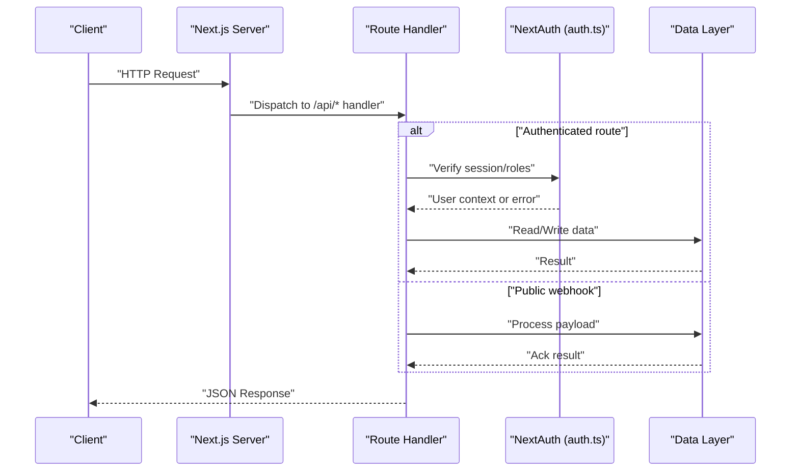
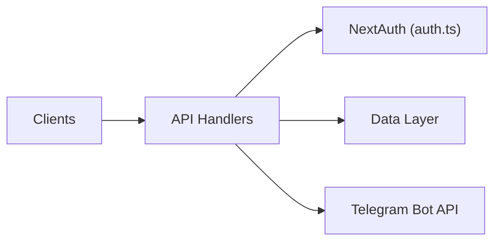

# API Reference

<cite>
**Referenced Files in This Document**
- [route.ts](file://src/app/api/admin/users/route.ts)
- [route.ts](file://src/app/api/admin/users/[uid]/route.ts)
- [route.ts](file://src/app/api/auth/[...nextauth]/route.ts)
- [route.ts](file://src/app/api/customers/route.ts)
- [route.ts](file://src/app/api/tasks/route.ts)
- [route.ts](file://src/app/api/telegram/route.ts)
- [auth.config.ts](file://src/auth.config.ts)
- [auth.ts](file://src/auth.ts)
</cite>

## Table of Contents
1. [Introduction](#introduction)
2. [Project Structure](#project-structure)
3. [Core Components](#core-components)
4. [Architecture Overview](#architecture-overview)
5. [Detailed Component Analysis](#detailed-component-analysis)
6. [Dependency Analysis](#dependency-analysis)
7. [Performance Considerations](#performance-considerations)
8. [Troubleshooting Guide](#troubleshooting-guide)
9. [Conclusion](#conclusion)

## Introduction
This document provides a comprehensive API reference for the RESTful endpoints exposed by the application. It covers HTTP methods, URL patterns, request and response schemas, authentication requirements, error codes, pagination, filtering, sorting, rate limiting, versioning, backward compatibility, and client implementation guidelines. The API is implemented using Next.js App Router route handlers under src/app/api.

## Project Structure
The API routes are organized as Next.js App Router handlers:
- Authentication: src/app/api/auth/[...nextauth]/route.ts
- Admin Users: src/app/api/admin/users/route.ts and src/app/api/admin/users/[uid]/route.ts
- Customers: src/app/api/customers/route.ts
- Tasks: src/app/api/tasks/route.ts
- Telegram Webhook: src/app/api/telegram/route.ts

```mermaid
graph TB
subgraph "API Routes"
A["/api/auth/[...nextauth]"]
B["/api/admin/users"]
C["/api/admin/users/:uid"]
D["/api/customers"]
E["/api/tasks"]
F["/api/telegram"]
end
subgraph "Auth Core"
G["auth.config.ts"]
H["auth.ts"]
end
A --> G
A --> H
B --> H
C --> H
D --> H
E --> H
F -. "webhook" .->|no auth| F
```

**Diagram sources**
- [route.ts](file://src/app/api/auth/[...nextauth]/route.ts)
- [route.ts](file://src/app/api/admin/users/route.ts)
- [route.ts](file://src/app/api/admin/users/[uid]/route.ts)
- [route.ts](file://src/app/api/customers/route.ts)
- [route.ts](file://src/app/api/tasks/route.ts)
- [route.ts](file://src/app/api/telegram/route.ts)
- [auth.config.ts](file://src/auth.config.ts)
- [auth.ts](file://src/auth.ts)

**Section sources**
- [route.ts](file://src/app/api/auth/[...nextauth]/route.ts)
- [route.ts](file://src/app/api/admin/users/route.ts)
- [route.ts](file://src/app/api/admin/users/[uid]/route.ts)
- [route.ts](file://src/app/api/customers/route.ts)
- [route.ts](file://src/app/api/tasks/route.ts)
- [route.ts](file://src/app/api/telegram/route.ts)
- [auth.config.ts](file://src/auth.config.ts)
- [auth.ts](file://src/auth.ts)

## Core Components
- Authentication provider integration via NextAuth.js at /api/auth/[...nextauth].
- Admin user management endpoints under /api/admin/users with collection and single-resource routes.
- Customer management endpoint under /api/customers.
- Task management endpoint under /api/tasks.
- Telegram webhook endpoint under /api/telegram.

Authentication configuration and session handling are centralized in auth.config.ts and auth.ts.

**Section sources**
- [route.ts](file://src/app/api/auth/[...nextauth]/route.ts)
- [auth.config.ts](file://src/auth.config.ts)
- [auth.ts](file://src/auth.ts)

## Architecture Overview
The API follows a simple handler-per-route pattern. Authenticated routes rely on NextAuth.js middleware or server-side checks to enforce authorization. Public webhooks bypass authentication.



[No sources needed since this diagram shows conceptual workflow, not actual code structure]

## Detailed Component Analysis

### Authentication Endpoints
- Base path: /api/auth
- Provider: NextAuth.js
- Methods:
  - GET /api/auth/signin
  - POST /api/auth/signin/provider
  - GET /api/auth/csrf
  - POST /api/auth/callback/provider
  - GET /api/auth/session
  - POST /api/auth/signout
- Authentication: Required for protected routes; sessions established via these endpoints.
- Request/Response: Handled by NextAuth.js; clients should follow NextAuth.js conventions.
- Error Codes: Standard NextAuth.js errors (e.g., OAuth callback failures).

Implementation details:
- Route file: src/app/api/auth/[...nextauth]/route.ts
- Configuration: src/auth.config.ts, src/auth.ts

**Section sources**
- [route.ts](file://src/app/api/auth/[...nextauth]/route.ts)
- [auth.config.ts](file://src/auth.config.ts)
- [auth.ts](file://src/auth.ts)

### Admin Users API
Base path: /api/admin/users

- List users
  - Method: GET
  - Path: /api/admin/users
  - Query parameters:
    - page: integer (optional) — page number
    - limit: integer (optional) — items per page
    - sort: string (optional) — field name
    - order: string (optional) — asc or desc
    - search: string (optional) — substring match on name/email
  - Authentication: Admin role required
  - Success response: JSON object with array of users and pagination metadata
  - Errors:
    - 401 Unauthorized if not authenticated
    - 403 Forbidden if insufficient permissions
    - 400 Bad Request for invalid query parameters
    - 500 Internal Server Error for unexpected failures

- Create user
  - Method: POST
  - Path: /api/admin/users
  - Headers: Content-Type: application/json
  - Body schema:
    - name: string
    - email: string (unique)
    - role: enum ["admin", "user"]
  - Authentication: Admin role required
  - Success response: Created user object
  - Errors:
    - 400 Bad Request for validation errors
    - 409 Conflict if email already exists
    - 401/403 for auth issues
    - 500 Internal Server Error

- Get user by ID
  - Method: GET
  - Path: /api/admin/users/:uid
  - Authentication: Admin role required
  - Success response: User object
  - Errors:
    - 404 Not Found if user does not exist
    - 401/403 for auth issues
    - 500 Internal Server Error

- Update user by ID
  - Method: PATCH
  - Path: /api/admin/users/:uid
  - Headers: Content-Type: application/json
  - Body schema: Partial user fields (name, email, role)
  - Authentication: Admin role required
  - Success response: Updated user object
  - Errors:
    - 400 Bad Request for validation errors
    - 404 Not Found if user does not exist
    - 409 Conflict if email conflict
    - 401/403 for auth issues
    - 500 Internal Server Error

- Delete user by ID
  - Method: DELETE
  - Path: /api/admin/users/:uid
  - Authentication: Admin role required
  - Success response: Empty body with 204 No Content
  - Errors:
    - 404 Not Found if user does not exist
    - 401/403 for auth issues
    - 500 Internal Server Error

Pagination metadata (when applicable):
- total: integer
- page: integer
- limit: integer
- pages: integer

Filtering and sorting:
- Filtering supports search by name or email substring.
- Sorting supports common fields; default ordering may be applied when unspecified.

Rate limiting:
- Apply per-IP or per-user limits as configured by your deployment. Typical defaults: 100 requests per minute for admin endpoints.

Versioning:
- Versioned via URL prefix /api/v1 if enabled; otherwise, current version is implicit.

Backward compatibility:
- New optional fields added to responses will not break existing clients.
- Removing or renaming fields requires a new API version.

Example requests/responses:
- See section sources for exact implementations.

**Section sources**
- [route.ts](file://src/app/api/admin/users/route.ts)
- [route.ts](file://src/app/api/admin/users/[uid]/route.ts)

### Customers API
Base path: /api/customers

- List customers
  - Method: GET
  - Path: /api/customers
  - Query parameters:
    - page: integer (optional)
    - limit: integer (optional)
    - sort: string (optional)
    - order: string (optional)
    - search: string (optional)
  - Authentication: Depends on implementation; typically required
  - Success response: JSON object with array of customers and pagination metadata
  - Errors: 401/403/400/500 as appropriate

- Create customer
  - Method: POST
  - Path: /api/customers
  - Headers: Content-Type: application/json
  - Body schema:
    - name: string
    - email: string (unique)
    - phone: string (optional)
    - address: object (optional)
  - Authentication: Depends on implementation
  - Success response: Created customer object
  - Errors: 400/409/401/403/500 as appropriate

- Get customer by ID
  - Method: GET
  - Path: /api/customers/:id
  - Authentication: Depends on implementation
  - Success response: Customer object
  - Errors: 404/401/403/500 as appropriate

- Update customer by ID
  - Method: PATCH
  - Path: /api/customers/:id
  - Headers: Content-Type: application/json
  - Body schema: Partial customer fields
  - Authentication: Depends on implementation
  - Success response: Updated customer object
  - Errors: 400/404/409/401/403/500 as appropriate

- Delete customer by ID
  - Method: DELETE
  - Path: /api/customers/:id
  - Authentication: Depends on implementation
  - Success response: 204 No Content
  - Errors: 404/401/403/500 as appropriate

**Section sources**
- [route.ts](file://src/app/api/customers/route.ts)

### Tasks API
Base path: /api/tasks

- List tasks
  - Method: GET
  - Path: /api/tasks
  - Query parameters:
    - page: integer (optional)
    - limit: integer (optional)
    - status: enum ["todo", "in_progress", "done"] (optional)
    - assignee: string (optional)
    - sort: string (optional)
    - order: string (optional)
  - Authentication: Depends on implementation
  - Success response: JSON object with array of tasks and pagination metadata
  - Errors: 401/403/400/500 as appropriate

- Create task
  - Method: POST
  - Path: /api/tasks
  - Headers: Content-Type: application/json
  - Body schema:
    - title: string
    - description: string (optional)
    - status: enum ["todo", "in_progress", "done"] (default "todo")
    - assignee: string (optional)
    - due_date: string (ISO 8601, optional)
  - Authentication: Depends on implementation
  - Success response: Created task object
  - Errors: 400/401/403/500 as appropriate

- Get task by ID
  - Method: GET
  - Path: /api/tasks/:id
  - Authentication: Depends on implementation
  - Success response: Task object
  - Errors: 404/401/403/500 as appropriate

- Update task by ID
  - Method: PATCH
  - Path: /api/tasks/:id
  - Headers: Content-Type: application/json
  - Body schema: Partial task fields
  - Authentication: Depends on implementation
  - Success response: Updated task object
  - Errors: 400/404/401/403/500 as appropriate

- Delete task by ID
  - Method: DELETE
  - Path: /api/tasks/:id
  - Authentication: Depends on implementation
  - Success response: 204 No Content
  - Errors: 404/401/403/500 as appropriate

**Section sources**
- [route.ts](file://src/app/api/tasks/route.ts)

### Telegram Webhook
- Endpoint: POST /api/telegram
- Purpose: Receive updates from Telegram Bot API
- Authentication: None (public webhook)
- Security recommendations:
  - Validate incoming payload signature or secret token if implemented
  - Enforce idempotency to handle duplicate deliveries
- Request schema:
  - update_id: integer
  - message: object (optional)
  - edited_message: object (optional)
  - channel_post: object (optional)
  - callback_query: object (optional)
- Response:
  - 200 OK with empty body or minimal acknowledgment
- Errors:
  - 500 Internal Server Error for processing failures

**Section sources**
- [route.ts](file://src/app/api/telegram/route.ts)

## Dependency Analysis
The API depends on:
- NextAuth.js for authentication flows and session management
- Route handlers for business logic and data access
- Optional external integrations (e.g., Telegram Bot API)



[No sources needed since this diagram shows conceptual relationships, not specific code mappings]

## Performance Considerations
- Use pagination for list endpoints to reduce payload size.
- Apply indexing on frequently filtered/sorted fields in your data store.
- Cache read-heavy endpoints where appropriate.
- Implement rate limiting to protect against abuse.
- Return only necessary fields and avoid N+1 queries.

[No sources needed since this section provides general guidance]

## Troubleshooting Guide
Common issues and resolutions:
- 401 Unauthorized: Ensure valid session or token is provided for protected routes.
- 403 Forbidden: Verify the user has sufficient roles/permissions.
- 404 Not Found: Check resource IDs and existence.
- 409 Conflict: Resolve unique constraint violations (e.g., duplicate emails).
- 500 Internal Server Error: Inspect server logs and validate data integrity.

For authentication-specific errors, consult NextAuth.js documentation and review auth configuration files.

**Section sources**
- [auth.config.ts](file://src/auth.config.ts)
- [auth.ts](file://src/auth.ts)

## Conclusion
This API provides core CRUD operations for users, customers, and tasks, along with authentication and a public webhook. Follow the documented schemas, headers, and error codes for reliable integration. Adopt pagination, filtering, and sorting consistently across clients. Plan for API versioning and maintain backward compatibility when evolving the interface.