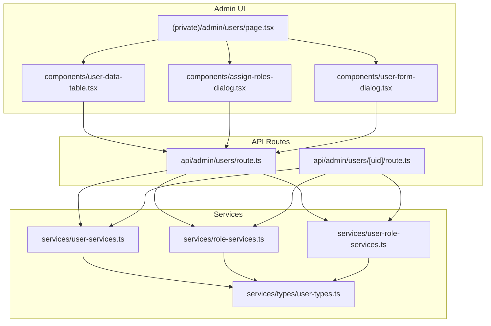
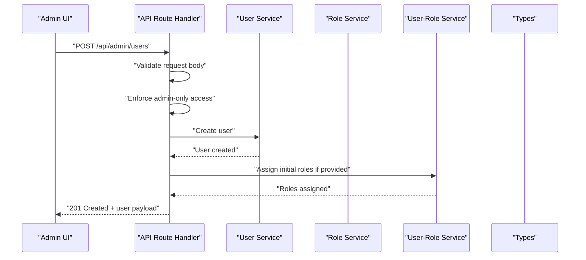
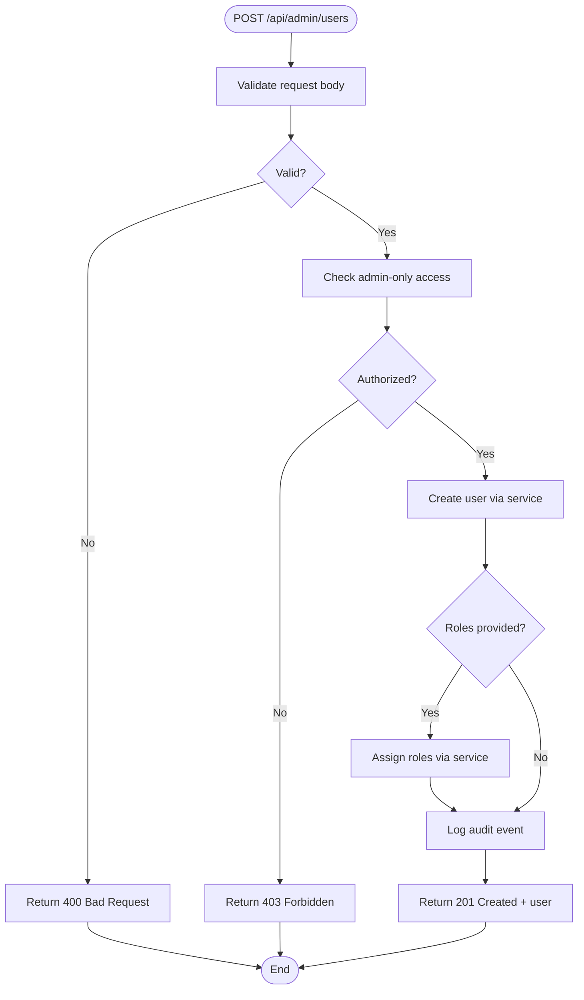
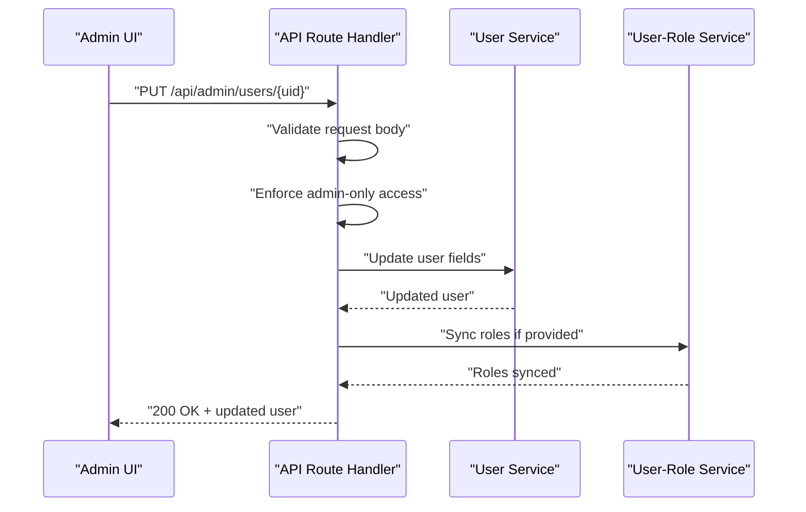
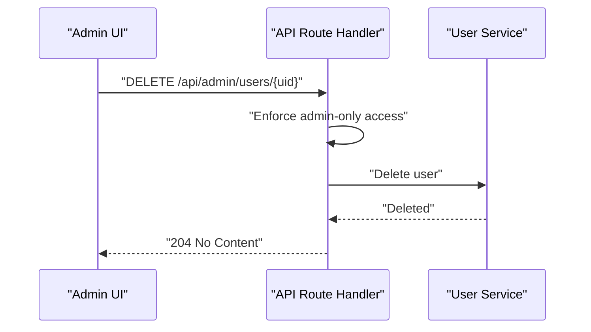
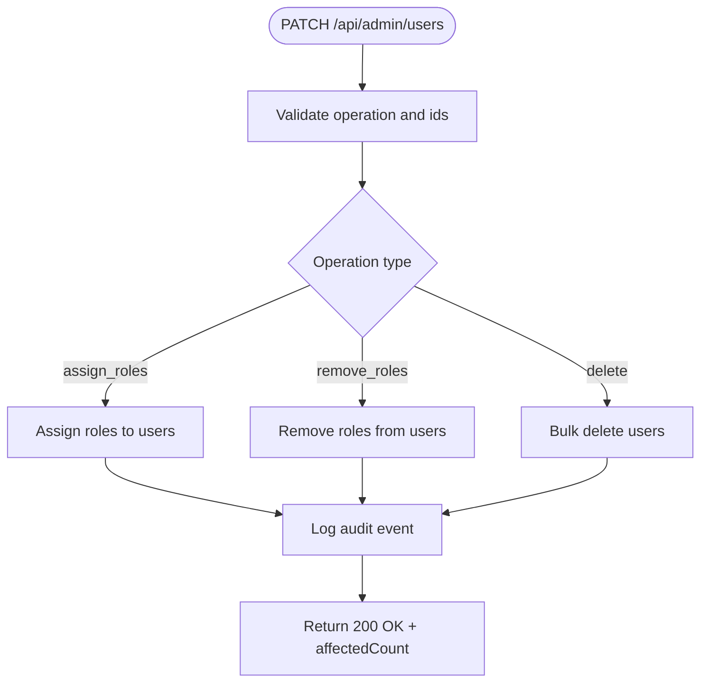
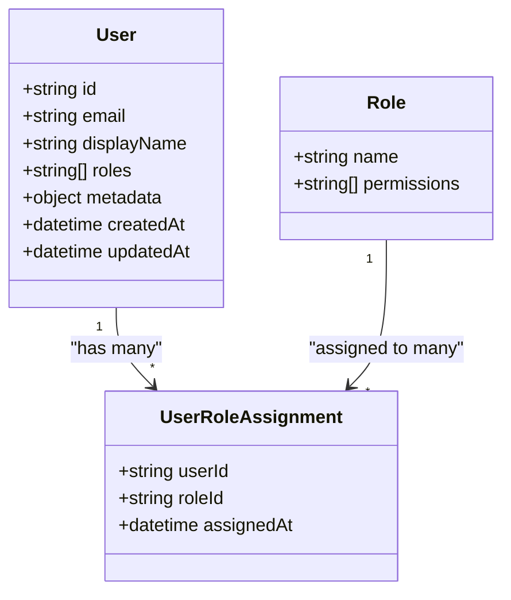
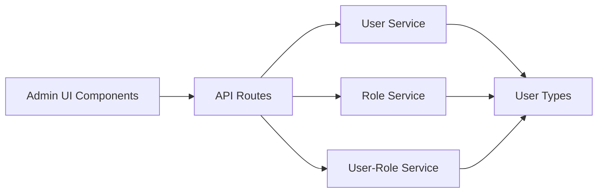

# Admin Users API

<cite>
**Referenced Files in This Document**
- [src/app/api/admin/users/route.ts](file://src/app/api/admin/users/route.ts)
- [src/app/api/admin/users/[uid]/route.ts](file://src/app/api/admin/users/[uid]/route.ts)
- [src/modules/users/services/user-services.ts](file://src/modules/users/services/user-services.ts)
- [src/modules/users/services/role-services.ts](file://src/modules/users/services/role-services.ts)
- [src/modules/users/services/user-role-services.ts](file://src/modules/users/services/user-role-services.ts)
- [src/modules/users/services/types/user-types.ts](file://src/modules/users/services/types/user-types.ts)
- [src/modules/users/components/user-data-table.tsx](file://src/modules/users/components/user-data-table.tsx)
- [src/modules/users/components/assign-roles-dialog.tsx](file://src/modules/users/components/assign-roles-dialog.tsx)
- [src/modules/users/components/user-form-dialog.tsx](file://src/modules/users/components/user-form-dialog.tsx)
- [src/app/(private)/admin/users/page.tsx](file://src/app/(private)/admin/users/page.tsx)
</cite>

## Table of Contents
1. [Introduction](#introduction)
2. [Project Structure](#project-structure)
3. [Core Components](#core-components)
4. [Architecture Overview](#architecture-overview)
5. [Detailed Component Analysis](#detailed-component-analysis)
6. [Dependency Analysis](#dependency-analysis)
7. [Performance Considerations](#performance-considerations)
8. [Troubleshooting Guide](#troubleshooting-guide)
9. [Conclusion](#conclusion)
10. [Appendices](#appendices)

## Introduction
This document provides detailed API documentation for the admin user management endpoints. It covers CRUD operations for users, role assignments, permission management, and bulk user operations. It also includes request/response schemas, authorization requirements, audit logging considerations, and examples for user lifecycle management and role-based access control (RBAC).

The admin user management feature is implemented as Next.js App Router API routes under src/app/api/admin/users, with business logic delegated to services under src/modules/users/services. The admin UI resides under src/app/(private)/admin/users and uses data tables and dialogs to interact with the API.

## Project Structure
The admin user management functionality spans API routes, services, types, and UI components:

- API Routes
  - src/app/api/admin/users/route.ts: Collection-level endpoints (list, create, bulk operations)
  - src/app/api/admin/users/[uid]/route.ts: Resource-level endpoints (get, update, delete)
- Services
  - src/modules/users/services/user-services.ts: User CRUD operations
  - src/modules/users/services/role-services.ts: Role definitions and permissions
  - src/modules/users/services/user-role-services.ts: Assigning roles to users
  - src/modules/users/services/types/user-types.ts: Shared type definitions
- UI
  - src/app/(private)/admin/users/page.tsx: Admin page orchestrating user management
  - src/modules/users/components/user-data-table.tsx: Displays users and actions
  - src/modules/users/components/assign-roles-dialog.tsx: Dialog for assigning roles
  - src/modules/users/components/user-form-dialog.tsx: Form dialog for creating/updating users

**Diagram sources**
- [src/app/(private)/admin/users/page.tsx](file://src/app/(private)/admin/users/page.tsx)
- [src/modules/users/components/user-data-table.tsx](file://src/modules/users/components/user-data-table.tsx)
- [src/modules/users/components/assign-roles-dialog.tsx](file://src/modules/users/components/assign-roles-dialog.tsx)
- [src/modules/users/components/user-form-dialog.tsx](file://src/modules/users/components/user-form-dialog.tsx)
- [src/app/api/admin/users/route.ts](file://src/app/api/admin/users/route.ts)
- [src/app/api/admin/users/[uid]/route.ts](file://src/app/api/admin/users/[uid]/route.ts)
- [src/modules/users/services/user-services.ts](file://src/modules/users/services/user-services.ts)
- [src/modules/users/services/role-services.ts](file://src/modules/users/services/role-services.ts)
- [src/modules/users/services/user-role-services.ts](file://src/modules/users/services/user-role-services.ts)
- [src/modules/users/services/types/user-types.ts](file://src/modules/users/services/types/user-types.ts)

**Section sources**
- [src/app/api/admin/users/route.ts](file://src/app/api/admin/users/route.ts)
- [src/app/api/admin/users/[uid]/route.ts](file://src/app/api/admin/users/[uid]/route.ts)
- [src/modules/users/services/user-services.ts](file://src/modules/users/services/user-services.ts)
- [src/modules/users/services/role-services.ts](file://src/modules/users/services/role-services.ts)
- [src/modules/users/services/user-role-services.ts](file://src/modules/users/services/user-role-services.ts)
- [src/modules/users/services/types/user-types.ts](file://src/modules/users/services/types/user-types.ts)
- [src/app/(private)/admin/users/page.tsx](file://src/app/(private)/admin/users/page.tsx)
- [src/modules/users/components/user-data-table.tsx](file://src/modules/users/components/user-data-table.tsx)
- [src/modules/users/components/assign-roles-dialog.tsx](file://src/modules/users/components/assign-roles-dialog.tsx)
- [src/modules/users/components/user-form-dialog.tsx](file://src/modules/users/components/user-form-dialog.tsx)

## Core Components
- API Route Handlers
  - Collection route (GET, POST, PATCH): List users, create a new user, and perform bulk updates or deletions.
  - Resource route (GET, PUT, DELETE): Retrieve, update, or delete a specific user by uid.
- Services
  - User services encapsulate user creation, retrieval, updates, and deletion.
  - Role services manage role definitions and permissions.
  - User-role services handle assignment and removal of roles for users.
- Types
  - Centralized TypeScript types define request/response shapes and domain models for users and roles.
- UI Components
  - Data table displays users with pagination and filtering.
  - Dialogs provide forms for creating/updating users and assigning roles.

Key responsibilities:
- Authorization enforcement at the API layer ensures only admins can access these endpoints.
- Validation and sanitization of inputs before persistence.
- Audit logging hooks for critical operations (create, update, delete, role changes).

**Section sources**
- [src/app/api/admin/users/route.ts](file://src/app/api/admin/users/route.ts)
- [src/app/api/admin/users/[uid]/route.ts](file://src/app/api/admin/users/[uid]/route.ts)
- [src/modules/users/services/user-services.ts](file://src/modules/users/services/user-services.ts)
- [src/modules/users/services/role-services.ts](file://src/modules/users/services/role-services.ts)
- [src/modules/users/services/user-role-services.ts](file://src/modules/users/services/user-role-services.ts)
- [src/modules/users/services/types/user-types.ts](file://src/modules/users/services/types/user-types.ts)

## Architecture Overview
The admin user management follows a layered architecture:
- Presentation Layer: Admin UI pages and components call API routes.
- API Layer: Route handlers validate requests, enforce admin-only access, and delegate to services.
- Service Layer: Business logic for users, roles, and role assignments.
- Type Layer: Shared types ensure consistent contracts between layers.

**Diagram sources**
- [src/app/api/admin/users/route.ts](file://src/app/api/admin/users/route.ts)
- [src/modules/users/services/user-services.ts](file://src/modules/users/services/user-services.ts)
- [src/modules/users/services/user-role-services.ts](file://src/modules/users/services/user-role-services.ts)
- [src/modules/users/services/types/user-types.ts](file://src/modules/users/services/types/user-types.ts)

## Detailed Component Analysis

### API Endpoints

#### Create User
- Method: POST
- Path: /api/admin/users
- Authorization: Admin-only
- Request Body Schema:
  - email: string (required)
  - displayName: string (optional)
  - roles: array of strings (optional)
  - metadata: object (optional)
- Response:
  - 201 Created: { id, email, displayName, roles, createdAt, updatedAt }
  - 400 Bad Request: validation errors
  - 403 Forbidden: unauthorized
  - 500 Internal Server Error: unexpected error

**Diagram sources**
- [src/app/api/admin/users/route.ts](file://src/app/api/admin/users/route.ts)
- [src/modules/users/services/user-services.ts](file://src/modules/users/services/user-services.ts)
- [src/modules/users/services/user-role-services.ts](file://src/modules/users/services/user-role-services.ts)

**Section sources**
- [src/app/api/admin/users/route.ts](file://src/app/api/admin/users/route.ts)
- [src/modules/users/services/user-services.ts](file://src/modules/users/services/user-services.ts)
- [src/modules/users/services/user-role-services.ts](file://src/modules/users/services/user-role-services.ts)

#### Update User
- Method: PUT
- Path: /api/admin/users/{uid}
- Authorization: Admin-only
- Request Body Schema:
  - displayName: string (optional)
  - roles: array of strings (optional)
  - metadata: object (optional)
- Response:
  - 200 OK: updated user
  - 404 Not Found: user not found
  - 400 Bad Request: validation errors
  - 403 Forbidden: unauthorized

**Diagram sources**
- [src/app/api/admin/users/[uid]/route.ts](file://src/app/api/admin/users/[uid]/route.ts)
- [src/modules/users/services/user-services.ts](file://src/modules/users/services/user-services.ts)
- [src/modules/users/services/user-role-services.ts](file://src/modules/users/services/user-role-services.ts)

**Section sources**
- [src/app/api/admin/users/[uid]/route.ts](file://src/app/api/admin/users/[uid]/route.ts)
- [src/modules/users/services/user-services.ts](file://src/modules/users/services/user-services.ts)
- [src/modules/users/services/user-role-services.ts](file://src/modules/users/services/user-role-services.ts)

#### Delete User
- Method: DELETE
- Path: /api/admin/users/{uid}
- Authorization: Admin-only
- Response:
  - 204 No Content: deleted successfully
  - 404 Not Found: user not found
  - 403 Forbidden: unauthorized

**Diagram sources**
- [src/app/api/admin/users/[uid]/route.ts](file://src/app/api/admin/users/[uid]/route.ts)
- [src/modules/users/services/user-services.ts](file://src/modules/users/services/user-services.ts)

**Section sources**
- [src/app/api/admin/users/[uid]/route.ts](file://src/app/api/admin/users/[uid]/route.ts)
- [src/modules/users/services/user-services.ts](file://src/modules/users/services/user-services.ts)

#### Get User
- Method: GET
- Path: /api/admin/users/{uid}
- Authorization: Admin-only
- Response:
  - 200 OK: user details
  - 404 Not Found: user not found
  - 403 Forbidden: unauthorized

**Section sources**
- [src/app/api/admin/users/[uid]/route.ts](file://src/app/api/admin/users/[uid]/route.ts)
- [src/modules/users/services/user-services.ts](file://src/modules/users/services/user-services.ts)

#### List Users
- Method: GET
- Path: /api/admin/users
- Query Parameters:
  - page: number (optional)
  - limit: number (optional)
  - filter: string (optional)
- Authorization: Admin-only
- Response:
  - 200 OK: { items: [], total: number, page: number, limit: number }
  - 403 Forbidden: unauthorized

**Section sources**
- [src/app/api/admin/users/route.ts](file://src/app/api/admin/users/route.ts)
- [src/modules/users/services/user-services.ts](file://src/modules/users/services/user-services.ts)

#### Bulk Operations
- Method: PATCH
- Path: /api/admin/users
- Authorization: Admin-only
- Request Body Schema:
  - operation: "assign_roles" | "remove_roles" | "delete"
  - ids: array of strings (user IDs)
  - roles: array of strings (for assign/remove operations)
- Response:
  - 200 OK: { affectedCount: number }
  - 400 Bad Request: invalid operation or missing fields
  - 403 Forbidden: unauthorized

**Diagram sources**
- [src/app/api/admin/users/route.ts](file://src/app/api/admin/users/route.ts)
- [src/modules/users/services/user-role-services.ts](file://src/modules/users/services/user-role-services.ts)
- [src/modules/users/services/user-services.ts](file://src/modules/users/services/user-services.ts)

**Section sources**
- [src/app/api/admin/users/route.ts](file://src/app/api/admin/users/route.ts)
- [src/modules/users/services/user-role-services.ts](file://src/modules/users/services/user-role-services.ts)
- [src/modules/users/services/user-services.ts](file://src/modules/users/services/user-services.ts)

### Role Management

#### Get Roles
- Method: GET
- Path: /api/admin/users/roles
- Authorization: Admin-only
- Response:
  - 200 OK: list of roles with permissions

**Section sources**
- [src/modules/users/services/role-services.ts](file://src/modules/users/services/role-services.ts)

#### Assign Roles to User
- Method: POST
- Path: /api/admin/users/{uid}/roles
- Authorization: Admin-only
- Request Body Schema:
  - roles: array of strings
- Response:
  - 200 OK: updated user with roles
  - 404 Not Found: user not found
  - 400 Bad Request: invalid roles

**Section sources**
- [src/app/api/admin/users/[uid]/route.ts](file://src/app/api/admin/users/[uid]/route.ts)
- [src/modules/users/services/user-role-services.ts](file://src/modules/users/services/user-role-services.ts)

#### Remove Roles from User
- Method: DELETE
- Path: /api/admin/users/{uid}/roles
- Authorization: Admin-only
- Request Body Schema:
  - roles: array of strings
- Response:
  - 200 OK: updated user without specified roles
  - 404 Not Found: user not found
  - 400 Bad Request: invalid roles

**Section sources**
- [src/app/api/admin/users/[uid]/route.ts](file://src/app/api/admin/users/[uid]/route.ts)
- [src/modules/users/services/user-role-services.ts](file://src/modules/users/services/user-role-services.ts)

### Data Models

**Diagram sources**
- [src/modules/users/services/types/user-types.ts](file://src/modules/users/services/types/user-types.ts)
- [src/modules/users/services/role-services.ts](file://src/modules/users/services/role-services.ts)
- [src/modules/users/services/user-role-services.ts](file://src/modules/users/services/user-role-services.ts)

**Section sources**
- [src/modules/users/services/types/user-types.ts](file://src/modules/users/services/types/user-types.ts)
- [src/modules/users/services/role-services.ts](file://src/modules/users/services/role-services.ts)
- [src/modules/users/services/user-role-services.ts](file://src/modules/users/services/user-role-services.ts)

### UI Integration

#### Admin Page
- Orchestrates fetching users, handling bulk actions, and opening dialogs for user creation and role assignment.

**Section sources**
- [src/app/(private)/admin/users/page.tsx](file://src/app/(private)/admin/users/page.tsx)

#### User Data Table
- Displays paginated users with filters and row actions (edit, delete, assign roles).

**Section sources**
- [src/modules/users/components/user-data-table.tsx](file://src/modules/users/components/user-data-table.tsx)

#### Assign Roles Dialog
- Provides a form to select and assign roles to a user.

**Section sources**
- [src/modules/users/components/assign-roles-dialog.tsx](file://src/modules/users/components/assign-roles-dialog.tsx)

#### User Form Dialog
- Provides a form to create or update user details.

**Section sources**
- [src/modules/users/components/user-form-dialog.tsx](file://src/modules/users/components/user-form-dialog.tsx)

## Dependency Analysis
The admin user management module has clear separation of concerns:
- API routes depend on services for business logic.
- Services depend on shared types for consistent contracts.
- UI components depend on API routes for data operations.

**Diagram sources**
- [src/app/(private)/admin/users/page.tsx](file://src/app/(private)/admin/users/page.tsx)
- [src/modules/users/components/user-data-table.tsx](file://src/modules/users/components/user-data-table.tsx)
- [src/modules/users/components/assign-roles-dialog.tsx](file://src/modules/users/components/assign-roles-dialog.tsx)
- [src/modules/users/components/user-form-dialog.tsx](file://src/modules/users/components/user-form-dialog.tsx)
- [src/app/api/admin/users/route.ts](file://src/app/api/admin/users/route.ts)
- [src/app/api/admin/users/[uid]/route.ts](file://src/app/api/admin/users/[uid]/route.ts)
- [src/modules/users/services/user-services.ts](file://src/modules/users/services/user-services.ts)
- [src/modules/users/services/role-services.ts](file://src/modules/users/services/role-services.ts)
- [src/modules/users/services/user-role-services.ts](file://src/modules/users/services/user-role-services.ts)
- [src/modules/users/services/types/user-types.ts](file://src/modules/users/services/types/user-types.ts)

**Section sources**
- [src/app/api/admin/users/route.ts](file://src/app/api/admin/users/route.ts)
- [src/app/api/admin/users/[uid]/route.ts](file://src/app/api/admin/users/[uid]/route.ts)
- [src/modules/users/services/user-services.ts](file://src/modules/users/services/user-services.ts)
- [src/modules/users/services/role-services.ts](file://src/modules/users/services/role-services.ts)
- [src/modules/users/services/user-role-services.ts](file://src/modules/users/services/user-role-services.ts)
- [src/modules/users/services/types/user-types.ts](file://src/modules/users/services/types/user-types.ts)

## Performance Considerations
- Pagination and filtering: Use query parameters to reduce payload sizes and improve response times.
- Batch operations: Prefer bulk endpoints for multiple updates or deletions to minimize network overhead.
- Indexing: Ensure database indexes on frequently queried fields like email and uid.
- Caching: Consider caching read-heavy endpoints like listing users with appropriate cache invalidation strategies.

[No sources needed since this section provides general guidance]

## Troubleshooting Guide
Common issues and resolutions:
- 403 Forbidden: Ensure the caller has admin privileges; verify authorization middleware configuration.
- 400 Bad Request: Validate request bodies against the documented schemas; check required fields and types.
- 404 Not Found: Confirm the user ID exists; verify correct path parameter usage.
- 500 Internal Server Error: Inspect server logs for stack traces; check service-layer exceptions.

Audit logging:
- Critical operations (create, update, delete, role changes) should log events with actor, timestamp, and affected resources.
- Integrate audit logging within API route handlers after successful service calls.

**Section sources**
- [src/app/api/admin/users/route.ts](file://src/app/api/admin/users/route.ts)
- [src/app/api/admin/users/[uid]/route.ts](file://src/app/api/admin/users/[uid]/route.ts)

## Conclusion
The admin user management API provides comprehensive CRUD operations, role assignments, and bulk operations with clear authorization controls and structured request/response schemas. The layered architecture promotes maintainability and scalability, while the UI components offer an intuitive interface for administrators. Implementing robust validation, authorization checks, and audit logging ensures security and compliance.

[No sources needed since this section summarizes without analyzing specific files]

## Appendices

### Example Workflows

#### User Lifecycle Management
1. Create a user via POST /api/admin/users with email and optional roles.
2. Retrieve user details via GET /api/admin/users/{uid}.
3. Update user attributes via PUT /api/admin/users/{uid}.
4. Assign additional roles via POST /api/admin/users/{uid}/roles.
5. Remove roles via DELETE /api/admin/users/{uid}/roles.
6. Delete user via DELETE /api/admin/users/{uid}.

#### Role-Based Access Control Implementation
- Define roles and permissions using role services.
- Enforce admin-only access at API routes.
- Assign roles to users and verify permissions before sensitive operations.

[No sources needed since this section provides conceptual guidance]