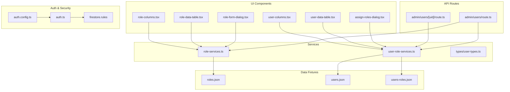
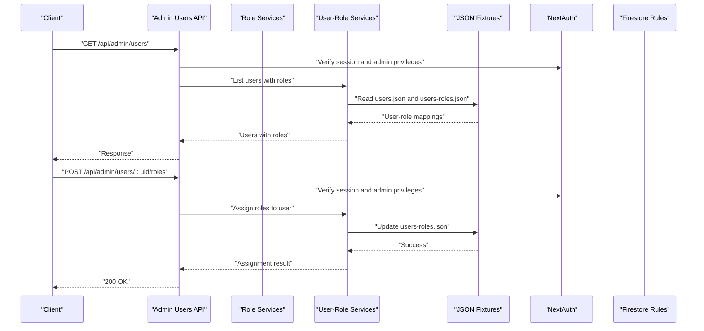
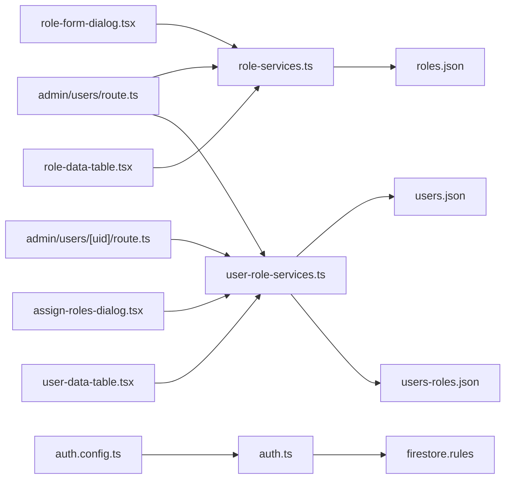
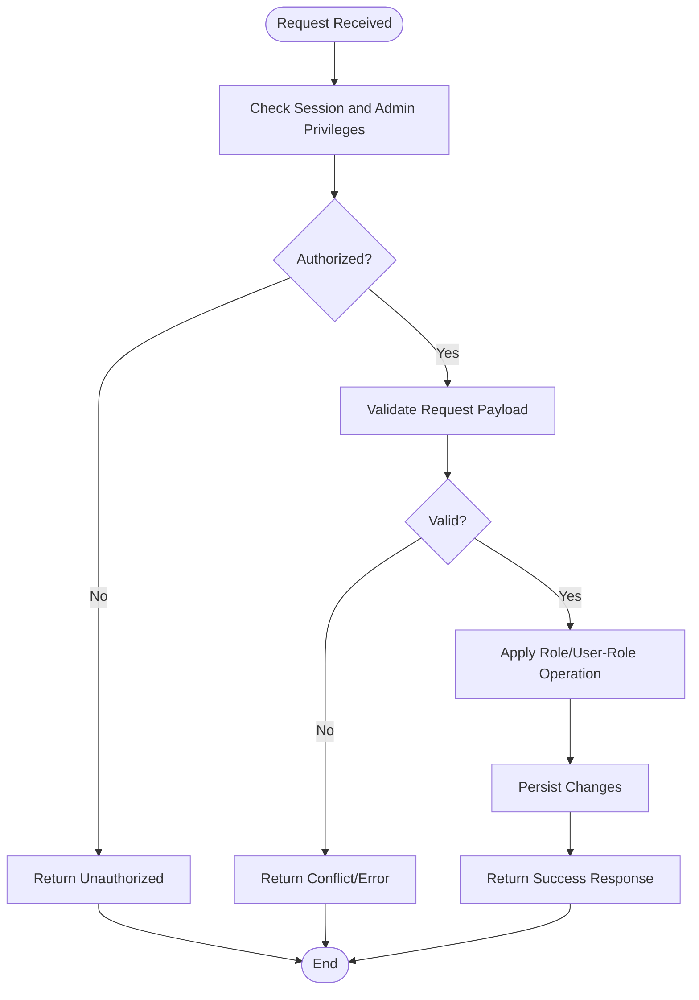

# Role Management API

<cite>
**Referenced Files in This Document**
- [src/app/api/admin/users/route.ts](file://src/app/api/admin/users/route.ts)
- [src/app/api/admin/users/[uid]/route.ts](file://src/app/api/admin/users/[uid]/route.ts)
- [src/modules/users/services/role-services.ts](file://src/modules/users/services/role-services.ts)
- [src/modules/users/services/user-role-services.ts](file://src/modules/users/services/user-role-services.ts)
- [src/modules/users/services/types/user-types.ts](file://src/modules/users/services/types/user-types.ts)
- [src/modules/users/components/assign-roles-dialog.tsx](file://src/modules/users/components/assign-roles-dialog.tsx)
- [src/modules/users/components/role-form-dialog.tsx](file://src/modules/users/components/role-form-dialog.tsx)
- [src/modules/users/components/role-data-table.tsx](file://src/modules/users/components/role-data-table.tsx)
- [src/modules/users/components/role-columns.tsx](file://src/modules/users/components/role-columns.tsx)
- [src/modules/users/components/user-data-table.tsx](file://src/modules/users/components/user-data-table.tsx)
- [src/modules/users/components/user-columns.tsx](file://src/modules/users/components/user-columns.tsx)
- [src/modules/users/services/data/roles.json](file://src/modules/users/services/data/roles.json)
- [src/modules/users/services/data/users-roles.json](file://src/modules/users/services/data/users-roles.json)
- [src/modules/users/services/data/users.json](file://src/modules/users/services/data/users.json)
- [src/auth.config.ts](file://src/auth.config.ts)
- [src/auth.ts](file://src/auth.ts)
- [firestore.rules](file://firestore.rules)
</cite>

## Table of Contents
1. [Introduction](#introduction)
2. [Project Structure](#project-structure)
3. [Core Components](#core-components)
4. [Architecture Overview](#architecture-overview)
5. [Detailed Component Analysis](#detailed-component-analysis)
6. [Dependency Analysis](#dependency-analysis)
7. [Performance Considerations](#performance-considerations)
8. [Troubleshooting Guide](#troubleshooting-guide)
9. [Conclusion](#conclusion)
10. [Appendices](#appendices)

## Introduction
This document provides detailed API documentation for role-based access control (RBAC) endpoints and related client-side components. It covers role creation, assignment, modification, deletion, permission management within roles, and querying user-role relationships. It also documents data models, permission hierarchies, inheritance patterns, example workflows, bulk operations, security considerations, validation rules, integration with the authentication system, and error handling strategies.

The implementation is a Next.js application using App Router API routes under src/app/api/admin/users, with role and user-role services located under src/modules/users/services. Data is currently backed by JSON fixtures in src/modules/users/services/data. Authentication configuration resides in src/auth.config.ts and src/auth.ts, and Firestore security rules are defined in firestore.rules.

## Project Structure
The RBAC-related code is organized as follows:
- API routes: src/app/api/admin/users
  - List users and manage admin operations
  - Per-user operations including role assignments
- Services: src/modules/users/services
  - Role services for CRUD and permissions
  - User-role services for assignments and queries
- Types: src/modules/users/services/types/user-types.ts
- UI components: src/modules/users/components
  - Role forms, dialogs, tables, and columns
  - User tables and assign roles dialog
- Data fixtures: src/modules/users/services/data
  - roles.json, users.json, users-roles.json
- Auth integration: src/auth.config.ts, src/auth.ts
- Security rules: firestore.rules

**Diagram sources**
- [src/app/api/admin/users/route.ts](file://src/app/api/admin/users/route.ts)
- [src/app/api/admin/users/[uid]/route.ts](file://src/app/api/admin/users/[uid]/route.ts)
- [src/modules/users/services/role-services.ts](file://src/modules/users/services/role-services.ts)
- [src/modules/users/services/user-role-services.ts](file://src/modules/users/services/user-role-services.ts)
- [src/modules/users/services/types/user-types.ts](file://src/modules/users/services/types/user-types.ts)
- [src/modules/users/services/data/roles.json](file://src/modules/users/services/data/roles.json)
- [src/modules/users/services/data/users.json](file://src/modules/users/services/data/users.json)
- [src/modules/users/services/data/users-roles.json](file://src/modules/users/services/data/users-roles.json)
- [src/modules/users/components/role-form-dialog.tsx](file://src/modules/users/components/role-form-dialog.tsx)
- [src/modules/users/components/assign-roles-dialog.tsx](file://src/modules/users/components/assign-roles-dialog.tsx)
- [src/modules/users/components/role-data-table.tsx](file://src/modules/users/components/role-data-table.tsx)
- [src/modules/users/components/role-columns.tsx](file://src/modules/users/components/role-columns.tsx)
- [src/modules/users/components/user-data-table.tsx](file://src/modules/users/components/user-data-table.tsx)
- [src/modules/users/components/user-columns.tsx](file://src/modules/users/components/user-columns.tsx)
- [src/auth.config.ts](file://src/auth.config.ts)
- [src/auth.ts](file://src/auth.ts)
- [firestore.rules](file://firestore.rules)

**Section sources**
- [src/app/api/admin/users/route.ts](file://src/app/api/admin/users/route.ts)
- [src/app/api/admin/users/[uid]/route.ts](file://src/app/api/admin/users/[uid]/route.ts)
- [src/modules/users/services/role-services.ts](file://src/modules/users/services/role-services.ts)
- [src/modules/users/services/user-role-services.ts](file://src/modules/users/services/user-role-services.ts)
- [src/modules/users/services/types/user-types.ts](file://src/modules/users/services/types/user-types.ts)
- [src/modules/users/services/data/roles.json](file://src/modules/users/services/data/roles.json)
- [src/modules/users/services/data/users.json](file://src/modules/users/services/data/users.json)
- [src/modules/users/services/data/users-roles.json](file://src/modules/users/services/data/users-roles.json)
- [src/modules/users/components/role-form-dialog.tsx](file://src/modules/users/components/role-form-dialog.tsx)
- [src/modules/users/components/assign-roles-dialog.tsx](file://src/modules/users/components/assign-roles-dialog.tsx)
- [src/modules/users/components/role-data-table.tsx](file://src/modules/users/components/role-data-table.tsx)
- [src/modules/users/components/role-columns.tsx](file://src/modules/users/components/role-columns.tsx)
- [src/modules/users/components/user-data-table.tsx](file://src/modules/users/components/user-data-table.tsx)
- [src/modules/users/components/user-columns.tsx](file://src/modules/users/components/user-columns.tsx)
- [src/auth.config.ts](file://src/auth.config.ts)
- [src/auth.ts](file://src/auth.ts)
- [firestore.rules](file://firestore.rules)

## Core Components
- Admin Users API route: Provides endpoints to list users and perform administrative actions. It integrates with role and user-role services to support RBAC operations.
- Per-user API route: Handles per-user operations such as assigning or removing roles.
- Role services: Encapsulate role CRUD operations, permission updates, and role hierarchy logic.
- User-role services: Manage assignments between users and roles, including bulk operations and relationship queries.
- Types: Define shared TypeScript interfaces for roles, users, and user-role mappings.
- UI components: Provide interactive forms and tables for managing roles and user-role relationships.
- Data fixtures: JSON files that simulate backend storage for roles, users, and user-role mappings.
- Auth integration: NextAuth configuration and runtime to enforce authentication and authorization at the API layer.
- Security rules: Firestore rules to restrict read/write access based on roles and permissions.

**Section sources**
- [src/app/api/admin/users/route.ts](file://src/app/api/admin/users/route.ts)
- [src/app/api/admin/users/[uid]/route.ts](file://src/app/api/admin/users/[uid]/route.ts)
- [src/modules/users/services/role-services.ts](file://src/modules/users/services/role-services.ts)
- [src/modules/users/services/user-role-services.ts](file://src/modules/users/services/user-role-services.ts)
- [src/modules/users/services/types/user-types.ts](file://src/modules/users/services/types/user-types.ts)
- [src/modules/users/components/role-form-dialog.tsx](file://src/modules/users/components/role-form-dialog.tsx)
- [src/modules/users/components/assign-roles-dialog.tsx](file://src/modules/users/components/assign-roles-dialog.tsx)
- [src/modules/users/components/role-data-table.tsx](file://src/modules/users/components/role-data-table.tsx)
- [src/modules/users/components/role-columns.tsx](file://src/modules/users/components/role-columns.tsx)
- [src/modules/users/components/user-data-table.tsx](file://src/modules/users/components/user-data-table.tsx)
- [src/modules/users/components/user-columns.tsx](file://src/modules/users/components/user-columns.tsx)
- [src/modules/users/services/data/roles.json](file://src/modules/users/services/data/roles.json)
- [src/modules/users/services/data/users.json](file://src/modules/users/services/data/users.json)
- [src/modules/users/services/data/users-roles.json](file://src/modules/users/services/data/users-roles.json)
- [src/auth.config.ts](file://src/auth.config.ts)
- [src/auth.ts](file://src/auth.ts)
- [firestore.rules](file://firestore.rules)

## Architecture Overview
The RBAC architecture combines Next.js API routes with service modules and JSON-backed data stores. Authentication is handled via NextAuth, which enforces session-based access control. Firestore rules provide an additional layer of server-side authorization.

**Diagram sources**
- [src/app/api/admin/users/route.ts](file://src/app/api/admin/users/route.ts)
- [src/app/api/admin/users/[uid]/route.ts](file://src/app/api/admin/users/[uid]/route.ts)
- [src/modules/users/services/user-role-services.ts](file://src/modules/users/services/user-role-services.ts)
- [src/modules/users/services/data/users.json](file://src/modules/users/services/data/users.json)
- [src/modules/users/services/data/users-roles.json](file://src/modules/users/services/data/users-roles.json)
- [src/auth.config.ts](file://src/auth.config.ts)
- [src/auth.ts](file://src/auth.ts)
- [firestore.rules](file://firestore.rules)

## Detailed Component Analysis

### Admin Users API Route
- Purpose: Exposes endpoints for listing users and performing admin-level operations.
- Key responsibilities:
  - Validate authenticated requests using NextAuth.
  - Enforce admin privileges before delegating to services.
  - Return standardized responses for success and error cases.
- Integration points:
  - Calls role-services.ts for role-related operations.
  - Calls user-role-services.ts for user-role mapping operations.

**Section sources**
- [src/app/api/admin/users/route.ts](file://src/app/api/admin/users/route.ts)
- [src/auth.config.ts](file://src/auth.config.ts)
- [src/auth.ts](file://src/auth.ts)

### Per-User API Route
- Purpose: Manages per-user operations, particularly role assignments and removals.
- Key responsibilities:
  - Accept user ID from URL parameters.
  - Validate request payload for role IDs.
  - Delegate to user-role-services.ts for assignment/removal.
  - Handle conflicts and unauthorized attempts.

**Section sources**
- [src/app/api/admin/users/[uid]/route.ts](file://src/app/api/admin/users/[uid]/route.ts)
- [src/modules/users/services/user-role-services.ts](file://src/modules/users/services/user-role-services.ts)

### Role Services
- Purpose: Implements role CRUD operations and permission management.
- Key responsibilities:
  - Create, update, delete roles.
  - Update role permissions and handle permission hierarchies.
  - Validate role names and permission sets.
- Data sources:
  - Reads/writes roles.json fixture.
- Error handling:
  - Returns conflict errors for duplicate role names.
  - Validates permission sets against allowed definitions.

**Section sources**
- [src/modules/users/services/role-services.ts](file://src/modules/users/services/role-services.ts)
- [src/modules/users/services/data/roles.json](file://src/modules/users/services/data/roles.json)

### User-Role Services
- Purpose: Manages relationships between users and roles.
- Key responsibilities:
  - Assign multiple roles to a user (bulk assignment).
  - Remove roles from a user.
  - Query user-role mappings for display and enforcement.
- Data sources:
  - Reads/writes users.json and users-roles.json fixtures.
- Conflict resolution:
  - Prevents duplicate assignments.
  - Ensures referential integrity when deleting roles.

**Section sources**
- [src/modules/users/services/user-role-services.ts](file://src/modules/users/services/user-role-services.ts)
- [src/modules/users/services/data/users.json](file://src/modules/users/services/data/users.json)
- [src/modules/users/services/data/users-roles.json](file://src/modules/users/services/data/users-roles.json)

### Types and Models
- Purpose: Defines shared TypeScript interfaces for roles, users, and user-role mappings.
- Key types:
  - Role: id, name, permissions, hierarchy metadata.
  - User: id, profile fields, and role references.
  - UserRoleMapping: userId, roleId, effective permissions derived from hierarchy.
- Inheritance patterns:
  - Roles may inherit permissions from parent roles; effective permissions are computed by merging inherited sets.

**Section sources**
- [src/modules/users/services/types/user-types.ts](file://src/modules/users/services/types/user-types.ts)

### UI Components
- Role Form Dialog:
  - Creates and edits roles, including permission selection.
  - Integrates with role-services.ts for persistence.
- Assign Roles Dialog:
  - Presents available roles and allows bulk assignment to selected users.
  - Integrates with user-role-services.ts for assignment operations.
- Role Data Table:
  - Displays roles with actions for edit/delete.
  - Uses role-columns.ts for column definitions.
- User Data Table:
  - Displays users with their assigned roles.
  - Uses user-columns.ts for column definitions.

**Section sources**
- [src/modules/users/components/role-form-dialog.tsx](file://src/modules/users/components/role-form-dialog.tsx)
- [src/modules/users/components/assign-roles-dialog.tsx](file://src/modules/users/components/assign-roles-dialog.tsx)
- [src/modules/users/components/role-data-table.tsx](file://src/modules/users/components/role-data-table.tsx)
- [src/modules/users/components/role-columns.tsx](file://src/modules/users/components/role-columns.tsx)
- [src/modules/users/components/user-data-table.tsx](file://src/modules/users/components/user-data-table.tsx)
- [src/modules/users/components/user-columns.tsx](file://src/modules/users/components/user-columns.tsx)

### Authentication and Authorization
- NextAuth configuration:
  - auth.config.ts defines providers and session settings.
  - auth.ts initializes NextAuth and exposes helpers for session checks.
- API protection:
  - Admin routes verify sessions and require admin privileges.
- Firestore rules:
  - firestore.rules enforce read/write restrictions based on roles and permissions.

**Section sources**
- [src/auth.config.ts](file://src/auth.config.ts)
- [src/auth.ts](file://src/auth.ts)
- [firestore.rules](file://firestore.rules)

## Dependency Analysis
The following diagram shows how API routes depend on services and data fixtures, and how UI components interact with services.

**Diagram sources**
- [src/app/api/admin/users/route.ts](file://src/app/api/admin/users/route.ts)
- [src/app/api/admin/users/[uid]/route.ts](file://src/app/api/admin/users/[uid]/route.ts)
- [src/modules/users/services/role-services.ts](file://src/modules/users/services/role-services.ts)
- [src/modules/users/services/user-role-services.ts](file://src/modules/users/services/user-role-services.ts)
- [src/modules/users/services/data/roles.json](file://src/modules/users/services/data/roles.json)
- [src/modules/users/services/data/users.json](file://src/modules/users/services/data/users.json)
- [src/modules/users/services/data/users-roles.json](file://src/modules/users/services/data/users-roles.json)
- [src/modules/users/components/role-form-dialog.tsx](file://src/modules/users/components/role-form-dialog.tsx)
- [src/modules/users/components/assign-roles-dialog.tsx](file://src/modules/users/components/assign-roles-dialog.tsx)
- [src/modules/users/components/role-data-table.tsx](file://src/modules/users/components/role-data-table.tsx)
- [src/modules/users/components/user-data-table.tsx](file://src/modules/users/components/user-data-table.tsx)
- [src/auth.config.ts](file://src/auth.config.ts)
- [src/auth.ts](file://src/auth.ts)
- [firestore.rules](file://firestore.rules)

**Section sources**
- [src/app/api/admin/users/route.ts](file://src/app/api/admin/users/route.ts)
- [src/app/api/admin/users/[uid]/route.ts](file://src/app/api/admin/users/[uid]/route.ts)
- [src/modules/users/services/role-services.ts](file://src/modules/users/services/role-services.ts)
- [src/modules/users/services/user-role-services.ts](file://src/modules/users/services/user-role-services.ts)
- [src/modules/users/services/data/roles.json](file://src/modules/users/services/data/roles.json)
- [src/modules/users/services/data/users.json](file://src/modules/users/services/data/users.json)
- [src/modules/users/services/data/users-roles.json](file://src/modules/users/services/data/users-roles.json)
- [src/modules/users/components/role-form-dialog.tsx](file://src/modules/users/components/role-form-dialog.tsx)
- [src/modules/users/components/assign-roles-dialog.tsx](file://src/modules/users/components/assign-roles-dialog.tsx)
- [src/modules/users/components/role-data-table.tsx](file://src/modules/users/components/role-data-table.tsx)
- [src/modules/users/components/user-data-table.tsx](file://src/modules/users/components/user-data-table.tsx)
- [src/auth.config.ts](file://src/auth.config.ts)
- [src/auth.ts](file://src/auth.ts)
- [firestore.rules](file://firestore.rules)

## Performance Considerations
- Minimize unnecessary reads: Cache frequently accessed role and user-role mappings in memory during a request lifecycle.
- Batch operations: Use bulk assignment endpoints to reduce network overhead when assigning multiple roles to many users.
- Indexing: When migrating from JSON fixtures to a database, ensure indexes exist on userId and roleId for efficient queries.
- Permission computation: Compute effective permissions lazily and cache results per user to avoid repeated merges.

[No sources needed since this section provides general guidance]

## Troubleshooting Guide
Common issues and resolutions:
- Unauthorized access:
  - Ensure the caller has a valid session and admin privileges.
  - Verify NextAuth configuration and session middleware.
- Permission conflicts:
  - Duplicate role names should be rejected with clear error messages.
  - Conflicting permission sets should be validated before saving.
- Missing user-role mappings:
  - Confirm referential integrity when deleting roles; remove or reassign dependent mappings.
- Firestore rule denials:
  - Check firestore.rules for correct role-based conditions and adjust as necessary.

**Section sources**
- [src/auth.config.ts](file://src/auth.config.ts)
- [src/auth.ts](file://src/auth.ts)
- [firestore.rules](file://firestore.rules)
- [src/modules/users/services/role-services.ts](file://src/modules/users/services/role-services.ts)
- [src/modules/users/services/user-role-services.ts](file://src/modules/users/services/user-role-services.ts)

## Conclusion
The RBAC implementation provides a cohesive set of API endpoints and services for managing roles, permissions, and user-role relationships. The design separates concerns across API routes, services, and data fixtures, while integrating authentication and security rules. With proper validation, conflict handling, and performance optimizations, the system supports scalable role management and secure access control.

[No sources needed since this section summarizes without analyzing specific files]

## Appendices

### API Endpoints Summary
- GET /api/admin/users
  - Lists users with associated roles.
  - Requires admin privileges.
- POST /api/admin/users/:uid/roles
  - Assigns one or more roles to a user.
  - Requires admin privileges.
- DELETE /api/admin/users/:uid/roles
  - Removes one or more roles from a user.
  - Requires admin privileges.
- PUT /api/admin/users/:uid/roles
  - Replaces a user’s current roles with a new set.
  - Requires admin privileges.

Note: Endpoint signatures and behaviors are implemented in the referenced API routes and services.

**Section sources**
- [src/app/api/admin/users/route.ts](file://src/app/api/admin/users/route.ts)
- [src/app/api/admin/users/[uid]/route.ts](file://src/app/api/admin/users/[uid]/route.ts)

### Role Setup Workflow Example
- Create a base role with foundational permissions.
- Derive specialized roles by inheriting from the base role and adding domain-specific permissions.
- Assign roles to users via bulk assignment dialog or API.
- Validate effective permissions by querying user-role mappings.

**Section sources**
- [src/modules/users/components/role-form-dialog.tsx](file://src/modules/users/components/role-form-dialog.tsx)
- [src/modules/users/components/assign-roles-dialog.tsx](file://src/modules/users/components/assign-roles-dialog.tsx)
- [src/modules/users/services/role-services.ts](file://src/modules/users/services/role-services.ts)
- [src/modules/users/services/user-role-services.ts](file://src/modules/users/services/user-role-services.ts)

### Bulk Role Assignment Example
- Select multiple users in the user data table.
- Open the assign roles dialog and choose target roles.
- Submit the assignment; the service validates and persists mappings.
- Confirm successful assignment by refreshing the user table view.

**Section sources**
- [src/modules/users/components/user-data-table.tsx](file://src/modules/users/components/user-data-table.tsx)
- [src/modules/users/components/assign-roles-dialog.tsx](file://src/modules/users/components/assign-roles-dialog.tsx)
- [src/modules/users/services/user-role-services.ts](file://src/modules/users/services/user-role-services.ts)

### Permission Matrix Management
- Define a canonical set of permissions in role services.
- Represent role permissions as a matrix of feature-action pairs.
- Compute effective permissions by merging inherited matrices.
- Display the matrix in the role form dialog for editing.

**Section sources**
- [src/modules/users/services/role-services.ts](file://src/modules/users/services/role-services.ts)
- [src/modules/users/components/role-form-dialog.tsx](file://src/modules/users/components/role-form-dialog.tsx)

### Access Control Validation Flow

**Diagram sources**
- [src/app/api/admin/users/route.ts](file://src/app/api/admin/users/route.ts)
- [src/app/api/admin/users/[uid]/route.ts](file://src/app/api/admin/users/[uid]/route.ts)
- [src/modules/users/services/role-services.ts](file://src/modules/users/services/role-services.ts)
- [src/modules/users/services/user-role-services.ts](file://src/modules/users/services/user-role-services.ts)