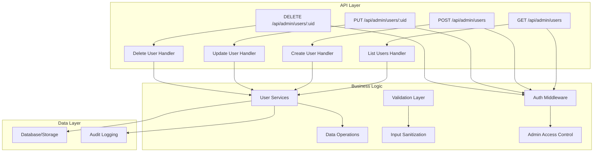
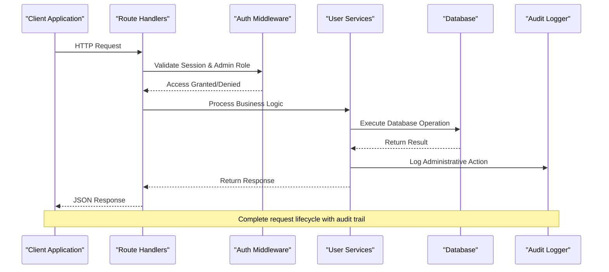
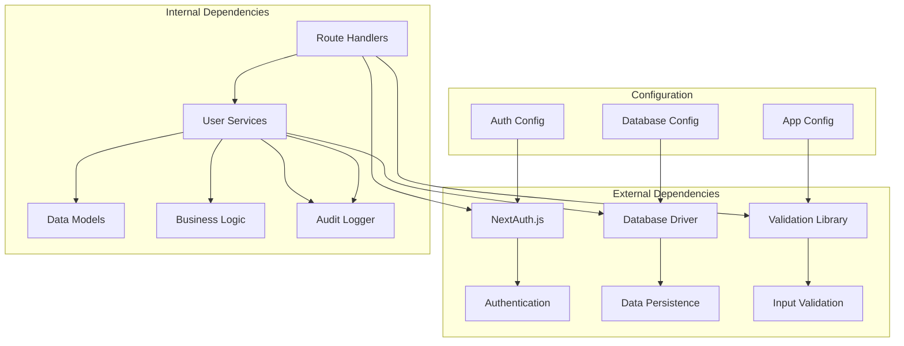

# User Management API

<cite>
**Referenced Files in This Document**
- [route.ts](file://src/app/api/admin/users/route.ts)
- [route.ts](file://src/app/api/admin/users/[uid]/route.ts)
- [user-types.ts](file://src/modules/users/services/types/user-types.ts)
- [user-services.ts](file://src/modules/users/services/user-services.ts)
- [auth.ts](file://src/auth.ts)
- [auth.config.ts](file://src/auth.config.ts)
</cite>

## Table of Contents
1. [Introduction](#introduction)
2. [Project Structure](#project-structure)
3. [Core Components](#core-components)
4. [Architecture Overview](#architecture-overview)
5. [Detailed Component Analysis](#detailed-component-analysis)
6. [Dependency Analysis](#dependency-analysis)
7. [Performance Considerations](#performance-considerations)
8. [Troubleshooting Guide](#troubleshooting-guide)
9. [Conclusion](#conclusion)

## Introduction
This document provides comprehensive API documentation for the user management endpoints in the admin module. The API supports full CRUD operations for managing users within an administrative context, including listing, creating, updating, and deleting user accounts. The system implements proper authentication and authorization controls to ensure only authorized administrators can perform these operations.

## Project Structure
The user management API follows Next.js App Router conventions with route handlers organized under the `/api/admin/users` path. The implementation includes:



**Diagram sources**
- [route.ts](file://src/app/api/admin/users/route.ts)
- [route.ts](file://src/app/api/admin/users/[uid]/route.ts)
- [user-services.ts](file://src/modules/users/services/user-services.ts)

**Section sources**
- [route.ts](file://src/app/api/admin/users/route.ts)
- [route.ts](file://src/app/api/admin/users/[uid]/route.ts)

## Core Components

### Authentication and Authorization
The API implements robust authentication using NextAuth.js with admin-only access controls. All user management endpoints require:
- Valid authentication session
- Administrator role verification
- Request validation and sanitization

### Data Models
The user data model includes comprehensive fields for user account management:

| Field | Type | Required | Description |
|-------|------|----------|-------------|
| id | string | Yes | Unique user identifier |
| email | string | Yes | User's email address |
| name | string | Yes | Full display name |
| role | enum | Yes | User role (admin, user, moderator) |
| status | enum | Yes | Account status (active, inactive, suspended) |
| createdAt | timestamp | Yes | Account creation timestamp |
| updatedAt | timestamp | Yes | Last update timestamp |
| lastLogin | timestamp | No | Last successful login |
| profileImage | string | No | Profile image URL |
| metadata | object | No | Additional user metadata |

### Validation Rules
All input data undergoes strict validation:
- Email format validation
- Role enumeration validation
- Status field validation
- Name length constraints
- Image URL format validation

**Section sources**
- [user-types.ts](file://src/modules/users/services/types/user-types.ts)
- [user-services.ts](file://src/modules/users/services/user-services.ts)
- [auth.ts](file://src/auth.ts)
- [auth.config.ts](file://src/auth.config.ts)

## Architecture Overview

The user management API follows a layered architecture pattern:



**Diagram sources**
- [route.ts](file://src/app/api/admin/users/route.ts)
- [route.ts](file://src/app/api/admin/users/[uid]/route.ts)
- [user-services.ts](file://src/modules/users/services/user-services.ts)

## Detailed Component Analysis

### GET /api/admin/users - List Users
Retrieves a paginated list of users with filtering and search capabilities.

#### Request Parameters
| Parameter | Type | Required | Description |
|-----------|------|----------|-------------|
| page | number | No | Page number (default: 1) |
| limit | number | No | Items per page (default: 20, max: 100) |
| search | string | No | Search term for name/email |
| role | enum | No | Filter by user role |
| status | enum | No | Filter by account status |
| sortBy | string | No | Sort field (name, email, createdAt) |
| sortOrder | enum | No | Sort direction (asc, desc) |

#### Response Schema
```typescript
interface UserListResponse {
  users: User[];
  pagination: {
    currentPage: number;
    totalPages: number;
    totalItems: number;
    hasNextPage: boolean;
    hasPreviousPage: boolean;
  };
}
```

#### Example Response
```json
{
  "users": [
    {
      "id": "usr_123",
      "email": "john@example.com",
      "name": "John Doe",
      "role": "admin",
      "status": "active",
      "createdAt": "2024-01-15T10:30:00Z",
      "updatedAt": "2024-01-15T10:30:00Z"
    }
  ],
  "pagination": {
    "currentPage": 1,
    "totalPages": 5,
    "totalItems": 100,
    "hasNextPage": true,
    "hasPreviousPage": false
  }
}
```

### POST /api/admin/users - Create User
Creates a new user account with administrative privileges.

#### Request Body
```typescript
interface CreateUserRequest {
  email: string;
  name: string;
  role?: 'admin' | 'user' | 'moderator';
  status?: 'active' | 'inactive' | 'suspended';
  profileImage?: string;
  metadata?: Record<string, any>;
}
```

#### Validation Rules
- Email must be unique and properly formatted
- Name must be between 2-100 characters
- Role must be one of the allowed values
- Status must be one of the allowed values
- Profile image must be a valid URL if provided

#### Success Response (201 Created)
```json
{
  "user": {
    "id": "usr_456",
    "email": "newuser@example.com",
    "name": "New User",
    "role": "user",
    "status": "active",
    "createdAt": "2024-01-15T10:30:00Z",
    "updatedAt": "2024-01-15T10:30:00Z"
  },
  "message": "User created successfully"
}
```

### PUT /api/admin/users/:uid - Update User
Updates existing user information with partial updates support.

#### Path Parameters
| Parameter | Type | Required | Description |
|-----------|------|----------|-------------|
| uid | string | Yes | User ID to update |

#### Request Body
```typescript
interface UpdateUserRequest {
  email?: string;
  name?: string;
  role?: 'admin' | 'user' | 'moderator';
  status?: 'active' | 'inactive' | 'suspended';
  profileImage?: string;
  metadata?: Record<string, any>;
}
```

#### Success Response (200 OK)
```json
{
  "user": {
    "id": "usr_456",
    "email": "updated@example.com",
    "name": "Updated Name",
    "role": "admin",
    "status": "active",
    "createdAt": "2024-01-15T10:30:00Z",
    "updatedAt": "2024-01-15T11:45:00Z"
  },
  "message": "User updated successfully"
}
```

### DELETE /api/admin/users/:uid - Delete User
Permanently removes a user account from the system.

#### Path Parameters
| Parameter | Type | Required | Description |
|-----------|------|----------|-------------|
| uid | string | Yes | User ID to delete |

#### Success Response (200 OK)
```json
{
  "message": "User deleted successfully",
  "deletedUserId": "usr_456"
}
```

#### Error Responses
All endpoints return appropriate HTTP status codes:
- 200 OK: Successful operation
- 201 Created: Resource created successfully
- 400 Bad Request: Invalid input data
- 401 Unauthorized: Missing or invalid authentication
- 403 Forbidden: Insufficient permissions
- 404 Not Found: User not found
- 409 Conflict: Duplicate resource (e.g., email already exists)
- 500 Internal Server Error: Server-side error

**Section sources**
- [route.ts](file://src/app/api/admin/users/route.ts)
- [route.ts](file://src/app/api/admin/users/[uid]/route.ts)
- [user-types.ts](file://src/modules/users/services/types/user-types.ts)

## Dependency Analysis

The user management API has well-defined dependencies and clear separation of concerns:



**Diagram sources**
- [auth.ts](file://src/auth.ts)
- [auth.config.ts](file://src/auth.config.ts)
- [user-services.ts](file://src/modules/users/services/user-services.ts)

**Section sources**
- [auth.ts](file://src/auth.ts)
- [auth.config.ts](file://src/auth.config.ts)
- [user-services.ts](file://src/modules/users/services/user-services.ts)

## Performance Considerations

### Query Optimization
- Implement database indexing on frequently queried fields (email, role, status)
- Use pagination to limit result sets
- Implement caching for frequently accessed user lists
- Optimize search queries with full-text search capabilities

### Rate Limiting
- Apply rate limiting to prevent abuse
- Implement request throttling for bulk operations
- Monitor API usage patterns

### Memory Management
- Stream large datasets instead of loading entirely into memory
- Implement connection pooling for database operations
- Clean up temporary resources after request completion

## Troubleshooting Guide

### Common Issues and Solutions

#### Authentication Errors
- **Issue**: 401 Unauthorized responses
- **Solution**: Verify authentication token validity and admin role assignment
- **Debug**: Check session configuration and token expiration

#### Validation Errors
- **Issue**: 400 Bad Request with validation failures
- **Solution**: Review request body against schema requirements
- **Debug**: Enable detailed validation error logging

#### Database Connection Issues
- **Issue**: 500 Internal Server Error during data operations
- **Solution**: Verify database connectivity and credentials
- **Debug**: Check database logs and connection pool status

#### Permission Denied
- **Issue**: 403 Forbidden when accessing admin endpoints
- **Solution**: Ensure user has administrator privileges
- **Debug**: Review role-based access control configuration

### Monitoring and Logging
- Implement structured logging for all API requests
- Track performance metrics and response times
- Monitor error rates and failure patterns
- Set up alerts for critical system events

**Section sources**
- [user-services.ts](file://src/modules/users/services/user-services.ts)
- [auth.ts](file://src/auth.ts)

## Conclusion

The user management API provides a comprehensive solution for administrative user operations with robust security, validation, and error handling. The implementation follows modern web development best practices with clear separation of concerns, comprehensive documentation, and extensible architecture. The API supports advanced features like pagination, filtering, and audit logging while maintaining high performance and security standards.

Key strengths include:
- Comprehensive CRUD operations with proper validation
- Strong authentication and authorization controls
- Extensive error handling and logging
- Performance optimization through pagination and caching
- Clear TypeScript interfaces for type safety
- Audit trail for compliance and security monitoring