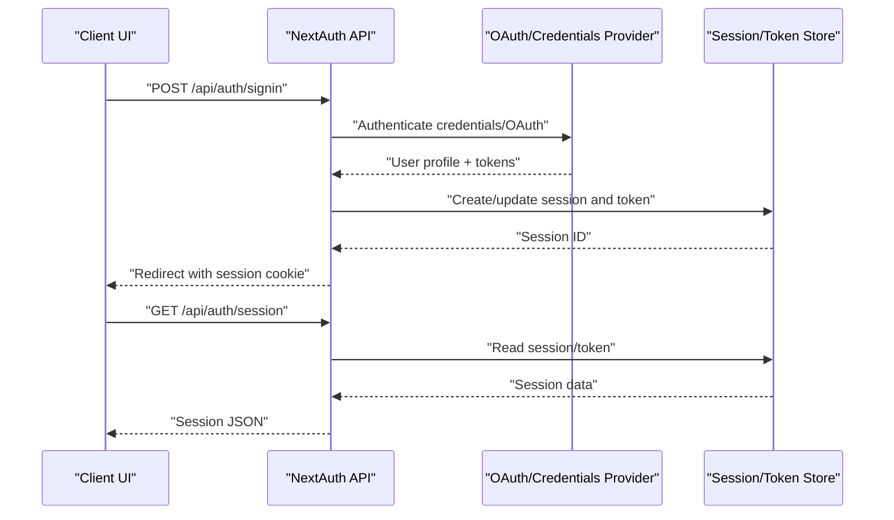
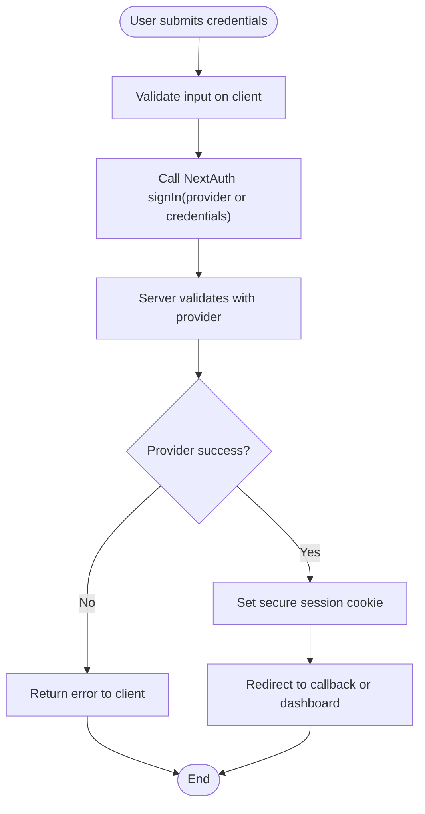
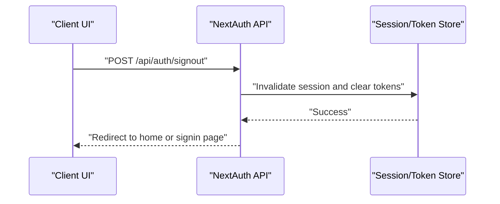
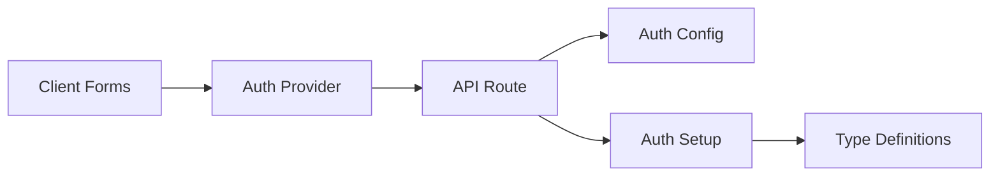

# Authentication API

<cite>
**Referenced Files in This Document**
- [route.ts](file://src/app/api/auth/[...nextauth]/route.ts)
- [auth.config.ts](file://src/auth.config.ts)
- [auth.ts](file://src/auth.ts)
- [next-auth.d.ts](file://src/types/next-auth.d.ts)
- [login-form.tsx](file://src/app/(auth)/sign-in/components/login-form.tsx)
- [signup-form.tsx](file://src/app/(auth)/sign-up/components/signup-form.tsx)
- [forgot-password-form.tsx](file://src/app/(auth)/forgot-password/components/forgot-password-form.tsx)
- [auth-provider.tsx](file://src/components/auth-provider.tsx)
</cite>

## Table of Contents
1. [Introduction](#introduction)
2. [Project Structure](#project-structure)
3. [Core Components](#core-components)
4. [Architecture Overview](#architecture-overview)
5. [Detailed Component Analysis](#detailed-component-analysis)
6. [Dependency Analysis](#dependency-analysis)
7. [Performance Considerations](#performance-considerations)
8. [Troubleshooting Guide](#troubleshooting-guide)
9. [Conclusion](#conclusion)
10. [Appendices](#appendices)

## Introduction
This document provides comprehensive API documentation for authentication endpoints implemented with NextAuth.js. It covers OAuth provider configurations, session management, JWT token handling, login/logout flows, user registration, password reset, and email verification processes. It also includes request/response schemas, error codes, security considerations, client-side integration examples, and token refresh strategies.

## Project Structure
Authentication is implemented using NextAuth.js with a catch-all API route under app/api/auth/[...nextauth]. The configuration is centralized in auth.config.ts and the main setup in auth.ts. Client components include sign-in, sign-up, and forgot-password forms, and an auth provider to manage session state.

```mermaid
graph TB
subgraph "NextAuth API"
A["API Route<br/>app/api/auth/[...nextauth]/route.ts"]
end
subgraph "Configuration"
B["Auth Config<br/>src/auth.config.ts"]
C["Auth Setup<br/>src/auth.ts"]
D["Type Definitions<br/>src/types/next-auth.d.ts"]
end
subgraph "Client UI"
E["Sign In Form<br/>src/app/(auth)/sign-in/components/login-form.tsx"]
F["Sign Up Form<br/>src/app/(auth)/sign-up/components/signup-form.tsx")
G["Forgot Password Form<br/>src/app/(auth)/forgot-password/components/forgot-password-form.tsx"]
H["Auth Provider<br/>src/components/auth-provider.tsx"]
end
A --> B
A --> C
C --> D
E --> A
F --> A
G --> A
H --> A
```

**Diagram sources**
- [route.ts](file://src/app/api/auth/[...nextauth]/route.ts)
- [auth.config.ts](file://src/auth.config.ts)
- [auth.ts](file://src/auth.ts)
- [next-auth.d.ts](file://src/types/next-auth.d.ts)
- [login-form.tsx](file://src/app/(auth)/sign-in/components/login-form.tsx)
- [signup-form.tsx](file://src/app/(auth)/sign-up/components/signup-form.tsx)
- [forgot-password-form.tsx](file://src/app/(auth)/forgot-password/components/forgot-password-form.tsx)
- [auth-provider.tsx](file://src/components/auth-provider.tsx)

**Section sources**
- [route.ts](file://src/app/api/auth/[...nextauth]/route.ts)
- [auth.config.ts](file://src/auth.config.ts)
- [auth.ts](file://src/auth.ts)
- [next-auth.d.ts](file://src/types/next-auth.d.ts)
- [login-form.tsx](file://src/app/(auth)/sign-in/components/login-form.tsx)
- [signup-form.tsx](file://src/app/(auth)/sign-up/components/signup-form.tsx)
- [forgot-password-form.tsx](file://src/app/(auth)/forgot-password/components/forgot-password-form.tsx)
- [auth-provider.tsx](file://src/components/auth-provider.tsx)

## Core Components
- NextAuth API Route: Handles all authentication requests via the catch-all path.
- Auth Configuration: Defines providers, callbacks, and options.
- Auth Setup: Initializes NextAuth with adapters and customizations.
- Type Definitions: Extends NextAuth types for sessions and JWT payloads.
- Client Forms: Sign-in, sign-up, and forgot-password UI components that call NextAuth actions.
- Auth Provider: Provides authenticated session context to the application.

Key responsibilities:
- Routing and middleware for authentication flows
- Provider-specific logic (OAuth, credentials)
- Session and token customization
- Type safety across server and client

**Section sources**
- [route.ts](file://src/app/api/auth/[...nextauth]/route.ts)
- [auth.config.ts](file://src/auth.config.ts)
- [auth.ts](file://src/auth.ts)
- [next-auth.d.ts](file://src/types/next-auth.d.ts)
- [auth-provider.tsx](file://src/components/auth-provider.tsx)

## Architecture Overview
The authentication architecture follows a standard NextAuth.js pattern:
- Client components invoke NextAuth actions (signIn, signOut, getSession).
- Requests are routed to the NextAuth API endpoint.
- Providers handle identity verification and return tokens/profiles.
- Sessions are created and stored per configured strategy (JWT or database).
- Protected routes and APIs validate sessions and tokens.



**Diagram sources**
- [route.ts](file://src/app/api/auth/[...nextauth]/route.ts)
- [auth.config.ts](file://src/auth.config.ts)
- [auth.ts](file://src/auth.ts)

## Detailed Component Analysis

### NextAuth API Route
- Purpose: Central entry point for all authentication operations.
- Endpoints exposed by NextAuth:
  - GET /api/auth/signin
  - POST /api/auth/signin
  - GET /api/auth/signout
  - GET /api/auth/csrf
  - GET /api/auth/providers
  - GET /api/auth/session
  - POST /api/auth/signout
  - GET /api/auth/callback/:provider
  - POST /api/auth/jwt
  - GET /api/auth/csrf
- Behavior: Delegates to configured providers and session strategy.

Security notes:
- CSRF protection enabled by default.
- Secure cookies when HTTPS is configured.
- Redirect validation enforced.

**Section sources**
- [route.ts](file://src/app/api/auth/[...nextauth]/route.ts)

### Authentication Configuration
- Provider definitions: OAuth providers and optional credentials provider.
- Callbacks: Customization of session and JWT payloads, account linking, and authorization checks.
- Options: Adapter selection, secret, session strategy (JWT or database), email verification settings, and debug flags.

Typical configuration areas:
- Providers array
- adapter
- callbacks.session and callbacks.jwt
- pages for custom UI (signin, verifyRequest, etc.)
- events for lifecycle hooks

**Section sources**
- [auth.config.ts](file://src/auth.config.ts)

### Main Auth Setup
- Initializes NextAuth with config and exports handlers.
- Integrates with environment variables for secrets and provider credentials.
- Optionally sets up event listeners and logging.

**Section sources**
- [auth.ts](file://src/auth.ts)

### Type Definitions
- Extends NextAuth’s Session and JWT types to include custom fields (e.g., roles, permissions).
- Ensures type safety across server and client code.

Common extensions:
- session.user fields
- jwt.sub or additional claims
- account and profile mappings

**Section sources**
- [next-auth.d.ts](file://src/types/next-auth.d.ts)

### Client-Side Integration
- Auth Provider: Wraps the app to expose session state and helpers.
- Sign-In Form: Calls signIn with provider or credentials; handles redirect and errors.
- Sign-Up Form: Creates users via backend or provider flow; may trigger email verification.
- Forgot Password Form: Initiates password reset via provider or custom flow.

Best practices:
- Use protected routes and server-side session checks.
- Handle loading and error states consistently.
- Avoid storing sensitive tokens in localStorage unless required.

**Section sources**
- [auth-provider.tsx](file://src/components/auth-provider.tsx)
- [login-form.tsx](file://src/app/(auth)/sign-in/components/login-form.tsx)
- [signup-form.tsx](file://src/app/(auth)/sign-up/components/signup-form.tsx)
- [forgot-password-form.tsx](file://src/app/(auth)/forgot-password/components/forgot-password-form.tsx)

### Login Flow (Credentials or OAuth)


**Diagram sources**
- [login-form.tsx](file://src/app/(auth)/sign-in/components/login-form.tsx)
- [route.ts](file://src/app/api/auth/[...nextauth]/route.ts)
- [auth.config.ts](file://src/auth.config.ts)

### Logout Flow


**Diagram sources**
- [route.ts](file://src/app/api/auth/[...nextauth]/route.ts)

### User Registration
- If using OAuth-only: Registration occurs during first successful provider callback.
- If using credentials: A separate registration endpoint or action creates the user before calling signIn.
- Email verification: Triggered after registration if enabled.

**Section sources**
- [auth.config.ts](file://src/auth.config.ts)
- [signup-form.tsx](file://src/app/(auth)/sign-up/components/signup-form.tsx)

### Password Reset
- Initiate reset via forgot-password form which calls provider/email service.
- User receives reset link; clicking it leads to a reset page.
- On submit, credentials are updated and user is redirected.

**Section sources**
- [forgot-password-form.tsx](file://src/app/(auth)/forgot-password/components/forgot-password-form.tsx)
- [auth.config.ts](file://src/auth.config.ts)

### Email Verification
- After registration or email update, a verification request is sent.
- User clicks the link; NextAuth verifies and marks the account verified.
- Redirects to a success page or back to the app.

**Section sources**
- [auth.config.ts](file://src/auth.config.ts)

## Dependency Analysis
- The API route depends on the auth configuration and setup.
- Client components depend on the auth provider and NextAuth client utilities.
- Type definitions ensure consistent shapes for session and JWT objects.



**Diagram sources**
- [route.ts](file://src/app/api/auth/[...nextauth]/route.ts)
- [auth.config.ts](file://src/auth.config.ts)
- [auth.ts](file://src/auth.ts)
- [next-auth.d.ts](file://src/types/next-auth.d.ts)
- [auth-provider.tsx](file://src/components/auth-provider.tsx)

**Section sources**
- [route.ts](file://src/app/api/auth/[...nextauth]/route.ts)
- [auth.config.ts](file://src/auth.config.ts)
- [auth.ts](file://src/auth.ts)
- [next-auth.d.ts](file://src/types/next-auth.d.ts)
- [auth-provider.tsx](file://src/components/auth-provider.tsx)

## Performance Considerations
- Prefer JWT-based sessions for scalability; avoid heavy payloads in session/JWT.
- Minimize provider callbacks and external calls in hot paths.
- Cache static provider metadata where possible.
- Use HTTP-only, secure cookies for sessions and tokens.
- Enable compression and proper caching headers for non-sensitive responses.

[No sources needed since this section provides general guidance]

## Troubleshooting Guide
Common issues and resolutions:
- Redirect URL not allowed: Ensure NEXTAUTH_URL and provider callback URLs are correct.
- Missing secrets: Configure NEXTAUTH_SECRET and provider-specific secrets.
- CORS issues: Verify origin settings and proxy configuration.
- Session not persisting: Check cookie domain/path and SameSite settings.
- Email verification not working: Confirm email service configuration and template rendering.

Operational tips:
- Inspect NextAuth logs in development.
- Validate CSRF tokens when making direct API calls.
- Use browser dev tools to inspect cookies and network requests.

[No sources needed since this section provides general guidance]

## Conclusion
This authentication system leverages NextAuth.js to provide secure, extensible authentication with support for multiple providers, robust session management, and customizable flows. By following the documented endpoints, schemas, and best practices, clients can implement reliable login, logout, registration, password reset, and email verification experiences.

[No sources needed since this section summarizes without analyzing specific files]

## Appendices

### API Endpoints Reference
- GET /api/auth/signin
- POST /api/auth/signin
- GET /api/auth/signout
- POST /api/auth/signout
- GET /api/auth/csrf
- GET /api/auth/providers
- GET /api/auth/session
- GET /api/auth/callback/:provider
- POST /api/auth/jwt

Notes:
- All endpoints are handled by NextAuth and follow its conventions.
- Responses and redirects are managed by NextAuth based on configuration.

**Section sources**
- [route.ts](file://src/app/api/auth/[...nextauth]/route.ts)

### Request/Response Schemas
- Session object: Contains user info and token references as defined in type extensions.
- JWT payload: Includes user identifiers and any custom claims added in callbacks.
- Error responses: Standard NextAuth error formats with descriptive messages.

For exact field names and structures, refer to the type definitions and callbacks.

**Section sources**
- [next-auth.d.ts](file://src/types/next-auth.d.ts)
- [auth.config.ts](file://src/auth.config.ts)

### Security Considerations
- Always set NEXTAUTH_SECRET and use HTTPS in production.
- Restrict allowed redirect origins.
- Keep provider scopes minimal and map only necessary fields.
- Implement rate limiting on login and password reset endpoints at the edge or gateway.
- Rotate secrets periodically and audit provider access.

[No sources needed since this section provides general guidance]

### Client-Side Implementation Examples
- Initialize auth provider once at the app root.
- Use signIn and signOut from the provider to control flows.
- Read session via getSession or provider hooks to guard routes.
- For API calls, attach session cookies automatically or pass tokens when required.

**Section sources**
- [auth-provider.tsx](file://src/components/auth-provider.tsx)
- [login-form.tsx](file://src/app/(auth)/sign-in/components/login-form.tsx)
- [signup-form.tsx](file://src/app/(auth)/sign-up/components/signup-form.tsx)
- [forgot-password-form.tsx](file://src/app/(auth)/forgot-password/components/forgot-password-form.tsx)

### Token Refresh Strategies
- With JWT strategy: Tokens are refreshed on each request if configured; extend expiry in callbacks as needed.
- With database strategy: Session records are updated on activity; ensure idle timeout aligns with UX expectations.
- For long-lived sessions: Consider sliding expiration and background refresh via periodic session checks.

**Section sources**
- [auth.config.ts](file://src/auth.config.ts)
- [auth.ts](file://src/auth.ts)