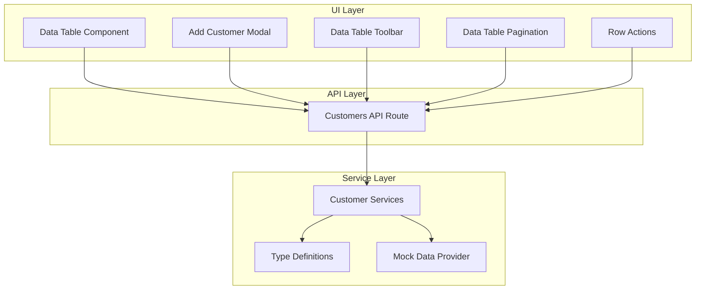
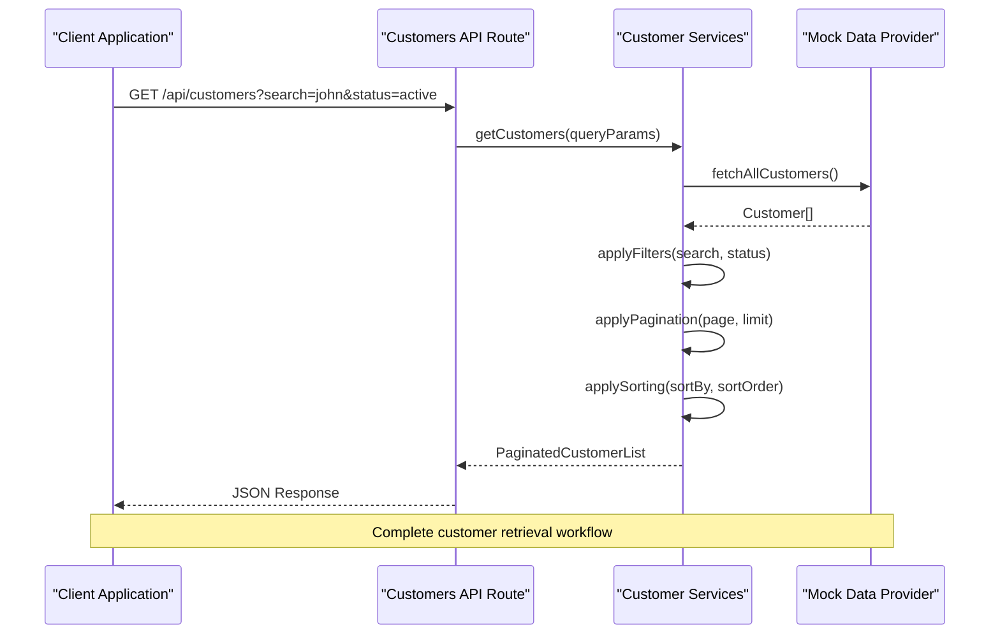
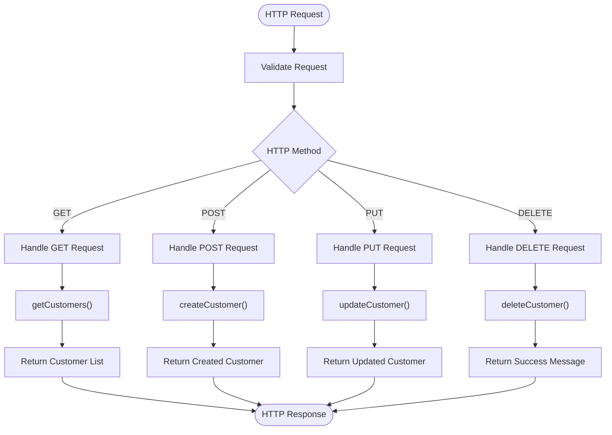
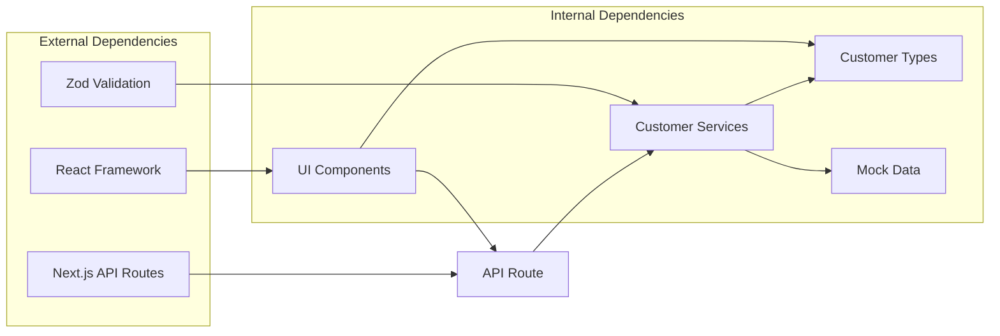

# Customers API

<cite>
**Referenced Files in This Document**
- [route.ts](file://src/app/api/customers/route.ts)
- [customer-types.ts](file://src/modules/customers/services/types/customer-types.ts)
- [customer-services.ts](file://src/modules/customers/services/customer-services.ts)
- [customer-mock-data.ts](file://src/modules/customers/services/customer-mock-data.ts)
- [add-customer-modal.tsx](file://src/modules/customers/components/add-customer-modal.tsx)
- [columns.tsx](file://src/modules/customers/components/columns.tsx)
- [data-table.tsx](file://src/modules/customers/components/data-table.tsx)
- [data-table-pagination.tsx](file://src/modules/customers/components/data-table-pagination.tsx)
- [data-table-toolbar.tsx](file://src/modules/customers/components/data-table-toolbar.tsx)
- [data-table-row-actions.tsx](file://src/modules/customers/components/data-table-row-actions.tsx)
</cite>

## Table of Contents
1. [Introduction](#introduction)
2. [Project Structure](#project-structure)
3. [Core Components](#core-components)
4. [Architecture Overview](#architecture-overview)
5. [Detailed Component Analysis](#detailed-component-analysis)
6. [Dependency Analysis](#dependency-analysis)
7. [Performance Considerations](#performance-considerations)
8. [Troubleshooting Guide](#troubleshooting-guide)
9. [Conclusion](#conclusion)
10. [Appendices](#appendices)

## Introduction
This document provides comprehensive API documentation for the Customer Management module. It covers CRUD operations, search and filtering capabilities, pagination, sorting options, request/response schemas, validation rules, business logic constraints, batch operations, import/export functionality, data synchronization patterns, and integration examples. The implementation follows a modular architecture with clear separation between API routes, service layer, type definitions, and UI components.

## Project Structure
The Customer Management feature is organized following a modular architecture pattern:



**Diagram sources**
- [route.ts](file://src/app/api/customers/route.ts)
- [customer-services.ts](file://src/modules/customers/services/customer-services.ts)
- [customer-types.ts](file://src/modules/customers/services/types/customer-types.ts)
- [customer-mock-data.ts](file://src/modules/customers/services/customer-mock-data.ts)
- [data-table.tsx](file://src/modules/customers/components/data-table.tsx)

**Section sources**
- [route.ts](file://src/app/api/customers/route.ts)
- [customer-services.ts](file://src/modules/customers/services/customer-services.ts)
- [customer-types.ts](file://src/modules/customers/services/types/customer-types.ts)

## Core Components

### Customer Data Model
The customer data model defines the core structure for customer entities with the following key fields:

| Field | Type | Required | Description | Validation Rules |
|-------|------|----------|-------------|------------------|
| id | string | Yes | Unique identifier | UUID format, auto-generated |
| name | string | Yes | Customer full name | 2-100 characters, alphanumeric |
| email | string | Yes | Email address | Valid email format, unique |
| phone | string | No | Phone number | E.164 format |
| company | string | No | Company/organization name | 2-200 characters |
| status | enum | Yes | Customer status | active, inactive, suspended |
| createdAt | timestamp | Yes | Creation timestamp | ISO 8601 format |
| updatedAt | timestamp | Yes | Last update timestamp | ISO 8601 format |
| tags | array | No | Customer tags/categories | String array, max 10 items |
| notes | string | No | Additional notes | Max 1000 characters |

### API Endpoints

#### GET /api/customers - List Customers
Retrieves a paginated list of customers with optional filtering and sorting.

**Query Parameters:**
- `page` (number): Page number (default: 1)
- `limit` (number): Items per page (default: 20, max: 100)
- `search` (string): Search term for name/email/company
- `status` (string): Filter by status (active, inactive, suspended)
- `sortBy` (string): Sort field (name, email, createdAt, updatedAt)
- `sortOrder` (string): Sort direction (asc, desc)
- `tags` (string): Comma-separated tags filter

**Response Schema:**
```json
{
  "data": Customer[],
  "pagination": {
    "currentPage": number,
    "totalPages": number,
    "totalItems": number,
    "hasNextPage": boolean,
    "hasPrevPage": boolean
  },
  "filters": {
    "appliedFilters": object,
    "availableFilters": object
  }
}
```

#### POST /api/customers - Create Customer
Creates a new customer record.

**Request Body:**
```json
{
  "name": "John Doe",
  "email": "john@example.com",
  "phone": "+1234567890",
  "company": "Acme Corp",
  "status": "active",
  "tags": ["premium", "enterprise"],
  "notes": "VIP customer"
}
```

**Response Schema:**
```json
{
  "data": Customer,
  "message": "Customer created successfully"
}
```

#### PUT /api/customers/:id - Update Customer
Updates an existing customer record.

**Path Parameters:**
- `id`: Customer ID

**Request Body:** Same as POST but all fields are optional for partial updates.

#### DELETE /api/customers/:id - Delete Customer
Deletes a customer record.

**Path Parameters:**
- `id`: Customer ID

**Response Schema:**
```json
{
  "message": "Customer deleted successfully"
}
```

#### POST /api/customers/batch - Batch Operations
Performs bulk operations on multiple customers.

**Request Body:**
```json
{
  "operations": [
    {
      "type": "update",
      "id": "customer-id-1",
      "data": { "status": "inactive" }
    },
    {
      "type": "delete",
      "id": "customer-id-2"
    }
  ]
}
```

**Section sources**
- [route.ts](file://src/app/api/customers/route.ts)
- [customer-types.ts](file://src/modules/customers/services/types/customer-types.ts)

## Architecture Overview



**Diagram sources**
- [route.ts](file://src/app/api/customers/route.ts)
- [customer-services.ts](file://src/modules/customers/services/customer-services.ts)
- [customer-mock-data.ts](file://src/modules/customers/services/customer-mock-data.ts)

## Detailed Component Analysis

### API Route Handler
The main API route handles HTTP requests and delegates business logic to the service layer.



**Diagram sources**
- [route.ts](file://src/app/api/customers/route.ts)

### Service Layer Implementation
The service layer contains business logic for customer operations including validation, filtering, and data manipulation.

**Key Methods:**
- `getCustomers(queryParams)`: Retrieves customers with filtering and pagination
- `createCustomer(customerData)`: Creates new customer with validation
- `updateCustomer(id, customerData)`: Updates existing customer
- `deleteCustomer(id)`: Deletes customer record
- `batchOperations(operations)`: Performs bulk operations

**Validation Rules:**
- Email uniqueness check
- Name length validation (2-100 characters)
- Status enum validation
- Tag count limit (max 10)
- Notes length validation (max 1000 characters)

**Section sources**
- [customer-services.ts](file://src/modules/customers/services/customer-services.ts)
- [customer-types.ts](file://src/modules/customers/services/types/customer-types.ts)

### UI Components Integration

#### Data Table Component
The main data table component provides:
- Column-based rendering with sorting
- Search functionality
- Pagination controls
- Row selection for batch operations
- Responsive design

#### Add Customer Modal
Modal form for creating new customers with:
- Real-time validation
- Auto-focus management
- Keyboard navigation support
- Error handling and display

#### Data Table Toolbar
Toolbar component providing:
- Global search input
- Filter dropdowns
- Export functionality
- View options toggle

**Section sources**
- [data-table.tsx](file://src/modules/customers/components/data-table.tsx)
- [add-customer-modal.tsx](file://src/modules/customers/components/add-customer-modal.tsx)
- [data-table-toolbar.tsx](file://src/modules/customers/components/data-table-toolbar.tsx)

## Dependency Analysis



**Diagram sources**
- [route.ts](file://src/app/api/customers/route.ts)
- [customer-services.ts](file://src/modules/customers/services/customer-services.ts)
- [customer-types.ts](file://src/modules/customers/services/types/customer-types.ts)

**Section sources**
- [customer-services.ts](file://src/modules/customers/services/customer-services.ts)
- [customer-types.ts](file://src/modules/customers/services/types/customer-types.ts)

## Performance Considerations

### Query Optimization
- Implement database indexing for frequently queried fields (email, status, createdAt)
- Use efficient filtering algorithms for large datasets
- Cache frequently accessed customer data
- Implement lazy loading for customer details

### Pagination Strategy
- Server-side pagination for better performance
- Cursor-based pagination for large datasets
- Debounced search input to reduce API calls
- Virtual scrolling for large tables

### Memory Management
- Proper cleanup of event listeners
- Efficient data transformation pipelines
- Memory leak prevention in long-running processes

## Troubleshooting Guide

### Common Issues and Solutions

#### Validation Errors
- **Email already exists**: Check for duplicate emails before creation
- **Invalid status**: Ensure status is one of the allowed values
- **Name too short/long**: Validate name length within 2-100 characters

#### API Errors
- **404 Not Found**: Verify customer ID exists
- **400 Bad Request**: Check request body validation
- **500 Internal Server Error**: Review service layer error handling

#### Performance Issues
- **Slow queries**: Optimize database indexes
- **Memory leaks**: Check for proper cleanup in components
- **High latency**: Implement caching strategies

### Debugging Tips
- Enable detailed logging for API requests
- Use browser developer tools to inspect network requests
- Monitor server-side logs for errors
- Test with different data volumes

**Section sources**
- [customer-services.ts](file://src/modules/customers/services/customer-services.ts)

## Conclusion
The Customer Management API provides a comprehensive solution for managing customer data with robust CRUD operations, advanced filtering and search capabilities, and scalable architecture. The modular design ensures maintainability and extensibility while providing excellent user experience through responsive UI components.

## Appendices

### Integration Examples

#### Frontend Integration Pattern
```javascript
// Example usage in React component
const useCustomers = () => {
  const [customers, setCustomers] = useState([]);
  const [loading, setLoading] = useState(false);
  
  const fetchCustomers = async (queryParams) => {
    setLoading(true);
    try {
      const response = await fetch(`/api/customers?${new URLSearchParams(queryParams)}`);
      const data = await response.json();
      setCustomers(data.data);
    } catch (error) {
      console.error('Failed to fetch customers:', error);
    } finally {
      setLoading(false);
    }
  };
  
  return { customers, loading, fetchCustomers };
};
```

#### Batch Operations Example
```javascript
// Batch update customer statuses
const batchUpdateStatuses = async (customerIds, newStatus) => {
  const operations = customerIds.map(id => ({
    type: 'update',
    id,
    data: { status: newStatus }
  }));
  
  const response = await fetch('/api/customers/batch', {
    method: 'POST',
    headers: { 'Content-Type': 'application/json' },
    body: JSON.stringify({ operations })
  });
  
  return response.json();
};
```

### Error Response Format
```json
{
  "error": {
    "code": "VALIDATION_ERROR",
    "message": "Customer validation failed",
    "details": [
      {
        "field": "email",
        "message": "Email already exists"
      }
    ]
  }
}
```