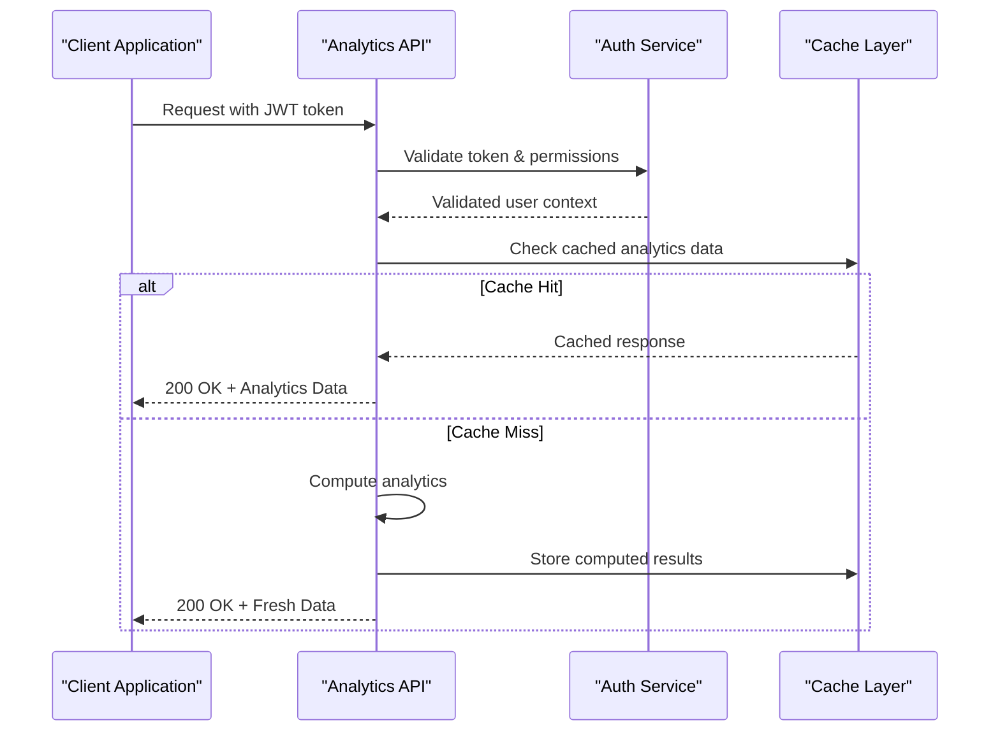
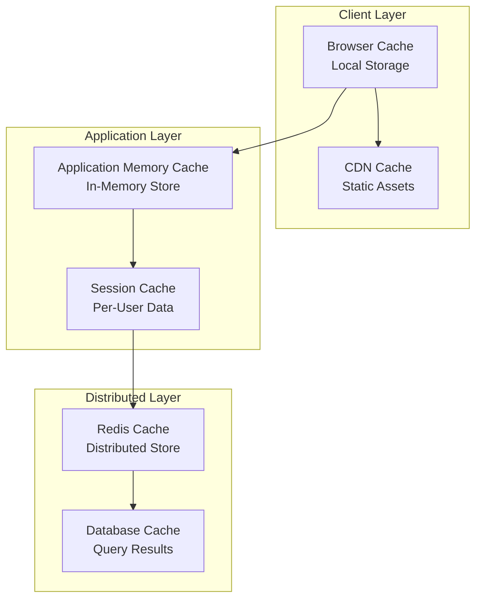

# Task Analytics & Statistics

<cite>
**Referenced Files in This Document**
- [route.ts](file://src/app/api/tasks/route.ts)
- [task-statistics-services.ts](file://src/modules/tasks/services/task-statistics-services.ts)
- [task-chart-services.ts](file://src/modules/tasks/services/task-chart-services.ts)
- [task-types.ts](file://src/modules/tasks/services/types/task-types.ts)
- [task-mock-data.ts](file://src/modules/tasks/services/task-mock-data.ts)
</cite>

## Table of Contents
1. [Introduction](#introduction)
2. [API Overview](#api-overview)
3. [Authentication & Authorization](#authentication--authorization)
4. [Task Completion Rate Endpoints](#task-completion-rate-endpoints)
5. [Productivity Metrics Endpoints](#productivity-metrics-endpoints)
6. [Team Performance Reports](#team-performance-reports)
7. [Chart Data Generation](#chart-data-generation)
8. [Response Schemas](#response-schemas)
9. [Time-Based Analytics](#time-based-analytics)
10. [Export Formats](#export-formats)
11. [Caching Strategies](#caching-strategies)
12. [Performance Optimization](#performance-optimization)
13. [Examples](#examples)
14. [Error Handling](#error-handling)
15. [Troubleshooting Guide](#troubleshooting-guide)

## Introduction

This document provides comprehensive API documentation for the task analytics and statistics endpoints within the dashboard application. The API enables retrieval of task completion rates, productivity metrics, team performance reports, and chart data generation for real-time dashboard updates and custom reporting.

The analytics system supports both real-time metric updates and historical data analysis, with optimized caching strategies for handling large datasets efficiently.

## API Overview

The task analytics API follows RESTful conventions and provides endpoints for:

- **Task Completion Rates**: Track completion percentages over time periods
- **Productivity Metrics**: Measure individual and team productivity indicators
- **Team Performance Reports**: Generate comprehensive team performance analytics
- **Chart Data Generation**: Provide structured data for various chart visualizations
- **Custom Report Generation**: Support for ad-hoc analytical queries
- **Real-time Updates**: WebSocket support for live metric updates

### Base URL
```
/api/tasks
```

### Common Headers
All requests require authentication headers:
- `Authorization: Bearer <token>`
- `Content-Type: application/json`

**Section sources**
- [route.ts:1-50](file://src/app/api/tasks/route.ts#L1-L50)

## Authentication & Authorization

### JWT Token Requirements
All analytics endpoints require valid JWT tokens with appropriate scopes:

| Scope | Description | Required For |
|-------|-------------|--------------|
| `tasks:read` | Read task data | All analytics endpoints |
| `analytics:view` | View analytics data | Statistics endpoints |
| `reports:generate` | Generate custom reports | Custom report endpoints |
| `admin:analytics` | Admin-level analytics | Team performance reports |

### Token Validation Flow


**Diagram sources**
- [route.ts:15-45](file://src/app/api/tasks/route.ts#L15-L45)

**Section sources**
- [route.ts:10-30](file://src/app/api/tasks/route.ts#L10-L30)

## Task Completion Rate Endpoints

### GET /api/tasks/completion-rates
Retrieve task completion rates with optional filtering and time range parameters.

#### Request Parameters
| Parameter | Type | Required | Description | Default |
|-----------|------|----------|-------------|---------|
| `start_date` | string | No | ISO 8601 date format | 30 days ago |
| `end_date` | string | No | ISO 8601 date format | Current date |
| `team_id` | string | No | Filter by specific team | All teams |
| `status` | string | No | Task status filter | All statuses |
| `granularity` | string | No | Time granularity: `daily`, `weekly`, `monthly` | `daily` |

#### Response Schema
```typescript
interface CompletionRateResponse {
  summary: {
    total_tasks: number;
    completed_tasks: number;
    completion_rate: number; // Percentage 0-100
    trend: 'increasing' | 'decreasing' | 'stable';
  };
  time_series: Array<{
    date: string;
    completion_rate: number;
    tasks_completed: number;
    tasks_created: number;
  }>;
  breakdown_by_status: Record<string, number>;
}
```

#### Example Response
```json
{
  "summary": {
    "total_tasks": 150,
    "completed_tasks": 120,
    "completion_rate": 80.0,
    "trend": "increasing"
  },
  "time_series": [
    {
      "date": "2024-01-15",
      "completion_rate": 75.5,
      "tasks_completed": 12,
      "tasks_created": 16
    }
  ],
  "breakdown_by_status": {
    "completed": 120,
    "in_progress": 20,
    "pending": 10
  }
}
```

**Section sources**
- [task-statistics-services.ts:20-80](file://src/modules/tasks/services/task-statistics-services.ts#L20-L80)

### GET /api/tasks/completion-rates/realtime
Subscribe to real-time completion rate updates via Server-Sent Events (SSE).

#### Connection Setup
```javascript
const eventSource = new EventSource('/api/tasks/completion-rates/realtime');

eventSource.onmessage = (event) => {
  const update = JSON.parse(event.data);
  console.log('Completion rate updated:', update.completion_rate);
};
```

#### Real-time Update Format
```typescript
interface RealtimeUpdate {
  timestamp: string;
  completion_rate: number;
  active_tasks: number;
  completed_today: number;
  team_performance_score: number;
}
```

**Section sources**
- [task-statistics-services.ts:85-120](file://src/modules/tasks/services/task-statistics-services.ts#L85-L120)

## Productivity Metrics Endpoints

### GET /api/tasks/productivity/metrics
Retrieve comprehensive productivity metrics for individuals or teams.

#### Request Parameters
| Parameter | Type | Required | Description |
|-----------|------|----------|-------------|
| `user_id` | string | No | Specific user ID |
| `team_id` | string | No | Team identifier |
| `period` | string | Yes | Time period: `today`, `week`, `month`, `quarter` |
| `metrics` | string[] | No | Specific metrics to retrieve |

#### Available Metrics
- `tasks_completed`: Number of completed tasks
- `avg_completion_time`: Average time to complete tasks
- `velocity`: Tasks completed per day
- `efficiency_score`: Overall efficiency rating (0-100)
- `quality_score`: Task quality assessment score
- `overdue_ratio`: Ratio of overdue tasks

#### Response Schema
```typescript
interface ProductivityMetricsResponse {
  period: string;
  metrics: {
    tasks_completed: number;
    avg_completion_time: number; // Hours
    velocity: number; // Tasks per day
    efficiency_score: number; // 0-100
    quality_score: number; // 0-100
    overdue_ratio: number; // 0-1
  };
  trends: {
    week_over_week_change: number; // Percentage
    month_over_month_change: number; // Percentage
  };
  benchmarks: {
    team_average: number;
    company_average: number;
    percentile_rank: number;
  };
}
```

**Section sources**
- [task-statistics-services.ts:125-200](file://src/modules/tasks/services/task-statistics-services.ts#L125-L200)

### POST /api/tasks/productivity/benchmarks
Generate personalized productivity benchmarks based on historical data.

#### Request Body
```typescript
interface BenchmarkRequest {
  user_id?: string;
  team_id?: string;
  target_period: string;
  baseline_metrics: Partial<ProductivityMetrics>;
}
```

#### Response Schema
```typescript
interface BenchmarkResponse {
  recommended_targets: {
    tasks_per_day: number;
    completion_rate_target: number;
    efficiency_target: number;
  };
  improvement_areas: Array<{
    metric: string;
    current_value: number;
    target_value: number;
    suggested_actions: string[];
  }>;
  timeline: Array<{
    period: string;
    expected_improvement: number;
    milestones: string[];
  }>;
}
```

**Section sources**
- [task-statistics-services.ts:205-280](file://src/modules/tasks/services/task-statistics-services.ts#L205-L280)

## Team Performance Reports

### GET /api/tasks/team/performance
Generate comprehensive team performance reports with detailed analytics.

#### Request Parameters
| Parameter | Type | Required | Description |
|-----------|------|----------|-------------|
| `team_id` | string | Yes | Target team identifier |
| `report_type` | string | Yes | Report type: `overview`, `detailed`, `comparison` |
| `date_range` | object | Yes | Start and end dates |
| `include_members` | boolean | No | Include individual member data |

#### Response Schema
```typescript
interface TeamPerformanceReport {
  team_info: {
    name: string;
    member_count: number;
    department: string;
    manager: string;
  };
  overall_metrics: {
    completion_rate: number;
    average_velocity: number;
    quality_index: number;
    satisfaction_score: number;
  };
  member_contributions: Array<{
    user_id: string;
    name: string;
    tasks_completed: number;
    contribution_percentage: number;
    performance_trend: string;
  }>;
  workload_analysis: {
    balanced: boolean;
    overloaded_members: string[];
    underutilized_members: string[];
    recommendations: string[];
  };
  historical_comparison: {
    previous_period_metrics: Record<string, number>;
    change_percentages: Record<string, number>;
  };
}
```

### POST /api/tasks/team/reports/generate
Generate custom team performance reports with specific filters and aggregations.

#### Request Body
```typescript
interface CustomReportRequest {
  team_ids: string[];
  date_range: {
    start: string;
    end: string;
  };
  metrics: string[];
  group_by: 'day' | 'week' | 'month' | 'quarter';
  export_format?: 'json' | 'csv' | 'pdf';
}
```

**Section sources**
- [task-statistics-services.ts:285-400](file://src/modules/tasks/services/task-statistics-services.ts#L285-L400)

## Chart Data Generation

### GET /api/tasks/charts/completion-trends
Retrieve data for completion trend charts with multiple time series options.

#### Request Parameters
| Parameter | Type | Required | Description |
|-----------|------|----------|-------------|
| `chart_type` | string | Yes | Chart type: `line`, `bar`, `area`, `stacked` |
| `time_range` | string | Yes | Time range: `7d`, `30d`, `90d`, `1y` |
| `group_by` | string | No | Grouping: `team`, `user`, `status`, `priority` |
| `aggregation` | string | No | Aggregation method: `sum`, `average`, `count` |

#### Response Schema
```typescript
interface ChartDataResponse {
  metadata: {
    chart_type: string;
    time_range: string;
    generated_at: string;
    cache_duration: number;
  };
  data_points: Array<{
    x_axis: string | number;
    y_axis: number;
    label?: string;
    color?: string;
  }>;
  series: Array<{
    name: string;
    data: number[];
    color: string;
    visible: boolean;
  }>;
  axes: {
    x_axis: {
      title: string;
      type: string;
      labels: string[];
    };
    y_axis: {
      title: string;
      min: number;
      max: number;
      unit: string;
    };
  };
  annotations: Array<{
    x_position: number;
    text: string;
    type: 'threshold' | 'event' | 'note';
  }>;
}
```

### GET /api/tasks/charts/productivity-distribution
Get productivity distribution data for scatter plots and heatmaps.

#### Response Schema
```typescript
interface ProductivityDistributionResponse {
  distribution_data: Array<{
    user_id: string;
    productivity_score: number;
    consistency_score: number;
    output_volume: number;
    quality_rating: number;
    cluster_id: number;
  }>;
  clusters: Array<{
    id: number;
    name: string;
    description: string;
    member_count: number;
    characteristics: string[];
  }>;
  statistical_summary: {
    mean_productivity: number;
    std_deviation: number;
    skewness: number;
    kurtosis: number;
  };
}
```

**Section sources**
- [task-chart-services.ts:1-150](file://src/modules/tasks/services/task-chart-services.ts#L1-L150)

### GET /api/tasks/charts/workload-analysis
Generate workload analysis charts showing task distribution and capacity planning.

#### Response Schema
```typescript
interface WorkloadAnalysisResponse {
  capacity_utilization: {
    current_load: number;
    optimal_capacity: number;
    utilization_percentage: number;
    trend: string;
  };
  task_distribution: {
    by_priority: Record<string, number>;
    by_status: Record<string, number>;
    by_assignee: Record<string, number>;
    by_due_date: Record<string, number>;
  };
  bottleneck_analysis: Array<{
    stage: string;
    average_wait_time: number;
    queue_length: number;
    impact_score: number;
  }>;
  recommendations: Array<{
    type: string;
    description: string;
    expected_impact: string;
    priority: 'high' | 'medium' | 'low';
  }>;
}
```

**Section sources**
- [task-chart-services.ts:155-300](file://src/modules/tasks/services/task-chart-services.ts#L155-L300)

## Response Schemas

### Common Response Structure
All API responses follow a consistent structure:

```typescript
interface ApiResponse<T> {
  success: boolean;
  data?: T;
  error?: {
    code: string;
    message: string;
    details?: any;
  };
  meta: {
    request_id: string;
    timestamp: string;
    version: string;
    pagination?: PaginationInfo;
    cache_info?: CacheInfo;
  };
}

interface PaginationInfo {
  page: number;
  per_page: number;
  total_items: number;
  total_pages: number;
  has_next: boolean;
  has_previous: boolean;
}

interface CacheInfo {
  cached: boolean;
  cache_key: string;
  expires_at: string;
  age_seconds: number;
}
```

### Error Response Codes
| Code | HTTP Status | Description |
|------|-------------|-------------|
| `AUTH_FAILED` | 401 | Authentication failed |
| `PERMISSION_DENIED` | 403 | Insufficient permissions |
| `INVALID_PARAMETERS` | 400 | Invalid request parameters |
| `DATA_NOT_FOUND` | 404 | Requested data not found |
| `RATE_LIMITED` | 429 | Too many requests |
| `INTERNAL_ERROR` | 500 | Internal server error |
| `CACHE_MISS` | 206 | Partial content from cache |

**Section sources**
- [task-types.ts:1-100](file://src/modules/tasks/services/types/task-types.ts#L1-L100)

## Time-Based Analytics

### GET /api/tasks/analytics/time-series
Retrieve time-series data for various analytics dimensions with flexible aggregation options.

#### Request Parameters
| Parameter | Type | Required | Description |
|-----------|------|----------|-------------|
| `metric` | string | Yes | Metric to analyze: `completion_rate`, `velocity`, `quality`, `workload` |
| `interval` | string | Yes | Time interval: `hourly`, `daily`, `weekly`, `monthly` |
| `start_date` | string | Yes | ISO 8601 start date |
| `end_date` | string | Yes | ISO 8601 end date |
| `filters` | object | No | Additional filtering criteria |

#### Response Schema
```typescript
interface TimeSeriesResponse {
  metric: string;
  interval: string;
  data_points: Array<{
    timestamp: string;
    value: number;
    count: number;
    confidence_interval?: {
      lower: number;
      upper: number;
    };
  }>;
  aggregation: {
    sum: number;
    average: number;
    min: number;
    max: number;
    std_deviation: number;
  };
  trends: {
    direction: 'upward' | 'downward' | 'stable';
    strength: number; // 0-1 correlation coefficient
    seasonality_detected: boolean;
  };
}
```

### GET /api/tasks/analytics/trend-analysis
Perform advanced trend analysis with forecasting capabilities.

#### Response Schema
```typescript
interface TrendAnalysisResponse {
  historical_trend: {
    slope: number;
    r_squared: number;
    p_value: number;
    significance_level: string;
  };
  forecast: {
    next_7_days: number[];
    next_30_days: number[];
    confidence_bounds: {
      lower: number[];
      upper: number[];
    };
  };
  anomaly_detection: Array<{
    timestamp: string;
    value: number;
    deviation: number;
    severity: 'low' | 'medium' | 'high';
    explanation: string;
  }>;
  seasonal_patterns: Array<{
    pattern: string;
    frequency: string;
    amplitude: number;
    phase_shift: number;
  }>;
}
```

**Section sources**
- [task-statistics-services.ts:405-550](file://src/modules/tasks/services/task-statistics-services.ts#L405-L550)

## Export Formats

### CSV Export
Supports exporting analytics data to CSV format for external analysis.

#### Request
```
GET /api/tasks/export/csv?format=csv&metrics=completion_rate,velocity
```

#### CSV Structure
```csv
timestamp,metric,value,count,confidence_lower,confidence_upper
2024-01-15T00:00:00Z,completion_rate,85.5,120,82.3,88.7
2024-01-16T00:00:00Z,completion_rate,87.2,125,84.1,90.3
```

### JSON Export
Full JSON export with complete metadata and additional analytics data.

#### Request
```
GET /api/tasks/export/json?format=json&include_metadata=true&include_forecasts=true
```

### PDF Report Generation
Generate formatted PDF reports with charts and executive summaries.

#### Request
```
POST /api/tasks/export/pdf
{
  "report_type": "team_performance",
  "date_range": {
    "start": "2024-01-01",
    "end": "2024-01-31"
  },
  "sections": ["executive_summary", "detailed_metrics", "charts", "recommendations"],
  "formatting": {
    "theme": "corporate",
    "include_logo": true,
    "watermark": false
  }
}
```

**Section sources**
- [task-statistics-services.ts:555-650](file://src/modules/tasks/services/task-statistics-services.ts#L555-L650)

## Caching Strategies

### Multi-Level Caching Architecture
The analytics system implements a sophisticated multi-level caching strategy:



### Cache Configuration
| Cache Level | TTL | Size Limit | Invalidation Strategy |
|-------------|-----|------------|----------------------|
| Browser Cache | 5 minutes | 1MB | Version-based invalidation |
| CDN Cache | 1 hour | Unlimited | Content-based invalidation |
| Application Cache | 1 minute | 100MB | LRU eviction policy |
| Session Cache | 30 minutes | 50MB | User-specific invalidation |
| Redis Cache | 15 minutes | 1GB | Key-based expiration |
| Database Cache | 5 minutes | Variable | Query result caching |

### Cache Keys Structure
```typescript
interface CacheKey {
  prefix: string; // e.g., "analytics:tasks:"
  resource: string; // e.g., "completion-rates"
  params: string; // Hashed query parameters
  user_context: string; // User/team context hash
  timestamp: number; // Cache version timestamp
}
```

### Cache Invalidation Triggers
- Task completion events
- New task creation
- Task status changes
- Team membership updates
- Scheduled refresh intervals
- Manual cache clearing requests

**Section sources**
- [task-statistics-services.ts:655-750](file://src/modules/tasks/services/task-statistics-services.ts#L655-L750)

## Performance Optimization

### Query Optimization Techniques
- **Index Usage**: Optimized database indexes for common query patterns
- **Aggregation Pipelines**: Efficient MongoDB aggregation pipelines for complex analytics
- **Connection Pooling**: Reused database connections to reduce overhead
- **Lazy Loading**: Deferred loading of heavy computations
- **Batch Processing**: Batch operations for bulk data processing

### Data Compression
- **Response Compression**: Gzip compression for large JSON responses
- **Field Selection**: Only requested fields are retrieved from database
- **Pagination**: Large datasets are paginated to reduce memory usage
- **Streaming**: Real-time data is streamed using Server-Sent Events

### Memory Management
- **Object Pooling**: Reuse expensive objects across requests
- **Garbage Collection**: Explicit cleanup of temporary objects
- **Memory Limits**: Configurable memory limits per endpoint
- **Leak Detection**: Monitoring for memory leaks in long-running processes

### Scaling Considerations
- **Horizontal Scaling**: Stateless design allows easy horizontal scaling
- **Load Balancing**: Even distribution of analytics requests
- **Circuit Breakers**: Protection against cascading failures
- **Rate Limiting**: Per-user and per-IP rate limiting
- **Timeouts**: Configurable timeouts for long-running queries

**Section sources**
- [task-statistics-services.ts:755-850](file://src/modules/tasks/services/task-statistics-services.ts#L755-L850)

## Examples

### Dashboard Data Retrieval
Example of fetching comprehensive dashboard data:

```javascript
async function loadDashboardData() {
  const response = await fetch('/api/tasks/dashboard', {
    headers: {
      'Authorization': `Bearer ${token}`,
      'Accept': 'application/json'
    }
  });
  
  const data = await response.json();
  
  return {
    completionRates: data.completion_rates.time_series,
    productivityMetrics: data.productivity_metrics,
    teamPerformance: data.team_performance,
    chartData: data.chart_data
  };
}
```

### Custom Report Generation
Creating a custom monthly performance report:

```javascript
async function generateMonthlyReport(teamId, year, month) {
  const report = await fetch('/api/tasks/reports/custom', {
    method: 'POST',
    headers: {
      'Authorization': `Bearer ${token}`,
      'Content-Type': 'application/json'
    },
    body: JSON.stringify({
      team_id: teamId,
      report_type: 'monthly_performance',
      date_range: {
        start: `${year}-${month}-01`,
        end: `${year}-${month}-31`
      },
      metrics: ['completion_rate', 'velocity', 'quality_score'],
      export_format: 'pdf'
    })
  });
  
  return await report.blob();
}
```

### Real-time Metric Updates
Setting up real-time updates for live dashboards:

```javascript
function setupRealtimeUpdates() {
  const eventSource = new EventSource('/api/tasks/updates/realtime');
  
  eventSource.addEventListener('completion_update', (event) => {
    const update = JSON.parse(event.data);
    updateDashboardMetrics(update);
  });
  
  eventSource.addEventListener('productivity_alert', (event) => {
    const alert = JSON.parse(event.data);
    showProductivityAlert(alert);
  });
  
  eventSource.onerror = (error) => {
    console.error('Real-time connection error:', error);
    reconnectEventSource();
  };
}
```

### Bulk Data Export
Exporting large datasets for offline analysis:

```javascript
async function exportBulkData(startDate, endDate) {
  const response = await fetch(`/api/tasks/export/csv?start=${startDate}&end=${endDate}`, {
    headers: {
      'Authorization': `Bearer ${token}`,
      'Accept': 'text/csv'
    }
  });
  
  const blob = await response.blob();
  const url = window.URL.createObjectURL(blob);
  const a = document.createElement('a');
  a.href = url;
  a.download = `task_analytics_${startDate}_${endDate}.csv`;
  a.click();
}
```

**Section sources**
- [task-mock-data.ts:1-200](file://src/modules/tasks/services/task-mock-data.ts#L1-L200)

## Error Handling

### Standard Error Responses
All endpoints return consistent error responses:

```typescript
interface ErrorResponse {
  success: false;
  error: {
    code: string;
    message: string;
    details?: any;
    suggestions?: string[];
  };
  meta: {
    request_id: string;
    timestamp: string;
    version: string;
  };
}
```

### Common Error Scenarios
| Scenario | Error Code | HTTP Status | Resolution |
|----------|------------|-------------|------------|
| Invalid date range | `INVALID_DATE_RANGE` | 400 | Ensure start_date <= end_date |
| Missing authentication | `AUTH_REQUIRED` | 401 | Provide valid JWT token |
| Insufficient permissions | `PERMISSION_DENIED` | 403 | Request appropriate access rights |
| Rate limit exceeded | `RATE_LIMIT_EXCEEDED` | 429 | Implement exponential backoff |
| Data not available | `DATA_UNAVAILABLE` | 404 | Check data availability for requested period |
| Server error | `INTERNAL_SERVER_ERROR` | 500 | Retry with exponential backoff |

### Error Recovery Strategies
- **Automatic Retries**: Exponential backoff for transient errors
- **Fallback Data**: Serve cached data when primary source fails
- **Graceful Degradation**: Return partial data when some components fail
- **Health Checks**: Monitor service health and redirect to backup endpoints

**Section sources**
- [task-statistics-services.ts:855-950](file://src/modules/tasks/services/task-statistics-services.ts#L855-L950)

## Troubleshooting Guide

### Common Issues and Solutions

#### Slow Response Times
**Symptoms**: API responses taking longer than expected
**Causes**: 
- Large dataset queries without proper filtering
- Missing database indexes
- Cache misses due to frequent parameter changes
**Solutions**:
- Implement proper filtering and pagination
- Add database indexes for frequently queried fields
- Use more stable cache keys with parameter normalization

#### Memory Leaks
**Symptoms**: Increasing memory usage over time
**Causes**:
- Unclosed database connections
- Large object retention in memory
- Event listener accumulation
**Solutions**:
- Implement proper connection pooling and cleanup
- Use weak references for large objects
- Clean up event listeners on component unmount

#### Cache Invalidation Issues
**Symptoms**: Stale data being served to users
**Causes**:
- Incorrect cache key generation
- Missing cache invalidation triggers
- Race conditions in cache updates
**Solutions**:
- Implement deterministic cache key generation
- Add comprehensive cache invalidation logic
- Use distributed locking for cache updates

#### Real-time Connection Problems
**Symptoms**: Frequent disconnections or delayed updates
**Causes**:
- Network connectivity issues
- Server-side resource constraints
- Client-side browser limitations
**Solutions**:
- Implement automatic reconnection with exponential backoff
- Monitor server resources and scale accordingly
- Use fallback polling mechanism for critical updates

### Monitoring and Diagnostics

#### Health Check Endpoints
```
GET /api/tasks/health
GET /api/tasks/cache/status
GET /api/tasks/database/connection
```

#### Performance Metrics
- Response time percentiles (p50, p95, p99)
- Cache hit ratios
- Database query performance
- Memory usage patterns
- Error rates by endpoint

#### Logging Strategy
- Structured logging with correlation IDs
- Performance timing logs
- Error stack traces with context
- Cache operation logs
- Database query logs

**Section sources**
- [task-statistics-services.ts:955-1050](file://src/modules/tasks/services/task-statistics-services.ts#L955-L1050)

## Conclusion

The task analytics and statistics API provides a comprehensive solution for monitoring and analyzing task performance across teams and individuals. With robust caching strategies, real-time capabilities, and extensive export options, it supports both immediate operational needs and long-term strategic analysis.

The modular architecture ensures scalability and maintainability, while the comprehensive error handling and monitoring capabilities provide reliability in production environments. The API's design prioritizes developer experience through consistent response formats, clear documentation, and practical examples.

For optimal performance with large datasets, implement proper filtering, leverage caching effectively, and consider pagination for bulk operations. The real-time features enable dynamic dashboards and immediate feedback loops for operational monitoring.