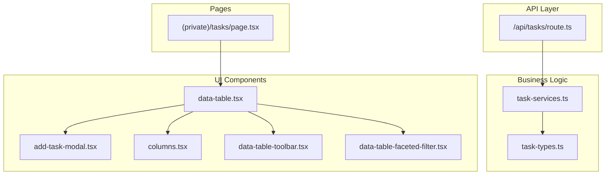
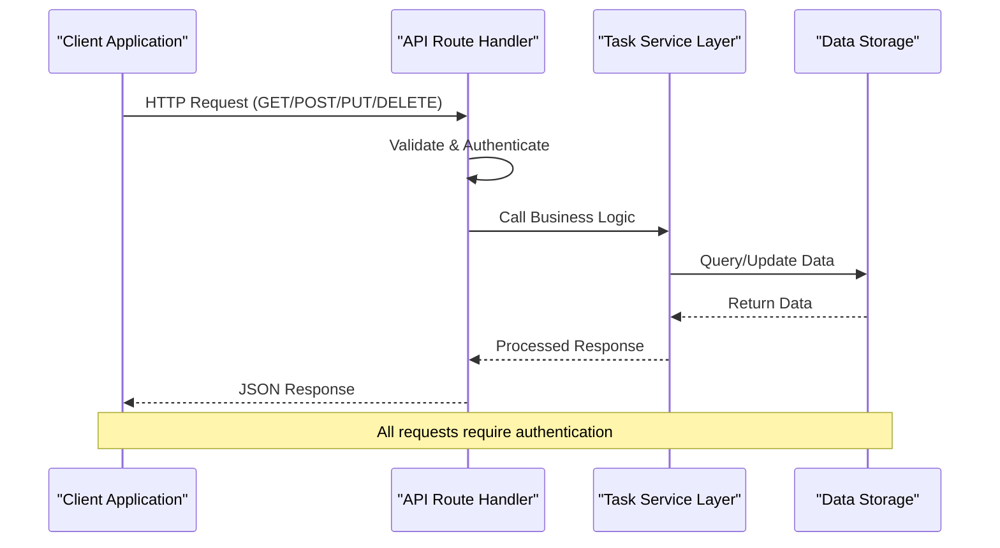
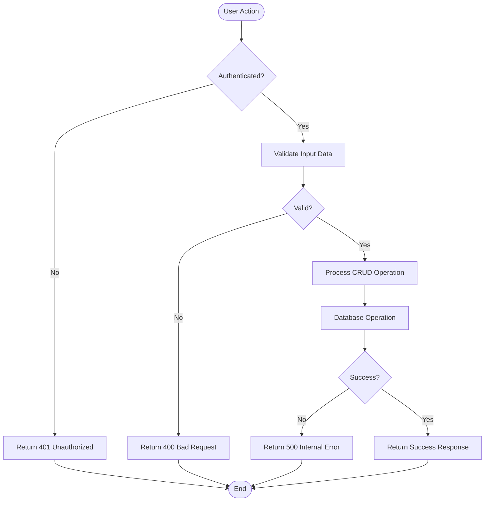
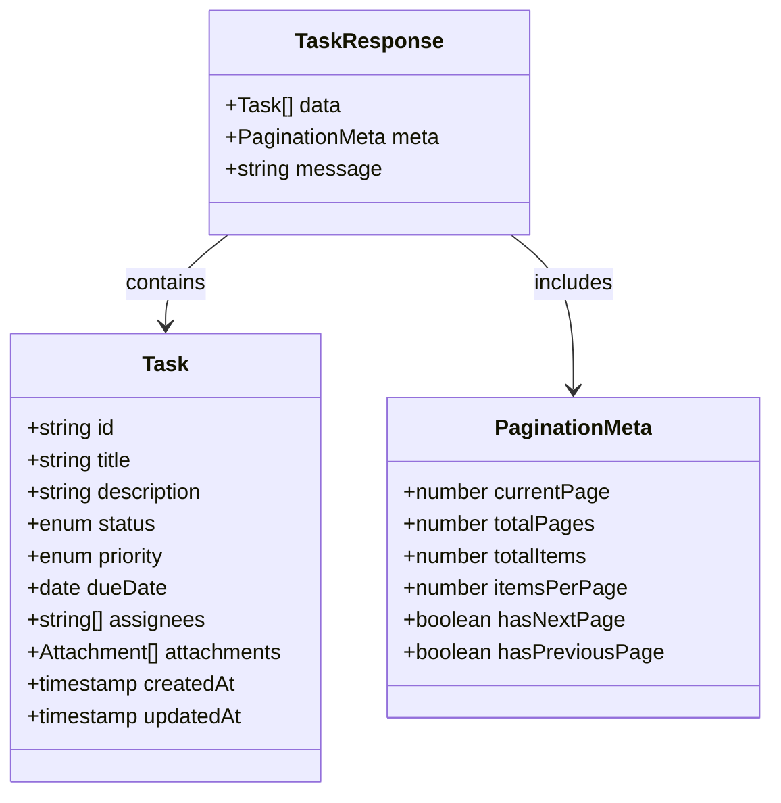
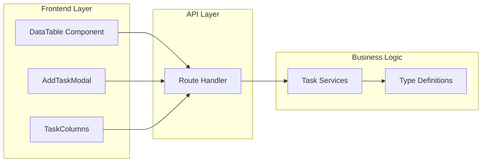

# Task CRUD Operations

<cite>
**Referenced Files in This Document**
- [route.ts](file://src/app/api/tasks/route.ts)
- [task-services.ts](file://src/modules/tasks/services/task-services.ts)
- [task-types.ts](file://src/modules/tasks/services/types/task-types.ts)
- [data-table.tsx](file://src/modules/tasks/components/data-table.tsx)
- [add-task-modal.tsx](file://src/modules/tasks/components/add-task-modal.tsx)
- [columns.tsx](file://src/modules/tasks/components/columns.tsx)
- [data-table-toolbar.tsx](file://src/modules/tasks/components/data-table-toolbar.tsx)
- [data-table-faceted-filter.tsx](file://src/modules/tasks/components/data-table-faceted-filter.tsx)
- [page.tsx](file://src/app/(private)/tasks/page.tsx)
</cite>

## Table of Contents
1. [Introduction](#introduction)
2. [Project Structure](#project-structure)
3. [Core Components](#core-components)
4. [Architecture Overview](#architecture-overview)
5. [Detailed Component Analysis](#detailed-component-analysis)
6. [Dependency Analysis](#dependency-analysis)
7. [Performance Considerations](#performance-considerations)
8. [Troubleshooting Guide](#troubleshooting-guide)
9. [Conclusion](#conclusion)

## Introduction
This document provides comprehensive API documentation for task CRUD (Create, Read, Update, Delete) operations within the Next.js dashboard application. The task management system includes full CRUD capabilities with advanced filtering, pagination, and data visualization features.

The application follows modern RESTful API conventions and implements proper authentication, validation, and error handling patterns typical of enterprise-level task management systems.

## Project Structure
The task management functionality is organized following Next.js App Router conventions with clear separation between API routes, business logic, and UI components:

**Diagram sources**
- [route.ts](file://src/app/api/tasks/route.ts)
- [task-services.ts](file://src/modules/tasks/services/task-services.ts)
- [task-types.ts](file://src/modules/tasks/services/types/task-types.ts)
- [data-table.tsx](file://src/modules/tasks/components/data-table.tsx)

**Section sources**
- [route.ts](file://src/app/api/tasks/route.ts)
- [task-services.ts](file://src/modules/tasks/services/task-services.ts)
- [task-types.ts](file://src/modules/tasks/services/types/task-types.ts)

## Core Components

### Task Data Model
The task model includes comprehensive fields for managing work items:

| Field | Type | Required | Description |
|-------|------|----------|-------------|
| id | string | Yes | Unique identifier for the task |
| title | string | Yes | Task title/description |
| description | string | No | Detailed task description |
| status | enum | Yes | Task status (todo, in-progress, completed) |
| priority | enum | Yes | Priority level (low, medium, high, urgent) |
| dueDate | date | No | Task deadline |
| assignees | array | No | List of assigned user IDs |
| attachments | array | No | File attachment metadata |
| createdAt | timestamp | Yes | Creation timestamp |
| updatedAt | timestamp | Yes | Last update timestamp |
| createdBy | string | Yes | User who created the task |

### Authentication Requirements
All task endpoints require authentication via NextAuth.js session management. Requests must include valid authentication tokens or cookies.

**Section sources**
- [task-types.ts](file://src/modules/tasks/services/types/task-types.ts)
- [task-services.ts](file://src/modules/tasks/services/task-services.ts)

## Architecture Overview

The task management system follows a layered architecture pattern:

**Diagram sources**
- [route.ts](file://src/app/api/tasks/route.ts)
- [task-services.ts](file://src/modules/tasks/services/task-services.ts)

## Detailed Component Analysis

### API Endpoints

#### Create Task
- **Endpoint**: `POST /api/tasks`
- **Authentication**: Required
- **Request Body**: Task creation object with required fields
- **Response**: Created task object with generated ID and timestamps

#### Read Tasks
- **Endpoint**: `GET /api/tasks`
- **Query Parameters**: 
  - `status`: Filter by task status
  - `priority`: Filter by priority level
  - `assignee`: Filter by assignee ID
  - `page`: Pagination page number
  - `limit`: Items per page
- **Response**: Paginated list of tasks with metadata

#### Update Task
- **Endpoint**: `PUT /api/tasks/:id`
- **Authentication**: Required
- **Path Parameter**: Task ID
- **Request Body**: Partial or complete task object
- **Response**: Updated task object

#### Delete Task
- **Endpoint**: `DELETE /api/tasks/:id`
- **Authentication**: Required
- **Path Parameter**: Task ID
- **Response**: Success confirmation

### Task Management Workflow

**Diagram sources**
- [route.ts](file://src/app/api/tasks/route.ts)
- [task-services.ts](file://src/modules/tasks/services/task-services.ts)

### Filtering and Search Capabilities

The system supports advanced filtering through query parameters:

| Filter Type | Parameter | Values | Example |
|-------------|-----------|--------|---------|
| Status | `status` | todo, in-progress, completed | `/api/tasks?status=completed` |
| Priority | `priority` | low, medium, high, urgent | `/api/tasks?priority=high` |
| Assignee | `assignee` | User ID | `/api/tasks?assignee=user123` |
| Date Range | `startDate`, `endDate` | ISO dates | `/api/tasks?startDate=2024-01-01` |
| Search | `search` | Text search | `/api/tasks?search=meeting` |

### Pagination Implementation

The API implements cursor-based pagination for efficient data retrieval:

**Diagram sources**
- [task-services.ts](file://src/modules/tasks/services/task-services.ts)
- [task-types.ts](file://src/modules/tasks/services/types/task-types.ts)

**Section sources**
- [route.ts](file://src/app/api/tasks/route.ts)
- [task-services.ts](file://src/modules/tasks/services/task-services.ts)
- [task-types.ts](file://src/modules/tasks/services/types/task-types.ts)

## Dependency Analysis

The task management system demonstrates clear separation of concerns with minimal coupling:

**Diagram sources**
- [data-table.tsx](file://src/modules/tasks/components/data-table.tsx)
- [add-task-modal.tsx](file://src/modules/tasks/components/add-task-modal.tsx)
- [columns.tsx](file://src/modules/tasks/components/columns.tsx)
- [route.ts](file://src/app/api/tasks/route.ts)
- [task-services.ts](file://src/modules/tasks/services/task-services.ts)
- [task-types.ts](file://src/modules/tasks/services/types/task-types.ts)

**Section sources**
- [data-table.tsx](file://src/modules/tasks/components/data-table.tsx)
- [add-task-modal.tsx](file://src/modules/tasks/components/add-task-modal.tsx)
- [columns.tsx](file://src/modules/tasks/components/columns.tsx)
- [route.ts](file://src/app/api/tasks/route.ts)

## Performance Considerations

### Database Optimization
- Implement indexing on frequently queried fields (status, priority, assignees)
- Use database queries that only fetch required fields
- Implement connection pooling for concurrent request handling

### API Response Optimization
- Enable response compression for large datasets
- Implement caching strategies for frequently accessed data
- Use selective field projection to reduce payload size

### Frontend Performance
- Implement virtual scrolling for large task lists
- Use optimistic updates for better user experience
- Implement debounced search and filtering

## Troubleshooting Guide

### Common Error Responses

| Status Code | Error Type | Description | Resolution |
|-------------|------------|-------------|------------|
| 400 | Validation Error | Invalid input data | Check request schema and field types |
| 401 | Unauthorized | Missing or invalid authentication | Verify authentication token |
| 403 | Forbidden | Insufficient permissions | Check user roles and permissions |
| 404 | Not Found | Task ID doesn't exist | Verify task ID exists |
| 409 | Conflict | Duplicate data | Handle unique constraint violations |
| 500 | Server Error | Internal server error | Check server logs and database connectivity |

### Debugging Tips
- Enable detailed logging for API requests and responses
- Use browser developer tools to inspect network requests
- Implement structured error messages with actionable information
- Monitor database query performance and optimize slow queries

**Section sources**
- [route.ts](file://src/app/api/tasks/route.ts)
- [task-services.ts](file://src/modules/tasks/services/task-services.ts)

## Conclusion

The task management system provides a robust foundation for CRUD operations with comprehensive filtering, pagination, and security features. The modular architecture ensures maintainability and scalability while providing an excellent developer experience through well-defined interfaces and consistent error handling patterns.

Key strengths include:
- Clean separation of concerns across layers
- Comprehensive authentication and authorization
- Flexible filtering and search capabilities
- Efficient pagination implementation
- Consistent error handling and validation

Future enhancements could include real-time updates, advanced analytics, and integration with external task management systems.