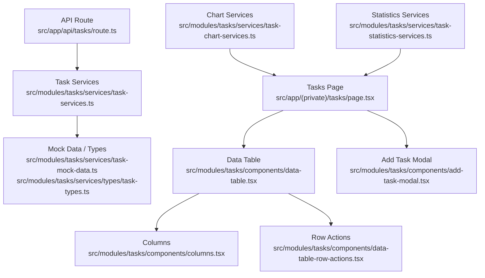
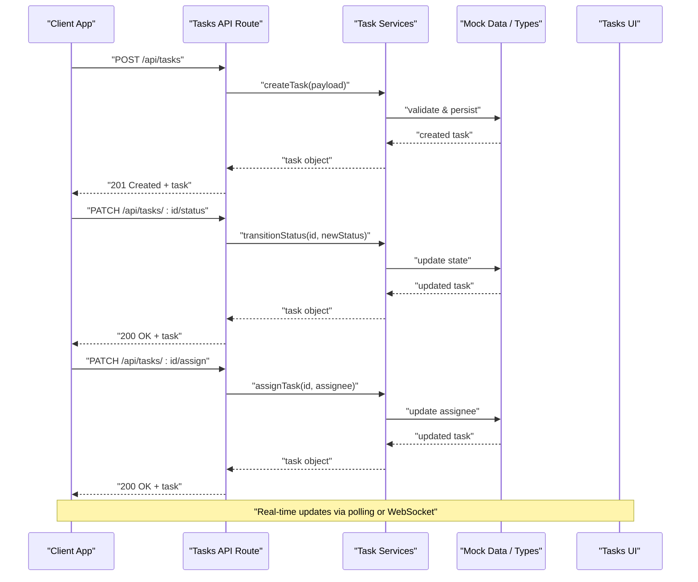
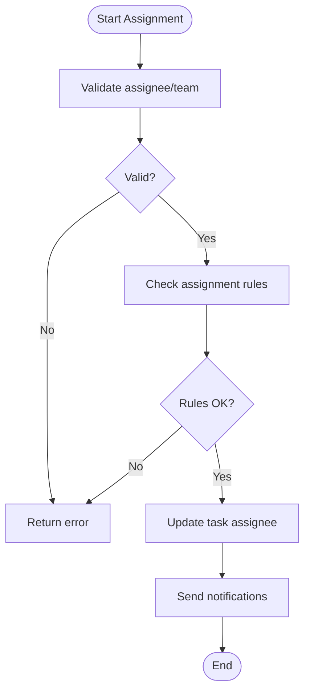
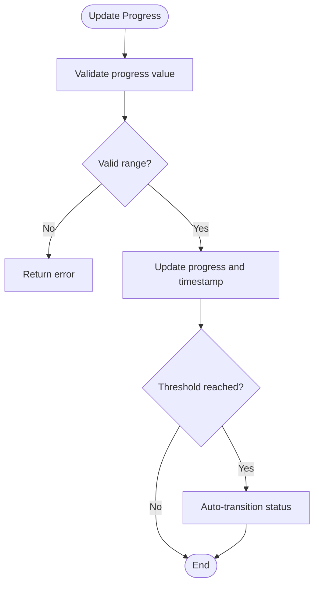
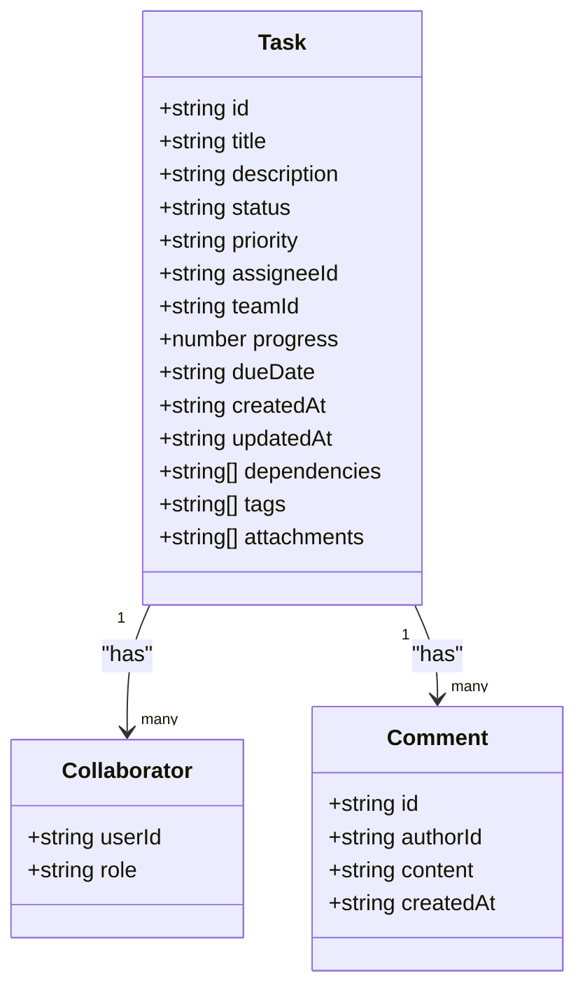
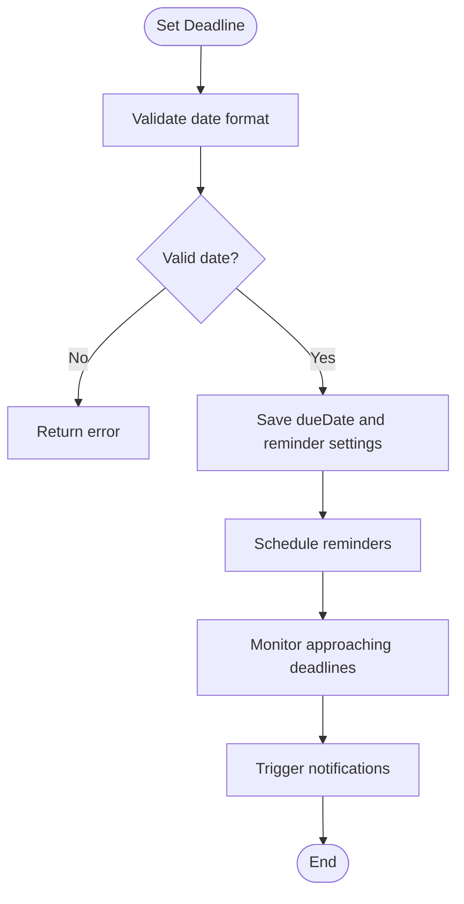
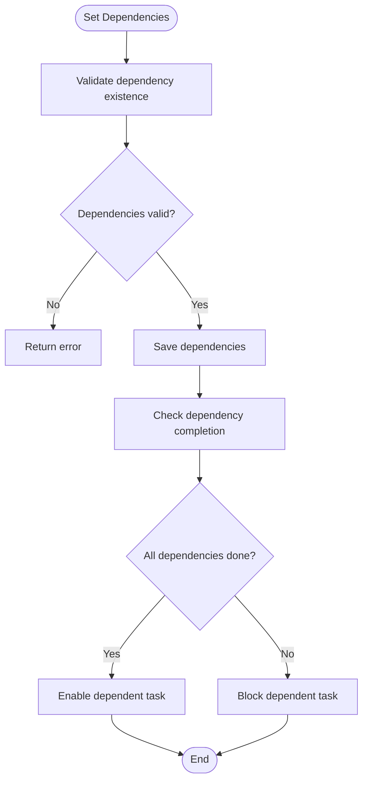
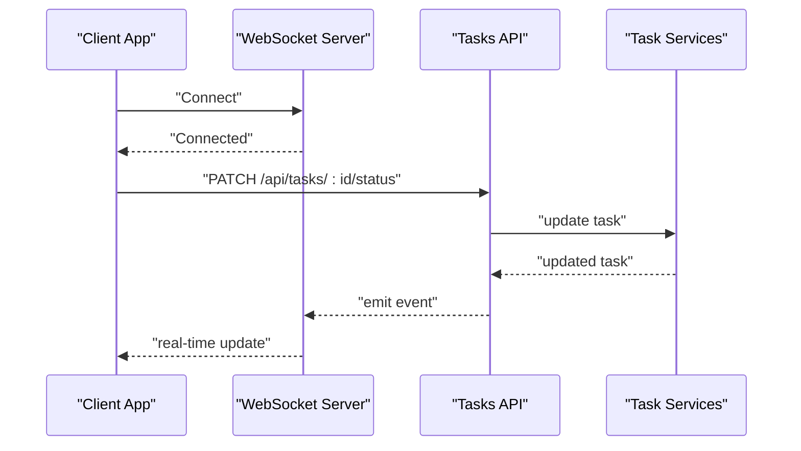
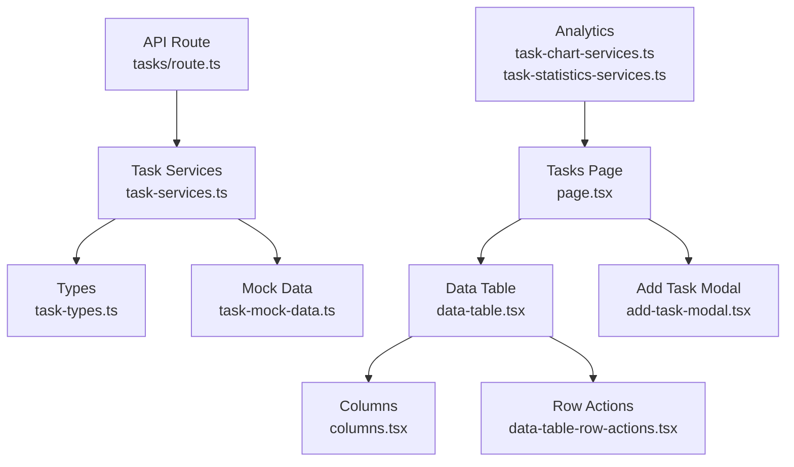

# Task Workflow Management

<cite>
**Referenced Files in This Document**
- [tasks/route.ts](file://src/app/api/tasks/route.ts)
- [task-types.ts](file://src/modules/tasks/services/types/task-types.ts)
- [task-services.ts](file://src/modules/tasks/services/task-services.ts)
- [task-mock-data.ts](file://src/modules/tasks/services/task-mock-data.ts)
- [page.tsx](file://src/app/(private)/tasks/page.tsx)
- [columns.tsx](file://src/modules/tasks/components/columns.tsx)
- [data-table.tsx](file://src/modules/tasks/components/data-table.tsx)
- [add-task-modal.tsx](file://src/modules/tasks/components/add-task-modal.tsx)
- [data-table-row-actions.tsx](file://src/modules/tasks/components/data-table-row-actions.tsx)
- [task-chart-services.ts](file://src/modules/tasks/services/task-chart-services.ts)
- [task-statistics-services.ts](file://src/modules/tasks/services/task-statistics-services.ts)
</cite>

## Table of Contents
1. [Introduction](#introduction)
2. [Project Structure](#project-structure)
3. [Core Components](#core-components)
4. [Architecture Overview](#architecture-overview)
5. [Detailed Component Analysis](#detailed-component-analysis)
6. [Dependency Analysis](#dependency-analysis)
7. [Performance Considerations](#performance-considerations)
8. [Troubleshooting Guide](#troubleshooting-guide)
9. [Conclusion](#conclusion)
10. [Appendices](#appendices)

## Introduction
This document provides detailed API documentation for task workflow management features, including endpoints for task status transitions, assignment workflows, progress tracking, and collaboration. It also defines schemas for task states (pending, in-progress, completed), priority levels, deadline management, and notification triggers. Examples are provided for automated workflow rules, team assignment processes, and task dependency handling. Real-time updates and webhook integrations for workflow automation are documented conceptually to guide implementation.

## Project Structure
The task workflow feature is implemented across the Next.js app routes and modules:
- API route for tasks at src/app/api/tasks/route.ts
- Types and services under src/modules/tasks/services
- UI components under src/modules/tasks/components
- Page entry point under src/app/(private)/tasks/page.tsx

**Diagram sources**
- [tasks/route.ts](file://src/app/api/tasks/route.ts)
- [task-services.ts](file://src/modules/tasks/services/task-services.ts)
- [task-mock-data.ts](file://src/modules/tasks/services/task-mock-data.ts)
- [task-types.ts](file://src/modules/tasks/services/types/task-types.ts)
- [page.tsx](file://src/app/(private)/tasks/page.tsx)
- [data-table.tsx](file://src/modules/tasks/components/data-table.tsx)
- [columns.tsx](file://src/modules/tasks/components/columns.tsx)
- [data-table-row-actions.tsx](file://src/modules/tasks/components/data-table-row-actions.tsx)
- [add-task-modal.tsx](file://src/modules/tasks/components/add-task-modal.tsx)
- [task-chart-services.ts](file://src/modules/tasks/services/task-chart-services.ts)
- [task-statistics-services.ts](file://src/modules/tasks/services/task-statistics-services.ts)

**Section sources**
- [tasks/route.ts](file://src/app/api/tasks/route.ts)
- [task-services.ts](file://src/modules/tasks/services/task-services.ts)
- [task-mock-data.ts](file://src/modules/tasks/services/task-mock-data.ts)
- [task-types.ts](file://src/modules/tasks/services/types/task-types.ts)
- [page.tsx](file://src/app/(private)/tasks/page.tsx)
- [data-table.tsx](file://src/modules/tasks/components/data-table.tsx)
- [columns.tsx](file://src/modules/tasks/components/columns.tsx)
- [data-table-row-actions.tsx](file://src/modules/tasks/components/data-table-row-actions.tsx)
- [add-task-modal.tsx](file://src/modules/tasks/components/add-task-modal.tsx)
- [task-chart-services.ts](file://src/modules/tasks/services/task-chart-services.ts)
- [task-statistics-services.ts](file://src/modules/tasks/services/task-statistics-services.ts)

## Core Components
- API endpoint: The tasks API route handles CRUD operations and workflow actions such as status transitions and assignments.
- Services layer: Task services encapsulate business logic for creating, updating, assigning, and transitioning tasks.
- Types: Centralized type definitions define task schema, statuses, priorities, deadlines, and collaborators.
- UI: The tasks page integrates a data table with columns, row actions, and an add-task modal for user interactions.
- Analytics: Chart and statistics services provide metrics for progress tracking and dashboards.

Key responsibilities:
- Status transitions: Move tasks between pending, in-progress, and completed states.
- Assignment workflows: Assign or reassign tasks to users or teams.
- Progress tracking: Update completion percentage and timestamps.
- Collaboration: Manage assignees, watchers, and comments.
- Deadlines: Set and enforce due dates with reminders.
- Notifications: Trigger alerts on state changes and assignments.

**Section sources**
- [tasks/route.ts](file://src/app/api/tasks/route.ts)
- [task-services.ts](file://src/modules/tasks/services/task-services.ts)
- [task-types.ts](file://src/modules/tasks/services/types/task-types.ts)
- [page.tsx](file://src/app/(private)/tasks/page.tsx)
- [data-table.tsx](file://src/modules/tasks/components/data-table.tsx)
- [columns.tsx](file://src/modules/tasks/components/columns.tsx)
- [data-table-row-actions.tsx](file://src/modules/tasks/components/data-table-row-actions.tsx)
- [add-task-modal.tsx](file://src/modules/tasks/components/add-task-modal.tsx)
- [task-chart-services.ts](file://src/modules/tasks/services/task-chart-services.ts)
- [task-statistics-services.ts](file://src/modules/tasks/services/task-statistics-services.ts)

## Architecture Overview
The task workflow architecture follows a layered approach:
- API Layer: Next.js route handlers expose REST endpoints.
- Service Layer: Business logic for task operations, validation, and side effects.
- Data Layer: Mock data and types serve as the current data source; can be replaced by a database.
- UI Layer: React components render tables, modals, and charts.

**Diagram sources**
- [tasks/route.ts](file://src/app/api/tasks/route.ts)
- [task-services.ts](file://src/modules/tasks/services/task-services.ts)
- [task-mock-data.ts](file://src/modules/tasks/services/task-mock-data.ts)
- [task-types.ts](file://src/modules/tasks/services/types/task-types.ts)
- [page.tsx](file://src/app/(private)/tasks/page.tsx)

## Detailed Component Analysis

### API Endpoints
- Create Task
  - Method: POST
  - Path: /api/tasks
  - Request body: task payload (see schema below)
  - Response: created task object
- Update Task Status
  - Method: PATCH
  - Path: /api/tasks/:id/status
  - Request body: { status }
  - Response: updated task object
- Assign Task
  - Method: PATCH
  - Path: /api/tasks/:id/assign
  - Request body: { assigneeId, teamId? }
  - Response: updated task object
- Update Progress
  - Method: PATCH
  - Path: /api/tasks/:id/progress
  - Request body: { progress, updatedAt }
  - Response: updated task object
- Add Collaborator
  - Method: PATCH
  - Path: /api/tasks/:id/collaborators
  - Request body: { userId, role }
  - Response: updated task object
- Set Deadline
  - Method: PATCH
  - Path: /api/tasks/:id/deadline
  - Request body: { dueDate, reminderEnabled }
  - Response: updated task object

Request and response schemas:
- Task
  - id: string
  - title: string
  - description: string
  - status: "pending" | "in-progress" | "completed"
  - priority: "low" | "medium" | "high" | "critical"
  - assigneeId: string
  - teamId: string?
  - collaborators: [{ userId: string, role: string }]
  - progress: number (0–100)
  - dueDate: string (ISO date)
  - createdAt: string (ISO datetime)
  - updatedAt: string (ISO datetime)
  - dependencies: [string] (task ids)
  - tags: [string]
  - attachments: [string]
- Status Transition
  - status: "pending" | "in-progress" | "completed"
- Assignment
  - assigneeId: string
  - teamId: string?
- Progress Update
  - progress: number (0–100)
  - updatedAt: string (ISO datetime)
- Collaborator
  - userId: string
  - role: string
- Deadline
  - dueDate: string (ISO date)
  - reminderEnabled: boolean

Error responses:
- 400 Bad Request: invalid payload
- 404 Not Found: task not found
- 403 Forbidden: insufficient permissions
- 500 Internal Server Error: unexpected failure

**Section sources**
- [tasks/route.ts](file://src/app/api/tasks/route.ts)
- [task-types.ts](file://src/modules/tasks/services/types/task-types.ts)

### Task States and Priority Levels
- States
  - pending: initial state before work begins
  - in-progress: actively being worked on
  - completed: finished and verified
- Priority Levels
  - low: non-urgent tasks
  - medium: standard priority
  - high: urgent tasks requiring attention
  - critical: must be resolved immediately

State transition rules:
- pending → in-progress: allowed when assigned and started
- in-progress → completed: allowed when work is verified
- pending → completed: allowed only if no work was performed
- in-progress → pending: allowed to pause work

**Section sources**
- [task-types.ts](file://src/modules/tasks/services/types/task-types.ts)
- [task-services.ts](file://src/modules/tasks/services/task-services.ts)

### Assignment Workflows
- Single assignee: direct assignment to a user
- Team assignment: assign to a team with automatic distribution rules
- Reassignment: transfer ownership with audit trail
- Role-based access: restrict who can assign or reassign

Assignment process flow:

**Diagram sources**
- [task-services.ts](file://src/modules/tasks/services/task-services.ts)
- [task-types.ts](file://src/modules/tasks/services/types/task-types.ts)

**Section sources**
- [task-services.ts](file://src/modules/tasks/services/task-services.ts)
- [task-types.ts](file://src/modules/tasks/services/types/task-types.ts)

### Progress Tracking
- Progress field tracks completion percentage (0–100)
- Timestamps record last update time
- Milestones can be defined via tags or subtasks
- Automated checks can trigger status transitions based on progress thresholds

Progress update flow:

**Diagram sources**
- [task-services.ts](file://src/modules/tasks/services/task-services.ts)
- [task-types.ts](file://src/modules/tasks/services/types/task-types.ts)

**Section sources**
- [task-services.ts](file://src/modules/tasks/services/task-services.ts)
- [task-types.ts](file://src/modules/tasks/services/types/task-types.ts)

### Collaboration Features
- Collaborators: multiple users with roles (viewer, commenter, editor)
- Comments: threaded discussions attached to tasks
- Activity log: track all changes and interactions
- Permissions: control access based on roles and team membership

Collaboration model:

**Diagram sources**
- [task-types.ts](file://src/modules/tasks/services/types/task-types.ts)

**Section sources**
- [task-types.ts](file://src/modules/tasks/services/types/task-types.ts)

### Deadline Management
- Due dates: ISO format dates for task deadlines
- Reminders: configurable notification triggers before due dates
- Overdue handling: automatic flags and escalation rules
- Scheduling: integration with calendar systems

Deadline workflow:

**Diagram sources**
- [task-services.ts](file://src/modules/tasks/services/task-services.ts)
- [task-types.ts](file://src/modules/tasks/services/types/task-types.ts)

**Section sources**
- [task-services.ts](file://src/modules/tasks/services/task-services.ts)
- [task-types.ts](file://src/modules/tasks/services/types/task-types.ts)

### Notification Triggers
- Event-driven notifications for:
  - Status transitions
  - Assignments and reassignments
  - Progress updates
  - Deadline reminders and overdue alerts
  - New comments and mentions
- Channels: email, in-app notifications, webhooks
- Preferences: per-user notification settings

Notification triggers:
- On create: notify assignee and team
- On status change: notify stakeholders
- On assignment: notify new assignee and previous assignee
- On deadline: send reminders at configured intervals
- On comment: notify mentioned users

**Section sources**
- [task-services.ts](file://src/modules/tasks/services/task-services.ts)
- [task-types.ts](file://src/modules/tasks/services/types/task-types.ts)

### Automated Workflow Rules
Examples of automation:
- Auto-assign based on workload or skills
- Auto-transition after milestone completion
- Escalate overdue tasks to managers
- Sync with external tools via webhooks

Automation rule structure:
- Trigger: event that starts the rule
- Condition: criteria that must be met
- Action: operation to perform
- Scope: tasks/users affected

**Section sources**
- [task-services.ts](file://src/modules/tasks/services/task-services.ts)

### Task Dependency Handling
- Dependencies: link tasks to block or enable other tasks
- Validation: prevent completion if dependencies are incomplete
- Visualization: show dependency graphs in UI
- Automation: auto-update dependent tasks on changes

Dependency workflow:

**Diagram sources**
- [task-services.ts](file://src/modules/tasks/services/task-services.ts)
- [task-types.ts](file://src/modules/tasks/services/types/task-types.ts)

**Section sources**
- [task-services.ts](file://src/modules/tasks/services/task-services.ts)
- [task-types.ts](file://src/modules/tasks/services/types/task-types.ts)

### Real-Time Updates
- Polling: periodic requests to fetch latest task state
- WebSockets: persistent connections for instant updates
- Server-Sent Events: one-way real-time communication
- Optimistic UI: update UI immediately, rollback on error

Real-time update flow:

**Diagram sources**
- [tasks/route.ts](file://src/app/api/tasks/route.ts)
- [task-services.ts](file://src/modules/tasks/services/task-services.ts)

### Webhook Integrations
- Outgoing webhooks for external system integration
- Configurable endpoints and payloads
- Retry mechanisms and error handling
- Security: signature verification and authentication

Webhook configuration:
- URL: destination endpoint
- Events: subscribe to specific task events
- Payload: structured JSON with task data
- Headers: custom headers for authentication

**Section sources**
- [task-services.ts](file://src/modules/tasks/services/task-services.ts)

## Dependency Analysis
The task workflow system has clear separation of concerns:
- API routes depend on services for business logic
- Services depend on types for data validation
- UI components depend on services for data operations
- Analytics services provide metrics without modifying core data

**Diagram sources**
- [tasks/route.ts](file://src/app/api/tasks/route.ts)
- [task-services.ts](file://src/modules/tasks/services/task-services.ts)
- [task-types.ts](file://src/modules/tasks/services/types/task-types.ts)
- [task-mock-data.ts](file://src/modules/tasks/services/task-mock-data.ts)
- [page.tsx](file://src/app/(private)/tasks/page.tsx)
- [data-table.tsx](file://src/modules/tasks/components/data-table.tsx)
- [columns.tsx](file://src/modules/tasks/components/columns.tsx)
- [data-table-row-actions.tsx](file://src/modules/tasks/components/data-table-row-actions.tsx)
- [add-task-modal.tsx](file://src/modules/tasks/components/add-task-modal.tsx)
- [task-chart-services.ts](file://src/modules/tasks/services/task-chart-services.ts)
- [task-statistics-services.ts](file://src/modules/tasks/services/task-statistics-services.ts)

**Section sources**
- [tasks/route.ts](file://src/app/api/tasks/route.ts)
- [task-services.ts](file://src/modules/tasks/services/task-services.ts)
- [task-types.ts](file://src/modules/tasks/services/types/task-types.ts)
- [task-mock-data.ts](file://src/modules/tasks/services/task-mock-data.ts)
- [page.tsx](file://src/app/(private)/tasks/page.tsx)
- [data-table.tsx](file://src/modules/tasks/components/data-table.tsx)
- [columns.tsx](file://src/modules/tasks/components/columns.tsx)
- [data-table-row-actions.tsx](file://src/modules/tasks/components/data-table-row-actions.tsx)
- [add-task-modal.tsx](file://src/modules/tasks/components/add-task-modal.tsx)
- [task-chart-services.ts](file://src/modules/tasks/services/task-chart-services.ts)
- [task-statistics-services.ts](file://src/modules/tasks/services/task-statistics-services.ts)

## Performance Considerations
- Batch operations: group multiple task updates into single requests
- Pagination: implement server-side pagination for large datasets
- Caching: cache frequently accessed task data
- Debouncing: debounce rapid UI interactions
- Lazy loading: load components and data on demand
- Indexing: optimize database queries with proper indexes

[No sources needed since this section provides general guidance]

## Troubleshooting Guide
Common issues and solutions:
- Invalid status transitions: validate state machine rules
- Permission errors: check user roles and task ownership
- Data validation failures: ensure payload matches schema
- Network errors: implement retry logic and fallbacks
- Real-time sync issues: handle connection drops gracefully

Debugging tips:
- Log all API requests and responses
- Track task state changes with timestamps
- Monitor performance metrics and errors
- Use browser dev tools to inspect network calls

**Section sources**
- [tasks/route.ts](file://src/app/api/tasks/route.ts)
- [task-services.ts](file://src/modules/tasks/services/task-services.ts)

## Conclusion
The task workflow management system provides comprehensive functionality for managing tasks through their lifecycle. With well-defined APIs, robust service layer, and intuitive UI components, it supports complex workflows including status transitions, assignments, progress tracking, and collaboration. The modular architecture allows for easy extension and integration with external systems through webhooks and real-time updates.

[No sources needed since this section summarizes without analyzing specific files]

## Appendices

### Example API Requests and Responses
- Create Task Request:
  - POST /api/tasks
  - Body: { title, description, priority, assigneeId, dueDate }
  - Response: { id, title, description, status, priority, assigneeId, dueDate, createdAt, updatedAt }

- Update Status Request:
  - PATCH /api/tasks/:id/status
  - Body: { status: "in-progress" }
  - Response: updated task object

- Assign Task Request:
  - PATCH /api/tasks/:id/assign
  - Body: { assigneeId: "user123", teamId: "team456" }
  - Response: updated task object

**Section sources**
- [tasks/route.ts](file://src/app/api/tasks/route.ts)
- [task-types.ts](file://src/modules/tasks/services/types/task-types.ts)

### UI Component Integration
The tasks page integrates seamlessly with the data table component, providing filtering, sorting, and pagination capabilities. The add-task modal offers a user-friendly interface for creating new tasks with validation and feedback.

**Section sources**
- [page.tsx](file://src/app/(private)/tasks/page.tsx)
- [data-table.tsx](file://src/modules/tasks/components/data-table.tsx)
- [add-task-modal.tsx](file://src/modules/tasks/components/add-task-modal.tsx)