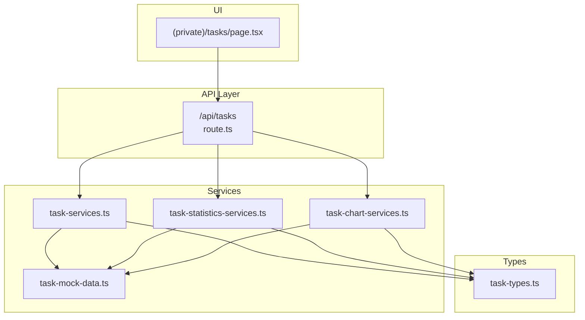
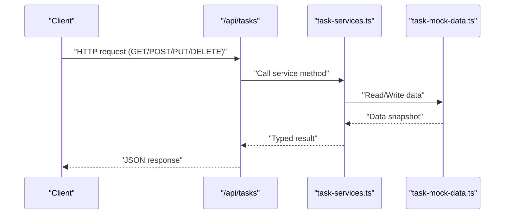
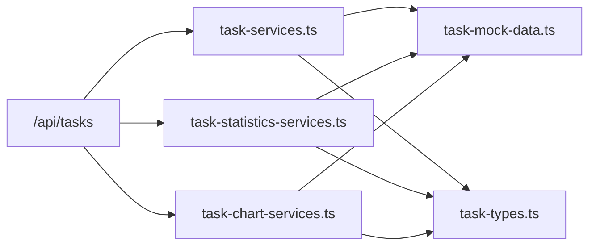

# Tasks API

<cite>
**Referenced Files in This Document**
- [tasks/route.ts](file://src/app/api/tasks/route.ts)
- [task-types.ts](file://src/modules/tasks/services/types/task-types.ts)
- [task-services.ts](file://src/modules/tasks/services/task-services.ts)
- [task-mock-data.ts](file://src/modules/tasks/services/task-mock-data.ts)
- [task-statistics-services.ts](file://src/modules/tasks/services/task-statistics-services.ts)
- [task-chart-services.ts](file://src/modules/tasks/services/task-chart-services.ts)
- [tasks/page.tsx](file://src/app/(private)/tasks/page.tsx)
</cite>

## Table of Contents
1. [Introduction](#introduction)
2. [Project Structure](#project-structure)
3. [Core Components](#core-components)
4. [Architecture Overview](#architecture-overview)
5. [Detailed Component Analysis](#detailed-component-analysis)
6. [Dependency Analysis](#dependency-analysis)
7. [Performance Considerations](#performance-considerations)
8. [Troubleshooting Guide](#troubleshooting-guide)
9. [Conclusion](#conclusion)
10. [Appendices](#appendices)

## Introduction
This document provides detailed API documentation for the task management endpoints and related services. It covers:
- Task CRUD operations (create, read, update, delete)
- Status updates and assignment workflows
- Progress tracking and reporting
- Statistics endpoints and chart data
- Request/response schemas for tasks, priorities, due dates, and attachments
- Examples for automation and team collaboration flows

The implementation uses Next.js App Router API routes with TypeScript types and service modules. Data is currently backed by mock data; the route handlers orchestrate requests and responses.

## Project Structure
The task feature spans API routes, service modules, type definitions, and a UI page that consumes the API.

**Diagram sources**
- [tasks/route.ts](file://src/app/api/tasks/route.ts)
- [task-services.ts](file://src/modules/tasks/services/task-services.ts)
- [task-statistics-services.ts](file://src/modules/tasks/services/task-statistics-services.ts)
- [task-chart-services.ts](file://src/modules/tasks/services/task-chart-services.ts)
- [task-mock-data.ts](file://src/modules/tasks/services/task-mock-data.ts)
- [task-types.ts](file://src/modules/tasks/services/types/task-types.ts)
- [tasks/page.tsx](file://src/app/(private)/tasks/page.tsx)

**Section sources**
- [tasks/route.ts](file://src/app/api/tasks/route.ts)
- [task-services.ts](file://src/modules/tasks/services/task-services.ts)
- [task-statistics-services.ts](file://src/modules/tasks/services/task-statistics-services.ts)
- [task-chart-services.ts](file://src/modules/tasks/services/task-chart-services.ts)
- [task-mock-data.ts](file://src/modules/tasks/services/task-mock-data.ts)
- [task-types.ts](file://src/modules/tasks/services/types/task-types.ts)
- [tasks/page.tsx](file://src/app/(private)/tasks/page.tsx)

## Core Components
- API Route Handler: /api/tasks
  - Exposes HTTP methods to manage tasks and retrieve statistics/charts.
  - Delegates business logic to service modules and reads/writes from mock data.
- Services
  - task-services.ts: CRUD operations for tasks.
  - task-statistics-services.ts: Aggregates counts and metrics.
  - task-chart-services.ts: Prepares chart-ready datasets.
  - task-mock-data.ts: In-memory dataset used as the current data store.
- Types
  - task-types.ts: Shared TypeScript interfaces for request/response payloads and enums.

Key responsibilities:
- Validation and normalization of inputs at the route layer.
- Business rules and transformations inside services.
- Type safety across layers via shared types.

**Section sources**
- [tasks/route.ts](file://src/app/api/tasks/route.ts)
- [task-services.ts](file://src/modules/tasks/services/task-services.ts)
- [task-statistics-services.ts](file://src/modules/tasks/services/task-statistics-services.ts)
- [task-chart-services.ts](file://src/modules/tasks/services/task-chart-services.ts)
- [task-mock-data.ts](file://src/modules/tasks/services/task-mock-data.ts)
- [task-types.ts](file://src/modules/tasks/services/types/task-types.ts)

## Architecture Overview
High-level flow for task operations:
- Client calls /api/tasks with an HTTP method.
- Route handler parses the request, validates input, and invokes the appropriate service function.
- Service functions operate on mock data and return typed results.
- Route handler serializes the response.

**Diagram sources**
- [tasks/route.ts](file://src/app/api/tasks/route.ts)
- [task-services.ts](file://src/modules/tasks/services/task-services.ts)
- [task-mock-data.ts](file://src/modules/tasks/services/task-mock-data.ts)

## Detailed Component Analysis

### API Endpoints: /api/tasks
Base path: /api/tasks

Supported methods and behaviors:
- GET /api/tasks
  - Purpose: Retrieve all tasks or filter by query parameters.
  - Query parameters:
    - status: Filter by task status.
    - priority: Filter by priority level.
    - assigneeId: Filter by assigned user ID.
    - search: Free-text search across title/description.
  - Response: Array of task objects.

- POST /api/tasks
  - Purpose: Create a new task.
  - Request body fields:
    - title: string
    - description: string (optional)
    - status: enum (see TaskStatus below)
    - priority: enum (see PriorityLevel below)
    - dueDate: string (ISO date-time)
    - assigneeId: string (user ID)
    - attachments: array of attachment objects (optional)
  - Response: Created task object.

- PUT /api/tasks/:id
  - Purpose: Update an existing task.
  - Path parameter: id (string)
  - Request body: Partial task fields (same as POST).
  - Response: Updated task object.

- DELETE /api/tasks/:id
  - Purpose: Delete a task by ID.
  - Path parameter: id (string)
  - Response: Success confirmation or error details.

Notes:
- The route handler delegates to service functions for validation and persistence.
- All responses are JSON with consistent shape defined by shared types.

**Section sources**
- [tasks/route.ts](file://src/app/api/tasks/route.ts)

### Task Model and Enums
Shared types define the canonical shapes for requests and responses.

Task model fields:
- id: string (unique identifier)
- title: string
- description: string
- status: TaskStatus
- priority: PriorityLevel
- dueDate: string (ISO date-time)
- assigneeId: string
- attachments: Attachment[]
- createdAt: string (ISO date-time)
- updatedAt: string (ISO date-time)

Enums:
- TaskStatus: e.g., "todo", "in_progress", "review", "done", "cancelled"
- PriorityLevel: e.g., "low", "medium", "high", "urgent"

Attachment model:
- id: string
- name: string
- url: string
- size: number
- mimeType: string
- uploadedAt: string (ISO date-time)

Validation notes:
- Required fields must be present and non-empty.
- Dates must be valid ISO strings.
- Enum values must match allowed sets.

**Section sources**
- [task-types.ts](file://src/modules/tasks/services/types/task-types.ts)

### Task CRUD Operations
Service functions encapsulate:
- createTask(payload): Validates payload, generates IDs/timestamps, persists to mock data, returns created task.
- getTasks(filters): Applies filters (status, priority, assigneeId, search), returns matching tasks.
- updateTask(id, patch): Finds task by ID, applies partial update, updates timestamps, returns updated task.
- deleteTask(id): Removes task by ID, returns success or error.

Complexity:
- List and search: O(n) over stored tasks.
- Update/Delete: O(1) lookup if keyed by ID; otherwise O(n).

Optimization opportunities:
- Indexing by common filters (status, priority, assigneeId).
- Pagination and cursor-based queries for large datasets.
- Deduplication and caching for repeated queries.

**Section sources**
- [task-services.ts](file://src/modules/tasks/services/task-services.ts)
- [task-mock-data.ts](file://src/modules/tasks/services/task-mock-data.ts)
- [task-types.ts](file://src/modules/tasks/services/types/task-types.ts)

### Status Updates and Assignment Workflows
Status transitions:
- Allowed transitions are enforced by business rules in the service layer.
- Typical flow: todo → in_progress → review → done or cancelled.

Assignment workflow:
- Assignee can be set or changed via updateTask.
- Optional notifications or audit logs can be added later.

Progress tracking:
- Derived progress can be computed from statuses and completion flags.
- Chart services provide aggregated views for dashboards.

**Section sources**
- [task-services.ts](file://src/modules/tasks/services/task-services.ts)
- [task-types.ts](file://src/modules/tasks/services/types/task-types.ts)

### Statistics and Reporting
Statistics endpoints:
- GET /api/tasks/statistics
  - Returns counts by status, priority, assignee, overdue tasks, etc.
  - Useful for dashboards and KPIs.

Chart data endpoints:
- GET /api/tasks/charts
  - Returns time-series or categorical data for charts (e.g., tasks per week, distribution by priority).

Response shapes:
- Statistics: Object with numeric aggregates and breakdowns.
- Charts: Array of points or categories suitable for visualization libraries.

**Section sources**
- [task-statistics-services.ts](file://src/modules/tasks/services/task-statistics-services.ts)
- [task-chart-services.ts](file://src/modules/tasks/services/task-chart-services.ts)
- [task-types.ts](file://src/modules/tasks/services/types/task-types.ts)

### Real-time Updates
Current state:
- The API is synchronous; real-time capabilities are not implemented in the provided files.

Recommendations:
- Integrate Server-Sent Events (SSE) or WebSockets to push task updates to clients.
- Use event-driven architecture to broadcast changes after mutations.

[No sources needed since this section provides general guidance]

### Example Workflows

#### Task Creation and Assignment
- Client sends POST /api/tasks with required fields.
- Server validates and creates the task, returning the full task object including generated IDs and timestamps.
- Client may immediately update assignee or status via PUT /api/tasks/:id.

#### Bulk Status Update
- Client retrieves tasks via GET /api/tasks?status=todo&assigneeId=...
- For each task, client issues PUT /api/tasks/:id with status=in_progress.
- Optionally, client polls or subscribes to updates for live feedback.

#### Reporting and Dashboards
- Client calls GET /api/tasks/statistics to render summary cards.
- Client calls GET /api/tasks/charts to render trend and distribution charts.

[No sources needed since this section provides general guidance]

## Dependency Analysis
Internal dependencies:
- Route handler depends on service modules for business logic.
- Services depend on mock data for persistence and on shared types for contracts.

**Diagram sources**
- [tasks/route.ts](file://src/app/api/tasks/route.ts)
- [task-services.ts](file://src/modules/tasks/services/task-services.ts)
- [task-statistics-services.ts](file://src/modules/tasks/services/task-statistics-services.ts)
- [task-chart-services.ts](file://src/modules/tasks/services/task-chart-services.ts)
- [task-mock-data.ts](file://src/modules/tasks/services/task-mock-data.ts)
- [task-types.ts](file://src/modules/tasks/services/types/task-types.ts)

**Section sources**
- [tasks/route.ts](file://src/app/api/tasks/route.ts)
- [task-services.ts](file://src/modules/tasks/services/task-services.ts)
- [task-statistics-services.ts](file://src/modules/tasks/services/task-statistics-services.ts)
- [task-chart-services.ts](file://src/modules/tasks/services/task-chart-services.ts)
- [task-mock-data.ts](file://src/modules/tasks/services/task-mock-data.ts)
- [task-types.ts](file://src/modules/tasks/services/types/task-types.ts)

## Performance Considerations
- Filtering and search are linear scans; consider indexing or database-backed storage for scale.
- Implement pagination for list endpoints to reduce payload sizes.
- Cache frequently accessed statistics and charts with short TTLs.
- Validate and normalize inputs early to avoid unnecessary processing.

[No sources needed since this section provides general guidance]

## Troubleshooting Guide
Common issues and resolutions:
- Invalid enum values: Ensure status and priority match allowed sets.
- Malformed dates: Provide ISO-compliant date-time strings.
- Missing required fields: Include all mandatory fields in create/update requests.
- Not found errors: Verify task IDs exist before update/delete.

Diagnostics:
- Log request payloads and responses during development.
- Return structured error objects with codes and messages.

[No sources needed since this section provides general guidance]

## Conclusion
The Tasks API provides a clear surface for managing tasks, updating statuses, assigning work, and retrieving statistics and charts. With shared types and modular services, it is straightforward to extend with persistent storage, real-time updates, and advanced filtering.

[No sources needed since this section summarizes without analyzing specific files]

## Appendices

### Request/Response Schemas Summary
- Task fields: id, title, description, status, priority, dueDate, assigneeId, attachments, createdAt, updatedAt
- Enums: TaskStatus, PriorityLevel
- Attachments: id, name, url, size, mimeType, uploadedAt
- Statistics: aggregate counts and breakdowns
- Charts: arrays of points/categories for visualization

**Section sources**
- [task-types.ts](file://src/modules/tasks/services/types/task-types.ts)

### UI Integration Notes
- The private tasks page consumes the API for listing and managing tasks.
- Ensure consistent field names between UI components and API responses.

**Section sources**
- [tasks/page.tsx](file://src/app/(private)/tasks/page.tsx)