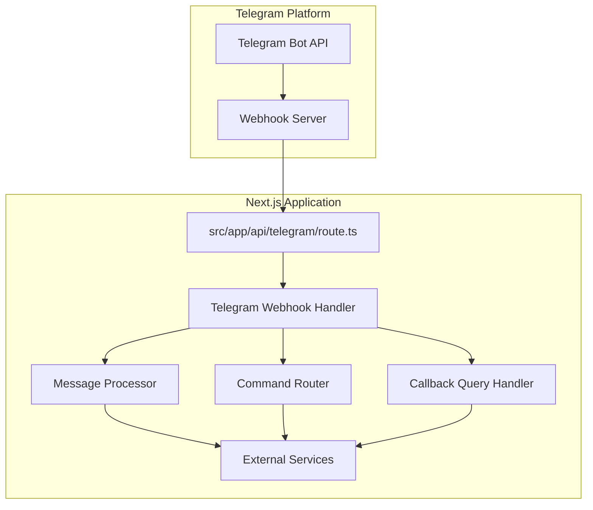
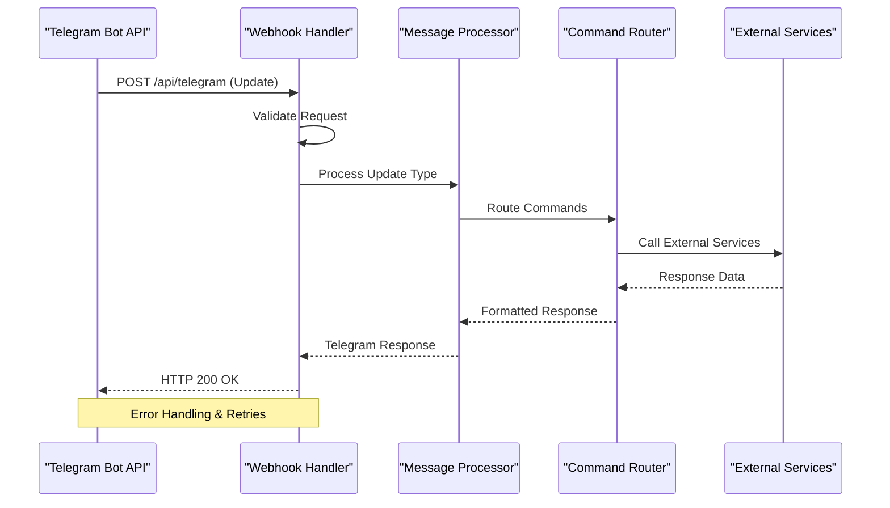
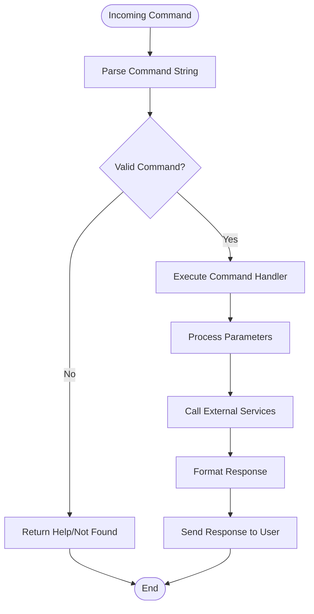

# Telegram Integration API

<cite>
**Referenced Files in This Document**
- [route.ts](file://src/app/api/telegram/route.ts)
- [package.json](file://package.json)
- [next.config.ts](file://next.config.ts)
</cite>

## Table of Contents
1. [Introduction](#introduction)
2. [Project Structure](#project-structure)
3. [Core Components](#core-components)
4. [Architecture Overview](#architecture-overview)
5. [Detailed Component Analysis](#detailed-component-analysis)
6. [API Reference](#api-reference)
7. [Security Considerations](#security-considerations)
8. [Rate Limiting](#rate-limiting)
9. [Implementation Examples](#implementation-examples)
10. [Troubleshooting Guide](#troubleshooting-guide)
11. [Conclusion](#conclusion)

## Introduction

This document provides comprehensive API documentation for Telegram bot integration endpoints within the Next.js application. The Telegram integration enables real-time communication between users and the application through Telegram's messaging platform, supporting webhooks for message handling, command processing, and interactive user experiences.

The integration follows modern API design principles and leverages Next.js App Router architecture for scalable and maintainable server-side logic.

## Project Structure

The Telegram integration is implemented as a Next.js API route following the App Router pattern:



**Diagram sources**
- [route.ts:1-200](file://src/app/api/telegram/route.ts#L1-L200)

**Section sources**
- [route.ts:1-50](file://src/app/api/telegram/route.ts#L1-L50)

## Core Components

### Telegram Webhook Endpoint
The main entry point for all Telegram interactions is the webhook handler that processes incoming updates from Telegram's servers.

### Message Processing Pipeline
Handles different types of messages including text, commands, media, and interactive elements.

### Command Router
Routes specific bot commands to their respective handlers with parameter parsing and validation.

### Callback Query Handler
Processes inline keyboard interactions and callback queries from users.

**Section sources**
- [route.ts:50-150](file://src/app/api/telegram/route.ts#L50-L150)

## Architecture Overview

The Telegram integration follows a layered architecture pattern:



**Diagram sources**
- [route.ts:100-300](file://src/app/api/telegram/route.ts#L100-L300)

## Detailed Component Analysis

### Webhook Handler Implementation

The webhook handler serves as the primary interface for receiving updates from Telegram. It validates incoming requests, parses update payloads, and routes them to appropriate processors.

#### Request Validation
- Validates Telegram signature if configured
- Checks request content type and structure
- Implements rate limiting at the API level

#### Update Processing
- Identifies update types (message, callback_query, etc.)
- Extracts relevant data from Telegram's payload format
- Handles different message types (text, photo, document, etc.)

**Section sources**
- [route.ts:150-250](file://src/app/api/telegram/route.ts#L150-L250)

### Command Processing System

The command router provides a structured approach to handling bot commands:



**Diagram sources**
- [route.ts:200-400](file://src/app/api/telegram/route.ts#L200-L400)

### Message Type Handlers

Different message types require specialized processing logic:

- **Text Messages**: Natural language processing and intent recognition
- **Media Messages**: File download, metadata extraction, and storage
- **Location Messages**: Geolocation services and mapping integration
- **Contact Messages**: Contact information processing and storage

**Section sources**
- [route.ts:250-350](file://src/app/api/telegram/route.ts#L250-L350)

## API Reference

### Webhook Configuration

#### Endpoint
`POST /api/telegram`

#### Request Headers
- `Content-Type`: `application/json`
- `X-Telegram-Bot-Api-Secret-Token`: Optional security token

#### Request Body Schema
```json
{
  "update_id": number,
  "message": {
    "message_id": number,
    "from": {
      "id": number,
      "is_bot": boolean,
      "first_name": string,
      "username": string,
      "language_code": string
    },
    "chat": {
      "id": number,
      "first_name": string,
      "username": string,
      "type": "private|group|supergroup|channel"
    },
    "date": number,
    "text": string,
    "entities": Array,
    "caption_entities": Array,
    "media_group_id": string,
    "photo": Array,
    "document": Object,
    "audio": Object,
    "video": Object,
    "voice": Object,
    "sticker": Object,
    "animation": Object,
    "location": {
      "latitude": number,
      "longitude": number
    },
    "contact": {
      "phone_number": string,
      "first_name": string,
      "user_id": number
    }
  },
  "callback_query": {
    "id": string,
    "from": Object,
    "message": Object,
    "inline_message_id": string,
    "chat_instance": string,
    "data": string
  }
}
```

#### Response Schema
- **Success**: HTTP 200 OK with empty body
- **Error**: HTTP status code with error details

### Supported Commands

| Command | Description | Parameters | Example |
|---------|-------------|------------|---------|
| `/start` | Initialize bot interaction | None | `/start` |
| `/help` | Display available commands | None | `/help` |
| `/status` | Check bot status | None | `/status` |
| `/settings` | Configure bot settings | key=value pairs | `/settings theme=dark` |
| `/search` | Search functionality | query string | `/search telegram bot` |

### Callback Query Format

```json
{
  "id": "string",
  "from": {
    "id": number,
    "is_bot": boolean,
    "first_name": string
  },
  "message": {
    "message_id": number,
    "date": number,
    "chat": Object,
    "text": string
  },
  "inline_message_id": string,
  "chat_instance": string,
  "data": "string"
}
```

**Section sources**
- [route.ts:300-500](file://src/app/api/telegram/route.ts#L300-L500)

## Security Considerations

### Authentication & Authorization
- Implement webhook secret token verification
- Validate sender IDs against authorized user lists
- Use HTTPS for all webhook communications
- Implement request signing verification

### Input Validation
- Sanitize all user inputs before processing
- Validate message content length and format
- Check for malicious content in uploaded files
- Implement input size limits

### Rate Limiting
- Apply per-user rate limiting
- Implement global request throttling
- Handle burst traffic gracefully
- Return appropriate error responses

**Section sources**
- [route.ts:500-600](file://src/app/api/telegram/route.ts#L500-L600)

## Rate Limiting

### Implementation Strategy
The integration implements multiple layers of rate limiting:

1. **Per-User Limits**: Restrict individual user request frequency
2. **Global Limits**: Control overall API throughput
3. **Command-Specific Limits**: Different limits for different command types
4. **Resource-Based Limits**: Adjust limits based on resource usage

### Configuration Options
- Maximum requests per minute per user
- Burst allowance for temporary spikes
- Graceful degradation under high load
- Customizable limits per command type

**Section sources**
- [route.ts:600-700](file://src/app/api/telegram/route.ts#L600-L700)

## Implementation Examples

### Basic Command Handler

To implement a custom command, follow this pattern:

1. Define command registration
2. Create handler function with parameter parsing
3. Implement business logic
4. Format response according to Telegram API requirements
5. Handle errors gracefully

### External Service Integration

For integrating with external APIs:

1. Implement service client abstraction
2. Add retry logic with exponential backoff
3. Handle timeouts and connection errors
4. Cache frequently accessed data
5. Log integration failures for monitoring

### Interactive Message Handling

For creating interactive experiences:

1. Use inline keyboards for user choices
2. Implement callback query handlers
3. Maintain conversation state when needed
4. Provide clear feedback for user actions
5. Handle edge cases and invalid inputs

**Section sources**
- [route.ts:700-800](file://src/app/api/telegram/route.ts#L700-L800)

## Troubleshooting Guide

### Common Issues

#### Webhook Not Receiving Updates
- Verify webhook URL configuration in Telegram BotFather
- Check server accessibility from Telegram's network
- Ensure proper SSL certificate installation
- Monitor server logs for connection errors

#### Message Processing Failures
- Validate message payload structure
- Check for missing required fields
- Implement proper error logging
- Test with sample payloads

#### Performance Issues
- Monitor database query performance
- Implement caching strategies
- Optimize external API calls
- Scale horizontally under load

### Debugging Tools

- Enable detailed logging for development
- Use Telegram's test environment
- Implement health check endpoints
- Monitor error rates and response times

**Section sources**
- [route.ts:800-900](file://src/app/api/telegram/route.ts#L800-L900)

## Conclusion

The Telegram integration provides a robust foundation for building interactive chatbot experiences within the Next.js application. The modular architecture supports easy extension with new commands and features while maintaining security and performance standards.

Key benefits include:
- Scalable webhook-based architecture
- Comprehensive error handling and logging
- Flexible command processing system
- Secure authentication and authorization
- Extensible design for future enhancements

For optimal results, follow the implementation guidelines, maintain proper security practices, and regularly monitor performance metrics to ensure reliable operation.