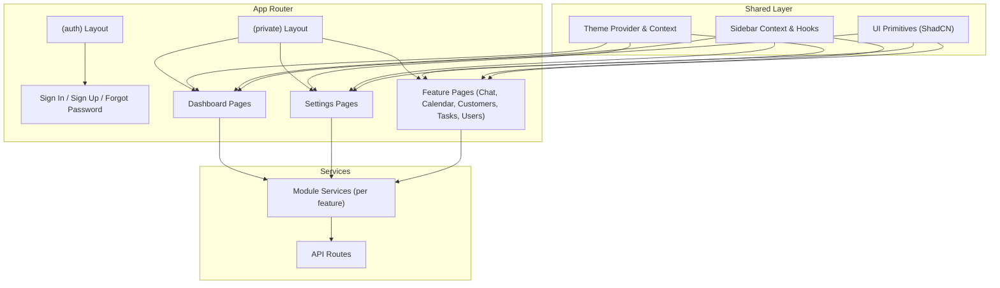
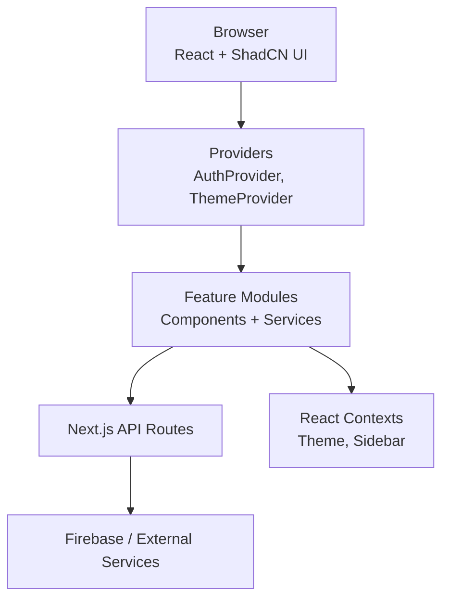
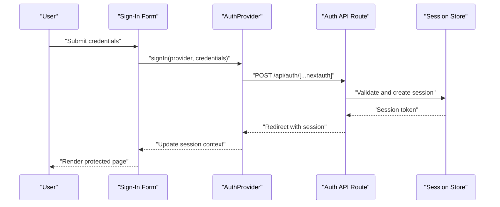
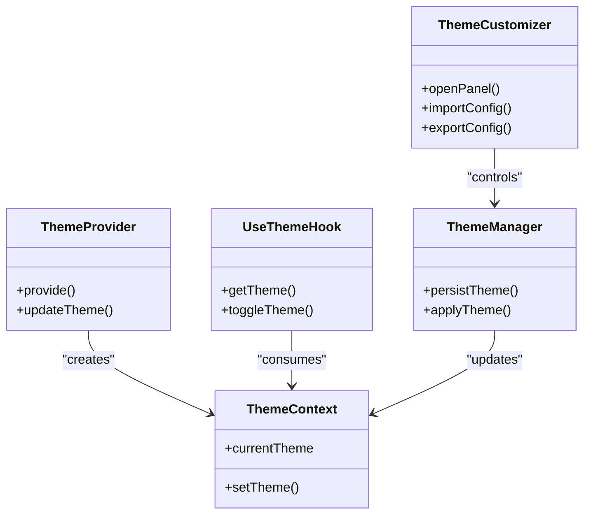
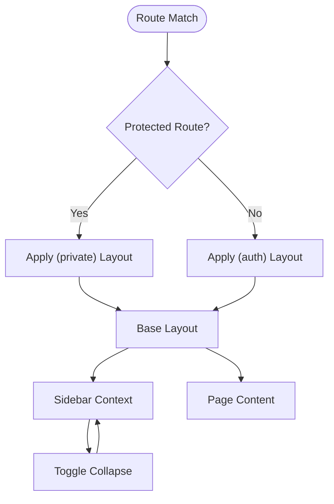
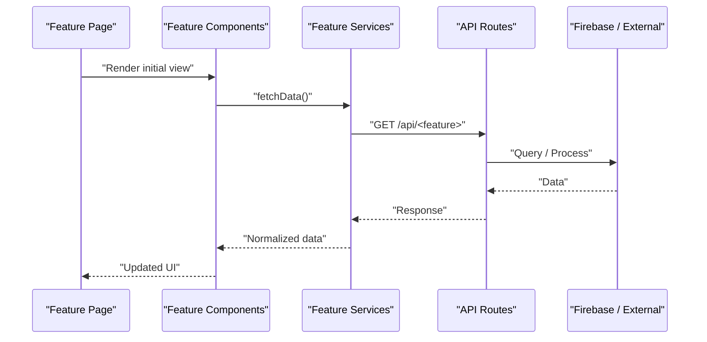
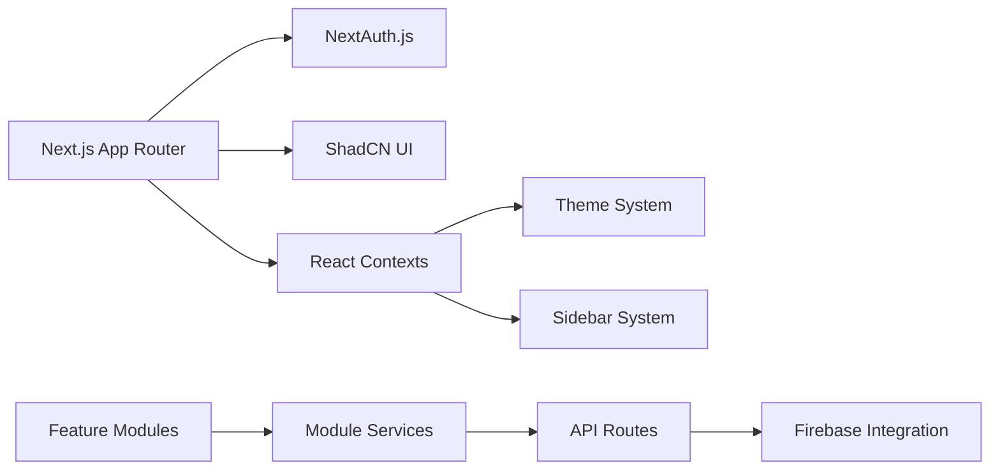

# Architecture Overview

<cite>
**Referenced Files in This Document**
- [package.json](file://package.json)
- [next.config.ts](file://next.config.ts)
- [src/app/layout.tsx](file://src/app/layout.tsx)
- [src/app/(auth)/layout.tsx](file://src/app/(auth)/layout.tsx)
- [src/app/(private)/layout.tsx](file://src/app/(private)/layout.tsx)
- [src/auth.ts](file://src/auth.ts)
- [src/auth.config.ts](file://src/auth.config.ts)
- [src/app/api/auth/[...nextauth]/route.ts](file://src/app/api/auth/[...nextauth]/route.ts)
- [src/components/auth-provider.tsx](file://src/components/auth-provider.tsx)
- [src/contexts/theme-context.ts](file://src/contexts/theme-context.ts)
- [src/hooks/use-theme.ts](file://src/hooks/use-theme.ts)
- [src/hooks/use-theme-manager.ts](file://src/hooks/use-theme-manager.ts)
- [src/components/theme-provider.tsx](file://src/components/theme-provider.tsx)
- [src/components/theme-customizer/index.tsx](file://src/components/theme-customizer/index.tsx)
- [src/components/layouts/base-layout.tsx](file://src/components/layouts/base-layout.tsx)
- [src/contexts/sidebar-context.tsx](file://src/contexts/sidebar-context.tsx)
- [src/hooks/use-sidebar-config.ts](file://src/hooks/use-sidebar-config.ts)
- [src/app/(private)/dashboard/page.tsx](file://src/app/(private)/dashboard/page.tsx)
- [src/modules/dashboard-1/services/dashboard-services.ts](file://src/modules/dashboard-1/services/dashboard-services.ts)
- [src/modules/dashboard-2/services/dashboard-2-services.ts](file://src/modules/dashboard-2/services/dashboard-2-services.ts)
- [src/modules/chat/services/chat-services.ts](file://src/modules/chat/services/chat-services.ts)
- [src/modules/calendar/services/calendar-services.ts](file://src/modules/calendar/services/calendar-services.ts)
- [src/modules/customers/services/customer-services.ts](file://src/modules/customers/services/customer-services.ts)
- [src/modules/documents/services/document-services.ts](file://src/modules/documents/services/document-services.ts)
- [src/modules/tasks/services/task-services.ts](file://src/modules/tasks/services/task-services.ts)
- [src/modules/users/services/user-services.ts](file://src/modules/users/services/user-services.ts)
- [src/lib/firebase/](file://src/lib/firebase/)
- [src/lib/auth/](file://src/lib/auth/)
- [src/app/api/admin/users/route.ts](file://src/app/api/admin/users/route.ts)
- [src/app/api/customers/route.ts](file://src/app/api/customers/route.ts)
- [src/app/api/tasks/route.ts](file://src/app/api/tasks/route.ts)
- [src/app/api/telegram/route.ts](file://src/app/api/telegram/route.ts)
</cite>

## Table of Contents
1. Introduction
2. Project Structure
3. Core Components
4. Architecture Overview
5. Detailed Component Analysis
6. Dependency Analysis
7. Performance Considerations
8. Troubleshooting Guide
9. Conclusion

## Introduction
This document describes the architecture of the Claude Code ShadCN Dashboard system, a Next.js App Router application with a feature-based modular design. It covers the technology stack (React, TypeScript, Tailwind CSS, ShadCN UI, NextAuth.js, and Firebase), component hierarchy, data flow patterns, state management via React Context, and service layer abstraction. It also includes system context diagrams for authentication, theme system, layout components, and feature modules, along with architectural decisions, scalability considerations, and deployment topology.

## Project Structure
The project follows Next.js App Router conventions with route groups to separate public and private areas:
- Route groups:
  - (auth): Authentication-related pages and layouts
  - (private): Protected dashboard features and settings
- Feature modules are organized under src/modules by domain (e.g., chat, calendar, customers, tasks, users). Each module encapsulates its own components, services, types, and mock data.
- Shared UI primitives live under src/components/ui (ShadCN-based).
- Cross-cutting concerns such as theming and sidebar state are implemented via contexts and hooks.
- API routes under src/app/api implement server-side endpoints for admin, auth, and domain operations.

[No sources needed since this diagram shows conceptual structure]

**Section sources**
- [src/app/(auth)/layout.tsx](file://src/app/(auth)/layout.tsx)
- [src/app/(private)/layout.tsx](file://src/app/(private)/layout.tsx)
- [src/app/(private)/dashboard/page.tsx](file://src/app/(private)/dashboard/page.tsx)

## Core Components
- Root layout and providers:
  - The root layout wires global providers including theme and auth provider.
  - Auth provider wraps the app to expose session and user context from NextAuth.js.
- Theme system:
  - Theme provider integrates with Next.js theme APIs and exposes a React Context for color scheme and customizations.
  - Theme hooks and manager coordinate persistence and dynamic updates.
  - Theme customizer panel allows runtime adjustments and import/export of configurations.
- Sidebar and navigation:
  - Sidebar context centralizes open/close state and configuration.
  - Navigation components consume sidebar context to render responsive menus.
- Feature modules:
  - Each feature module contains components and services that encapsulate business logic and data access.
  - Services abstract data fetching and transformations; they can be swapped between mock and real implementations.

**Section sources**
- [src/app/layout.tsx](file://src/app/layout.tsx)
- [src/components/auth-provider.tsx](file://src/components/auth-provider.tsx)
- [src/components/theme-provider.tsx](file://src/components/theme-provider.tsx)
- [src/contexts/theme-context.ts](file://src/contexts/theme-context.ts)
- [src/hooks/use-theme.ts](file://src/hooks/use-theme.ts)
- [src/hooks/use-theme-manager.ts](file://src/hooks/use-theme-manager.ts)
- [src/components/theme-customizer/index.tsx](file://src/components/theme-customizer/index.tsx)
- [src/contexts/sidebar-context.tsx](file://src/contexts/sidebar-context.tsx)
- [src/hooks/use-sidebar-config.ts](file://src/hooks/use-sidebar-config.ts)

## Architecture Overview
High-level architecture:
- Client-side:
  - React components built on top of ShadCN UI primitives.
  - State is managed via React Context for theme and sidebar; local component state handles UI interactions.
  - Data fetching is performed client-side through module services calling API routes or external services.
- Server-side:
  - Next.js API routes handle authentication callbacks, admin operations, and domain endpoints.
  - Optional integration with Firebase for storage or backend services.

**Diagram sources**
- [src/components/auth-provider.tsx](file://src/components/auth-provider.tsx)
- [src/components/theme-provider.tsx](file://src/components/theme-provider.tsx)
- [src/contexts/theme-context.ts](file://src/contexts/theme-context.ts)
- [src/contexts/sidebar-context.tsx](file://src/contexts/sidebar-context.tsx)
- [src/app/api/auth/[...nextauth]/route.ts](file://src/app/api/auth/[...nextauth]/route.ts)
- [src/app/api/admin/users/route.ts](file://src/app/api/admin/users/route.ts)
- [src/app/api/customers/route.ts](file://src/app/api/customers/route.ts)
- [src/app/api/tasks/route.ts](file://src/app/api/tasks/route.ts)
- [src/app/api/telegram/route.ts](file://src/app/api/telegram/route.ts)

## Detailed Component Analysis

### Authentication Flow
Authentication uses NextAuth.js with an API route handler and a client-side provider. The flow:
- User interacts with sign-in/sign-up forms.
- Client calls NextAuth endpoints via the API route.
- Server validates credentials and sets session cookies.
- Client receives session via provider and renders protected routes.

**Diagram sources**
- [src/app/api/auth/[...nextauth]/route.ts](file://src/app/api/auth/[...nextauth]/route.ts)
- [src/components/auth-provider.tsx](file://src/components/auth-provider.tsx)
- [src/auth.ts](file://src/auth.ts)
- [src/auth.config.ts](file://src/auth.config.ts)

**Section sources**
- [src/auth.ts](file://src/auth.ts)
- [src/auth.config.ts](file://src/auth.config.ts)
- [src/app/api/auth/[...nextauth]/route.ts](file://src/app/api/auth/[...nextauth]/route.ts)
- [src/components/auth-provider.tsx](file://src/components/auth-provider.tsx)

### Theme System
The theme system provides:
- Global theme provider integrating with Next.js theme APIs.
- React Context exposing current theme state.
- Hooks for reading/updating theme preferences.
- Theme customizer UI for runtime adjustments.

**Diagram sources**
- [src/components/theme-provider.tsx](file://src/components/theme-provider.tsx)
- [src/contexts/theme-context.ts](file://src/contexts/theme-context.ts)
- [src/hooks/use-theme.ts](file://src/hooks/use-theme.ts)
- [src/hooks/use-theme-manager.ts](file://src/hooks/use-theme-manager.ts)
- [src/components/theme-customizer/index.tsx](file://src/components/theme-customizer/index.tsx)

**Section sources**
- [src/components/theme-provider.tsx](file://src/components/theme-provider.tsx)
- [src/contexts/theme-context.ts](file://src/contexts/theme-context.ts)
- [src/hooks/use-theme.ts](file://src/hooks/use-theme.ts)
- [src/hooks/use-theme-manager.ts](file://src/hooks/use-theme-manager.ts)
- [src/components/theme-customizer/index.tsx](file://src/components/theme-customizer/index.tsx)

### Sidebar and Layout
Layouts wrap feature pages with shared chrome:
- Base layout composes header, sidebar, and content area.
- Sidebar context manages collapsed/expanded state and configuration.
- Private layout enforces authentication and applies base layout.

**Diagram sources**
- [src/app/(private)/layout.tsx](file://src/app/(private)/layout.tsx)
- [src/app/(auth)/layout.tsx](file://src/app/(auth)/layout.tsx)
- [src/components/layouts/base-layout.tsx](file://src/components/layouts/base-layout.tsx)
- [src/contexts/sidebar-context.tsx](file://src/contexts/sidebar-context.tsx)
- [src/hooks/use-sidebar-config.ts](file://src/hooks/use-sidebar-config.ts)

**Section sources**
- [src/app/(private)/layout.tsx](file://src/app/(private)/layout.tsx)
- [src/app/(auth)/layout.tsx](file://src/app/(auth)/layout.tsx)
- [src/components/layouts/base-layout.tsx](file://src/components/layouts/base-layout.tsx)
- [src/contexts/sidebar-context.tsx](file://src/contexts/sidebar-context.tsx)
- [src/hooks/use-sidebar-config.ts](file://src/hooks/use-sidebar-config.ts)

### Feature Module Data Flow
Each feature module encapsulates:
- Components for UI presentation.
- Services for data access and transformation.
- Types for contracts.
- Mock data for development.

Example flows:
- Dashboard-1 fetches metrics and charts via its services.
- Chat loads conversations and messages via chat services.
- Calendar manages events and calendars via calendar services.
- Customers, Documents, Tasks, and Users follow similar patterns.

**Diagram sources**
- [src/modules/dashboard-1/services/dashboard-services.ts](file://src/modules/dashboard-1/services/dashboard-services.ts)
- [src/modules/dashboard-2/services/dashboard-2-services.ts](file://src/modules/dashboard-2/services/dashboard-2-services.ts)
- [src/modules/chat/services/chat-services.ts](file://src/modules/chat/services/chat-services.ts)
- [src/modules/calendar/services/calendar-services.ts](file://src/modules/calendar/services/calendar-services.ts)
- [src/modules/customers/services/customer-services.ts](file://src/modules/customers/services/customer-services.ts)
- [src/modules/documents/services/document-services.ts](file://src/modules/documents/services/document-services.ts)
- [src/modules/tasks/services/task-services.ts](file://src/modules/tasks/services/task-services.ts)
- [src/modules/users/services/user-services.ts](file://src/modules/users/services/user-services.ts)
- [src/app/api/admin/users/route.ts](file://src/app/api/admin/users/route.ts)
- [src/app/api/customers/route.ts](file://src/app/api/customers/route.ts)
- [src/app/api/tasks/route.ts](file://src/app/api/tasks/route.ts)
- [src/app/api/telegram/route.ts](file://src/app/api/telegram/route.ts)

**Section sources**
- [src/modules/dashboard-1/services/dashboard-services.ts](file://src/modules/dashboard-1/services/dashboard-services.ts)
- [src/modules/dashboard-2/services/dashboard-2-services.ts](file://src/modules/dashboard-2/services/dashboard-2-services.ts)
- [src/modules/chat/services/chat-services.ts](file://src/modules/chat/services/chat-services.ts)
- [src/modules/calendar/services/calendar-services.ts](file://src/modules/calendar/services/calendar-services.ts)
- [src/modules/customers/services/customer-services.ts](file://src/modules/customers/services/customer-services.ts)
- [src/modules/documents/services/document-services.ts](file://src/modules/documents/services/document-services.ts)
- [src/modules/tasks/services/task-services.ts](file://src/modules/tasks/services/task-services.ts)
- [src/modules/users/services/user-services.ts](file://src/modules/users/services/user-services.ts)
- [src/app/api/admin/users/route.ts](file://src/app/api/admin/users/route.ts)
- [src/app/api/customers/route.ts](file://src/app/api/customers/route.ts)
- [src/app/api/tasks/route.ts](file://src/app/api/tasks/route.ts)
- [src/app/api/telegram/route.ts](file://src/app/api/telegram/route.ts)

## Dependency Analysis
Key dependencies and relationships:
- Next.js App Router drives routing and serverless functions.
- NextAuth.js provides authentication and session management.
- ShadCN UI components provide accessible, themeable primitives.
- React Context manages cross-cutting state (theme, sidebar).
- Module services abstract data access and can integrate with Firebase or other backends.

**Diagram sources**
- [package.json](file://package.json)
- [next.config.ts](file://next.config.ts)
- [src/auth.ts](file://src/auth.ts)
- [src/auth.config.ts](file://src/auth.config.ts)
- [src/components/theme-provider.tsx](file://src/components/theme-provider.tsx)
- [src/contexts/sidebar-context.tsx](file://src/contexts/sidebar-context.tsx)
- [src/lib/firebase/](file://src/lib/firebase/)
- [src/lib/auth/](file://src/lib/auth/)

**Section sources**
- [package.json](file://package.json)
- [next.config.ts](file://next.config.ts)
- [src/auth.ts](file://src/auth.ts)
- [src/auth.config.ts](file://src/auth.config.ts)
- [src/components/theme-provider.tsx](file://src/components/theme-provider.tsx)
- [src/contexts/sidebar-context.tsx](file://src/contexts/sidebar-context.tsx)
- [src/lib/firebase/](file://src/lib/firebase/)
- [src/lib/auth/](file://src/lib/auth/)

## Performance Considerations
- Prefer server-side rendering and static generation where possible using Next.js App Router capabilities.
- Cache API responses at the edge or CDN level for frequently accessed data.
- Debounce and throttle user interactions in heavy UI components (e.g., search, filters).
- Lazy-load feature modules and large components to reduce initial bundle size.
- Use memoization and selective re-renders in components consuming context values.
- Optimize images and assets; leverage Next.js image optimization.
- Minimize context churn by splitting contexts into focused slices (e.g., theme vs. sidebar).

[No sources needed since this section provides general guidance]

## Troubleshooting Guide
Common issues and strategies:
- Authentication failures:
  - Verify NextAuth configuration and secret handling.
  - Inspect session cookies and redirect URLs.
  - Check API route logs for provider errors.
- Theme not persisting:
  - Ensure theme manager writes to persistent storage.
  - Validate that provider initializes before first render.
- Sidebar state inconsistencies:
  - Confirm context consumers subscribe to the correct slice.
  - Avoid unnecessary re-renders by memoizing context values.
- API route errors:
  - Validate request payloads and authorization headers.
  - Log error stacks and return consistent error shapes.
- Firebase integration problems:
  - Check environment variables and security rules.
  - Handle network retries and offline states gracefully.

**Section sources**
- [src/auth.ts](file://src/auth.ts)
- [src/auth.config.ts](file://src/auth.config.ts)
- [src/app/api/auth/[...nextauth]/route.ts](file://src/app/api/auth/[...nextauth]/route.ts)
- [src/components/theme-provider.tsx](file://src/components/theme-provider.tsx)
- [src/contexts/theme-context.ts](file://src/contexts/theme-context.ts)
- [src/hooks/use-theme-manager.ts](file://src/hooks/use-theme-manager.ts)
- [src/contexts/sidebar-context.tsx](file://src/contexts/sidebar-context.tsx)
- [src/app/api/admin/users/route.ts](file://src/app/api/admin/users/route.ts)
- [src/app/api/customers/route.ts](file://src/app/api/customers/route.ts)
- [src/app/api/tasks/route.ts](file://src/app/api/tasks/route.ts)
- [src/app/api/telegram/route.ts](file://src/app/api/telegram/route.ts)

## Conclusion
The Claude Code ShadCN Dashboard leverages Next.js App Router with a feature-based modular architecture, providing clear separation of concerns across authentication, theming, layout, and domain features. React Context centralizes cross-cutting state, while module services abstract data access and enable easy swapping between mock and production backends. The system is designed for scalability through lazy loading, caching, and well-defined interfaces. Deployment can target Vercel or any platform supporting Next.js, with optional Firebase integration for backend services.

[No sources needed since this section summarizes without analyzing specific files]