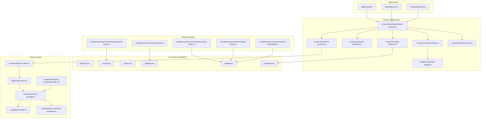
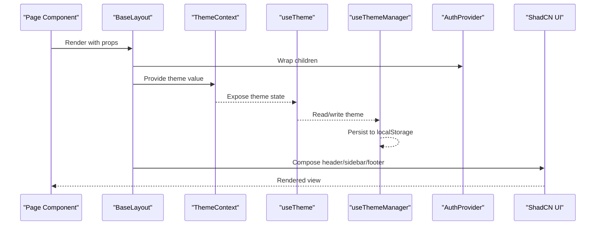
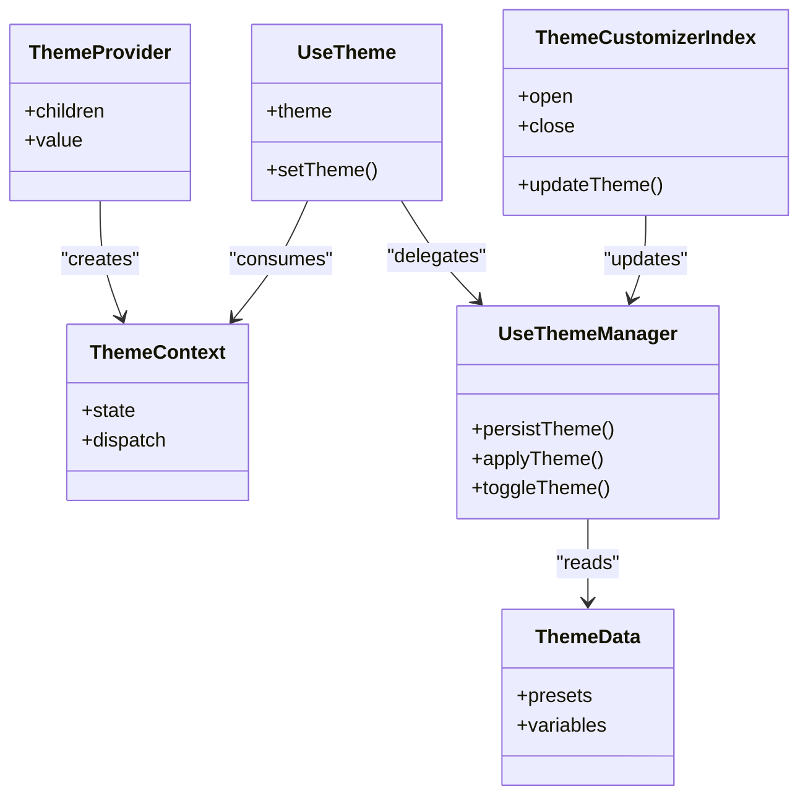
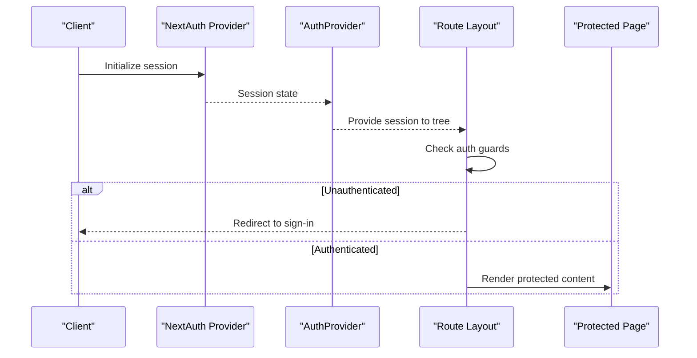
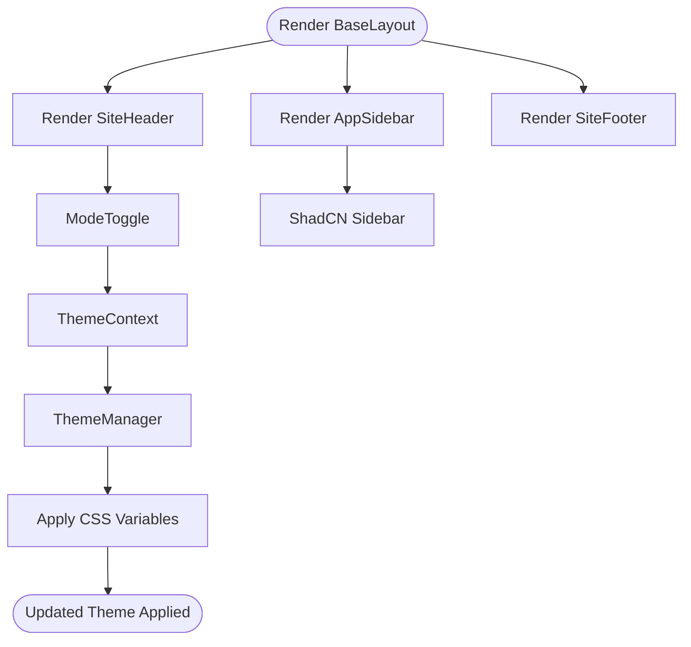
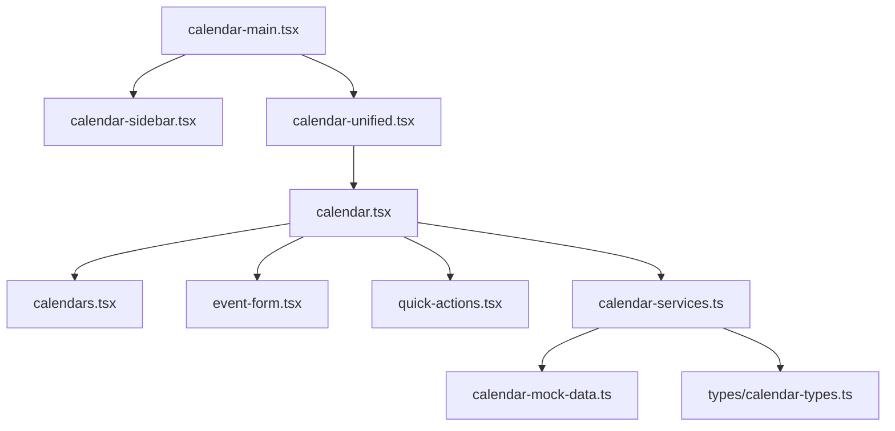
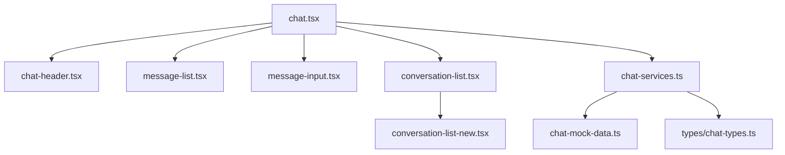
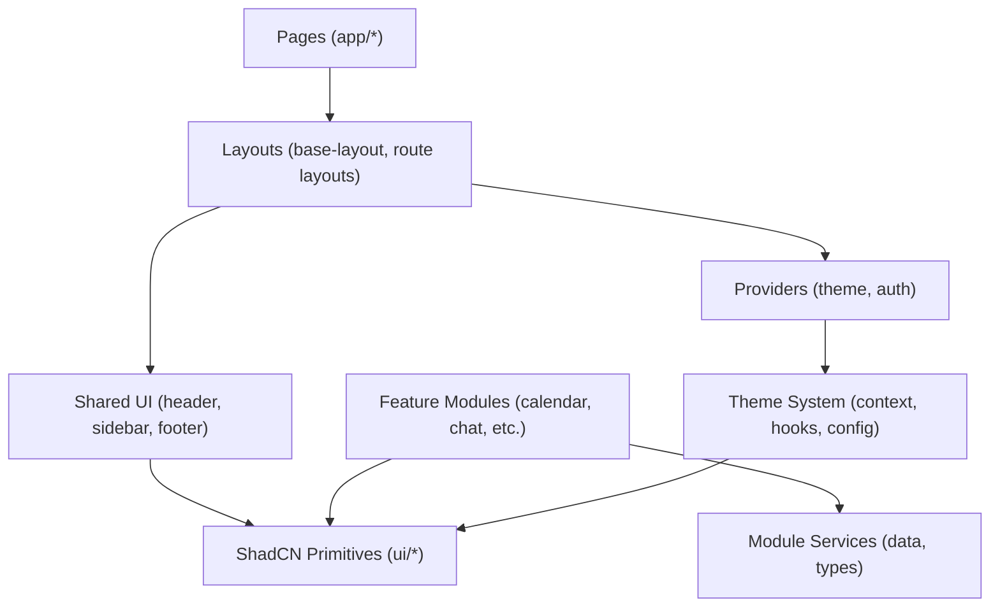

# Component Architecture & Patterns

<cite>
**Referenced Files in This Document**
- [src/app/layout.tsx](file://src/app/layout.tsx)
- [src/app/(auth)/layout.tsx](file://src/app/(auth)/layout.tsx)
- [src/app/(private)/layout.tsx](file://src/app/(private)/layout.tsx)
- [src/components/layouts/base-layout.tsx](file://src/components/layouts/base-layout.tsx)
- [src/components/theme-provider.tsx](file://src/components/theme-provider.tsx)
- [src/contexts/theme-context.ts](file://src/contexts/theme-context.ts)
- [src/hooks/use-theme.ts](file://src/hooks/use-theme.ts)
- [src/hooks/use-theme-manager.ts](file://src/hooks/use-theme-manager.ts)
- [src/components/auth-provider.tsx](file://src/components/auth-provider.tsx)
- [src/components/app-sidebar.tsx](file://src/components/app-sidebar.tsx)
- [src/components/site-header.tsx](file://src/components/site-header.tsx)
- [src/components/site-footer.tsx](file://src/components/site-footer.tsx)
- [src/components/mode-toggle.tsx](file://src/components/mode-toggle.tsx)
- [src/components/ui/button.tsx](file://src/components/ui/button.tsx)
- [src/components/ui/card.tsx](file://src/components/ui/card.tsx)
- [src/components/ui/input.tsx](file://src/components/ui/input.tsx)
- [src/components/ui/dialog.tsx](file://src/components/ui/dialog.tsx)
- [src/components/ui/table.tsx](file://src/components/ui/table.tsx)
- [src/components/ui/sidebar.tsx](file://src/components/ui/sidebar.tsx)
- [src/components/theme-customizer/index.tsx](file://src/components/theme-customizer/index.tsx)
- [src/components/theme-customizer/main.tsx](file://src/components/theme-customizer/main.tsx)
- [src/components/theme-customizer/theme-tab.tsx](file://src/components/theme-customizer/theme-tab.tsx)
- [src/components/theme-customizer/layout-tab.tsx](file://src/components/theme-customizer/layout-tab.tsx)
- [src/config/theme-data.ts](file://src/config/theme-data.ts)
- [src/config/theme-customizer-constants.ts](file://src/config/theme-customizer-constants.ts)
- [src/modules/calendar/components/calendar-main.tsx](file://src/modules/calendar/components/calendar-main.tsx)
- [src/modules/chat/components/chat.tsx](file://src/modules/chat/components/chat.tsx)
- [src/modules/customers/components/data-table.tsx](file://src/modules/customers/components/data-table.tsx)
- [src/modules/tasks/components/data-table.tsx](file://src/modules/tasks/components/data-table.tsx)
- [src/modules/users/components/user-data-table.tsx](file://src/modules/users/components/user-data-table.tsx)
- [src/types/theme.ts](file://src/types/theme.ts)
- [src/utils/shadcn-ui-theme-presets.ts](file://src/utils/shadcn-ui-theme-presets.ts)
</cite>

## Table of Contents
1. [Introduction](#introduction)
2. [Project Structure](#project-structure)
3. [Core Components](#core-components)
4. [Architecture Overview](#architecture-overview)
5. [Detailed Component Analysis](#detailed-component-analysis)
6. [Dependency Analysis](#dependency-analysis)
7. [Performance Considerations](#performance-considerations)
8. [Troubleshooting Guide](#troubleshooting-guide)
9. [Conclusion](#conclusion)
10. [Appendices](#appendices)

## Introduction
This document explains the component architecture and design patterns used across the Claude Code ShadCN Dashboard. It focuses on:
- Hierarchical structure from base UI primitives (ShadCN) to reusable layout components and feature-specific modules
- Composition patterns, prop interfaces, and event handling mechanisms
- Context-based global state management for theme and authentication
- Custom hooks for reusable logic, lifecycle management, and performance optimization
- Guidelines for creating new components, maintaining consistency, and following accessibility standards

The goal is to provide a clear mental model that helps developers extend and maintain the dashboard efficiently while preserving visual and behavioral consistency.

## Project Structure
The application follows a Next.js App Router layout with feature-based modules and shared UI layers:
- app/: Route groups for public, authenticated, and private routes; pages compose layouts and features
- components/: Shared UI layer including ShadCN primitives, layout shells, and cross-cutting concerns (theme, auth)
- contexts/: React Context providers for global state (theme, sidebar)
- hooks/: Reusable custom hooks for theme, mobile detection, fullscreen, and sidebar configuration
- modules/: Feature domains (calendar, chat, customers, tasks, users, settings), each with components, services, and types
- config/: Theme data and constants consumed by the theme customizer
- utils/: Presets and helpers for theming and utilities

**Diagram sources**
- [src/app/layout.tsx](file://src/app/layout.tsx)
- [src/app/(auth)/layout.tsx](file://src/app/(auth)/layout.tsx)
- [src/app/(private)/layout.tsx](file://src/app/(private)/layout.tsx)
- [src/components/layouts/base-layout.tsx](file://src/components/layouts/base-layout.tsx)
- [src/components/theme-provider.tsx](file://src/components/theme-provider.tsx)
- [src/components/auth-provider.tsx](file://src/components/auth-provider.tsx)
- [src/components/site-header.tsx](file://src/components/site-header.tsx)
- [src/components/app-sidebar.tsx](file://src/components/app-sidebar.tsx)
- [src/components/site-footer.tsx](file://src/components/site-footer.tsx)
- [src/components/mode-toggle.tsx](file://src/components/mode-toggle.tsx)
- [src/components/ui/button.tsx](file://src/components/ui/button.tsx)
- [src/components/ui/card.tsx](file://src/components/ui/card.tsx)
- [src/components/ui/input.tsx](file://src/components/ui/input.tsx)
- [src/components/ui/dialog.tsx](file://src/components/ui/dialog.tsx)
- [src/components/ui/table.tsx](file://src/components/ui/table.tsx)
- [src/components/ui/sidebar.tsx](file://src/components/ui/sidebar.tsx)
- [src/contexts/theme-context.ts](file://src/contexts/theme-context.ts)
- [src/hooks/use-theme.ts](file://src/hooks/use-theme.ts)
- [src/hooks/use-theme-manager.ts](file://src/hooks/use-theme-manager.ts)
- [src/config/theme-data.ts](file://src/config/theme-data.ts)
- [src/config/theme-customizer-constants.ts](file://src/config/theme-customizer-constants.ts)
- [src/components/theme-customizer/index.tsx](file://src/components/theme-customizer/index.tsx)
- [src/modules/calendar/components/calendar-main.tsx](file://src/modules/calendar/components/calendar-main.tsx)
- [src/modules/chat/components/chat.tsx](file://src/modules/chat/components/chat.tsx)
- [src/modules/customers/components/data-table.tsx](file://src/modules/customers/components/data-table.tsx)
- [src/modules/tasks/components/data-table.tsx](file://src/modules/tasks/components/data-table.tsx)
- [src/modules/users/components/user-data-table.tsx](file://src/modules/users/components/user-data-table.tsx)

**Section sources**
- [src/app/layout.tsx](file://src/app/layout.tsx)
- [src/app/(auth)/layout.tsx](file://src/app/(auth)/layout.tsx)
- [src/app/(private)/layout.tsx](file://src/app/(private)/layout.tsx)
- [src/components/layouts/base-layout.tsx](file://src/components/layouts/base-layout.tsx)

## Core Components
This section outlines the foundational building blocks and how they are composed into higher-level structures.

- Base Layout Shell
  - Purpose: Provides consistent page chrome (header, sidebar, footer) and wraps providers.
  - Composition: Combines site header, sidebar, and footer; integrates theme and auth providers.
  - Event Handling: Delegates navigation and user actions to child components or context consumers.
  - Accessibility: Ensures semantic landmarks and keyboard navigability at the shell level.

- Theme Provider and Context
  - Purpose: Centralizes theme state and exposes it via React Context.
  - Composition: Provider supplies theme values; consumer hook reads current theme and toggles.
  - Persistence: Persists theme preference across sessions using local storage.
  - Integration: Consumed by mode toggle and theme customizer.

- Authentication Provider
  - Purpose: Wraps the app with NextAuth provider to manage session state globally.
  - Composition: Placed near the root to ensure all pages can access auth state.
  - Event Handling: Redirects unauthenticated users based on route group requirements.

- Mode Toggle
  - Purpose: UI control to switch between light/dark themes.
  - Interaction: Calls theme context setter to update active theme.
  - Accessibility: Uses appropriate ARIA attributes and keyboard support.

- ShadCN Primitives
  - Examples: Button, Card, Input, Dialog, Table, Sidebar.
  - Role: Low-level, accessible, composable UI elements styled with Tailwind and Radix primitives.
  - Usage: Consumed directly by layout and feature components.

**Section sources**
- [src/components/layouts/base-layout.tsx](file://src/components/layouts/base-layout.tsx)
- [src/components/theme-provider.tsx](file://src/components/theme-provider.tsx)
- [src/contexts/theme-context.ts](file://src/contexts/theme-context.ts)
- [src/hooks/use-theme.ts](file://src/hooks/use-theme.ts)
- [src/hooks/use-theme-manager.ts](file://src/hooks/use-theme-manager.ts)
- [src/components/auth-provider.tsx](file://src/components/auth-provider.tsx)
- [src/components/mode-toggle.tsx](file://src/components/mode-toggle.tsx)
- [src/components/ui/button.tsx](file://src/components/ui/button.tsx)
- [src/components/ui/card.tsx](file://src/components/ui/card.tsx)
- [src/components/ui/input.tsx](file://src/components/ui/input.tsx)
- [src/components/ui/dialog.tsx](file://src/components/ui/dialog.tsx)
- [src/components/ui/table.tsx](file://src/components/ui/table.tsx)
- [src/components/ui/sidebar.tsx](file://src/components/ui/sidebar.tsx)

## Architecture Overview
The system uses a layered architecture:
- Presentation Layer: Feature pages and module components
- Layout Layer: Shared layout shell and route-group layouts
- Domain Services: Mock data and service functions per module
- Infrastructure Layer: Providers (theme, auth), contexts, and hooks

**Diagram sources**
- [src/components/layouts/base-layout.tsx](file://src/components/layouts/base-layout.tsx)
- [src/components/theme-provider.tsx](file://src/components/theme-provider.tsx)
- [src/contexts/theme-context.ts](file://src/contexts/theme-context.ts)
- [src/hooks/use-theme.ts](file://src/hooks/use-theme.ts)
- [src/hooks/use-theme-manager.ts](file://src/hooks/use-theme-manager.ts)
- [src/components/auth-provider.tsx](file://src/components/auth-provider.tsx)

## Detailed Component Analysis

### Theme System
The theme system is implemented via a provider-consumer pattern with persistence and customization.

**Diagram sources**
- [src/components/theme-provider.tsx](file://src/components/theme-provider.tsx)
- [src/contexts/theme-context.ts](file://src/contexts/theme-context.ts)
- [src/hooks/use-theme.ts](file://src/hooks/use-theme.ts)
- [src/hooks/use-theme-manager.ts](file://src/hooks/use-theme-manager.ts)
- [src/config/theme-data.ts](file://src/config/theme-data.ts)
- [src/components/theme-customizer/index.tsx](file://src/components/theme-customizer/index.tsx)

Key behaviors:
- Provider initializes theme state and exposes setters
- Hook abstracts reading/writing theme values
- Manager handles persistence and applying CSS variables
- Customizer UI updates theme presets and layout options

**Section sources**
- [src/components/theme-provider.tsx](file://src/components/theme-provider.tsx)
- [src/contexts/theme-context.ts](file://src/contexts/theme-context.ts)
- [src/hooks/use-theme.ts](file://src/hooks/use-theme.ts)
- [src/hooks/use-theme-manager.ts](file://src/hooks/use-theme-manager.ts)
- [src/config/theme-data.ts](file://src/config/theme-data.ts)
- [src/config/theme-customizer-constants.ts](file://src/config/theme-customizer-constants.ts)
- [src/components/theme-customizer/index.tsx](file://src/components/theme-customizer/index.tsx)
- [src/components/theme-customizer/main.tsx](file://src/components/theme-customizer/main.tsx)
- [src/components/theme-customizer/theme-tab.tsx](file://src/components/theme-customizer/theme-tab.tsx)
- [src/components/theme-customizer/layout-tab.tsx](file://src/components/theme-customizer/layout-tab.tsx)

### Authentication Flow
Authentication is managed via NextAuth wrapped in a provider.

**Diagram sources**
- [src/components/auth-provider.tsx](file://src/components/auth-provider.tsx)
- [src/app/(private)/layout.tsx](file://src/app/(private)/layout.tsx)
- [src/app/(auth)/layout.tsx](file://src/app/(auth)/layout.tsx)

**Section sources**
- [src/components/auth-provider.tsx](file://src/components/auth-provider.tsx)
- [src/app/(private)/layout.tsx](file://src/app/(private)/layout.tsx)
- [src/app/(auth)/layout.tsx](file://src/app/(auth)/layout.tsx)

### Layout Shell and Navigation
The layout shell composes header, sidebar, and footer, integrating navigation and theme controls.

**Diagram sources**
- [src/components/layouts/base-layout.tsx](file://src/components/layouts/base-layout.tsx)
- [src/components/site-header.tsx](file://src/components/site-header.tsx)
- [src/components/app-sidebar.tsx](file://src/components/app-sidebar.tsx)
- [src/components/site-footer.tsx](file://src/components/site-footer.tsx)
- [src/components/mode-toggle.tsx](file://src/components/mode-toggle.tsx)
- [src/components/ui/sidebar.tsx](file://src/components/ui/sidebar.tsx)
- [src/contexts/theme-context.ts](file://src/contexts/theme-context.ts)
- [src/hooks/use-theme-manager.ts](file://src/hooks/use-theme-manager.ts)

**Section sources**
- [src/components/layouts/base-layout.tsx](file://src/components/layouts/base-layout.tsx)
- [src/components/site-header.tsx](file://src/components/site-header.tsx)
- [src/components/app-sidebar.tsx](file://src/components/app-sidebar.tsx)
- [src/components/site-footer.tsx](file://src/components/site-footer.tsx)
- [src/components/mode-toggle.tsx](file://src/components/mode-toggle.tsx)
- [src/components/ui/sidebar.tsx](file://src/components/ui/sidebar.tsx)

### Feature Module: Calendar
Calendar demonstrates composition of domain components and services.

**Diagram sources**
- [src/modules/calendar/components/calendar-main.tsx](file://src/modules/calendar/components/calendar-main.tsx)
- [src/modules/calendar/components/calendar-sidebar.tsx](file://src/modules/calendar/components/calendar-sidebar.tsx)
- [src/modules/calendar/components/calendar-unified.tsx](file://src/modules/calendar/components/calendar-unified.tsx)
- [src/modules/calendar/components/calendar.tsx](file://src/modules/calendar/components/calendar.tsx)
- [src/modules/calendar/components/calendars.tsx](file://src/modules/calendar/components/calendars.tsx)
- [src/modules/calendar/components/event-form.tsx](file://src/modules/calendar/components/event-form.tsx)
- [src/modules/calendar/components/quick-actions.tsx](file://src/modules/calendar/components/quick-actions.tsx)
- [src/modules/calendar/services/calendar-services.ts](file://src/modules/calendar/services/calendar-services.ts)
- [src/modules/calendar/services/calendar-mock-data.ts](file://src/modules/calendar/services/calendar-mock-data.ts)
- [src/modules/calendar/services/types/calendar-types.ts](file://src/modules/calendar/services/types/calendar-types.ts)

**Section sources**
- [src/modules/calendar/components/calendar-main.tsx](file://src/modules/calendar/components/calendar-main.tsx)
- [src/modules/calendar/services/calendar-services.ts](file://src/modules/calendar/services/calendar-services.ts)
- [src/modules/calendar/services/calendar-mock-data.ts](file://src/modules/calendar/services/calendar-mock-data.ts)
- [src/modules/calendar/services/types/calendar-types.ts](file://src/modules/calendar/services/types/calendar-types.ts)

### Feature Module: Chat
Chat showcases message list, input, and conversation list composition.

**Diagram sources**
- [src/modules/chat/components/chat.tsx](file://src/modules/chat/components/chat.tsx)
- [src/modules/chat/components/chat-header.tsx](file://src/modules/chat/components/chat-header.tsx)
- [src/modules/chat/components/message-list.tsx](file://src/modules/chat/components/message-list.tsx)
- [src/modules/chat/components/message-input.tsx](file://src/modules/chat/components/message-input.tsx)
- [src/modules/chat/components/conversation-list.tsx](file://src/modules/chat/components/conversation-list.tsx)
- [src/modules/chat/components/conversation-list-new.tsx](file://src/modules/chat/components/conversation-list-new.tsx)
- [src/modules/chat/services/chat-services.ts](file://src/modules/chat/services/chat-services.ts)
- [src/modules/chat/services/chat-mock-data.ts](file://src/modules/chat/services/chat-mock-data.ts)
- [src/modules/chat/services/types/chat-types.ts](file://src/modules/chat/services/types/chat-types.ts)

**Section sources**
- [src/modules/chat/components/chat.tsx](file://src/modules/chat/components/chat.tsx)
- [src/modules/chat/services/chat-services.ts](file://src/modules/chat/services/chat-services.ts)
- [src/modules/chat/services/chat-mock-data.ts](file://src/modules/chat/services/chat-mock-data.ts)
- [src/modules/chat/services/types/chat-types.ts](file://src/modules/chat/services/types/chat-types.ts)

### Data Tables Across Modules
Tables are consistently implemented using ShadCN table primitives and module-specific columns and toolbars.

```mermaid
graph TB
CustDT["customers/data-table.tsx"]
TaskDT["tasks/data-table.tsx"]
UserDT["users/user-data-table.tsx"]
UTable["ui/table.tsx"]
CustCols["customers/columns.tsx"]
TaskCols["tasks/columns.tsx"]
UserCols["users/user-columns.tsx"]
CustToolbar["customers/data-table-toolbar.tsx"]
TaskToolbar["tasks/data-table-toolbar.tsx"]
UserToolbar["users/user-data-table-toolbar.tsx"]
CustPagination["customers/data-table-pagination.tsx"]
TaskPagination["tasks/data-table-pagination.tsx"]
UserPagination["users/user-data-table-pagination.tsx"]
CustDT --> UTable
CustDT --> CustCols
CustDT --> CustToolbar
CustDT --> CustPagination
TaskDT --> UTable
TaskDT --> TaskCols
TaskDT --> TaskToolbar
TaskDT --> TaskPagination
UserDT --> UTable
UserDT --> UserCols
UserDT --> UserToolbar
UserDT --> UserPagination
```

**Diagram sources**
- [src/modules/customers/components/data-table.tsx](file://src/modules/customers/components/data-table.tsx)
- [src/modules/customers/components/columns.tsx](file://src/modules/customers/components/columns.tsx)
- [src/modules/customers/components/data-table-toolbar.tsx](file://src/modules/customers/components/data-table-toolbar.tsx)
- [src/modules/customers/components/data-table-pagination.tsx](file://src/modules/customers/components/data-table-pagination.tsx)
- [src/modules/tasks/components/data-table.tsx](file://src/modules/tasks/components/data-table.tsx)
- [src/modules/tasks/components/columns.tsx](file://src/modules/tasks/components/columns.tsx)
- [src/modules/tasks/components/data-table-toolbar.tsx](file://src/modules/tasks/components/data-table-toolbar.tsx)
- [src/modules/tasks/components/data-table-pagination.tsx](file://src/modules/tasks/components/data-table-pagination.tsx)
- [src/modules/users/components/user-data-table.tsx](file://src/modules/users/components/user-data-table.tsx)
- [src/modules/users/components/user-columns.tsx](file://src/modules/users/components/user-columns.tsx)
- [src/modules/users/components/user-data-table-toolbar.tsx](file://src/modules/users/components/user-data-table-toolbar.tsx)
- [src/modules/users/components/user-data-table-pagination.tsx](file://src/modules/users/components/user-data-table-pagination.tsx)
- [src/components/ui/table.tsx](file://src/components/ui/table.tsx)

**Section sources**
- [src/modules/customers/components/data-table.tsx](file://src/modules/customers/components/data-table.tsx)
- [src/modules/tasks/components/data-table.tsx](file://src/modules/tasks/components/data-table.tsx)
- [src/modules/users/components/user-data-table.tsx](file://src/modules/users/components/user-data-table.tsx)
- [src/components/ui/table.tsx](file://src/components/ui/table.tsx)

## Dependency Analysis
Component dependencies follow a clear hierarchy:
- Pages depend on layouts
- Layouts depend on providers and shared UI
- Feature modules depend on ShadCN primitives and their own services
- Theme system depends on context, hooks, and configuration

**Diagram sources**
- [src/app/layout.tsx](file://src/app/layout.tsx)
- [src/app/(auth)/layout.tsx](file://src/app/(auth)/layout.tsx)
- [src/app/(private)/layout.tsx](file://src/app/(private)/layout.tsx)
- [src/components/layouts/base-layout.tsx](file://src/components/layouts/base-layout.tsx)
- [src/components/theme-provider.tsx](file://src/components/theme-provider.tsx)
- [src/components/auth-provider.tsx](file://src/components/auth-provider.tsx)
- [src/components/ui/button.tsx](file://src/components/ui/button.tsx)
- [src/components/ui/card.tsx](file://src/components/ui/card.tsx)
- [src/components/ui/input.tsx](file://src/components/ui/input.tsx)
- [src/components/ui/dialog.tsx](file://src/components/ui/dialog.tsx)
- [src/components/ui/table.tsx](file://src/components/ui/table.tsx)
- [src/components/ui/sidebar.tsx](file://src/components/ui/sidebar.tsx)
- [src/contexts/theme-context.ts](file://src/contexts/theme-context.ts)
- [src/hooks/use-theme.ts](file://src/hooks/use-theme.ts)
- [src/hooks/use-theme-manager.ts](file://src/hooks/use-theme-manager.ts)
- [src/config/theme-data.ts](file://src/config/theme-data.ts)
- [src/config/theme-customizer-constants.ts](file://src/config/theme-customizer-constants.ts)

**Section sources**
- [src/app/layout.tsx](file://src/app/layout.tsx)
- [src/app/(auth)/layout.tsx](file://src/app/(auth)/layout.tsx)
- [src/app/(private)/layout.tsx](file://src/app/(private)/layout.tsx)
- [src/components/layouts/base-layout.tsx](file://src/components/layouts/base-layout.tsx)
- [src/components/theme-provider.tsx](file://src/components/theme-provider.tsx)
- [src/components/auth-provider.tsx](file://src/components/auth-provider.tsx)
- [src/components/ui/button.tsx](file://src/components/ui/button.tsx)
- [src/components/ui/card.tsx](file://src/components/ui/card.tsx)
- [src/components/ui/input.tsx](file://src/components/ui/input.tsx)
- [src/components/ui/dialog.tsx](file://src/components/ui/dialog.tsx)
- [src/components/ui/table.tsx](file://src/components/ui/table.tsx)
- [src/components/ui/sidebar.tsx](file://src/components/ui/sidebar.tsx)
- [src/contexts/theme-context.ts](file://src/contexts/theme-context.ts)
- [src/hooks/use-theme.ts](file://src/hooks/use-theme.ts)
- [src/hooks/use-theme-manager.ts](file://src/hooks/use-theme-manager.ts)
- [src/config/theme-data.ts](file://src/config/theme-data.ts)
- [src/config/theme-customizer-constants.ts](file://src/config/theme-customizer-constants.ts)

## Performance Considerations
- Memoization: Prefer memoizing expensive computations and derived state in custom hooks.
- Lazy Loading: Use dynamic imports for heavy feature components to reduce initial bundle size.
- Stable References: Stabilize callbacks and object references passed to deeply nested components to avoid unnecessary re-renders.
- Context Granularity: Split large contexts into smaller ones (e.g., separate theme and sidebar contexts) to limit re-renders.
- List Rendering: Ensure stable keys and virtualization for large lists in data tables.
- Avoid Prop Drilling: Lift state up judiciously and use context where appropriate to minimize re-renders.

[No sources needed since this section provides general guidance]

## Troubleshooting Guide
Common issues and resolutions:
- Theme not persisting: Verify local storage availability and ensure the theme manager applies variables after hydration.
- Auth redirects loop: Confirm route group guards and provider placement; ensure session initialization completes before rendering protected routes.
- Sidebar state mismatch: Check sidebar context usage and ensure state is synchronized across header and sidebar components.
- Table performance degradation: Validate column definitions and pagination logic; consider virtualization for large datasets.
- Modal/dialog focus traps: Ensure proper focus management and ARIA attributes for accessibility compliance.

**Section sources**
- [src/hooks/use-theme-manager.ts](file://src/hooks/use-theme-manager.ts)
- [src/components/auth-provider.tsx](file://src/components/auth-provider.tsx)
- [src/components/ui/dialog.tsx](file://src/components/ui/dialog.tsx)
- [src/components/ui/table.tsx](file://src/components/ui/table.tsx)

## Conclusion
The dashboard’s architecture emphasizes composability, separation of concerns, and consistent theming and authentication. By leveraging ShadCN primitives, React Context, and custom hooks, the codebase maintains clarity and scalability. Following the guidelines below will help you extend the system effectively while preserving quality and accessibility.

[No sources needed since this section summarizes without analyzing specific files]

## Appendices

### Guidelines for Creating New Components
- Follow hierarchical composition: start from ShadCN primitives, build small reusable components, then compose feature-specific components.
- Define explicit prop interfaces using TypeScript; prefer union types and optional fields where applicable.
- Keep side effects in custom hooks; keep components pure and focused on presentation.
- Use context sparingly; prefer passing props for localized state and context for truly global concerns like theme and auth.
- Implement event handlers at the nearest responsible component; lift state only when necessary.
- Maintain accessibility: include labels, roles, and keyboard interactions; test with screen readers.
- Add tests for critical paths and edge cases; mock external services and contexts appropriately.

[No sources needed since this section provides general guidance]

### Accessibility Standards Checklist
- Semantic HTML elements and landmarks
- ARIA attributes where native semantics are insufficient
- Keyboard navigation and visible focus indicators
- Color contrast and theme compatibility
- Screen reader testing and validation

[No sources needed since this section provides general guidance]