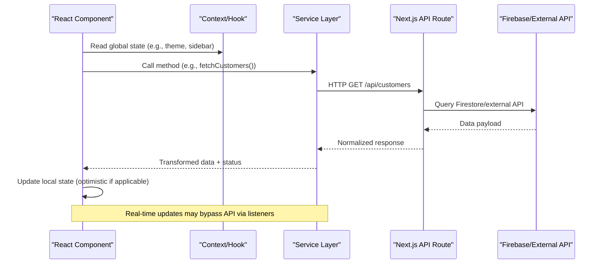
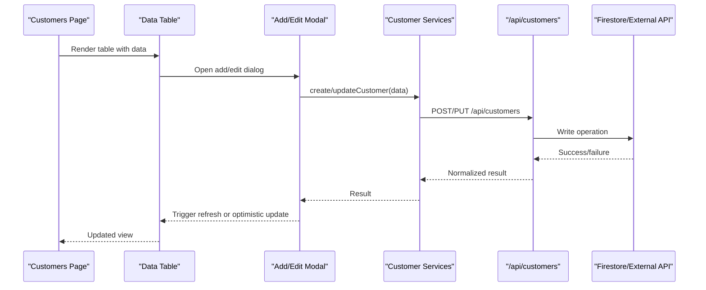
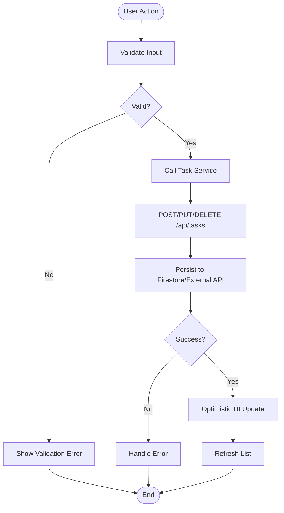
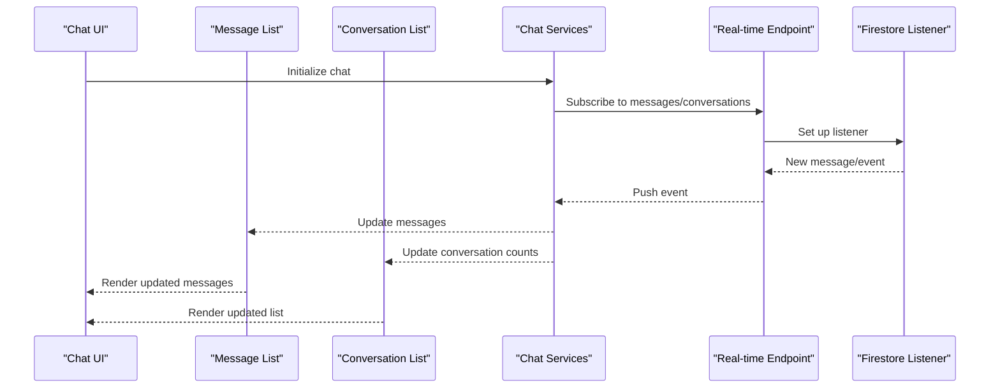
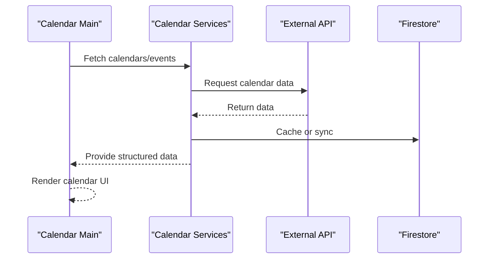
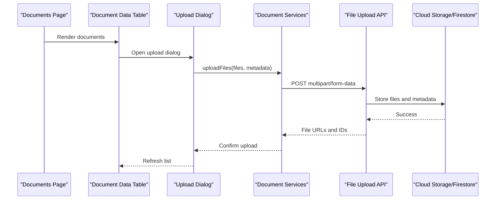
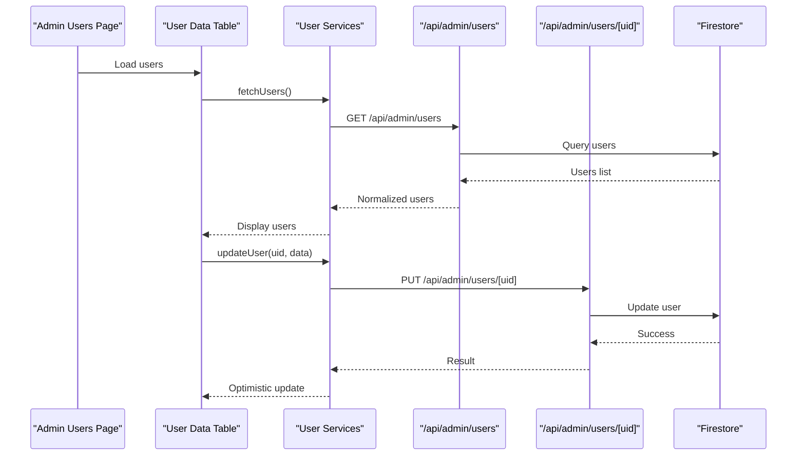
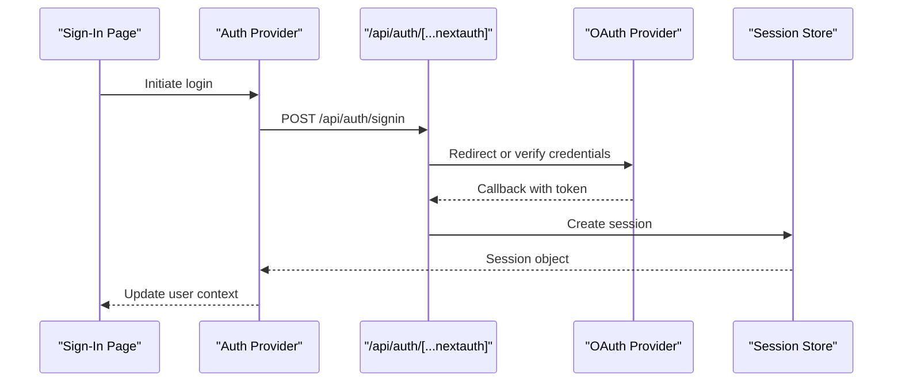
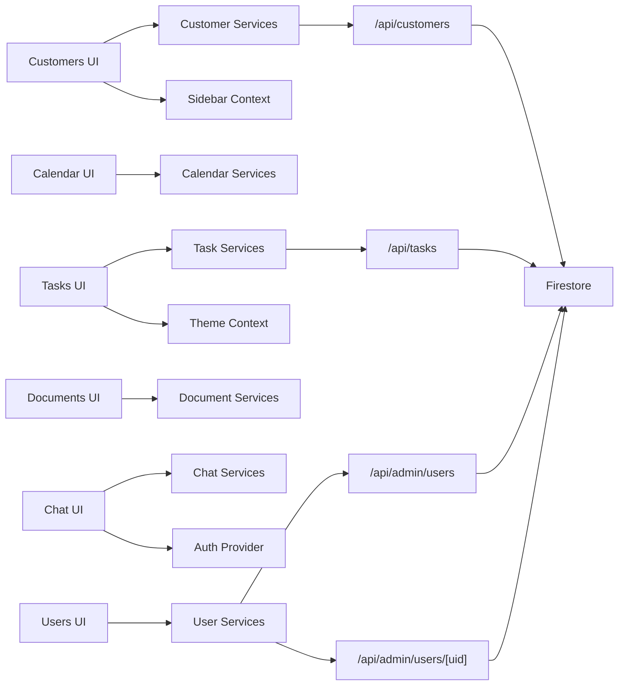

# Data Flow & State Management

<cite>
**Referenced Files in This Document**
- [src/app/layout.tsx](file://src/app/layout.tsx)
- [src/app/(private)/layout.tsx](file://src/app/(private)/layout.tsx)
- [src/components/auth-provider.tsx](file://src/components/auth-provider.tsx)
- [src/contexts/sidebar-context.tsx](file://src/contexts/sidebar-context.tsx)
- [src/contexts/theme-context.ts](file://src/contexts/theme-context.ts)
- [src/hooks/use-theme-manager.ts](file://src/hooks/use-theme-manager.ts)
- [src/hooks/use-mobile.ts](file://src/hooks/use-mobile.ts)
- [src/lib/utils.ts](file://src/lib/utils.ts)
- [src/app/api/customers/route.ts](file://src/app/api/customers/route.ts)
- [src/app/api/tasks/route.ts](file://src/app/api/tasks/route.ts)
- [src/app/api/admin/users/route.ts](file://src/app/api/admin/users/route.ts)
- [src/app/api/admin/users/[uid]/route.ts](file://src/app/api/admin/users/[uid]/route.ts)
- [src/modules/customers/services/customer-services.ts](file://src/modules/customers/services/customer-services.ts)
- [src/modules/customers/services/types/customer-types.ts](file://src/modules/customers/services/types/customer-types.ts)
- [src/modules/customers/components/data-table.tsx](file://src/modules/customers/components/data-table.tsx)
- [src/modules/customers/components/add-customer-modal.tsx](file://src/modules/customers/components/add-customer-modal.tsx)
- [src/modules/customers/page.tsx](file://src/app/(private)/customers/page.tsx)
- [src/modules/tasks/services/task-services.ts](file://src/modules/tasks/services/task-services.ts)
- [src/modules/tasks/components/data-table.tsx](file://src/modules/tasks/components/data-table.tsx)
- [src/modules/tasks/page.tsx](file://src/app/(private)/tasks/page.tsx)
- [src/modules/chat/services/chat-services.ts](file://src/modules/chat/services/chat-services.ts)
- [src/modules/chat/components/message-list.tsx](file://src/modules/chat/components/message-list.tsx)
- [src/modules/chat/components/conversation-list.tsx](file://src/modules/chat/components/conversation-list.tsx)
- [src/modules/chat/components/chat.tsx](file://src/modules/chat/components/chat.tsx)
- [src/modules/calendar/services/calendar-services.ts](file://src/modules/calendar/services/calendar-services.ts)
- [src/modules/calendar/components/calendar-main.tsx](file://src/modules/calendar/components/calendar-main.tsx)
- [src/modules/documents/services/document-services.ts](file://src/modules/documents/services/document-services.ts)
- [src/modules/documents/components/data-table.tsx](file://src/modules/documents/components/data-table.tsx)
- [src/modules/users/services/user-services.ts](file://src/modules/users/services/user-services.ts)
- [src/modules/users/components/user-data-table.tsx](file://src/modules/users/components/user-data-table.tsx)
- [src/app/(auth)/sign-in/page.tsx](file://src/app/(auth)/sign-in/page.tsx)
- [src/app/(auth)/forgot-password/page.tsx](file://src/app/(auth)/forgot-password/page.tsx)
- [src/app/(auth)/sign-up/page.tsx](file://src/app/(auth)/sign-up/page.tsx)
- [src/app/(auth)/layout.tsx](file://src/app/(auth)/layout.tsx)
- [src/auth.config.ts](file://src/auth.config.ts)
- [src/auth.ts](file://src/auth.ts)
- [src/app/api/auth/[...nextauth]/route.ts](file://src/app/api/auth/[...nextauth]/route.ts)
- [firestore.rules](file://firestore.rules)
</cite>

## Table of Contents
1. [Introduction](#introduction)
2. [Project Structure](#project-structure)
3. [Core Components](#core-components)
4. [Architecture Overview](#architecture-overview)
5. [Detailed Component Analysis](#detailed-component-analysis)
6. [Dependency Analysis](#dependency-analysis)
7. [Performance Considerations](#performance-considerations)
8. [Troubleshooting Guide](#troubleshooting-guide)
9. [Conclusion](#conclusion)
10. [Appendices](#appendices)

## Introduction
This document explains data flow patterns and state management strategies across the Claude Code ShadCN Dashboard. It focuses on how user interactions in React components propagate through service layers, API routes, and backend services (including Firebase), and how global and local state are managed using React Context and component-level hooks. It also covers real-time updates, caching, error handling, optimistic UI, validation, transformation pipelines, and integration with external APIs.

## Project Structure
The application follows a Next.js App Router layout with feature modules under src/modules. Each module typically contains:
- components: UI components for the feature
- services: business logic and data operations
- types: TypeScript interfaces and types
- data: static or mock datasets (optional)

Global state is provided via contexts and hooks under src/contexts and src/hooks. Authentication is configured via NextAuth and exposed through providers and API routes.

```mermaid
graph TB
subgraph "App Shell"
RootLayout["Root Layout<br/>src/app/layout.tsx"]
PrivateLayout["Private Layout<br/>src/app/(private)/layout.tsx"]
AuthProvider["Auth Provider<br/>src/components/auth-provider.tsx"]
end
subgraph "Contexts & Hooks"
SidebarCtx["Sidebar Context<br/>src/contexts/sidebar-context.tsx"]
ThemeCtx["Theme Context<br/>src/contexts/theme-context.ts"]
UseThemeMgr["Theme Manager Hook<br/>src/hooks/use-theme-manager.ts"]
UseMobile["Mobile Hook<br/>src/hooks/use-mobile.ts"]
end
subgraph "Feature Modules"
Customers["Customers Module<br/>src/modules/customers/*"]
Tasks["Tasks Module<br/>src/modules/tasks/*"]
Chat["Chat Module<br/>src/modules/chat/*"]
Calendar["Calendar Module<br/>src/modules/calendar/*"]
Documents["Documents Module<br/>src/modules/documents/*"]
Users["Users Module<br/>src/modules/users/*"]
end
subgraph "API Routes"
ApiCustomers["/api/customers<br/>src/app/api/customers/route.ts"]
ApiTasks["/api/tasks<br/>src/app/api/tasks/route.ts"]
ApiAdminUsers["/api/admin/users<br/>src/app/api/admin/users/route.ts"]
ApiAdminUserUid["/api/admin/users/[uid]<br/>src/app/api/admin/users/[uid]/route.ts"]
ApiAuth["/api/auth/[...nextauth]<br/>src/app/api/auth/[...nextauth]/route.ts"]
end
RootLayout --> PrivateLayout
PrivateLayout --> AuthProvider
PrivateLayout --> SidebarCtx
PrivateLayout --> ThemeCtx
PrivateLayout --> UseThemeMgr
PrivateLayout --> UseMobile
PrivateLayout --> Customers
PrivateLayout --> Tasks
PrivateLayout --> Chat
PrivateLayout --> Calendar
PrivateLayout --> Documents
PrivateLayout --> Users
Customers --> ApiCustomers
Tasks --> ApiTasks
Users --> ApiAdminUsers
Users --> ApiAdminUserUid
Chat --> ApiAuth
Calendar --> ApiAuth
Documents --> ApiAuth
```

**Diagram sources**
- [src/app/layout.tsx](file://src/app/layout.tsx)
- [src/app/(private)/layout.tsx](file://src/app/(private)/layout.tsx)
- [src/components/auth-provider.tsx](file://src/components/auth-provider.tsx)
- [src/contexts/sidebar-context.tsx](file://src/contexts/sidebar-context.tsx)
- [src/contexts/theme-context.ts](file://src/contexts/theme-context.ts)
- [src/hooks/use-theme-manager.ts](file://src/hooks/use-theme-manager.ts)
- [src/hooks/use-mobile.ts](file://src/hooks/use-mobile.ts)
- [src/app/api/customers/route.ts](file://src/app/api/customers/route.ts)
- [src/app/api/tasks/route.ts](file://src/app/api/tasks/route.ts)
- [src/app/api/admin/users/route.ts](file://src/app/api/admin/users/route.ts)
- [src/app/api/admin/users/[uid]/route.ts](file://src/app/api/admin/users/[uid]/route.ts)
- [src/app/api/auth/[...nextauth]/route.ts](file://src/app/api/auth/[...nextauth]/route.ts)

**Section sources**
- [src/app/layout.tsx](file://src/app/layout.tsx)
- [src/app/(private)/layout.tsx](file://src/app/(private)/layout.tsx)
- [src/components/auth-provider.tsx](file://src/components/auth-provider.tsx)
- [src/contexts/sidebar-context.tsx](file://src/contexts/sidebar-context.tsx)
- [src/contexts/theme-context.ts](file://src/contexts/theme-context.ts)
- [src/hooks/use-theme-manager.ts](file://src/hooks/use-theme-manager.ts)
- [src/hooks/use-mobile.ts](file://src/hooks/use-mobile.ts)

## Core Components
- Global state providers:
  - Auth provider wraps authentication session and exposes user context to the app.
  - Sidebar context manages sidebar open/close state and configuration.
  - Theme context and theme manager hook manage appearance state and persistence.
- Feature modules encapsulate UI and data access behind service layers:
  - Services abstract API calls, data transformations, and error handling.
  - Components consume services and manage local state for UI concerns.
- API routes implement server-side operations and integrate with databases or external services.

Key responsibilities:
- Service layer: request/response mapping, validation, transformation, retry/backoff, caching hints, and error normalization.
- UI components: render state, handle user actions, call services, and update local state optimistically when appropriate.
- API routes: enforce auth, validate inputs, perform DB operations, and return consistent responses.

**Section sources**
- [src/components/auth-provider.tsx](file://src/components/auth-provider.tsx)
- [src/contexts/sidebar-context.tsx](file://src/contexts/sidebar-context.tsx)
- [src/contexts/theme-context.ts](file://src/contexts/theme-context.ts)
- [src/hooks/use-theme-manager.ts](file://src/hooks/use-theme-manager.ts)
- [src/lib/utils.ts](file://src/lib/utils.ts)

## Architecture Overview
The dashboard uses a layered architecture:
- Presentation layer: React components and pages
- State layer: React Context and hooks for global state; useState/useEffect for local state
- Service layer: feature-specific services that encapsulate business logic and data operations
- API layer: Next.js API routes for server-side operations and integrations
- Persistence layer: Firebase Firestore and other external APIs

**Diagram sources**
- [src/modules/customers/services/customer-services.ts](file://src/modules/customers/services/customer-services.ts)
- [src/app/api/customers/route.ts](file://src/app/api/customers/route.ts)
- [src/modules/tasks/services/task-services.ts](file://src/modules/tasks/services/task-services.ts)
- [src/app/api/tasks/route.ts](file://src/app/api/tasks/route.ts)
- [src/modules/chat/services/chat-services.ts](file://src/modules/chat/services/chat-services.ts)
- [src/modules/calendar/services/calendar-services.ts](file://src/modules/calendar/services/calendar-services.ts)

## Detailed Component Analysis

### Customer Management Flow
- User interacts with the customers page (add, edit, delete).
- The component calls customer services which invoke API routes.
- API routes validate input, interact with Firebase or external APIs, and return normalized responses.
- Optimistic updates can be applied locally before server confirmation.

**Diagram sources**
- [src/app/(private)/customers/page.tsx](file://src/app/(private)/customers/page.tsx)
- [src/modules/customers/components/data-table.tsx](file://src/modules/customers/components/data-table.tsx)
- [src/modules/customers/components/add-customer-modal.tsx](file://src/modules/customers/components/add-customer-modal.tsx)
- [src/modules/customers/services/customer-services.ts](file://src/modules/customers/services/customer-services.ts)
- [src/app/api/customers/route.ts](file://src/app/api/customers/route.ts)

**Section sources**
- [src/app/(private)/customers/page.tsx](file://src/app/(private)/customers/page.tsx)
- [src/modules/customers/components/data-table.tsx](file://src/modules/customers/components/data-table.tsx)
- [src/modules/customers/components/add-customer-modal.tsx](file://src/modules/customers/components/add-customer-modal.tsx)
- [src/modules/customers/services/customer-services.ts](file://src/modules/customers/services/customer-services.ts)
- [src/modules/customers/services/types/customer-types.ts](file://src/modules/customers/services/types/customer-types.ts)
- [src/app/api/customers/route.ts](file://src/app/api/customers/route.ts)

### Task Management Flow
- Tasks page renders a data table and provides CRUD operations.
- Task services encapsulate fetching, creating, updating, and deleting tasks.
- API route handles authorization and persistence.

**Diagram sources**
- [src/app/(private)/tasks/page.tsx](file://src/app/(private)/tasks/page.tsx)
- [src/modules/tasks/components/data-table.tsx](file://src/modules/tasks/components/data-table.tsx)
- [src/modules/tasks/services/task-services.ts](file://src/modules/tasks/services/task-services.ts)
- [src/app/api/tasks/route.ts](file://src/app/api/tasks/route.ts)

**Section sources**
- [src/app/(private)/tasks/page.tsx](file://src/app/(private)/tasks/page.tsx)
- [src/modules/tasks/components/data-table.tsx](file://src/modules/tasks/components/data-table.tsx)
- [src/modules/tasks/services/task-services.ts](file://src/modules/tasks/services/task-services.ts)
- [src/app/api/tasks/route.ts](file://src/app/api/tasks/route.ts)

### Chat Real-Time Updates
- Chat components use services to manage conversations and messages.
- Real-time updates can be achieved by subscribing to Firestore listeners or WebSocket endpoints exposed via API routes.
- Message list and conversation list reactively update when new data arrives.

**Diagram sources**
- [src/modules/chat/components/chat.tsx](file://src/modules/chat/components/chat.tsx)
- [src/modules/chat/components/message-list.tsx](file://src/modules/chat/components/message-list.tsx)
- [src/modules/chat/components/conversation-list.tsx](file://src/modules/chat/components/conversation-list.tsx)
- [src/modules/chat/services/chat-services.ts](file://src/modules/chat/services/chat-services.ts)

**Section sources**
- [src/modules/chat/components/chat.tsx](file://src/modules/chat/components/chat.tsx)
- [src/modules/chat/components/message-list.tsx](file://src/modules/chat/components/message-list.tsx)
- [src/modules/chat/components/conversation-list.tsx](file://src/modules/chat/components/conversation-list.tsx)
- [src/modules/chat/services/chat-services.ts](file://src/modules/chat/services/chat-services.ts)

### Calendar Data Flow
- Calendar main component orchestrates calendar data from services.
- Services provide methods to fetch calendars and events, potentially integrating with external APIs.

**Diagram sources**
- [src/modules/calendar/components/calendar-main.tsx](file://src/modules/calendar/components/calendar-main.tsx)
- [src/modules/calendar/services/calendar-services.ts](file://src/modules/calendar/services/calendar-services.ts)

**Section sources**
- [src/modules/calendar/components/calendar-main.tsx](file://src/modules/calendar/components/calendar-main.tsx)
- [src/modules/calendar/services/calendar-services.ts](file://src/modules/calendar/services/calendar-services.ts)

### Documents Management Flow
- Documents page uses a data table and modal dialogs for uploads and metadata editing.
- Document services encapsulate file upload and metadata operations.

**Diagram sources**
- [src/modules/documents/components/data-table.tsx](file://src/modules/documents/components/data-table.tsx)
- [src/modules/documents/services/document-services.ts](file://src/modules/documents/services/document-services.ts)

**Section sources**
- [src/modules/documents/components/data-table.tsx](file://src/modules/documents/components/data-table.tsx)
- [src/modules/documents/services/document-services.ts](file://src/modules/documents/services/document-services.ts)

### Admin Users Management Flow
- Admin users page lists and manages users and roles.
- API routes under admin/users handle listing and per-user operations.

**Diagram sources**
- [src/modules/users/components/user-data-table.tsx](file://src/modules/users/components/user-data-table.tsx)
- [src/modules/users/services/user-services.ts](file://src/modules/users/services/user-services.ts)
- [src/app/api/admin/users/route.ts](file://src/app/api/admin/users/route.ts)
- [src/app/api/admin/users/[uid]/route.ts](file://src/app/api/admin/users/[uid]/route.ts)

**Section sources**
- [src/modules/users/components/user-data-table.tsx](file://src/modules/users/components/user-data-table.tsx)
- [src/modules/users/services/user-services.ts](file://src/modules/users/services/user-services.ts)
- [src/app/api/admin/users/route.ts](file://src/app/api/admin/users/route.ts)
- [src/app/api/admin/users/[uid]/route.ts](file://src/app/api/admin/users/[uid]/route.ts)

### Authentication Flows
- Sign-in, sign-up, and forgot-password pages interact with NextAuth API route.
- Auth provider initializes session and exposes user context globally.

**Diagram sources**
- [src/app/(auth)/sign-in/page.tsx](file://src/app/(auth)/sign-in/page.tsx)
- [src/app/(auth)/forgot-password/page.tsx](file://src/app/(auth)/forgot-password/page.tsx)
- [src/app/(auth)/sign-up/page.tsx](file://src/app/(auth)/sign-up/page.tsx)
- [src/app/(auth)/layout.tsx](file://src/app/(auth)/layout.tsx)
- [src/components/auth-provider.tsx](file://src/components/auth-provider.tsx)
- [src/app/api/auth/[...nextauth]/route.ts](file://src/app/api/auth/[...nextauth]/route.ts)
- [src/auth.config.ts](file://src/auth.config.ts)
- [src/auth.ts](file://src/auth.ts)

**Section sources**
- [src/app/(auth)/sign-in/page.tsx](file://src/app/(auth)/sign-in/page.tsx)
- [src/app/(auth)/forgot-password/page.tsx](file://src/app/(auth)/forgot-password/page.tsx)
- [src/app/(auth)/sign-up/page.tsx](file://src/app/(auth)/sign-up/page.tsx)
- [src/app/(auth)/layout.tsx](file://src/app/(auth)/layout.tsx)
- [src/components/auth-provider.tsx](file://src/components/auth-provider.tsx)
- [src/app/api/auth/[...nextauth]/route.ts](file://src/app/api/auth/[...nextauth]/route.ts)
- [src/auth.config.ts](file://src/auth.config.ts)
- [src/auth.ts](file://src/auth.ts)

## Dependency Analysis
- UI components depend on service layers for data operations.
- Service layers depend on API routes and external services.
- API routes depend on authentication middleware and database drivers.
- Contexts and hooks provide cross-cutting concerns like theme and sidebar state.

**Diagram sources**
- [src/modules/customers/services/customer-services.ts](file://src/modules/customers/services/customer-services.ts)
- [src/modules/tasks/services/task-services.ts](file://src/modules/tasks/services/task-services.ts)
- [src/modules/chat/services/chat-services.ts](file://src/modules/chat/services/chat-services.ts)
- [src/modules/calendar/services/calendar-services.ts](file://src/modules/calendar/services/calendar-services.ts)
- [src/modules/documents/services/document-services.ts](file://src/modules/documents/services/document-services.ts)
- [src/modules/users/services/user-services.ts](file://src/modules/users/services/user-services.ts)
- [src/app/api/customers/route.ts](file://src/app/api/customers/route.ts)
- [src/app/api/tasks/route.ts](file://src/app/api/tasks/route.ts)
- [src/app/api/admin/users/route.ts](file://src/app/api/admin/users/route.ts)
- [src/app/api/admin/users/[uid]/route.ts](file://src/app/api/admin/users/[uid]/route.ts)
- [src/contexts/sidebar-context.tsx](file://src/contexts/sidebar-context.tsx)
- [src/contexts/theme-context.ts](file://src/contexts/theme-context.ts)
- [src/components/auth-provider.tsx](file://src/components/auth-provider.tsx)

**Section sources**
- [src/modules/customers/services/customer-services.ts](file://src/modules/customers/services/customer-services.ts)
- [src/modules/tasks/services/task-services.ts](file://src/modules/tasks/services/task-services.ts)
- [src/modules/chat/services/chat-services.ts](file://src/modules/chat/services/chat-services.ts)
- [src/modules/calendar/services/calendar-services.ts](file://src/modules/calendar/services/calendar-services.ts)
- [src/modules/documents/services/document-services.ts](file://src/modules/documents/services/document-services.ts)
- [src/modules/users/services/user-services.ts](file://src/modules/users/services/user-services.ts)
- [src/app/api/customers/route.ts](file://src/app/api/customers/route.ts)
- [src/app/api/tasks/route.ts](file://src/app/api/tasks/route.ts)
- [src/app/api/admin/users/route.ts](file://src/app/api/admin/users/route.ts)
- [src/app/api/admin/users/[uid]/route.ts](file://src/app/api/admin/users/[uid]/route.ts)
- [src/contexts/sidebar-context.tsx](file://src/contexts/sidebar-context.tsx)
- [src/contexts/theme-context.ts](file://src/contexts/theme-context.ts)
- [src/components/auth-provider.tsx](file://src/components/auth-provider.tsx)

## Performance Considerations
- Prefer client-side pagination and virtualization for large tables.
- Implement debounced search and filters in service layers to reduce API calls.
- Use optimistic UI updates to improve perceived performance, with rollback on failure.
- Cache frequently accessed data using in-memory caches or browser storage where appropriate.
- Leverage Next.js server-side rendering and API route caching strategies for initial loads.
- Minimize re-renders by memoizing derived data and splitting contexts into focused providers.

[No sources needed since this section provides general guidance]

## Troubleshooting Guide
Common issues and resolutions:
- Authentication failures: Verify NextAuth configuration and session store; check callback URLs and secret settings.
- API errors: Inspect API route logs and ensure proper error normalization; validate input schemas before persisting.
- Real-time not updating: Ensure listeners are properly subscribed and unsubscribed; handle network interruptions gracefully.
- Optimistic update inconsistencies: Implement robust rollback mechanisms and conflict resolution strategies.
- Firestore security rules: Review firestore.rules to ensure read/write permissions align with user roles.

**Section sources**
- [src/auth.config.ts](file://src/auth.config.ts)
- [src/auth.ts](file://src/auth.ts)
- [src/app/api/auth/[...nextauth]/route.ts](file://src/app/api/auth/[...nextauth]/route.ts)
- [firestore.rules](file://firestore.rules)

## Conclusion
The dashboard employs a clear separation of concerns with service layers abstracting business logic and data operations. Global state is managed via contexts and hooks, while local state handles UI concerns. API routes centralize server-side operations and integrations with Firebase and external APIs. Real-time updates, caching, optimistic UI, and robust error handling contribute to a responsive and reliable user experience.

[No sources needed since this section summarizes without analyzing specific files]

## Appendices

### Data Validation and Transformation Pipelines
- Validate inputs at both client and server sides using consistent schemas.
- Transform API responses into domain models consumed by components.
- Normalize error responses to a unified structure for consistent handling.

[No sources needed since this section provides general guidance]

### Integration with External APIs and Firebase
- Use environment variables for secrets and endpoints.
- Implement retry and backoff strategies for transient failures.
- Securely handle tokens and sessions via NextAuth.

**Section sources**
- [src/auth.config.ts](file://src/auth.config.ts)
- [src/auth.ts](file://src/auth.ts)
- [src/app/api/auth/[...nextauth]/route.ts](file://src/app/api/auth/[...nextauth]/route.ts)
- [firestore.rules](file://firestore.rules)