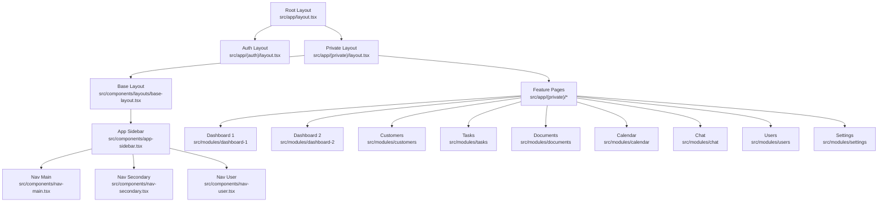
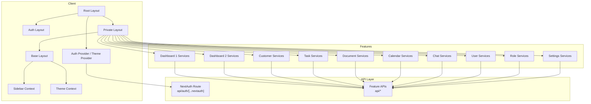
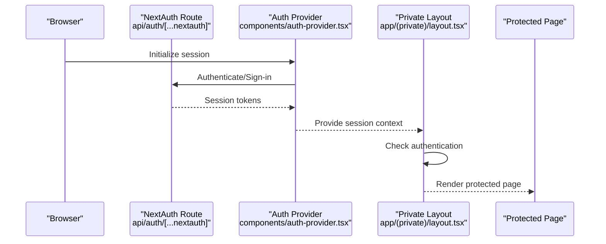
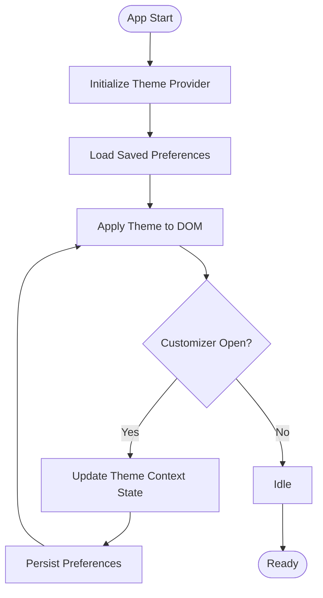
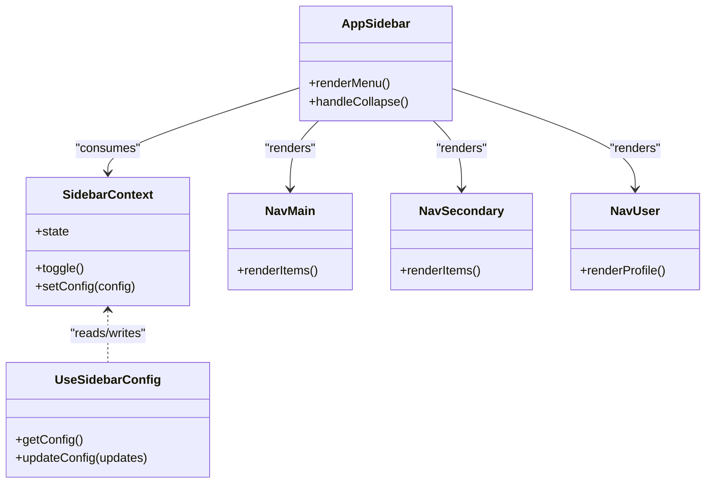
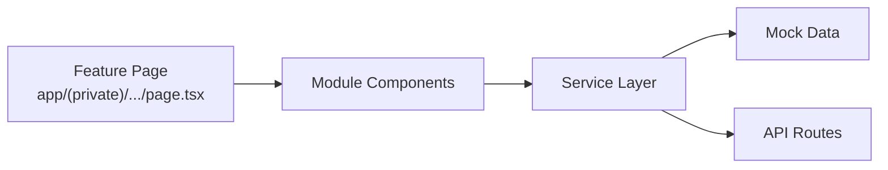
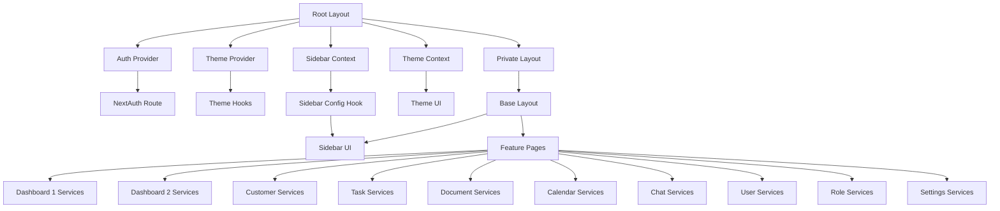

# System Design & Architecture

<cite>
**Referenced Files in This Document**
- [layout.tsx](file://src/app/layout.tsx)
- [layout.tsx](file://src/app/(auth)/layout.tsx)
- [layout.tsx](file://src/app/(private)/layout.tsx)
- [base-layout.tsx](file://src/components/layouts/base-layout.tsx)
- [auth-provider.tsx](file://src/components/auth-provider.tsx)
- [theme-provider.tsx](file://src/components/theme-provider.tsx)
- [sidebar-context.tsx](file://src/contexts/sidebar-context.tsx)
- [theme-context.ts](file://src/contexts/theme-context.ts)
- [app-sidebar.tsx](file://src/components/app-sidebar.tsx)
- [nav-main.tsx](file://src/components/nav-main.tsx)
- [nav-secondary.tsx](file://src/components/nav-secondary.tsx)
- [nav-user.tsx](file://src/components/nav-user.tsx)
- [page.tsx](file://src/app/(private)/dashboard/page.tsx)
- [page.tsx](file://src/app/(private)/customers/page.tsx)
- [page.tsx](file://src/app/(private)/tasks/page.tsx)
- [page.tsx](file://src/app/(private)/documents/page.tsx)
- [page.tsx](file://src/app/(private)/calendar/page.tsx)
- [page.tsx](file://src/app/(private)/chat/page.tsx)
- [route.ts](file://src/app/api/auth/[...nextauth]/route.ts)
- [auth.config.ts](file://src/auth.config.ts)
- [auth.ts](file://src/auth.ts)
- [use-theme-manager.ts](file://src/hooks/use-theme-manager.ts)
- [use-theme.ts](file://src/hooks/use-theme.ts)
- [use-mobile.ts](file://src/hooks/use-mobile.ts)
- [use-sidebar-config.ts](file://src/hooks/use-sidebar-config.ts)
- [theme-customizer.tsx](file://src/components/theme-customizer.tsx)
- [index.tsx](file://src/components/theme-customizer/index.tsx)
- [main.tsx](file://src/components/theme-customizer/main.tsx)
- [theme-tab.tsx](file://src/components/theme-customizer/theme-tab.tsx)
- [layout-tab.tsx](file://src/components/theme-customizer/layout-tab.tsx)
- [import-modal.tsx](file://src/components/theme-customizer/import-modal.tsx)
- [circular-transition.css](file://src/components/theme-customizer/circular-transition.css)
- [dashboard-services.ts](file://src/modules/dashboard-1/services/dashboard-services.ts)
- [dashboard-mock-data.ts](file://src/modules/dashboard-1/services/dashboard-mock-data.ts)
- [dashboard-2-services.ts](file://src/modules/dashboard-2/services/dashboard-2-services.ts)
- [dashboard-2-mock-data.ts](file://src/modules/dashboard-2/services/dashboard-2-mock-data.ts)
- [customer-services.ts](file://src/modules/customers/services/customer-services.ts)
- [task-services.ts](file://src/modules/tasks/services/task-services.ts)
- [document-services.ts](file://src/modules/documents/services/document-services.ts)
- [calendar-services.ts](file://src/modules/calendar/services/calendar-services.ts)
- [chat-services.ts](file://src/modules/chat/services/chat-services.ts)
- [user-services.ts](file://src/modules/users/services/user-services.ts)
- [role-services.ts](file://src/modules/users/services/role-services.ts)
- [settings-services.ts](file://src/modules/settings/services/settings-services.ts)
</cite>

## Table of Contents
1. [Introduction](#introduction)
2. [Project Structure](#project-structure)
3. [Core Components](#core-components)
4. [Architecture Overview](#architecture-overview)
5. [Detailed Component Analysis](#detailed-component-analysis)
6. [Dependency Analysis](#dependency-analysis)
7. [Performance Considerations](#performance-considerations)
8. [Troubleshooting Guide](#troubleshooting-guide)
9. [Conclusion](#conclusion)

## Introduction
This document describes the system design and overall architecture of the Claude Code ShadCN Dashboard. It focuses on the Next.js App Router with a feature-based modular structure, component hierarchy from root layout to feature modules, and key architectural patterns such as service layer abstraction, context-based state management, and route groups for authentication and private routes. It also covers scalability considerations, performance optimization strategies, and deployment topology.

## Project Structure
The application follows Next.js App Router conventions with:
- Route groups for public authentication flows and protected areas
- Feature modules organized by domain (dashboard, customers, tasks, documents, calendar, chat, users, settings)
- Shared UI components and theme customization utilities
- Contexts for global state (theme, sidebar)
- Service layers per feature for data access and business logic

**Diagram sources**
- [layout.tsx](file://src/app/layout.tsx)
- [layout.tsx](file://src/app/(auth)/layout.tsx)
- [layout.tsx](file://src/app/(private)/layout.tsx)
- [base-layout.tsx](file://src/components/layouts/base-layout.tsx)
- [app-sidebar.tsx](file://src/components/app-sidebar.tsx)
- [nav-main.tsx](file://src/components/nav-main.tsx)
- [nav-secondary.tsx](file://src/components/nav-secondary.tsx)
- [nav-user.tsx](file://src/components/nav-user.tsx)
- [page.tsx](file://src/app/(private)/dashboard/page.tsx)
- [page.tsx](file://src/app/(private)/customers/page.tsx)
- [page.tsx](file://src/app/(private)/tasks/page.tsx)
- [page.tsx](file://src/app/(private)/documents/page.tsx)
- [page.tsx](file://src/app/(private)/calendar/page.tsx)
- [page.tsx](file://src/app/(private)/chat/page.tsx)

**Section sources**
- [layout.tsx](file://src/app/layout.tsx)
- [layout.tsx](file://src/app/(auth)/layout.tsx)
- [layout.tsx](file://src/app/(private)/layout.tsx)
- [base-layout.tsx](file://src/components/layouts/base-layout.tsx)
- [app-sidebar.tsx](file://src/components/app-sidebar.tsx)
- [nav-main.tsx](file://src/components/nav-main.tsx)
- [nav-secondary.tsx](file://src/components/nav-secondary.tsx)
- [nav-user.tsx](file://src/components/nav-user.tsx)
- [page.tsx](file://src/app/(private)/dashboard/page.tsx)
- [page.tsx](file://src/app/(private)/customers/page.tsx)
- [page.tsx](file://src/app/(private)/tasks/page.tsx)
- [page.tsx](file://src/app/(private)/documents/page.tsx)
- [page.tsx](file://src/app/(private)/calendar/page.tsx)
- [page.tsx](file://src/app/(private)/chat/page.tsx)

## Core Components
- Root layout provides global providers and app shell.
- Auth layout wraps unauthenticated pages (sign-in, sign-up, forgot-password).
- Private layout enforces authenticated access and renders base layout with sidebar and content area.
- Base layout composes header, sidebar, and main content regions.
- Theme provider and theme customizer manage appearance and layout preferences.
- Sidebar navigation is driven by configuration hooks and contexts.

Key responsibilities:
- Authentication orchestration via auth provider and NextAuth integration.
- Global theme state via context and hooks.
- Sidebar state and configuration via context and hooks.
- Feature modules encapsulate UI and services.

**Section sources**
- [layout.tsx](file://src/app/layout.tsx)
- [layout.tsx](file://src/app/(auth)/layout.tsx)
- [layout.tsx](file://src/app/(private)/layout.tsx)
- [base-layout.tsx](file://src/components/layouts/base-layout.tsx)
- [auth-provider.tsx](file://src/components/auth-provider.tsx)
- [theme-provider.tsx](file://src/components/theme-provider.tsx)
- [sidebar-context.tsx](file://src/contexts/sidebar-context.tsx)
- [theme-context.ts](file://src/contexts/theme-context.ts)
- [use-theme-manager.ts](file://src/hooks/use-theme-manager.ts)
- [use-theme.ts](file://src/hooks/use-theme.ts)
- [use-mobile.ts](file://src/hooks/use-mobile.ts)
- [use-sidebar-config.ts](file://src/hooks/use-sidebar-config.ts)

## Architecture Overview
High-level system architecture includes:
- Client-side React components and layouts
- Next.js API routes for backend endpoints
- Authentication provider integration
- Theme and sidebar contexts for shared state
- Feature modules with service abstractions

**Diagram sources**
- [layout.tsx](file://src/app/layout.tsx)
- [layout.tsx](file://src/app/(auth)/layout.tsx)
- [layout.tsx](file://src/app/(private)/layout.tsx)
- [base-layout.tsx](file://src/components/layouts/base-layout.tsx)
- [auth-provider.tsx](file://src/components/auth-provider.tsx)
- [theme-provider.tsx](file://src/components/theme-provider.tsx)
- [sidebar-context.tsx](file://src/contexts/sidebar-context.tsx)
- [theme-context.ts](file://src/contexts/theme-context.ts)
- [route.ts](file://src/app/api/auth/[...nextauth]/route.ts)
- [dashboard-services.ts](file://src/modules/dashboard-1/services/dashboard-services.ts)
- [dashboard-2-services.ts](file://src/modules/dashboard-2/services/dashboard-2-services.ts)
- [customer-services.ts](file://src/modules/customers/services/customer-services.ts)
- [task-services.ts](file://src/modules/tasks/services/task-services.ts)
- [document-services.ts](file://src/modules/documents/services/document-services.ts)
- [calendar-services.ts](file://src/modules/calendar/services/calendar-services.ts)
- [chat-services.ts](file://src/modules/chat/services/chat-services.ts)
- [user-services.ts](file://src/modules/users/services/user-services.ts)
- [role-services.ts](file://src/modules/users/services/role-services.ts)
- [settings-services.ts](file://src/modules/settings/services/settings-services.ts)

## Detailed Component Analysis

### Authentication Flow
Authentication integrates NextAuth via an API route and client-side provider. The flow ensures protected routes are guarded and user sessions are available across the app.

**Diagram sources**
- [route.ts](file://src/app/api/auth/[...nextauth]/route.ts)
- [auth-provider.tsx](file://src/components/auth-provider.tsx)
- [layout.tsx](file://src/app/(private)/layout.tsx)

**Section sources**
- [route.ts](file://src/app/api/auth/[...nextauth]/route.ts)
- [auth-provider.tsx](file://src/components/auth-provider.tsx)
- [layout.tsx](file://src/app/(private)/layout.tsx)
- [auth.config.ts](file://src/auth.config.ts)
- [auth.ts](file://src/auth.ts)

### Theme Management
Theme state is managed through context and hooks, with a customizer panel for live adjustments.

**Diagram sources**
- [theme-provider.tsx](file://src/components/theme-provider.tsx)
- [theme-context.ts](file://src/contexts/theme-context.ts)
- [use-theme-manager.ts](file://src/hooks/use-theme-manager.ts)
- [use-theme.ts](file://src/hooks/use-theme.ts)
- [theme-customizer.tsx](file://src/components/theme-customizer.tsx)
- [index.tsx](file://src/components/theme-customizer/index.tsx)
- [main.tsx](file://src/components/theme-customizer/main.tsx)
- [theme-tab.tsx](file://src/components/theme-customizer/theme-tab.tsx)
- [layout-tab.tsx](file://src/components/theme-customizer/layout-tab.tsx)
- [import-modal.tsx](file://src/components/theme-customizer/import-modal.tsx)
- [circular-transition.css](file://src/components/theme-customizer/circular-transition.css)

**Section sources**
- [theme-provider.tsx](file://src/components/theme-provider.tsx)
- [theme-context.ts](file://src/contexts/theme-context.ts)
- [use-theme-manager.ts](file://src/hooks/use-theme-manager.ts)
- [use-theme.ts](file://src/hooks/use-theme.ts)
- [theme-customizer.tsx](file://src/components/theme-customizer.tsx)
- [index.tsx](file://src/components/theme-customizer/index.tsx)
- [main.tsx](file://src/components/theme-customizer/main.tsx)
- [theme-tab.tsx](file://src/components/theme-customizer/theme-tab.tsx)
- [layout-tab.tsx](file://src/components/theme-customizer/layout-tab.tsx)
- [import-modal.tsx](file://src/components/theme-customizer/import-modal.tsx)
- [circular-transition.css](file://src/components/theme-customizer/circular-transition.css)

### Sidebar Navigation
Sidebar state and configuration are provided via context and hooks, enabling responsive behavior and dynamic menu items.

**Diagram sources**
- [sidebar-context.tsx](file://src/contexts/sidebar-context.tsx)
- [use-sidebar-config.ts](file://src/hooks/use-sidebar-config.ts)
- [app-sidebar.tsx](file://src/components/app-sidebar.tsx)
- [nav-main.tsx](file://src/components/nav-main.tsx)
- [nav-secondary.tsx](file://src/components/nav-secondary.tsx)
- [nav-user.tsx](file://src/components/nav-user.tsx)

**Section sources**
- [sidebar-context.tsx](file://src/contexts/sidebar-context.tsx)
- [use-sidebar-config.ts](file://src/hooks/use-sidebar-config.ts)
- [app-sidebar.tsx](file://src/components/app-sidebar.tsx)
- [nav-main.tsx](file://src/components/nav-main.tsx)
- [nav-secondary.tsx](file://src/components/nav-secondary.tsx)
- [nav-user.tsx](file://src/components/nav-user.tsx)

### Feature Modules and Service Abstraction
Each feature module encapsulates UI components and a service layer that abstracts data access. Services may use mock data or call API routes.

Examples:
- Dashboard 1: [dashboard-services.ts](file://src/modules/dashboard-1/services/dashboard-services.ts), [dashboard-mock-data.ts](file://src/modules/dashboard-1/services/dashboard-mock-data.ts)
- Dashboard 2: [dashboard-2-services.ts](file://src/modules/dashboard-2/services/dashboard-2-services.ts), [dashboard-2-mock-data.ts](file://src/modules/dashboard-2/services/dashboard-2-mock-data.ts)
- Customers: [customer-services.ts](file://src/modules/customers/services/customer-services.ts)
- Tasks: [task-services.ts](file://src/modules/tasks/services/task-services.ts)
- Documents: [document-services.ts](file://src/modules/documents/services/document-services.ts)
- Calendar: [calendar-services.ts](file://src/modules/calendar/services/calendar-services.ts)
- Chat: [chat-services.ts](file://src/modules/chat/services/chat-services.ts)
- Users: [user-services.ts](file://src/modules/users/services/user-services.ts), [role-services.ts](file://src/modules/users/services/role-services.ts)
- Settings: [settings-services.ts](file://src/modules/settings/services/settings-services.ts)

**Diagram sources**
- [page.tsx](file://src/app/(private)/dashboard/page.tsx)
- [page.tsx](file://src/app/(private)/customers/page.tsx)
- [page.tsx](file://src/app/(private)/tasks/page.tsx)
- [page.tsx](file://src/app/(private)/documents/page.tsx)
- [page.tsx](file://src/app/(private)/calendar/page.tsx)
- [page.tsx](file://src/app/(private)/chat/page.tsx)
- [dashboard-services.ts](file://src/modules/dashboard-1/services/dashboard-services.ts)
- [dashboard-mock-data.ts](file://src/modules/dashboard-1/services/dashboard-mock-data.ts)
- [dashboard-2-services.ts](file://src/modules/dashboard-2/services/dashboard-2-services.ts)
- [dashboard-2-mock-data.ts](file://src/modules/dashboard-2/services/dashboard-2-mock-data.ts)
- [customer-services.ts](file://src/modules/customers/services/customer-services.ts)
- [task-services.ts](file://src/modules/tasks/services/task-services.ts)
- [document-services.ts](file://src/modules/documents/services/document-services.ts)
- [calendar-services.ts](file://src/modules/calendar/services/calendar-services.ts)
- [chat-services.ts](file://src/modules/chat/services/chat-services.ts)
- [user-services.ts](file://src/modules/users/services/user-services.ts)
- [role-services.ts](file://src/modules/users/services/role-services.ts)
- [settings-services.ts](file://src/modules/settings/services/settings-services.ts)

**Section sources**
- [page.tsx](file://src/app/(private)/dashboard/page.tsx)
- [page.tsx](file://src/app/(private)/customers/page.tsx)
- [page.tsx](file://src/app/(private)/tasks/page.tsx)
- [page.tsx](file://src/app/(private)/documents/page.tsx)
- [page.tsx](file://src/app/(private)/calendar/page.tsx)
- [page.tsx](file://src/app/(private)/chat/page.tsx)
- [dashboard-services.ts](file://src/modules/dashboard-1/services/dashboard-services.ts)
- [dashboard-mock-data.ts](file://src/modules/dashboard-1/services/dashboard-mock-data.ts)
- [dashboard-2-services.ts](file://src/modules/dashboard-2/services/dashboard-2-services.ts)
- [dashboard-2-mock-data.ts](file://src/modules/dashboard-2/services/dashboard-2-mock-data.ts)
- [customer-services.ts](file://src/modules/customers/services/customer-services.ts)
- [task-services.ts](file://src/modules/tasks/services/task-services.ts)
- [document-services.ts](file://src/modules/documents/services/document-services.ts)
- [calendar-services.ts](file://src/modules/calendar/services/calendar-services.ts)
- [chat-services.ts](file://src/modules/chat/services/chat-services.ts)
- [user-services.ts](file://src/modules/users/services/user-services.ts)
- [role-services.ts](file://src/modules/users/services/role-services.ts)
- [settings-services.ts](file://src/modules/settings/services/settings-services.ts)

## Dependency Analysis
The following diagram shows how core dependencies interconnect across layouts, providers, contexts, and features.

**Diagram sources**
- [layout.tsx](file://src/app/layout.tsx)
- [auth-provider.tsx](file://src/components/auth-provider.tsx)
- [theme-provider.tsx](file://src/components/theme-provider.tsx)
- [sidebar-context.tsx](file://src/contexts/sidebar-context.tsx)
- [theme-context.ts](file://src/contexts/theme-context.ts)
- [use-theme-manager.ts](file://src/hooks/use-theme-manager.ts)
- [use-theme.ts](file://src/hooks/use-theme.ts)
- [use-sidebar-config.ts](file://src/hooks/use-sidebar-config.ts)
- [app-sidebar.tsx](file://src/components/app-sidebar.tsx)
- [layout.tsx](file://src/app/(private)/layout.tsx)
- [base-layout.tsx](file://src/components/layouts/base-layout.tsx)
- [dashboard-services.ts](file://src/modules/dashboard-1/services/dashboard-services.ts)
- [dashboard-2-services.ts](file://src/modules/dashboard-2/services/dashboard-2-services.ts)
- [customer-services.ts](file://src/modules/customers/services/customer-services.ts)
- [task-services.ts](file://src/modules/tasks/services/task-services.ts)
- [document-services.ts](file://src/modules/documents/services/document-services.ts)
- [calendar-services.ts](file://src/modules/calendar/services/calendar-services.ts)
- [chat-services.ts](file://src/modules/chat/services/chat-services.ts)
- [user-services.ts](file://src/modules/users/services/user-services.ts)
- [role-services.ts](file://src/modules/users/services/role-services.ts)
- [settings-services.ts](file://src/modules/settings/services/settings-services.ts)

**Section sources**
- [layout.tsx](file://src/app/layout.tsx)
- [auth-provider.tsx](file://src/components/auth-provider.tsx)
- [theme-provider.tsx](file://src/components/theme-provider.tsx)
- [sidebar-context.tsx](file://src/contexts/sidebar-context.tsx)
- [theme-context.ts](file://src/contexts/theme-context.ts)
- [use-theme-manager.ts](file://src/hooks/use-theme-manager.ts)
- [use-theme.ts](file://src/hooks/use-theme.ts)
- [use-sidebar-config.ts](file://src/hooks/use-sidebar-config.ts)
- [app-sidebar.tsx](file://src/components/app-sidebar.tsx)
- [layout.tsx](file://src/app/(private)/layout.tsx)
- [base-layout.tsx](file://src/components/layouts/base-layout.tsx)
- [dashboard-services.ts](file://src/modules/dashboard-1/services/dashboard-services.ts)
- [dashboard-2-services.ts](file://src/modules/dashboard-2/services/dashboard-2-services.ts)
- [customer-services.ts](file://src/modules/customers/services/customer-services.ts)
- [task-services.ts](file://src/modules/tasks/services/task-services.ts)
- [document-services.ts](file://src/modules/documents/services/document-services.ts)
- [calendar-services.ts](file://src/modules/calendar/services/calendar-services.ts)
- [chat-services.ts](file://src/modules/chat/services/chat-services.ts)
- [user-services.ts](file://src/modules/users/services/user-services.ts)
- [role-services.ts](file://src/modules/users/services/role-services.ts)
- [settings-services.ts](file://src/modules/settings/services/settings-services.ts)

## Performance Considerations
- Prefer server-side rendering and static generation where possible using Next.js App Router capabilities.
- Implement code splitting at route and component levels to reduce initial bundle size.
- Cache API responses and leverage browser caching headers for stable datasets.
- Optimize images and assets; consider lazy loading heavy components.
- Debounce and throttle user interactions (e.g., search, filter) in service layers.
- Minimize re-renders by memoizing expensive computations and stabilizing props.
- Use mobile-first responsive hooks to conditionally render lightweight UI on smaller screens.

[No sources needed since this section provides general guidance]

## Troubleshooting Guide
Common issues and resolutions:
- Authentication failures: Verify NextAuth route configuration and environment variables. Ensure session initialization occurs before accessing protected routes.
- Theme not persisting: Confirm theme context updates and persistence logic; check local storage availability and error handling.
- Sidebar misbehavior: Validate sidebar context state transitions and config updates; ensure mobile breakpoints are handled correctly.
- Feature data errors: Inspect service layer calls and mock data; validate API route responses and error propagation.

**Section sources**
- [route.ts](file://src/app/api/auth/[...nextauth]/route.ts)
- [auth-provider.tsx](file://src/components/auth-provider.tsx)
- [theme-provider.tsx](file://src/components/theme-provider.tsx)
- [theme-context.ts](file://src/contexts/theme-context.ts)
- [use-theme-manager.ts](file://src/hooks/use-theme-manager.ts)
- [sidebar-context.tsx](file://src/contexts/sidebar-context.tsx)
- [use-sidebar-config.ts](file://src/hooks/use-sidebar-config.ts)
- [dashboard-services.ts](file://src/modules/dashboard-1/services/dashboard-services.ts)
- [customer-services.ts](file://src/modules/customers/services/customer-services.ts)
- [task-services.ts](file://src/modules/tasks/services/task-services.ts)
- [document-services.ts](file://src/modules/documents/services/document-services.ts)
- [calendar-services.ts](file://src/modules/calendar/services/calendar-services.ts)
- [chat-services.ts](file://src/modules/chat/services/chat-services.ts)
- [user-services.ts](file://src/modules/users/services/user-services.ts)
- [role-services.ts](file://src/modules/users/services/role-services.ts)
- [settings-services.ts](file://src/modules/settings/services/settings-services.ts)

## Conclusion
The Claude Code ShadCN Dashboard leverages Next.js App Router with a clear separation between public and private routes, robust provider composition, and feature-based modularity. Context-driven state management centralizes theme and sidebar concerns, while service layers encapsulate data access and business logic. This architecture supports scalability, maintainability, and performance optimizations suitable for evolving dashboard applications.

[No sources needed since this section summarizes without analyzing specific files]