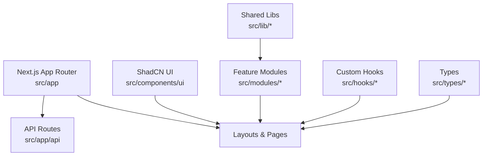
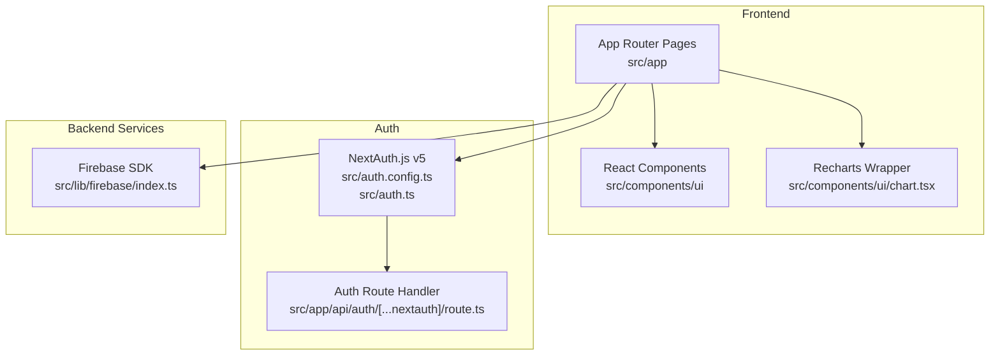
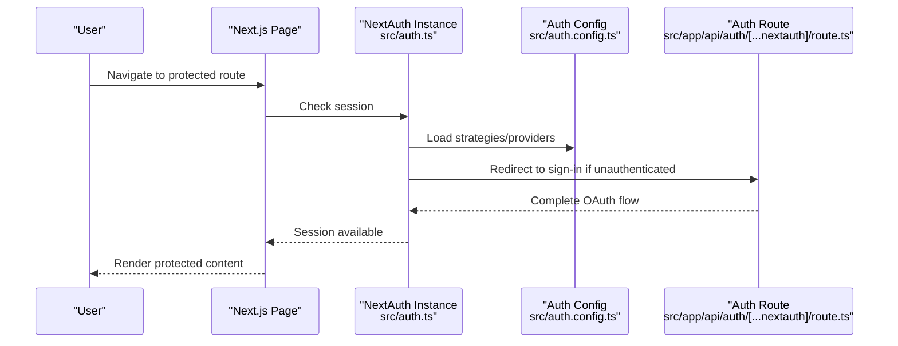
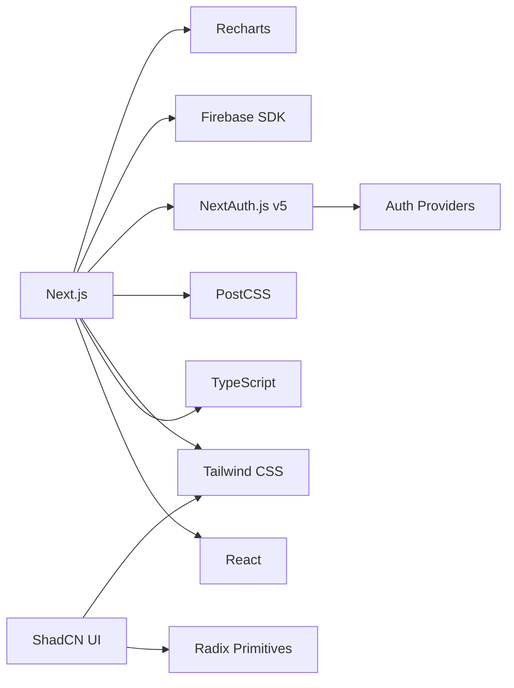

# Technology Stack & Dependencies

<cite>
**Referenced Files in This Document**
- [package.json](file://package.json)
- [next.config.ts](file://next.config.ts)
- [tsconfig.json](file://tsconfig.json)
- [postcss.config.mjs](file://postcss.config.mjs)
- [eslint.config.mjs](file://eslint.config.mjs)
- [.prettierrc](file://.prettierrc)
- [components.json](file://components.json)
- [src/app/layout.tsx](file://src/app/layout.tsx)
- [src/auth.config.ts](file://src/auth.config.ts)
- [src/auth.ts](file://src/auth.ts)
- [src/lib/firebase/index.ts](file://src/lib/firebase/index.ts)
- [src/components/ui/chart.tsx](file://src/components/ui/chart.tsx)
</cite>

## Table of Contents
1. [Introduction](#introduction)
2. [Project Structure](#project-structure)
3. [Core Components](#core-components)
4. [Architecture Overview](#architecture-overview)
5. [Detailed Component Analysis](#detailed-component-analysis)
6. [Dependency Analysis](#dependency-analysis)
7. [Performance Considerations](#performance-considerations)
8. [Troubleshooting Guide](#troubleshooting-guide)
9. [Conclusion](#conclusion)

## Introduction
This document explains the technology stack and core dependencies used by the Claude Code ShadCN Dashboard. It covers Next.js 14+ with App Router, React 18+, TypeScript, Tailwind CSS, ShadCN UI (Radix-based), authentication via NextAuth.js v5, Firebase SDK integration, Recharts for data visualization, and supporting utilities. It also documents version compatibility requirements, dependency relationships, rationale for choices, and configuration details for build tools, linting, formatting, and development setup.

## Project Structure
The project follows a modern Next.js App Router layout:
- src/app: Route segments and layouts
- src/components/ui: ShadCN UI components
- src/modules: Feature modules (dashboard, tasks, customers, chat, calendar, documents, users, settings)
- src/lib: Shared libraries (auth, firebase, utils)
- src/hooks: Custom hooks
- src/types: Type definitions
- Root config files: package.json, next.config.ts, tsconfig.json, postcss.config.mjs, eslint.config.mjs, .prettierrc, components.json

[No sources needed since this diagram shows conceptual structure]

## Core Components
- Framework and runtime
  - Next.js 14+ with App Router for routing, server components, and API routes
  - React 18+ for component model and concurrent features
  - TypeScript for type safety across the codebase
- Styling and theming
  - Tailwind CSS for utility-first styling
  - ShadCN UI built on Radix UI primitives for accessible, customizable components
- Authentication
  - NextAuth.js v5 configured under src/app/api/auth/[...nextauth]/route.ts and auth configuration files
- Backend services
  - Firebase SDK integrated via src/lib/firebase to interact with backend services
- Data visualization
  - Recharts used through a chart wrapper component for dashboards and analytics
- Build and tooling
  - PostCSS for CSS processing
  - ESLint for linting
  - Prettier for code formatting
  - Next.js configuration for app behavior

Key configuration entry points:
- Application root layout: src/app/layout.tsx
- Auth configuration: src/auth.config.ts, src/auth.ts
- Firebase initialization: src/lib/firebase/index.ts
- Chart component wrapper: src/components/ui/chart.tsx

**Section sources**
- [package.json](file://package.json)
- [next.config.ts](file://next.config.ts)
- [tsconfig.json](file://tsconfig.json)
- [postcss.config.mjs](file://postcss.config.mjs)
- [eslint.config.mjs](file://eslint.config.mjs)
- [.prettierrc](file://.prettierrc)
- [components.json](file://components.json)
- [src/app/layout.tsx](file://src/app/layout.tsx)
- [src/auth.config.ts](file://src/auth.config.ts)
- [src/auth.ts](file://src/auth.ts)
- [src/lib/firebase/index.ts](file://src/lib/firebase/index.ts)
- [src/components/ui/chart.tsx](file://src/components/ui/chart.tsx)

## Architecture Overview
High-level architecture showing how frontend, authentication, backend services, and visualization integrate within Next.js App Router.

**Diagram sources**
- [src/app/layout.tsx](file://src/app/layout.tsx)
- [src/auth.config.ts](file://src/auth.config.ts)
- [src/auth.ts](file://src/auth.ts)
- [src/lib/firebase/index.ts](file://src/lib/firebase/index.ts)
- [src/components/ui/chart.tsx](file://src/components/ui/chart.tsx)

## Detailed Component Analysis

### Next.js 14+ with App Router
- Purpose: Provides file-based routing, server-side rendering, streaming, and API routes.
- Key behaviors:
  - Layouts and pages defined under src/app
  - API endpoints under src/app/api
  - Global styles and providers in src/app/layout.tsx
- Rationale: Modern DX, performance optimizations, and strong ecosystem support.

**Section sources**
- [src/app/layout.tsx](file://src/app/layout.tsx)
- [next.config.ts](file://next.config.ts)

### React 18+
- Purpose: Component-based UI library with concurrent features.
- Integration: Used throughout src/app and src/components.
- Rationale: Mature ecosystem, broad adoption, and excellent TypeScript support.

**Section sources**
- [package.json](file://package.json)

### TypeScript
- Purpose: Static typing for safer development and better IDE support.
- Configuration: tsconfig.json defines compiler options and paths.
- Rationale: Improves maintainability and reduces runtime errors.

**Section sources**
- [tsconfig.json](file://tsconfig.json)

### Tailwind CSS
- Purpose: Utility-first CSS framework for rapid UI development.
- Processing: Configured via postcss.config.mjs.
- Rationale: Consistent design tokens, responsive utilities, and theme customization.

**Section sources**
- [postcss.config.mjs](file://postcss.config.mjs)

### ShadCN UI (Radix-based)
- Purpose: Accessible, customizable UI components built on Radix primitives.
- Setup: Managed via components.json; components live in src/components/ui.
- Rationale: High-quality defaults, accessibility, and flexibility without heavy abstractions.

**Section sources**
- [components.json](file://components.json)
- [src/components/ui/chart.tsx](file://src/components/ui/chart.tsx)

### NextAuth.js v5
- Purpose: Authentication provider and session management.
- Configuration:
  - Provider and strategy settings in src/auth.config.ts
  - Auth instance in src/auth.ts
  - Route handler at src/app/api/auth/[...nextauth]/route.ts
- Rationale: Flexible, secure, and integrates well with Next.js App Router.

**Diagram sources**
- [src/auth.config.ts](file://src/auth.config.ts)
- [src/auth.ts](file://src/auth.ts)
- [src/app/api/auth/[...nextauth]/route.ts](file://src/app/api/auth/[...nextauth]/route.ts)

**Section sources**
- [src/auth.config.ts](file://src/auth.config.ts)
- [src/auth.ts](file://src/auth.ts)
- [src/app/api/auth/[...nextauth]/route.ts](file://src/app/api/auth/[...nextauth]/route.ts)

### Firebase SDK
- Purpose: Backend-as-a-Service integration for data, auth, and other services.
- Initialization: Centralized in src/lib/firebase/index.ts.
- Usage: Imported by feature modules and API routes as needed.
- Rationale: Rapid prototyping, scalable infrastructure, and real-time capabilities.

**Section sources**
- [src/lib/firebase/index.ts](file://src/lib/firebase/index.ts)

### Recharts
- Purpose: Declarative charting library for data visualization.
- Integration: Wrapped in src/components/ui/chart.tsx for consistent theming and usage patterns.
- Rationale: Strong React integration, flexible APIs, and good performance for dashboard charts.

**Section sources**
- [src/components/ui/chart.tsx](file://src/components/ui/chart.tsx)

### Build Tools and Developer Experience
- PostCSS: Processes Tailwind directives and plugins.
- ESLint: Enforces code quality rules.
- Prettier: Ensures consistent formatting.
- Next.js config: Controls app behavior, environment variables, and optimizations.

**Section sources**
- [postcss.config.mjs](file://postcss.config.mjs)
- [eslint.config.mjs](file://eslint.config.mjs)
- [.prettierrc](file://.prettierrc)
- [next.config.ts](file://next.config.ts)

## Dependency Analysis
Version compatibility and relationships are defined in package.json. The following categories summarize key dependencies:
- Framework and runtime: Next.js, React, ReactDOM
- Language and types: TypeScript
- Styling: Tailwind CSS, PostCSS, related plugins
- UI components: ShadCN UI components and Radix primitives
- Authentication: NextAuth.js v5 and related adapters
- Backend services: Firebase SDK packages
- Visualization: Recharts and its peer dependencies
- Tooling: ESLint, Prettier, and related configs

**Diagram sources**
- [package.json](file://package.json)

**Section sources**
- [package.json](file://package.json)

## Performance Considerations
- Prefer server components where possible to reduce client bundle size.
- Use dynamic imports for heavy modules (e.g., charts) to improve initial load.
- Leverage Next.js image optimization and font loading strategies.
- Minimize re-renders by memoizing expensive computations and using stable references.
- Keep Tailwind classes scoped and avoid unnecessary style recalculation.

[No sources needed since this section provides general guidance]

## Troubleshooting Guide
Common issues and resolutions:
- Authentication redirects not working
  - Ensure NextAuth route handler exists and is correctly configured.
  - Verify provider credentials and callback URLs.
- Firebase initialization errors
  - Confirm environment variables are set and accessible in the runtime.
  - Check that Firebase SDK is initialized before use.
- Chart rendering problems
  - Validate data shapes passed to Recharts components.
  - Ensure chart wrapper handles responsive sizing and theme props.
- Linting or formatting failures
  - Run ESLint and Prettier locally to identify rule violations.
  - Align editor settings with .prettierrc and ESLint config.

**Section sources**
- [src/auth.config.ts](file://src/auth.config.ts)
- [src/auth.ts](file://src/auth.ts)
- [src/app/api/auth/[...nextauth]/route.ts](file://src/app/api/auth/[...nextauth]/route.ts)
- [src/lib/firebase/index.ts](file://src/lib/firebase/index.ts)
- [src/components/ui/chart.tsx](file://src/components/ui/chart.tsx)
- [eslint.config.mjs](file://eslint.config.mjs)
- [.prettierrc](file://.prettierrc)

## Conclusion
The Claude Code ShadCN Dashboard leverages a modern, high-performance stack centered on Next.js 14+ with App Router, React 18+, TypeScript, Tailwind CSS, and ShadCN UI. Authentication is handled by NextAuth.js v5, backend services by Firebase SDK, and data visualization by Recharts. The configuration files define build, linting, and formatting standards to ensure consistency and reliability. This combination balances developer experience, scalability, and maintainability for a robust dashboard application.