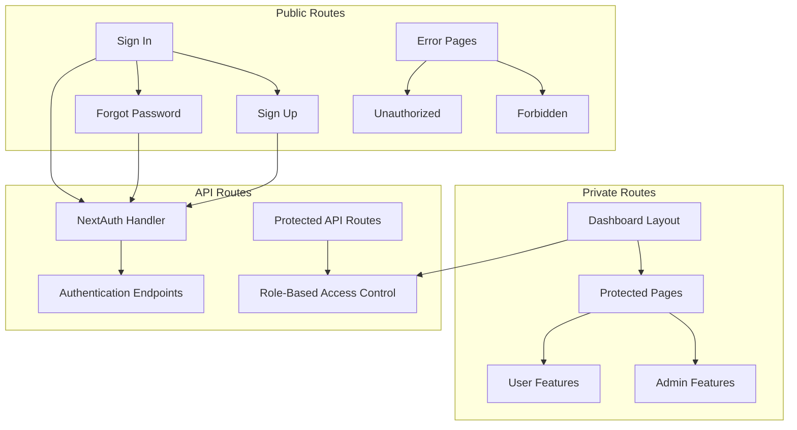
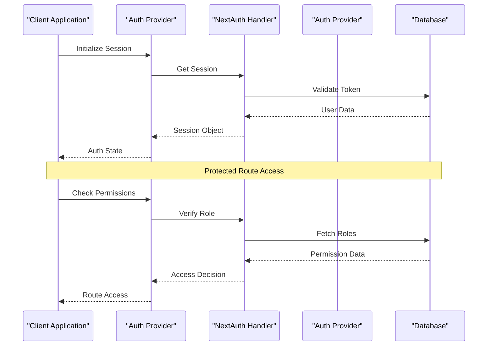
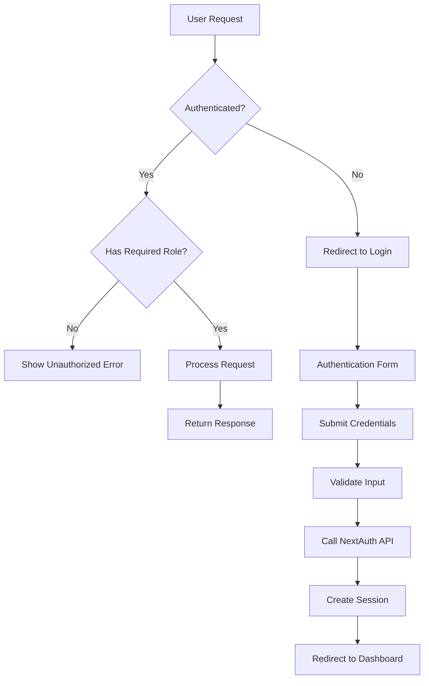
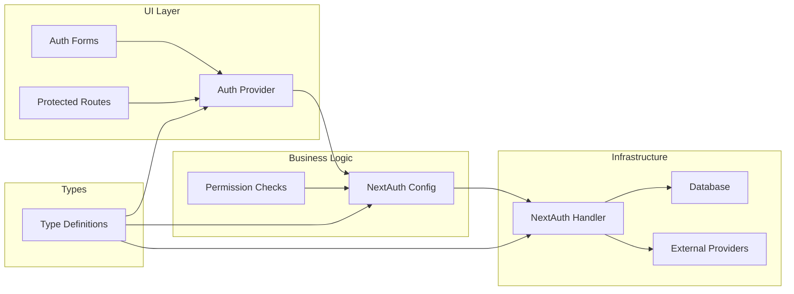

# Authentication & Authorization

<cite>
**Referenced Files in This Document**
- [auth.ts](file://src/auth.ts)
- [auth.config.ts](file://src/auth.config.ts)
- [route.ts](file://src/app/api/auth/[...nextauth]/route.ts)
- [auth-provider.tsx](file://src/components/auth-provider.tsx)
- [next-auth.d.ts](file://src/types/next-auth.d.ts)
- [layout.tsx](file://src/app/(auth)/layout.tsx)
- [login-form.tsx](file://src/app/(auth)/sign-in/components/login-form.tsx)
- [signup-form.tsx](file://src/app/(auth)/sign-up/components/signup-form.tsx)
- [forgot-password-form.tsx](file://src/app/(auth)/forgot-password/components/forgot-password-form.tsx)
- [page.tsx](file://src/app/(private)/layout.tsx)
- [forbidden-error.tsx](file://src/app/(auth)/errors/forbidden/components/forbidden-error.tsx)
- [unauthorized-error.tsx](file://src/app/(auth)/errors/unauthorized/components/unauthorized-error.tsx)
</cite>

## Table of Contents
1. [Introduction](#introduction)
2. [Project Structure](#project-structure)
3. [Core Components](#core-components)
4. [Architecture Overview](#architecture-overview)
5. [Detailed Component Analysis](#detailed-component-analysis)
6. [Dependency Analysis](#dependency-analysis)
7. [Performance Considerations](#performance-considerations)
8. [Troubleshooting Guide](#troubleshooting-guide)
9. [Security Best Practices](#security-best-practices)
10. [Conclusion](#conclusion)

## Introduction

This document provides comprehensive authentication and authorization documentation for the dashboard system built with Next.js and NextAuth.js v5. The system implements a complete authentication flow including user registration, login, password reset, role-based access control (RBAC), and protected routes. It follows modern security practices and provides a scalable foundation for enterprise applications.

The authentication system is designed around NextAuth.js v5's modular architecture, providing flexibility for multiple authentication providers while maintaining strong security standards and excellent developer experience.

## Project Structure

The authentication system follows Next.js App Router conventions with clear separation between public and private routes:

**Diagram sources**
- [layout.tsx](file://src/app/(auth)/layout.tsx)
- [page.tsx](file://src/app/(private)/layout.tsx)
- [route.ts](file://src/app/api/auth/[...nextauth]/route.ts)

**Section sources**
- [layout.tsx](file://src/app/(auth)/layout.tsx)
- [page.tsx](file://src/app/(private)/layout.tsx)

## Core Components

### NextAuth.js Configuration

The core authentication configuration is centralized in dedicated files that manage provider setup, session handling, and security settings.

#### Provider Configuration
The system supports multiple authentication providers through a modular configuration approach. Providers are configured with specific options for each authentication method including credentials, OAuth providers, and custom implementations.

#### Session Management
Session configuration includes token encryption, cookie settings, and session expiration policies. The system implements secure session storage with proper CSRF protection and HTTP-only cookies.

#### Callback Functions
Custom callback functions handle user data transformation, role assignment, and session customization. These callbacks provide hooks for extending authentication behavior without modifying core logic.

**Section sources**
- [auth.ts](file://src/auth.ts)
- [auth.config.ts](file://src/auth.config.ts)

### Authentication Provider Component

The React context provider wraps the application to make authentication state available throughout the component tree. It handles session synchronization, loading states, and error boundaries.

#### State Management
The provider maintains client-side authentication state that mirrors server sessions. It includes automatic revalidation and optimistic updates for better user experience.

#### Error Handling
Comprehensive error handling covers network failures, invalid sessions, and provider-specific errors. Users receive meaningful feedback during authentication flows.

**Section sources**
- [auth-provider.tsx](file://src/components/auth-provider.tsx)

### Type Definitions

TypeScript definitions extend NextAuth.js types to include custom user properties, roles, and permissions. This ensures type safety across the entire authentication system.

#### Custom User Model
Extended user types include role information, permissions, and profile data. These types are used consistently across components and API routes.

#### Session Types
Enhanced session types provide compile-time guarantees for session data structure and available methods.

**Section sources**
- [next-auth.d.ts](file://src/types/next-auth.d.ts)

## Architecture Overview

The authentication architecture follows a layered approach with clear separation of concerns:

**Diagram sources**
- [auth-provider.tsx](file://src/components/auth-provider.tsx)
- [route.ts](file://src/app/api/auth/[...nextauth]/route.ts)
- [auth.ts](file://src/auth.ts)

### Request Flow Architecture

**Diagram sources**
- [login-form.tsx](file://src/app/(auth)/sign-in/components/login-form.tsx)
- [signup-form.tsx](file://src/app/(auth)/sign-up/components/signup-form.tsx)
- [forgot-password-form.tsx](file://src/app/(auth)/forgot-password/components/forgot-password-form.tsx)

## Detailed Component Analysis

### Authentication Forms

#### Sign-In Form Implementation
The sign-in form implements secure credential submission with input validation, error handling, and loading states. It integrates with NextAuth.js client-side methods for seamless authentication.

#### Sign-Up Form Implementation  
User registration includes email verification, password strength validation, and terms acceptance. The form provides real-time validation and clear error messages.

#### Password Reset Flow
Password reset functionality sends secure tokens via email and provides a safe interface for password updates. Includes token validation and expiry handling.

**Section sources**
- [login-form.tsx](file://src/app/(auth)/sign-in/components/login-form.tsx)
- [signup-form.tsx](file://src/app/(auth)/sign-up/components/signup-form.tsx)
- [forgot-password-form.tsx](file://src/app/(auth)/forgot-password/components/forgot-password-form.tsx)

### Protected Route Implementation

#### Route Guards
Route guards check authentication status and user roles before allowing access to protected pages. They provide smooth redirects and maintain navigation state.

#### Layout-Based Protection
The private layout applies authentication checks at the route group level, ensuring all nested routes inherit protection automatically.

#### Dynamic Access Control
Permission-based routing allows dynamic content visibility based on user roles and permissions without requiring separate route definitions.

**Section sources**
- [page.tsx](file://src/app/(private)/layout.tsx)

### Error Handling

#### Authentication Errors
Comprehensive error pages handle different authentication failure scenarios including invalid credentials, expired sessions, and account lockouts.

#### Authorization Errors
Distinct error handling for permission denied scenarios provides appropriate messaging and recovery options for users.

#### Network Error Recovery
Graceful handling of network failures during authentication with retry mechanisms and offline support indicators.

**Section sources**
- [forbidden-error.tsx](file://src/app/(auth)/errors/forbidden/components/forbidden-error.tsx)
- [unauthorized-error.tsx](file://src/app/(auth)/errors/unauthorized/components/unauthorized-error.tsx)

## Dependency Analysis

The authentication system has well-defined dependencies and clear separation between layers:

**Diagram sources**
- [auth-provider.tsx](file://src/components/auth-provider.tsx)
- [auth.ts](file://src/auth.ts)
- [route.ts](file://src/app/api/auth/[...nextauth]/route.ts)

### Component Relationships

The authentication components follow a unidirectional data flow pattern where higher-level components manage state and pass down necessary props to child components. This ensures predictable behavior and easier testing.

### External Dependencies

The system integrates with external authentication providers through standardized interfaces, making it easy to add new providers or modify existing ones without affecting core functionality.

**Section sources**
- [auth-provider.tsx](file://src/components/auth-provider.tsx)
- [auth.ts](file://src/auth.ts)

## Performance Considerations

### Session Optimization
The authentication system implements efficient session caching and background revalidation to minimize server requests while maintaining current user state.

### Lazy Loading
Authentication-related code is lazy-loaded to reduce initial bundle size. Only essential authentication logic loads immediately, with additional features loaded on demand.

### Memory Management
Proper cleanup of authentication listeners and event handlers prevents memory leaks in long-running applications.

### Caching Strategies
Strategic use of client-side caching for user profiles and permissions reduces unnecessary API calls while keeping data fresh through intelligent invalidation.

## Troubleshooting Guide

### Common Authentication Issues

#### Session Not Persisting
Check browser cookie settings and ensure HTTP-only cookies are properly configured. Verify CORS settings if using cross-origin requests.

#### Provider Configuration Errors
Validate provider credentials and redirect URLs. Ensure environment variables are properly set and accessible in both development and production environments.

#### Permission Denied Errors
Verify user roles in the database match expected values. Check permission mapping logic and ensure role assignments are correctly propagated to sessions.

#### Network Timeout Issues
Implement retry logic for authentication requests and provide user feedback during slow network conditions. Consider implementing exponential backoff for failed attempts.

### Debugging Tools

#### Development Logging
Enable detailed authentication logging in development mode to trace request flows and identify bottlenecks.

#### Session Inspection
Use browser developer tools to inspect session cookies and local storage for debugging purposes.

#### Network Monitoring
Monitor authentication API calls to identify performance issues and error patterns.

**Section sources**
- [auth-provider.tsx](file://src/components/auth-provider.tsx)
- [auth.ts](file://src/auth.ts)

## Security Best Practices

### Input Validation
All user inputs are validated on both client and server sides. Server-side validation is the authoritative source of truth for security decisions.

### CSRF Protection
NextAuth.js provides built-in CSRF protection through same-site cookies and token validation. Additional CSRF tokens are implemented for sensitive operations.

### Password Security
Passwords are hashed using industry-standard algorithms with appropriate salt rounds. Password policies enforce minimum complexity requirements.

### Session Security
Sessions use secure, HTTP-only cookies with proper domain and path restrictions. Session timeouts are configurable and enforced server-side.

### Rate Limiting
Authentication endpoints implement rate limiting to prevent brute force attacks and credential stuffing attempts.

### Audit Logging
All authentication events are logged for security monitoring and compliance purposes, including login attempts, permission changes, and administrative actions.

## Conclusion

The authentication and authorization system provides a robust, secure foundation for the dashboard application. Built on NextAuth.js v5, it offers modern authentication patterns with comprehensive security features and excellent developer experience.

The modular architecture allows for easy extension with new authentication providers and permission models while maintaining backward compatibility. The system follows security best practices and provides comprehensive error handling and debugging capabilities.

Future enhancements could include multi-factor authentication, social login integration, and advanced analytics for authentication metrics. The current implementation provides a solid foundation for these extensions while maintaining clean separation of concerns and testability.