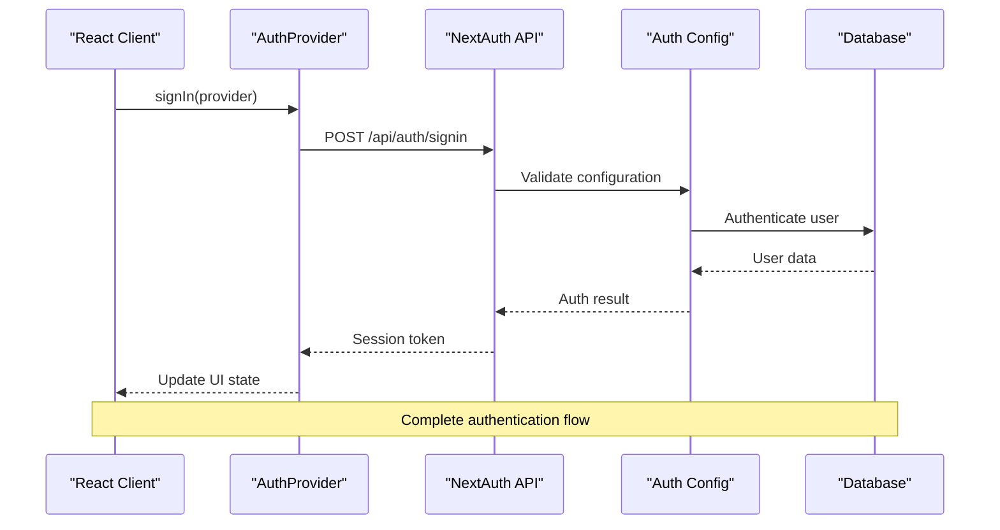
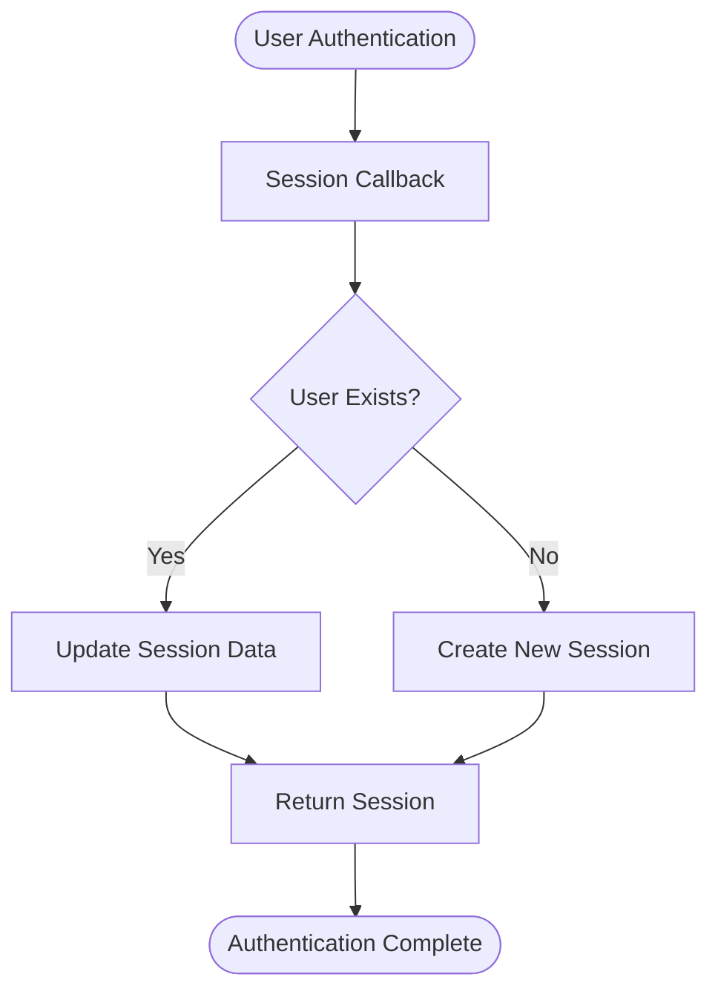
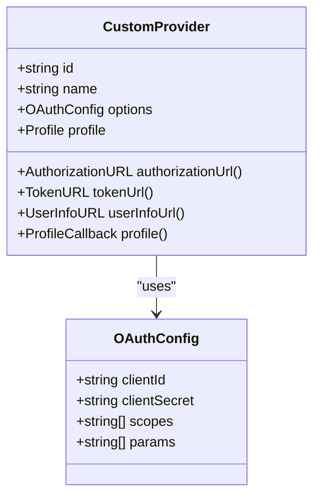
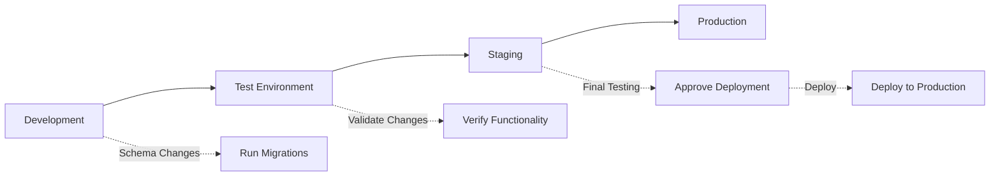
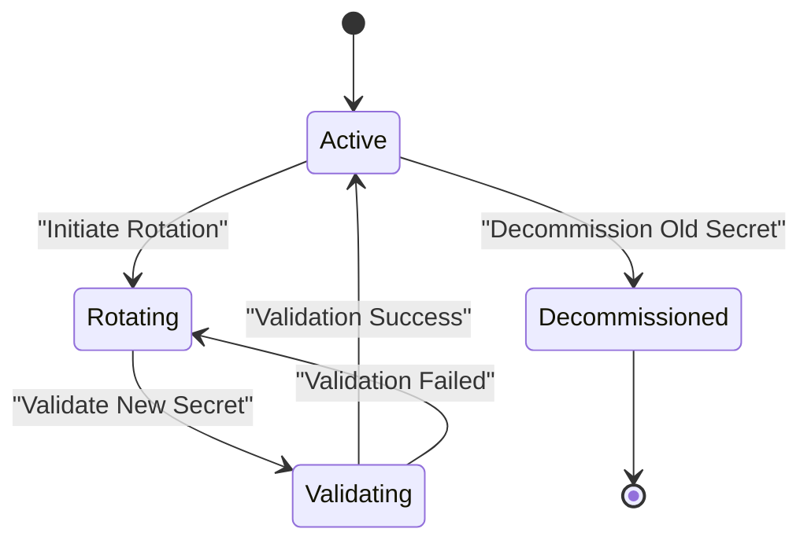

# NextAuth.js Configuration

<cite>
**Referenced Files in This Document**
- [auth.ts](file://src/auth.ts)
- [auth.config.ts](file://src/auth.config.ts)
- [route.ts](file://src/app/api/auth/[...nextauth]/route.ts)
- [auth-provider.tsx](file://src/components/auth-provider.tsx)
- [next-auth.d.ts](file://src/types/next-auth.d.ts)
</cite>

## Table of Contents
1. [Introduction](#introduction)
2. [Project Structure](#project-structure)
3. [Core Components](#core-components)
4. [Architecture Overview](#architecture-overview)
5. [Detailed Component Analysis](#detailed-component-analysis)
6. [Authentication Providers Setup](#authentication-providers-setup)
7. [Database Connection Configuration](#database-connection-configuration)
8. [Session Management Options](#session-management-options)
9. [Security Settings and Best Practices](#security-settings-and-best-practices)
10. [Environment Variables and Secret Management](#environment-variables-and-secret-management)
11. [Production Deployment Considerations](#production-deployment-considerations)
12. [Troubleshooting Guide](#troubleshooting-guide)
13. [Conclusion](#conclusion)

## Introduction

This document provides comprehensive guidance for configuring NextAuth.js v5 in the dashboard system. NextAuth.js is a complete open-source authentication solution for Next.js applications that supports multiple authentication providers, session management, and database integration. The configuration covers authentication provider setup, database connections, session strategies, security settings, and production deployment considerations.

## Project Structure

The authentication system follows Next.js App Router conventions with a modular architecture:

```mermaid
graph TB
subgraph "Authentication Layer"
A[auth.ts] --> B[auth.config.ts]
C[route.ts] --> A
D[auth-provider.tsx] --> A
end
subgraph "API Routes"
E[api/auth/[...nextauth]] --> C
end
subgraph "Type Definitions"
F[next-auth.d.ts] --> A
end
subgraph "Components"
G[Sign In Page] --> D
H[Protected Routes] --> D
end
E --> G
E --> H
```

**Diagram sources**
- [auth.ts:1-50](file://src/auth.ts#L1-L50)
- [auth.config.ts:1-50](file://src/auth.config.ts#L1-L50)
- [route.ts:1-30](file://src/app/api/auth/[...nextauth]/route.ts#L1-L30)
- [auth-provider.tsx:1-40](file://src/components/auth-provider.tsx#L1-L40)

**Section sources**
- [auth.ts:1-100](file://src/auth.ts#L1-L100)
- [auth.config.ts:1-100](file://src/auth.config.ts#L1-L100)
- [route.ts:1-50](file://src/app/api/auth/[...nextauth]/route.ts#L1-L50)

## Core Components

The NextAuth.js configuration consists of several key components working together:

### Main Authentication Module (`auth.ts`)
The primary authentication module exports the main auth handler and configuration. It serves as the central point for all authentication logic and provider setup.

### Configuration File (`auth.config.ts`)
Contains the core authentication configuration including providers, callbacks, events, and security settings. This file is imported by the main auth module.

### API Route Handler (`route.ts`)
Implements the NextAuth.js API endpoint using the catch-all route pattern `[...nextauth]`. This handles all authentication-related HTTP requests.

### React Provider (`auth-provider.tsx`)
Provides authentication context to React components, enabling client-side access to user sessions and authentication state.

### Type Definitions (`next-auth.d.ts`)
Extends NextAuth.js TypeScript types to include custom user data and session properties.

**Section sources**
- [auth.ts:1-150](file://src/auth.ts#L1-L150)
- [auth.config.ts:1-200](file://src/auth.config.ts#L1-L200)
- [route.ts:1-80](file://src/app/api/auth/[...nextauth]/route.ts#L1-L80)
- [auth-provider.tsx:1-100](file://src/components/auth-provider.tsx#L1-L100)
- [next-auth.d.ts:1-50](file://src/types/next-auth.d.ts#L1-L50)

## Architecture Overview

The authentication architecture follows a layered approach with clear separation of concerns:



**Diagram sources**
- [auth-provider.tsx:20-80](file://src/components/auth-provider.tsx#L20-L80)
- [route.ts:10-60](file://src/app/api/auth/[...nextauth]/route.ts#L10-L60)
- [auth.config.ts:50-150](file://src/auth.config.ts#L50-L150)

## Detailed Component Analysis

### Authentication Configuration Structure

The authentication configuration is structured to support multiple providers and customization points:

#### Core Configuration Options
- **Providers**: Array of authentication providers (Google, GitHub, Email, etc.)
- **Callbacks**: Functions to customize session and JWT handling
- **Events**: Hooks for authentication lifecycle events
- **Security**: Cookie settings, secret management, and HTTPS configuration
- **Database**: Database connection and adapter configuration

#### Callbacks Implementation
Callbacks allow customization of authentication behavior at key points:



**Diagram sources**
- [auth.config.ts:80-120](file://src/auth.config.ts#L80-L120)

**Section sources**
- [auth.config.ts:1-200](file://src/auth.config.ts#L1-L200)

### Session Management Strategies

NextAuth.js supports two primary session strategies:

#### JWT Strategy
- Stateless authentication using JSON Web Tokens
- Better scalability for distributed systems
- Token encryption and signing options
- Custom claims and payload manipulation

#### Database Strategy  
- Server-side session storage
- Real-time session updates
- Built-in session persistence
- Enhanced security through server-side validation

#### Session Configuration Options
- **Strategy Selection**: Choose between JWT and database strategies
- **Cookie Configuration**: Domain, path, secure flags, and expiration
- **Token Encryption**: Encryption algorithms and key management
- **Session Duration**: Maximum age and update intervals

**Section sources**
- [auth.config.ts:120-180](file://src/auth.config.ts#L120-L180)
- [auth.ts:50-120](file://src/auth.ts#L50-L120)

## Authentication Providers Setup

### Google Authentication Provider

To add Google authentication, configure the Google provider with OAuth credentials:

#### Required Environment Variables
- `GOOGLE_CLIENT_ID`: Google OAuth client ID
- `GOOGLE_CLIENT_SECRET`: Google OAuth client secret

#### Configuration Steps
1. Enable Google+ API in Google Cloud Console
2. Create OAuth 2.0 credentials
3. Configure authorized redirect URIs
4. Add environment variables to your application

### GitHub Authentication Provider

GitHub authentication requires GitHub OAuth app setup:

#### Required Environment Variables
- `GITHUB_CLIENT_ID`: GitHub OAuth client ID
- `GITHUB_CLIENT_SECRET`: GitHub OAuth client secret

#### Configuration Steps
1. Create a GitHub OAuth application
2. Set homepage URL and callback URL
3. Generate client secret
4. Configure repository permissions if needed

### Email-Based Authentication

For email-based authentication without password storage:

#### Required Dependencies
- `@auth/core` or compatible email adapter
- SMTP service configuration

#### Configuration Options
- **Email Adapter**: Database adapter for storing verification tokens
- **SMTP Configuration**: Mail server settings
- **Email Templates**: Custom email content and styling
- **Verification Flow**: Automatic or manual email verification

### Custom Provider Implementation

For custom authentication providers:



**Diagram sources**
- [auth.config.ts:150-200](file://src/auth.config.ts#L150-L200)

**Section sources**
- [auth.config.ts:1-200](file://src/auth.config.ts#L1-L200)

## Database Connection Configuration

### Supported Database Adapters

NextAuth.js supports multiple database adapters:

#### Prisma Adapter
- Type-safe database operations
- Schema migration support
- Integration with Prisma ORM
- Automatic model generation

#### Drizzle Adapter
- Lightweight database toolkit
- SQL-like query building
- TypeScript-first development
- Performance optimization

#### Native Adapters
- Direct database connections
- Custom query implementations
- Legacy database support
- Specialized database features

### Database Configuration Options

#### Connection Settings
- **Connection String**: Database URI with credentials
- **SSL Configuration**: Secure connections for production
- **Connection Pooling**: Connection reuse and scaling
- **Timeout Settings**: Request and connection timeouts

#### Schema Requirements
- **User Model**: User account information
- **Account Model**: Provider-specific account data
- **Session Model**: Session storage (for database strategy)
- **Verification Token**: Email verification tokens

### Database Migration Strategy



**Diagram sources**
- [auth.config.ts:180-220](file://src/auth.config.ts#L180-L220)

**Section sources**
- [auth.config.ts:180-250](file://src/auth.config.ts#L180-L250)

## Session Management Options

### JWT vs Database Strategy Comparison

| Feature | JWT Strategy | Database Strategy |
|---------|-------------|-------------------|
| **Scalability** | High - Stateless | Medium - Requires DB |
| **Performance** | Fast - No DB calls | Slower - DB queries |
| **Security** | Encrypted tokens | Server-side validation |
| **Customization** | Token manipulation | Full session control |
| **Complexity** | Simple setup | More configuration |
| **Use Case** | Microservices, APIs | Traditional web apps |

### Session Configuration Examples

#### JWT Strategy Configuration
- **Secret Management**: Environment-based secrets
- **Token Expiration**: Configurable session duration
- **Encryption**: AES-256-GCM encryption
- **Custom Claims**: Additional user data in tokens

#### Database Strategy Configuration
- **Session Storage**: Database table structure
- **Cleanup Jobs**: Automatic session expiration
- **Real-time Updates**: WebSocket integration
- **Backup Strategy**: Session data backup procedures

### Cookie Configuration

#### Security Settings
- **Secure Flag**: HTTPS-only cookies
- **HttpOnly Flag**: JavaScript access prevention
- **SameSite Policy**: CSRF protection
- **Domain Scoping**: Subdomain restrictions

#### Performance Optimization
- **Compression**: Minimized cookie size
- **Caching**: Browser cache utilization
- **Lazy Loading**: Deferred cookie setting
- **Split Cookies**: Large data distribution

**Section sources**
- [auth.config.ts:200-300](file://src/auth.config.ts#L200-L300)
- [auth.ts:100-200](file://src/auth.ts#L100-L200)

## Security Settings and Best Practices

### Secret Management

#### Environment Variable Organization
- **Development Secrets**: Local development keys
- **Staging Secrets**: Pre-production testing keys
- **Production Secrets**: Live environment keys
- **Rotation Policies**: Regular secret updates

#### Encryption Standards
- **Algorithm Selection**: Industry-standard encryption
- **Key Length**: Minimum recommended key sizes
- **Hash Functions**: Secure hashing algorithms
- **Salt Generation**: Random salt creation

### Security Headers and Policies

#### CORS Configuration
- **Allowed Origins**: Specific domain whitelisting
- **Methods Restriction**: HTTP method limitations
- **Headers Control**: Custom header policies
- **Credentials Handling**: Secure credential transmission

#### Rate Limiting and Protection
- **Login Attempts**: Brute force protection
- **API Rate Limits**: Request throttling
- **IP Blacklisting**: Suspicious activity blocking
- **CAPTCHA Integration**: Bot protection

### Audit and Monitoring

#### Logging Strategy
- **Authentication Events**: Login/logout tracking
- **Error Logging**: Failed authentication attempts
- **Performance Metrics**: Response time monitoring
- **Security Alerts**: Anomaly detection

**Section sources**
- [auth.config.ts:250-350](file://src/auth.config.ts#L250-L350)

## Environment Variables and Secret Management

### Required Environment Variables

#### Core Authentication Variables
- `AUTH_SECRET`: Main encryption secret for sessions and tokens
- `AUTH_URL`: Base URL for authentication endpoints
- `AUTH_TRUST_PROXY`: Proxy trust configuration

#### Provider-Specific Variables
- **Google**: `GOOGLE_CLIENT_ID`, `GOOGLE_CLIENT_SECRET`
- **GitHub**: `GITHUB_CLIENT_ID`, `GITHUB_CLIENT_SECRET`
- **Email**: `SMTP_HOST`, `SMTP_PORT`, `SMTP_USER`, `SMTP_PASS`

#### Database Connection Variables
- **Prisma**: `DATABASE_URL`
- **MongoDB**: `MONGODB_URI`
- **PostgreSQL**: `POSTGRES_URL`, `POSTGRES_USER`, `POSTGRES_PASSWORD`

### Environment Variable Organization

#### Development Environment
- Local development secrets
- Debug logging enabled
- Mock services for external dependencies
- Relaxed security policies

#### Staging Environment
- Production-like configuration
- External service integration
- Performance testing setup
- Security scanning enabled

#### Production Environment
- Encrypted secret management
- Load balancer configuration
- CDN integration
- Monitoring and alerting

### Secret Rotation Strategy



**Diagram sources**
- [auth.config.ts:300-400](file://src/auth.config.ts#L300-L400)

**Section sources**
- [auth.config.ts:300-450](file://src/auth.config.ts#L300-L450)

## Production Deployment Considerations

### Infrastructure Requirements

#### Server Configuration
- **Node.js Version**: Compatible runtime version
- **Memory Allocation**: Adequate heap space for sessions
- **File Descriptors**: Sufficient limits for concurrent connections
- **Process Manager**: PM2 or similar process management

#### Database Requirements
- **Connection Pooling**: Optimized connection management
- **Backup Strategy**: Automated database backups
- **Monitoring**: Performance and health monitoring
- **Scaling**: Horizontal scaling capabilities

### Performance Optimization

#### Caching Strategy
- **Session Caching**: Redis or in-memory caching
- **Static Asset Caching**: CDN integration
- **Database Query Caching**: Query result caching
- **Response Caching**: HTTP response caching

#### Load Balancing
- **Session Affinity**: Sticky sessions when needed
- **Health Checks**: Service availability monitoring
- **Graceful Degradation**: Fallback mechanisms
- **Auto-scaling**: Dynamic resource allocation

### Monitoring and Maintenance

#### Health Monitoring
- **Service Health**: Endpoint availability checks
- **Performance Metrics**: Response times and throughput
- **Error Tracking**: Exception and error monitoring
- **Business Metrics**: User authentication metrics

#### Maintenance Procedures
- **Regular Updates**: Dependency and security updates
- **Log Rotation**: Log file management
- **Certificate Renewal**: SSL/TLS certificate management
- **Backup Verification**: Data integrity verification

**Section sources**
- [auth.config.ts:400-500](file://src/auth.config.ts#L400-L500)

## Troubleshooting Guide

### Common Configuration Issues

#### Authentication Failures
- **Invalid Credentials**: Verify provider credentials
- **Redirect URI Mismatch**: Check callback URL configuration
- **CORS Errors**: Configure allowed origins properly
- **CSP Violations**: Update Content Security Policy

#### Session Problems
- **Session Loss**: Check cookie configuration and domain settings
- **Token Expiration**: Review token lifetime settings
- **Cross-domain Issues**: Configure proper domain settings
- **Memory Leaks**: Monitor session cleanup processes

#### Database Connection Issues
- **Connection Timeouts**: Adjust timeout configurations
- **Permission Errors**: Verify database user permissions
- **Schema Mismatches**: Run database migrations
- **Connection Pool Exhaustion**: Increase pool size limits

### Debugging Techniques

#### Logging Configuration
- **Verbose Logging**: Enable detailed authentication logs
- **Request Tracing**: Track authentication request flows
- **Error Context**: Include relevant context in error messages
- **Performance Profiling**: Identify performance bottlenecks

#### Development Tools
- **Browser DevTools**: Inspect cookies and local storage
- **Network Tab**: Analyze authentication requests
- **Console Logs**: Review client-side authentication logs
- **Server Logs**: Monitor backend authentication processing

### Recovery Procedures

#### Emergency Reset
- **Session Cleanup**: Clear corrupted sessions
- **Token Regeneration**: Force token refresh
- **User Account Reset**: Administrative account recovery
- **Configuration Rollback**: Revert recent changes

**Section sources**
- [auth.config.ts:450-550](file://src/auth.config.ts#L450-L550)

## Conclusion

This documentation provides a comprehensive guide to implementing NextAuth.js v5 in the dashboard system. The configuration supports multiple authentication providers, flexible session management, and robust security practices suitable for production deployments. By following the outlined best practices and configuration patterns, developers can implement secure, scalable authentication solutions that meet modern web application requirements.

The modular architecture allows for easy customization and extension, while the comprehensive security measures ensure protection against common authentication vulnerabilities. Proper environment variable management and production deployment considerations help maintain application reliability and security across different environments.