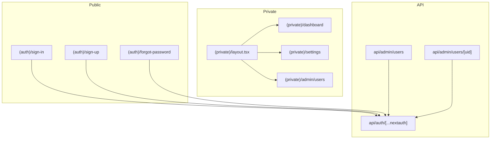
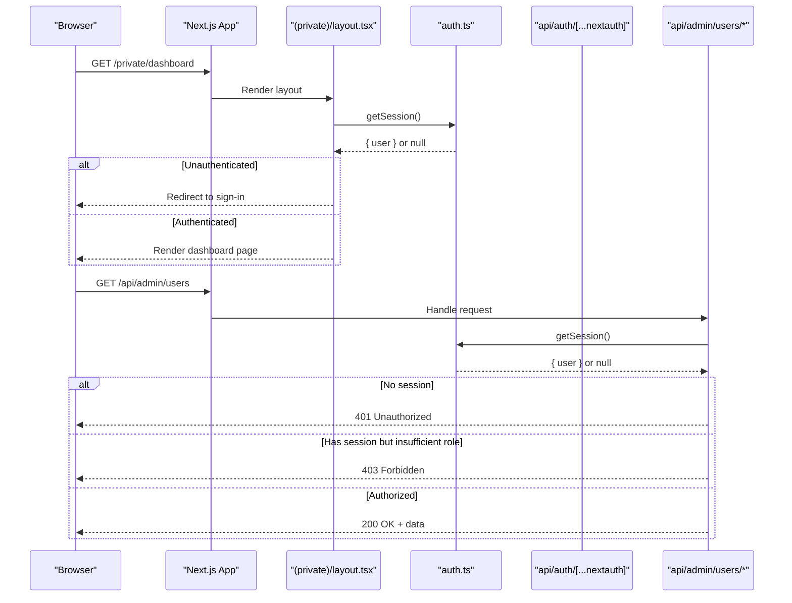
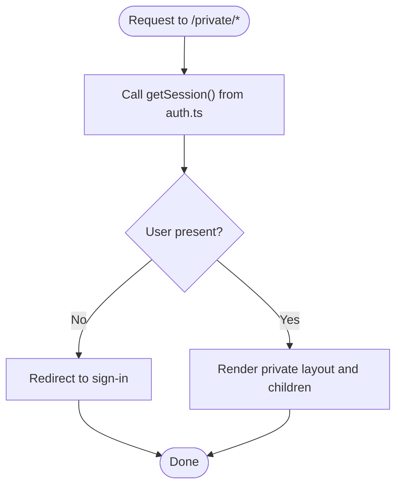
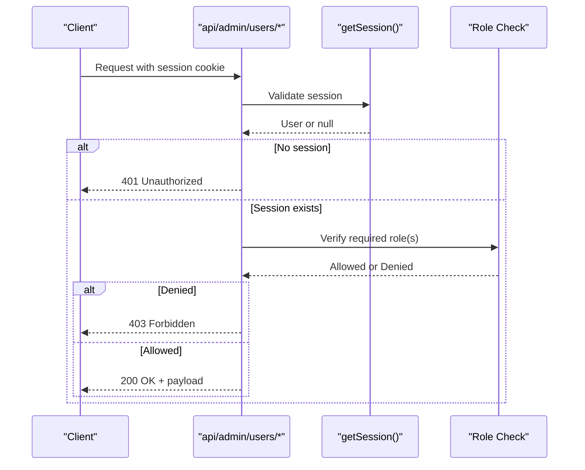
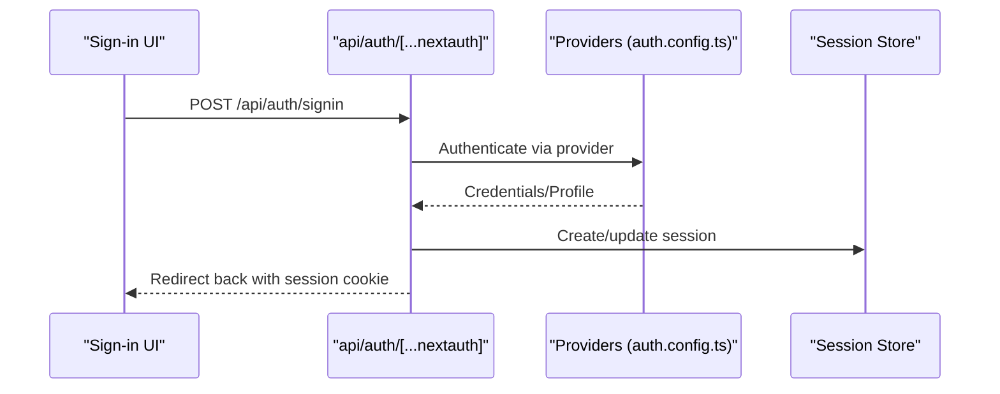
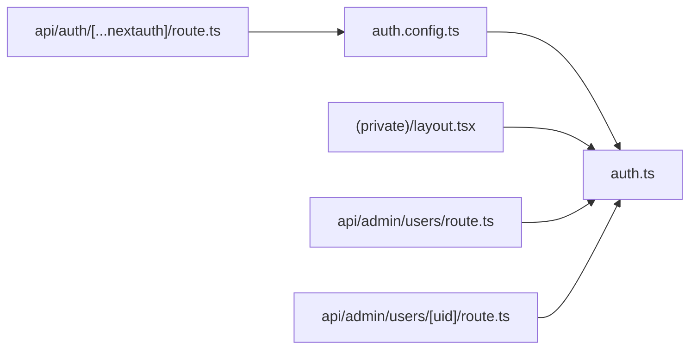

# Protected Routes & Middleware

<cite>
**Referenced Files in This Document**
- [auth.config.ts](file://src/auth.config.ts)
- [auth.ts](file://src/auth.ts)
- [layout.tsx](file://src/app/(private)/layout.tsx)
- [page.tsx](file://src/app/(private)/dashboard/page.tsx)
- [route.ts](file://src/app/api/auth/[...nextauth]/route.ts)
- [route.ts](file://src/app/api/admin/users/route.ts)
- [route.ts](file://src/app/api/admin/users/[uid]/route.ts)
- [unauthorized-error.tsx](file://src/app/(auth)/errors/unauthorized/components/unauthorized-error.tsx)
- [forbidden-error.tsx](file://src/app/(auth)/errors/forbidden/components/forbidden-error.tsx)
</cite>

## Table of Contents
1. [Introduction](#introduction)
2. [Project Structure](#project-structure)
3. [Core Components](#core-components)
4. [Architecture Overview](#architecture-overview)
5. [Detailed Component Analysis](#detailed-component-analysis)
6. [Dependency Analysis](#dependency-analysis)
7. [Performance Considerations](#performance-considerations)
8. [Troubleshooting Guide](#troubleshooting-guide)
9. [Conclusion](#conclusion)

## Introduction
This document explains how protected routes and middleware are implemented in the Next.js application. It covers:
- Route groups for organizing public and private routes
- Server-side authentication checks using NextAuth
- Client-side navigation guards within layouts
- API route protection and role-based decisions
- Redirect logic for unauthorized access
- Performance considerations, caching strategies, and error handling patterns

The goal is to provide a clear, actionable guide for securing both pages and API endpoints while maintaining good performance and user experience.

## Project Structure
Protected areas are organized using Next.js route groups:
- Public routes under (auth)
- Private routes under (private)
- API routes under api with specific admin endpoints

**Diagram sources**
- [layout.tsx](file://src/app/(private)/layout.tsx)
- [page.tsx](file://src/app/(private)/dashboard/page.tsx)
- [route.ts](file://src/app/api/auth/[...nextauth]/route.ts)
- [route.ts](file://src/app/api/admin/users/route.ts)
- [route.ts](file://src/app/api/admin/users/[uid]/route.ts)

**Section sources**
- [layout.tsx](file://src/app/(private)/layout.tsx)
- [page.tsx](file://src/app/(private)/dashboard/page.tsx)
- [route.ts](file://src/app/api/auth/[...nextauth]/route.ts)
- [route.ts](file://src/app/api/admin/users/route.ts)
- [route.ts](file://src/app/api/admin/users/[uid]/route.ts)

## Core Components
- Authentication configuration and session utilities
  - auth.config.ts: Provider configuration and callbacks
  - auth.ts: Session helpers and server-side session retrieval
- Private layout guard
  - (private)/layout.tsx: Server-side check that enforces authentication before rendering private content
- API route handlers
  - api/auth/[...nextauth]/route.ts: NextAuth handler
  - api/admin/users/route.ts and [uid]/route.ts: Admin endpoints that require authentication and possibly roles
- Error pages
  - Unauthorized and Forbidden error components for consistent UX

Key responsibilities:
- Centralize auth config and session helpers
- Enforce authentication at the layout level for all private routes
- Protect API endpoints by validating sessions and roles
- Provide clear error responses and redirect flows

**Section sources**
- [auth.config.ts](file://src/auth.config.ts)
- [auth.ts](file://src/auth.ts)
- [layout.tsx](file://src/app/(private)/layout.tsx)
- [route.ts](file://src/app/api/auth/[...nextauth]/route.ts)
- [route.ts](file://src/app/api/admin/users/route.ts)
- [route.ts](file://src/app/api/admin/users/[uid]/route.ts)
- [unauthorized-error.tsx](file://src/app/(auth)/errors/unauthorized/components/unauthorized-error.tsx)
- [forbidden-error.tsx](file://src/app/(auth)/errors/forbidden/components/forbidden-error.tsx)

## Architecture Overview
The security model combines server-side checks with client-side guards:
- NextAuth handles session creation and validation
- The private layout performs a server-side session check and redirects unauthenticated users
- API routes validate sessions and enforce role-based access control
- Dedicated error pages handle unauthorized and forbidden states

**Diagram sources**
- [layout.tsx](file://src/app/(private)/layout.tsx)
- [auth.ts](file://src/auth.ts)
- [route.ts](file://src/app/api/auth/[...nextauth]/route.ts)
- [route.ts](file://src/app/api/admin/users/route.ts)
- [route.ts](file://src/app/api/admin/users/[uid]/route.ts)

## Detailed Component Analysis

### Authentication Configuration and Session Utilities
- auth.config.ts defines providers and callback behavior used by NextAuth
- auth.ts exports session helpers such as getSession for server-side checks and may include role-checking utilities

Implementation notes:
- Use getSession in server components and server actions to avoid exposing sensitive checks on the client
- Centralize role checks in reusable functions to keep API handlers concise

**Section sources**
- [auth.config.ts](file://src/auth.config.ts)
- [auth.ts](file://src/auth.ts)

### Private Layout Guard
The private layout ensures only authenticated users can access protected routes. It performs a server-side session check and redirects to sign-in when needed.

**Diagram sources**
- [layout.tsx](file://src/app/(private)/layout.tsx)
- [auth.ts](file://src/auth.ts)

**Section sources**
- [layout.tsx](file://src/app/(private)/layout.tsx)
- [auth.ts](file://src/auth.ts)

### API Route Protection and Role-Based Decisions
Admin endpoints validate sessions and enforce roles before serving data.

**Diagram sources**
- [route.ts](file://src/app/api/admin/users/route.ts)
- [route.ts](file://src/app/api/admin/users/[uid]/route.ts)
- [auth.ts](file://src/auth.ts)

**Section sources**
- [route.ts](file://src/app/api/admin/users/route.ts)
- [route.ts](file://src/app/api/admin/users/[uid]/route.ts)
- [auth.ts](file://src/auth.ts)

### NextAuth Handler
The catch-all auth route wires up NextAuth for sign-in, sign-out, and session management.

**Diagram sources**
- [route.ts](file://src/app/api/auth/[...nextauth]/route.ts)
- [auth.config.ts](file://src/auth.config.ts)

**Section sources**
- [route.ts](file://src/app/api/auth/[...nextauth]/route.ts)
- [auth.config.ts](file://src/auth.config.ts)

### Error Handling Pages
Dedicated error pages improve UX for unauthorized and forbidden scenarios:
- Unauthorized: When no valid session exists
- Forbidden: When session exists but lacks required permissions

These components can be rendered directly or returned as responses from API handlers.

**Section sources**
- [unauthorized-error.tsx](file://src/app/(auth)/errors/unauthorized/components/unauthorized-error.tsx)
- [forbidden-error.tsx](file://src/app/(auth)/errors/forbidden/components/forbidden-error.tsx)

## Dependency Analysis
High-level dependencies among core security components:

**Diagram sources**
- [auth.config.ts](file://src/auth.config.ts)
- [auth.ts](file://src/auth.ts)
- [layout.tsx](file://src/app/(private)/layout.tsx)
- [route.ts](file://src/app/api/admin/users/route.ts)
- [route.ts](file://src/app/api/admin/users/[uid]/route.ts)
- [route.ts](file://src/app/api/auth/[...nextauth]/route.ts)

**Section sources**
- [auth.config.ts](file://src/auth.config.ts)
- [auth.ts](file://src/auth.ts)
- [layout.tsx](file://src/app/(private)/layout.tsx)
- [route.ts](file://src/app/api/admin/users/route.ts)
- [route.ts](file://src/app/api/admin/users/[uid]/route.ts)
- [route.ts](file://src/app/api/auth/[...nextauth]/route.ts)

## Performance Considerations
- Prefer server-side session checks in layouts and API handlers to minimize client-side overhead and reduce race conditions
- Cache expensive operations (e.g., fetching user roles) where appropriate using Next.js caching primitives; ensure cache keys incorporate user identity and versioning to prevent stale data
- Avoid redundant session reads by reusing getSession results within a single request lifecycle
- Keep redirect logic lightweight; perform redirects early in the request pipeline to avoid unnecessary rendering
- For large datasets behind protected routes, consider pagination and server-side filtering to reduce payload size after successful authorization

[No sources needed since this section provides general guidance]

## Troubleshooting Guide
Common issues and resolutions:
- Redirect loops between private routes and sign-in
  - Ensure the private layout checks the session correctly and redirects only when necessary
  - Verify that the sign-in flow sets the session cookie properly
- 401 Unauthorized on API calls
  - Confirm that requests include the session cookie and that getSession returns a valid user
- 403 Forbidden despite being logged in
  - Review role checks in admin API handlers; ensure the user’s roles match the required permissions
- Inconsistent UI state after login/logout
  - Invalidate any client-side caches and refetch protected data after authentication changes

**Section sources**
- [layout.tsx](file://src/app/(private)/layout.tsx)
- [route.ts](file://src/app/api/admin/users/route.ts)
- [route.ts](file://src/app/api/admin/users/[uid]/route.ts)
- [unauthorized-error.tsx](file://src/app/(auth)/errors/unauthorized/components/unauthorized-error.tsx)
- [forbidden-error.tsx](file://src/app/(auth)/errors/forbidden/components/forbidden-error.tsx)

## Conclusion
By combining NextAuth with a private layout guard and robust API route protection, the application enforces secure access consistently across pages and endpoints. Centralized session utilities and dedicated error pages streamline implementation and improve maintainability. Following the performance and troubleshooting recommendations will help keep the system fast, reliable, and user-friendly.