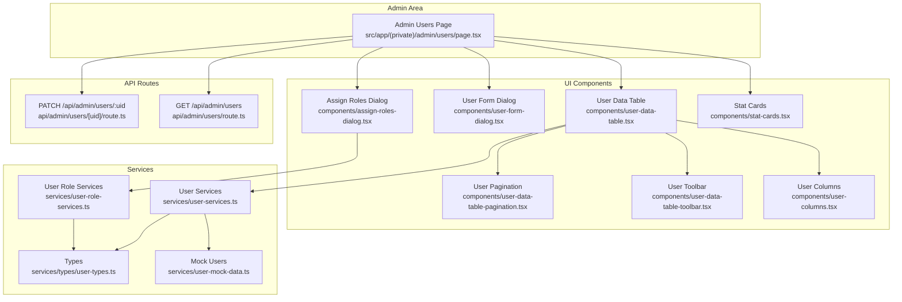
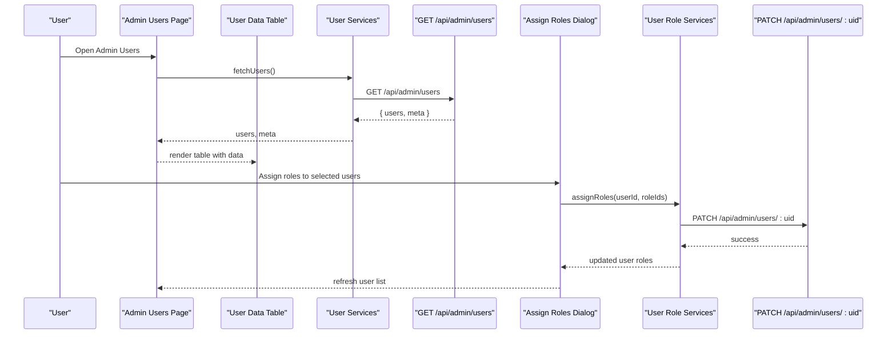
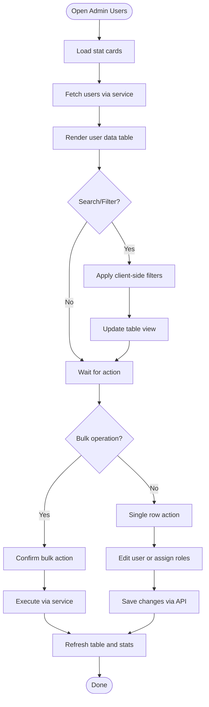
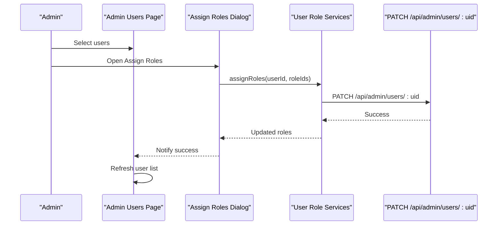
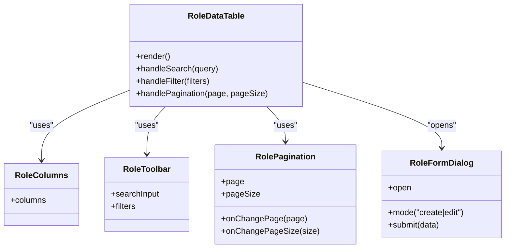
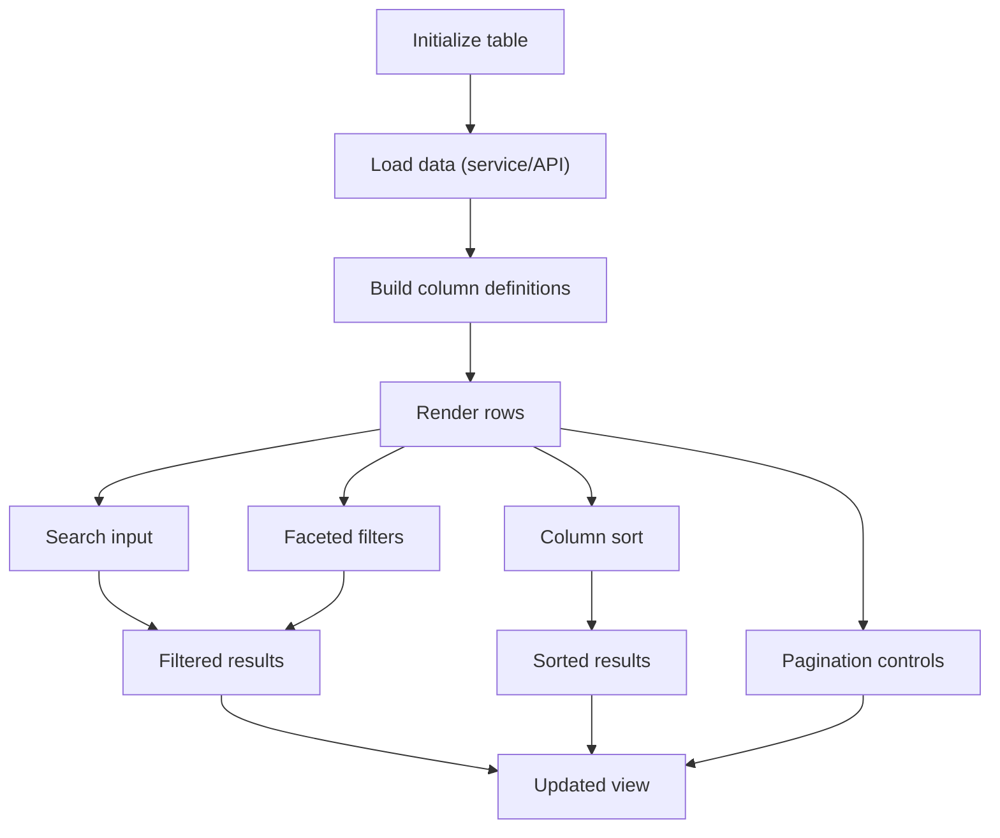
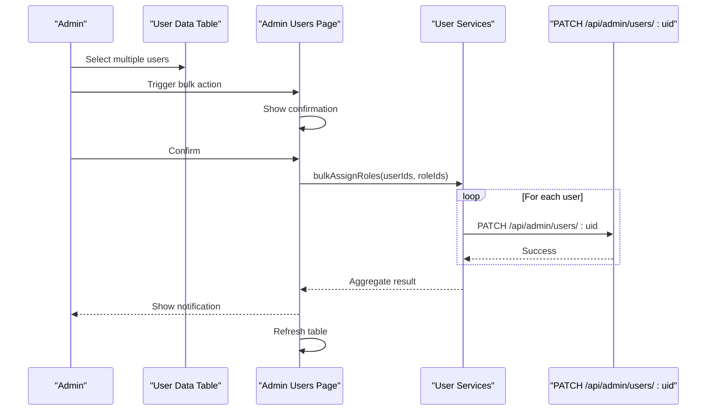
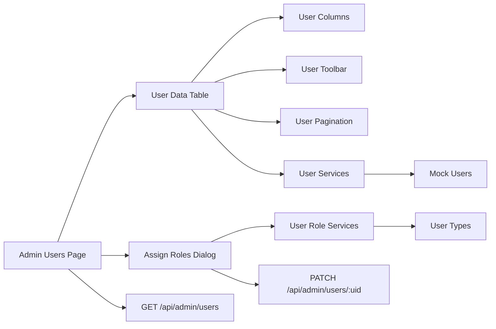
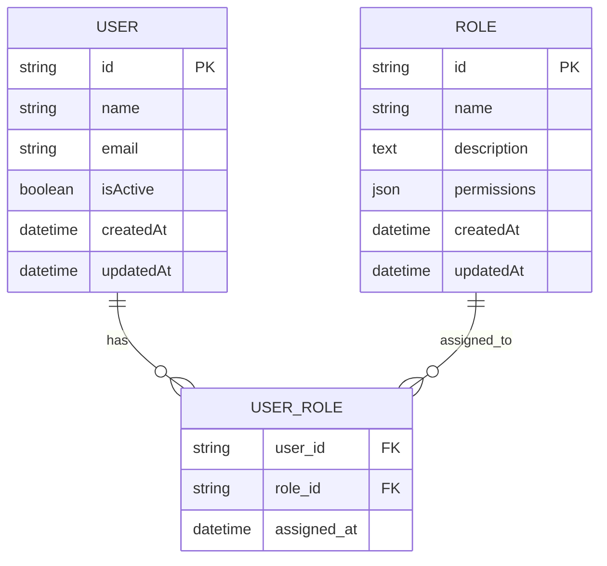

# Admin Interface & Role Management

<cite>
**Referenced Files in This Document**
- [src/app/(private)/admin/users/page.tsx](file://src/app/(private)/admin/users/page.tsx)
- [src/app/api/admin/users/route.ts](file://src/app/api/admin/users/route.ts)
- [src/app/api/admin/users/[uid]/route.ts](file://src/app/api/admin/users/[uid]/route.ts)
- [src/modules/users/components/user-data-table.tsx](file://src/modules/users/components/user-data-table.tsx)
- [src/modules/users/components/user-columns.tsx](file://src/modules/users/components/user-columns.tsx)
- [src/modules/users/components/user-data-table-toolbar.tsx](file://src/modules/users/components/user-data-table-toolbar.tsx)
- [src/modules/users/components/user-data-table-pagination.tsx](file://src/modules/users/components/user-data-table-pagination.tsx)
- [src/modules/users/components/user-form-dialog.tsx](file://src/modules/users/components/user-form-dialog.tsx)
- [src/modules/users/components/assign-roles-dialog.tsx](file://src/modules/users/components/assign-roles-dialog.tsx)
- [src/modules/users/components/stat-cards.tsx](file://src/modules/users/components/stat-cards.tsx)
- [src/modules/users/services/user-services.ts](file://src/modules/users/services/user-services.ts)
- [src/modules/users/services/user-role-services.ts](file://src/modules/users/services/user-role-services.ts)
- [src/modules/users/services/user-mock-data.ts](file://src/modules/users/services/user-mock-data.ts)
- [src/modules/users/services/types/user-types.ts](file://src/modules/users/services/types/user-types.ts)
- [src/modules/users/components/role-data-table.tsx](file://src/modules/users/components/role-data-table.tsx)
- [src/modules/users/components/role-columns.tsx](file://src/modules/users/components/role-columns.tsx)
- [src/modules/users/components/role-data-table-toolbar.tsx](file://src/modules/users/components/role-data-table-toolbar.tsx)
- [src/modules/users/components/role-data-table-pagination.tsx](file://src/modules/users/components/role-data-table-pagination.tsx)
- [src/modules/users/components/role-form-dialog.tsx](file://src/modules/users/components/role-form-dialog.tsx)
- [src/modules/users/services/role-services.ts](file://src/modules/users/services/role-services.ts)
- [src/modules/users/services/role-mock-data.ts](file://src/modules/users/services/role-mock-data.ts)
- [src/modules/users/services/data/users.json](file://src/modules/users/services/data/users.json)
- [src/modules/users/services/data/roles.json](file://src/modules/users/services/data/roles.json)
- [src/modules/users/services/data/users-roles.json](file://src/modules/users/services/data/users-roles.json)
</cite>

## Table of Contents
1. [Introduction](#introduction)
2. [Project Structure](#project-structure)
3. [Core Components](#core-components)
4. [Architecture Overview](#architecture-overview)
5. [Detailed Component Analysis](#detailed-component-analysis)
6. [Dependency Analysis](#dependency-analysis)
7. [Performance Considerations](#performance-considerations)
8. [Troubleshooting Guide](#troubleshooting-guide)
9. [Conclusion](#conclusion)
10. [Appendices](#appendices)

## Introduction
This document explains the admin interface and role management features, focusing on:
- User administration dashboard for listing, searching, filtering, and paginating users
- Role assignment dialogs and bulk operations
- Data table implementations for users and roles with search, filter, and pagination
- Role assignment workflow and permission editing capabilities
- Audit logging considerations
- Extensibility patterns for new role types, custom user actions, and external user management integrations

The implementation is organized under a Next.js app router structure with feature modules for users and roles, API routes for server-side operations, and reusable UI components for data tables and dialogs.

## Project Structure
The admin area is implemented as a private route that renders a user administration page. The page composes multiple components to provide:
- A summary view (stat cards)
- A searchable, filterable, and paginated user data table
- Dialogs for creating/editing users and assigning roles
- Server APIs for CRUD and role assignments

**Diagram sources**
- [src/app/(private)/admin/users/page.tsx](file://src/app/(private)/admin/users/page.tsx)
- [src/modules/users/components/user-data-table.tsx](file://src/modules/users/components/user-data-table.tsx)
- [src/modules/users/components/user-columns.tsx](file://src/modules/users/components/user-columns.tsx)
- [src/modules/users/components/user-data-table-toolbar.tsx](file://src/modules/users/components/user-data-table-toolbar.tsx)
- [src/modules/users/components/user-data-table-pagination.tsx](file://src/modules/users/components/user-data-table-pagination.tsx)
- [src/modules/users/components/user-form-dialog.tsx](file://src/modules/users/components/user-form-dialog.tsx)
- [src/modules/users/components/assign-roles-dialog.tsx](file://src/modules/users/components/assign-roles-dialog.tsx)
- [src/modules/users/services/user-services.ts](file://src/modules/users/services/user-services.ts)
- [src/modules/users/services/user-role-services.ts](file://src/modules/users/services/user-role-services.ts)
- [src/modules/users/services/user-mock-data.ts](file://src/modules/users/services/user-mock-data.ts)
- [src/modules/users/services/types/user-types.ts](file://src/modules/users/services/types/user-types.ts)
- [src/app/api/admin/users/route.ts](file://src/app/api/admin/users/route.ts)
- [src/app/api/admin/users/[uid]/route.ts](file://src/app/api/admin/users/[uid]/route.ts)

**Section sources**
- [src/app/(private)/admin/users/page.tsx](file://src/app/(private)/admin/users/page.tsx)
- [src/modules/users/components/user-data-table.tsx](file://src/modules/users/components/user-data-table.tsx)
- [src/modules/users/components/user-columns.tsx](file://src/modules/users/components/user-columns.tsx)
- [src/modules/users/components/user-data-table-toolbar.tsx](file://src/modules/users/components/user-data-table-toolbar.tsx)
- [src/modules/users/components/user-data-table-pagination.tsx](file://src/modules/users/components/user-data-table-pagination.tsx)
- [src/modules/users/components/user-form-dialog.tsx](file://src/modules/users/components/user-form-dialog.tsx)
- [src/modules/users/components/assign-roles-dialog.tsx](file://src/modules/users/components/assign-roles-dialog.tsx)
- [src/modules/users/services/user-services.ts](file://src/modules/users/services/user-services.ts)
- [src/modules/users/services/user-role-services.ts](file://src/modules/users/services/user-role-services.ts)
- [src/modules/users/services/user-mock-data.ts](file://src/modules/users/services/user-mock-data.ts)
- [src/modules/users/services/types/user-types.ts](file://src/modules/users/services/types/user-types.ts)
- [src/app/api/admin/users/route.ts](file://src/app/api/admin/users/route.ts)
- [src/app/api/admin/users/[uid]/route.ts](file://src/app/api/admin/users/[uid]/route.ts)

## Core Components
- Admin Users Page: Orchestrates state for users, roles, selection, and dialog visibility; wires up data fetching and mutations via services and API routes.
- User Data Table: Displays users with sorting, filtering, and pagination; supports row selection for bulk operations.
- User Columns: Defines columns such as name, email, status, and actions.
- User Toolbar: Provides search input and filters (e.g., by role or status).
- User Pagination: Controls page size and current page.
- User Form Dialog: Create and edit user details.
- Assign Roles Dialog: Assign or remove roles from selected users.
- Stat Cards: Summary metrics (e.g., total users, active users).

Key responsibilities:
- State management for list, selection, and filters
- Client-side search/filter/pagination where appropriate
- Server calls for create/update/delete and role assignments
- Validation and error feedback via dialogs and toast notifications

**Section sources**
- [src/app/(private)/admin/users/page.tsx](file://src/app/(private)/admin/users/page.tsx)
- [src/modules/users/components/user-data-table.tsx](file://src/modules/users/components/user-data-table.tsx)
- [src/modules/users/components/user-columns.tsx](file://src/modules/users/components/user-columns.tsx)
- [src/modules/users/components/user-data-table-toolbar.tsx](file://src/modules/users/components/user-data-table-toolbar.tsx)
- [src/modules/users/components/user-data-table-pagination.tsx](file://src/modules/users/components/user-data-table-pagination.tsx)
- [src/modules/users/components/user-form-dialog.tsx](file://src/modules/users/components/user-form-dialog.tsx)
- [src/modules/users/components/assign-roles-dialog.tsx](file://src/modules/users/components/assign-roles-dialog.tsx)
- [src/modules/users/components/stat-cards.tsx](file://src/modules/users/components/stat-cards.tsx)

## Architecture Overview
The admin interface follows a layered architecture:
- Presentation layer: React components for tables, dialogs, and stats
- Service layer: Encapsulates data access and business logic
- API layer: Next.js API routes handling persistence and authorization checks

**Diagram sources**
- [src/app/(private)/admin/users/page.tsx](file://src/app/(private)/admin/users/page.tsx)
- [src/modules/users/components/user-data-table.tsx](file://src/modules/users/components/user-data-table.tsx)
- [src/modules/users/components/assign-roles-dialog.tsx](file://src/modules/users/components/assign-roles-dialog.tsx)
- [src/modules/users/services/user-services.ts](file://src/modules/users/services/user-services.ts)
- [src/modules/users/services/user-role-services.ts](file://src/modules/users/services/user-role-services.ts)
- [src/app/api/admin/users/route.ts](file://src/app/api/admin/users/route.ts)
- [src/app/api/admin/users/[uid]/route.ts](file://src/app/api/admin/users/[uid]/route.ts)

## Detailed Component Analysis

### User Administration Dashboard
- Purpose: Provide an overview and management surface for users.
- Features:
  - Stat cards showing key metrics
  - Searchable, filterable, sortable, and paginated user table
  - Row selection for bulk operations
  - Dialogs for creating/editing users and assigning roles

**Diagram sources**
- [src/app/(private)/admin/users/page.tsx](file://src/app/(private)/admin/users/page.tsx)
- [src/modules/users/components/user-data-table.tsx](file://src/modules/users/components/user-data-table.tsx)
- [src/modules/users/components/user-data-table-toolbar.tsx](file://src/modules/users/components/user-data-table-toolbar.tsx)
- [src/modules/users/components/user-data-table-pagination.tsx](file://src/modules/users/components/user-data-table-pagination.tsx)
- [src/modules/users/components/user-form-dialog.tsx](file://src/modules/users/components/user-form-dialog.tsx)
- [src/modules/users/components/assign-roles-dialog.tsx](file://src/modules/users/components/assign-roles-dialog.tsx)
- [src/modules/users/services/user-services.ts](file://src/modules/users/services/user-services.ts)

**Section sources**
- [src/app/(private)/admin/users/page.tsx](file://src/app/(private)/admin/users/page.tsx)
- [src/modules/users/components/stat-cards.tsx](file://src/modules/users/components/stat-cards.tsx)
- [src/modules/users/components/user-data-table.tsx](file://src/modules/users/components/user-data-table.tsx)
- [src/modules/users/components/user-data-table-toolbar.tsx](file://src/modules/users/components/user-data-table-toolbar.tsx)
- [src/modules/users/components/user-data-table-pagination.tsx](file://src/modules/users/components/user-data-table-pagination.tsx)
- [src/modules/users/components/user-form-dialog.tsx](file://src/modules/users/components/user-form-dialog.tsx)
- [src/modules/users/components/assign-roles-dialog.tsx](file://src/modules/users/components/assign-roles-dialog.tsx)
- [src/modules/users/services/user-services.ts](file://src/modules/users/services/user-services.ts)

### Role Assignment Workflow
- Purpose: Allow administrators to assign or remove roles from one or more users.
- Flow:
  - Select users in the table
  - Open Assign Roles dialog
  - Choose roles to add/remove
  - Submit changes via role services and API
  - Refresh user list and update stats

**Diagram sources**
- [src/modules/users/components/assign-roles-dialog.tsx](file://src/modules/users/components/assign-roles-dialog.tsx)
- [src/modules/users/services/user-role-services.ts](file://src/modules/users/services/user-role-services.ts)
- [src/app/api/admin/users/[uid]/route.ts](file://src/app/api/admin/users/[uid]/route.ts)

**Section sources**
- [src/modules/users/components/assign-roles-dialog.tsx](file://src/modules/users/components/assign-roles-dialog.tsx)
- [src/modules/users/services/user-role-services.ts](file://src/modules/users/services/user-role-services.ts)
- [src/app/api/admin/users/[uid]/route.ts](file://src/app/api/admin/users/[uid]/route.ts)

### Permission Editing Capabilities
- Purpose: Manage role permissions through a role management interface.
- Components:
  - Role data table for listing roles
  - Role form dialog for creating/editing roles and their permissions
  - Role toolbar for search and filters
  - Role pagination for navigation

**Diagram sources**
- [src/modules/users/components/role-data-table.tsx](file://src/modules/users/components/role-data-table.tsx)
- [src/modules/users/components/role-columns.tsx](file://src/modules/users/components/role-columns.tsx)
- [src/modules/users/components/role-data-table-toolbar.tsx](file://src/modules/users/components/role-data-table-toolbar.tsx)
- [src/modules/users/components/role-data-table-pagination.tsx](file://src/modules/users/components/role-data-table-pagination.tsx)
- [src/modules/users/components/role-form-dialog.tsx](file://src/modules/users/components/role-form-dialog.tsx)

**Section sources**
- [src/modules/users/components/role-data-table.tsx](file://src/modules/users/components/role-data-table.tsx)
- [src/modules/users/components/role-columns.tsx](file://src/modules/users/components/role-columns.tsx)
- [src/modules/users/components/role-data-table-toolbar.tsx](file://src/modules/users/components/role-data-table-toolbar.tsx)
- [src/modules/users/components/role-data-table-pagination.tsx](file://src/modules/users/components/role-data-table-pagination.tsx)
- [src/modules/users/components/role-form-dialog.tsx](file://src/modules/users/components/role-form-dialog.tsx)

### Data Tables: Search, Filtering, and Pagination
- User Data Table:
  - Columns defined in user columns component
  - Toolbar provides search input and filters
  - Pagination controls page size and current page
  - Supports row selection for bulk operations
- Role Data Table:
  - Similar structure with role-specific columns and form dialog

**Diagram sources**
- [src/modules/users/components/user-data-table.tsx](file://src/modules/users/components/user-data-table.tsx)
- [src/modules/users/components/user-columns.tsx](file://src/modules/users/components/user-columns.tsx)
- [src/modules/users/components/user-data-table-toolbar.tsx](file://src/modules/users/components/user-data-table-toolbar.tsx)
- [src/modules/users/components/user-data-table-pagination.tsx](file://src/modules/users/components/user-data-table-pagination.tsx)
- [src/modules/users/components/role-data-table.tsx](file://src/modules/users/components/role-data-table.tsx)
- [src/modules/users/components/role-columns.tsx](file://src/modules/users/components/role-columns.tsx)
- [src/modules/users/components/role-data-table-toolbar.tsx](file://src/modules/users/components/role-data-table-toolbar.tsx)
- [src/modules/users/components/role-data-table-pagination.tsx](file://src/modules/users/components/role-data-table-pagination.tsx)

**Section sources**
- [src/modules/users/components/user-data-table.tsx](file://src/modules/users/components/user-data-table.tsx)
- [src/modules/users/components/user-columns.tsx](file://src/modules/users/components/user-columns.tsx)
- [src/modules/users/components/user-data-table-toolbar.tsx](file://src/modules/users/components/user-data-table-toolbar.tsx)
- [src/modules/users/components/user-data-table-pagination.tsx](file://src/modules/users/components/user-data-table-pagination.tsx)
- [src/modules/users/components/role-data-table.tsx](file://src/modules/users/components/role-data-table.tsx)
- [src/modules/users/components/role-columns.tsx](file://src/modules/users/components/role-columns.tsx)
- [src/modules/users/components/role-data-table-toolbar.tsx](file://src/modules/users/components/role-data-table-toolbar.tsx)
- [src/modules/users/components/role-data-table-pagination.tsx](file://src/modules/users/components/role-data-table-pagination.tsx)

### Bulk Operations
- Selection: Multi-select rows in the user table
- Actions: Common bulk actions include assigning/removing roles, updating status
- Confirmation: Show confirmation dialog before executing bulk changes
- Execution: Call service methods to apply changes across selected items
- Feedback: Display success/error messages and refresh affected views

**Diagram sources**
- [src/modules/users/components/user-data-table.tsx](file://src/modules/users/components/user-data-table.tsx)
- [src/app/(private)/admin/users/page.tsx](file://src/app/(private)/admin/users/page.tsx)
- [src/modules/users/services/user-services.ts](file://src/modules/users/services/user-services.ts)
- [src/app/api/admin/users/[uid]/route.ts](file://src/app/api/admin/users/[uid]/route.ts)

**Section sources**
- [src/modules/users/components/user-data-table.tsx](file://src/modules/users/components/user-data-table.tsx)
- [src/app/(private)/admin/users/page.tsx](file://src/app/(private)/admin/users/page.tsx)
- [src/modules/users/services/user-services.ts](file://src/modules/users/services/user-services.ts)
- [src/app/api/admin/users/[uid]/route.ts](file://src/app/api/admin/users/[uid]/route.ts)

### Audit Logging Considerations
- Recommended approach:
  - Log role assignment events at the API layer
  - Include actor identity, target user IDs, role IDs, timestamp, and outcome
  - Persist logs to a secure store and expose read-only endpoints for audit review
- Implementation guidance:
  - Add middleware in API routes to capture mutation requests
  - Enforce authorization checks before logging sensitive actions
  - Provide an audit log viewer in the admin area (future extension)

[No sources needed since this section provides general guidance]

## Dependency Analysis
The following diagram shows how components depend on services and API routes:

**Diagram sources**
- [src/app/(private)/admin/users/page.tsx](file://src/app/(private)/admin/users/page.tsx)
- [src/modules/users/components/user-data-table.tsx](file://src/modules/users/components/user-data-table.tsx)
- [src/modules/users/components/user-columns.tsx](file://src/modules/users/components/user-columns.tsx)
- [src/modules/users/components/user-data-table-toolbar.tsx](file://src/modules/users/components/user-data-table-toolbar.tsx)
- [src/modules/users/components/user-data-table-pagination.tsx](file://src/modules/users/components/user-data-table-pagination.tsx)
- [src/modules/users/components/assign-roles-dialog.tsx](file://src/modules/users/components/assign-roles-dialog.tsx)
- [src/modules/users/services/user-services.ts](file://src/modules/users/services/user-services.ts)
- [src/modules/users/services/user-role-services.ts](file://src/modules/users/services/user-role-services.ts)
- [src/modules/users/services/user-mock-data.ts](file://src/modules/users/services/user-mock-data.ts)
- [src/modules/users/services/types/user-types.ts](file://src/modules/users/services/types/user-types.ts)
- [src/app/api/admin/users/route.ts](file://src/app/api/admin/users/route.ts)
- [src/app/api/admin/users/[uid]/route.ts](file://src/app/api/admin/users/[uid]/route.ts)

**Section sources**
- [src/app/(private)/admin/users/page.tsx](file://src/app/(private)/admin/users/page.tsx)
- [src/modules/users/components/user-data-table.tsx](file://src/modules/users/components/user-data-table.tsx)
- [src/modules/users/components/user-columns.tsx](file://src/modules/users/components/user-columns.tsx)
- [src/modules/users/components/user-data-table-toolbar.tsx](file://src/modules/users/components/user-data-table-toolbar.tsx)
- [src/modules/users/components/user-data-table-pagination.tsx](file://src/modules/users/components/user-data-table-pagination.tsx)
- [src/modules/users/components/assign-roles-dialog.tsx](file://src/modules/users/components/assign-roles-dialog.tsx)
- [src/modules/users/services/user-services.ts](file://src/modules/users/services/user-services.ts)
- [src/modules/users/services/user-role-services.ts](file://src/modules/users/services/user-role-services.ts)
- [src/modules/users/services/user-mock-data.ts](file://src/modules/users/services/user-mock-data.ts)
- [src/modules/users/services/types/user-types.ts](file://src/modules/users/services/types/user-types.ts)
- [src/app/api/admin/users/route.ts](file://src/app/api/admin/users/route.ts)
- [src/app/api/admin/users/[uid]/route.ts](file://src/app/api/admin/users/[uid]/route.ts)

## Performance Considerations
- Prefer server-side pagination and filtering for large datasets
- Debounce search inputs to reduce unnecessary re-renders
- Use memoization for expensive computations (e.g., filtered lists)
- Minimize re-fetches by caching responses and invalidating on mutations
- Avoid heavy client-side processing; offload to API when possible

[No sources needed since this section provides general guidance]

## Troubleshooting Guide
Common issues and resolutions:
- Data not loading:
  - Verify API route availability and network requests
  - Check service method parameters and error handling
- Search/filter not working:
  - Ensure filter keys match data shape
  - Validate client-side vs server-side filtering boundaries
- Pagination incorrect:
  - Confirm page size and offset calculations
  - Check API response metadata for total counts
- Role assignment fails:
  - Inspect PATCH endpoint behavior and payload
  - Validate user ID and role IDs format
- UI not refreshing after mutations:
  - Ensure optimistic updates are rolled back on failure
  - Re-fetch or invalidate cache after successful mutations

**Section sources**
- [src/app/api/admin/users/route.ts](file://src/app/api/admin/users/route.ts)
- [src/app/api/admin/users/[uid]/route.ts](file://src/app/api/admin/users/[uid]/route.ts)
- [src/modules/users/services/user-services.ts](file://src/modules/users/services/user-services.ts)
- [src/modules/users/services/user-role-services.ts](file://src/modules/users/services/user-role-services.ts)

## Conclusion
The admin interface provides a robust foundation for user and role management with clear separation between presentation, services, and API layers. It supports essential administrative workflows including search, filtering, pagination, role assignment, and bulk operations. Extensibility points exist for adding new role types, custom user actions, and integrating with external user management systems.

[No sources needed since this section summarizes without analyzing specific files]

## Appendices

### Extending the Admin Interface
- New role types:
  - Extend role schema and form fields
  - Add role-specific permission toggles in the role form dialog
  - Update role columns and filters accordingly
- Custom user actions:
  - Add new buttons in the user table row actions
  - Implement corresponding service methods and API endpoints
  - Integrate confirmation dialogs and notifications
- External user management integration:
  - Replace mock data with real backend calls
  - Implement synchronization strategies for user and role data
  - Handle authentication and authorization at the API layer

**Section sources**
- [src/modules/users/components/role-form-dialog.tsx](file://src/modules/users/components/role-form-dialog.tsx)
- [src/modules/users/components/user-columns.tsx](file://src/modules/users/components/user-columns.tsx)
- [src/modules/users/services/user-services.ts](file://src/modules/users/services/user-services.ts)
- [src/modules/users/services/role-services.ts](file://src/modules/users/services/role-services.ts)
- [src/app/api/admin/users/route.ts](file://src/app/api/admin/users/route.ts)
- [src/app/api/admin/users/[uid]/route.ts](file://src/app/api/admin/users/[uid]/route.ts)

### Data Models
The following entities are used across the admin interface:

**Diagram sources**
- [src/modules/users/services/types/user-types.ts](file://src/modules/users/services/types/user-types.ts)
- [src/modules/users/services/data/users.json](file://src/modules/users/services/data/users.json)
- [src/modules/users/services/data/roles.json](file://src/modules/users/services/data/roles.json)
- [src/modules/users/services/data/users-roles.json](file://src/modules/users/services/data/users-roles.json)