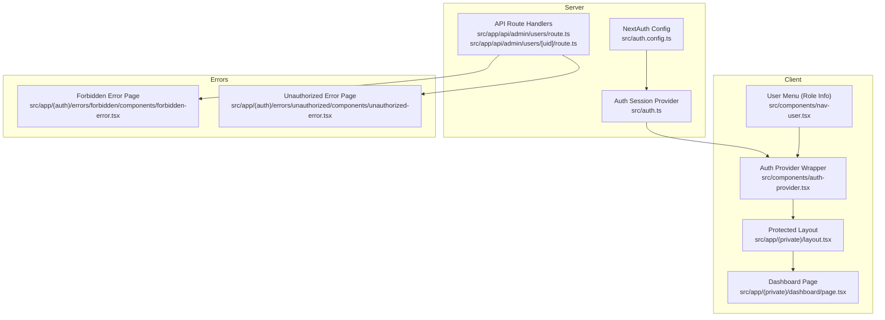
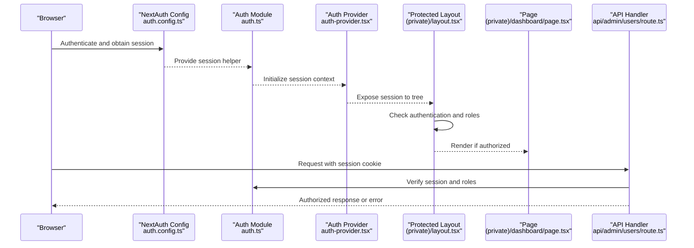
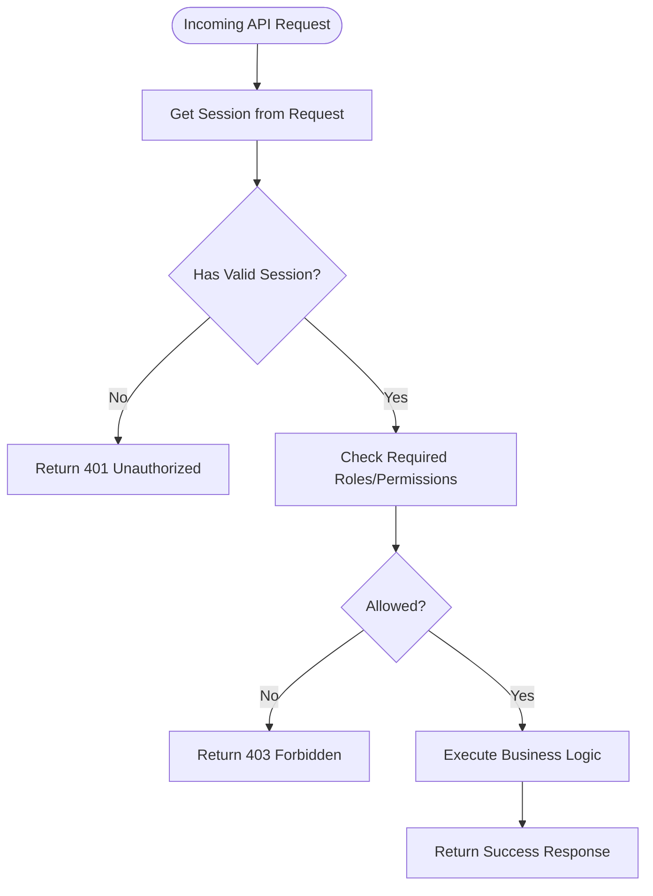
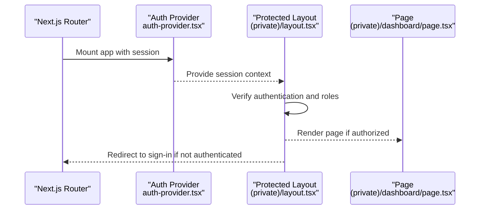
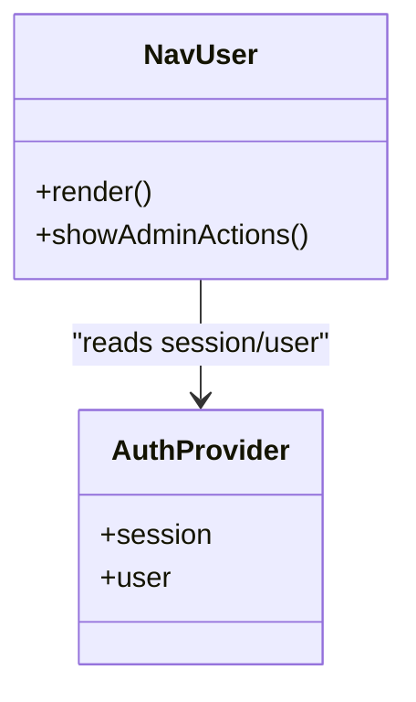
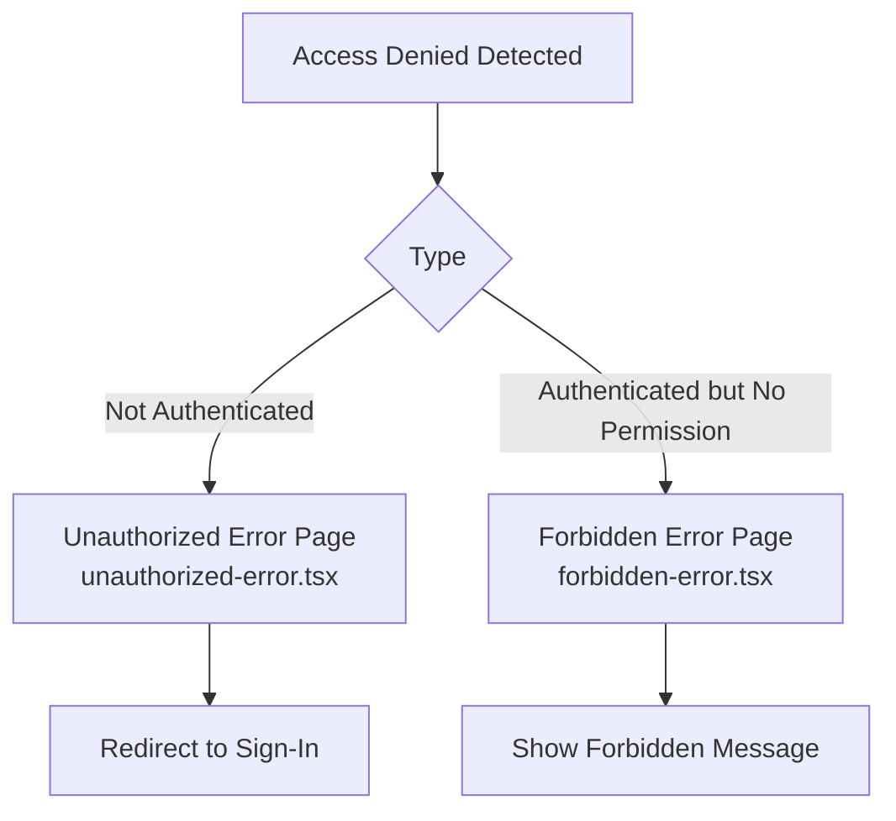
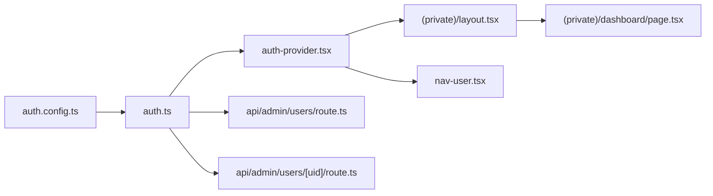

# Permission System & Authorization Logic

<cite>
**Referenced Files in This Document**
- [auth.ts](file://src/auth.ts)
- [auth.config.ts](file://src/auth.config.ts)
- [next-auth.d.ts](file://src/types/next-auth.d.ts)
- [layout.tsx](file://src/app/(private)/layout.tsx)
- [page.tsx](file://src/app/(private)/dashboard/page.tsx)
- [route.ts](file://src/app/api/admin/users/route.ts)
- [route.ts](file://src/app/api/admin/users/[uid]/route.ts)
- [auth-provider.tsx](file://src/components/auth-provider.tsx)
- [nav-user.tsx](file://src/components/nav-user.tsx)
- [forbidden-error.tsx](file://src/app/(auth)/errors/forbidden/components/forbidden-error.tsx)
- [unauthorized-error.tsx](file://src/app/(auth)/errors/unauthorized/components/unauthorized-error.tsx)
</cite>

## Table of Contents
1. [Introduction](#introduction)
2. [Project Structure](#project-structure)
3. [Core Components](#core-components)
4. [Architecture Overview](#architecture-overview)
5. [Detailed Component Analysis](#detailed-component-analysis)
6. [Dependency Analysis](#dependency-analysis)
7. [Performance Considerations](#performance-considerations)
8. [Troubleshooting Guide](#troubleshooting-guide)
9. [Conclusion](#conclusion)

## Introduction
This document explains the permission system and authorization logic across client and server boundaries. It covers how permissions are evaluated, checked, and enforced; how routes and components are protected using hooks and higher-order patterns; and how server-side middleware enforces access control on API endpoints. It also provides guidance for implementing custom permission checks, protecting routes, handling unauthorized access, and optimizing performance with caching strategies.

## Project Structure
The authorization surface spans:
- Server-side NextAuth configuration and route handlers
- Client-side session provider and UI integration
- Protected route groups and pages
- Error pages for forbidden and unauthorized states

**Diagram sources**
- [auth.config.ts](file://src/auth.config.ts)
- [auth.ts](file://src/auth.ts)
- [auth-provider.tsx](file://src/components/auth-provider.tsx)
- [layout.tsx](file://src/app/(private)/layout.tsx)
- [page.tsx](file://src/app/(private)/dashboard/page.tsx)
- [route.ts](file://src/app/api/admin/users/route.ts)
- [route.ts](file://src/app/api/admin/users/[uid]/route.ts)
- [forbidden-error.tsx](file://src/app/(auth)/errors/forbidden/components/forbidden-error.tsx)
- [unauthorized-error.tsx](file://src/app/(auth)/errors/unauthorized/components/unauthorized-error.tsx)

**Section sources**
- [auth.config.ts](file://src/auth.config.ts)
- [auth.ts](file://src/auth.ts)
- [auth-provider.tsx](file://src/components/auth-provider.tsx)
- [layout.tsx](file://src/app/(private)/layout.tsx)
- [page.tsx](file://src/app/(private)/dashboard/page.tsx)
- [route.ts](file://src/app/api/admin/users/route.ts)
- [route.ts](file://src/app/api/admin/users/[uid]/route.ts)
- [forbidden-error.tsx](file://src/app/(auth)/errors/forbidden/components/forbidden-error.tsx)
- [unauthorized-error.tsx](file://src/app/(auth)/errors/unauthorized/components/unauthorized-error.tsx)

## Core Components
- Authentication configuration and session management:
  - NextAuth configuration defines providers, callbacks, and session shape.
  - The auth module exports helpers to read the current session and user context.
- Client-side session provider:
  - Wraps the application to expose session data via React context.
- Protected layout:
  - Enforces authentication at the route group level and can gate features based on roles or permissions.
- API route handlers:
  - Validate sessions and enforce role-based access before processing requests.
- UI integration:
  - User menu displays role information and may conditionally render admin-only actions.
- Error pages:
  - Dedicated pages for forbidden and unauthorized scenarios.

**Section sources**
- [auth.config.ts](file://src/auth.config.ts)
- [auth.ts](file://src/auth.ts)
- [auth-provider.tsx](file://src/components/auth-provider.tsx)
- [layout.tsx](file://src/app/(private)/layout.tsx)
- [page.tsx](file://src/app/(private)/dashboard/page.tsx)
- [route.ts](file://src/app/api/admin/users/route.ts)
- [route.ts](file://src/app/api/admin/users/[uid]/route.ts)
- [nav-user.tsx](file://src/components/nav-user.tsx)
- [forbidden-error.tsx](file://src/app/(auth)/errors/forbidden/components/forbidden-error.tsx)
- [unauthorized-error.tsx](file://src/app/(auth)/errors/unauthorized/components/unauthorized-error.tsx)

## Architecture Overview
Authorization is enforced at multiple layers:
- Server-side: NextAuth validates tokens and exposes a session object to route handlers.
- Client-side: A provider supplies session state to components; layouts guard entire route groups.
- API layer: Each route handler performs explicit authorization checks before business logic.

**Diagram sources**
- [auth.config.ts](file://src/auth.config.ts)
- [auth.ts](file://src/auth.ts)
- [auth-provider.tsx](file://src/components/auth-provider.tsx)
- [layout.tsx](file://src/app/(private)/layout.tsx)
- [page.tsx](file://src/app/(private)/dashboard/page.tsx)
- [route.ts](file://src/app/api/admin/users/route.ts)

## Detailed Component Analysis

### Server-Side Authorization (NextAuth and API Routes)
- NextAuth configuration centralizes providers, callbacks, and session augmentation.
- API route handlers validate the session and enforce role-based permissions before executing business logic. Unauthorized or forbidden responses are returned explicitly.

**Diagram sources**
- [auth.config.ts](file://src/auth.config.ts)
- [auth.ts](file://src/auth.ts)
- [route.ts](file://src/app/api/admin/users/route.ts)
- [route.ts](file://src/app/api/admin/users/[uid]/route.ts)

**Section sources**
- [auth.config.ts](file://src/auth.config.ts)
- [auth.ts](file://src/auth.ts)
- [route.ts](file://src/app/api/admin/users/route.ts)
- [route.ts](file://src/app/api/admin/users/[uid]/route.ts)

### Client-Side Protection (Provider and Protected Layout)
- The auth provider initializes the session context for the app.
- The protected layout ensures only authenticated users can access private routes and can perform additional role checks.

**Diagram sources**
- [auth-provider.tsx](file://src/components/auth-provider.tsx)
- [layout.tsx](file://src/app/(private)/layout.tsx)
- [page.tsx](file://src/app/(private)/dashboard/page.tsx)

**Section sources**
- [auth-provider.tsx](file://src/components/auth-provider.tsx)
- [layout.tsx](file://src/app/(private)/layout.tsx)
- [page.tsx](file://src/app/(private)/dashboard/page.tsx)

### UI Integration and Role Display
- The user menu component integrates with the session context to display user details and roles, enabling conditional rendering of admin-only UI elements.

**Diagram sources**
- [nav-user.tsx](file://src/components/nav-user.tsx)
- [auth-provider.tsx](file://src/components/auth-provider.tsx)

**Section sources**
- [nav-user.tsx](file://src/components/nav-user.tsx)
- [auth-provider.tsx](file://src/components/auth-provider.tsx)

### Error Handling for Unauthorized Access
- Dedicated error pages handle forbidden and unauthorized states consistently across the app.

**Diagram sources**
- [unauthorized-error.tsx](file://src/app/(auth)/errors/unauthorized/components/unauthorized-error.tsx)
- [forbidden-error.tsx](file://src/app/(auth)/errors/forbidden/components/forbidden-error.tsx)

**Section sources**
- [unauthorized-error.tsx](file://src/app/(auth)/errors/unauthorized/components/unauthorized-error.tsx)
- [forbidden-error.tsx](file://src/app/(auth)/errors/forbidden/components/forbidden-error.tsx)

## Dependency Analysis
The following diagram shows key dependencies between authorization-related modules.

**Diagram sources**
- [auth.config.ts](file://src/auth.config.ts)
- [auth.ts](file://src/auth.ts)
- [auth-provider.tsx](file://src/components/auth-provider.tsx)
- [layout.tsx](file://src/app/(private)/layout.tsx)
- [page.tsx](file://src/app/(private)/dashboard/page.tsx)
- [route.ts](file://src/app/api/admin/users/route.ts)
- [route.ts](file://src/app/api/admin/users/[uid]/route.ts)
- [nav-user.tsx](file://src/components/nav-user.tsx)

**Section sources**
- [auth.config.ts](file://src/auth.config.ts)
- [auth.ts](file://src/auth.ts)
- [auth-provider.tsx](file://src/components/auth-provider.tsx)
- [layout.tsx](file://src/app/(private)/layout.tsx)
- [page.tsx](file://src/app/(private)/dashboard/page.tsx)
- [route.ts](file://src/app/api/admin/users/route.ts)
- [route.ts](file://src/app/api/admin/users/[uid]/route.ts)
- [nav-user.tsx](file://src/components/nav-user.tsx)

## Performance Considerations
- Minimize redundant session reads:
  - Cache session-derived values in local state or React Query where appropriate.
- Avoid heavy computations in render paths:
  - Precompute permission flags during initialization or in memoized selectors.
- Prefer coarse-grained guards:
  - Use layout-level checks to short-circuit navigation early.
- Reduce network calls:
  - Reuse session cookies provided by NextAuth; avoid re-fetching user profile unless necessary.
- Debounce or throttle UI updates that depend on permission changes.

[No sources needed since this section provides general guidance]

## Troubleshooting Guide
Common issues and resolutions:
- 401 Unauthorized on API calls:
  - Ensure the request includes the session cookie and that NextAuth is configured correctly.
- 403 Forbidden despite being logged in:
  - Verify the user’s roles/permissions meet the required criteria in the route handler.
- Client-side redirect loops:
  - Confirm the protected layout redirects to the correct sign-in path when unauthenticated.
- Inconsistent UI visibility:
  - Ensure the user menu reads the same session source as other components.

**Section sources**
- [auth.config.ts](file://src/auth.config.ts)
- [auth.ts](file://src/auth.ts)
- [layout.tsx](file://src/app/(private)/layout.tsx)
- [route.ts](file://src/app/api/admin/users/route.ts)
- [nav-user.tsx](file://src/components/nav-user.tsx)

## Conclusion
The authorization system combines NextAuth for server-side session validation, a client-side provider for consistent session access, protected layouts for route-level enforcement, and explicit checks in API handlers. Error pages provide clear feedback for unauthorized and forbidden states. By applying the performance recommendations and following the implementation patterns outlined here, you can extend the system with custom permission checks, protect new routes, and maintain secure, efficient access control.