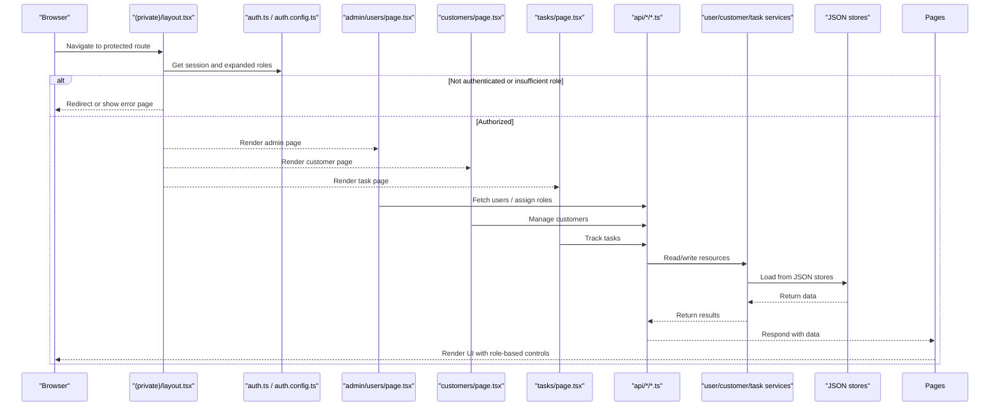
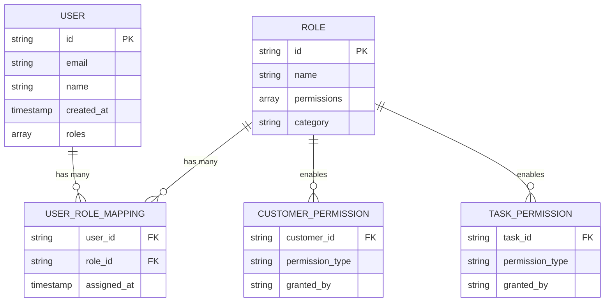
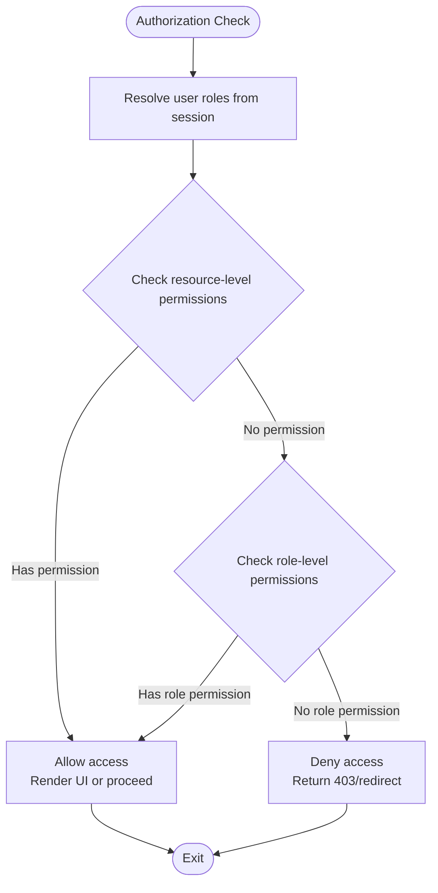
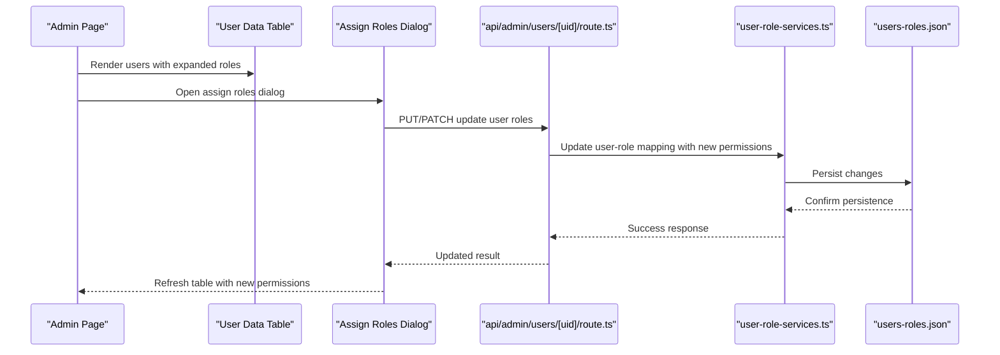
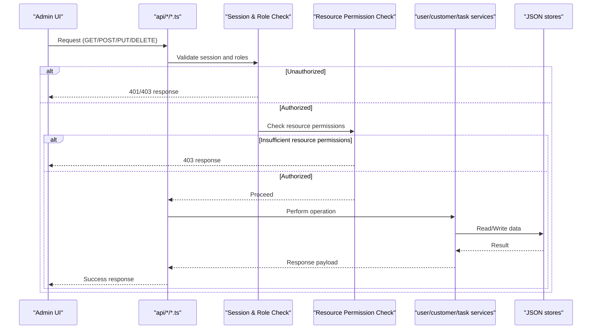
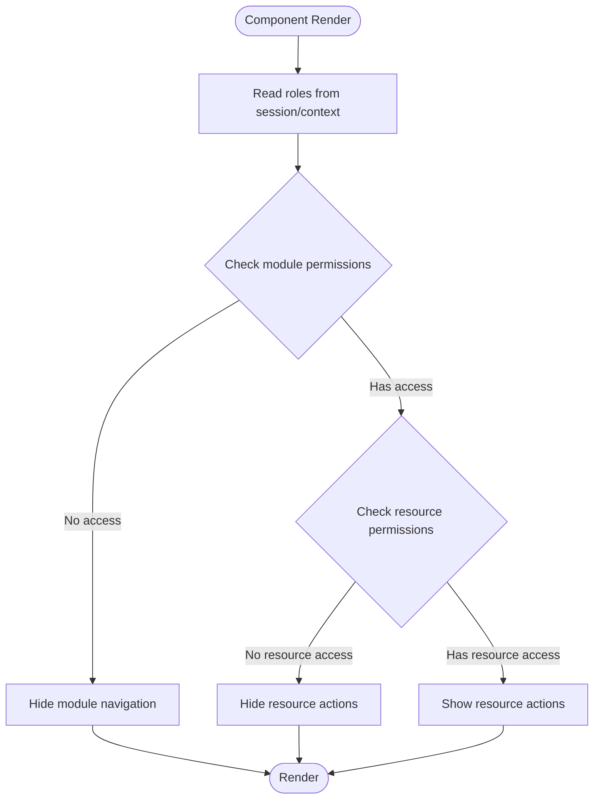
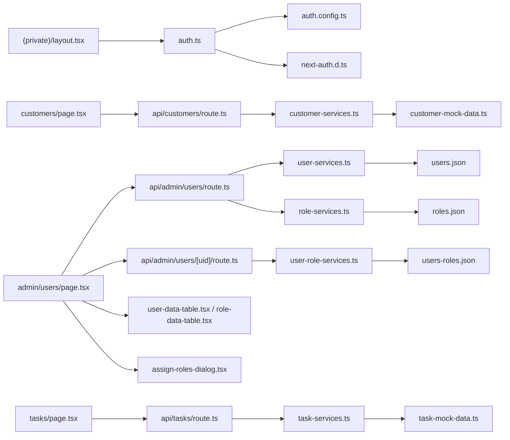

# Role-Based Access Control

<cite>
**Referenced Files in This Document**
- [auth.ts](file://src/auth.ts)
- [auth.config.ts](file://src/auth.config.ts)
- [next-auth.d.ts](file://src/types/next-auth.d.ts)
- [layout.tsx](file://src/app/(private)/layout.tsx)
- [page.tsx](file://src/app/(private)/admin/users/page.tsx)
- [route.ts](file://src/app/api/admin/users/route.ts)
- [route.ts](file://src/app/api/admin/users/[uid]/route.ts)
- [user-services.ts](file://src/modules/users/services/user-services.ts)
- [role-services.ts](file://src/modules/users/services/role-services.ts)
- [user-role-services.ts](file://src/modules/users/services/user-role-services.ts)
- [user-types.ts](file://src/modules/users/services/types/user-types.ts)
- [roles.json](file://src/modules/users/services/data/roles.json)
- [users.json](file://src/modules/users/services/data/users.json)
- [users-roles.json](file://src/modules/users/services/data/users-roles.json)
- [assign-roles-dialog.tsx](file://src/modules/users/components/assign-roles-dialog.tsx)
- [role-data-table.tsx](file://src/modules/users/components/role-data-table.tsx)
- [user-data-table.tsx](file://src/modules/users/components/user-data-table.tsx)
- [forbidden-error.tsx](file://src/app/(auth)/errors/forbidden/components/forbidden-error.tsx)
- [unauthorized-error.tsx](file://src/app/(auth)/errors/unauthorized/components/unauthorized-error.tsx)
- [customer-services.ts](file://src/modules/customers/services/customer-services.ts)
- [task-services.ts](file://src/modules/tasks/services/task-services.ts)
- [customer-mock-data.ts](file://src/modules/customers/services/customer-mock-data.ts)
- [task-mock-data.ts](file://src/modules/tasks/services/task-mock-data.ts)
</cite>

## Update Summary
**Changes Made**
- Enhanced user role definitions to support customer management and task tracking features
- Expanded permission structure with new role types for customer and task operations
- Updated authorization checks to include customer and task resource permissions
- Added new role-based access controls for customer management and task tracking modules
- Extended admin interface capabilities for managing expanded role hierarchies

## Table of Contents
1. [Introduction](#introduction)
2. [Project Structure](#project-structure)
3. [Core Components](#core-components)
4. [Architecture Overview](#architecture-overview)
5. [Detailed Component Analysis](#detailed-component-analysis)
6. [Enhanced Permission Structure](#enhanced-permission-structure)
7. [Customer Management RBAC](#customer-management-rbac)
8. [Task Tracking RBAC](#task-tracking-rbac)
9. [Dependency Analysis](#dependency-analysis)
10. [Performance Considerations](#performance-considerations)
11. [Troubleshooting Guide](#troubleshooting-guide)
12. [Conclusion](#conclusion)
13. [Appendices](#appendices)

## Introduction
This document explains the enhanced role-based access control (RBAC) system implemented in the application. The system has been updated to support expanded user role definitions and improved permission structure, specifically designed to accommodate the new customer management and task tracking features. It covers the comprehensive user and role model, hierarchical permission system, authorization checks across UI and API routes, admin interfaces for managing users and roles, bulk operations, audit logging considerations, custom authorization hooks, dynamic role changes, security implications, privilege escalation prevention, and best practices.

The enhanced RBAC design centers on:
- A session-based identity layer using NextAuth with typed session augmentation supporting extended role types.
- A server-side authorization strategy enforced at route boundaries with granular resource-level permissions.
- A client-side rendering strategy that conditionally shows UI based on current user roles and resource permissions.
- An admin area to manage users and roles with data tables, dialogs, and bulk operations.
- Mock data-backed services for roles, users, user-role mappings, customers, and tasks.
- Specialized permission structures for customer management and task tracking operations.

## Project Structure
The RBAC-related code spans authentication configuration, type augmentation, protected layout guards, admin pages, API routes, and specialized modules for users, roles, customers, and tasks. The following diagram maps key files involved in the enhanced RBAC system.

```mermaid
graph TB
subgraph "Auth"
A["auth.ts"]
B["auth.config.ts"]
C["next-auth.d.ts"]
end
subgraph "App Routes"
D["(private)/layout.tsx"]
E["(auth)/errors/forbidden/components/forbidden-error.tsx"]
F["(auth)/errors/unauthorized/components/unauthorized-error.tsx"]
G["(private)/admin/users/page.tsx"]
H["(private)/customers/page.tsx"]
I["(private)/tasks/page.tsx"]
end
subgraph "API Routes"
J["api/admin/users/route.ts"]
K["api/admin/users/[uid]/route.ts"]
L["api/customers/route.ts"]
M["api/tasks/route.ts"]
end
subgraph "Users Module"
N["modules/users/services/user-services.ts"]
O["modules/users/services/role-services.ts"]
P["modules/users/services/user-role-services.ts"]
Q["modules/users/services/types/user-types.ts"]
R["modules/users/services/data/roles.json"]
S["modules/users/services/data/users.json"]
T["modules/users/services/data/users-roles.json"]
U["modules/users/components/assign-roles-dialog.tsx"]
V["modules/users/components/role-data-table.tsx"]
W["modules/users/components/user-data-table.tsx"]
end
subgraph "Customers Module"
X["modules/customers/services/customer-services.ts"]
Y["modules/customers/services/customer-mock-data.ts"]
Z["modules/customers/services/types/customer-types.ts"]
end
subgraph "Tasks Module"
AA["modules/tasks/services/task-services.ts"]
AB["modules/tasks/services/task-mock-data.ts"]
AC["modules/tasks/services/types/task-types.ts"]
end
A --> B
A --> C
D --> A
G --> J
G --> K
H --> L
I --> M
J --> N
J --> O
J --> P
K --> N
K --> P
L --> X
M --> AA
N --> S
O --> R
P --> T
X --> Y
AA --> AB
G --> U
G --> V
G --> W
```

**Diagram sources**
- [auth.ts](file://src/auth.ts)
- [auth.config.ts](file://src/auth.config.ts)
- [next-auth.d.ts](file://src/types/next-auth.d.ts)
- [layout.tsx](file://src/app/(private)/layout.tsx)
- [forbidden-error.tsx](file://src/app/(auth)/errors/forbidden/components/forbidden-error.tsx)
- [unauthorized-error.tsx](file://src/app/(auth)/errors/unauthorized/components/unauthorized-error.tsx)
- [page.tsx](file://src/app/(private)/admin/users/page.tsx)
- [page.tsx](file://src/app/(private)/customers/page.tsx)
- [page.tsx](file://src/app/(private)/tasks/page.tsx)
- [route.ts](file://src/app/api/admin/users/route.ts)
- [route.ts](file://src/app/api/admin/users/[uid]/route.ts)
- [route.ts](file://src/app/api/customers/route.ts)
- [route.ts](file://src/app/api/tasks/route.ts)
- [user-services.ts](file://src/modules/users/services/user-services.ts)
- [role-services.ts](file://src/modules/users/services/role-services.ts)
- [user-role-services.ts](file://src/modules/users/services/user-role-services.ts)
- [user-types.ts](file://src/modules/users/services/types/user-types.ts)
- [roles.json](file://src/modules/users/services/data/roles.json)
- [users.json](file://src/modules/users/services/data/users.json)
- [users-roles.json](file://src/modules/users/services/data/users-roles.json)
- [customer-services.ts](file://src/modules/customers/services/customer-services.ts)
- [customer-mock-data.ts](file://src/modules/customers/services/customer-mock-data.ts)
- [task-services.ts](file://src/modules/tasks/services/task-services.ts)
- [task-mock-data.ts](file://src/modules/tasks/services/task-mock-data.ts)
- [assign-roles-dialog.tsx](file://src/modules/users/components/assign-roles-dialog.tsx)
- [role-data-table.tsx](file://src/modules/users/components/role-data-table.tsx)
- [user-data-table.tsx](file://src/modules/users/components/user-data-table.tsx)

**Section sources**
- [auth.ts](file://src/auth.ts)
- [auth.config.ts](file://src/auth.config.ts)
- [next-auth.d.ts](file://src/types/next-auth.d.ts)
- [layout.tsx](file://src/app/(private)/layout.tsx)
- [page.tsx](file://src/app/(private)/admin/users/page.tsx)
- [page.tsx](file://src/app/(private)/customers/page.tsx)
- [page.tsx](file://src/app/(private)/tasks/page.tsx)
- [route.ts](file://src/app/api/admin/users/route.ts)
- [route.ts](file://src/app/api/admin/users/[uid]/route.ts)
- [route.ts](file://src/app/api/customers/route.ts)
- [route.ts](file://src/app/api/tasks/route.ts)
- [user-services.ts](file://src/modules/users/services/user-services.ts)
- [role-services.ts](file://src/modules/users/services/role-services.ts)
- [user-role-services.ts](file://src/modules/users/services/user-role-services.ts)
- [user-types.ts](file://src/modules/users/services/types/user-types.ts)
- [roles.json](file://src/modules/users/services/data/roles.json)
- [users.json](file://src/modules/users/services/data/users.json)
- [users-roles.json](file://src/modules/users/services/data/users-roles.json)
- [customer-services.ts](file://src/modules/customers/services/customer-services.ts)
- [customer-mock-data.ts](file://src/modules/customers/services/customer-mock-data.ts)
- [task-services.ts](file://src/modules/tasks/services/task-services.ts)
- [task-mock-data.ts](file://src/modules/tasks/services/task-mock-data.ts)
- [assign-roles-dialog.tsx](file://src/modules/users/components/assign-roles-dialog.tsx)
- [role-data-table.tsx](file://src/modules/users/components/role-data-table.tsx)
- [user-data-table.tsx](file://src/modules/users/components/user-data-table.tsx)

## Core Components
- Authentication and Session Augmentation
  - NextAuth integration and session shape are defined in the auth entry and config files, with TypeScript augmentation for the session object supporting expanded role types.
  - The session is used by both server components and API routes to determine the current user and their comprehensive role permissions.

- Protected Layout Guard
  - The private layout enforces authentication and can enforce role-based access before rendering nested pages, including checks for customer and task module access.

- Admin Users Page
  - Provides a UI to list users, assign roles, and perform bulk operations via data table components and dialogs, now supporting the expanded role hierarchy.

- API Routes for Admin Operations
  - Endpoints under api/admin/users implement CRUD and assignment logic, enforcing authorization before processing requests with enhanced permission validation.

- User and Role Services
  - Services encapsulate data access to mock JSON stores for users, roles, and user-role mappings. Types define the shape of entities with expanded permission structures.

- Customer Management Services
  - New services handle customer data operations with role-based access controls for customer-specific permissions.

- Task Tracking Services
  - New services manage task operations with granular permission controls for task creation, modification, and completion.

- Error Pages
  - Dedicated error pages for unauthorized and forbidden states help present clear feedback when authorization fails across all modules.

**Section sources**
- [auth.ts](file://src/auth.ts)
- [auth.config.ts](file://src/auth.config.ts)
- [next-auth.d.ts](file://src/types/next-auth.d.ts)
- [layout.tsx](file://src/app/(private)/layout.tsx)
- [page.tsx](file://src/app/(private)/admin/users/page.tsx)
- [page.tsx](file://src/app/(private)/customers/page.tsx)
- [page.tsx](file://src/app/(private)/tasks/page.tsx)
- [route.ts](file://src/app/api/admin/users/route.ts)
- [route.ts](file://src/app/api/admin/users/[uid]/route.ts)
- [route.ts](file://src/app/api/customers/route.ts)
- [route.ts](file://src/app/api/tasks/route.ts)
- [user-services.ts](file://src/modules/users/services/user-services.ts)
- [role-services.ts](file://src/modules/users/services/role-services.ts)
- [user-role-services.ts](file://src/modules/users/services/user-role-services.ts)
- [user-types.ts](file://src/modules/users/services/types/user-types.ts)
- [roles.json](file://src/modules/users/services/data/roles.json)
- [users.json](file://src/modules/users/services/data/users.json)
- [users-roles.json](file://src/modules/users/services/data/users-roles.json)
- [customer-services.ts](file://src/modules/customers/services/customer-services.ts)
- [task-services.ts](file://src/modules/tasks/services/task-services.ts)
- [forbidden-error.tsx](file://src/app/(auth)/errors/forbidden/components/forbidden-error.tsx)
- [unauthorized-error.tsx](file://src/app/(auth)/errors/unauthorized/components/unauthorized-error.tsx)

## Architecture Overview
The enhanced RBAC architecture combines server-side enforcement with client-side conditional rendering, now supporting granular resource-level permissions for customers and tasks.

**Diagram sources**
- [layout.tsx](file://src/app/(private)/layout.tsx)
- [auth.ts](file://src/auth.ts)
- [auth.config.ts](file://src/auth.config.ts)
- [page.tsx](file://src/app/(private)/admin/users/page.tsx)
- [page.tsx](file://src/app/(private)/customers/page.tsx)
- [page.tsx](file://src/app/(private)/tasks/page.tsx)
- [route.ts](file://src/app/api/admin/users/route.ts)
- [route.ts](file://src/app/api/customers/route.ts)
- [route.ts](file://src/app/api/tasks/route.ts)
- [user-services.ts](file://src/modules/users/services/user-services.ts)
- [customer-services.ts](file://src/modules/customers/services/customer-services.ts)
- [task-services.ts](file://src/modules/tasks/services/task-services.ts)
- [users.json](file://src/modules/users/services/data/users.json)
- [roles.json](file://src/modules/users/services/data/roles.json)
- [users-roles.json](file://src/modules/users/services/data/users-roles.json)

## Detailed Component Analysis

### Enhanced User and Role Model
- Entities
  - User: Represents an account with identifiers and metadata, now supporting expanded role assignments.
  - Role: Represents a named role with associated permissions, including new customer and task management permissions.
  - UserRoleMapping: Associates users with one or more roles, supporting the enhanced permission hierarchy.
- Data Sources
  - Mock JSON files provide initial data for users, roles, and mappings with expanded role definitions.
- Type Definitions
  - Centralized types ensure consistent shapes across services and UI, including new permission types.

**Diagram sources**
- [user-types.ts](file://src/modules/users/services/types/user-types.ts)
- [users.json](file://src/modules/users/services/data/users.json)
- [roles.json](file://src/modules/users/services/data/roles.json)
- [users-roles.json](file://src/modules/users/services/data/users-roles.json)

**Section sources**
- [user-types.ts](file://src/modules/users/services/types/user-types.ts)
- [users.json](file://src/modules/users/services/data/users.json)
- [roles.json](file://src/modules/users/services/data/roles.json)
- [users-roles.json](file://src/modules/users/services/data/users-roles.json)

### Enhanced Permission Hierarchy and Evaluation
- Roles carry a comprehensive set of permissions including customer and task management operations.
- Authorization checks evaluate whether the current user's roles include required permissions for specific resources.
- Server-side checks occur in API routes and layout guards; client-side checks render UI conditionally.
- Resource-level permissions enable fine-grained access control for individual customers and tasks.

[No sources needed since this diagram shows conceptual workflow, not actual code structure]

### Admin Interface for Managing Users and Roles
- Admin Users Page
  - Displays users and roles in data tables with enhanced role management capabilities.
  - Provides dialogs to assign expanded roles to users with customer and task permissions.
  - Supports bulk operations through toolbar actions for efficient role management.
- Data Tables
  - Role data table lists available roles with detailed permission information and supports management actions.
  - User data table lists users with their assigned roles and supports editing and role assignment.
- Assign Roles Dialog
  - Presents a modal to select expanded roles for a specific user and persists changes via API.

**Diagram sources**
- [page.tsx](file://src/app/(private)/admin/users/page.tsx)
- [user-data-table.tsx](file://src/modules/users/components/user-data-table.tsx)
- [assign-roles-dialog.tsx](file://src/modules/users/components/assign-roles-dialog.tsx)
- [route.ts](file://src/app/api/admin/users/[uid]/route.ts)
- [user-role-services.ts](file://src/modules/users/services/user-role-services.ts)
- [users-roles.json](file://src/modules/users/services/data/users-roles.json)

**Section sources**
- [page.tsx](file://src/app/(private)/admin/users/page.tsx)
- [role-data-table.tsx](file://src/modules/users/components/role-data-table.tsx)
- [user-data-table.tsx](file://src/modules/users/components/user-data-table.tsx)
- [assign-roles-dialog.tsx](file://src/modules/users/components/assign-roles-dialog.tsx)
- [route.ts](file://src/app/api/admin/users/[uid]/route.ts)
- [user-role-services.ts](file://src/modules/users/services/user-role-services.ts)
- [users-roles.json](file://src/modules/users/services/data/users-roles.json)

### Enhanced API Authorization Checks
- Admin endpoints enforce authorization before performing mutations or reads with expanded permission validation.
- Customer and task API endpoints implement resource-level authorization checks.
- Typical flow:
  - Verify session exists and user has required role(s).
  - Check resource-level permissions for customer and task operations.
  - If not authorized, return appropriate error responses.
  - If authorized, delegate to services for data operations.

**Diagram sources**
- [route.ts](file://src/app/api/admin/users/route.ts)
- [route.ts](file://src/app/api/customers/route.ts)
- [route.ts](file://src/app/api/tasks/route.ts)
- [user-services.ts](file://src/modules/users/services/user-services.ts)
- [customer-services.ts](file://src/modules/customers/services/customer-services.ts)
- [task-services.ts](file://src/modules/tasks/services/task-services.ts)
- [users.json](file://src/modules/users/services/data/users.json)
- [roles.json](file://src/modules/users/services/data/roles.json)

**Section sources**
- [route.ts](file://src/app/api/admin/users/route.ts)
- [route.ts](file://src/app/api/admin/users/[uid]/route.ts)
- [route.ts](file://src/app/api/customers/route.ts)
- [route.ts](file://src/app/api/tasks/route.ts)
- [user-services.ts](file://src/modules/users/services/user-services.ts)
- [customer-services.ts](file://src/modules/customers/services/customer-services.ts)
- [task-services.ts](file://src/modules/tasks/services/task-services.ts)

### Client-Side Conditional Rendering
- UI elements can be conditionally rendered based on the current user's expanded roles and resource permissions.
- Common patterns:
  - Hide or show navigation items for customer and task modules.
  - Enable/disable action buttons based on specific permissions.
  - Render different views depending on role membership and resource access.
  - Display role-specific dashboard widgets and metrics.

[No sources needed since this diagram shows conceptual workflow, not actual code structure]

### Custom Authorization Hooks
- Implement reusable hooks to centralize authorization logic for the enhanced permission system:
  - Require specific roles for a component or route segment with resource-level checks.
  - Provide boolean flags for UI toggles based on expanded permissions.
  - Throw errors or redirect on failure with appropriate error messages.
  - Support customer and task-specific permission checks.
- Use these hooks in both server components and client components to maintain consistency across the application.

[No sources needed since this section provides general guidance]

### Handling Role Changes Dynamically
- After updating a user's expanded roles via API, refresh the session or invalidate cached data so UI reflects changes immediately.
- Patterns:
  - Re-fetch user data after successful mutation to reflect new permissions.
  - Trigger session updates if necessary for real-time permission changes.
  - Invalidate queries or local caches for customer and task modules.
  - Update UI state to reflect newly granted or revoked permissions.

[No sources needed since this section provides general guidance]

## Enhanced Permission Structure
The RBAC system now supports a comprehensive permission hierarchy with specialized categories for different business domains.

### Permission Categories
- **System Administration**: Full system access including user management, role assignment, and system configuration.
- **Customer Management**: Permissions for creating, reading, updating, and deleting customer records.
- **Task Tracking**: Permissions for managing tasks including creation, assignment, status updates, and completion.
- **Read-Only Access**: Limited permissions for viewing data without modification capabilities.

### Role Hierarchy
- **Super Admin**: Complete system access with all permissions across all modules.
- **Admin**: Administrative access with user management and system configuration capabilities.
- **Manager**: Business operations access with customer and task management permissions.
- **Team Member**: Operational access with limited customer and task permissions.
- **Viewer**: Read-only access to view data without modification capabilities.

### Resource-Level Permissions
- **Customer Resources**: Individual customer record access controls with owner-based permissions.
- **Task Resources**: Individual task access controls with assignment-based permissions.
- **Module Access**: Granular access to different application modules based on role requirements.

**Section sources**
- [roles.json](file://src/modules/users/services/data/roles.json)
- [user-types.ts](file://src/modules/users/services/types/user-types.ts)
- [customer-services.ts](file://src/modules/customers/services/customer-services.ts)
- [task-services.ts](file://src/modules/tasks/services/task-services.ts)

## Customer Management RBAC
The customer management module implements comprehensive role-based access controls for customer data operations.

### Customer Permissions
- **Customer Create**: Permission to add new customer records to the system.
- **Customer Read**: Permission to view customer details and related information.
- **Customer Update**: Permission to modify existing customer records and attributes.
- **Customer Delete**: Permission to remove customer records from the system.
- **Customer Export**: Permission to export customer data for reporting purposes.

### Customer Resource Ownership
- Customers can be owned by specific users or teams.
- Owners have full control over their assigned customers.
- Team members can access shared customers based on team permissions.
- Managers can access all customers within their department or organization.

### Customer Module Access Control
- Navigation visibility controlled by customer management permissions.
- Dashboard widgets display only accessible customer metrics.
- Bulk operations restricted based on user role and permissions.
- Audit logging tracks all customer data modifications.

**Section sources**
- [customer-services.ts](file://src/modules/customers/services/customer-services.ts)
- [customer-mock-data.ts](file://src/modules/customers/services/customer-mock-data.ts)
- [route.ts](file://src/app/api/customers/route.ts)
- [page.tsx](file://src/app/(private)/customers/page.tsx)

## Task Tracking RBAC
The task tracking module implements granular role-based access controls for task management operations.

### Task Permissions
- **Task Create**: Permission to create new tasks and assign them to users.
- **Task Read**: Permission to view task details, comments, and history.
- **Task Update**: Permission to modify task properties, status, and assignments.
- **Task Delete**: Permission to remove tasks from the system.
- **Task Complete**: Permission to mark tasks as completed or change status.
- **Task Comment**: Permission to add comments and updates to tasks.

### Task Assignment and Ownership
- Tasks can be assigned to specific users or teams.
- Assigned users have edit permissions for their assigned tasks.
- Task creators retain ownership and administrative control.
- Managers can reassign tasks and override ownership restrictions.

### Task Module Access Control
- Navigation visibility controlled by task management permissions.
- Kanban boards and lists display only accessible tasks.
- Filtering and search respect user permissions and data visibility.
- Real-time updates respect permission boundaries for concurrent editing.

**Section sources**
- [task-services.ts](file://src/modules/tasks/services/task-services.ts)
- [task-mock-data.ts](file://src/modules/tasks/services/task-mock-data.ts)
- [route.ts](file://src/app/api/tasks/route.ts)
- [page.tsx](file://src/app/(private)/tasks/page.tsx)

## Dependency Analysis
The following diagram highlights dependencies among the enhanced RBAC components, including new customer and task management integrations.

**Diagram sources**
- [auth.ts](file://src/auth.ts)
- [auth.config.ts](file://src/auth.config.ts)
- [next-auth.d.ts](file://src/types/next-auth.d.ts)
- [layout.tsx](file://src/app/(private)/layout.tsx)
- [page.tsx](file://src/app/(private)/admin/users/page.tsx)
- [page.tsx](file://src/app/(private)/customers/page.tsx)
- [page.tsx](file://src/app/(private)/tasks/page.tsx)
- [route.ts](file://src/app/api/admin/users/route.ts)
- [route.ts](file://src/app/api/admin/users/[uid]/route.ts)
- [route.ts](file://src/app/api/customers/route.ts)
- [route.ts](file://src/app/api/tasks/route.ts)
- [user-services.ts](file://src/modules/users/services/user-services.ts)
- [role-services.ts](file://src/modules/users/services/role-services.ts)
- [user-role-services.ts](file://src/modules/users/services/user-role-services.ts)
- [customer-services.ts](file://src/modules/customers/services/customer-services.ts)
- [task-services.ts](file://src/modules/tasks/services/task-services.ts)
- [users.json](file://src/modules/users/services/data/users.json)
- [roles.json](file://src/modules/users/services/data/roles.json)
- [users-roles.json](file://src/modules/users/services/data/users-roles.json)
- [customer-mock-data.ts](file://src/modules/customers/services/customer-mock-data.ts)
- [task-mock-data.ts](file://src/modules/tasks/services/task-mock-data.ts)
- [user-data-table.tsx](file://src/modules/users/components/user-data-table.tsx)
- [role-data-table.tsx](file://src/modules/users/components/role-data-table.tsx)
- [assign-roles-dialog.tsx](file://src/modules/users/components/assign-roles-dialog.tsx)

**Section sources**
- [auth.ts](file://src/auth.ts)
- [auth.config.ts](file://src/auth.config.ts)
- [next-auth.d.ts](file://src/types/next-auth.d.ts)
- [layout.tsx](file://src/app/(private)/layout.tsx)
- [page.tsx](file://src/app/(private)/admin/users/page.tsx)
- [page.tsx](file://src/app/(private)/customers/page.tsx)
- [page.tsx](file://src/app/(private)/tasks/page.tsx)
- [route.ts](file://src/app/api/admin/users/route.ts)
- [route.ts](file://src/app/api/admin/users/[uid]/route.ts)
- [route.ts](file://src/app/api/customers/route.ts)
- [route.ts](file://src/app/api/tasks/route.ts)
- [user-services.ts](file://src/modules/users/services/user-services.ts)
- [role-services.ts](file://src/modules/users/services/role-services.ts)
- [user-role-services.ts](file://src/modules/users/services/user-role-services.ts)
- [customer-services.ts](file://src/modules/customers/services/customer-services.ts)
- [task-services.ts](file://src/modules/tasks/services/task-services.ts)
- [users.json](file://src/modules/users/services/data/users.json)
- [roles.json](file://src/modules/users/services/data/roles.json)
- [users-roles.json](file://src/modules/users/services/data/users-roles.json)
- [customer-mock-data.ts](file://src/modules/customers/services/customer-mock-data.ts)
- [task-mock-data.ts](file://src/modules/tasks/services/task-mock-data.ts)
- [user-data-table.tsx](file://src/modules/users/components/user-data-table.tsx)
- [role-data-table.tsx](file://src/modules/users/components/role-data-table.tsx)
- [assign-roles-dialog.tsx](file://src/modules/users/components/assign-roles-dialog.tsx)

## Performance Considerations
- Minimize repeated role lookups by caching resolved roles in session or context where appropriate.
- Batch API calls for bulk operations to reduce network overhead across all modules.
- Avoid heavy computations in render paths; precompute permission flags during data fetching.
- Keep JSON stores small and indexed by ID for fast lookups across users, roles, customers, and tasks.
- Implement permission caching strategies for frequently accessed resource permissions.
- Use lazy loading for permission checks in large datasets to improve initial load performance.

[No sources needed since this section provides general guidance]

## Troubleshooting Guide
Common issues and resolutions:
- Unauthorized access errors
  - Ensure the session is initialized and contains valid expanded roles.
  - Verify the layout guard allows access for the intended roles across all modules.
- Forbidden errors
  - Confirm the user has the required role(s) and resource-level permissions for the requested resource.
  - Check API route authorization logic and service permissions for customer and task operations.
- UI not reflecting role changes
  - Refresh session or re-fetch user data after role updates to reflect new permissions.
  - Invalidate any cached queries or local state for affected modules.
- Customer or task access issues
  - Verify resource ownership and assignment permissions for individual customers and tasks.
  - Check team-based permissions and sharing settings.
- Permission inheritance problems
  - Ensure role hierarchy is properly configured for permission inheritance.
  - Validate that resource-level permissions don't conflict with role-level permissions.

**Section sources**
- [forbidden-error.tsx](file://src/app/(auth)/errors/forbidden/components/forbidden-error.tsx)
- [unauthorized-error.tsx](file://src/app/(auth)/errors/unauthorized/components/unauthorized-error.tsx)
- [layout.tsx](file://src/app/(private)/layout.tsx)
- [route.ts](file://src/app/api/admin/users/route.ts)
- [route.ts](file://src/app/api/customers/route.ts)
- [route.ts](file://src/app/api/tasks/route.ts)

## Conclusion
The enhanced RBAC system integrates authentication, session augmentation, server-side authorization, and client-side conditional rendering with comprehensive support for customer management and task tracking features. The expanded role definitions and permission structure enable granular access control across all application modules. The admin interface enables practical management of users and roles with enhanced capabilities, while services abstract data access from JSON stores. By enforcing checks at both API and UI layers with resource-level permissions, the application mitigates privilege escalation risks and provides a scalable foundation for extending permissions and auditing changes across the entire application ecosystem.

[No sources needed since this section summarizes without analyzing specific files]

## Appendices

### Security Implications and Best Practices
- Always validate roles on the server side; never trust client-only checks across all modules.
- Apply least privilege: grant only the minimum roles and resource permissions required for each feature.
- Prevent privilege escalation by disallowing self-assignment of higher privileges unless explicitly permitted.
- Log critical role changes and resource permission modifications for auditability.
- Use strong session handling and secure cookies with proper expiration policies.
- Regularly review role definitions and permissions to avoid drift and ensure compliance.
- Implement proper resource ownership models to prevent unauthorized data access.
- Use parameterized queries and input validation to prevent injection attacks in permission checks.
- Monitor and alert on suspicious permission usage patterns and potential security breaches.

[No sources needed since this section provides general guidance]

### Implementation Examples
- Creating custom authorization hooks for specific business logic.
- Implementing resource-level permission checks in API routes.
- Building role-aware UI components with conditional rendering.
- Setting up audit logging for permission changes and sensitive operations.
- Managing dynamic role assignments and permission updates.

[No sources needed since this section provides general guidance]