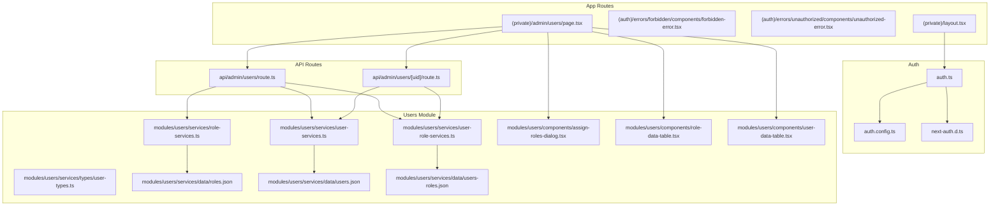
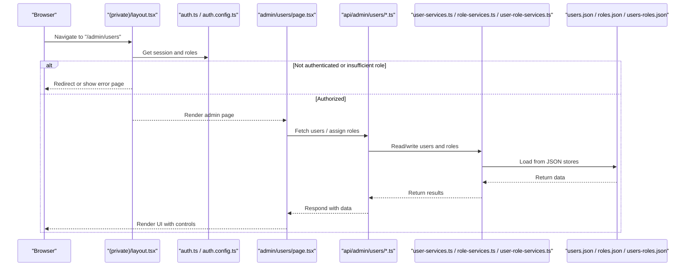
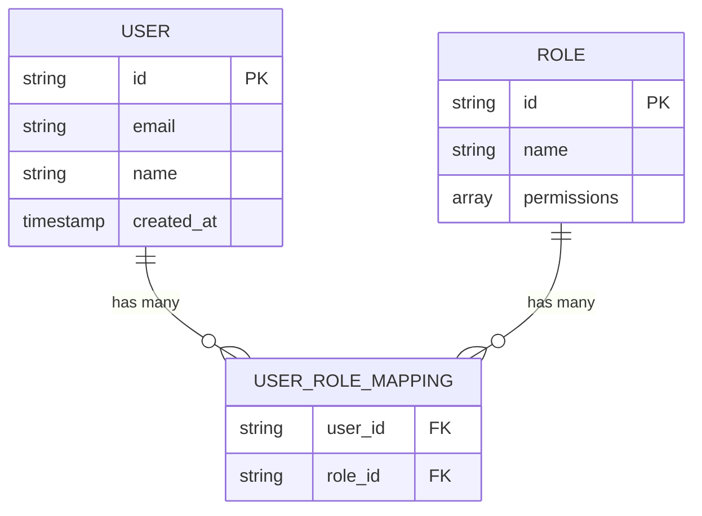
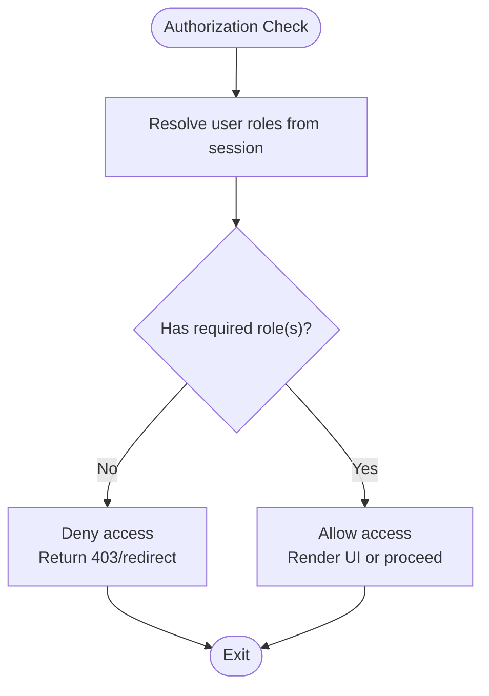
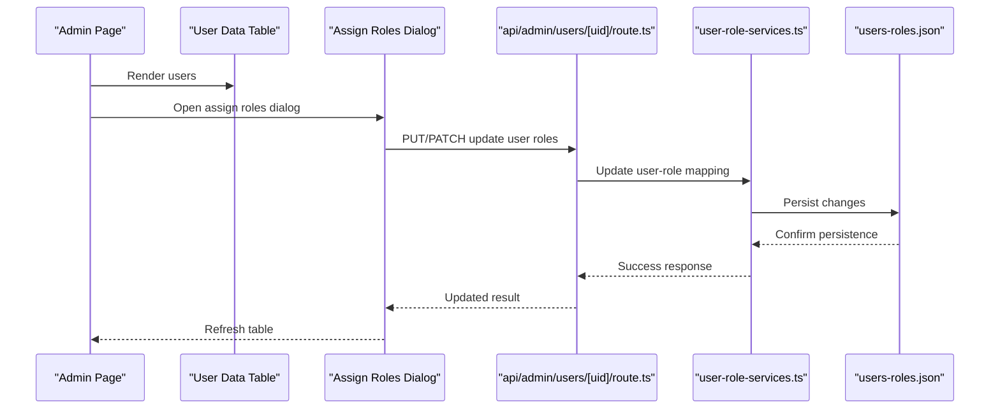
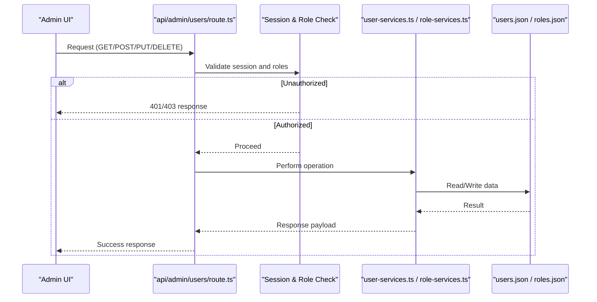
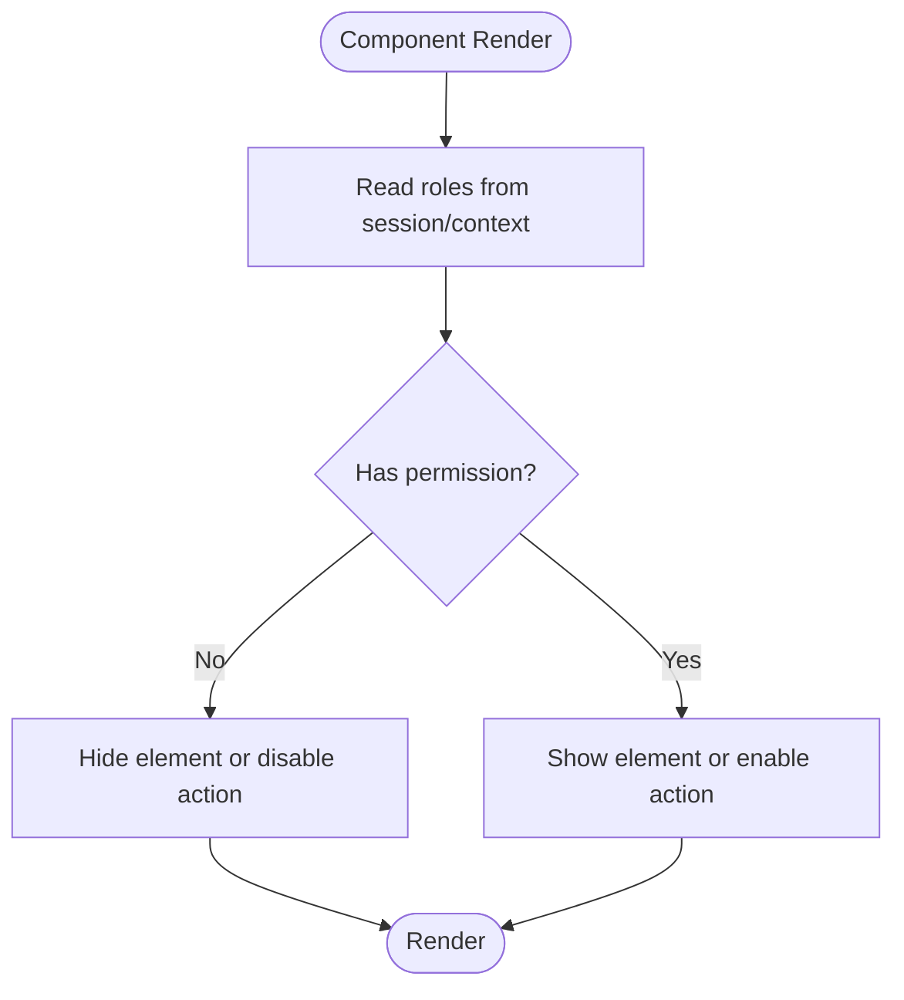
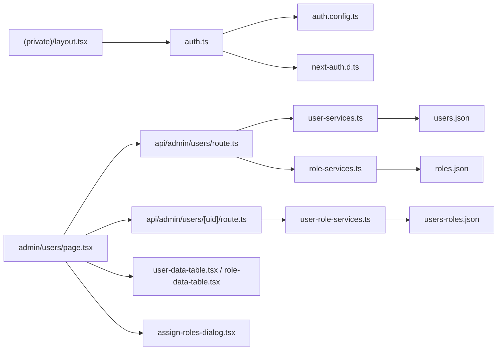

# Role-Based Access Control

<cite>
**Referenced Files in This Document**
- [auth.ts](file://src/auth.ts)
- [auth.config.ts](file://src/auth.config.ts)
- [next-auth.d.ts](file://src/types/next-auth.d.ts)
- [layout.tsx](file://src/app/(private)/layout.tsx)
- [page.tsx](file://src/app/(private)/admin/users/page.tsx)
- [route.ts](file://src/app/api/admin/users/route.ts)
- [route.ts](file://src/app/api/admin/users/[uid]/route.ts)
- [user-services.ts](file://src/modules/users/services/user-services.ts)
- [role-services.ts](file://src/modules/users/services/role-services.ts)
- [user-role-services.ts](file://src/modules/users/services/user-role-services.ts)
- [user-types.ts](file://src/modules/users/services/types/user-types.ts)
- [roles.json](file://src/modules/users/services/data/roles.json)
- [users.json](file://src/modules/users/services/data/users.json)
- [users-roles.json](file://src/modules/users/services/data/users-roles.json)
- [assign-roles-dialog.tsx](file://src/modules/users/components/assign-roles-dialog.tsx)
- [role-data-table.tsx](file://src/modules/users/components/role-data-table.tsx)
- [user-data-table.tsx](file://src/modules/users/components/user-data-table.tsx)
- [forbidden-error.tsx](file://src/app/(auth)/errors/forbidden/components/forbidden-error.tsx)
- [unauthorized-error.tsx](file://src/app/(auth)/errors/unauthorized/components/unauthorized-error.tsx)
</cite>

## Table of Contents
1. [Introduction](#introduction)
2. [Project Structure](#project-structure)
3. [Core Components](#core-components)
4. [Architecture Overview](#architecture-overview)
5. [Detailed Component Analysis](#detailed-component-analysis)
6. [Dependency Analysis](#dependency-analysis)
7. [Performance Considerations](#performance-considerations)
8. [Troubleshooting Guide](#troubleshooting-guide)
9. [Conclusion](#conclusion)
10. [Appendices](#appendices)

## Introduction
This document explains the role-based access control (RBAC) system implemented in the application. It covers the user and role model, permission hierarchy, authorization checks across UI and API routes, admin interfaces for managing users and roles, bulk operations, audit logging considerations, custom authorization hooks, dynamic role changes, security implications, privilege escalation prevention, and best practices.

The RBAC design centers on:
- A session-based identity layer using NextAuth with typed session augmentation.
- A server-side authorization strategy enforced at route boundaries.
- A client-side rendering strategy that conditionally shows UI based on current user roles.
- An admin area to manage users and roles with data tables and dialogs.
- Mock data-backed services for roles, users, and user-role mappings.

## Project Structure
The RBAC-related code spans authentication configuration, type augmentation, protected layout guards, admin pages, API routes, and modules for users and roles. The following diagram maps key files involved in RBAC.

**Diagram sources**
- [auth.ts](file://src/auth.ts)
- [auth.config.ts](file://src/auth.config.ts)
- [next-auth.d.ts](file://src/types/next-auth.d.ts)
- [layout.tsx](file://src/app/(private)/layout.tsx)
- [forbidden-error.tsx](file://src/app/(auth)/errors/forbidden/components/forbidden-error.tsx)
- [unauthorized-error.tsx](file://src/app/(auth)/errors/unauthorized/components/unauthorized-error.tsx)
- [page.tsx](file://src/app/(private)/admin/users/page.tsx)
- [route.ts](file://src/app/api/admin/users/route.ts)
- [route.ts](file://src/app/api/admin/users/[uid]/route.ts)
- [user-services.ts](file://src/modules/users/services/user-services.ts)
- [role-services.ts](file://src/modules/users/services/role-services.ts)
- [user-role-services.ts](file://src/modules/users/services/user-role-services.ts)
- [user-types.ts](file://src/modules/users/services/types/user-types.ts)
- [roles.json](file://src/modules/users/services/data/roles.json)
- [users.json](file://src/modules/users/services/data/users.json)
- [users-roles.json](file://src/modules/users/services/data/users-roles.json)
- [assign-roles-dialog.tsx](file://src/modules/users/components/assign-roles-dialog.tsx)
- [role-data-table.tsx](file://src/modules/users/components/role-data-table.tsx)
- [user-data-table.tsx](file://src/modules/users/components/user-data-table.tsx)

**Section sources**
- [auth.ts](file://src/auth.ts)
- [auth.config.ts](file://src/auth.config.ts)
- [next-auth.d.ts](file://src/types/next-auth.d.ts)
- [layout.tsx](file://src/app/(private)/layout.tsx)
- [page.tsx](file://src/app/(private)/admin/users/page.tsx)
- [route.ts](file://src/app/api/admin/users/route.ts)
- [route.ts](file://src/app/api/admin/users/[uid]/route.ts)
- [user-services.ts](file://src/modules/users/services/user-services.ts)
- [role-services.ts](file://src/modules/users/services/role-services.ts)
- [user-role-services.ts](file://src/modules/users/services/user-role-services.ts)
- [user-types.ts](file://src/modules/users/services/types/user-types.ts)
- [roles.json](file://src/modules/users/services/data/roles.json)
- [users.json](file://src/modules/users/services/data/users.json)
- [users-roles.json](file://src/modules/users/services/data/users-roles.json)
- [assign-roles-dialog.tsx](file://src/modules/users/components/assign-roles-dialog.tsx)
- [role-data-table.tsx](file://src/modules/users/components/role-data-table.tsx)
- [user-data-table.tsx](file://src/modules/users/components/user-data-table.tsx)

## Core Components
- Authentication and Session Augmentation
  - NextAuth integration and session shape are defined in the auth entry and config files, with TypeScript augmentation for the session object.
  - The session is used by both server components and API routes to determine the current user and their roles.

- Protected Layout Guard
  - The private layout enforces authentication and can enforce role-based access before rendering nested pages.

- Admin Users Page
  - Provides a UI to list users, assign roles, and perform bulk operations via data table components and dialogs.

- API Routes for Admin Operations
  - Endpoints under api/admin/users implement CRUD and assignment logic, enforcing authorization before processing requests.

- User and Role Services
  - Services encapsulate data access to mock JSON stores for users, roles, and user-role mappings. Types define the shape of entities.

- Error Pages
  - Dedicated error pages for unauthorized and forbidden states help present clear feedback when authorization fails.

**Section sources**
- [auth.ts](file://src/auth.ts)
- [auth.config.ts](file://src/auth.config.ts)
- [next-auth.d.ts](file://src/types/next-auth.d.ts)
- [layout.tsx](file://src/app/(private)/layout.tsx)
- [page.tsx](file://src/app/(private)/admin/users/page.tsx)
- [route.ts](file://src/app/api/admin/users/route.ts)
- [route.ts](file://src/app/api/admin/users/[uid]/route.ts)
- [user-services.ts](file://src/modules/users/services/user-services.ts)
- [role-services.ts](file://src/modules/users/services/role-services.ts)
- [user-role-services.ts](file://src/modules/users/services/user-role-services.ts)
- [user-types.ts](file://src/modules/users/services/types/user-types.ts)
- [roles.json](file://src/modules/users/services/data/roles.json)
- [users.json](file://src/modules/users/services/data/users.json)
- [users-roles.json](file://src/modules/users/services/data/users-roles.json)
- [forbidden-error.tsx](file://src/app/(auth)/errors/forbidden/components/forbidden-error.tsx)
- [unauthorized-error.tsx](file://src/app/(auth)/errors/unauthorized/components/unauthorized-error.tsx)

## Architecture Overview
The RBAC architecture combines server-side enforcement with client-side conditional rendering.

**Diagram sources**
- [layout.tsx](file://src/app/(private)/layout.tsx)
- [auth.ts](file://src/auth.ts)
- [auth.config.ts](file://src/auth.config.ts)
- [page.tsx](file://src/app/(private)/admin/users/page.tsx)
- [route.ts](file://src/app/api/admin/users/route.ts)
- [route.ts](file://src/app/api/admin/users/[uid]/route.ts)
- [user-services.ts](file://src/modules/users/services/user-services.ts)
- [role-services.ts](file://src/modules/users/services/role-services.ts)
- [user-role-services.ts](file://src/modules/users/services/user-role-services.ts)
- [users.json](file://src/modules/users/services/data/users.json)
- [roles.json](file://src/modules/users/services/data/roles.json)
- [users-roles.json](file://src/modules/users/services/data/users-roles.json)

## Detailed Component Analysis

### User and Role Model
- Entities
  - User: Represents an account with identifiers and metadata.
  - Role: Represents a named role with associated permissions.
  - UserRoleMapping: Associates users with one or more roles.
- Data Sources
  - Mock JSON files provide initial data for users, roles, and mappings.
- Type Definitions
  - Centralized types ensure consistent shapes across services and UI.

**Diagram sources**
- [user-types.ts](file://src/modules/users/services/types/user-types.ts)
- [users.json](file://src/modules/users/services/data/users.json)
- [roles.json](file://src/modules/users/services/data/roles.json)
- [users-roles.json](file://src/modules/users/services/data/users-roles.json)

**Section sources**
- [user-types.ts](file://src/modules/users/services/types/user-types.ts)
- [users.json](file://src/modules/users/services/data/users.json)
- [roles.json](file://src/modules/users/services/data/roles.json)
- [users-roles.json](file://src/modules/users/services/data/users-roles.json)

### Permission Hierarchy and Evaluation
- Roles carry a set of permissions.
- Authorization checks evaluate whether the current user’s roles include required permissions.
- Server-side checks occur in API routes and layout guards; client-side checks render UI conditionally.

[No sources needed since this diagram shows conceptual workflow, not actual code structure]

### Admin Interface for Managing Users and Roles
- Admin Users Page
  - Displays users and roles in data tables.
  - Provides dialogs to assign roles to users.
  - Supports bulk operations through toolbar actions.
- Data Tables
  - Role data table lists available roles and supports management actions.
  - User data table lists users and supports editing and role assignment.
- Assign Roles Dialog
  - Presents a modal to select roles for a specific user and persists changes via API.

**Diagram sources**
- [page.tsx](file://src/app/(private)/admin/users/page.tsx)
- [user-data-table.tsx](file://src/modules/users/components/user-data-table.tsx)
- [assign-roles-dialog.tsx](file://src/modules/users/components/assign-roles-dialog.tsx)
- [route.ts](file://src/app/api/admin/users/[uid]/route.ts)
- [user-role-services.ts](file://src/modules/users/services/user-role-services.ts)
- [users-roles.json](file://src/modules/users/services/data/users-roles.json)

**Section sources**
- [page.tsx](file://src/app/(private)/admin/users/page.tsx)
- [role-data-table.tsx](file://src/modules/users/components/role-data-table.tsx)
- [user-data-table.tsx](file://src/modules/users/components/user-data-table.tsx)
- [assign-roles-dialog.tsx](file://src/modules/users/components/assign-roles-dialog.tsx)
- [route.ts](file://src/app/api/admin/users/[uid]/route.ts)
- [user-role-services.ts](file://src/modules/users/services/user-role-services.ts)
- [users-roles.json](file://src/modules/users/services/data/users-roles.json)

### API Authorization Checks
- Admin endpoints enforce authorization before performing mutations or reads.
- Typical flow:
  - Verify session exists and user has required role(s).
  - If not authorized, return appropriate error responses.
  - If authorized, delegate to services for data operations.

**Diagram sources**
- [route.ts](file://src/app/api/admin/users/route.ts)
- [user-services.ts](file://src/modules/users/services/user-services.ts)
- [role-services.ts](file://src/modules/users/services/role-services.ts)
- [users.json](file://src/modules/users/services/data/users.json)
- [roles.json](file://src/modules/users/services/data/roles.json)

**Section sources**
- [route.ts](file://src/app/api/admin/users/route.ts)
- [route.ts](file://src/app/api/admin/users/[uid]/route.ts)
- [user-services.ts](file://src/modules/users/services/user-services.ts)
- [role-services.ts](file://src/modules/users/services/role-services.ts)

### Client-Side Conditional Rendering
- UI elements can be conditionally rendered based on the current user’s roles.
- Common patterns:
  - Hide or show navigation items.
  - Enable/disable action buttons.
  - Render different views depending on role membership.

[No sources needed since this diagram shows conceptual workflow, not actual code structure]

### Custom Authorization Hooks
- Implement reusable hooks to centralize authorization logic:
  - Require specific roles for a component or route segment.
  - Provide boolean flags for UI toggles.
  - Throw errors or redirect on failure.
- Use these hooks in both server components and client components to maintain consistency.

[No sources needed since this section provides general guidance]

### Handling Role Changes Dynamically
- After updating a user’s roles via API, refresh the session or invalidate cached data so UI reflects changes immediately.
- Patterns:
  - Re-fetch user data after successful mutation.
  - Trigger session updates if necessary.
  - Invalidate queries or local caches.

[No sources needed since this section provides general guidance]

## Dependency Analysis
The following diagram highlights dependencies among RBAC components.

**Diagram sources**
- [auth.ts](file://src/auth.ts)
- [auth.config.ts](file://src/auth.config.ts)
- [next-auth.d.ts](file://src/types/next-auth.d.ts)
- [layout.tsx](file://src/app/(private)/layout.tsx)
- [page.tsx](file://src/app/(private)/admin/users/page.tsx)
- [route.ts](file://src/app/api/admin/users/route.ts)
- [route.ts](file://src/app/api/admin/users/[uid]/route.ts)
- [user-services.ts](file://src/modules/users/services/user-services.ts)
- [role-services.ts](file://src/modules/users/services/role-services.ts)
- [user-role-services.ts](file://src/modules/users/services/user-role-services.ts)
- [users.json](file://src/modules/users/services/data/users.json)
- [roles.json](file://src/modules/users/services/data/roles.json)
- [users-roles.json](file://src/modules/users/services/data/users-roles.json)
- [user-data-table.tsx](file://src/modules/users/components/user-data-table.tsx)
- [role-data-table.tsx](file://src/modules/users/components/role-data-table.tsx)
- [assign-roles-dialog.tsx](file://src/modules/users/components/assign-roles-dialog.tsx)

**Section sources**
- [auth.ts](file://src/auth.ts)
- [auth.config.ts](file://src/auth.config.ts)
- [next-auth.d.ts](file://src/types/next-auth.d.ts)
- [layout.tsx](file://src/app/(private)/layout.tsx)
- [page.tsx](file://src/app/(private)/admin/users/page.tsx)
- [route.ts](file://src/app/api/admin/users/route.ts)
- [route.ts](file://src/app/api/admin/users/[uid]/route.ts)
- [user-services.ts](file://src/modules/users/services/user-services.ts)
- [role-services.ts](file://src/modules/users/services/role-services.ts)
- [user-role-services.ts](file://src/modules/users/services/user-role-services.ts)
- [users.json](file://src/modules/users/services/data/users.json)
- [roles.json](file://src/modules/users/services/data/roles.json)
- [users-roles.json](file://src/modules/users/services/data/users-roles.json)
- [user-data-table.tsx](file://src/modules/users/components/user-data-table.tsx)
- [role-data-table.tsx](file://src/modules/users/components/role-data-table.tsx)
- [assign-roles-dialog.tsx](file://src/modules/users/components/assign-roles-dialog.tsx)

## Performance Considerations
- Minimize repeated role lookups by caching resolved roles in session or context where appropriate.
- Batch API calls for bulk operations to reduce network overhead.
- Avoid heavy computations in render paths; precompute permission flags during data fetching.
- Keep JSON stores small and indexed by ID for fast lookups.

[No sources needed since this section provides general guidance]

## Troubleshooting Guide
Common issues and resolutions:
- Unauthorized access errors
  - Ensure the session is initialized and contains valid roles.
  - Verify the layout guard allows access for the intended roles.
- Forbidden errors
  - Confirm the user has the required role(s) for the requested resource.
  - Check API route authorization logic and service permissions.
- UI not reflecting role changes
  - Refresh session or re-fetch user data after role updates.
  - Invalidate any cached queries or local state.

**Section sources**
- [forbidden-error.tsx](file://src/app/(auth)/errors/forbidden/components/forbidden-error.tsx)
- [unauthorized-error.tsx](file://src/app/(auth)/errors/unauthorized/components/unauthorized-error.tsx)
- [layout.tsx](file://src/app/(private)/layout.tsx)
- [route.ts](file://src/app/api/admin/users/route.ts)
- [route.ts](file://src/app/api/admin/users/[uid]/route.ts)

## Conclusion
The RBAC system integrates authentication, session augmentation, server-side authorization, and client-side conditional rendering. The admin interface enables practical management of users and roles, while services abstract data access from JSON stores. By enforcing checks at both API and UI layers, the application mitigates privilege escalation risks and provides a clear path for extending permissions and auditing changes.

[No sources needed since this section summarizes without analyzing specific files]

## Appendices

### Security Implications and Best Practices
- Always validate roles on the server side; never trust client-only checks.
- Apply least privilege: grant only the minimum roles required for each feature.
- Prevent privilege escalation by disallowing self-assignment of higher privileges unless explicitly permitted.
- Log critical role changes for auditability.
- Use strong session handling and secure cookies.
- Regularly review role definitions and permissions to avoid drift.

[No sources needed since this section provides general guidance]