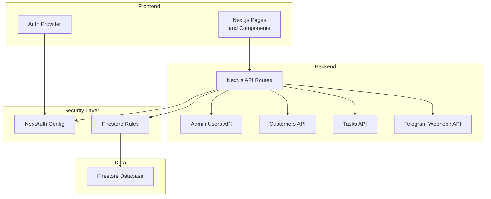
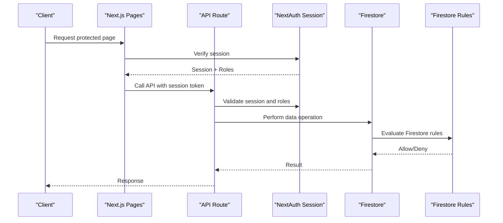
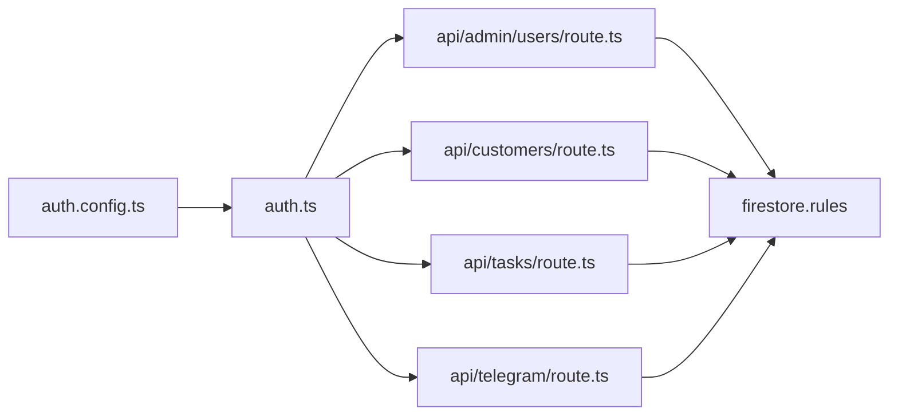

# Security Best Practices & Implementation Guidelines

<cite>
**Referenced Files in This Document**
- [auth.ts](file://src/auth.ts)
- [auth.config.ts](file://src/auth.config.ts)
- [firestore.rules](file://firestore.rules)
- [route.ts](file://src/app/api/admin/users/route.ts)
- [route.ts](file://src/app/api/admin/users/[uid]/route.ts)
- [route.ts](file://src/app/api/customers/route.ts)
- [route.ts](file://src/app/api/tasks/route.ts)
- [route.ts](file://src/app/api/telegram/route.ts)
- [page.tsx](file://src/app/(private)/admin/users/page.tsx)
- [layout.tsx](file://src/app/(private)/layout.tsx)
- [auth-provider.tsx](file://src/components/auth-provider.tsx)
- [user-services.ts](file://src/modules/users/services/user-services.ts)
- [role-services.ts](file://src/modules/users/services/role-services.ts)
- [user-role-services.ts](file://src/modules/users/services/user-role-services.ts)
</cite>

## Table of Contents
1. [Introduction](#introduction)
2. [Project Structure](#project-structure)
3. [Core Components](#core-components)
4. [Architecture Overview](#architecture-overview)
5. [Detailed Component Analysis](#detailed-component-analysis)
6. [Dependency Analysis](#dependency-analysis)
7. [Performance Considerations](#performance-considerations)
8. [Troubleshooting Guide](#troubleshooting-guide)
9. [Conclusion](#conclusion)
10. [Appendices](#appendices)

## Introduction
This document provides comprehensive security guidelines and best practices for implementing role-based access control (RBAC) in the project. It covers privilege escalation prevention, input validation, secure API endpoint design, Firestore security rules, authentication flow implementation, session management, auditing, monitoring, incident handling, common vulnerabilities, testing strategies, and enterprise compliance considerations. The guidance is grounded in the existing codebase structure and files to ensure practical applicability.

## Project Structure
The application follows a Next.js App Router layout with:
- Authentication routes under (auth)
- Protected routes under (private)
- API routes under api
- Shared components and modules for features like users, roles, tasks, customers
- Firebase integration via Firestore rules and auth configuration

**Diagram sources**
- [auth.ts](file://src/auth.ts)
- [auth.config.ts](file://src/auth.config.ts)
- [route.ts](file://src/app/api/admin/users/route.ts)
- [route.ts](file://src/app/api/customers/route.ts)
- [route.ts](file://src/app/api/tasks/route.ts)
- [route.ts](file://src/app/api/telegram/route.ts)
- [firestore.rules](file://firestore.rules)

**Section sources**
- [auth.ts](file://src/auth.ts)
- [auth.config.ts](file://src/auth.config.ts)
- [layout.tsx](file://src/app/(private)/layout.tsx)
- [auth-provider.tsx](file://src/components/auth-provider.tsx)

## Core Components
- Authentication and session management are configured through NextAuth, centralizing identity verification and session handling.
- API routes enforce authorization checks before performing data operations.
- Firestore rules define server-side data access policies aligned with RBAC.
- User and role services encapsulate business logic for user and role management.

Key responsibilities:
- Validate identities and sessions at the edge (API routes).
- Enforce least privilege by checking roles per operation.
- Apply Firestore rules as the final enforcement boundary for data access.

**Section sources**
- [auth.ts](file://src/auth.ts)
- [auth.config.ts](file://src/auth.config.ts)
- [route.ts](file://src/app/api/admin/users/route.ts)
- [route.ts](file://src/app/api/customers/route.ts)
- [route.ts](file://src/app/api/tasks/route.ts)
- [route.ts](file://src/app/api/telegram/route.ts)
- [firestore.rules](file://firestore.rules)
- [user-services.ts](file://src/modules/users/services/user-services.ts)
- [role-services.ts](file://src/modules/users/services/role-services.ts)
- [user-role-services.ts](file://src/modules/users/services/user-role-services.ts)

## Architecture Overview
The system implements a layered security model:
- Frontend enforces UI-level visibility based on roles.
- API routes perform server-side authorization using authenticated context.
- Firestore rules enforce data-level permissions.

**Diagram sources**
- [auth.ts](file://src/auth.ts)
- [auth.config.ts](file://src/auth.config.ts)
- [route.ts](file://src/app/api/admin/users/route.ts)
- [firestore.rules](file://firestore.rules)

## Detailed Component Analysis

### Authentication Flow and Session Management
- Centralized NextAuth configuration ensures consistent session handling across pages and API routes.
- Sessions should be short-lived and rotated; tokens must be validated on each request.
- Use HTTPS-only cookies and secure flags for session storage.

Best practices:
- Always verify session existence and integrity before authorizing actions.
- Avoid storing sensitive roles or tokens in client-side state without encryption.
- Implement logout flows that invalidate sessions server-side.

**Section sources**
- [auth.ts](file://src/auth.ts)
- [auth.config.ts](file://src/auth.config.ts)
- [auth-provider.tsx](file://src/components/auth-provider.tsx)

### API Authorization and Privilege Escalation Prevention
- Every API route must check the caller’s identity and roles before processing requests.
- Do not trust client-supplied roles; derive roles from verified sessions or backend stores.
- Apply least privilege: grant only the minimum permissions required for each action.

Implementation patterns:
- Middleware-style guards in API routes to validate roles.
- Explicit allowlists for admin endpoints.
- Parameter validation and sanitization to prevent injection and IDOR.

Common pitfalls:
- Relying solely on frontend role checks.
- Using mutable client state for authorization decisions.
- Missing input validation leading to privilege escalation via crafted payloads.

**Section sources**
- [route.ts](file://src/app/api/admin/users/route.ts)
- [route.ts](file://src/app/api/admin/users/[uid]/route.ts)
- [route.ts](file://src/app/api/customers/route.ts)
- [route.ts](file://src/app/api/tasks/route.ts)
- [route.ts](file://src/app/api/telegram/route.ts)

### Input Validation and Secure Endpoint Design
- Validate all inputs: type, length, format, and allowed values.
- Sanitize inputs to prevent XSS and injection attacks.
- Use strict schemas and reject unknown fields.
- Rate-limit endpoints and apply throttling for sensitive operations.

Recommendations:
- Centralize validation utilities and reuse them across routes.
- Return generic error messages to avoid leaking internal details.
- Log validation failures for audit purposes without exposing sensitive data.

**Section sources**
- [route.ts](file://src/app/api/admin/users/route.ts)
- [route.ts](file://src/app/api/customers/route.ts)
- [route.ts](file://src/app/api/tasks/route.ts)
- [route.ts](file://src/app/api/telegram/route.ts)

### Firestore Security Rules for RBAC
- Define rules that enforce read/write permissions based on user roles and ownership.
- Ensure rules align with API-level checks; do not rely solely on client-side validations.
- Use granular rules for collections and documents to minimize over-permission.

Guidelines:
- Restrict admin-only collections to admin roles.
- Validate resource ownership for user-specific data.
- Deny by default and explicitly allow necessary operations.

**Section sources**
- [firestore.rules](file://firestore.rules)

### Role and User Management Services
- Encapsulate role assignment and user management logic in dedicated services.
- Ensure role changes are audited and require appropriate privileges.
- Prevent self-escalation by validating requester roles against target role changes.

Operational notes:
- Provide clear error responses when authorization fails.
- Maintain consistency between stored roles and enforced permissions.

**Section sources**
- [user-services.ts](file://src/modules/users/services/user-services.ts)
- [role-services.ts](file://src/modules/users/services/role-services.ts)
- [user-role-services.ts](file://src/modules/users/services/user-role-services.ts)

### Protected Layouts and Page-Level Guards
- Wrap private layouts with session checks to prevent unauthorized navigation.
- Render UI elements conditionally based on verified roles.
- Redirect unauthenticated users to sign-in and unauthorized users to forbidden pages.

**Section sources**
- [layout.tsx](file://src/app/(private)/layout.tsx)
- [page.tsx](file://src/app/(private)/admin/users/page.tsx)

## Dependency Analysis
The following diagram maps key dependencies among authentication, API routes, and Firestore rules:

**Diagram sources**
- [auth.config.ts](file://src/auth.config.ts)
- [auth.ts](file://src/auth.ts)
- [route.ts](file://src/app/api/admin/users/route.ts)
- [route.ts](file://src/app/api/customers/route.ts)
- [route.ts](file://src/app/api/tasks/route.ts)
- [route.ts](file://src/app/api/telegram/route.ts)
- [firestore.rules](file://firestore.rules)

**Section sources**
- [auth.config.ts](file://src/auth.config.ts)
- [auth.ts](file://src/auth.ts)
- [route.ts](file://src/app/api/admin/users/route.ts)
- [route.ts](file://src/app/api/customers/route.ts)
- [route.ts](file://src/app/api/tasks/route.ts)
- [route.ts](file://src/app/api/telegram/route.ts)
- [firestore.rules](file://firestore.rules)

## Performance Considerations
- Minimize database queries by batching operations and caching non-sensitive data where appropriate.
- Keep session validation lightweight; avoid heavy computations during request handling.
- Use efficient Firestore queries and indexes aligned with access patterns.
- Monitor rule evaluation costs and optimize rules to reduce complexity.

[No sources needed since this section provides general guidance]

## Troubleshooting Guide
Common issues and resolutions:
- Unauthorized access errors:
  - Verify session validity and role claims.
  - Check API route authorization logic and Firestore rules alignment.
- Forbidden access errors:
  - Confirm user has required role for the requested resource.
  - Review ownership checks and parameter validation.
- Data write failures:
  - Inspect Firestore rules for deny conditions.
  - Validate input schemas and permitted operations.

Auditing and monitoring recommendations:
- Log authentication events, authorization denials, and critical role changes.
- Aggregate logs centrally and set alerts for suspicious patterns (e.g., repeated 403/401 responses).
- Retain audit trails for compliance and forensic analysis.

Incident response steps:
- Isolate affected endpoints and revoke compromised sessions.
- Rotate credentials and keys if necessary.
- Investigate root cause, patch vulnerabilities, and update rules.
- Notify stakeholders and document lessons learned.

**Section sources**
- [route.ts](file://src/app/api/admin/users/route.ts)
- [route.ts](file://src/app/api/admin/users/[uid]/route.ts)
- [firestore.rules](file://firestore.rules)

## Conclusion
A robust RBAC implementation requires defense-in-depth: secure authentication, rigorous API authorization, strict input validation, and precise Firestore rules. By enforcing least privilege, auditing activities, and continuously monitoring for anomalies, the system can mitigate privilege escalation and other common vulnerabilities. Align testing and compliance practices with these guidelines to maintain a strong security posture in enterprise deployments.

[No sources needed since this section summarizes without analyzing specific files]

## Appendices

### Testing Strategies for Authorization Logic
- Unit tests for API route guards covering allowed/denied scenarios.
- Integration tests verifying Firestore rule behavior with test datasets.
- End-to-end tests simulating user journeys across roles.
- Fuzz testing for input validation and edge cases.

### Compliance Considerations for Enterprise Deployments
- Enforce least privilege and separation of duties.
- Maintain detailed audit logs and retention policies.
- Implement secure session management and token rotation.
- Conduct regular security reviews and penetration testing.
- Align with relevant standards (e.g., ISO 27001, SOC 2) and organizational policies.

[No sources needed since this section provides general guidance]