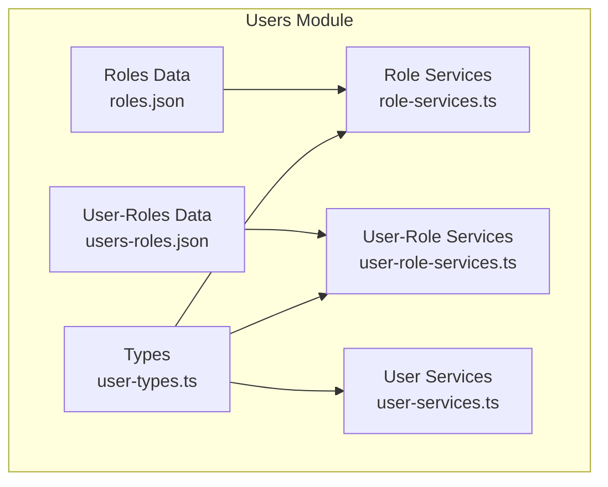
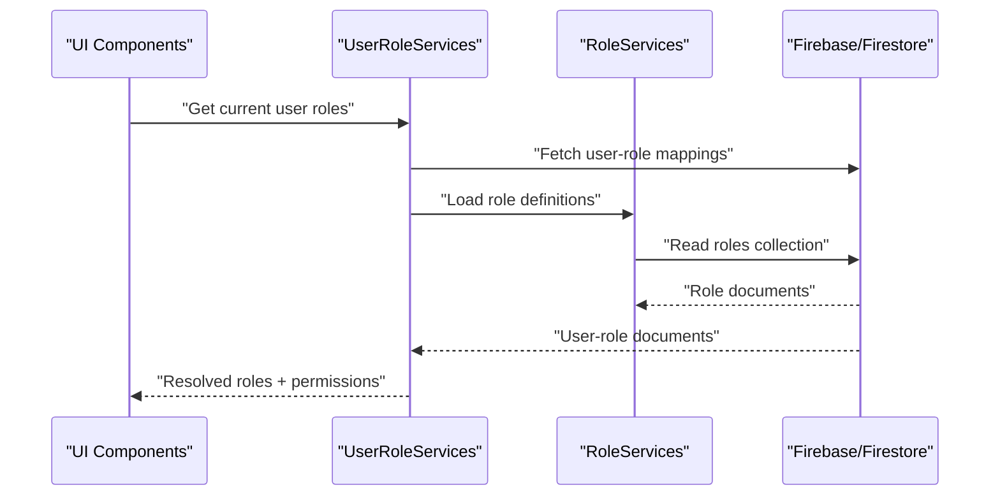
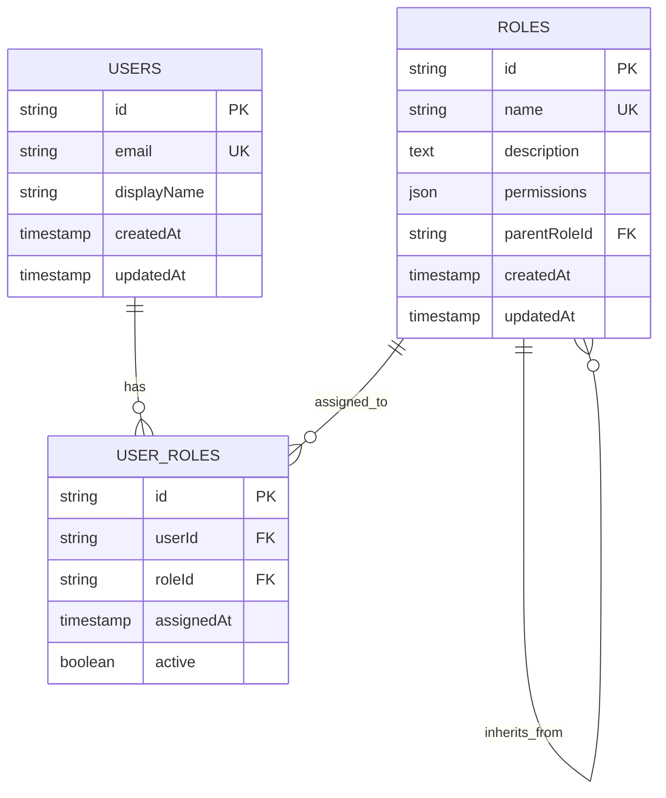
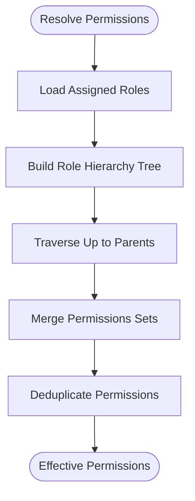
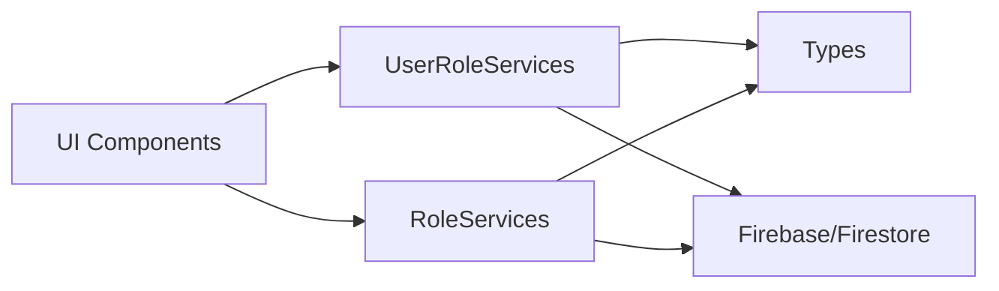

# User Role Model & Data Structure

<cite>
**Referenced Files in This Document**
- [user-types.ts](file://src/modules/users/services/types/user-types.ts)
- [roles.json](file://src/modules/users/services/data/roles.json)
- [users-roles.json](file://src/modules/users/services/data/users-roles.json)
- [role-services.ts](file://src/modules/users/services/role-services.ts)
- [user-role-services.ts](file://src/modules/users/services/user-role-services.ts)
- [user-services.ts](file://src/modules/users/services/user-services.ts)
- [firestore.rules](file://firestore.rules)
</cite>

## Table of Contents
1. [Introduction](#introduction)
2. [Project Structure](#project-structure)
3. [Core Components](#core-components)
4. [Architecture Overview](#architecture-overview)
5. [Detailed Component Analysis](#detailed-component-analysis)
6. [Dependency Analysis](#dependency-analysis)
7. [Performance Considerations](#performance-considerations)
8. [Troubleshooting Guide](#troubleshooting-guide)
9. [Conclusion](#conclusion)
10. [Appendices](#appendices)

## Introduction
This document describes the user role model and data structures used across the application. It focuses on the TypeScript interfaces for User, Role, and UserRole entities; the database schema relationships between users, roles, and user-role mappings; the role hierarchy and permission inheritance model; how roles are stored in Firebase; examples of role definitions and user-role assignments; validation rules; naming conventions; permission granularity levels; and best practices for designing new roles.

## Project Structure
The user role feature is organized under src/modules/users with clear separation between types, services, UI components, and mock data. Key areas include:
- Types: TypeScript interfaces and shared type definitions
- Services: Business logic for roles, users, and user-role associations
- Data: JSON fixtures for roles and user-role mappings
- UI: Components for managing roles and assigning them to users

[No sources needed since this diagram shows conceptual workflow, not actual code structure]

## Core Components
This section outlines the core entities and their responsibilities:
- User: Represents an authenticated user identity and profile attributes
- Role: Defines a named set of permissions and optional hierarchical metadata
- UserRole: A mapping entity linking a user to one or more roles

Typical responsibilities:
- Type safety via TypeScript interfaces
- Validation at boundaries (services and forms)
- Clear separation between read-only types and mutable service operations
- Centralized role definitions and user-role mappings

Best practices:
- Keep interfaces minimal and explicit
- Prefer immutable DTOs for API boundaries
- Use enums or string literal unions for stable identifiers
- Centralize validation rules near data ingestion points

[No sources needed since this section provides general guidance]

## Architecture Overview
High-level architecture for role-based access control:
- Frontend components request user context and role checks through services
- Services load role definitions and user-role mappings
- Authorization decisions are made by combining user roles with role permissions
- Roles and user-role mappings are persisted in Firebase (Firestore)

[No sources needed since this diagram shows conceptual workflow, not actual code structure]

## Detailed Component Analysis

### TypeScript Interfaces: User, Role, UserRole
Focus areas:
- User fields: unique identifier, display name, email, timestamps, and any profile-specific attributes
- Role fields: unique identifier, human-readable name, description, permission flags or sets, and optional hierarchy metadata
- UserRole fields: user reference, role reference, assignment metadata (e.g., effective date, status)

Design considerations:
- Use string literal unions for stable identifiers where possible
- Avoid circular references between types
- Separate internal domain models from API payloads if needed

[No sources needed since this section provides general guidance]

### Database Schema Relationships
Conceptual relationships:
- Users collection: stores user profiles and authentication-related fields
- Roles collection: stores role definitions and permission sets
- UserRoles collection: stores many-to-many links between users and roles

Relationship semantics:
- One user can have multiple roles
- One role can be assigned to multiple users
- Effective permissions are derived from the union of all assigned roles

[No sources needed since this diagram shows conceptual workflow, not actual code structure]

### Role Hierarchy and Permission Inheritance
Key concepts:
- Hierarchical roles allow child roles to inherit permissions from parent roles
- Inheritance can be single-parent or multi-parent depending on design
- Effective permissions for a user are computed by merging inherited permissions across all assigned roles

Implementation patterns:
- Store a parentRoleId reference on Role to define hierarchy
- Compute effective permissions by traversing up the hierarchy
- Cache computed results per user session to avoid repeated traversal

[No sources needed since this diagram shows conceptual workflow, not actual code structure]

### Firebase Storage and Security
Storage strategy:
- Users: Firestore collection for user profiles
- Roles: Firestore collection for role definitions
- UserRoles: Firestore collection for user-role mappings

Security considerations:
- Enforce read/write rules at the Firestore level
- Validate role assignments server-side
- Restrict admin-only mutations to authorized users only

[No sources needed since this section provides general guidance]

### Examples: Role Definitions and User-Role Assignments
Examples to consider:
- Role definition: base role with common permissions, specialized roles extending base
- User-role assignment: assign multiple roles to a user, including inherited ones
- Validation example: ensure required fields exist and constraints are met before persisting

[No sources needed since this section provides general guidance]

### Data Validation Rules
Common validations:
- Required fields: non-empty identifiers and names
- Uniqueness: role names should be unique within scope
- Referential integrity: user and role IDs must exist before creating a UserRole
- Status flags: active/inactive states for soft-deletion and lifecycle management

Validation layers:
- Client-side form validation for UX
- Service-layer validation for correctness
- Firestore security rules for enforcement

[No sources needed since this section provides general guidance]

### Role Naming Conventions
Guidelines:
- Use descriptive, noun-like names for roles (e.g., Editor, Viewer, Admin)
- Avoid ambiguous abbreviations
- Keep names consistent across environments
- Reserve reserved prefixes for system roles if applicable

[No sources needed since this section provides general guidance]

### Permission Granularity Levels
Levels:
- Feature-level: enable/disable entire features
- Action-level: fine-grained actions like create, read, update, delete
- Resource-level: restrict access to specific resources or scopes

Recommendations:
- Start coarse and refine as needed
- Group related permissions into logical sets
- Prefer additive permissions over negative exceptions

[No sources needed since this section provides general guidance]

### Best Practices for Designing New Roles
Practices:
- Define minimal viable permissions first
- Leverage inheritance to reduce duplication
- Document each role’s purpose and expected audience
- Review permissions regularly for least privilege
- Test authorization paths with representative users

[No sources needed since this section provides general guidance]

## Dependency Analysis
Component interactions:
- UI components depend on services for role and user-role operations
- Services depend on types for shape contracts
- Services interact with Firebase for persistence
- Mock data supports development and testing without live backend

[No sources needed since this diagram shows conceptual workflow, not actual code structure]

## Performance Considerations
- Cache resolved permissions per user session to avoid repeated lookups
- Paginate large datasets for roles and user-role lists
- Precompute effective permissions during login or role changes
- Use efficient queries and indexes on frequently filtered fields (userId, roleId, active)

[No sources needed since this section provides general guidance]

## Troubleshooting Guide
Common issues and resolutions:
- Missing role assignments: verify user-role records exist and are active
- Permission conflicts: review inheritance chains and deduplication logic
- Validation failures: check required fields and referential integrity
- Firestore rule denials: confirm security rules allow intended reads/writes

[No sources needed since this section provides general guidance]

## Conclusion
A robust role model combines clear TypeScript interfaces, well-defined database relationships, and a scalable permission inheritance mechanism. By following naming conventions, granular permission design, and strong validation and security practices, teams can evolve roles safely and predictably.

[No sources needed since this section summarizes without analyzing specific files]

## Appendices

### Appendix A: Reference File Index
- Types: user-types.ts
- Services: role-services.ts, user-role-services.ts, user-services.ts
- Data: roles.json, users-roles.json
- Security: firestore.rules

[No sources needed since this section provides general guidance]