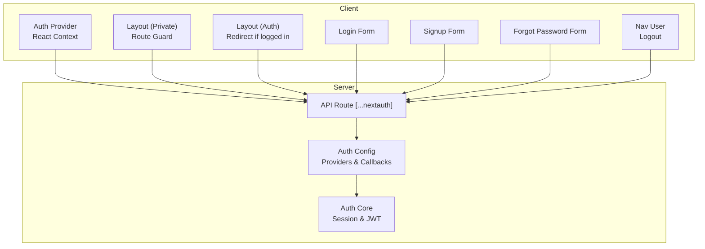
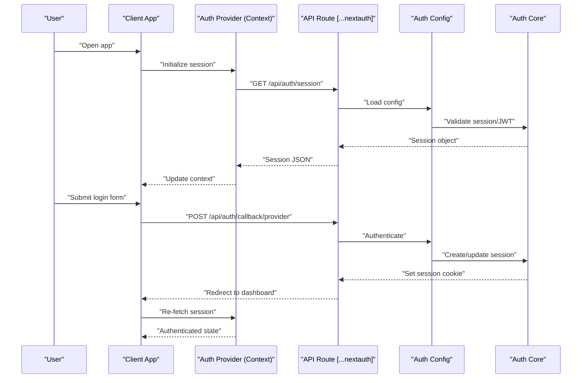
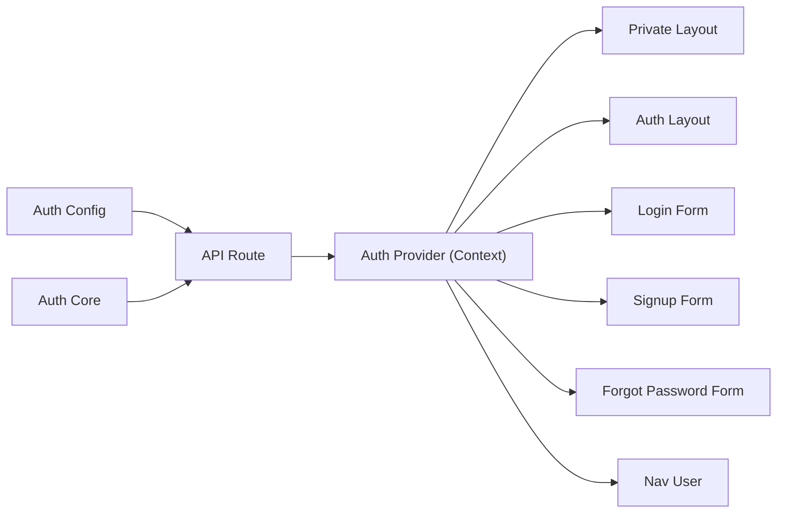

# Session Management

<cite>
**Referenced Files in This Document**
- [auth.ts](file://src/auth.ts)
- [auth.config.ts](file://src/auth.config.ts)
- [next-auth.d.ts](file://src/types/next-auth.d.ts)
- [route.ts](file://src/app/api/auth/[...nextauth]/route.ts)
- [layout.tsx](file://src/app/(auth)/layout.tsx)
- [layout.tsx](file://src/app/(private)/layout.tsx)
- [auth-provider.tsx](file://src/components/auth-provider.tsx)
- [login-form.tsx](file://src/app/(auth)/sign-in/components/login-form.tsx)
- [signup-form.tsx](file://src/app/(auth)/sign-up/components/signup-form.tsx)
- [forgot-password-form.tsx](file://src/app/(auth)/forgot-password/components/forgot-password-form.tsx)
- [unauthorized-error.tsx](file://src/app/(auth)/errors/unauthorized/components/unauthorized-error.tsx)
- [forbidden-error.tsx](file://src/app/(auth)/errors/forbidden/components/forbidden-error.tsx)
- [nav-user.tsx](file://src/components/nav-user.tsx)
- [site-header.tsx](file://src/components/site-header.tsx)
</cite>

## Table of Contents
1. [Introduction](#introduction)
2. [Project Structure](#project-structure)
3. [Core Components](#core-components)
4. [Architecture Overview](#architecture-overview)
5. [Detailed Component Analysis](#detailed-component-analysis)
6. [Dependency Analysis](#dependency-analysis)
7. [Performance Considerations](#performance-considerations)
8. [Troubleshooting Guide](#troubleshooting-guide)
9. [Conclusion](#conclusion)

## Introduction
This document explains how session management works in the application’s authentication system. It covers the session lifecycle, storage strategies (JWT vs database-backed sessions), persistence across page reloads, client-side session handling via React Context, synchronization between components, and automatic refresh mechanisms. It also includes examples for accessing user data, handling expiration, implementing logout, security considerations (session hijacking prevention, secure cookies, CSRF protection), debugging, and performance monitoring.

## Project Structure
The authentication and session logic is centered around NextAuth.js with a few custom providers and UI integrations:
- Server-side configuration and route handlers define session strategy, cookie settings, and provider callbacks.
- Client-side provider wraps the app to expose session state through React Context.
- Authenticated routes are protected by layout-level guards.
- Forms and navigation components interact with the session for login, signup, password recovery, and logout.

**Diagram sources**
- [auth-provider.tsx](file://src/components/auth-provider.tsx)
- [layout.tsx](file://src/app/(private)/layout.tsx)
- [layout.tsx](file://src/app/(auth)/layout.tsx)
- [route.ts](file://src/app/api/auth/[...nextauth]/route.ts)
- [auth.config.ts](file://src/auth.config.ts)
- [auth.ts](file://src/auth.ts)
- [login-form.tsx](file://src/app/(auth)/sign-in/components/login-form.tsx)
- [signup-form.tsx](file://src/app/(auth)/sign-up/components/signup-form.tsx)
- [forgot-password-form.tsx](file://src/app/(auth)/forgot-password/components/forgot-password-form.tsx)
- [nav-user.tsx](file://src/components/nav-user.tsx)

**Section sources**
- [auth.ts](file://src/auth.ts)
- [auth.config.ts](file://src/auth.config.ts)
- [route.ts](file://src/app/api/auth/[...nextauth]/route.ts)
- [auth-provider.tsx](file://src/components/auth-provider.tsx)
- [layout.tsx](file://src/app/(private)/layout.tsx)
- [layout.tsx](file://src/app/(auth)/layout.tsx)

## Core Components
- Auth core and configuration:
  - Central auth setup and provider wiring.
  - Provider-specific options, callbacks, and session/JWT shaping.
- API route handler:
  - Exposes the NextAuth endpoint used by both server and client flows.
- Client provider:
  - Wraps the app to provide session state via React Context.
- Layout guards:
  - Protect private routes and redirect unauthenticated users.
  - Redirect authenticated users away from auth pages.
- UI interactions:
  - Login, signup, forgot password forms call the auth API.
  - Navigation user component provides logout actions.

Key responsibilities:
- Define session strategy (JWT or database).
- Configure secure cookie attributes.
- Provide hooks and utilities to read/write session on client and server.
- Enforce access control at route level.

**Section sources**
- [auth.ts](file://src/auth.ts)
- [auth.config.ts](file://src/auth.config.ts)
- [route.ts](file://src/app/api/auth/[...nextauth]/route.ts)
- [auth-provider.tsx](file://src/components/auth-provider.tsx)
- [layout.tsx](file://src/app/(private)/layout.tsx)
- [layout.tsx](file://src/app/(auth)/layout.tsx)
- [login-form.tsx](file://src/app/(auth)/sign-in/components/login-form.tsx)
- [signup-form.tsx](file://src/app/(auth)/sign-up/components/signup-form.tsx)
- [forgot-password-form.tsx](file://src/app/(auth)/forgot-password/components/forgot-password-form.tsx)
- [nav-user.tsx](file://src/components/nav-user.tsx)

## Architecture Overview
The session architecture uses NextAuth.js as the backbone:
- The API route delegates to NextAuth.
- The auth configuration defines providers, callbacks, and session/JWT behavior.
- The client provider exposes session state to React components.
- Layouts enforce route-level access control.

**Diagram sources**
- [route.ts](file://src/app/api/auth/[...nextauth]/route.ts)
- [auth.config.ts](file://src/auth.config.ts)
- [auth.ts](file://src/auth.ts)
- [auth-provider.tsx](file://src/components/auth-provider.tsx)
- [login-form.tsx](file://src/app/(auth)/sign-in/components/login-form.tsx)

## Detailed Component Analysis

### Authentication Core and Configuration
Responsibilities:
- Define providers and callbacks.
- Choose session strategy (JWT or database).
- Shape session and JWT payloads.
- Configure cookie attributes for security.

Security notes:
- Prefer HTTPS-only cookies.
- Use SameSite policy appropriate for your deployment.
- Keep secrets rotated and stored securely.

Typical customization points:
- Session callback to attach additional fields.
- JWT callback to persist tokens or metadata.
- Cookie configuration for domain, path, secure, sameSite, httpOnly.

**Section sources**
- [auth.config.ts](file://src/auth.config.ts)
- [auth.ts](file://src/auth.ts)

### API Route Handler
Responsibilities:
- Expose NextAuth endpoints.
- Forward requests to the configured auth instance.
- Handle callbacks and redirects.

Integration:
- Used by client forms and session checks.
- Returns standardized session responses.

**Section sources**
- [route.ts](file://src/app/api/auth/[...nextauth]/route.ts)

### Client-Side Session Provider (React Context)
Responsibilities:
- Wrap the application to initialize and maintain session state.
- Provide hooks to read current session and trigger refresh.
- Ensure consistent session availability across components.

Behavior:
- On mount, fetches session from the API route.
- Updates context when session changes.
- Supports revalidation after mutations (e.g., login/logout).

**Section sources**
- [auth-provider.tsx](file://src/components/auth-provider.tsx)

### Route Guards (Layouts)
Private layout:
- Checks authentication before rendering protected content.
- Redirects unauthenticated users to sign-in.

Auth layout:
- Redirects already authenticated users away from sign-in/sign-up.

Implementation patterns:
- Read session from context or server-side helpers.
- Perform conditional redirects using Next.js navigation.

**Section sources**
- [layout.tsx](file://src/app/(private)/layout.tsx)
- [layout.tsx](file://src/app/(auth)/layout.tsx)

### Authentication Forms
Login form:
- Submits credentials to the auth callback endpoint.
- Handles success and error states.
- Triggers session refresh upon completion.

Signup form:
- Creates new accounts via provider or custom flow.
- Ensures session is established post-signup.

Forgot password form:
- Initiates password reset flow.
- Guides user to complete reset via email link.

**Section sources**
- [login-form.tsx](file://src/app/(auth)/sign-in/components/login-form.tsx)
- [signup-form.tsx](file://src/app/(auth)/sign-up/components/signup-form.tsx)
- [forgot-password-form.tsx](file://src/app/(auth)/forgot-password/components/forgot-password-form.tsx)

### Navigation and Logout
Navigation user component:
- Displays user info from session.
- Provides logout action that clears session and redirects.

Header integration:
- Uses the user component to show profile and logout.

**Section sources**
- [nav-user.tsx](file://src/components/nav-user.tsx)
- [site-header.tsx](file://src/components/site-header.tsx)

### Error Pages for Auth States
Unauthorized and forbidden error pages:
- Render when session is missing or insufficient permissions.
- Provide guidance and actions (e.g., go back, sign in).

**Section sources**
- [unauthorized-error.tsx](file://src/app/(auth)/errors/unauthorized/components/unauthorized-error.tsx)
- [forbidden-error.tsx](file://src/app/(auth)/errors/forbidden/components/forbidden-error.tsx)

## Dependency Analysis
High-level dependencies:
- API route depends on auth configuration and core.
- Client provider depends on API route for session retrieval.
- Layouts depend on client provider to make routing decisions.
- Forms and navigation depend on API route and client provider.

**Diagram sources**
- [auth.config.ts](file://src/auth.config.ts)
- [auth.ts](file://src/auth.ts)
- [route.ts](file://src/app/api/auth/[...nextauth]/route.ts)
- [auth-provider.tsx](file://src/components/auth-provider.tsx)
- [layout.tsx](file://src/app/(private)/layout.tsx)
- [layout.tsx](file://src/app/(auth)/layout.tsx)
- [login-form.tsx](file://src/app/(auth)/sign-in/components/login-form.tsx)
- [signup-form.tsx](file://src/app/(auth)/sign-up/components/signup-form.tsx)
- [forgot-password-form.tsx](file://src/app/(auth)/forgot-password/components/forgot-password-form.tsx)
- [nav-user.tsx](file://src/components/nav-user.tsx)

**Section sources**
- [auth.config.ts](file://src/auth.config.ts)
- [auth.ts](file://src/auth.ts)
- [route.ts](file://src/app/api/auth/[...nextauth]/route.ts)
- [auth-provider.tsx](file://src/components/auth-provider.tsx)
- [layout.tsx](file://src/app/(private)/layout.tsx)
- [layout.tsx](file://src/app/(auth)/layout.tsx)
- [login-form.tsx](file://src/app/(auth)/sign-in/components/login-form.tsx)
- [signup-form.tsx](file://src/app/(auth)/sign-up/components/signup-form.tsx)
- [forgot-password-form.tsx](file://src/app/(auth)/forgot-password/components/forgot-password-form.tsx)
- [nav-user.tsx](file://src/components/nav-user.tsx)

## Performance Considerations
- Prefer JWT-based sessions for stateless scaling; use database-backed sessions only when you need revocation or auditability.
- Minimize payload size in session/JWT to reduce network overhead.
- Revalidate session only when necessary (e.g., after mutations).
- Avoid heavy computations in session callbacks; offload to background jobs if needed.
- Cache static assets and leverage browser caching for non-sensitive resources.

[No sources needed since this section provides general guidance]

## Troubleshooting Guide
Common issues and resolutions:
- Session not persisting across reloads:
  - Verify cookie attributes (secure, sameSite, domain) match your environment.
  - Ensure HTTPS is enabled in production for secure cookies.
- Unauthorized redirects on protected routes:
  - Confirm the private layout reads session correctly and handles loading states.
  - Check that the API route returns a valid session response.
- Logout not clearing session:
  - Ensure the logout flow calls the correct endpoint and clears local state.
  - Validate that the client provider revalidates after logout.
- Cross-site request failures:
  - Review SameSite policy and CORS settings.
  - For cross-domain scenarios, configure appropriate cookie domain and flags.

Debugging tips:
- Inspect cookies in browser DevTools to verify presence and attributes.
- Log session shape in development using provider callbacks.
- Use network tab to inspect API responses from the auth endpoint.

Security checklist:
- Enable HttpOnly and Secure flags on session cookies.
- Set SameSite=Lax or Strict based on your UX needs.
- Implement CSRF protections where applicable (e.g., double-submit cookie pattern or origin checks).
- Rotate secrets regularly and store them in environment variables.
- Limit session lifetime and implement token rotation for long-lived sessions.

**Section sources**
- [auth.config.ts](file://src/auth.config.ts)
- [auth-provider.tsx](file://src/components/auth-provider.tsx)
- [layout.tsx](file://src/app/(private)/layout.tsx)
- [route.ts](file://src/app/api/auth/[...nextauth]/route.ts)

## Conclusion
The session management system leverages NextAuth.js to provide a robust, configurable foundation. By carefully selecting session storage (JWT vs database), securing cookies, and synchronizing session state via React Context, the application ensures reliable authentication across page reloads and components. Properly implemented guards, forms, and logout flows deliver a cohesive user experience while maintaining strong security practices.