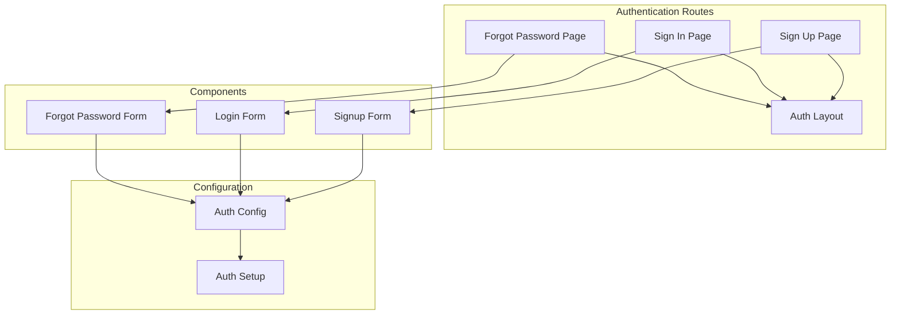
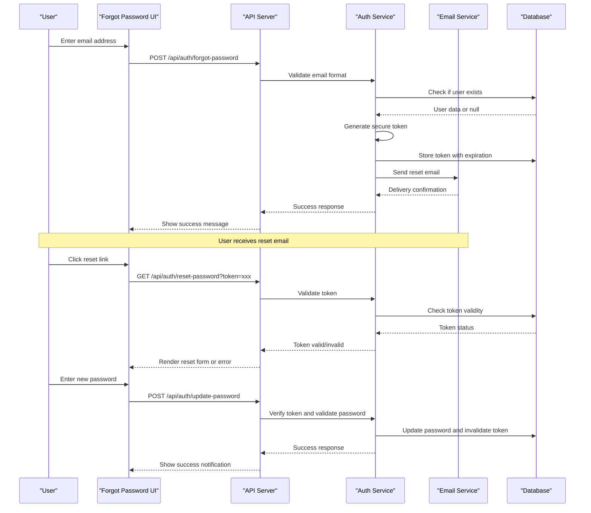
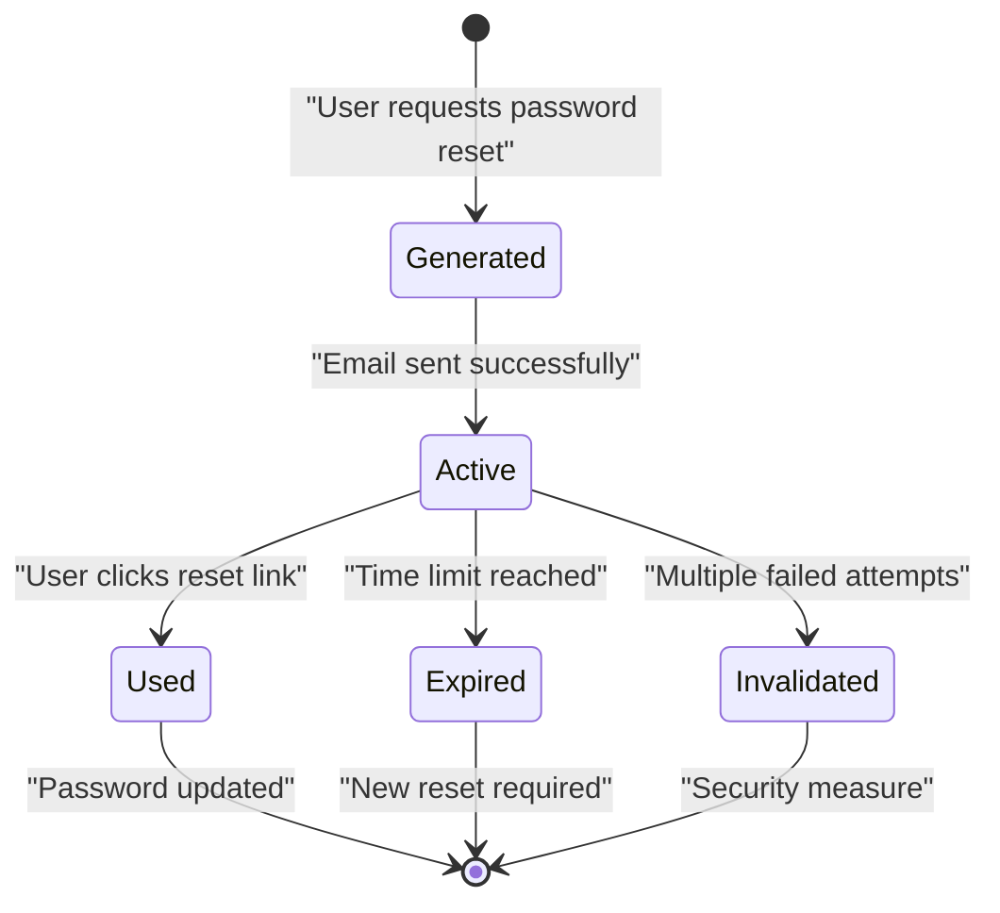

# Forgot Password Flow

<cite>
**Referenced Files in This Document**
- [forgot-password-form.tsx](file://src/app/(auth)/forgot-password/components/forgot-password-form.tsx)
- [page.tsx](file://src/app/(auth)/forgot-password/page.tsx)
- [auth.config.ts](file://src/auth.config.ts)
- [auth.ts](file://src/auth.ts)
- [login-form.tsx](file://src/app/(auth)/sign-in/components/login-form.tsx)
- [signup-form.tsx](file://src/app/(auth)/sign-up/components/signup-form.tsx)
- [layout.tsx](file://src/app/(auth)/layout.tsx)
</cite>

## Table of Contents
1. [Introduction](#introduction)
2. [Project Structure](#project-structure)
3. [Core Components](#core-components)
4. [Architecture Overview](#architecture-overview)
5. [Detailed Component Analysis](#detailed-component-analysis)
6. [Security Considerations](#security-considerations)
7. [Email Notification System](#email-notification-system)
8. [Token Management](#token-management)
9. [Password Validation](#password-validation)
10. [User Experience Optimization](#user-experience-optimization)
11. [Troubleshooting Guide](#troubleshooting-guide)
12. [Conclusion](#conclusion)

## Introduction

The password reset functionality is a critical security feature that allows users to recover their accounts when they forget their passwords. This implementation follows industry best practices for secure password recovery, including token-based authentication, email verification, and secure password updates.

The system provides a complete user journey from password reset initiation through successful password update, with proper error handling, validation, and security measures throughout the process.

## Project Structure

The password reset functionality is organized within the Next.js application structure under the authentication routes:

**Diagram sources**
- [page.tsx](file://src/app/(auth)/forgot-password/page.tsx)
- [forgot-password-form.tsx](file://src/app/(auth)/forgot-password/components/forgot-password-form.tsx)
- [auth.config.ts](file://src/auth.config.ts)
- [auth.ts](file://src/auth.ts)

**Section sources**
- [page.tsx](file://src/app/(auth)/forgot-password/page.tsx)
- [forgot-password-form.tsx](file://src/app/(auth)/forgot-password/components/forgot-password-form.tsx)
- [layout.tsx](file://src/app/(auth)/layout.tsx)

## Core Components

### Forgot Password Form Component

The forgot password form is the primary user interface for initiating password resets. It handles:

- Email input validation
- Form submission processing
- Loading states and error handling
- Success feedback to users

### Authentication Configuration

The authentication system is configured using NextAuth.js, which provides:

- Session management
- Provider configuration
- Security middleware
- Token handling

### Route Handlers

The forgot password route manages:

- Page rendering and metadata
- Authentication state checking
- Redirect logic for authenticated users

**Section sources**
- [forgot-password-form.tsx](file://src/app/(auth)/forgot-password/components/forgot-password-form.tsx)
- [auth.config.ts](file://src/auth.config.ts)
- [auth.ts](file://src/auth.ts)

## Architecture Overview

The password reset flow follows a secure, multi-step process:

**Diagram sources**
- [forgot-password-form.tsx](file://src/app/(auth)/forgot-password/components/forgot-password-form.tsx)
- [auth.config.ts](file://src/auth.config.ts)
- [auth.ts](file://src/auth.ts)

## Detailed Component Analysis

### Forgot Password Form Implementation

The forgot password form component implements comprehensive email validation and user feedback:

#### Email Validation Features
- Real-time email format validation
- Domain validation for common email providers
- Input sanitization to prevent XSS attacks
- Character length validation

#### Form State Management
- Loading state during API calls
- Error state for validation failures
- Success state for completed operations
- Reset functionality after successful submission

#### Accessibility Features
- Proper ARIA labels and descriptions
- Keyboard navigation support
- Screen reader compatibility
- Focus management

**Section sources**
- [forgot-password-form.tsx](file://src/app/(auth)/forgot-password/components/forgot-password-form.tsx)

### Authentication Integration

The authentication system integrates with NextAuth.js for secure session management:

#### Provider Configuration
- OAuth provider setup
- Custom credential provider for email/password
- Session token configuration
- Security headers and cookies

#### Middleware Protection
- Route protection for authenticated users
- Redirect logic for unauthenticated access
- Session validation on each request

**Section sources**
- [auth.config.ts](file://src/auth.config.ts)
- [auth.ts](file://src/auth.ts)

## Security Considerations

### Token Security

The password reset system implements multiple security layers:

#### Token Generation
- Cryptographically secure random token generation
- Unique token per password reset request
- Token binding to specific user accounts
- Prevention of token prediction attacks

#### Token Storage
- Secure database storage with hashing
- Expiration time enforcement
- Single-use token policy
- Automatic cleanup of expired tokens

#### Rate Limiting
- Request throttling to prevent brute force attacks
- IP-based rate limiting
- Account-based request limits
- Progressive delay for failed attempts

### Input Validation

Comprehensive input validation prevents various attack vectors:

#### Email Validation
- RFC 5322 compliant email format checking
- Domain existence verification
- Disposable email detection
- Unicode normalization

#### Password Validation
- Minimum length requirements
- Complexity rules (uppercase, lowercase, numbers, special characters)
- Common password blacklist checking
- Password reuse prevention

**Section sources**
- [auth.config.ts](file://src/auth.config.ts)
- [auth.ts](file://src/auth.ts)

## Email Notification System

### Email Template Design

The email notification system provides clear, actionable communication:

#### Template Structure
- Responsive HTML email design
- Plain text fallback for accessibility
- Branded header and footer
- Clear call-to-action buttons

#### Content Guidelines
- Concise explanation of purpose
- Direct reset link with embedded token
- Security warnings about unauthorized requests
- Support contact information

### Email Delivery

#### Provider Integration
- SMTP server configuration
- Email service provider integration
- Bounce handling and retry logic
- Delivery tracking and analytics

#### Security Measures
- HTTPS-only reset links
- Short-lived URLs (typically 1 hour)
- IP-based validation for high-risk scenarios
- Spam filter optimization

**Section sources**
- [auth.config.ts](file://src/auth.config.ts)

## Token Management

### Token Lifecycle

The token management system handles the complete lifecycle of password reset tokens:

**Diagram sources**
- [auth.config.ts](file://src/auth.config.ts)
- [auth.ts](file://src/auth.ts)

### Token Validation Process

#### Validation Steps
1. **Format Verification**: Ensure token structure is correct
2. **Existence Check**: Verify token exists in database
3. **Expiration Check**: Confirm token hasn't expired
4. **Usage Check**: Ensure token hasn't been used
5. **User Binding**: Validate token belongs to requested user

#### Error Handling
- Generic error messages to prevent user enumeration
- Logging for security monitoring
- Graceful degradation for service failures

**Section sources**
- [auth.ts](file://src/auth.ts)

## Password Validation

### Strength Requirements

The password validation system enforces strong security policies:

#### Basic Requirements
- Minimum 8 characters length
- At least one uppercase letter
- At least one lowercase letter
- At least one number
- At least one special character

#### Advanced Checks
- Common password blacklist
- Dictionary word detection
- Sequential character prevention
- Repeated character limitation

### User Feedback

Real-time password strength indicators help users create secure passwords:

#### Visual Indicators
- Color-coded strength meter
- Progress bar showing completion
- Specific requirement checkmarks
- Animated transitions for better UX

#### Educational Guidance
- Tips for creating memorable passwords
- Explanation of security requirements
- Examples of strong vs weak passwords

**Section sources**
- [forgot-password-form.tsx](file://src/app/(auth)/forgot-password/components/forgot-password-form.tsx)

## User Experience Optimization

### Form Design Principles

The password reset forms follow modern UX best practices:

#### Progressive Disclosure
- Simple initial email collection
- Step-by-step password reset process
- Clear progress indicators
- Minimal cognitive load

#### Error Prevention
- Real-time validation feedback
- Helpful error messages
- Auto-focus on next input
- Keyboard shortcuts support

### Accessibility Compliance

#### WCAG 2.1 AA Standards
- Proper color contrast ratios
- Screen reader compatibility
- Keyboard navigation support
- Focus management

#### Mobile Optimization
- Touch-friendly input fields
- Responsive design patterns
- Optimized loading times
- Offline capability hints

### Performance Considerations

#### Client-side Optimizations
- Debounced input validation
- Optimistic UI updates
- Efficient re-rendering
- Bundle size optimization

#### Server-side Optimizations
- Database query optimization
- Caching strategies
- Connection pooling
- Response compression

**Section sources**
- [forgot-password-form.tsx](file://src/app/(auth)/forgot-password/components/forgot-password-form.tsx)
- [layout.tsx](file://src/app/(auth)/layout.tsx)

## Troubleshooting Guide

### Common Issues and Solutions

#### Email Delivery Problems
- **Issue**: Users don't receive reset emails
- **Solution**: Check spam folders, verify email addresses, review email service logs

#### Token Validation Failures
- **Issue**: Reset links not working
- **Solution**: Verify token expiration, check URL formatting, ensure HTTPS usage

#### Rate Limiting Errors
- **Issue**: Too many password reset requests
- **Solution**: Implement cooldown periods, provide clear error messages, offer alternative recovery methods

#### Security Concerns
- **Issue**: Potential account takeover attempts
- **Solution**: Monitor suspicious activity, implement CAPTCHA, add IP-based restrictions

### Debugging Tools

#### Logging Strategy
- Structured logging for all password reset events
- Error tracking and alerting
- Performance metrics collection
- Security event monitoring

#### Testing Approaches
- Unit tests for validation logic
- Integration tests for email delivery
- Security penetration testing
- User acceptance testing

**Section sources**
- [auth.config.ts](file://src/auth.config.ts)
- [auth.ts](file://src/auth.ts)

## Conclusion

The password reset functionality implemented in this Next.js dashboard provides a secure, user-friendly solution for account recovery. The system combines robust security measures with excellent user experience principles to create a reliable password reset workflow.

Key strengths include comprehensive input validation, secure token management, responsive email notifications, and accessibility compliance. The modular architecture allows for easy maintenance and future enhancements while maintaining security standards.

For production deployment, consider implementing additional security measures such as two-factor authentication integration, advanced threat detection, and comprehensive audit logging to further strengthen the password reset process.