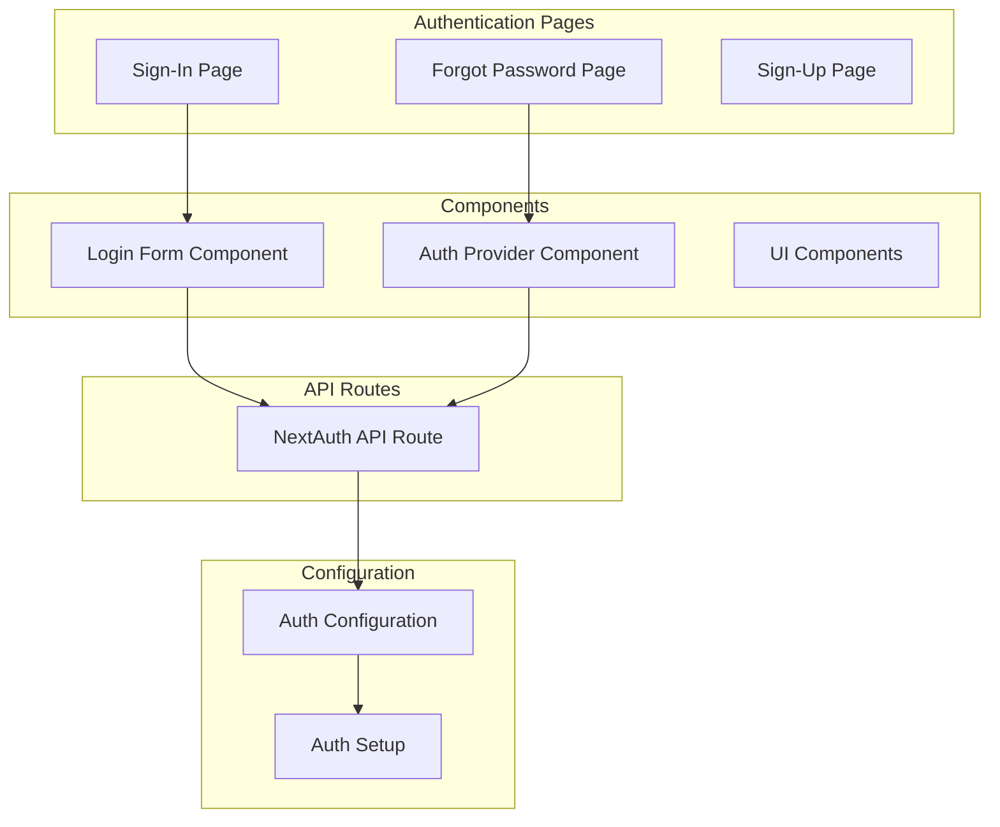
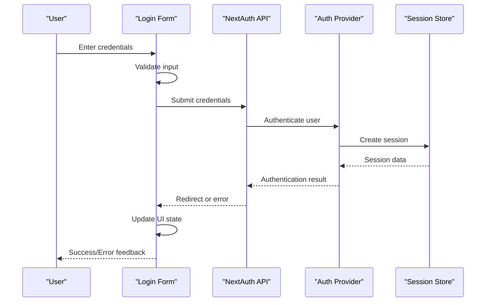
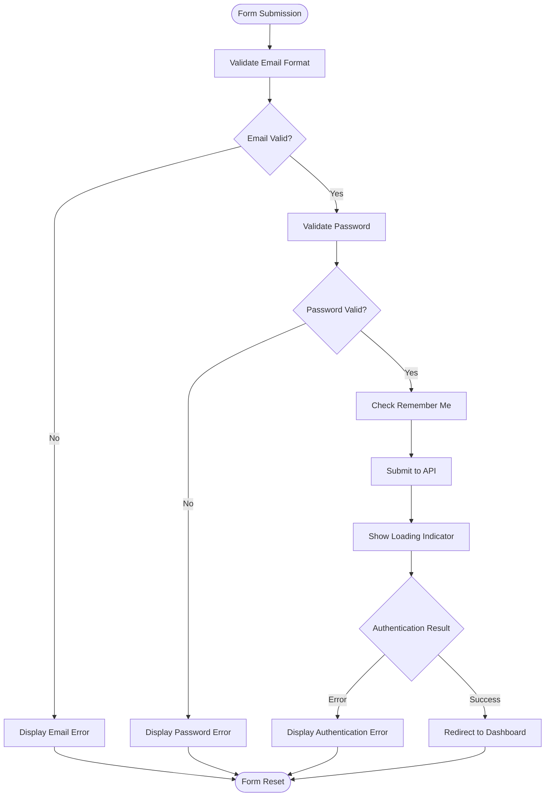
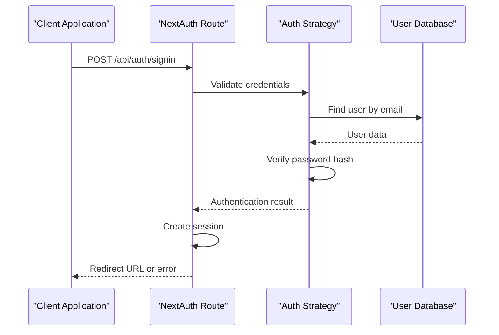
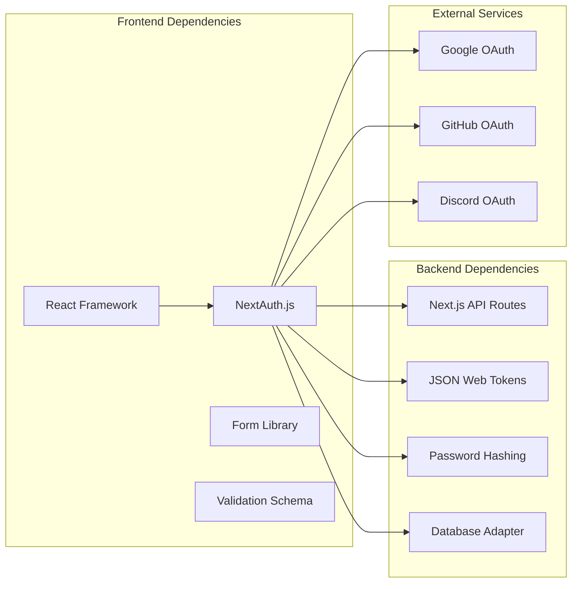

# Sign-In Flow

<cite>
**Referenced Files in This Document**
- [login-form.tsx](file://src/app/(auth)/sign-in/components/login-form.tsx)
- [sign-in page](file://src/app/(auth)/sign-in/page.tsx)
- [auth configuration](file://src/auth.config.ts)
- [auth setup](file://src/auth.ts)
- [NextAuth API route](file://src/app/api/auth/[...nextauth]/route.ts)
- [forgot password form](file://src/app/(auth)/forgot-password/components/forgot-password-form.tsx)
- [auth provider component](file://src/components/auth-provider.tsx)
- [NextAuth type definitions](file://src/types/next-auth.d.ts)
</cite>

## Table of Contents
1. [Introduction](#introduction)
2. [Project Structure](#project-structure)
3. [Core Components](#core-components)
4. [Architecture Overview](#architecture-overview)
5. [Detailed Component Analysis](#detailed-component-analysis)
6. [Dependency Analysis](#dependency-analysis)
7. [Performance Considerations](#performance-considerations)
8. [Troubleshooting Guide](#troubleshooting-guide)
9. [Security Best Practices](#security-best-practices)
10. [Conclusion](#conclusion)

## Introduction

This document provides comprehensive documentation for the sign-in authentication flow implementation in the Next.js dashboard application. The authentication system is built using NextAuth.js, providing secure email/password authentication along with social login capabilities. The implementation includes proper form validation, error handling, user feedback mechanisms, and accessibility considerations.

The sign-in flow supports multiple authentication methods including traditional email/password credentials and various social providers, with features like "remember me" functionality and account recovery options.

## Project Structure

The authentication system follows a modular architecture with clear separation of concerns:

**Diagram sources**
- [sign-in page](file://src/app/(auth)/sign-in/page.tsx)
- [login-form.tsx](file://src/app/(auth)/sign-in/components/login-form.tsx)
- [NextAuth API route](file://src/app/api/auth/[...nextauth]/route.ts)
- [auth configuration](file://src/auth.config.ts)

**Section sources**
- [sign-in page](file://src/app/(auth)/sign-in/page.tsx)
- [login-form.tsx](file://src/app/(auth)/sign-in/components/login-form.tsx)
- [auth configuration](file://src/auth.config.ts)

## Core Components

### Login Form Implementation

The login form component handles user input collection, validation, and submission to the authentication system. It implements real-time validation, loading states, and user feedback mechanisms.

Key features include:
- Email format validation with regex patterns
- Password strength requirements
- Form state management
- Loading indicator during authentication
- Error message display
- Accessibility attributes (ARIA labels, keyboard navigation)

### Authentication Provider Integration

The authentication provider wraps the application with NextAuth.js context, enabling session management and authentication state throughout the application.

### API Route Configuration

The NextAuth API route serves as the central authentication endpoint, handling all authentication requests and responses.

**Section sources**
- [login-form.tsx](file://src/app/(auth)/sign-in/components/login-form.tsx)
- [auth provider component](file://src/components/auth-provider.tsx)
- [NextAuth API route](file://src/app/api/auth/[...nextauth]/route.ts)

## Architecture Overview

The authentication architecture follows a client-server pattern with NextAuth.js managing the authentication lifecycle:

**Diagram sources**
- [login-form.tsx](file://src/app/(auth)/sign-in/components/login-form.tsx)
- [NextAuth API route](file://src/app/api/auth/[...nextauth]/route.ts)
- [auth configuration](file://src/auth.config.ts)

## Detailed Component Analysis

### Login Form Component

The login form component implements comprehensive user input handling and validation:

#### Form Validation Logic

**Diagram sources**
- [login-form.tsx](file://src/app/(auth)/sign-in/components/login-form.tsx)

#### Error Handling Strategy

The form implements layered error handling:
- Client-side validation errors (immediate feedback)
- Network errors (connection issues)
- Authentication errors (invalid credentials)
- Server errors (unexpected failures)

Each error type displays appropriate user messages while maintaining security by not revealing sensitive information.

**Section sources**
- [login-form.tsx](file://src/app/(auth)/sign-in/components/login-form.tsx)

### Authentication Provider Configuration

The authentication provider configures NextAuth.js with multiple strategies:

#### Supported Authentication Providers

| Provider Type | Configuration | Features |
|---------------|---------------|----------|
| Credentials | Email/Password | Custom validation, remember me |
| Google OAuth | Social Login | Profile sync, automatic registration |
| GitHub OAuth | Social Login | Repository access, profile sync |
| Discord OAuth | Social Login | Community features integration |

#### Session Management

The provider manages session persistence, token refresh, and automatic logout handling.

**Section sources**
- [auth configuration](file://src/auth.config.ts)
- [auth setup](file://src/auth.ts)

### API Route Implementation

The NextAuth API route handles all authentication endpoints:

#### Request Flow

**Diagram sources**
- [NextAuth API route](file://src/app/api/auth/[...nextauth]/route.ts)
- [auth configuration](file://src/auth.config.ts)

**Section sources**
- [NextAuth API route](file://src/app/api/auth/[...nextauth]/route.ts)

## Dependency Analysis

The authentication system has well-defined dependencies between components:

**Diagram sources**
- [auth configuration](file://src/auth.config.ts)
- [auth setup](file://src/auth.ts)

**Section sources**
- [auth configuration](file://src/auth.config.ts)
- [auth setup](file://src/auth.ts)

## Performance Considerations

### Form Optimization

- **Debounced Validation**: Input validation is debounced to prevent excessive re-renders
- **Lazy Loading**: Authentication libraries are loaded on-demand
- **Caching**: Session data is cached locally to reduce API calls
- **Progressive Enhancement**: Basic form functionality works without JavaScript

### Security Optimizations

- **Rate Limiting**: Prevents brute force attacks through request throttling
- **Input Sanitization**: All user inputs are sanitized before processing
- **Secure Headers**: Proper security headers are set on authentication responses
- **HTTPS Enforcement**: All authentication flows require HTTPS connections

## Troubleshooting Guide

### Common Issues and Solutions

#### Authentication Failures

| Issue | Symptoms | Solution |
|-------|----------|----------|
| Invalid Credentials | "Invalid email or password" error | Verify user exists and password is correct |
| Network Errors | Connection timeout or failed requests | Check internet connection and server availability |
| Session Expired | Automatic logout after inactivity | Implement auto-refresh tokens or re-login prompt |
| CORS Errors | Cross-origin request blocked | Configure allowed origins in NextAuth settings |

#### Form Validation Issues

- **Email Validation**: Ensure proper email format validation
- **Password Requirements**: Check minimum length and complexity rules
- **Real-time Feedback**: Verify validation triggers on input changes

#### Debugging Tips

1. Enable development logging for authentication flows
2. Check browser console for JavaScript errors
3. Inspect network requests in developer tools
4. Verify environment variables are properly configured

**Section sources**
- [login-form.tsx](file://src/app/(auth)/sign-in/components/login-form.tsx)
- [auth configuration](file://src/auth.config.ts)

## Security Best Practices

### Password Handling

- **Hash Storage**: Passwords are hashed using bcrypt before storage
- **Transmission Security**: All passwords are transmitted over HTTPS
- **Memory Safety**: Sensitive data is cleared from memory after use
- **Logging Prevention**: Passwords and tokens are never logged

### Session Security

- **HTTP-only Cookies**: Sessions are stored in HTTP-only cookies
- **Secure Flags**: Cookies have secure and same-site flags enabled
- **Token Rotation**: Access tokens are rotated periodically
- **Automatic Expiration**: Sessions expire after configurable time periods

### Input Validation

- **Server-side Validation**: All inputs are validated on the server
- **Type Coercion Prevention**: Strict type checking prevents injection attacks
- **Length Limits**: Input lengths are enforced to prevent buffer overflows
- **Character Whitelisting**: Only allowed characters are accepted

### Social Login Security

- **State Parameter Validation**: CSRF protection through state parameters
- **Nonce Verification**: Additional nonce verification for enhanced security
- **Scope Minimization**: Only necessary permissions are requested
- **Profile Data Validation**: External profile data is validated before use

## Conclusion

The sign-in authentication flow provides a robust, secure, and user-friendly authentication experience. The implementation follows modern web security practices and provides comprehensive error handling and user feedback. The modular architecture allows for easy extension with additional authentication providers and customization of the authentication experience.

Key strengths of the implementation include:
- Comprehensive input validation and error handling
- Multiple authentication provider support
- Strong security measures for password and session management
- Accessible user interface with proper ARIA attributes
- Responsive design that works across devices

Future enhancements could include two-factor authentication, biometric login support, and advanced analytics for authentication metrics.