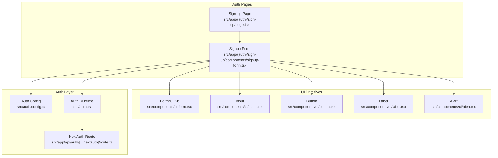
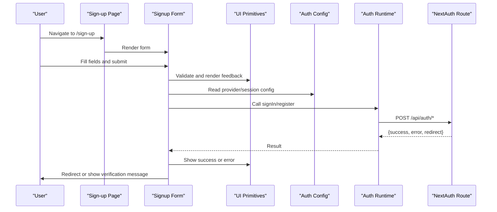
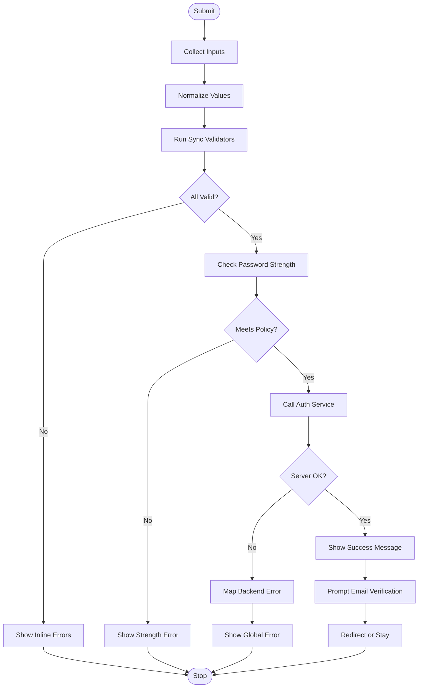
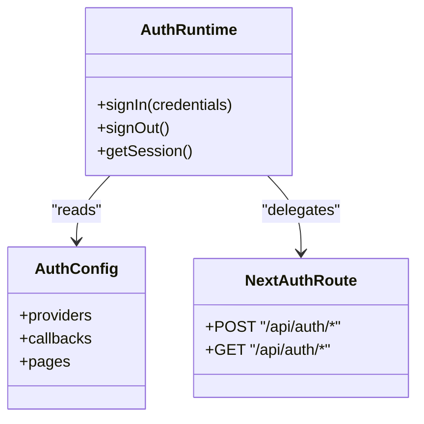
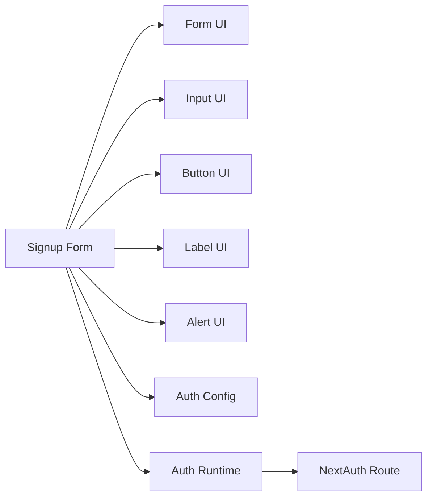

# Sign-Up Flow

<cite>
**Referenced Files in This Document**
- [signup-form.tsx](file://src/app/(auth)/sign-up/components/signup-form.tsx)
- [page.tsx](file://src/app/(auth)/sign-up/page.tsx)
- [auth.ts](file://src/auth.ts)
- [auth.config.ts](file://src/auth.config.ts)
- [route.ts](file://src/app/api/auth/[...nextauth]/route.ts)
- [form.tsx](file://src/components/ui/form.tsx)
- [input.tsx](file://src/components/ui/input.tsx)
- [button.tsx](file://src/components/ui/button.tsx)
- [label.tsx](file://src/components/ui/label.tsx)
- [alert.tsx](file://src/components/ui/alert.tsx)
</cite>

## Table of Contents
1. [Introduction](#introduction)
2. [Project Structure](#project-structure)
3. [Core Components](#core-components)
4. [Architecture Overview](#architecture-overview)
5. [Detailed Component Analysis](#detailed-component-analysis)
6. [Dependency Analysis](#dependency-analysis)
7. [Performance Considerations](#performance-considerations)
8. [Troubleshooting Guide](#troubleshooting-guide)
9. [Conclusion](#conclusion)

## Introduction
This document explains the user registration (sign-up) flow in the application. It covers the signup form implementation, field validation, password strength requirements, confirmation handling, data processing, account creation workflows, integration with authentication services, email verification processes, duplicate account detection, success/error handling patterns, custom validation rules, real-time feedback, and accessibility compliance for form inputs.

## Project Structure
The sign-up feature is organized under the auth route group and uses a Next.js App Router layout. The key files include:
- A page component that renders the sign-up UI
- A form component implementing validation and submission logic
- Authentication configuration and API routes for NextAuth
- Reusable UI primitives for forms and feedback

**Diagram sources**
- [page.tsx](file://src/app/(auth)/sign-up/page.tsx)
- [signup-form.tsx](file://src/app/(auth)/sign-up/components/signup-form.tsx)
- [auth.config.ts](file://src/auth.config.ts)
- [auth.ts](file://src/auth.ts)
- [route.ts](file://src/app/api/auth/[...nextauth]/route.ts)
- [form.tsx](file://src/components/ui/form.tsx)
- [input.tsx](file://src/components/ui/input.tsx)
- [button.tsx](file://src/components/ui/button.tsx)
- [label.tsx](file://src/components/ui/label.tsx)
- [alert.tsx](file://src/components/ui/alert.tsx)

**Section sources**
- [page.tsx](file://src/app/(auth)/sign-up/page.tsx)
- [signup-form.tsx](file://src/app/(auth)/sign-up/components/signup-form.tsx)
- [auth.config.ts](file://src/auth.config.ts)
- [auth.ts](file://src/auth.ts)
- [route.ts](file://src/app/api/auth/[...nextauth]/route.ts)
- [form.tsx](file://src/components/ui/form.tsx)
- [input.tsx](file://src/components/ui/input.tsx)
- [button.tsx](file://src/components/ui/button.tsx)
- [label.tsx](file://src/components/ui/label.tsx)
- [alert.tsx](file://src/components/ui/alert.tsx)

## Core Components
- Signup Page: Renders the sign-up route and mounts the form.
- Signup Form: Implements client-side validation, password strength checks, confirmation matching, submission to authentication endpoints, and user-facing feedback.
- UI Primitives: Provide accessible inputs, labels, buttons, alerts, and form utilities used by the signup form.
- Auth Configuration and Runtime: Define providers, callbacks, and session behavior; expose NextAuth API route.

Key responsibilities:
- Validate fields such as name, email, password, and confirm password.
- Enforce password strength policy and show real-time feedback.
- Handle duplicate account errors and display actionable messages.
- Trigger email verification after successful registration.
- Manage loading states and error boundaries.

**Section sources**
- [page.tsx](file://src/app/(auth)/sign-up/page.tsx)
- [signup-form.tsx](file://src/app/(auth)/sign-up/components/signup-form.tsx)
- [form.tsx](file://src/components/ui/form.tsx)
- [input.tsx](file://src/components/ui/input.tsx)
- [button.tsx](file://src/components/ui/button.tsx)
- [label.tsx](file://src/components/ui/label.tsx)
- [alert.tsx](file://src/components/ui/alert.tsx)
- [auth.config.ts](file://src/auth.config.ts)
- [auth.ts](file://src/auth.ts)
- [route.ts](file://src/app/api/auth/[...nextauth]/route.ts)

## Architecture Overview
The sign-up flow integrates the frontend form with NextAuth for authentication and optional server-side account creation or provider-based flows.

**Diagram sources**
- [page.tsx](file://src/app/(auth)/sign-up/page.tsx)
- [signup-form.tsx](file://src/app/(auth)/sign-up/components/signup-form.tsx)
- [auth.config.ts](file://src/auth.config.ts)
- [auth.ts](file://src/auth.ts)
- [route.ts](file://src/app/api/auth/[...nextauth]/route.ts)

## Detailed Component Analysis

### Signup Form Implementation
Responsibilities:
- Field-level validation for required fields, format checks, and constraints.
- Password strength enforcement with real-time feedback.
- Password confirmation matching.
- Submission orchestration to authentication services.
- Error aggregation and user-friendly messaging.
- Accessibility attributes for inputs and labels.

Validation strategy:
- Required fields: name, email, password, confirm password.
- Email format validation.
- Password strength policy: minimum length, uppercase, lowercase, number, special character.
- Confirm password must match password.
- Real-time validation on input change and blur events.

Password strength requirements:
- Minimum length threshold.
- Character class diversity (uppercase, lowercase, digits, symbols).
- Visual indicator showing current strength level.

Confirmation handling:
- Compare password and confirm password values.
- Display inline error when mismatched.
- Disable submit until all validations pass.

Data processing:
- Normalize inputs (trim whitespace, lowercase email).
- Sanitize before sending to backend.
- Map backend errors to user-readable messages.

Integration with authentication services:
- Use configured auth runtime to initiate registration/sign-in flow.
- Handle provider-specific responses and redirects.
- Surface provider errors (e.g., duplicate accounts).

Email verification process:
- On successful registration, inform the user to check their inbox.
- Optionally redirect to a verification status page.
- Support resending verification emails if needed.

Duplicate account detection:
- Detect provider or database errors indicating existing accounts.
- Present clear guidance to sign in or recover credentials.

Success/error handling patterns:
- Centralized error mapping for consistent UX.
- Loading state management during submission.
- Toast or alert notifications for transient errors.

Custom validation rules:
- Implement reusable validators for complex business rules.
- Compose validators for multi-field scenarios.

Real-time feedback:
- Inline validation messages near inputs.
- Strength meter updates on keystroke.
- Debounced async checks where appropriate.

Accessibility compliance:
- Associate labels with inputs via htmlFor/id.
- Provide aria-invalid and aria-describedby for errors.
- Ensure keyboard navigation and focus management.
- Announce dynamic changes with aria-live regions for alerts.

**Diagram sources**
- [signup-form.tsx](file://src/app/(auth)/sign-up/components/signup-form.tsx)
- [form.tsx](file://src/components/ui/form.tsx)
- [input.tsx](file://src/components/ui/input.tsx)
- [button.tsx](file://src/components/ui/button.tsx)
- [label.tsx](file://src/components/ui/label.tsx)
- [alert.tsx](file://src/components/ui/alert.tsx)

**Section sources**
- [signup-form.tsx](file://src/app/(auth)/sign-up/components/signup-form.tsx)
- [form.tsx](file://src/components/ui/form.tsx)
- [input.tsx](file://src/components/ui/input.tsx)
- [button.tsx](file://src/components/ui/button.tsx)
- [label.tsx](file://src/components/ui/label.tsx)
- [alert.tsx](file://src/components/ui/alert.tsx)

### Authentication Integration
- Provider configuration defines supported identity providers and strategies.
- Auth runtime exposes methods to initiate sign-in or registration flows.
- NextAuth API route handles provider callbacks and session management.

Key behaviors:
- Configure callbacks to handle new user creation and profile enrichment.
- Return structured results to the form for consistent UX.
- Persist sessions and manage redirects post-registration.

**Diagram sources**
- [auth.config.ts](file://src/auth.config.ts)
- [auth.ts](file://src/auth.ts)
- [route.ts](file://src/app/api/auth/[...nextauth]/route.ts)

**Section sources**
- [auth.config.ts](file://src/auth.config.ts)
- [auth.ts](file://src/auth.ts)
- [route.ts](file://src/app/api/auth/[...nextauth]/route.ts)

### UI Primitives and Accessibility
- Form utilities provide schema-driven validation and state management.
- Input and label components ensure proper association and semantics.
- Alert components communicate success and error states consistently.
- Button components support disabled states and loading indicators.

Accessibility highlights:
- Proper labeling and descriptions.
- Keyboard navigability and visible focus states.
- Screen reader announcements for dynamic content.

**Section sources**
- [form.tsx](file://src/components/ui/form.tsx)
- [input.tsx](file://src/components/ui/input.tsx)
- [button.tsx](file://src/components/ui/button.tsx)
- [label.tsx](file://src/components/ui/label.tsx)
- [alert.tsx](file://src/components/ui/alert.tsx)

## Dependency Analysis
The sign-up flow depends on:
- UI primitives for rendering and validation.
- Auth configuration and runtime for authentication.
- NextAuth API route for provider interactions.

**Diagram sources**
- [signup-form.tsx](file://src/app/(auth)/sign-up/components/signup-form.tsx)
- [form.tsx](file://src/components/ui/form.tsx)
- [input.tsx](file://src/components/ui/input.tsx)
- [button.tsx](file://src/components/ui/button.tsx)
- [label.tsx](file://src/components/ui/label.tsx)
- [alert.tsx](file://src/components/ui/alert.tsx)
- [auth.config.ts](file://src/auth.config.ts)
- [auth.ts](file://src/auth.ts)
- [route.ts](file://src/app/api/auth/[...nextauth]/route.ts)

**Section sources**
- [signup-form.tsx](file://src/app/(auth)/sign-up/components/signup-form.tsx)
- [form.tsx](file://src/components/ui/form.tsx)
- [input.tsx](file://src/components/ui/input.tsx)
- [button.tsx](file://src/components/ui/button.tsx)
- [label.tsx](file://src/components/ui/label.tsx)
- [alert.tsx](file://src/components/ui/alert.tsx)
- [auth.config.ts](file://src/auth.config.ts)
- [auth.ts](file://src/auth.ts)
- [route.ts](file://src/app/api/auth/[...nextauth]/route.ts)

## Performance Considerations
- Debounce asynchronous validations to reduce network calls.
- Avoid re-validating entire forms on every keystroke; validate per-field.
- Minimize re-renders by memoizing validation results and derived state.
- Keep password strength checks lightweight and local.
- Use optimistic UI updates only when safe; revert on failure.

## Troubleshooting Guide
Common issues and resolutions:
- Duplicate account error: Prompt users to sign in or reset password; surface provider-specific hints.
- Invalid email format: Show inline guidance and correct formatting examples.
- Weak password: Update strength meter and list missing criteria.
- Network failures: Retry once with backoff; show retry action and fallback message.
- Session inconsistencies: Clear stale sessions and re-authenticate.

Operational tips:
- Log detailed but non-sensitive error context for debugging.
- Instrument submission timing and error rates.
- Monitor provider callback logs for misconfigurations.

**Section sources**
- [signup-form.tsx](file://src/app/(auth)/sign-up/components/signup-form.tsx)
- [auth.config.ts](file://src/auth.config.ts)
- [auth.ts](file://src/auth.ts)
- [route.ts](file://src/app/api/auth/[...nextauth]/route.ts)

## Conclusion
The sign-up flow combines robust client-side validation, clear user feedback, and reliable integration with authentication services. By enforcing password policies, handling duplicates, prompting email verification, and maintaining accessibility standards, it delivers a secure and user-friendly registration experience.