# User Authentication Flows

<cite>
**Referenced Files in This Document**
- [auth.ts](file://src/auth.ts)
- [auth.config.ts](file://src/auth.config.ts)
- [next-auth.d.ts](file://src/types/next-auth.d.ts)
- [route.ts](file://src/app/api/auth/[...nextauth]/route.ts)
- [layout.tsx](file://src/app/(auth)/layout.tsx)
- [page.tsx](file://src/app/(auth)/sign-in/page.tsx)
- [login-form.tsx](file://src/app/(auth)/sign-in/components/login-form.tsx)
- [page.tsx](file://src/app/(auth)/sign-up/page.tsx)
- [signup-form.tsx](file://src/app/(auth)/sign-up/components/signup-form.tsx)
- [page.tsx](file://src/app/(auth)/forgot-password/page.tsx)
- [forgot-password-form.tsx](file://src/app/(auth)/forgot-password/components/forgot-password-form.tsx)
- [auth-provider.tsx](file://src/components/auth-provider.tsx)
- [base-layout.tsx](file://src/components/layouts/base-layout.tsx)
</cite>

## Table of Contents
1. [Introduction](#introduction)
2. [Project Structure](#project-structure)
3. [Core Components](#core-components)
4. [Architecture Overview](#architecture-overview)
5. [Detailed Component Analysis](#detailed-component-analysis)
6. [Dependency Analysis](#dependency-analysis)
7. [Performance Considerations](#performance-considerations)
8. [Troubleshooting Guide](#troubleshooting-guide)
9. [Conclusion](#conclusion)
10. [Appendices](#appendices)

## Introduction
This document explains the user authentication flows implemented in the application, including sign-in, sign-up, and password reset. It covers form implementations with validation and feedback, NextAuth.js integration, state management via the auth provider, redirect handling after successful login, logout procedures, social login buttons, email verification flows, account linking scenarios, error handling, loading states, and accessibility considerations.

## Project Structure
Authentication-related code is organized under:
- App routes for authentication pages (sign-in, sign-up, forgot-password)
- API route for NextAuth.js handlers
- Auth configuration and types
- UI components for forms and layout wrappers
- Auth provider to expose session state to the app

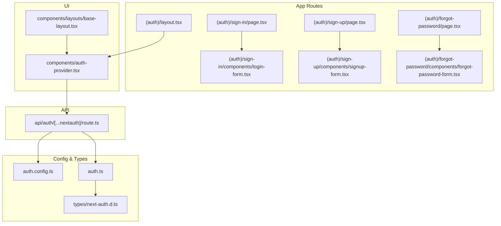

**Diagram sources**
- [layout.tsx](file://src/app/(auth)/layout.tsx#L1-L200)
- [page.tsx](file://src/app/(auth)/sign-in/page.tsx#L1-L200)
- [login-form.tsx](file://src/app/(auth)/sign-in/components/login-form.tsx#L1-L200)
- [page.tsx](file://src/app/(auth)/sign-up/page.tsx#L1-L200)
- [signup-form.tsx](file://src/app/(auth)/sign-up/components/signup-form.tsx#L1-L200)
- [page.tsx](file://src/app/(auth)/forgot-password/page.tsx#L1-L200)
- [forgot-password-form.tsx](file://src/app/(auth)/forgot-password/components/forgot-password-form.tsx#L1-L200)
- [route.ts:1-200](file://src/app/api/auth/[...nextauth]/route.ts#L1-L200)
- [auth.config.ts:1-200](file://src/auth.config.ts#L1-L200)
- [auth.ts:1-200](file://src/auth.ts#L1-L200)
- [next-auth.d.ts:1-200](file://src/types/next-auth.d.ts#L1-L200)
- [auth-provider.tsx:1-200](file://src/components/auth-provider.tsx#L1-L200)
- [base-layout.tsx:1-200](file://src/components/layouts/base-layout.tsx#L1-L200)

**Section sources**
- [layout.tsx](file://src/app/(auth)/layout.tsx#L1-L200)
- [route.ts:1-200](file://src/app/api/auth/[...nextauth]/route.ts#L1-L200)
- [auth.config.ts:1-200](file://src/auth.config.ts#L1-L200)
- [auth.ts:1-200](file://src/auth.ts#L1-L200)
- [next-auth.d.ts:1-200](file://src/types/next-auth.d.ts#L1-L200)
- [auth-provider.tsx:1-200](file://src/components/auth-provider.tsx#L1-L200)
- [base-layout.tsx:1-200](file://src/components/layouts/base-layout.tsx#L1-L200)

## Core Components
- NextAuth.js API route: Exposes the standard NextAuth endpoints for credential and provider-based authentication.
- Auth configuration: Centralizes providers, callbacks, and adapter settings.
- Auth provider: Wraps the app to provide session state and helpers like signIn/signOut.
- Auth pages and forms: Sign-in, sign-up, and forgot-password pages that render validated forms and handle user feedback.
- Layouts: The (auth) layout wraps authentication pages; base layout integrates the auth provider.

Key responsibilities:
- Route-level orchestration of authentication actions
- Client-side form validation and submission
- Server-side session creation and provider callbacks
- Global session availability through the provider

**Section sources**
- [route.ts:1-200](file://src/app/api/auth/[...nextauth]/route.ts#L1-L200)
- [auth.config.ts:1-200](file://src/auth.config.ts#L1-L200)
- [auth.ts:1-200](file://src/auth.ts#L1-L200)
- [auth-provider.tsx:1-200](file://src/components/auth-provider.tsx#L1-L200)
- [layout.tsx](file://src/app/(auth)/layout.tsx#L1-L200)

## Architecture Overview
The authentication architecture follows a client-server pattern using NextAuth.js:
- Client pages call signIn/signOut from the auth provider.
- Credentials or OAuth flows are handled by the NextAuth API route.
- Callbacks in the auth config manage user creation, linking, and session augmentation.
- Protected routes rely on session checks and redirects.

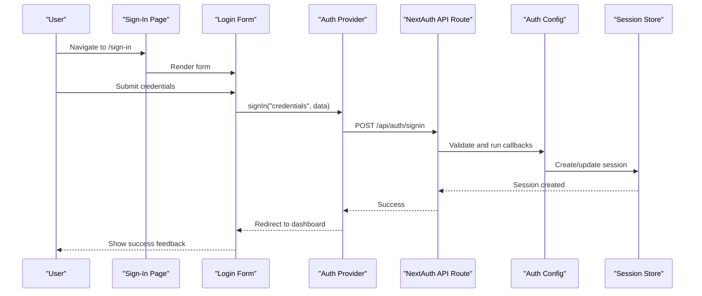

**Diagram sources**
- [page.tsx](file://src/app/(auth)/sign-in/page.tsx#L1-L200)
- [login-form.tsx](file://src/app/(auth)/sign-in/components/login-form.tsx#L1-L200)
- [auth-provider.tsx:1-200](file://src/components/auth-provider.tsx#L1-L200)
- [route.ts:1-200](file://src/app/api/auth/[...nextauth]/route.ts#L1-L200)
- [auth.config.ts:1-200](file://src/auth.config.ts#L1-L200)

## Detailed Component Analysis

### Sign-In Flow
- Page renders a form component and handles navigation after success.
- Form validates inputs, calls signIn with credentials, and displays errors or success messages.
- On success, NextAuth creates a session and the client can redirect to a protected route.

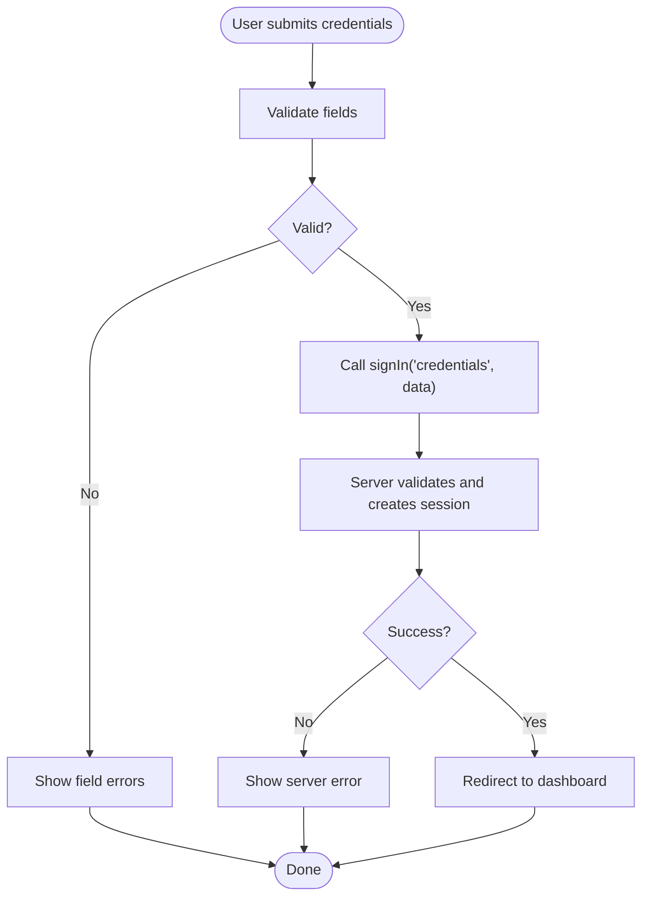

**Diagram sources**
- [login-form.tsx](file://src/app/(auth)/sign-in/components/login-form.tsx#L1-L200)
- [auth-provider.tsx:1-200](file://src/components/auth-provider.tsx#L1-L200)
- [route.ts:1-200](file://src/app/api/auth/[...nextauth]/route.ts#L1-L200)
- [auth.config.ts:1-200](file://src/auth.config.ts#L1-L200)

**Section sources**
- [page.tsx](file://src/app/(auth)/sign-in/page.tsx#L1-L200)
- [login-form.tsx](file://src/app/(auth)/sign-in/components/login-form.tsx#L1-L200)
- [auth-provider.tsx:1-200](file://src/components/auth-provider.tsx#L1-L200)
- [route.ts:1-200](file://src/app/api/auth/[...nextauth]/route.ts#L1-L200)
- [auth.config.ts:1-200](file://src/auth.config.ts#L1-L200)

### Sign-Up Flow
- Page renders a signup form with validation rules.
- On submit, the form calls the appropriate API endpoint or NextAuth callback to create an account.
- After successful registration, users may be redirected to sign-in or directly signed in depending on configuration.

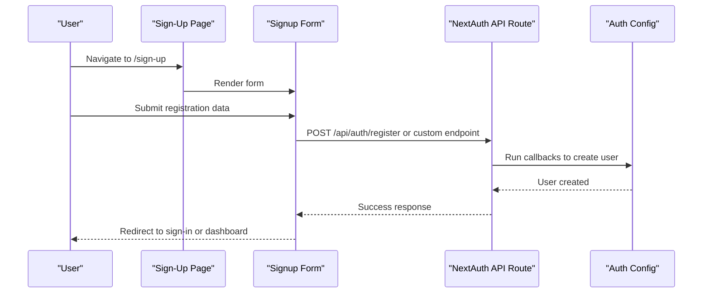

**Diagram sources**
- [page.tsx](file://src/app/(auth)/sign-up/page.tsx#L1-L200)
- [signup-form.tsx](file://src/app/(auth)/sign-up/components/signup-form.tsx#L1-L200)
- [route.ts:1-200](file://src/app/api/auth/[...nextauth]/route.ts#L1-L200)
- [auth.config.ts:1-200](file://src/auth.config.ts#L1-L200)

**Section sources**
- [page.tsx](file://src/app/(auth)/sign-up/page.tsx#L1-L200)
- [signup-form.tsx](file://src/app/(auth)/sign-up/components/signup-form.tsx#L1-L200)
- [route.ts:1-200](file://src/app/api/auth/[...nextauth]/route.ts#L1-L200)
- [auth.config.ts:1-200](file://src/auth.config.ts#L1-L200)

### Password Reset Flow
- Page renders a forgot-password form requesting the user’s email.
- On submit, the system sends a password reset link via email.
- Users follow the link to set a new password; upon success, they are redirected to sign-in.

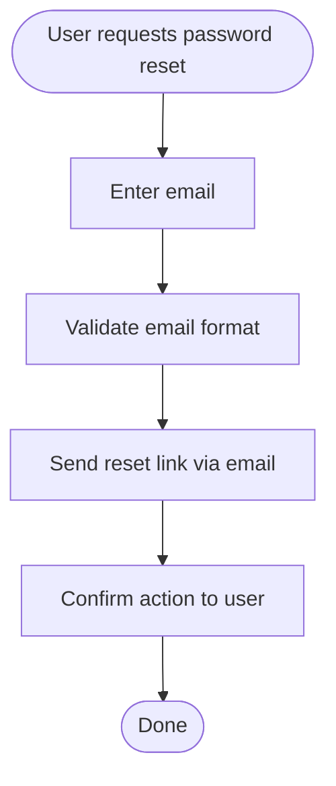

**Diagram sources**
- [page.tsx](file://src/app/(auth)/forgot-password/page.tsx#L1-L200)
- [forgot-password-form.tsx](file://src/app/(auth)/forgot-password/components/forgot-password-form.tsx#L1-L200)

**Section sources**
- [page.tsx](file://src/app/(auth)/forgot-password/page.tsx#L1-L200)
- [forgot-password-form.tsx](file://src/app/(auth)/forgot-password/components/forgot-password-form.tsx#L1-L200)

### Social Login Buttons
- Add social providers in the auth configuration.
- Use the auth provider’s signIn method with the provider name to initiate OAuth flows.
- Handle success and error states in the UI.

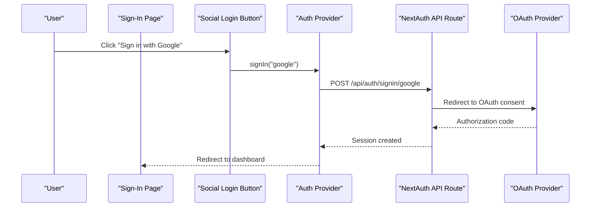

**Diagram sources**
- [auth.config.ts:1-200](file://src/auth.config.ts#L1-L200)
- [auth-provider.tsx:1-200](file://src/components/auth-provider.tsx#L1-L200)
- [route.ts:1-200](file://src/app/api/auth/[...nextauth]/route.ts#L1-L200)

**Section sources**
- [auth.config.ts:1-200](file://src/auth.config.ts#L1-L200)
- [auth-provider.tsx:1-200](file://src/components/auth-provider.tsx#L1-L200)
- [route.ts:1-200](file://src/app/api/auth/[...nextauth]/route.ts#L1-L200)

### Email Verification Flows
- Configure verification callbacks to check if a user’s email is verified.
- If unverified, redirect to a verification page or show a message prompting the user to verify their email.
- After verification, allow access to protected routes.

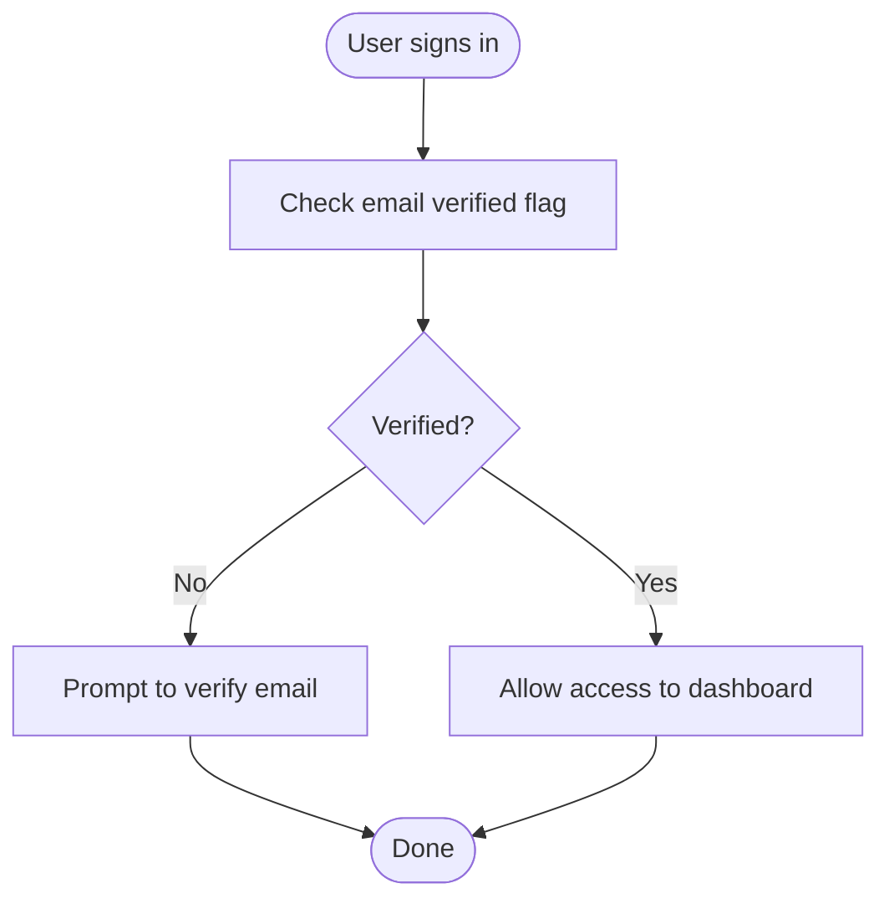

**Diagram sources**
- [auth.config.ts:1-200](file://src/auth.config.ts#L1-L200)
- [next-auth.d.ts:1-200](file://src/types/next-auth.d.ts#L1-L200)

**Section sources**
- [auth.config.ts:1-200](file://src/auth.config.ts#L1-L200)
- [next-auth.d.ts:1-200](file://src/types/next-auth.d.ts#L1-L200)

### Account Linking Scenarios
- Implement callbacks to detect when a user attempts to sign in with an existing account linked to another identity.
- Provide UI to guide users through linking accounts or merging identities.
- Update session and database accordingly.

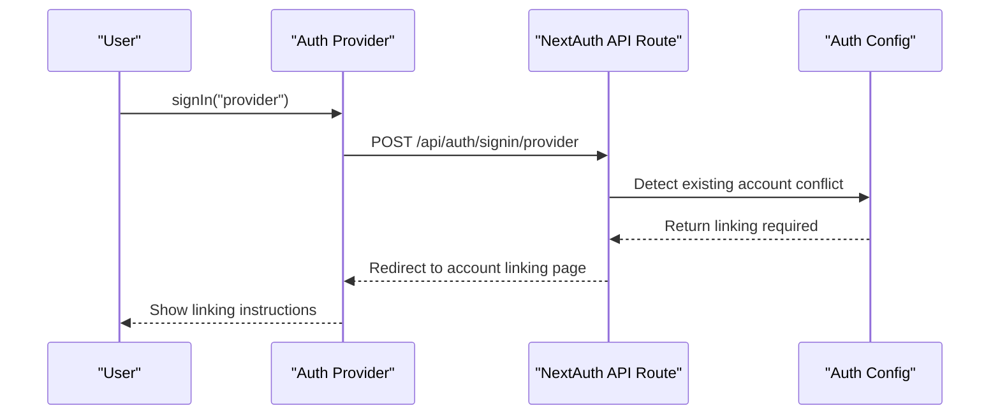

**Diagram sources**
- [auth.config.ts:1-200](file://src/auth.config.ts#L1-L200)
- [route.ts:1-200](file://src/app/api/auth/[...nextauth]/route.ts#L1-L200)

**Section sources**
- [auth.config.ts:1-200](file://src/auth.config.ts#L1-L200)
- [route.ts:1-200](file://src/app/api/auth/[...nextauth]/route.ts#L1-L200)

### Logout Procedures
- Use the auth provider’s signOut method to clear the session.
- Optionally redirect to sign-in or home page after logout.
- Ensure UI updates to reflect unauthenticated state.

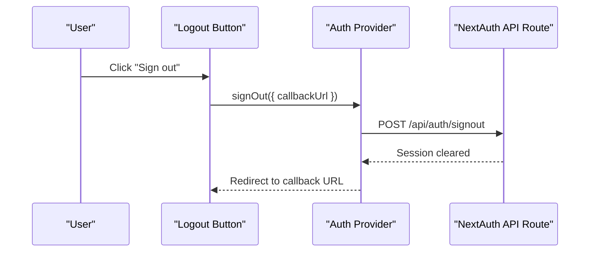

**Diagram sources**
- [auth-provider.tsx:1-200](file://src/components/auth-provider.tsx#L1-L200)
- [route.ts:1-200](file://src/app/api/auth/[...nextauth]/route.ts#L1-L200)

**Section sources**
- [auth-provider.tsx:1-200](file://src/components/auth-provider.tsx#L1-L200)
- [route.ts:1-200](file://src/app/api/auth/[...nextauth]/route.ts#L1-L200)

### Form Components Architecture and Validation
- Each authentication page composes a dedicated form component.
- Forms validate inputs before submission and display inline errors.
- Use consistent UI primitives for labels, inputs, and feedback.

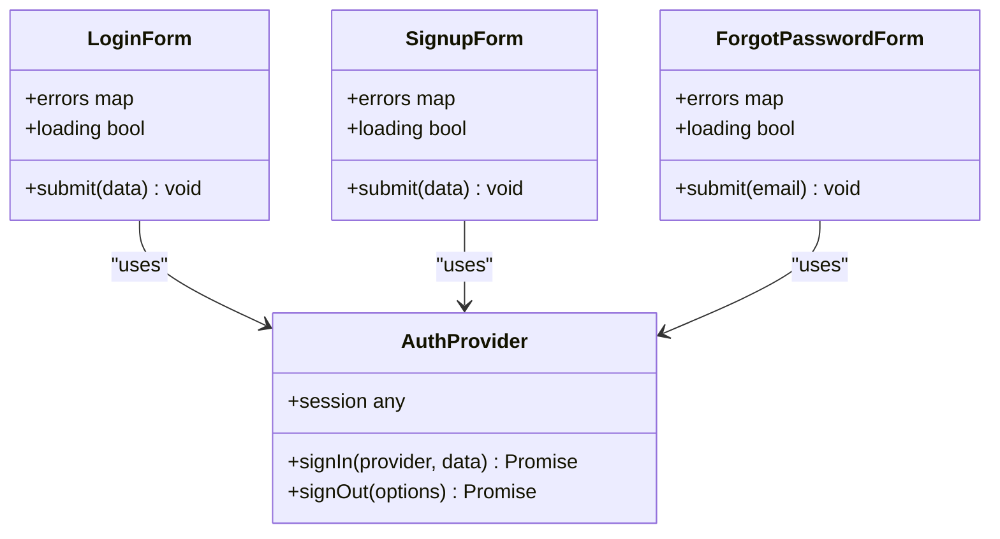

**Diagram sources**
- [login-form.tsx](file://src/app/(auth)/sign-in/components/login-form.tsx#L1-L200)
- [signup-form.tsx](file://src/app/(auth)/sign-up/components/signup-form.tsx#L1-L200)
- [forgot-password-form.tsx](file://src/app/(auth)/forgot-password/components/forgot-password-form.tsx#L1-L200)
- [auth-provider.tsx:1-200](file://src/components/auth-provider.tsx#L1-L200)

**Section sources**
- [login-form.tsx](file://src/app/(auth)/sign-in/components/login-form.tsx#L1-L200)
- [signup-form.tsx](file://src/app/(auth)/sign-up/components/signup-form.tsx#L1-L200)
- [forgot-password-form.tsx](file://src/app/(auth)/forgot-password/components/forgot-password-form.tsx#L1-L200)
- [auth-provider.tsx:1-200](file://src/components/auth-provider.tsx#L1-L200)

### Integration with NextAuth.js Callbacks
- Define callbacks in the auth configuration to handle events such as signIn, createUser, and session.
- Use these callbacks to enforce business logic like email verification, account linking, and session augmentation.
- Extend NextAuth types to ensure type safety across the app.

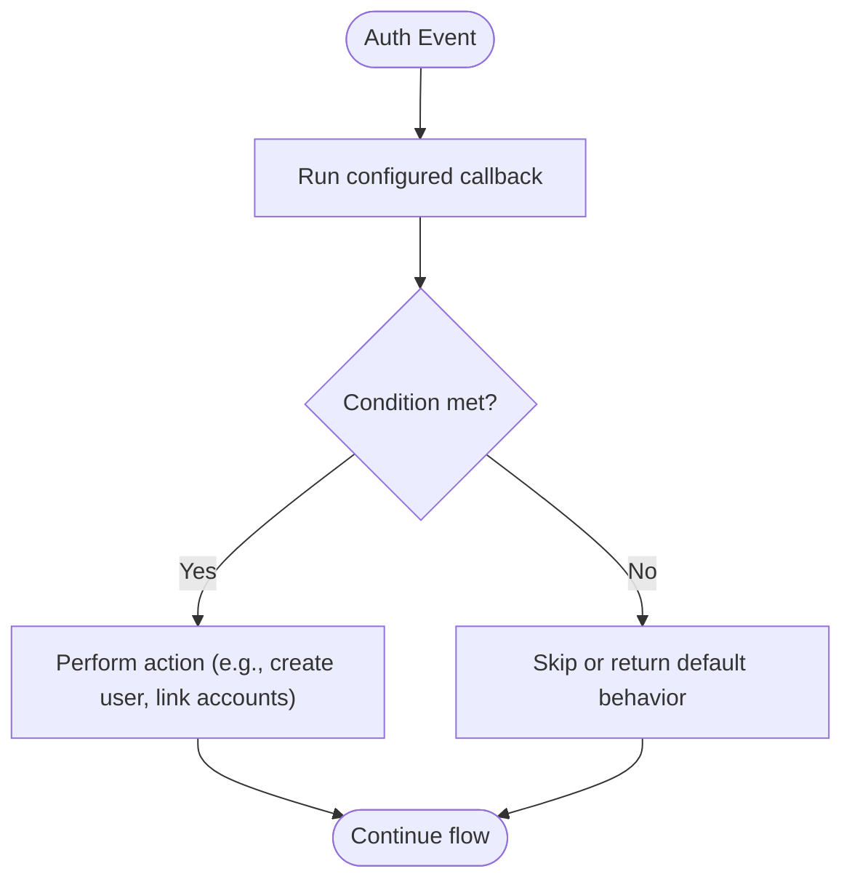

**Diagram sources**
- [auth.config.ts:1-200](file://src/auth.config.ts#L1-L200)
- [next-auth.d.ts:1-200](file://src/types/next-auth.d.ts#L1-L200)

**Section sources**
- [auth.config.ts:1-200](file://src/auth.config.ts#L1-L200)
- [next-auth.d.ts:1-200](file://src/types/next-auth.d.ts#L1-L200)

## Dependency Analysis
The authentication subsystem depends on:
- NextAuth.js API route for all auth endpoints
- Auth configuration for providers and callbacks
- Auth provider for client-side session and helpers
- Pages and forms for user interactions

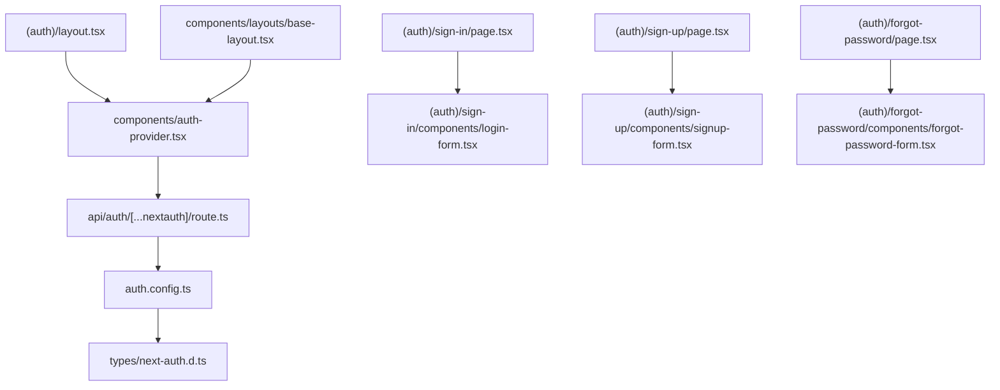

**Diagram sources**
- [layout.tsx](file://src/app/(auth)/layout.tsx#L1-L200)
- [auth-provider.tsx:1-200](file://src/components/auth-provider.tsx#L1-L200)
- [page.tsx](file://src/app/(auth)/sign-in/page.tsx#L1-L200)
- [login-form.tsx](file://src/app/(auth)/sign-in/components/login-form.tsx#L1-L200)
- [page.tsx](file://src/app/(auth)/sign-up/page.tsx#L1-L200)
- [signup-form.tsx](file://src/app/(auth)/sign-up/components/signup-form.tsx#L1-L200)
- [page.tsx](file://src/app/(auth)/forgot-password/page.tsx#L1-L200)
- [forgot-password-form.tsx](file://src/app/(auth)/forgot-password/components/forgot-password-form.tsx#L1-L200)
- [route.ts:1-200](file://src/app/api/auth/[...nextauth]/route.ts#L1-L200)
- [auth.config.ts:1-200](file://src/auth.config.ts#L1-L200)
- [next-auth.d.ts:1-200](file://src/types/next-auth.d.ts#L1-L200)
- [base-layout.tsx:1-200](file://src/components/layouts/base-layout.tsx#L1-L200)

**Section sources**
- [layout.tsx](file://src/app/(auth)/layout.tsx#L1-L200)
- [auth-provider.tsx:1-200](file://src/components/auth-provider.tsx#L1-L200)
- [route.ts:1-200](file://src/app/api/auth/[...nextauth]/route.ts#L1-L200)
- [auth.config.ts:1-200](file://src/auth.config.ts#L1-L200)
- [next-auth.d.ts:1-200](file://src/types/next-auth.d.ts#L1-L200)
- [base-layout.tsx:1-200](file://src/components/layouts/base-layout.tsx#L1-L200)

## Performance Considerations
- Minimize re-renders by keeping form state local and only lifting necessary state to parent components.
- Debounce network requests where applicable (e.g., checking username/email uniqueness).
- Use optimistic UI updates for better perceived performance, with rollback on failure.
- Avoid heavy computations during callbacks; delegate to background jobs if needed.

[No sources needed since this section provides general guidance]

## Troubleshooting Guide
Common issues and resolutions:
- Invalid credentials: Display clear error messages near the relevant fields and ensure focus management for accessibility.
- Network failures: Show retry prompts and maintain form values to avoid re-entry.
- Session inconsistencies: Verify that the auth provider is correctly wrapping the app and that protected routes check session state.
- Social login loops: Ensure correct callback URLs and provider configurations.
- Email verification blocks: Confirm that verification flags are updated and callbacks redirect appropriately.

**Section sources**
- [auth-provider.tsx:1-200](file://src/components/auth-provider.tsx#L1-L200)
- [auth.config.ts:1-200](file://src/auth.config.ts#L1-L200)
- [route.ts:1-200](file://src/app/api/auth/[...nextauth]/route.ts#L1-L200)

## Conclusion
The authentication system leverages NextAuth.js for robust credential and provider-based flows, with well-structured forms and clear user feedback. Callbacks centralize business logic for verification and linking, while the auth provider ensures consistent session access. Following the patterns outlined here will help implement secure, accessible, and user-friendly authentication experiences.

[No sources needed since this section summarizes without analyzing specific files]

## Appendices

### Accessibility Considerations
- Associate labels with inputs and provide descriptive error messages.
- Ensure keyboard navigability and visible focus indicators.
- Announce loading and success states to assistive technologies.

[No sources needed since this section provides general guidance]