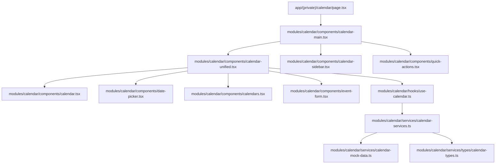
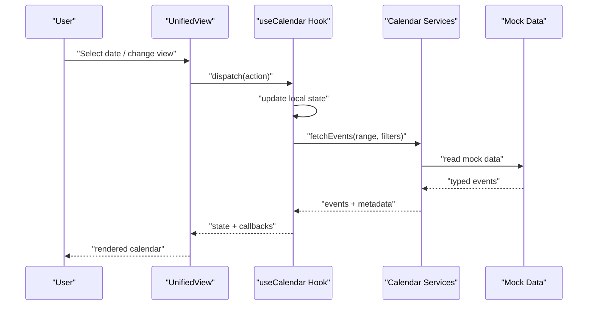
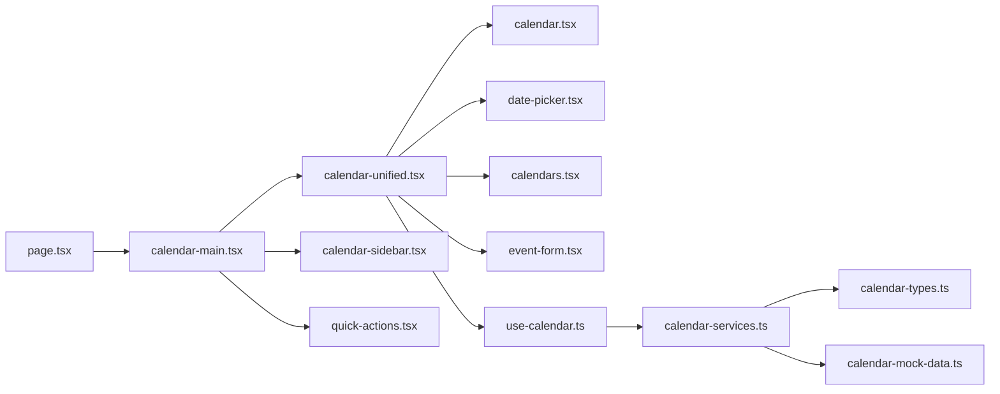

# Calendar Architecture & Core Components

<cite>
**Referenced Files in This Document**
- [calendar/page.tsx](file://src/app/(private)/calendar/page.tsx)
- [components/calendar-main.tsx](file://src/modules/calendar/components/calendar-main.tsx)
- [components/calendar-unified.tsx](file://src/modules/calendar/components/calendar-unified.tsx)
- [components/calendar.tsx](file://src/modules/calendar/components/calendar.tsx)
- [components/calendar-sidebar.tsx](file://src/modules/calendar/components/calendar-sidebar.tsx)
- [components/calendars.tsx](file://src/modules/calendar/components/calendars.tsx)
- [components/date-picker.tsx](file://src/modules/calendar/components/date-picker.tsx)
- [components/event-form.tsx](file://src/modules/calendar/components/event-form.tsx)
- [components/quick-actions.tsx](file://src/modules/calendar/components/quick-actions.tsx)
- [hooks/use-calendar.ts](file://src/modules/calendar/hooks/use-calendar.ts)
- [services/calendar-services.ts](file://src/modules/calendar/services/calendar-services.ts)
- [services/calendar-mock-data.ts](file://src/modules/calendar/services/calendar-mock-data.ts)
- [services/types/calendar-types.ts](file://src/modules/calendar/services/types/calendar-types.ts)
</cite>

## Table of Contents
1. [Introduction](#introduction)
2. [Project Structure](#project-structure)
3. [Core Components](#core-components)
4. [Architecture Overview](#architecture-overview)
5. [Detailed Component Analysis](#detailed-component-analysis)
6. [Dependency Analysis](#dependency-analysis)
7. [Performance Considerations](#performance-considerations)
8. [Troubleshooting Guide](#troubleshooting-guide)
9. [Conclusion](#conclusion)
10. [Appendices](#appendices)

## Introduction
This document explains the calendar module architecture and core components, focusing on component hierarchy, data flow patterns, and state management approach. It covers the main calendar container, unified calendar view, custom hooks implementation, and how the calendar manages different views (month, week, day), handles user interactions, and coordinates with the service layer. It also provides guidance for extending functionality and integrating custom event handlers.

## Project Structure
The calendar feature is organized under a dedicated module directory with clear separation between UI components, business logic via hooks, and data access through services. The page entry point composes the top-level container that wires together the sidebar, unified view, and actions.

**Diagram sources**
- [calendar/page.tsx](file://src/app/(private)/calendar/page.tsx)
- [components/calendar-main.tsx](file://src/modules/calendar/components/calendar-main.tsx)
- [components/calendar-unified.tsx](file://src/modules/calendar/components/calendar-unified.tsx)
- [components/calendar.tsx](file://src/modules/calendar/components/calendar.tsx)
- [components/calendar-sidebar.tsx](file://src/modules/calendar/components/calendar-sidebar.tsx)
- [components/calendars.tsx](file://src/modules/calendar/components/calendars.tsx)
- [components/date-picker.tsx](file://src/modules/calendar/components/date-picker.tsx)
- [components/event-form.tsx](file://src/modules/calendar/components/event-form.tsx)
- [components/quick-actions.tsx](file://src/modules/calendar/components/quick-actions.tsx)
- [hooks/use-calendar.ts](file://src/modules/calendar/hooks/use-calendar.ts)
- [services/calendar-services.ts](file://src/modules/calendar/services/calendar-services.ts)
- [services/calendar-mock-data.ts](file://src/modules/calendar/services/calendar-mock-data.ts)
- [services/types/calendar-types.ts](file://src/modules/calendar/services/types/calendar-types.ts)

**Section sources**
- [calendar/page.tsx](file://src/app/(private)/calendar/page.tsx)
- [components/calendar-main.tsx](file://src/modules/calendar/components/calendar-main.tsx)
- [components/calendar-unified.tsx](file://src/modules/calendar/components/calendar-unified.tsx)
- [components/calendar.tsx](file://src/modules/calendar/components/calendar.tsx)
- [components/calendar-sidebar.tsx](file://src/modules/calendar/components/calendar-sidebar.tsx)
- [components/calendars.tsx](file://src/modules/calendar/components/calendars.tsx)
- [components/date-picker.tsx](file://src/modules/calendar/components/date-picker.tsx)
- [components/event-form.tsx](file://src/modules/calendar/components/event-form.tsx)
- [components/quick-actions.tsx](file://src/modules/calendar/components/quick-actions.tsx)
- [hooks/use-calendar.ts](file://src/modules/calendar/hooks/use-calendar.ts)
- [services/calendar-services.ts](file://src/modules/calendar/services/calendar-services.ts)
- [services/calendar-mock-data.ts](file://src/modules/calendar/services/calendar-mock-data.ts)
- [services/types/calendar-types.ts](file://src/modules/calendar/services/types/calendar-types.ts)

## Core Components
- Main container: orchestrates layout and props distribution to subcomponents.
- Unified view: central place where date selection, view mode, and event operations are coordinated.
- Calendar renderer: renders month/week/day views and delegates interactions to the hook layer.
- Sidebar: displays calendars list and filters.
- Date picker: controls current date navigation.
- Event form: creates or edits events.
- Quick actions: shortcuts for common operations like creating an event.

Key responsibilities:
- State ownership resides in the custom hook; components remain presentational or thin controllers.
- Services abstract data access and provide typed models.

**Section sources**
- [components/calendar-main.tsx](file://src/modules/calendar/components/calendar-main.tsx)
- [components/calendar-unified.tsx](file://src/modules/calendar/components/calendar-unified.tsx)
- [components/calendar.tsx](file://src/modules/calendar/components/calendar.tsx)
- [components/calendar-sidebar.tsx](file://src/modules/calendar/components/calendar-sidebar.tsx)
- [components/calendars.tsx](file://src/modules/calendar/components/calendars.tsx)
- [components/date-picker.tsx](file://src/modules/calendar/components/date-picker.tsx)
- [components/event-form.tsx](file://src/modules/calendar/components/event-form.tsx)
- [components/quick-actions.tsx](file://src/modules/calendar/components/quick-actions.tsx)

## Architecture Overview
The calendar follows a unidirectional data flow:
- User interactions trigger callbacks exposed by the useCalendar hook.
- The hook updates local state and calls calendar services for persistence.
- Services return typed data structures used by components to re-render.

**Diagram sources**
- [components/calendar-unified.tsx](file://src/modules/calendar/components/calendar-unified.tsx)
- [hooks/use-calendar.ts](file://src/modules/calendar/hooks/use-calendar.ts)
- [services/calendar-services.ts](file://src/modules/calendar/services/calendar-services.ts)
- [services/calendar-mock-data.ts](file://src/modules/calendar/services/calendar-mock-data.ts)

## Detailed Component Analysis

### Main Container
Responsibilities:
- Compose the page layout.
- Provide shared context or props to child components.
- Initialize high-level settings such as default view or locale.

Integration points:
- Renders the unified view and sidebar.
- May pass theme or routing-related props.

**Section sources**
- [components/calendar-main.tsx](file://src/modules/calendar/components/calendar-main.tsx)

### Unified Calendar View
Responsibilities:
- Owns the current date and view mode (month, week, day).
- Coordinates event creation/editing flows.
- Delegates rendering to the calendar renderer and side panels.

State management:
- Uses the useCalendar hook to read/write state and invoke actions.
- Exposes handlers for user interactions (click, drag, keyboard).

Extensibility:
- Accepts optional props to customize toolbar, header, or footer.
- Can be wrapped with higher-order components for analytics or logging.

**Section sources**
- [components/calendar-unified.tsx](file://src/modules/calendar/components/calendar-unified.tsx)
- [hooks/use-calendar.ts](file://src/modules/calendar/hooks/use-calendar.ts)

### Calendar Renderer
Responsibilities:
- Renders the active view based on the selected mode.
- Displays events and interactive cells.
- Emits interaction events back to the unified view.

Interaction handling:
- Click-to-create, click-to-edit, and drag-to-resize/move can be wired here.
- Keyboard navigation and accessibility attributes should be provided.

**Section sources**
- [components/calendar.tsx](file://src/modules/calendar/components/calendar.tsx)

### Sidebar and Calendars List
Responsibilities:
- Displays available calendars and their visibility toggles.
- Filters events by selected calendars.

Data binding:
- Subscribes to the hook’s filtered events and calendar states.

**Section sources**
- [components/calendar-sidebar.tsx](file://src/modules/calendar/components/calendar-sidebar.tsx)
- [components/calendars.tsx](file://src/modules/calendar/components/calendars.tsx)

### Date Picker
Responsibilities:
- Provides navigation (today, previous/next) and quick jumps.
- Updates the current date in the hook.

Accessibility:
- Ensure focus management and screen reader labels.

**Section sources**
- [components/date-picker.tsx](file://src/modules/calendar/components/date-picker.tsx)

### Event Form
Responsibilities:
- Create and edit events with validation.
- Submit mutations via the hook’s service layer.

Validation and UX:
- Inline errors, required fields, and confirmation dialogs for destructive actions.

**Section sources**
- [components/event-form.tsx](file://src/modules/calendar/components/event-form.tsx)

### Quick Actions
Responsibilities:
- Shortcut buttons for frequent tasks (e.g., create event).
- Open forms or navigate to relevant views.

**Section sources**
- [components/quick-actions.tsx](file://src/modules/calendar/components/quick-actions.tsx)

### Custom Hook: useCalendar
Responsibilities:
- Centralizes state for current date, view mode, selected events, and filters.
- Exposes actions for navigation, selection, and CRUD operations.
- Coordinates with services to fetch and persist data.

State shape (conceptual):
- Current date and view mode.
- Events list and loading/error flags.
- Selected event and modal states.
- Active calendar filters.

Actions (examples):
- Navigate to next/previous period.
- Switch view mode.
- Select/deselect events.
- Create/update/delete events.
- Toggle calendar filters.

Service integration:
- Calls calendar services for data operations.
- Normalizes responses into typed models.

Error handling:
- Catches network or validation errors and exposes them to components.

**Section sources**
- [hooks/use-calendar.ts](file://src/modules/calendar/hooks/use-calendar.ts)
- [services/calendar-services.ts](file://src/modules/calendar/services/calendar-services.ts)
- [services/types/calendar-types.ts](file://src/modules/calendar/services/types/calendar-types.ts)

### Service Layer
Responsibilities:
- Encapsulates all data access logic.
- Provides typed functions for reading/writing calendar data.
- Abstracts underlying storage (mock data or API endpoints).

Implementation notes:
- Uses typed models from calendar-types.
- Mock data source for development and testing.

**Section sources**
- [services/calendar-services.ts](file://src/modules/calendar/services/calendar-services.ts)
- [services/calendar-mock-data.ts](file://src/modules/calendar/services/calendar-mock-data.ts)
- [services/types/calendar-types.ts](file://src/modules/calendar/services/types/calendar-types.ts)

## Dependency Analysis
The following diagram shows key dependencies among modules and files.

**Diagram sources**
- [calendar/page.tsx](file://src/app/(private)/calendar/page.tsx)
- [components/calendar-main.tsx](file://src/modules/calendar/components/calendar-main.tsx)
- [components/calendar-unified.tsx](file://src/modules/calendar/components/calendar-unified.tsx)
- [components/calendar.tsx](file://src/modules/calendar/components/calendar.tsx)
- [components/calendar-sidebar.tsx](file://src/modules/calendar/components/calendar-sidebar.tsx)
- [components/calendars.tsx](file://src/modules/calendar/components/calendars.tsx)
- [components/date-picker.tsx](file://src/modules/calendar/components/date-picker.tsx)
- [components/event-form.tsx](file://src/modules/calendar/components/event-form.tsx)
- [components/quick-actions.tsx](file://src/modules/calendar/components/quick-actions.tsx)
- [hooks/use-calendar.ts](file://src/modules/calendar/hooks/use-calendar.ts)
- [services/calendar-services.ts](file://src/modules/calendar/services/calendar-services.ts)
- [services/calendar-mock-data.ts](file://src/modules/calendar/services/calendar-mock-data.ts)
- [services/types/calendar-types.ts](file://src/modules/calendar/services/types/calendar-types.ts)

**Section sources**
- [calendar/page.tsx](file://src/app/(private)/calendar/page.tsx)
- [components/calendar-main.tsx](file://src/modules/calendar/components/calendar-main.tsx)
- [components/calendar-unified.tsx](file://src/modules/calendar/components/calendar-unified.tsx)
- [components/calendar.tsx](file://src/modules/calendar/components/calendar.tsx)
- [components/calendar-sidebar.tsx](file://src/modules/calendar/components/calendar-sidebar.tsx)
- [components/calendars.tsx](file://src/modules/calendar/components/calendars.tsx)
- [components/date-picker.tsx](file://src/modules/calendar/components/date-picker.tsx)
- [components/event-form.tsx](file://src/modules/calendar/components/event-form.tsx)
- [components/quick-actions.tsx](file://src/modules/calendar/components/quick-actions.tsx)
- [hooks/use-calendar.ts](file://src/modules/calendar/hooks/use-calendar.ts)
- [services/calendar-services.ts](file://src/modules/calendar/services/calendar-services.ts)
- [services/calendar-mock-data.ts](file://src/modules/calendar/services/calendar-mock-data.ts)
- [services/types/calendar-types.ts](file://src/modules/calendar/services/types/calendar-types.ts)

## Performance Considerations
- Memoization: memoize derived lists and expensive computations in the hook to avoid unnecessary re-renders.
- Virtualization: consider virtualized lists for large event sets in month view.
- Debounced navigation: debounce rapid date changes to reduce re-renders.
- Lazy loading: load event details on demand rather than upfront.
- Stable references: stabilize callback identities to prevent child re-renders.

[No sources needed since this section provides general guidance]

## Troubleshooting Guide
Common issues and resolutions:
- Events not updating after mutation: ensure the hook invalidates or refetches data after write operations.
- Incorrect view rendering: verify the view mode prop and date range calculations.
- Filter not applied: confirm active calendar IDs match event associations.
- Form submission errors: check service error propagation and display messages in the event form.

Operational checks:
- Validate types at service boundaries to catch mismatches early.
- Add logging around service calls to diagnose failures.

**Section sources**
- [hooks/use-calendar.ts](file://src/modules/calendar/hooks/use-calendar.ts)
- [services/calendar-services.ts](file://src/modules/calendar/services/calendar-services.ts)
- [components/event-form.tsx](file://src/modules/calendar/components/event-form.tsx)

## Conclusion
The calendar module uses a clean separation of concerns: presentational components, a central hook for state and orchestration, and a service layer for data access. This design supports multiple views, flexible filtering, and easy extension points for custom interactions and integrations.

[No sources needed since this section summarizes without analyzing specific files]

## Appendices

### Extending the Calendar Functionality
- Add a new view mode:
  - Extend the view mode type and add a renderer branch in the calendar component.
  - Update navigation and header to support the new mode.
- Integrate custom event handlers:
  - Add callbacks in the hook for custom actions (e.g., export, share).
  - Wire handlers in the unified view or quick actions.
- Replace mock data with a real API:
  - Implement service methods against your backend while preserving the typed interface.

[No sources needed since this section provides general guidance]