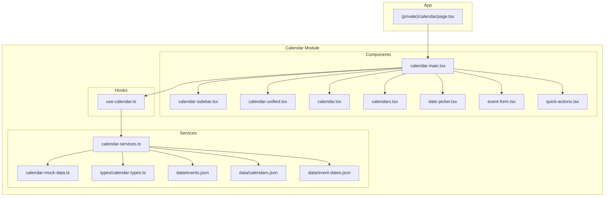
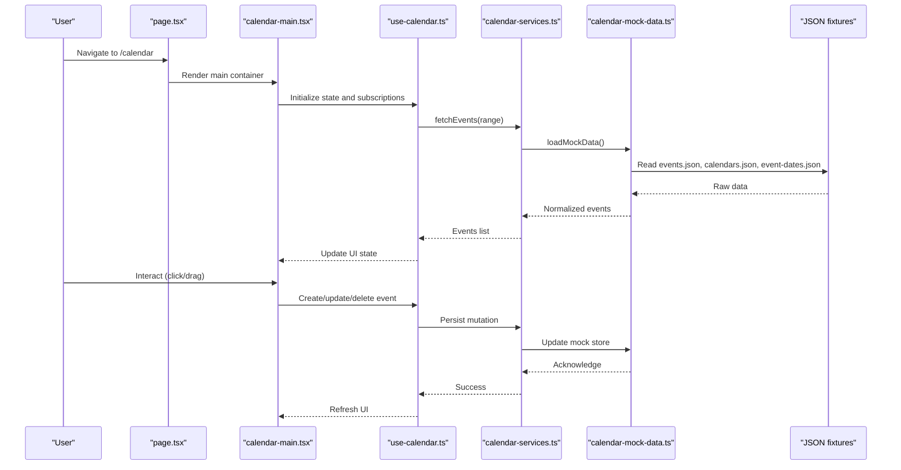
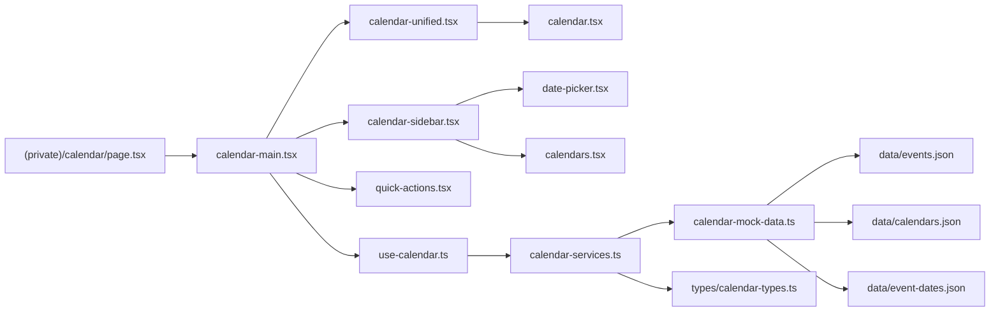

# Calendar Module

<cite>
**Referenced Files in This Document**
- [calendar/page.tsx](file://src/app/(private)/calendar/page.tsx)
- [calendar-main.tsx](file://src/modules/calendar/components/calendar-main.tsx)
- [calendar-sidebar.tsx](file://src/modules/calendar/components/calendar-sidebar.tsx)
- [calendar-unified.tsx](file://src/modules/calendar/components/calendar-unified.tsx)
- [calendar.tsx](file://src/modules/calendar/components/calendar.tsx)
- [calendars.tsx](file://src/modules/calendar/components/calendars.tsx)
- [date-picker.tsx](file://src/modules/calendar/components/date-picker.tsx)
- [event-form.tsx](file://src/modules/calendar/components/event-form.tsx)
- [quick-actions.tsx](file://src/modules/calendar/components/quick-actions.tsx)
- [use-calendar.ts](file://src/modules/calendar/hooks/use-calendar.ts)
- [calendar-services.ts](file://src/modules/calendar/services/calendar-services.ts)
- [calendar-mock-data.ts](file://src/modules/calendar/services/calendar-mock-data.ts)
- [calendar-types.ts](file://src/modules/calendar/services/types/calendar-types.ts)
- [events.json](file://src/modules/calendar/services/data/events.json)
- [calendars.json](file://src/modules/calendar/services/data/calendars.json)
- [event-dates.json](file://src/modules/calendar/services/data/event-dates.json)
</cite>

## Table of Contents
1. [Introduction](#introduction)
2. [Project Structure](#project-structure)
3. [Core Components](#core-components)
4. [Architecture Overview](#architecture-overview)
5. [Detailed Component Analysis](#detailed-component-analysis)
6. [Dependency Analysis](#dependency-analysis)
7. [Performance Considerations](#performance-considerations)
8. [Troubleshooting Guide](#troubleshooting-guide)
9. [Conclusion](#conclusion)
10. [Appendices](#appendices)

## Introduction
This document describes the Calendar module, focusing on event management, drag-and-drop scheduling, and calendar view implementations. It explains the component architecture, data flow, CRUD operations, and integration points with external calendars. It also provides guidance for recurring events, reminders, permissions, synchronization, conflict resolution, and performance optimization for large datasets.

## Project Structure
The Calendar module is organized under src/modules/calendar and includes:
- UI components for views, sidebars, forms, and quick actions
- A hook for state and behavior orchestration
- Services for data access and mock data
- Type definitions and JSON fixtures for development

**Diagram sources**
- [calendar/page.tsx](file://src/app/(private)/calendar/page.tsx)
- [calendar-main.tsx](file://src/modules/calendar/components/calendar-main.tsx)
- [calendar-sidebar.tsx](file://src/modules/calendar/components/calendar-sidebar.tsx)
- [calendar-unified.tsx](file://src/modules/calendar/components/calendar-unified.tsx)
- [calendar.tsx](file://src/modules/calendar/components/calendar.tsx)
- [calendars.tsx](file://src/modules/calendar/components/calendars.tsx)
- [date-picker.tsx](file://src/modules/calendar/components/date-picker.tsx)
- [event-form.tsx](file://src/modules/calendar/components/event-form.tsx)
- [quick-actions.tsx](file://src/modules/calendar/components/quick-actions.tsx)
- [use-calendar.ts](file://src/modules/calendar/hooks/use-calendar.ts)
- [calendar-services.ts](file://src/modules/calendar/services/calendar-services.ts)
- [calendar-mock-data.ts](file://src/modules/calendar/services/calendar-mock-data.ts)
- [calendar-types.ts](file://src/modules/calendar/services/types/calendar-types.ts)
- [events.json](file://src/modules/calendar/services/data/events.json)
- [calendars.json](file://src/modules/calendar/services/data/calendars.json)
- [event-dates.json](file://src/modules/calendar/services/data/event-dates.json)

**Section sources**
- [calendar/page.tsx](file://src/app/(private)/calendar/page.tsx)
- [calendar-main.tsx](file://src/modules/calendar/components/calendar-main.tsx)
- [calendar.tsx](file://src/modules/calendar/components/calendar.tsx)
- [calendar-services.ts](file://src/modules/calendar/services/calendar-services.ts)
- [calendar-mock-data.ts](file://src/modules/calendar/services/calendar-mock-data.ts)
- [calendar-types.ts](file://src/modules/calendar/services/types/calendar-types.ts)
- [events.json](file://src/modules/calendar/services/data/events.json)
- [calendars.json](file://src/modules/calendar/services/data/calendars.json)
- [event-dates.json](file://src/modules/calendar/services/data/event-dates.json)

## Core Components
- Page entrypoint: The private route renders the main calendar container and wires up layout and navigation.
- Main container: Orchestrates view state, sidebar visibility, and delegates to specialized subcomponents.
- Unified view: Provides a single interface that can render multiple calendar views (e.g., month, week, day).
- Calendar renderer: Renders the actual grid or timeline and handles user interactions such as click and drag.
- Sidebar: Displays available calendars, filters, and date selection controls.
- Event form: Creates and edits events, including recurrence and reminder options.
- Quick actions: Shortcuts for common tasks like “Add event” or “Today”.
- Hook: Encapsulates calendar state, event CRUD, and service calls.
- Services: Provide data access via mock data and typed interfaces; easily replaceable with real APIs.

Key responsibilities:
- State management for selected dates, active views, and event lists
- Rendering logic for different calendar views
- Form handling for event creation/editing
- Integration with services for persistence and retrieval

**Section sources**
- [calendar/page.tsx](file://src/app/(private)/calendar/page.tsx)
- [calendar-main.tsx](file://src/modules/calendar/components/calendar-main.tsx)
- [calendar-unified.tsx](file://src/modules/calendar/components/calendar-unified.tsx)
- [calendar.tsx](file://src/modules/calendar/components/calendar.tsx)
- [calendar-sidebar.tsx](file://src/modules/calendar/components/calendar-sidebar.tsx)
- [event-form.tsx](file://src/modules/calendar/components/event-form.tsx)
- [quick-actions.tsx](file://src/modules/calendar/components/quick-actions.tsx)
- [use-calendar.ts](file://src/modules/calendar/hooks/use-calendar.ts)
- [calendar-services.ts](file://src/modules/calendar/services/calendar-services.ts)
- [calendar-mock-data.ts](file://src/modules/calendar/services/calendar-mock-data.ts)
- [calendar-types.ts](file://src/modules/calendar/services/types/calendar-types.ts)

## Architecture Overview
The module follows a layered architecture:
- Presentation layer: React components for views and interactions
- Orchestration layer: Hook managing state and calling services
- Data layer: Services abstracting data sources (mock JSON or API)
- Types: Shared TypeScript types ensuring consistency across layers

**Diagram sources**
- [calendar/page.tsx](file://src/app/(private)/calendar/page.tsx)
- [calendar-main.tsx](file://src/modules/calendar/components/calendar-main.tsx)
- [use-calendar.ts](file://src/modules/calendar/hooks/use-calendar.ts)
- [calendar-services.ts](file://src/modules/calendar/services/calendar-services.ts)
- [calendar-mock-data.ts](file://src/modules/calendar/services/calendar-mock-data.ts)
- [events.json](file://src/modules/calendar/services/data/events.json)
- [calendars.json](file://src/modules/calendar/services/data/calendars.json)
- [event-dates.json](file://src/modules/calendar/services/data/event-dates.json)

## Detailed Component Analysis

### Calendar Main Container
Responsibilities:
- Coordinates child components (sidebar, unified view, quick actions)
- Manages global flags (e.g., sidebar open/close)
- Passes down shared props and handlers

Integration points:
- Uses the calendar hook to obtain events and actions
- Delegates rendering to the unified view and sidebar

**Section sources**
- [calendar-main.tsx](file://src/modules/calendar/components/calendar-main.tsx)
- [use-calendar.ts](file://src/modules/calendar/hooks/use-calendar.ts)

### Unified Calendar View
Responsibilities:
- Abstracts over multiple calendar views (month, week, day)
- Handles view switching and range updates
- Forwards user interactions to the underlying calendar renderer

Integration points:
- Receives events from the hook
- Invokes callbacks for create/update/delete

**Section sources**
- [calendar-unified.tsx](file://src/modules/calendar/components/calendar-unified.tsx)
- [calendar.tsx](file://src/modules/calendar/components/calendar.tsx)
- [use-calendar.ts](file://src/modules/calendar/hooks/use-calendar.ts)

### Calendar Renderer
Responsibilities:
- Renders the current view’s grid/timeline
- Implements drag-and-drop scheduling by updating event start/end times
- Highlights conflicts and shows tooltips

Integration points:
- Subscribes to events via the hook
- Emits mutations through the hook

**Section sources**
- [calendar.tsx](file://src/modules/calendar/components/calendar.tsx)
- [use-calendar.ts](file://src/modules/calendar/hooks/use-calendar.ts)

### Sidebar and Calendars Panel
Responsibilities:
- Lists calendars with toggles for visibility
- Provides date picker and quick filters
- Reflects selected date and view context

Integration points:
- Updates selected date and view via the hook
- Filters events based on active calendars

**Section sources**
- [calendar-sidebar.tsx](file://src/modules/calendar/components/calendar-sidebar.tsx)
- [calendars.tsx](file://src/modules/calendar/components/calendars.tsx)
- [date-picker.tsx](file://src/modules/calendar/components/date-picker.tsx)
- [use-calendar.ts](file://src/modules/calendar/hooks/use-calendar.ts)

### Event Form
Responsibilities:
- Validates and submits new or edited events
- Supports recurrence rules and reminders
- Integrates with validation and error feedback

Integration points:
- Calls create/update methods from the hook
- Re-renders affected days after submission

**Section sources**
- [event-form.tsx](file://src/modules/calendar/components/event-form.tsx)
- [use-calendar.ts](file://src/modules/calendar/hooks/use-calendar.ts)

### Quick Actions
Responsibilities:
- Provides shortcuts for common operations (e.g., add event, jump to today)
- Opens dialogs or navigates within the calendar

Integration points:
- Triggers actions exposed by the hook

**Section sources**
- [quick-actions.tsx](file://src/modules/calendar/components/quick-actions.tsx)
- [use-calendar.ts](file://src/modules/calendar/hooks/use-calendar.ts)

### Hook: use-calendar
Responsibilities:
- Holds state for events, selected date, active view, and filters
- Exposes CRUD functions and refresh triggers
- Coordinates service calls and local updates

Integration points:
- Calls calendar services for persistence
- Consumes mock data or JSON fixtures

**Section sources**
- [use-calendar.ts](file://src/modules/calendar/hooks/use-calendar.ts)
- [calendar-services.ts](file://src/modules/calendar/services/calendar-services.ts)
- [calendar-mock-data.ts](file://src/modules/calendar/services/calendar-mock-data.ts)

### Services and Types
Responsibilities:
- Define shared types for events, calendars, and ranges
- Implement data access abstractions
- Load and normalize mock data from JSON fixtures

Integration points:
- Reads JSON files for development
- Can be replaced with HTTP clients for production

**Section sources**
- [calendar-services.ts](file://src/modules/calendar/services/calendar-services.ts)
- [calendar-mock-data.ts](file://src/modules/calendar/services/calendar-mock-data.ts)
- [calendar-types.ts](file://src/modules/calendar/services/types/calendar-types.ts)
- [events.json](file://src/modules/calendar/services/data/events.json)
- [calendars.json](file://src/modules/calendar/services/data/calendars.json)
- [event-dates.json](file://src/modules/calendar/services/data/event-dates.json)

## Dependency Analysis
The following diagram maps key dependencies between modules and files:

**Diagram sources**
- [calendar/page.tsx](file://src/app/(private)/calendar/page.tsx)
- [calendar-main.tsx](file://src/modules/calendar/components/calendar-main.tsx)
- [calendar-unified.tsx](file://src/modules/calendar/components/calendar-unified.tsx)
- [calendar.tsx](file://src/modules/calendar/components/calendar.tsx)
- [calendar-sidebar.tsx](file://src/modules/calendar/components/calendar-sidebar.tsx)
- [date-picker.tsx](file://src/modules/calendar/components/date-picker.tsx)
- [calendars.tsx](file://src/modules/calendar/components/calendars.tsx)
- [quick-actions.tsx](file://src/modules/calendar/components/quick-actions.tsx)
- [use-calendar.ts](file://src/modules/calendar/hooks/use-calendar.ts)
- [calendar-services.ts](file://src/modules/calendar/services/calendar-services.ts)
- [calendar-mock-data.ts](file://src/modules/calendar/services/calendar-mock-data.ts)
- [calendar-types.ts](file://src/modules/calendar/services/types/calendar-types.ts)
- [events.json](file://src/modules/calendar/services/data/events.json)
- [calendars.json](file://src/modules/calendar/services/data/calendars.json)
- [event-dates.json](file://src/modules/calendar/services/data/event-dates.json)

**Section sources**
- [calendar-main.tsx](file://src/modules/calendar/components/calendar-main.tsx)
- [calendar-unified.tsx](file://src/modules/calendar/components/calendar-unified.tsx)
- [calendar.tsx](file://src/modules/calendar/components/calendar.tsx)
- [calendar-sidebar.tsx](file://src/modules/calendar/components/calendar-sidebar.tsx)
- [date-picker.tsx](file://src/modules/calendar/components/date-picker.tsx)
- [calendars.tsx](file://src/modules/calendar/components/calendars.tsx)
- [quick-actions.tsx](file://src/modules/calendar/components/quick-actions.tsx)
- [use-calendar.ts](file://src/modules/calendar/hooks/use-calendar.ts)
- [calendar-services.ts](file://src/modules/calendar/services/calendar-services.ts)
- [calendar-mock-data.ts](file://src/modules/calendar/services/calendar-mock-data.ts)
- [calendar-types.ts](file://src/modules/calendar/services/types/calendar-types.ts)
- [events.json](file://src/modules/calendar/services/data/events.json)
- [calendars.json](file://src/modules/calendar/services/data/calendars.json)
- [event-dates.json](file://src/modules/calendar/services/data/event-dates.json)

## Performance Considerations
- Virtualization and windowing: For large event sets, consider virtualizing the calendar grid to render only visible cells.
- Memoization: Memoize expensive computations (e.g., event overlap detection) and derived lists using stable references.
- Batching updates: Coalesce multiple mutations into a single re-render cycle to avoid excessive recalculations.
- Lazy loading: Load events for the current view range only; prefetch adjacent ranges when navigating.
- Debounced search/filter: Apply debouncing to input-driven filters to reduce re-renders.
- Efficient diffing: Use stable IDs and minimize prop churn to help React optimize reconciliation.
- Memory management: Clean up timers and listeners in hooks to prevent leaks during navigation.

[No sources needed since this section provides general guidance]

## Troubleshooting Guide
Common issues and resolutions:
- Events not appearing: Verify the selected date range and active calendar filters; ensure services return normalized data.
- Drag-and-drop not updating: Confirm that the calendar renderer emits update callbacks and the hook persists changes.
- Recurrence not expanding: Check that recurrence rules are correctly parsed and expanded into individual occurrences.
- Reminder not firing: Ensure reminder configuration is persisted and that notification triggers are wired to the appropriate lifecycle.
- Slow rendering with many events: Inspect memoization boundaries and consider virtualization or pagination strategies.

**Section sources**
- [use-calendar.ts](file://src/modules/calendar/hooks/use-calendar.ts)
- [calendar-services.ts](file://src/modules/calendar/services/calendar-services.ts)
- [calendar-mock-data.ts](file://src/modules/calendar/services/calendar-mock-data.ts)
- [calendar.tsx](file://src/modules/calendar/components/calendar.tsx)
- [event-form.tsx](file://src/modules/calendar/components/event-form.tsx)

## Conclusion
The Calendar module provides a modular, extensible foundation for event management and scheduling. Its clear separation of concerns—presentation, orchestration, and data—facilitates maintainability and future enhancements such as external calendar integrations, advanced recurrence, and robust conflict resolution. With thoughtful performance optimizations and comprehensive testing, it can scale to support large event datasets and complex workflows.

[No sources needed since this section summarizes without analyzing specific files]

## Appendices

### Event CRUD Operations
- Create: Submit via the event form; hook persists through services; UI refreshes affected ranges.
- Read: Fetch events for the current range; filter by active calendars; expand recurrences if configured.
- Update: Edit via the form or inline editing; persist changes and recompute overlaps.
- Delete: Remove event and update dependent views; handle cascading effects for recurring series.

**Section sources**
- [event-form.tsx](file://src/modules/calendar/components/event-form.tsx)
- [use-calendar.ts](file://src/modules/calendar/hooks/use-calendar.ts)
- [calendar-services.ts](file://src/modules/calendar/services/calendar-services.ts)

### Recurring Events and Reminders
- Recurrence: Define rules in the event form; expand into instances for display and conflict checks.
- Reminders: Store reminder offsets and trigger notifications at scheduled times.

**Section sources**
- [event-form.tsx](file://src/modules/calendar/components/event-form.tsx)
- [calendar-types.ts](file://src/modules/calendar/services/types/calendar-types.ts)

### Calendar Permissions and Sharing
- Visibility: Toggle calendar visibility in the sidebar; enforce per-user or per-role visibility.
- Access control: Restrict create/update/delete based on user roles and calendar ownership.

**Section sources**
- [calendars.tsx](file://src/modules/calendar/components/calendars.tsx)
- [calendar-sidebar.tsx](file://src/modules/calendar/components/calendar-sidebar.tsx)
- [calendar-types.ts](file://src/modules/calendar/services/types/calendar-types.ts)

### External Calendar Integration
- Strategy: Replace mock data with HTTP calls to external providers; map provider schemas to internal types.
- Sync: Implement periodic sync jobs and incremental updates; handle conflicts by last-write-wins or merge policies.

**Section sources**
- [calendar-services.ts](file://src/modules/calendar/services/calendar-services.ts)
- [calendar-mock-data.ts](file://src/modules/calendar/services/calendar-mock-data.ts)
- [calendar-types.ts](file://src/modules/calendar/services/types/calendar-types.ts)

### Conflict Resolution
- Detection: Compute overlapping intervals for events within the same time slot.
- Resolution: Offer suggestions to users (e.g., shift time, split event) and persist chosen resolution.

**Section sources**
- [calendar.tsx](file://src/modules/calendar/components/calendar.tsx)
- [use-calendar.ts](file://src/modules/calendar/hooks/use-calendar.ts)