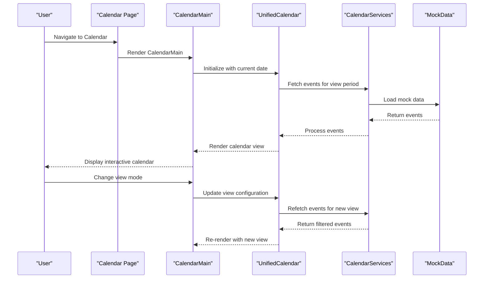
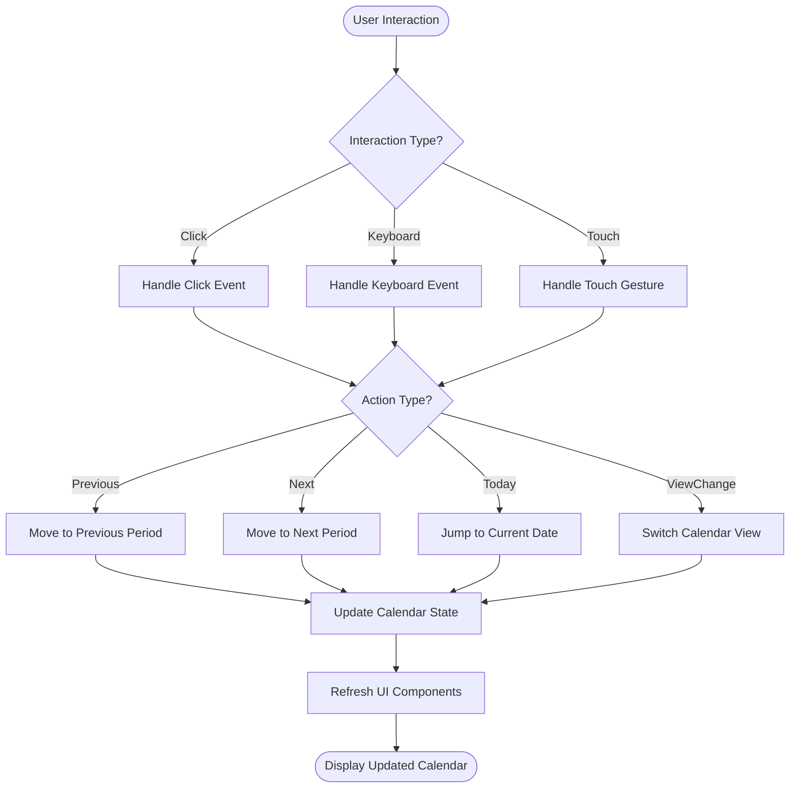
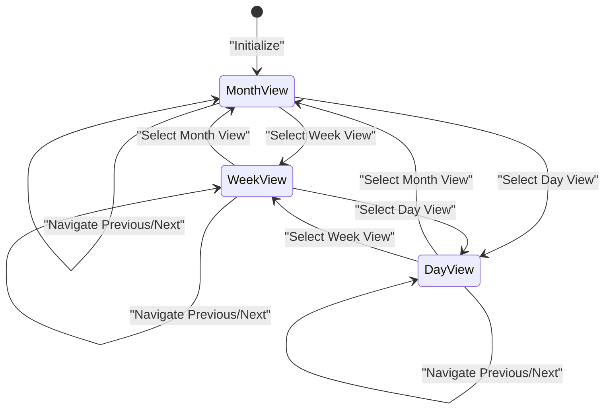

# Calendar Views & Navigation

<cite>
**Referenced Files in This Document**
- [calendar/page.tsx](file://src/app/(private)/calendar/page.tsx)
- [calendar-main.tsx](file://src/modules/calendar/components/calendar-main.tsx)
- [calendar-unified.tsx](file://src/modules/calendar/components/calendar-unified.tsx)
- [calendar.tsx](file://src/modules/calendar/components/calendar.tsx)
- [use-calendar.ts](file://src/modules/calendar/hooks/use-calendar.ts)
- [date-picker.tsx](file://src/modules/calendar/components/date-picker.tsx)
- [quick-actions.tsx](file://src/modules/calendar/components/quick-actions.tsx)
- [event-form.tsx](file://src/modules/calendar/components/event-form.tsx)
- [calendars.tsx](file://src/modules/calendar/components/calendars.tsx)
- [calendar-sidebar.tsx](file://src/modules/calendar/components/calendar-sidebar.tsx)
- [calendar-services.ts](file://src/modules/calendar/services/calendar-services.ts)
- [calendar-mock-data.ts](file://src/modules/calendar/services/calendar-mock-data.ts)
- [calendar-types.ts](file://src/modules/calendar/services/types/calendar-types.ts)
</cite>

## Table of Contents
1. [Introduction](#introduction)
2. [Project Structure](#project-structure)
3. [Core Components](#core-components)
4. [Architecture Overview](#architecture-overview)
5. [Detailed Component Analysis](#detailed-component-analysis)
6. [Navigation Controls](#navigation-controls)
7. [Date Picker Integration](#date-picker-integration)
8. [View Switching Mechanisms](#view-switching-mechanisms)
9. [Responsive Design Considerations](#responsive-design-considerations)
10. [Performance Optimization](#performance-optimization)
11. [Accessibility Features](#accessibility-features)
12. [Customization Examples](#customization-examples)
13. [Troubleshooting Guide](#troubleshooting-guide)
14. [Conclusion](#conclusion)

## Introduction

The calendar view system in this Next.js dashboard provides a comprehensive scheduling interface with multiple view modes including month, week, and day views. The system features intuitive navigation controls, date picker integration, responsive design for various screen sizes, and accessibility compliance. It supports event management, quick actions, and customizable layouts to meet diverse scheduling needs.

## Project Structure

The calendar functionality is organized within a modular architecture under `src/modules/calendar/`, following feature-based organization principles:

```mermaid
graph TB
subgraph "Calendar Module"
A[components/] --> B[calendar-main.tsx]
A --> C[calendar-unified.tsx]
A --> D[calendar.tsx]
A --> E[date-picker.tsx]
A --> F[quick-actions.tsx]
A --> G[event-form.tsx]
A --> H[calendars.tsx]
A --> I[calendar-sidebar.tsx]
J[hooks/] --> K[use-calendar.ts]
L[services/] --> M[calendar-services.ts]
L --> N[calendar-mock-data.ts]
L --> O[types/calendar-types.ts]
L --> P[data/]
end
Q[app/(private)/calendar/page.tsx] --> B
```

**Diagram sources**
- [calendar/page.tsx](file://src/app/(private)/calendar/page.tsx)
- [calendar-main.tsx](file://src/modules/calendar/components/calendar-main.tsx)
- [use-calendar.ts](file://src/modules/calendar/hooks/use-calendar.ts)
- [calendar-services.ts](file://src/modules/calendar/services/calendar-services.ts)

**Section sources**
- [calendar/page.tsx](file://src/app/(private)/calendar/page.tsx)
- [calendar-main.tsx](file://src/modules/calendar/components/calendar-main.tsx)

## Core Components

The calendar system consists of several key components that work together to provide a cohesive user experience:

### Main Calendar Container
The primary entry point manages state and coordinates between different calendar views and utilities.

### Unified Calendar View
Handles the core calendar logic and rendering for different view modes (month, week, day).

### Date Picker Integration
Provides date selection capabilities with keyboard navigation and accessibility support.

### Quick Actions Panel
Offers contextual actions for events and calendar management.

### Event Management
Includes forms and dialogs for creating, editing, and managing calendar events.

**Section sources**
- [calendar-main.tsx](file://src/modules/calendar/components/calendar-main.tsx)
- [calendar-unified.tsx](file://src/modules/calendar/components/calendar-unified.tsx)
- [date-picker.tsx](file://src/modules/calendar/components/date-picker.tsx)
- [quick-actions.tsx](file://src/modules/calendar/components/quick-actions.tsx)
- [event-form.tsx](file://src/modules/calendar/components/event-form.tsx)

## Architecture Overview

The calendar system follows a component-based architecture with clear separation of concerns:



**Diagram sources**
- [calendar/page.tsx](file://src/app/(private)/calendar/page.tsx)
- [calendar-main.tsx](file://src/modules/calendar/components/calendar-main.tsx)
- [calendar-unified.tsx](file://src/modules/calendar/components/calendar-unified.tsx)
- [calendar-services.ts](file://src/modules/calendar/services/calendar-services.ts)

## Detailed Component Analysis

### Calendar Main Component
The main container component orchestrates the overall calendar experience, managing global state and coordinating between child components.

#### Key Responsibilities:
- State management for current date and view mode
- Theme and layout coordination
- Event propagation handling
- Responsive behavior management

### Unified Calendar Component
The core calendar engine that handles rendering logic for different view types and manages the complex interactions between calendar cells and events.

#### View Types Supported:
- **Month View**: Traditional grid layout showing full month
- **Week View**: Detailed weekly schedule with time slots
- **Day View**: Single-day focused view with hourly breakdown

### Calendar Hook System
Custom hooks provide reusable logic for calendar operations, date manipulation, and state synchronization.

**Section sources**
- [calendar-main.tsx](file://src/modules/calendar/components/calendar-main.tsx)
- [calendar-unified.tsx](file://src/modules/calendar/components/calendar-unified.tsx)
- [use-calendar.ts](file://src/modules/calendar/hooks/use-calendar.ts)

## Navigation Controls

The calendar implements comprehensive navigation controls for seamless date and view transitions:

### Previous/Next Navigation
- Arrow buttons for moving between periods
- Keyboard shortcuts (Left/Right arrows)
- Touch swipe gestures for mobile devices

### Today Button
- Instant return to current date
- Visual feedback on activation
- Disabled state when already on current date

### View Mode Selector
- Dropdown or segmented control for switching between month, week, and day views
- Persistent preference storage
- Context-aware default view selection

### Mini Calendar Navigation
- Embedded mini calendar for quick date jumping
- Highlighted current selection
- Month/year navigation controls



**Diagram sources**
- [calendar-main.tsx](file://src/modules/calendar/components/calendar-main.tsx)
- [calendar-unified.tsx](file://src/modules/calendar/components/calendar-unified.tsx)

**Section sources**
- [calendar-main.tsx](file://src/modules/calendar/components/calendar-main.tsx)
- [calendar-unified.tsx](file://src/modules/calendar/components/calendar-unified.tsx)

## Date Picker Integration

The calendar integrates a sophisticated date picker component with advanced features:

### Date Selection Methods
- **Direct Click**: Click on any date cell to select
- **Keyboard Navigation**: Arrow keys for movement, Enter for selection
- **Programmatic Control**: API methods for setting dates programmatically

### Accessibility Features
- **ARIA Labels**: Comprehensive screen reader support
- **Focus Management**: Logical tab order and focus indicators
- **Keyboard Shortcuts**: Full keyboard operability
- **High Contrast**: Support for high contrast themes

### Validation and Constraints
- **Date Range Limits**: Minimum and maximum date constraints
- **Business Day Filtering**: Option to exclude weekends/holidays
- **Custom Validation**: Pluggable validation rules

**Section sources**
- [date-picker.tsx](file://src/modules/calendar/components/date-picker.tsx)

## View Switching Mechanisms

The calendar implements smooth transitions between different view modes with optimized performance:

### View Configuration
Each view type has specific configuration options:
- **Layout Settings**: Grid dimensions, spacing, and alignment
- **Time Formatting**: 12-hour vs 24-hour display options
- **Event Rendering**: How events are displayed and prioritized
- **Scroll Behavior**: Auto-scrolling and viewport management

### Transition Animations
- **Fade Transitions**: Smooth opacity changes between views
- **Slide Effects**: Directional sliding for chronological navigation
- **Staggered Loading**: Progressive content loading for large datasets

### State Persistence
- **View Preference Memory**: Remember last used view per user
- **Date Position Preservation**: Maintain scroll position across view changes
- **Selection State**: Preserve selected dates and ranges



**Diagram sources**
- [calendar-unified.tsx](file://src/modules/calendar/components/calendar-unified.tsx)

**Section sources**
- [calendar-unified.tsx](file://src/modules/calendar/components/calendar-unified.tsx)

## Responsive Design Considerations

The calendar system is designed to work seamlessly across all device sizes and orientations:

### Mobile-First Approach
- **Touch Optimized**: Large touch targets and swipe gestures
- **Adaptive Layouts**: Collapsible sidebars and floating action buttons
- **Viewport Awareness**: Dynamic adjustments based on screen size

### Breakpoint Strategy
- **Small Screens (< 768px)**: Simplified interface with bottom navigation
- **Medium Screens (768px - 1024px)**: Standard desktop layout
- **Large Screens (> 1024px)**: Enhanced features with expanded panels

### Performance Adaptations
- **Lazy Loading**: Progressive content loading based on viewport
- **Virtual Scrolling**: Efficient rendering for large date ranges
- **Memory Management**: Cleanup of unused DOM elements

**Section sources**
- [calendar-main.tsx](file://src/modules/calendar/components/calendar-main.tsx)
- [calendar-unified.tsx](file://src/modules/calendar/components/calendar-unified.tsx)

## Performance Optimization

The calendar system implements several optimization strategies for handling large datasets and maintaining smooth interactions:

### Virtual Rendering
- **Windowing**: Only render visible calendar cells and events
- **Chunked Updates**: Batch state updates to minimize re-renders
- **Memoization**: Cache expensive calculations and derived data

### Data Management
- **Pagination**: Load events in chunks based on view range
- **Caching**: Local storage cache for frequently accessed data
- **Debounced Updates**: Throttle rapid state changes

### Memory Optimization
- **Component Unmounting**: Clean up event listeners and timers
- **Image Optimization**: Lazy loading and compression for event thumbnails
- **String Caching**: Memoize formatted date strings and labels

**Section sources**
- [calendar-services.ts](file://src/modules/calendar/services/calendar-services.ts)
- [calendar-mock-data.ts](file://src/modules/calendar/services/calendar-mock-data.ts)

## Accessibility Features

The calendar system prioritizes accessibility compliance and inclusive design:

### Screen Reader Support
- **Semantic HTML**: Proper use of semantic elements and roles
- **Live Regions**: Announce dynamic content changes
- **Descriptive Labels**: Clear context for all interactive elements

### Keyboard Navigation
- **Logical Tab Order**: Intuitive navigation flow
- **Shortcut Keys**: Common keyboard shortcuts for power users
- **Focus Indicators**: Visible focus states for all interactive elements

### Color and Contrast
- **WCAG Compliance**: Meets minimum contrast ratio requirements
- **Theme Support**: Works with light, dark, and custom themes
- **Color Independence**: Information not conveyed through color alone

### Motor Accessibility
- **Large Touch Targets**: Minimum 44x44 pixel touch areas
- **Gesture Alternatives**: Alternative input methods for touch gestures
- **Reduced Motion**: Respect user motion preferences

**Section sources**
- [date-picker.tsx](file://src/modules/calendar/components/date-picker.tsx)
- [calendar-unified.tsx](file://src/modules/calendar/components/calendar-unified.tsx)

## Customization Examples

### Customizing View Layouts

To customize the appearance and behavior of calendar views, you can modify the view configuration objects:

#### Month View Customization
- Adjust grid spacing and cell sizing
- Customize event overflow behavior
- Modify header and footer sections

#### Week/Day View Customization
- Configure time slot intervals
- Customize sidebar width and content
- Adjust event positioning algorithms

### Adding New View Types

To implement a new view type (e.g., Year View or Agenda View):

1. **Create View Component**: Implement the new view component following existing patterns
2. **Register View**: Add view configuration to the view registry
3. **Implement Navigation**: Add navigation controls for the new view
4. **Test Integration**: Ensure compatibility with existing features

### Implementing View-Specific Features

#### Quick Actions
Add contextual actions that appear when interacting with calendar elements:
- Right-click context menus
- Hover-triggered action panels
- Long-press actions for mobile

#### Calendar Filtering
Implement advanced filtering capabilities:
- Category-based filtering
- Date range filters
- Custom filter criteria
- Filter persistence

**Section sources**
- [calendar-main.tsx](file://src/modules/calendar/components/calendar-main.tsx)
- [quick-actions.tsx](file://src/modules/calendar/components/quick-actions.tsx)
- [event-form.tsx](file://src/modules/calendar/components/event-form.tsx)

## Troubleshooting Guide

### Common Issues and Solutions

#### Performance Problems
- **Symptom**: Slow rendering with many events
- **Solution**: Enable virtual scrolling and implement pagination
- **Prevention**: Use memoization and optimize event data structures

#### Navigation Issues
- **Symptom**: Incorrect date calculations or view boundaries
- **Solution**: Verify timezone handling and locale settings
- **Prevention**: Use established date libraries and test edge cases

#### Accessibility Problems
- **Symptom**: Screen reader not announcing changes
- **Solution**: Ensure proper ARIA attributes and live regions
- **Prevention**: Regular accessibility testing with assistive technologies

#### Mobile Responsiveness
- **Symptom**: Poor touch interaction or layout issues
- **Solution**: Adjust touch targets and implement responsive breakpoints
- **Prevention**: Test on actual devices and use responsive design patterns

### Debugging Tools

#### Development Utilities
- **Performance Profiling**: React DevTools and browser performance monitors
- **State Inspection**: Redux DevTools or React Context debugging
- **Network Monitoring**: Inspect API calls and data fetching

#### Testing Strategies
- **Unit Tests**: Component and utility function testing
- **Integration Tests**: User workflow and navigation testing
- **Accessibility Tests**: Automated accessibility scanning

**Section sources**
- [calendar-services.ts](file://src/modules/calendar/services/calendar-services.ts)
- [use-calendar.ts](file://src/modules/calendar/hooks/use-calendar.ts)

## Conclusion

The calendar view system provides a robust, accessible, and performant scheduling interface that scales across different use cases and device types. Its modular architecture allows for easy customization and extension while maintaining consistent user experience and accessibility standards. The system's emphasis on performance optimization ensures smooth interactions even with large datasets, making it suitable for enterprise-level applications requiring complex scheduling capabilities.

The comprehensive navigation controls, date picker integration, and responsive design considerations make it a versatile solution for various calendar and scheduling needs. With its extensible architecture, teams can easily add custom view types, implement specialized features, and integrate with existing systems while maintaining code quality and user experience standards.