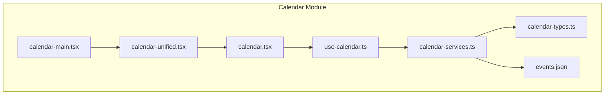
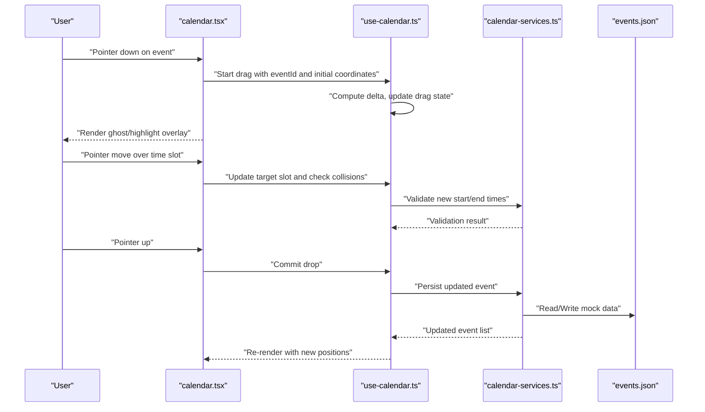
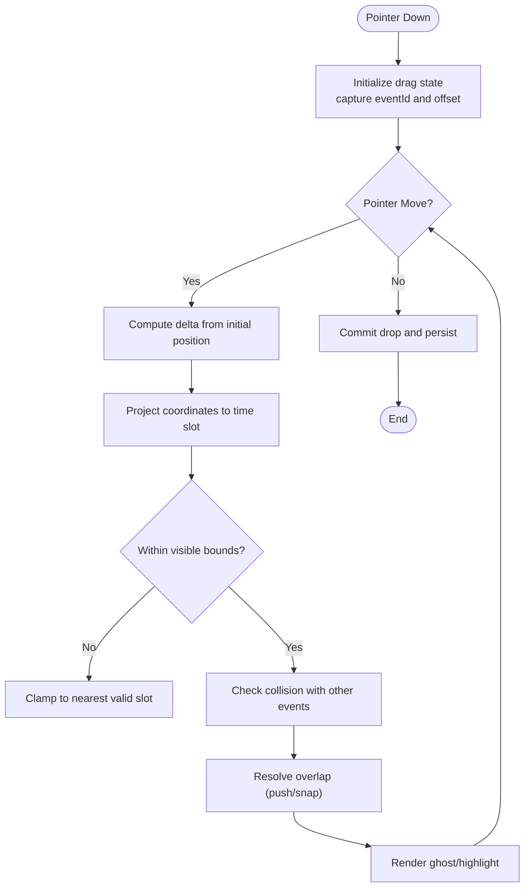
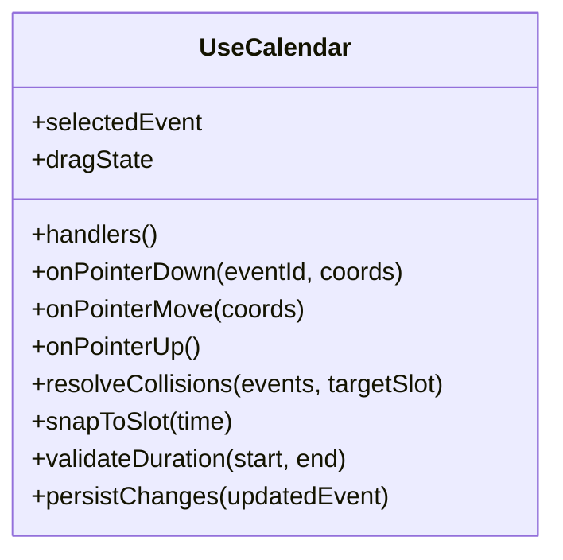
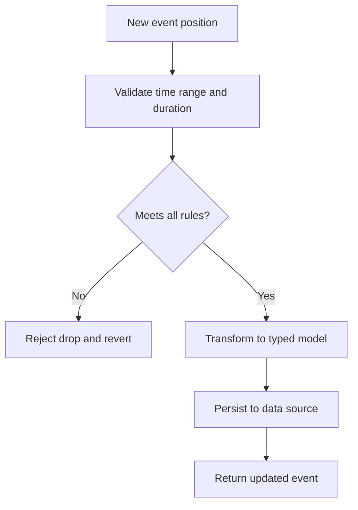
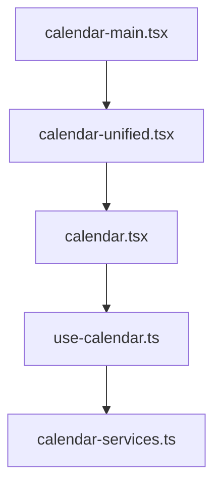
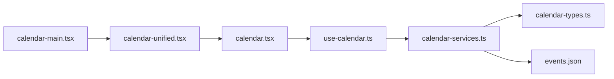

# Drag-and-Drop Scheduling

<cite>
**Referenced Files in This Document**
- [calendar-main.tsx](file://src/modules/calendar/components/calendar-main.tsx)
- [calendar-unified.tsx](file://src/modules/calendar/components/calendar-unified.tsx)
- [calendar.tsx](file://src/modules/calendar/components/calendar.tsx)
- [use-calendar.ts](file://src/modules/calendar/hooks/use-calendar.ts)
- [calendar-services.ts](file://src/modules/calendar/services/calendar-services.ts)
- [calendar-types.ts](file://src/modules/calendar/services/types/calendar-types.ts)
- [events.json](file://src/modules/calendar/services/data/events.json)
</cite>

## Table of Contents
1. [Introduction](#introduction)
2. [Project Structure](#project-structure)
3. [Core Components](#core-components)
4. [Architecture Overview](#architecture-overview)
5. [Detailed Component Analysis](#detailed-component-analysis)
6. [Dependency Analysis](#dependency-analysis)
7. [Performance Considerations](#performance-considerations)
8. [Troubleshooting Guide](#troubleshooting-guide)
9. [Conclusion](#conclusion)
10. [Appendices](#appendices)

## Introduction
This document explains the drag-and-drop scheduling functionality implemented in the calendar module. It covers how drag-and-drop interactions are initiated and processed, how events are repositioned across time slots, and how touch and mouse events are handled consistently. It also documents visual feedback during drag operations, collision detection for overlapping events, boundary constraints, and customization patterns for drop zones and drag behavior.

## Project Structure
The drag-and-drop scheduling feature is primarily implemented within the calendar module:
- UI components orchestrate rendering and user interactions
- Hooks encapsulate state and logic for event management
- Services provide data access and transformation utilities
- Types define shared interfaces for events and calendars

**Diagram sources**
- [calendar-main.tsx](file://src/modules/calendar/components/calendar-main.tsx)
- [calendar-unified.tsx](file://src/modules/calendar/components/calendar-unified.tsx)
- [calendar.tsx](file://src/modules/calendar/components/calendar.tsx)
- [use-calendar.ts](file://src/modules/calendar/hooks/use-calendar.ts)
- [calendar-services.ts](file://src/modules/calendar/services/calendar-services.ts)
- [calendar-types.ts](file://src/modules/calendar/services/types/calendar-types.ts)
- [events.json](file://src/modules/calendar/services/data/events.json)

**Section sources**
- [calendar-main.tsx](file://src/modules/calendar/components/calendar-main.tsx)
- [calendar-unified.tsx](file://src/modules/calendar/components/calendar-unified.tsx)
- [calendar.tsx](file://src/modules/calendar/components/calendar.tsx)
- [use-calendar.ts](file://src/modules/calendar/hooks/use-calendar.ts)
- [calendar-services.ts](file://src/modules/calendar/services/calendar-services.ts)
- [calendar-types.ts](file://src/modules/calendar/services/types/calendar-types.ts)
- [events.json](file://src/modules/calendar/services/data/events.json)

## Core Components
- Calendar Main: Orchestrates the overall layout and delegates to unified calendar view.
- Unified Calendar View: Integrates multiple views (day/week/month) and exposes drag-and-drop hooks.
- Calendar View: Renders time slots, grid lines, and event blocks; handles pointer events for dragging.
- useCalendar Hook: Manages event state, selection, drag state, and repositioning logic.
- Calendar Services: Provides data fetching, validation, and transformation for events and calendars.
- Types: Defines Event, Calendar, TimeSlot, and related interfaces used across the module.

Key responsibilities:
- Pointer event handling (mouse/touch) for initiating and tracking drags
- Visual feedback via ghost elements or highlighted overlays
- Collision detection against existing events and boundaries
- Reordering and snapping to time slots
- Persisting changes through services

**Section sources**
- [calendar-main.tsx](file://src/modules/calendar/components/calendar-main.tsx)
- [calendar-unified.tsx](file://src/modules/calendar/components/calendar-unified.tsx)
- [calendar.tsx](file://src/modules/calendar/components/calendar.tsx)
- [use-calendar.ts](file://src/modules/calendar/hooks/use-calendar.ts)
- [calendar-services.ts](file://src/modules/calendar/services/calendar-services.ts)
- [calendar-types.ts](file://src/modules/calendar/services/types/calendar-types.ts)

## Architecture Overview
The drag-and-drop flow spans UI components, a state hook, and services:

**Diagram sources**
- [calendar.tsx](file://src/modules/calendar/components/calendar.tsx)
- [use-calendar.ts](file://src/modules/calendar/hooks/use-calendar.ts)
- [calendar-services.ts](file://src/modules/calendar/services/calendar-services.ts)
- [events.json](file://src/modules/calendar/services/data/events.json)

## Detailed Component Analysis

### Calendar View: Pointer Events and Time Slot Management
- Initializes pointer listeners for mouse and touch inputs
- Captures initial event position and calculates deltas on move
- Projects pointer coordinates onto the time grid to determine target slots
- Renders visual feedback (ghost element or highlight) while dragging
- Validates boundaries (start-of-day, end-of-day, visible range)
- Computes snap-to-slot adjustments based on grid resolution

**Diagram sources**
- [calendar.tsx](file://src/modules/calendar/components/calendar.tsx)
- [use-calendar.ts](file://src/modules/calendar/hooks/use-calendar.ts)

**Section sources**
- [calendar.tsx](file://src/modules/calendar/components/calendar.tsx)
- [use-calendar.ts](file://src/modules/calendar/hooks/use-calendar.ts)

### useCalendar Hook: State and Repositioning Logic
- Maintains selected event, drag state, and temporary positions
- Exposes handlers for pointer events and drop actions
- Implements collision detection and overlap resolution strategies
- Applies snapping to time slots and enforces minimum duration
- Coordinates with services to validate and persist changes

**Diagram sources**
- [use-calendar.ts](file://src/modules/calendar/hooks/use-calendar.ts)
- [calendar-services.ts](file://src/modules/calendar/services/calendar-services.ts)
- [calendar-types.ts](file://src/modules/calendar/services/types/calendar-types.ts)

**Section sources**
- [use-calendar.ts](file://src/modules/calendar/hooks/use-calendar.ts)
- [calendar-services.ts](file://src/modules/calendar/services/calendar-services.ts)
- [calendar-types.ts](file://src/modules/calendar/services/types/calendar-types.ts)

### Calendar Services: Data Access and Validation
- Provides functions to fetch, update, and validate events
- Enforces business rules such as non-overlapping constraints and minimum durations
- Transforms raw data into typed models for consistent usage
- Handles edge cases like invalid time ranges and out-of-bounds drops

**Diagram sources**
- [calendar-services.ts](file://src/modules/calendar/services/calendar-services.ts)
- [calendar-types.ts](file://src/modules/calendar/services/types/calendar-types.ts)
- [events.json](file://src/modules/calendar/services/data/events.json)

**Section sources**
- [calendar-services.ts](file://src/modules/calendar/services/calendar-services.ts)
- [calendar-types.ts](file://src/modules/calendar/services/types/calendar-types.ts)
- [events.json](file://src/modules/calendar/services/data/events.json)

### Unified Calendar and Main Orchestration
- Unified view composes multiple calendar modes and shares drag-and-drop state
- Main component wires providers and global settings
- Delegates interaction handling to the underlying view and hook

**Diagram sources**
- [calendar-main.tsx](file://src/modules/calendar/components/calendar-main.tsx)
- [calendar-unified.tsx](file://src/modules/calendar/components/calendar-unified.tsx)
- [calendar.tsx](file://src/modules/calendar/components/calendar.tsx)
- [use-calendar.ts](file://src/modules/calendar/hooks/use-calendar.ts)
- [calendar-services.ts](file://src/modules/calendar/services/calendar-services.ts)

**Section sources**
- [calendar-main.tsx](file://src/modules/calendar/components/calendar-main.tsx)
- [calendar-unified.tsx](file://src/modules/calendar/components/calendar-unified.tsx)
- [calendar.tsx](file://src/modules/calendar/components/calendar.tsx)
- [use-calendar.ts](file://src/modules/calendar/hooks/use-calendar.ts)
- [calendar-services.ts](file://src/modules/calendar/services/calendar-services.ts)

## Dependency Analysis
- UI components depend on the useCalendar hook for state and behavior
- The hook depends on calendar services for validation and persistence
- Services rely on types for consistent data modeling and on mock data for development

**Diagram sources**
- [calendar-main.tsx](file://src/modules/calendar/components/calendar-main.tsx)
- [calendar-unified.tsx](file://src/modules/calendar/components/calendar-unified.tsx)
- [calendar.tsx](file://src/modules/calendar/components/calendar.tsx)
- [use-calendar.ts](file://src/modules/calendar/hooks/use-calendar.ts)
- [calendar-services.ts](file://src/modules/calendar/services/calendar-services.ts)
- [calendar-types.ts](file://src/modules/calendar/services/types/calendar-types.ts)
- [events.json](file://src/modules/calendar/services/data/events.json)

**Section sources**
- [calendar-main.tsx](file://src/modules/calendar/components/calendar-main.tsx)
- [calendar-unified.tsx](file://src/modules/calendar/components/calendar-unified.tsx)
- [calendar.tsx](file://src/modules/calendar/components/calendar.tsx)
- [use-calendar.ts](file://src/modules/calendar/hooks/use-calendar.ts)
- [calendar-services.ts](file://src/modules/calendar/services/calendar-services.ts)
- [calendar-types.ts](file://src/modules/calendar/services/types/calendar-types.ts)
- [events.json](file://src/modules/calendar/services/data/events.json)

## Performance Considerations
- Debounce pointer move updates to avoid excessive recalculations
- Use requestAnimationFrame for smooth visual feedback during drag
- Minimize re-renders by memoizing computed values and stable references
- Optimize collision detection by spatial partitioning when many events exist
- Snap calculations should be cached per slot to reduce repeated computations

[No sources needed since this section provides general guidance]

## Troubleshooting Guide
Common issues and resolutions:
- Drag does not start: Ensure pointer events are attached to the correct container and that passive listeners do not prevent default behaviors.
- Ghost element misalignment: Verify coordinate projection accounts for scroll offsets and container transforms.
- Overlapping events not resolved: Review collision detection logic and ensure minimum duration constraints are enforced.
- Boundary violations: Confirm clamping logic respects visible date ranges and day boundaries.
- Persistence failures: Inspect service validation results and error paths; verify data schema compliance.

**Section sources**
- [calendar.tsx](file://src/modules/calendar/components/calendar.tsx)
- [use-calendar.ts](file://src/modules/calendar/hooks/use-calendar.ts)
- [calendar-services.ts](file://src/modules/calendar/services/calendar-services.ts)

## Conclusion
The drag-and-drop scheduling implementation integrates pointer event handling, robust collision detection, and clear visual feedback to deliver an intuitive user experience. By centralizing state in a dedicated hook and delegating validation and persistence to services, the system remains modular and maintainable. Customization points allow developers to adjust drag behavior, implement custom drop zones, and handle edge cases effectively.

[No sources needed since this section summarizes without analyzing specific files]

## Appendices

### Customizing Drag Behavior
- Adjust snap granularity by modifying slot resolution in the hook
- Override collision resolution strategy to prefer different overlap handling
- Extend boundary constraints to support multi-day or cross-timezone scenarios

### Implementing Drop Zones
- Define additional drop targets beyond time slots (e.g., resource columns)
- Map drop zone coordinates to event metadata and update accordingly
- Provide distinct visual cues for valid vs invalid drop zones

### Handling Edge Cases
- Overlapping events: Implement push/snap or swap strategies
- Boundary constraints: Clamp to visible range and enforce minimum duration
- Touch devices: Normalize touch events to pointer equivalents for consistent behavior

[No sources needed since this section provides general guidance]