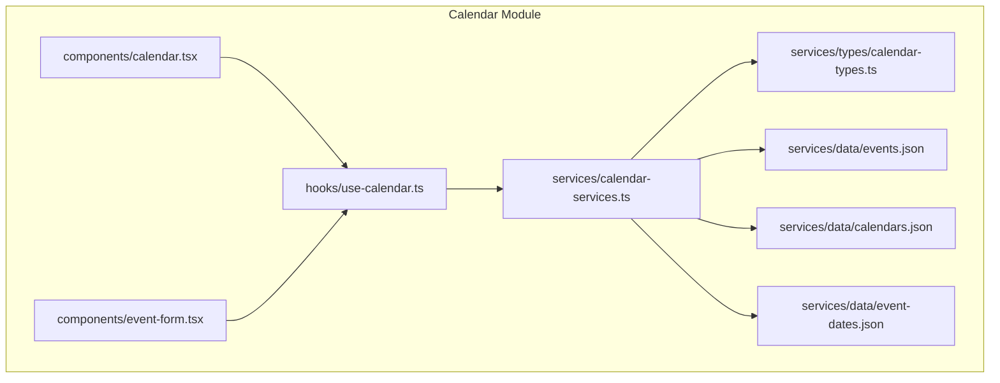
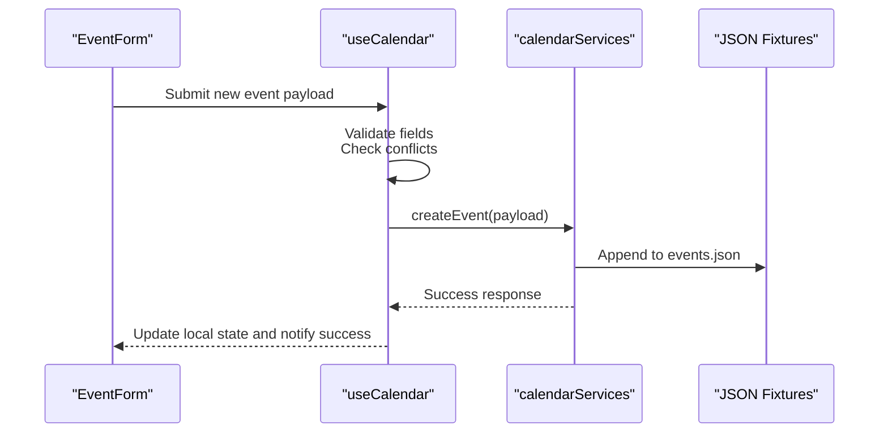
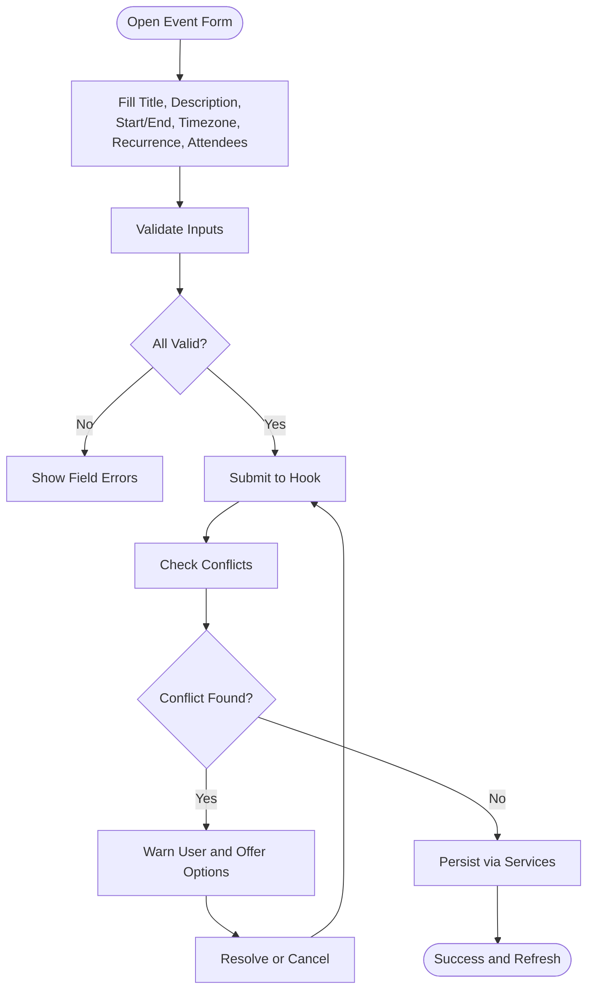
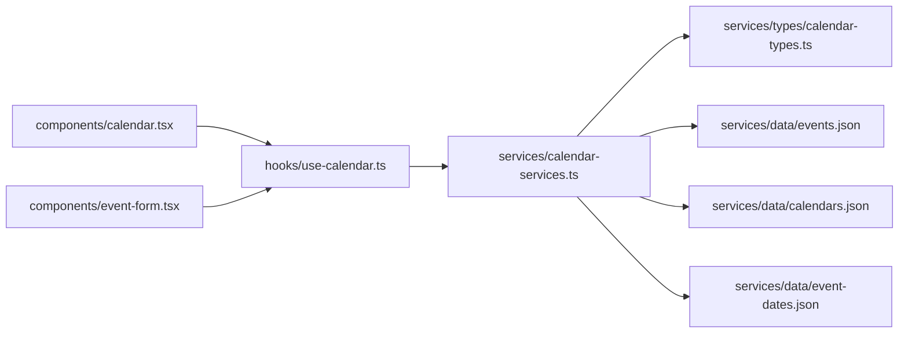

# Event Management System

<cite>
**Referenced Files in This Document**
- [calendar.tsx](file://src/modules/calendar/components/calendar.tsx)
- [event-form.tsx](file://src/modules/calendar/components/event-form.tsx)
- [use-calendar.ts](file://src/modules/calendar/hooks/use-calendar.ts)
- [calendar-services.ts](file://src/modules/calendar/services/calendar-services.ts)
- [calendar-types.ts](file://src/modules/calendar/services/types/calendar-types.ts)
- [events.json](file://src/modules/calendar/services/data/events.json)
- [calendars.json](file://src/modules/calendar/services/data/calendars.json)
- [event-dates.json](file://src/modules/calendar/services/data/event-dates.json)
</cite>

## Table of Contents
1. [Introduction](#introduction)
2. [Project Structure](#project-structure)
3. [Core Components](#core-components)
4. [Architecture Overview](#architecture-overview)
5. [Detailed Component Analysis](#detailed-component-analysis)
6. [Dependency Analysis](#dependency-analysis)
7. [Performance Considerations](#performance-considerations)
8. [Troubleshooting Guide](#troubleshooting-guide)
9. [Conclusion](#conclusion)
10. [Appendices](#appendices)

## Introduction
This document describes the event management system implemented within the calendar module. It covers CRUD operations, event creation workflows, data validation, recurring events, attendee management, conflict detection, timezone handling, and persistence strategies. The goal is to provide both a high-level understanding and detailed implementation references for developers integrating or extending the calendar features.

## Project Structure
The event management system is organized under the calendar module with clear separation between UI components, business logic hooks, services, types, and mock data:

- Components: Calendar view and event form
- Hooks: Stateful calendar logic and side effects
- Services: Data access and manipulation layer
- Types: Shared type definitions for events and calendars
- Data: JSON fixtures used as mock data sources

**Diagram sources**
- [calendar.tsx](file://src/modules/calendar/components/calendar.tsx)
- [event-form.tsx](file://src/modules/calendar/components/event-form.tsx)
- [use-calendar.ts](file://src/modules/calendar/hooks/use-calendar.ts)
- [calendar-services.ts](file://src/modules/calendar/services/calendar-services.ts)
- [calendar-types.ts](file://src/modules/calendar/services/types/calendar-types.ts)
- [events.json](file://src/modules/calendar/services/data/events.json)
- [calendars.json](file://src/modules/calendar/services/data/calendars.json)
- [event-dates.json](file://src/modules/calendar/services/data/event-dates.json)

**Section sources**
- [calendar.tsx](file://src/modules/calendar/components/calendar.tsx)
- [event-form.tsx](file://src/modules/calendar/components/event-form.tsx)
- [use-calendar.ts](file://src/modules/calendar/hooks/use-calendar.ts)
- [calendar-services.ts](file://src/modules/calendar/services/calendar-services.ts)
- [calendar-types.ts](file://src/modules/calendar/services/types/calendar-types.ts)
- [events.json](file://src/modules/calendar/services/data/events.json)
- [calendars.json](file://src/modules/calendar/services/data/calendars.json)
- [event-dates.json](file://src/modules/calendar/services/data/event-dates.json)

## Core Components
- Calendar View: Renders the calendar grid, displays events, and delegates interactions (create, edit, delete) to the hook layer.
- Event Form: A controlled form that collects event details, validates inputs, and submits changes via the hook.
- Hook Layer: Encapsulates state, CRUD operations, conflict checks, recurrence expansion, and persistence calls.
- Service Layer: Provides typed interfaces and data access to mock JSON datasets.

Key responsibilities:
- EventForm handles user input and validation before submission.
- useCalendar orchestrates lifecycle methods like createEvent, updateEvent, deleteEvent, and fetchEvents.
- calendarServices abstracts data reads/writes and exposes typed functions.

**Section sources**
- [event-form.tsx](file://src/modules/calendar/components/event-form.tsx)
- [use-calendar.ts](file://src/modules/calendar/hooks/use-calendar.ts)
- [calendar-services.ts](file://src/modules/calendar/services/calendar-services.ts)
- [calendar-types.ts](file://src/modules/calendar/services/types/calendar-types.ts)

## Architecture Overview
The system follows a layered architecture:
- Presentation Layer: React components render UI and capture user actions.
- Logic Layer: Custom hook manages state, business rules, and orchestration.
- Data Layer: Services read/write from JSON fixtures; types ensure consistency.

**Diagram sources**
- [event-form.tsx](file://src/modules/calendar/components/event-form.tsx)
- [use-calendar.ts](file://src/modules/calendar/hooks/use-calendar.ts)
- [calendar-services.ts](file://src/modules/calendar/services/calendar-services.ts)
- [events.json](file://src/modules/calendar/services/data/events.json)

## Detailed Component Analysis

### Event Form Component
Responsibilities:
- Collects event title, description, start/end times, timezone, recurrence settings, attendees, and optional reminders.
- Validates required fields, time ordering, and recurrence constraints.
- Submits validated data to the hook for processing.

Validation highlights:
- Required fields: title, start date/time, end date/time.
- Time ordering: end must be after start.
- Recurrence: valid interval and count/weekdays selection.
- Attendees: email format and uniqueness.

Submission flow:
- On submit, the form triggers the hook’s create/update method.
- The hook performs conflict detection and persists changes via services.

**Section sources**
- [event-form.tsx](file://src/modules/calendar/components/event-form.tsx)

#### Event Creation Flow

**Diagram sources**
- [event-form.tsx](file://src/modules/calendar/components/event-form.tsx)
- [use-calendar.ts](file://src/modules/calendar/hooks/use-calendar.ts)
- [calendar-services.ts](file://src/modules/calendar/services/calendar-services.ts)

### Event Data Structure
The event model includes:
- Identifier and metadata: id, title, description, color/category
- Temporal fields: start, end, timezone, allDay flag
- Recurrence: pattern, interval, count, until date, weekdays
- Participants: attendees list with roles and status
- Reminders and notes: optional arrays and text
- Persistence flags: createdAt, updatedAt, createdBy

Example usage patterns:
- Single-day vs multi-day events
- All-day events without explicit timezones
- Recurring weekly/monthly series with exceptions

**Section sources**
- [calendar-types.ts](file://src/modules/calendar/services/types/calendar-types.ts)
- [events.json](file://src/modules/calendar/services/data/events.json)

### Business Logic for Event Handling (Hook)
Responsibilities:
- Manage local state for events and selected dates
- Provide CRUD APIs: createEvent, updateEvent, deleteEvent, fetchEvents
- Implement conflict detection across overlapping time ranges
- Expand recurring events into instances for display
- Handle timezone conversions for consistent rendering
- Coordinate persistence through services

Conflict detection algorithm:
- For each candidate event, compare its time window against existing events on the same calendar(s).
- Overlap occurs when start < existing.end AND end > existing.start.
- For recurring events, expand instances within the query range and check overlaps.

Timezone handling:
- Normalize incoming timestamps to UTC for storage.
- Convert to target timezone for display based on user preferences.

Persistence strategy:
- Read initial dataset from JSON fixtures.
- Write updates by appending/updating entries in the JSON store.
- Maintain an in-memory cache to avoid redundant I/O.

**Section sources**
- [use-calendar.ts](file://src/modules/calendar/hooks/use-calendar.ts)
- [calendar-services.ts](file://src/modules/calendar/services/calendar-services.ts)
- [events.json](file://src/modules/calendar/services/data/events.json)

### Recurring Events
Supported patterns:
- Daily, weekly, monthly intervals
- Count-based or “until” date termination
- Weekday selection for weekly recurrences

Implementation approach:
- Store recurrence rule in the event model.
- Generate instances dynamically during rendering or precompute for performance.
- Allow overrides per instance (e.g., reschedule one occurrence).

**Section sources**
- [calendar-types.ts](file://src/modules/calendar/services/types/calendar-types.ts)
- [event-dates.json](file://src/modules/calendar/services/data/event-dates.json)

### Managing Event Attendees
Features:
- Add/remove attendees with email validation
- Track RSVP status (accepted, pending, declined)
- Prevent duplicate attendees per event

Workflow:
- Form collects attendee emails.
- Hook deduplicates and validates formats.
- Service persists updated attendee lists.

**Section sources**
- [event-form.tsx](file://src/modules/calendar/components/event-form.tsx)
- [use-calendar.ts](file://src/modules/calendar/hooks/use-calendar.ts)
- [calendar-services.ts](file://src/modules/calendar/services/calendar-services.ts)

### Event Validation Rules
Rules enforced:
- Required fields present
- End time after start time
- Recurrence parameters are valid
- Attendee emails are unique and well-formed
- Optional: maximum duration limits, working hours constraints

Error feedback:
- Inline field errors
- Summary messages for critical issues (e.g., conflicts)

**Section sources**
- [event-form.tsx](file://src/modules/calendar/components/event-form.tsx)
- [use-calendar.ts](file://src/modules/calendar/hooks/use-calendar.ts)

### Event Conflict Detection
Approach:
- Compare candidate event windows against existing events on shared calendars.
- For recurring events, expand instances within the relevant date range.
- Return a list of conflicting events and suggested alternatives.

Integration points:
- Triggered before persisting new or updated events.
- Presents warnings and allows override if necessary.

**Section sources**
- [use-calendar.ts](file://src/modules/calendar/hooks/use-calendar.ts)
- [calendar-services.ts](file://src/modules/calendar/services/calendar-services.ts)
- [events.json](file://src/modules/calendar/services/data/events.json)

### Timezone Handling
Strategies:
- Store timestamps in UTC internally.
- Accept user-provided timezone offsets for display.
- Convert to browser/local timezone for UI rendering.
- Preserve original timezone metadata for accurate recurrence and reminders.

**Section sources**
- [calendar-types.ts](file://src/modules/calendar/services/types/calendar-types.ts)
- [use-calendar.ts](file://src/modules/calendar/hooks/use-calendar.ts)

### Persistence Strategies
Current implementation:
- Mock JSON files serve as the data source.
- Services read/write to these files to simulate backend behavior.
- In-memory cache improves performance and reduces repeated reads.

Future considerations:
- Replace JSON with a real API endpoint.
- Introduce optimistic updates and rollback on failure.
- Add indexing for faster conflict checks and queries.

**Section sources**
- [calendar-services.ts](file://src/modules/calendar/services/calendar-services.ts)
- [events.json](file://src/modules/calendar/services/data/events.json)
- [calendars.json](file://src/modules/calendar/services/data/calendars.json)

## Dependency Analysis
The following diagram shows how components, hooks, services, and data interact:

**Diagram sources**
- [calendar.tsx](file://src/modules/calendar/components/calendar.tsx)
- [event-form.tsx](file://src/modules/calendar/components/event-form.tsx)
- [use-calendar.ts](file://src/modules/calendar/hooks/use-calendar.ts)
- [calendar-services.ts](file://src/modules/calendar/services/calendar-services.ts)
- [calendar-types.ts](file://src/modules/calendar/services/types/calendar-types.ts)
- [events.json](file://src/modules/calendar/services/data/events.json)
- [calendars.json](file://src/modules/calendar/services/data/calendars.json)
- [event-dates.json](file://src/modules/calendar/services/data/event-dates.json)

**Section sources**
- [calendar.tsx](file://src/modules/calendar/components/calendar.tsx)
- [event-form.tsx](file://src/modules/calendar/components/event-form.tsx)
- [use-calendar.ts](file://src/modules/calendar/hooks/use-calendar.ts)
- [calendar-services.ts](file://src/modules/calendar/services/calendar-services.ts)
- [calendar-types.ts](file://src/modules/calendar/services/types/calendar-types.ts)
- [events.json](file://src/modules/calendar/services/data/events.json)
- [calendars.json](file://src/modules/calendar/services/data/calendars.json)
- [event-dates.json](file://src/modules/calendar/services/data/event-dates.json)

## Performance Considerations
- Memoize expensive computations such as recurrence expansion and conflict checks.
- Debounce form submissions to prevent redundant service calls.
- Use virtualization for large event lists to improve rendering performance.
- Cache frequently accessed datasets and invalidate on mutations.
- Batch updates when modifying multiple events or attendees.

[No sources needed since this section provides general guidance]

## Troubleshooting Guide
Common issues and resolutions:
- Validation failures: Ensure required fields are filled and time ordering is correct. Check attendee email formats and duplicates.
- Conflicts not detected: Verify timezone normalization and overlap calculation boundaries.
- Recurrence not expanding: Confirm recurrence parameters and date range queries.
- Persistence errors: Inspect service responses and JSON file integrity.

Diagnostic steps:
- Log event payloads before submission.
- Print expanded instances for recurring events.
- Review conflict detection results and affected events.

**Section sources**
- [event-form.tsx](file://src/modules/calendar/components/event-form.tsx)
- [use-calendar.ts](file://src/modules/calendar/hooks/use-calendar.ts)
- [calendar-services.ts](file://src/modules/calendar/services/calendar-services.ts)

## Conclusion
The event management system provides a robust foundation for creating, editing, and managing calendar events with strong validation, conflict detection, and timezone support. Its layered architecture separates concerns effectively, enabling future enhancements such as real-time collaboration, advanced recurrence rules, and integration with external scheduling services.

[No sources needed since this section summarizes without analyzing specific files]

## Appendices

### Example Scenarios
- Create a single meeting:
  - Set title, start/end times, and timezone.
  - Add attendees and save.
- Create a recurring weekly workshop:
  - Choose weekly recurrence, set interval and count.
  - Save and verify expanded instances.
- Reschedule one occurrence:
  - Override a specific instance while keeping the series intact.
- Detect and resolve conflicts:
  - Attempt to create an overlapping event and follow prompts to adjust times.

[No sources needed since this section provides conceptual examples]