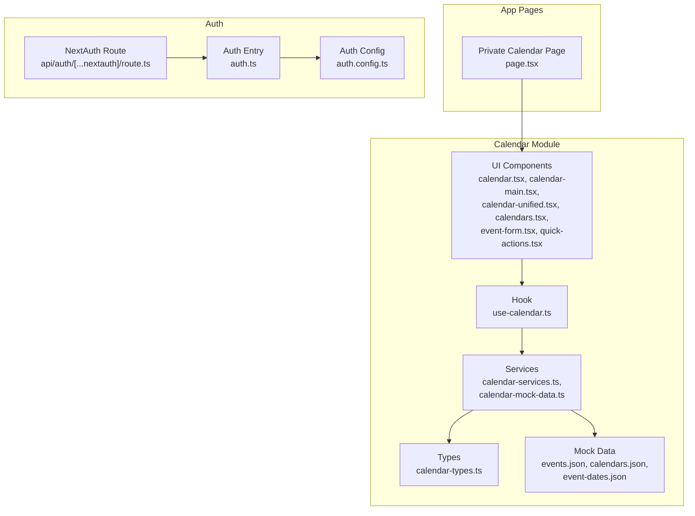
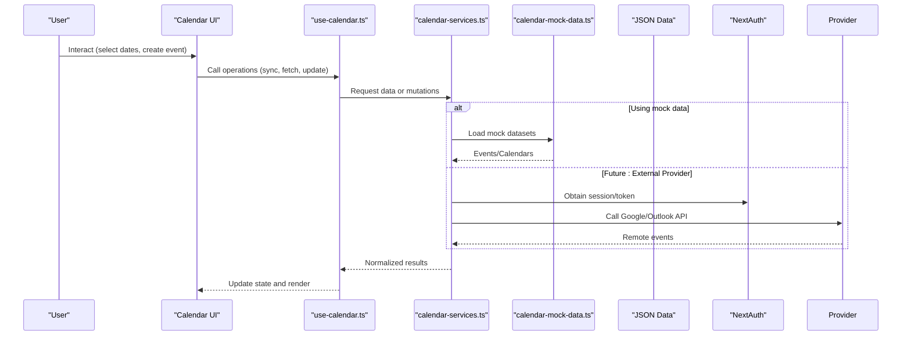
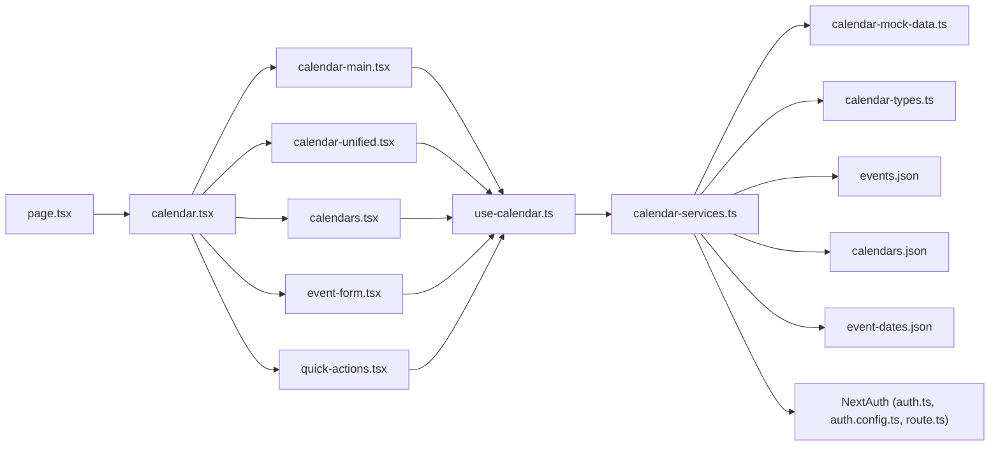
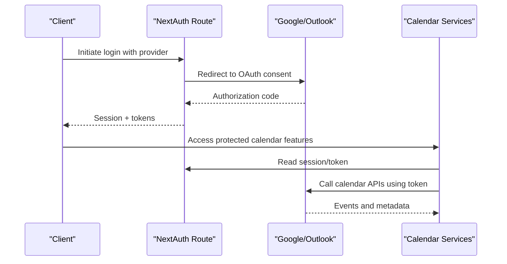
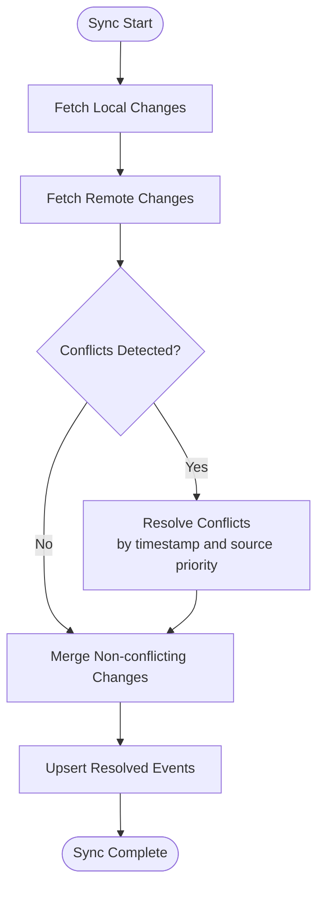

# External Calendar Integrations

<cite>
**Referenced Files in This Document**
- [calendar.tsx](file://src/modules/calendar/components/calendar.tsx)
- [calendar-main.tsx](file://src/modules/calendar/components/calendar-main.tsx)
- [calendar-unified.tsx](file://src/modules/calendar/components/calendar-unified.tsx)
- [calendar-sidebar.tsx](file://src/modules/calendar/components/calendar-sidebar.tsx)
- [calendars.tsx](file://src/modules/calendar/components/calendars.tsx)
- [event-form.tsx](file://src/modules/calendar/components/event-form.tsx)
- [quick-actions.tsx](file://src/modules/calendar/components/quick-actions.tsx)
- [use-calendar.ts](file://src/modules/calendar/hooks/use-calendar.ts)
- [calendar-services.ts](file://src/modules/calendar/services/calendar-services.ts)
- [calendar-mock-data.ts](file://src/modules/calendar/services/calendar-mock-data.ts)
- [calendar-types.ts](file://src/modules/calendar/services/types/calendar-types.ts)
- [events.json](file://src/modules/calendar/services/data/events.json)
- [calendars.json](file://src/modules/calendar/services/data/calendars.json)
- [event-dates.json](file://src/modules/calendar/services/data/event-dates.json)
- [page.tsx](file://src/app/(private)/calendar/page.tsx)
- [auth.ts](file://src/auth.ts)
- [auth.config.ts](file://src/auth.config.ts)
- [route.ts](file://src/app/api/auth/[...nextauth]/route.ts)
</cite>

## Table of Contents
1. [Introduction](#introduction)
2. [Project Structure](#project-structure)
3. [Core Components](#core-components)
4. [Architecture Overview](#architecture-overview)
5. [Detailed Component Analysis](#detailed-component-analysis)
6. [Dependency Analysis](#dependency-analysis)
7. [Performance Considerations](#performance-considerations)
8. [Troubleshooting Guide](#troubleshooting-guide)
9. [Conclusion](#conclusion)
10. [Appendices](#appendices)

## Introduction
This document explains how external calendar integrations and synchronization are structured within the application, focusing on connecting with Google Calendar, Outlook, and other calendar services. It covers authentication flows, data synchronization strategies, conflict resolution mechanisms, real-time updates, permissions management, error handling, retry logic, and offline support. The guidance is grounded in the existing calendar module and NextAuth setup to provide a practical path for implementing robust integrations.

## Project Structure
The calendar feature is implemented as a modular component set under src/modules/calendar, with UI components, hooks, services, types, and mock data. The private route page composes the main calendar view. Authentication is configured via NextAuth files at the project root and API route.

**Diagram sources**
- [calendar.tsx](file://src/modules/calendar/components/calendar.tsx)
- [calendar-main.tsx](file://src/modules/calendar/components/calendar-main.tsx)
- [calendar-unified.tsx](file://src/modules/calendar/components/calendar-unified.tsx)
- [calendars.tsx](file://src/modules/calendar/components/calendars.tsx)
- [event-form.tsx](file://src/modules/calendar/components/event-form.tsx)
- [quick-actions.tsx](file://src/modules/calendar/components/quick-actions.tsx)
- [use-calendar.ts](file://src/modules/calendar/hooks/use-calendar.ts)
- [calendar-services.ts](file://src/modules/calendar/services/calendar-services.ts)
- [calendar-mock-data.ts](file://src/modules/calendar/services/calendar-mock-data.ts)
- [calendar-types.ts](file://src/modules/calendar/services/types/calendar-types.ts)
- [events.json](file://src/modules/calendar/services/data/events.json)
- [calendars.json](file://src/modules/calendar/services/data/calendars.json)
- [event-dates.json](file://src/modules/calendar/services/data/event-dates.json)
- [page.tsx](file://src/app/(private)/calendar/page.tsx)
- [auth.ts](file://src/auth.ts)
- [auth.config.ts](file://src/auth.config.ts)
- [route.ts](file://src/app/api/auth/[...nextauth]/route.ts)

**Section sources**
- [page.tsx](file://src/app/(private)/calendar/page.tsx)
- [calendar.tsx](file://src/modules/calendar/components/calendar.tsx)
- [calendar-main.tsx](file://src/modules/calendar/components/calendar-main.tsx)
- [calendar-unified.tsx](file://src/modules/calendar/components/calendar-unified.tsx)
- [calendars.tsx](file://src/modules/calendar/components/calendars.tsx)
- [event-form.tsx](file://src/modules/calendar/components/event-form.tsx)
- [quick-actions.tsx](file://src/modules/calendar/components/quick-actions.tsx)
- [use-calendar.ts](file://src/modules/calendar/hooks/use-calendar.ts)
- [calendar-services.ts](file://src/modules/calendar/services/calendar-services.ts)
- [calendar-mock-data.ts](file://src/modules/calendar/services/calendar-mock-data.ts)
- [calendar-types.ts](file://src/modules/calendar/services/types/calendar-types.ts)
- [events.json](file://src/modules/calendar/services/data/events.json)
- [calendars.json](file://src/modules/calendar/services/data/calendars.json)
- [event-dates.json](file://src/modules/calendar/services/data/event-dates.json)
- [auth.ts](file://src/auth.ts)
- [auth.config.ts](file://src/auth.config.ts)
- [route.ts](file://src/app/api/auth/[...nextauth]/route.ts)

## Core Components
- Calendar UI layer: Provides views and interactions for displaying events, managing calendars, and creating/editing events.
- Hook layer: Encapsulates state and side effects for calendar operations (fetching, syncing, updating).
- Service layer: Coordinates data access, including mock data and future integration points for external providers.
- Types and data: Define shared shapes and seed data used across the module.

Key responsibilities:
- Rendering and user interactions for calendar grids and event forms.
- Managing selected calendars, date ranges, and event selection.
- Orchestrating sync operations and local state updates.
- Defining consistent data models for events and calendars.

**Section sources**
- [calendar.tsx](file://src/modules/calendar/components/calendar.tsx)
- [calendar-main.tsx](file://src/modules/calendar/components/calendar-main.tsx)
- [calendar-unified.tsx](file://src/modules/calendar/components/calendar-unified.tsx)
- [calendars.tsx](file://src/modules/calendar/components/calendars.tsx)
- [event-form.tsx](file://src/modules/calendar/components/event-form.tsx)
- [quick-actions.tsx](file://src/modules/calendar/components/quick-actions.tsx)
- [use-calendar.ts](file://src/modules/calendar/hooks/use-calendar.ts)
- [calendar-services.ts](file://src/modules/calendar/services/calendar-services.ts)
- [calendar-mock-data.ts](file://src/modules/calendar/services/calendar-mock-data.ts)
- [calendar-types.ts](file://src/modules/calendar/services/types/calendar-types.ts)

## Architecture Overview
The architecture separates presentation from business logic and data access. The hook coordinates service calls and updates UI state. Services abstract data sources and can be extended to call external APIs. NextAuth provides centralized authentication that can be leveraged by calendar services to obtain provider tokens.

**Diagram sources**
- [use-calendar.ts](file://src/modules/calendar/hooks/use-calendar.ts)
- [calendar-services.ts](file://src/modules/calendar/services/calendar-services.ts)
- [calendar-mock-data.ts](file://src/modules/calendar/services/calendar-mock-data.ts)
- [events.json](file://src/modules/calendar/services/data/events.json)
- [calendars.json](file://src/modules/calendar/services/data/calendars.json)
- [event-dates.json](file://src/modules/calendar/services/data/event-dates.json)
- [auth.ts](file://src/auth.ts)
- [auth.config.ts](file://src/auth.config.ts)
- [route.ts](file://src/app/api/auth/[...nextauth]/route.ts)

## Detailed Component Analysis

### Calendar UI Layer
- calendar.tsx: Root calendar container coordinating layout and global state.
- calendar-main.tsx: Main content area rendering the calendar grid and event list.
- calendar-unified.tsx: Unified view combining multiple calendar sources.
- calendars.tsx: Calendar selector and toggles for visibility.
- event-form.tsx: Form for creating and editing events.
- quick-actions.tsx: Shortcuts for common actions like adding events or switching views.

Responsibilities:
- Presenting events and calendars based on normalized data.
- Handling user inputs and delegating to the hook for side effects.
- Providing controls for filtering, selecting, and managing calendars.

**Section sources**
- [calendar.tsx](file://src/modules/calendar/components/calendar.tsx)
- [calendar-main.tsx](file://src/modules/calendar/components/calendar-main.tsx)
- [calendar-unified.tsx](file://src/modules/calendar/components/calendar-unified.tsx)
- [calendars.tsx](file://src/modules/calendar/components/calendars.tsx)
- [event-form.tsx](file://src/modules/calendar/components/event-form.tsx)
- [quick-actions.tsx](file://src/modules/calendar/components/quick-actions.tsx)

### Hook Layer: use-calendar.ts
Encapsulates calendar state and operations such as fetching events, syncing with external sources, and updating local state. It should centralize retry logic, error handling, and caching strategies.

Integration points:
- Calls into calendar-services.ts for data access.
- Uses NextAuth session to obtain provider tokens when needed.
- Emits events or callbacks for UI updates.

**Section sources**
- [use-calendar.ts](file://src/modules/calendar/hooks/use-calendar.ts)

### Service Layer: calendar-services.ts and calendar-mock-data.ts
- calendar-services.ts: Orchestrates data retrieval and mutations; currently uses mock data but designed to integrate with external providers.
- calendar-mock-data.ts: Supplies sample events and calendars for development and testing.

Design considerations:
- Normalize provider responses into shared types.
- Implement idempotent upserts to avoid duplicates.
- Provide clear error boundaries and status reporting.

**Section sources**
- [calendar-services.ts](file://src/modules/calendar/services/calendar-services.ts)
- [calendar-mock-data.ts](file://src/modules/calendar/services/calendar-mock-data.ts)

### Types and Data: calendar-types.ts and JSON fixtures
- calendar-types.ts: Defines shared interfaces for events, calendars, and related metadata.
- events.json, calendars.json, event-dates.json: Seed data for development and tests.

Benefits:
- Consistent shape across UI and services.
- Easier mocking and testing.
- Clear contract for external provider adapters.

**Section sources**
- [calendar-types.ts](file://src/modules/calendar/services/types/calendar-types.ts)
- [events.json](file://src/modules/calendar/services/data/events.json)
- [calendars.json](file://src/modules/calendar/services/data/calendars.json)
- [event-dates.json](file://src/modules/calendar/services/data/event-dates.json)

### Authentication Integration Points
NextAuth configuration and route provide the foundation for authenticating users and obtaining tokens for external calendar providers.

- auth.config.ts: Provider configuration and options.
- auth.ts: Central auth entry point.
- api/auth/[...nextauth]/route.ts: NextAuth API route.

When integrating Google Calendar or Outlook:
- Add provider credentials in auth config.
- Use session tokens in calendar services to call provider APIs.
- Store minimal provider-specific identifiers locally if needed.

**Section sources**
- [auth.config.ts](file://src/auth.config.ts)
- [auth.ts](file://src/auth.ts)
- [route.ts](file://src/app/api/auth/[...nextauth]/route.ts)

## Dependency Analysis
The following diagram shows how components depend on each other and where external integrations can be introduced.

**Diagram sources**
- [page.tsx](file://src/app/(private)/calendar/page.tsx)
- [calendar.tsx](file://src/modules/calendar/components/calendar.tsx)
- [calendar-main.tsx](file://src/modules/calendar/components/calendar-main.tsx)
- [calendar-unified.tsx](file://src/modules/calendar/components/calendar-unified.tsx)
- [calendars.tsx](file://src/modules/calendar/components/calendars.tsx)
- [event-form.tsx](file://src/modules/calendar/components/event-form.tsx)
- [quick-actions.tsx](file://src/modules/calendar/components/quick-actions.tsx)
- [use-calendar.ts](file://src/modules/calendar/hooks/use-calendar.ts)
- [calendar-services.ts](file://src/modules/calendar/services/calendar-services.ts)
- [calendar-mock-data.ts](file://src/modules/calendar/services/calendar-mock-data.ts)
- [calendar-types.ts](file://src/modules/calendar/services/types/calendar-types.ts)
- [events.json](file://src/modules/calendar/services/data/events.json)
- [calendars.json](file://src/modules/calendar/services/data/calendars.json)
- [event-dates.json](file://src/modules/calendar/services/data/event-dates.json)
- [auth.ts](file://src/auth.ts)
- [auth.config.ts](file://src/auth.config.ts)
- [route.ts](file://src/app/api/auth/[...nextauth]/route.ts)

**Section sources**
- [page.tsx](file://src/app/(private)/calendar/page.tsx)
- [calendar.tsx](file://src/modules/calendar/components/calendar.tsx)
- [calendar-main.tsx](file://src/modules/calendar/components/calendar-main.tsx)
- [calendar-unified.tsx](file://src/modules/calendar/components/calendar-unified.tsx)
- [calendars.tsx](file://src/modules/calendar/components/calendars.tsx)
- [event-form.tsx](file://src/modules/calendar/components/event-form.tsx)
- [quick-actions.tsx](file://src/modules/calendar/components/quick-actions.tsx)
- [use-calendar.ts](file://src/modules/calendar/hooks/use-calendar.ts)
- [calendar-services.ts](file://src/modules/calendar/services/calendar-services.ts)
- [calendar-mock-data.ts](file://src/modules/calendar/services/calendar-mock-data.ts)
- [calendar-types.ts](file://src/modules/calendar/services/types/calendar-types.ts)
- [events.json](file://src/modules/calendar/services/data/events.json)
- [calendars.json](file://src/modules/calendar/services/data/calendars.json)
- [event-dates.json](file://src/modules/calendar/services/data/event-dates.json)
- [auth.ts](file://src/auth.ts)
- [auth.config.ts](file://src/auth.config.ts)
- [route.ts](file://src/app/api/auth/[...nextauth]/route.ts)

## Performance Considerations
- Prefer pagination and incremental sync to reduce payload sizes.
- Cache normalized events locally and invalidate on changes.
- Debounce rapid UI interactions (e.g., drag-and-drop) before persisting.
- Batch writes when possible to minimize network calls.
- Use optimistic updates with rollback on failure.

[No sources needed since this section provides general guidance]

## Troubleshooting Guide
Common issues and resolutions:
- Authentication failures: Verify provider credentials and scopes in auth config; ensure the NextAuth route is correctly mounted.
- Sync errors: Inspect service-layer error paths and implement retries with exponential backoff.
- Duplicate events: Ensure idempotent upserts keyed by provider IDs.
- Offline mode: Queue mutations and replay when connectivity resumes.

Operational tips:
- Log request/response summaries without sensitive data.
- Surface actionable errors to users with retry prompts.
- Monitor token expiration and refresh flows.

**Section sources**
- [auth.config.ts](file://src/auth.config.ts)
- [auth.ts](file://src/auth.ts)
- [route.ts](file://src/app/api/auth/[...nextauth]/route.ts)
- [calendar-services.ts](file://src/modules/calendar/services/calendar-services.ts)

## Conclusion
The calendar module is structured to support external integrations through a clean separation of concerns. By leveraging NextAuth for provider authentication and extending the service layer to call Google Calendar and Outlook APIs, you can implement robust synchronization with strong error handling, retry logic, and offline support. The provided diagrams and references guide implementation while keeping the codebase maintainable and testable.

[No sources needed since this section summarizes without analyzing specific files]

## Appendices

### Authentication Flow for External Providers

**Diagram sources**
- [route.ts](file://src/app/api/auth/[...nextauth]/route.ts)
- [auth.ts](file://src/auth.ts)
- [auth.config.ts](file://src/auth.config.ts)
- [calendar-services.ts](file://src/modules/calendar/services/calendar-services.ts)

### Conflict Resolution Strategy

[No sources needed since this diagram shows conceptual workflow, not actual code structure]

### Permissions Management
- Required scopes:
  - Google Calendar: read/write access to calendars and events.
  - Outlook/Office 365: Calendars.ReadWrite scope.
- Prompt users for minimal necessary permissions.
- Persist provider-specific identifiers securely.
- Re-authenticate when tokens expire or permissions change.

[No sources needed since this section provides general guidance]