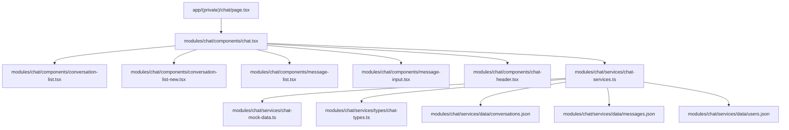
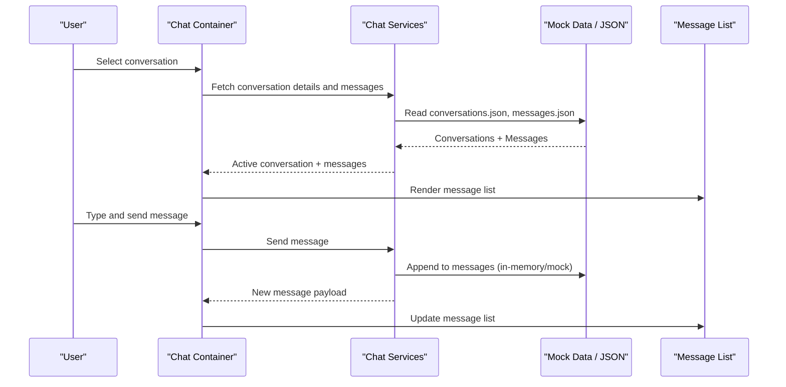
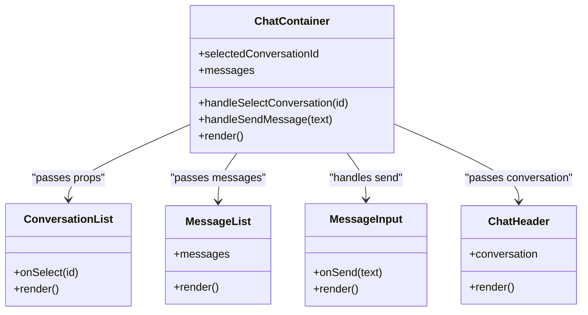
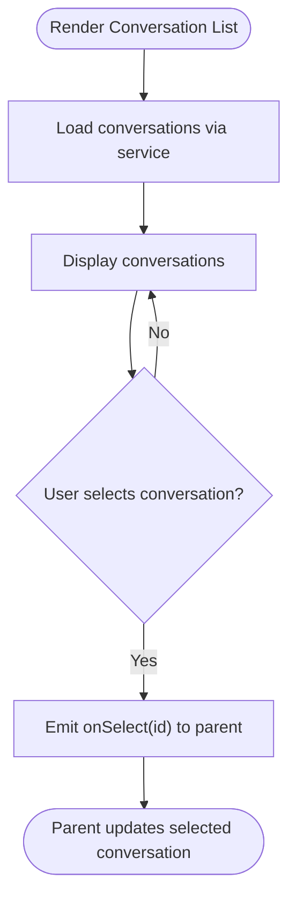
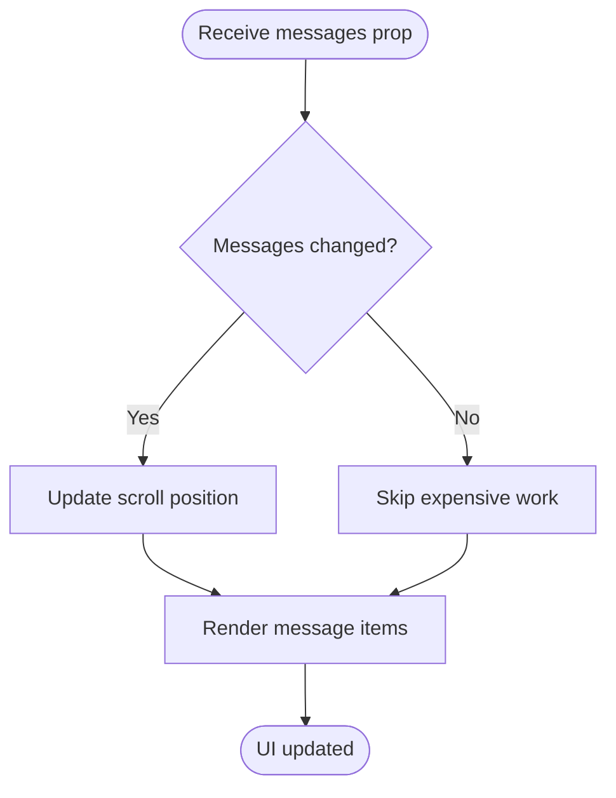
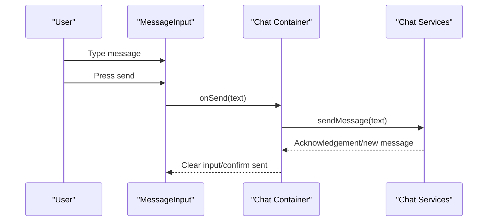
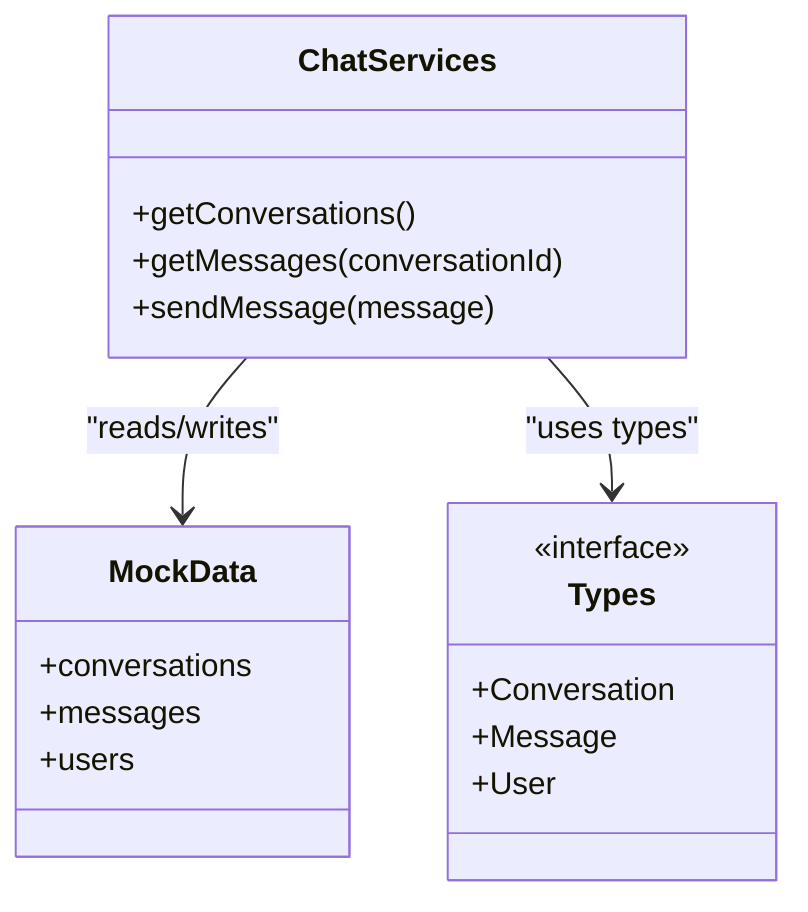
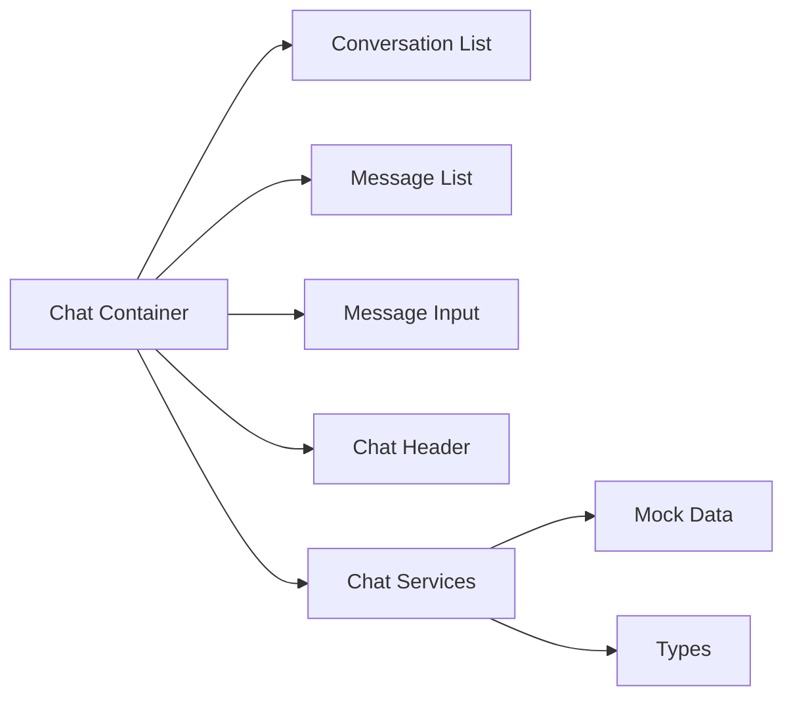

# Chat Architecture & Core Components

<cite>
**Referenced Files in This Document**
- [chat/page.tsx](file://src/app/(private)/chat/page.tsx)
- [components/chat.tsx](file://src/modules/chat/components/chat.tsx)
- [components/conversation-list.tsx](file://src/modules/chat/components/conversation-list.tsx)
- [components/conversation-list-new.tsx](file://src/modules/chat/components/conversation-list-new.tsx)
- [components/message-list.tsx](file://src/modules/chat/components/message-list.tsx)
- [components/message-input.tsx](file://src/modules/chat/components/message-input.tsx)
- [components/chat-header.tsx](file://src/modules/chat/components/chat-header.tsx)
- [services/chat-services.ts](file://src/modules/chat/services/chat-services.ts)
- [services/chat-mock-data.ts](file://src/modules/chat/services/chat-mock-data.ts)
- [services/types/chat-types.ts](file://src/modules/chat/services/types/chat-types.ts)
- [services/data/conversations.json](file://src/modules/chat/services/data/conversations.json)
- [services/data/messages.json](file://src/modules/chat/services/data/messages.json)
- [services/data/users.json](file://src/modules/chat/services/data/users.json)
</cite>

## Table of Contents
1. [Introduction](#introduction)
2. [Project Structure](#project-structure)
3. [Core Components](#core-components)
4. [Architecture Overview](#architecture-overview)
5. [Detailed Component Analysis](#detailed-component-analysis)
6. [Dependency Analysis](#dependency-analysis)
7. [Performance Considerations](#performance-considerations)
8. [Troubleshooting Guide](#troubleshooting-guide)
9. [Conclusion](#conclusion)

## Introduction
This document explains the chat system architecture and core components within the dashboard application. It focuses on design patterns, component hierarchy, data flow between services and UI, state management for conversations and messages, message queue behavior, and real-time communication patterns. It also shows how the main Chat component orchestrates conversation lists, message display, and user interactions, and how the service layer abstracts both mock data and potential real-time connections.

## Project Structure
The chat feature is organized under a dedicated module with clear separation between UI components and services:
- Feature page entry point renders the Chat container.
- The Chat container composes Conversation List, Message List, Message Input, and Chat Header.
- Services encapsulate data access (mock JSON and typed interfaces), enabling future integration with real-time backends.

**Diagram sources**
- [chat/page.tsx](file://src/app/(private)/chat/page.tsx)
- [components/chat.tsx](file://src/modules/chat/components/chat.tsx)
- [components/conversation-list.tsx](file://src/modules/chat/components/conversation-list.tsx)
- [components/conversation-list-new.tsx](file://src/modules/chat/components/conversation-list-new.tsx)
- [components/message-list.tsx](file://src/modules/chat/components/message-list.tsx)
- [components/message-input.tsx](file://src/modules/chat/components/message-input.tsx)
- [components/chat-header.tsx](file://src/modules/chat/components/chat-header.tsx)
- [services/chat-services.ts](file://src/modules/chat/services/chat-services.ts)
- [services/chat-mock-data.ts](file://src/modules/chat/services/chat-mock-data.ts)
- [services/types/chat-types.ts](file://src/modules/chat/services/types/chat-types.ts)
- [services/data/conversations.json](file://src/modules/chat/services/data/conversations.json)
- [services/data/messages.json](file://src/modules/chat/services/data/messages.json)
- [services/data/users.json](file://src/modules/chat/services/data/users.json)

**Section sources**
- [chat/page.tsx](file://src/app/(private)/chat/page.tsx)
- [components/chat.tsx](file://src/modules/chat/components/chat.tsx)
- [services/chat-services.ts](file://src/modules/chat/services/chat-services.ts)

## Core Components
- Chat container: Orchestrates state for selected conversation, message list, and input; wires up event handlers to send messages and switch conversations.
- Conversation List: Displays available conversations and handles selection.
- Message List: Renders messages for the active conversation with scrolling and rendering optimizations.
- Message Input: Captures user input and triggers send actions.
- Chat Header: Shows context for the current conversation (e.g., title or participant info).

Responsibilities and interactions:
- The Chat container holds the primary state (selected conversation ID, messages, typing indicators if any).
- Conversation List emits selection events to update the active conversation.
- Message Input emits send events that enqueue messages via the service layer.
- Message List subscribes to message updates and re-renders accordingly.
- Chat Header reflects conversation metadata.

State management approach:
- Local React state in the Chat container manages conversation selection and message list.
- Service layer provides functions to fetch initial data and perform mutations (send message).
- Future real-time updates can be integrated by pushing new messages into the same state source used by Message List.

**Section sources**
- [components/chat.tsx](file://src/modules/chat/components/chat.tsx)
- [components/conversation-list.tsx](file://src/modules/chat/components/conversation-list.tsx)
- [components/message-list.tsx](file://src/modules/chat/components/message-list.tsx)
- [components/message-input.tsx](file://src/modules/chat/components/message-input.tsx)
- [components/chat-header.tsx](file://src/modules/chat/components/chat-header.tsx)

## Architecture Overview
The chat follows a layered architecture:
- Presentation Layer: React components for UI composition and user interaction.
- State Orchestration: Chat container coordinates local state and dispatches actions.
- Service Layer: Encapsulates data operations and abstracts data sources (mock JSON now, extensible to real-time).
- Data Sources: Static JSON files for conversations, messages, and users.

**Diagram sources**
- [components/chat.tsx](file://src/modules/chat/components/chat.tsx)
- [services/chat-services.ts](file://src/modules/chat/services/chat-services.ts)
- [services/chat-mock-data.ts](file://src/modules/chat/services/chat-mock-data.ts)
- [services/data/conversations.json](file://src/modules/chat/services/data/conversations.json)
- [services/data/messages.json](file://src/modules/chat/services/data/messages.json)

## Detailed Component Analysis

### Chat Container
- Responsibilities:
  - Maintain selected conversation ID and message list.
  - Handle conversation selection from Conversation List.
  - Handle sending messages from Message Input.
  - Compose Chat Header and Message List with current state.
- Interaction with services:
  - Loads initial data via service methods.
  - Delegates mutation (send) to service layer.
- Extensibility:
  - Can integrate real-time subscriptions by updating the same message list state when new messages arrive.

**Diagram sources**
- [components/chat.tsx](file://src/modules/chat/components/chat.tsx)
- [components/conversation-list.tsx](file://src/modules/chat/components/conversation-list.tsx)
- [components/message-list.tsx](file://src/modules/chat/components/message-list.tsx)
- [components/message-input.tsx](file://src/modules/chat/components/message-input.tsx)
- [components/chat-header.tsx](file://src/modules/chat/components/chat-header.tsx)

**Section sources**
- [components/chat.tsx](file://src/modules/chat/components/chat.tsx)

### Conversation List
- Responsibilities:
  - Display list of conversations.
  - Emit selection events to the parent Chat container.
- Data source:
  - Uses service methods to retrieve conversations.
- UX considerations:
  - Highlights the currently selected conversation.

**Diagram sources**
- [components/conversation-list.tsx](file://src/modules/chat/components/conversation-list.tsx)
- [services/chat-services.ts](file://src/modules/chat/services/chat-services.ts)

**Section sources**
- [components/conversation-list.tsx](file://src/modules/chat/components/conversation-list.tsx)

### Message List
- Responsibilities:
  - Render messages for the active conversation.
  - Provide scroll-to-bottom behavior when new messages arrive.
- Performance:
  - Leverages memoization and efficient rendering strategies to avoid unnecessary re-renders.
- Real-time readiness:
  - Accepts incremental message updates from the parent state.

**Diagram sources**
- [components/message-list.tsx](file://src/modules/chat/components/message-list.tsx)

**Section sources**
- [components/message-list.tsx](file://src/modules/chat/components/message-list.tsx)

### Message Input
- Responsibilities:
  - Capture user text input.
  - Trigger send action with validated content.
- Validation:
  - Prevents sending empty messages.
- Integration:
  - Calls parent-provided send handler which delegates to the service layer.

**Diagram sources**
- [components/message-input.tsx](file://src/modules/chat/components/message-input.tsx)
- [components/chat.tsx](file://src/modules/chat/components/chat.tsx)
- [services/chat-services.ts](file://src/modules/chat/services/chat-services.ts)

**Section sources**
- [components/message-input.tsx](file://src/modules/chat/components/message-input.tsx)

### Chat Header
- Responsibilities:
  - Display conversation context (title, participant info).
- Data binding:
  - Receives conversation object from the Chat container.

**Section sources**
- [components/chat-header.tsx](file://src/modules/chat/components/chat-header.tsx)

### Service Layer Abstraction
- Responsibilities:
  - Provide typed interfaces for conversations, messages, and users.
  - Implement mock data retrieval and mutations using static JSON.
  - Expose consistent APIs for the UI layer, enabling future replacement with real-time backends.
- Current implementation:
  - Reads from JSON fixtures for initial data.
  - Maintains in-memory structures for mutations during development.
- Extensibility:
  - Replace mock implementations with WebSocket or server-sent events without changing UI contracts.

**Diagram sources**
- [services/chat-services.ts](file://src/modules/chat/services/chat-services.ts)
- [services/chat-mock-data.ts](file://src/modules/chat/services/chat-mock-data.ts)
- [services/types/chat-types.ts](file://src/modules/chat/services/types/chat-types.ts)

**Section sources**
- [services/chat-services.ts](file://src/modules/chat/services/chat-services.ts)
- [services/chat-mock-data.ts](file://src/modules/chat/services/chat-mock-data.ts)
- [services/types/chat-types.ts](file://src/modules/chat/services/types/chat-types.ts)

### Data Models
- Conversations: Represent chat threads with identifiers and metadata.
- Messages: Represent individual messages with sender, timestamp, and content.
- Users: Represent participants with identifiers and profile information.

These models are defined in the types file and referenced across services and components.

**Section sources**
- [services/types/chat-types.ts](file://src/modules/chat/services/types/chat-types.ts)
- [services/data/conversations.json](file://src/modules/chat/services/data/conversations.json)
- [services/data/messages.json](file://src/modules/chat/services/data/messages.json)
- [services/data/users.json](file://src/modules/chat/services/data/users.json)

## Dependency Analysis
- UI components depend on the Chat container for state and event handling.
- The Chat container depends on the service layer for data operations.
- The service layer depends on mock data and type definitions.
- No circular dependencies are present among these modules.

**Diagram sources**
- [components/chat.tsx](file://src/modules/chat/components/chat.tsx)
- [components/conversation-list.tsx](file://src/modules/chat/components/conversation-list.tsx)
- [components/message-list.tsx](file://src/modules/chat/components/message-list.tsx)
- [components/message-input.tsx](file://src/modules/chat/components/message-input.tsx)
- [components/chat-header.tsx](file://src/modules/chat/components/chat-header.tsx)
- [services/chat-services.ts](file://src/modules/chat/services/chat-services.ts)
- [services/chat-mock-data.ts](file://src/modules/chat/services/chat-mock-data.ts)
- [services/types/chat-types.ts](file://src/modules/chat/services/types/chat-types.ts)

**Section sources**
- [components/chat.tsx](file://src/modules/chat/components/chat.tsx)
- [services/chat-services.ts](file://src/modules/chat/services/chat-services.ts)

## Performance Considerations
- Avoid unnecessary re-renders in Message List by leveraging memoization and stable references for props.
- Use virtualized lists if message counts grow significantly.
- Debounce heavy computations in the service layer if processing large datasets.
- Keep service calls minimal; batch updates where possible.

## Troubleshooting Guide
- If messages do not appear after sending:
  - Verify that the send handler updates the local message list and that Message List receives the updated prop.
  - Ensure the service method returns or mutates the expected message structure.
- If conversation switching does not reflect changes:
  - Confirm that the selected conversation ID is correctly propagated to Message List and Chat Header.
- If performance degrades with many messages:
  - Introduce virtualization and ensure key props are unique and stable.

## Conclusion
The chat system uses a clean separation between UI and service layers, with the Chat container orchestrating state and interactions. The service layer abstracts data access, currently backed by mock JSON but designed for easy extension to real-time backends. This architecture supports scalable growth, predictable data flow, and maintainable code organization.