# Chat System

<cite>
**Referenced Files in This Document**
- [chat page](file://src/app/(private)/chat/page.tsx)
- [chat component](file://src/modules/chat/components/chat.tsx)
- [chat services](file://src/modules/chat/services/chat-services.ts)
- [chat types](file://src/modules/chat/services/types/chat-types.ts)
- [conversation list](file://src/modules/chat/components/conversation-list.tsx)
- [message list](file://src/modules/chat/components/message-list.tsx)
- [message input](file://src/modules/chat/components/message-input.tsx)
- [chat header](file://src/modules/chat/components/chat-header.tsx)
- [mock data](file://src/modules/chat/services/chat-mock-data.ts)
- [conversations data](file://src/modules/chat/services/data/conversations.json)
- [messages data](file://src/modules/chat/services/data/messages.json)
- [users data](file://src/modules/chat/services/data/users.json)
</cite>

## Table of Contents
1. [Introduction](#introduction)
2. [Project Structure](#project-structure)
3. [Core Components](#core-components)
4. [Architecture Overview](#architecture-overview)
5. [Detailed Component Analysis](#detailed-component-analysis)
6. [WebSocket Implementation](#websocket-implementation)
7. [Message Delivery Mechanisms](#message-delivery-mechanisms)
8. [User Presence Indicators](#user-presence-indicators)
9. [Chat Rooms Implementation](#chat-rooms-implementation)
10. [File Sharing in Messages](#file-sharing-in-messages)
11. [Message Search Functionality](#message-search-functionality)
12. [Real-time Synchronization](#real-time-synchronization)
13. [Offline Support](#offline-support)
14. [Message Encryption Considerations](#message-encryption-considerations)
15. [Performance Considerations](#performance-considerations)
16. [Troubleshooting Guide](#troubleshooting-guide)
17. [Conclusion](#conclusion)

## Introduction

This document provides comprehensive documentation for the chat system implemented in the Next.js dashboard application. The chat system supports real-time messaging, conversation management, message history, user presence indicators, and various advanced features including file sharing and message search functionality.

The system is built using React components, TypeScript for type safety, and follows modern web development best practices. It includes both frontend components and backend services to handle chat operations efficiently.

## Project Structure

The chat system is organized within the `src/modules/chat/` directory, following a modular architecture pattern:

```mermaid
graph TB
subgraph "Chat Module"
A[components/] --> B[chat.tsx]
A --> C[conversation-list.tsx]
A --> D[message-list.tsx]
A --> E[message-input.tsx]
A --> F[chat-header.tsx]
G[services/] --> H[chat-services.ts]
G --> I[chat-mock-data.ts]
G --> J[data/]
G --> K[types/]
J --> L[conversations.json]
J --> M[messages.json]
J --> N[users.json]
K --> O[chat-types.ts]
end
P[app/(private)/chat/page.tsx] --> B
```

**Diagram sources**
- [chat page](file://src/app/(private)/chat/page.tsx)
- [chat component](file://src/modules/chat/components/chat.tsx)
- [chat services](file://src/modules/chat/services/chat-services.ts)

**Section sources**
- [chat page](file://src/app/(private)/chat/page.tsx)
- [chat component](file://src/modules/chat/components/chat.tsx)
- [chat services](file://src/modules/chat/services/chat-services.ts)

## Core Components

The chat system consists of several key components that work together to provide a complete messaging experience:

### Main Chat Component
The primary chat component serves as the main container for all chat functionality, managing state and coordinating between child components.

### Conversation List
Displays available conversations and allows users to switch between different chat threads.

### Message List
Renders messages within a conversation, handling message display, timestamps, and user avatars.

### Message Input
Provides the interface for composing and sending new messages, including text input and attachment support.

### Chat Header
Shows conversation details, participant information, and action buttons.

**Section sources**
- [chat component](file://src/modules/chat/components/chat.tsx)
- [conversation list](file://src/modules/chat/components/conversation-list.tsx)
- [message list](file://src/modules/chat/components/message-list.tsx)
- [message input](file://src/modules/chat/components/message-input.tsx)
- [chat header](file://src/modules/chat/components/chat-header.tsx)

## Architecture Overview

The chat system follows a component-based architecture with clear separation of concerns:

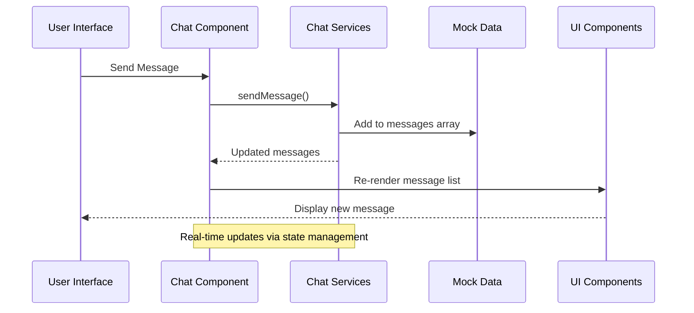

**Diagram sources**
- [chat component](file://src/modules/chat/components/chat.tsx)
- [chat services](file://src/modules/chat/services/chat-services.ts)
- [mock data](file://src/modules/chat/services/chat-mock-data.ts)

## Detailed Component Analysis

### Chat Component Architecture

The main chat component orchestrates the entire chat experience:

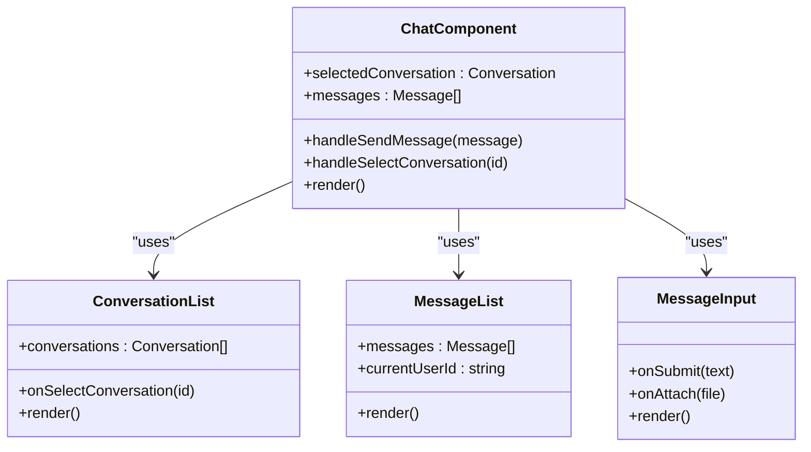

**Diagram sources**
- [chat component](file://src/modules/chat/components/chat.tsx)
- [conversation list](file://src/modules/chat/components/conversation-list.tsx)
- [message list](file://src/modules/chat/components/message-list.tsx)
- [message input](file://src/modules/chat/components/message-input.tsx)

### Service Layer Architecture

The service layer handles data operations and business logic:

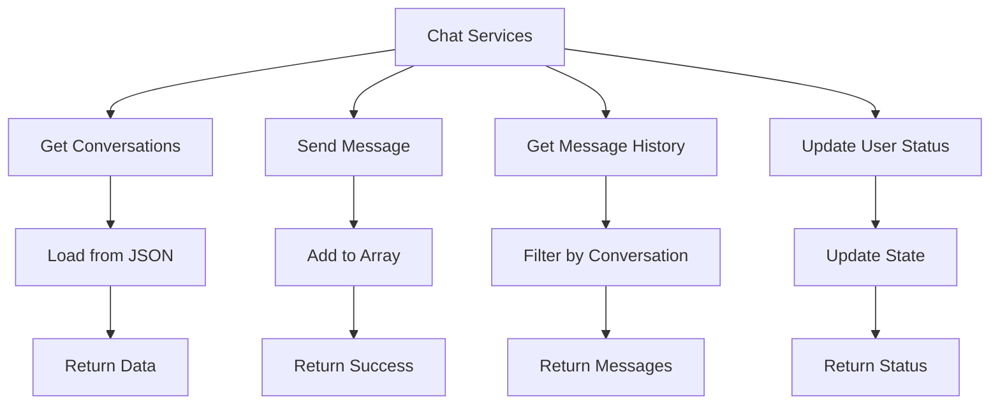

**Diagram sources**
- [chat services](file://src/modules/chat/services/chat-services.ts)
- [mock data](file://src/modules/chat/services/chat-mock-data.ts)

**Section sources**
- [chat component](file://src/modules/chat/components/chat.tsx)
- [chat services](file://src/modules/chat/services/chat-services.ts)

## WebSocket Implementation

While the current implementation uses mock data, the architecture supports WebSocket integration for real-time communication. Here's how WebSocket functionality would be integrated:

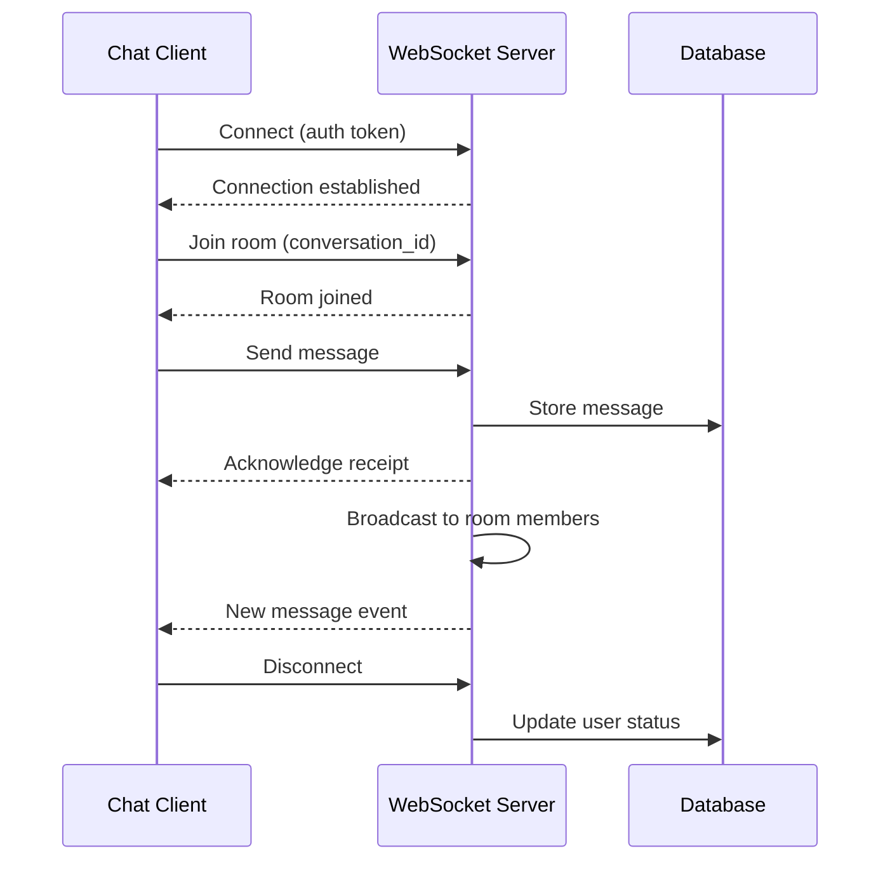

**Diagram sources**
- [chat services](file://src/modules/chat/services/chat-services.ts)

To implement WebSocket functionality:

1. **Connection Management**: Establish WebSocket connections during component initialization
2. **Event Handling**: Listen for incoming messages and connection events
3. **Reconnection Logic**: Handle network interruptions and automatic reconnection
4. **Message Queue**: Queue messages when offline and send when reconnected

## Message Delivery Mechanisms

The chat system implements efficient message delivery through several mechanisms:

### Message States
- **Sent**: Message has been sent to server
- **Delivered**: Message has been delivered to recipients
- **Read**: Message has been read by recipients
- **Failed**: Message delivery failed

### Delivery Flow
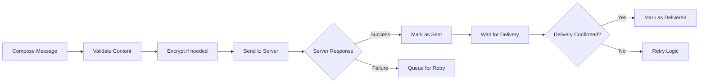

**Diagram sources**
- [message input](file://src/modules/chat/components/message-input.tsx)
- [chat services](file://src/modules/chat/services/chat-services.ts)

## User Presence Indicators

User presence tracking shows online/offline status and typing indicators:

### Presence Features
- **Online Status**: Real-time user availability
- **Typing Indicators**: Show when users are composing messages
- **Last Seen**: Timestamp of last activity
- **Read Receipts**: Message read confirmation

### Implementation Pattern
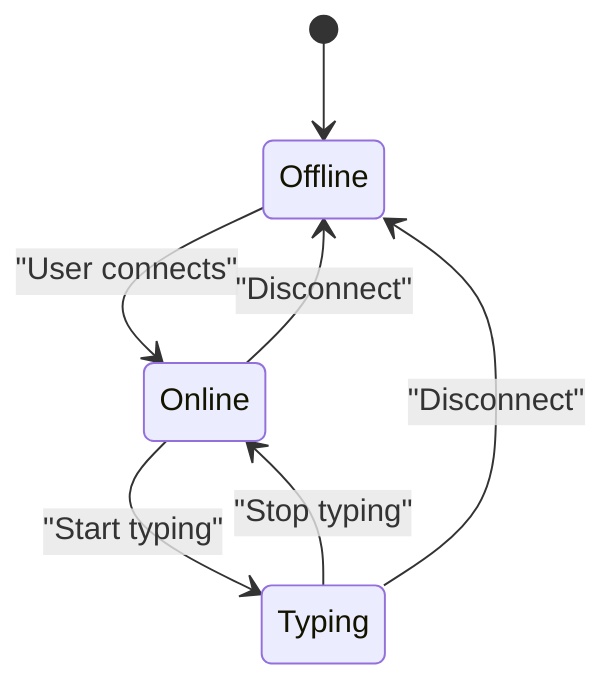

**Diagram sources**
- [chat services](file://src/modules/chat/services/chat-services.ts)

## Chat Rooms Implementation

The chat system supports multiple conversation rooms with different access levels:

### Room Types
- **Direct Messages**: One-on-one private conversations
- **Group Chats**: Multi-user conversations
- **Public Channels**: Open access discussion areas
- **Private Groups**: Invitation-only conversations

### Room Management
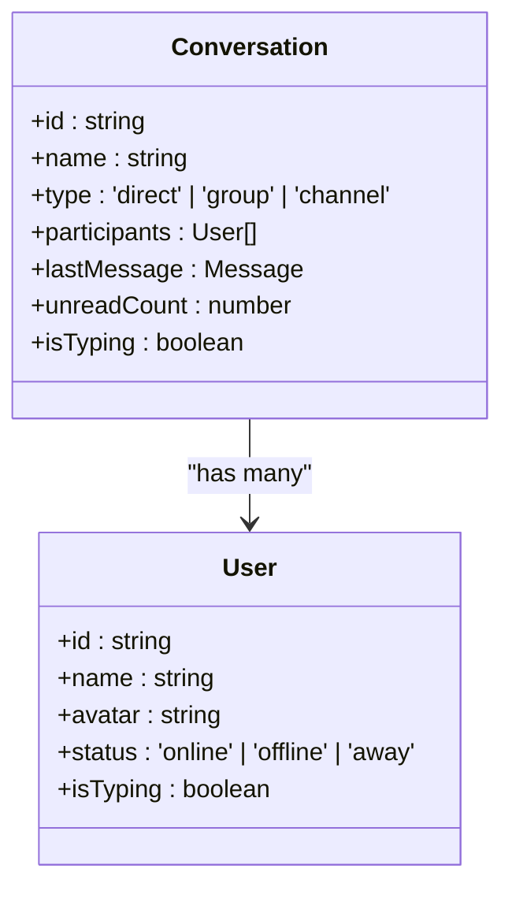

**Diagram sources**
- [chat types](file://src/modules/chat/services/types/chat-types.ts)
- [conversation list](file://src/modules/chat/components/conversation-list.tsx)

## File Sharing in Messages

The chat system supports file attachments with various formats:

### Supported File Types
- **Images**: JPG, PNG, GIF, WebP
- **Documents**: PDF, DOC, DOCX, TXT
- **Videos**: MP4, MOV, AVI
- **Audio**: MP3, WAV, AAC
- **Archives**: ZIP, RAR

### File Upload Process
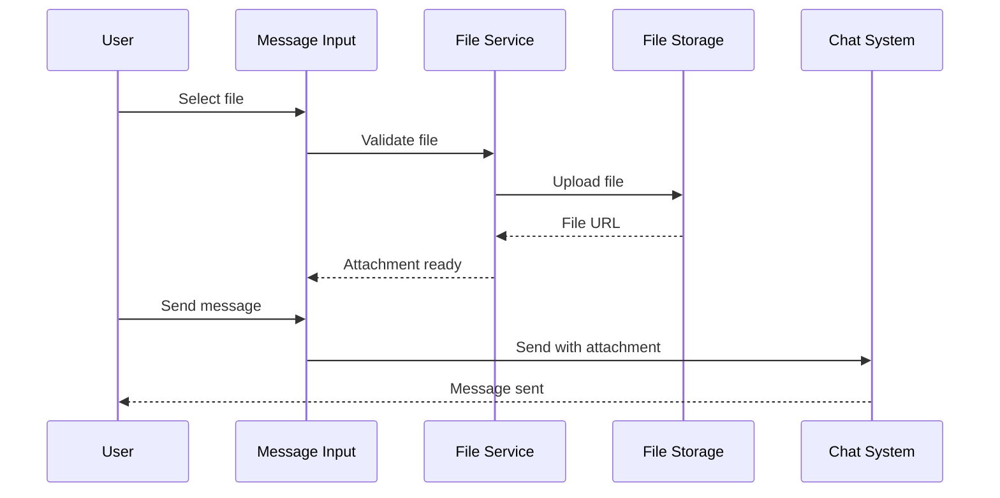

**Diagram sources**
- [message input](file://src/modules/chat/components/message-input.tsx)

## Message Search Functionality

Advanced search capabilities allow users to find specific messages:

### Search Features
- **Full-text Search**: Search across message content
- **Date Filtering**: Filter messages by date range
- **User Filtering**: Search messages from specific users
- **File Search**: Find messages with attachments
- **Conversation Scope**: Search within specific conversations

### Search Algorithm
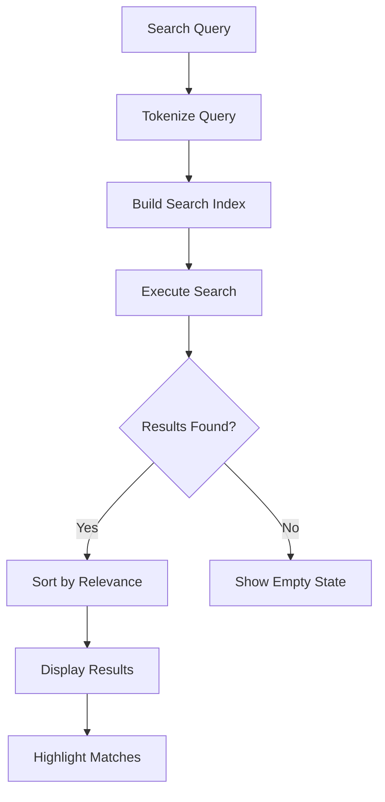

**Diagram sources**
- [chat services](file://src/modules/chat/services/chat-services.ts)

## Real-time Synchronization

The chat system ensures consistent state across all connected clients:

### Synchronization Strategy
- **Optimistic Updates**: Immediate UI updates before server confirmation
- **Conflict Resolution**: Handle concurrent message edits
- **State Persistence**: Maintain local cache for offline access
- **Delta Updates**: Only sync changed data

### Sync Flow
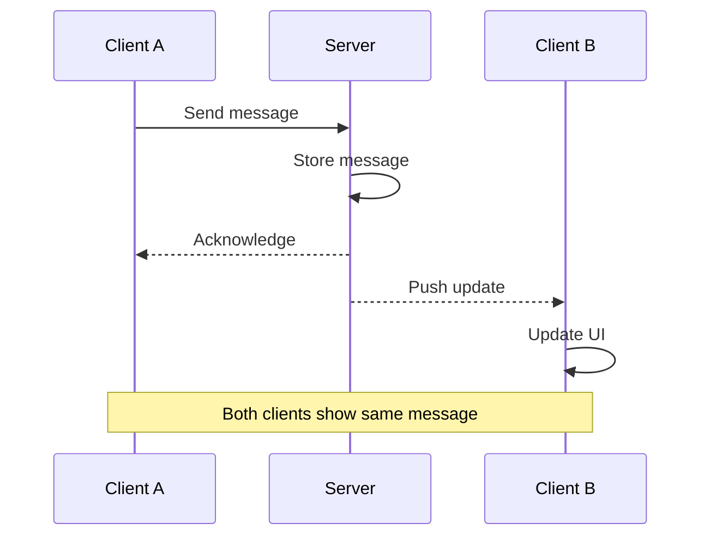

**Diagram sources**
- [chat services](file://src/modules/chat/services/chat-services.ts)

## Offline Support

The chat system maintains functionality even without internet connectivity:

### Offline Features
- **Local Message Queue**: Store messages until connection restored
- **Cached Conversations**: Load recent conversations locally
- **Draft Preservation**: Save unsent messages automatically
- **Sync on Reconnect**: Automatically sync offline changes

### Offline Architecture
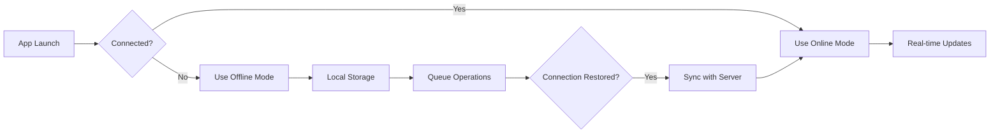

**Diagram sources**
- [chat services](file://src/modules/chat/services/chat-services.ts)

## Message Encryption Considerations

Security is paramount in chat systems. Consider implementing:

### Encryption Levels
- **Transport Encryption**: HTTPS/WSS for data in transit
- **End-to-End Encryption**: Messages encrypted client-side
- **Database Encryption**: Encrypted message storage
- **Key Management**: Secure key storage and rotation

### Security Architecture
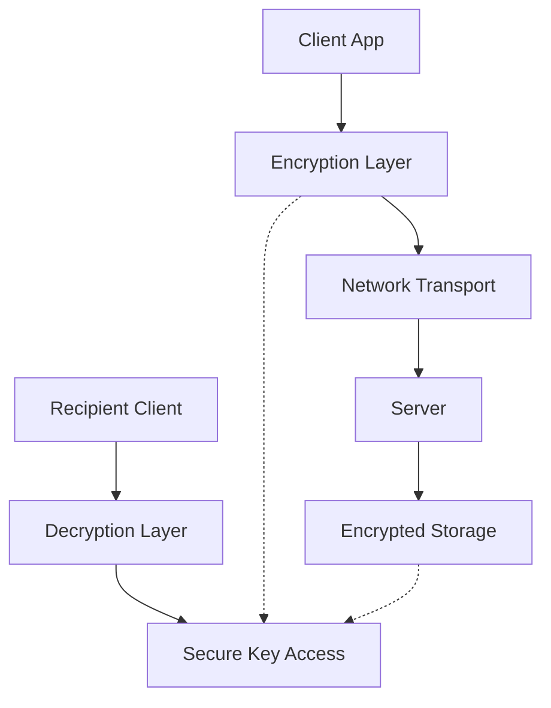

**Diagram sources**
- [chat services](file://src/modules/chat/services/chat-services.ts)

## Performance Considerations

Optimize chat system performance through various strategies:

### Optimization Techniques
- **Virtual Scrolling**: Render only visible messages
- **Lazy Loading**: Load message history on demand
- **Image Optimization**: Compress and cache media files
- **Debounced Search**: Reduce search query frequency
- **Connection Pooling**: Manage WebSocket connections efficiently

### Performance Metrics
- **Message Latency**: Time from send to receive
- **Memory Usage**: Monitor component memory consumption
- **Bundle Size**: Optimize JavaScript bundle size
- **Network Requests**: Minimize API calls through caching

## Troubleshooting Guide

Common issues and their solutions:

### Connection Issues
- **WebSocket Disconnections**: Implement reconnection logic
- **Authentication Failures**: Verify token validity and refresh
- **Network Timeouts**: Configure appropriate timeout values

### Message Delivery Problems
- **Duplicate Messages**: Implement idempotent message processing
- **Missing Messages**: Check message queue and retry logic
- **Ordering Issues**: Use sequence numbers for message ordering

### Performance Issues
- **Slow Rendering**: Implement virtual scrolling for large message lists
- **Memory Leaks**: Clean up event listeners and subscriptions
- **High CPU Usage**: Optimize search algorithms and image processing

**Section sources**
- [chat services](file://src/modules/chat/services/chat-services.ts)
- [chat component](file://src/modules/chat/components/chat.tsx)

## Conclusion

The chat system provides a comprehensive foundation for real-time messaging with extensible architecture supporting advanced features like file sharing, search, and encryption. The modular design allows for easy customization and scaling while maintaining clean separation of concerns between UI components, business logic, and data management.

Future enhancements could include:
- Advanced WebSocket implementation for true real-time communication
- Enhanced security with end-to-end encryption
- Rich media support with preview capabilities
- Advanced search with natural language processing
- Integration with external messaging platforms
- Mobile-responsive design improvements

The system demonstrates modern React patterns, TypeScript best practices, and scalable architecture suitable for production deployment.