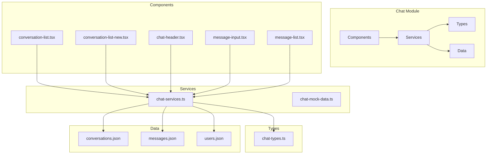
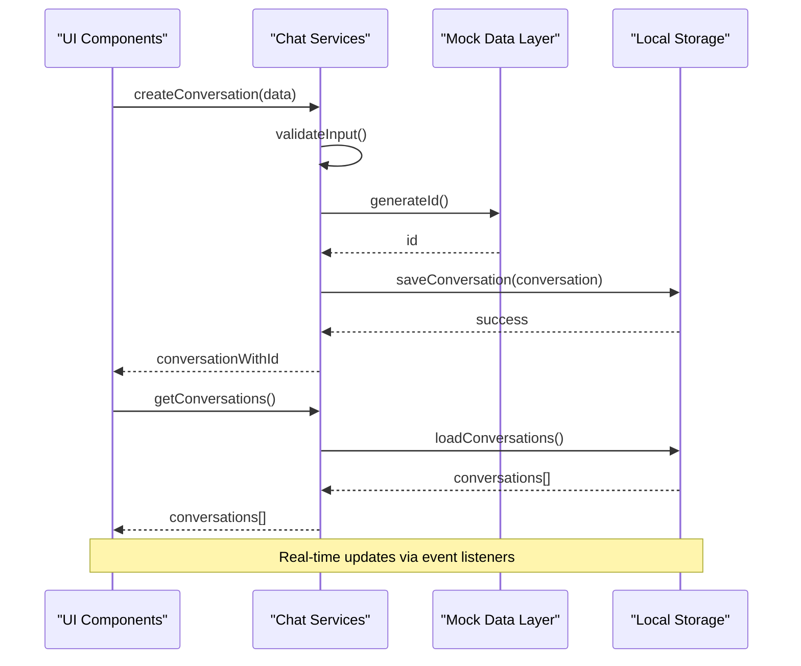
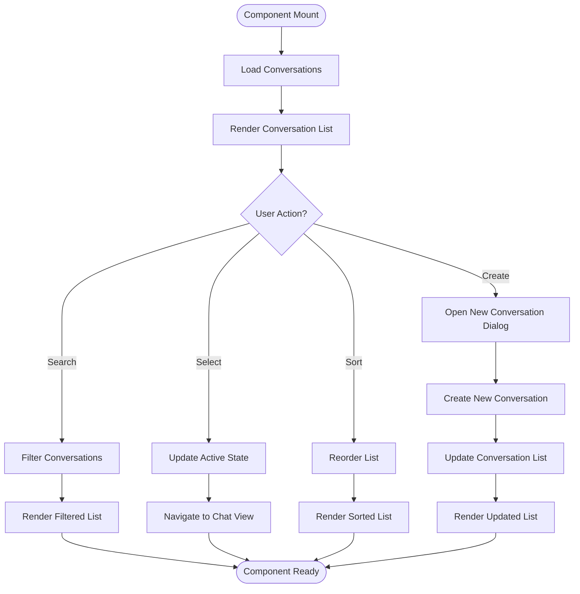
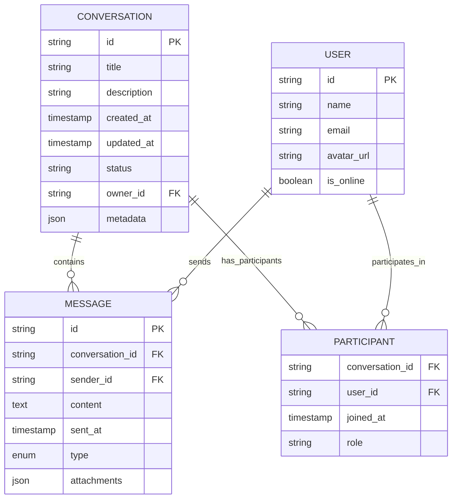
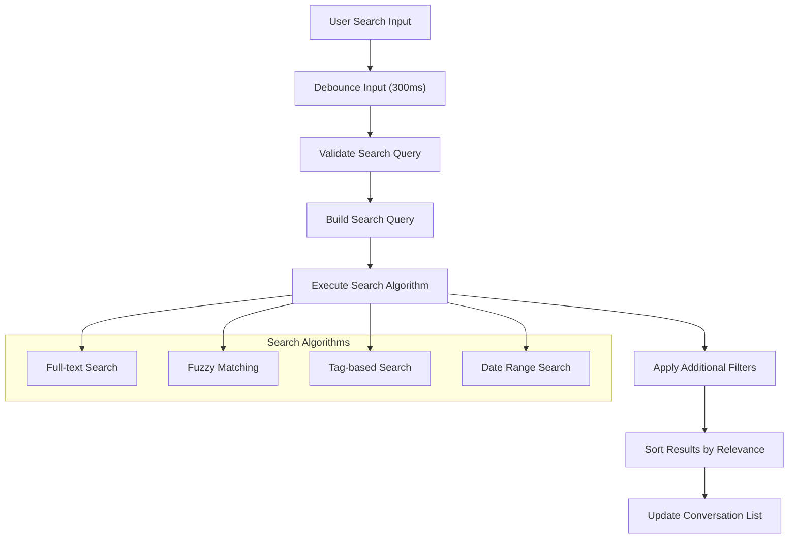
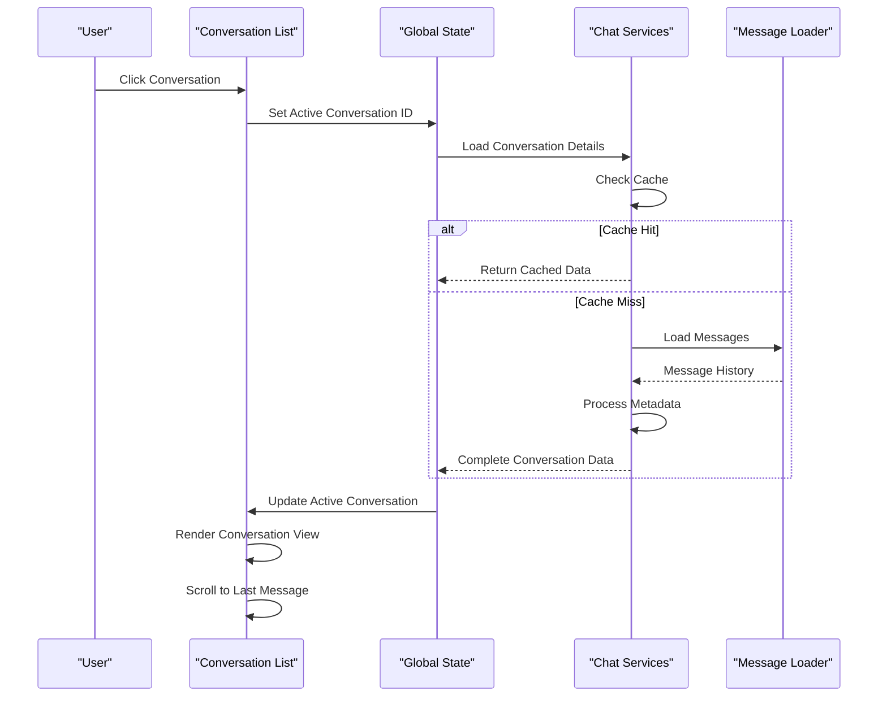
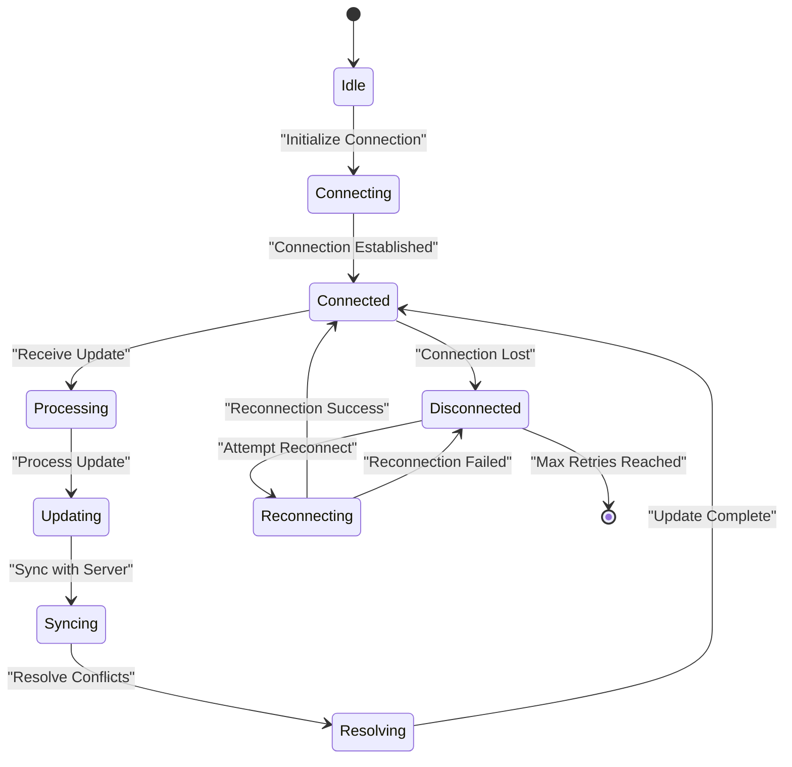
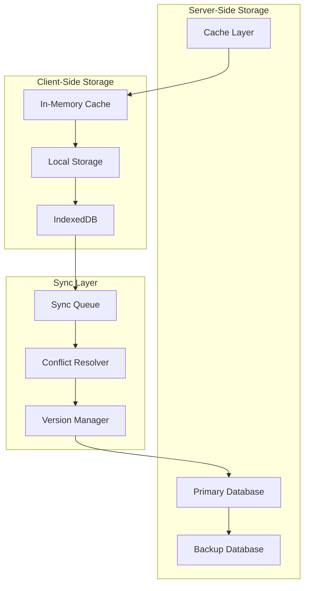

# Conversation Management

<cite>
**Referenced Files in This Document**
- [chat page](file://src/app/(private)/chat/page.tsx)
- [conversation list component](file://src/modules/chat/components/conversation-list.tsx)
- [new conversation component](file://src/modules/chat/components/conversation-list-new.tsx)
- [chat services](file://src/modules/chat/services/chat-services.ts)
- [chat types](file://src/modules/chat/services/types/chat-types.ts)
- [conversations data](file://src/modules/chat/services/data/conversations.json)
- [messages data](file://src/modules/chat/services/data/messages.json)
- [users data](file://src/modules/chat/services/data/users.json)
- [chat mock data](file://src/modules/chat/services/chat-mock-data.ts)
- [chat header](file://src/modules/chat/components/chat-header.tsx)
- [message input](file://src/modules/chat/components/message-input.tsx)
- [message list](file://src/modules/chat/components/message-list.tsx)
</cite>

## Table of Contents
1. [Introduction](#introduction)
2. [Project Structure](#project-structure)
3. [Core Components](#core-components)
4. [Architecture Overview](#architecture-overview)
5. [Detailed Component Analysis](#detailed-component-analysis)
6. [Data Model](#data-model)
7. [Search and Filtering](#search-and-filtering)
8. [Conversation Switching](#conversation-switching)
9. [Real-time Updates](#real-time-updates)
10. [Persistence Strategy](#persistence-strategy)
11. [Performance Considerations](#performance-considerations)
12. [Troubleshooting Guide](#troubleshooting-guide)
13. [Conclusion](#conclusion)

## Introduction

This document provides comprehensive documentation for the conversation management functionality within the chat module. The system implements a complete conversation lifecycle including creation, organization, display, searching, filtering, switching, and real-time synchronization. The architecture follows modern React patterns with TypeScript support and integrates with mock data services for development and testing.

## Project Structure

The conversation management system is organized within the `src/modules/chat` directory, following a modular architecture pattern:

**Diagram sources**
- [chat page](file://src/app/(private)/chat/page.tsx)
- [conversation list component](file://src/modules/chat/components/conversation-list.tsx)
- [chat services](file://src/modules/chat/services/chat-services.ts)

**Section sources**
- [chat page](file://src/app/(private)/chat/page.tsx)

## Core Components

The conversation management system consists of several key components that work together to provide a seamless user experience:

### Conversation List Component
The primary interface for displaying and managing conversations. Handles conversation selection, search functionality, and real-time updates.

### New Conversation Component
Manages the creation of new conversations with validation and metadata handling.

### Chat Services
Centralized service layer providing CRUD operations, search capabilities, and data synchronization.

### Data Types
TypeScript interfaces defining the structure of conversations, messages, and related entities.

**Section sources**
- [conversation list component](file://src/modules/chat/components/conversation-list.tsx)
- [new conversation component](file://src/modules/chat/components/conversation-list-new.tsx)
- [chat services](file://src/modules/chat/services/chat-services.ts)
- [chat types](file://src/modules/chat/services/types/chat-types.ts)

## Architecture Overview

The conversation management system follows a layered architecture pattern with clear separation of concerns:

**Diagram sources**
- [chat services](file://src/modules/chat/services/chat-services.ts)
- [chat mock data](file://src/modules/chat/services/chat-mock-data.ts)

## Detailed Component Analysis

### Conversation List Component

The conversation list component serves as the main entry point for conversation management. It handles:

- **Display**: Renders a scrollable list of conversations with metadata
- **Selection**: Manages active conversation state and visual feedback
- **Search**: Provides real-time filtering capabilities
- **Sorting**: Supports sorting by date, name, or last message
- **Pagination**: Implements virtual scrolling for large conversation lists

#### Key Features

**Diagram sources**
- [conversation list component](file://src/modules/chat/components/conversation-list.tsx)

### New Conversation Component

Handles the creation workflow for new conversations:

- **Form Validation**: Ensures required fields are present
- **Metadata Management**: Handles titles, participants, and tags
- **Auto-completion**: Suggests existing conversations based on input
- **Duplicate Detection**: Prevents creation of duplicate conversations

### Chat Services

The centralized service layer provides:

- **CRUD Operations**: Create, read, update, delete conversations
- **Search Engine**: Full-text search across conversation content
- **Filtering**: Advanced filtering by date, participants, tags
- **Synchronization**: Real-time updates and conflict resolution
- **Persistence**: Local storage integration with backup strategies

**Section sources**
- [conversation list component](file://src/modules/chat/components/conversation-list.tsx)
- [new conversation component](file://src/modules/chat/components/conversation-list-new.tsx)
- [chat services](file://src/modules/chat/services/chat-services.ts)

## Data Model

The conversation data model is defined using TypeScript interfaces to ensure type safety throughout the application:

### Core Entities

**Diagram sources**
- [chat types](file://src/modules/chat/services/types/chat-types.ts)

### Data Relationships

- **One-to-Many**: One conversation contains multiple messages
- **Many-to-Many**: Users participate in multiple conversations
- **Hierarchical**: Conversations have metadata and status hierarchies
- **Temporal**: All entities maintain timestamps for ordering and filtering

**Section sources**
- [chat types](file://src/modules/chat/services/types/chat-types.ts)
- [conversations data](file://src/modules/chat/services/data/conversations.json)
- [messages data](file://src/modules/chat/services/data/messages.json)
- [users data](file://src/modules/chat/services/data/users.json)

## Search and Filtering

The search and filtering system provides powerful capabilities for finding specific conversations:

### Search Implementation

**Diagram sources**
- [chat services](file://src/modules/chat/services/chat-services.ts)

### Filtering Capabilities

- **Text Search**: Full-text search across titles, descriptions, and message content
- **Date Filtering**: Filter by creation date, last activity, or custom date ranges
- **Participant Filtering**: Find conversations with specific users
- **Status Filtering**: Filter by conversation status (active, archived, etc.)
- **Tag-based Filtering**: Search by conversation tags and categories
- **Advanced Queries**: Combine multiple filter criteria with logical operators

### Performance Optimizations

- **Debounced Input**: Prevents excessive search operations during typing
- **Indexed Search**: Maintains search indexes for faster queries
- **Lazy Loading**: Loads search results incrementally
- **Caching**: Caches frequent search queries and results

**Section sources**
- [chat services](file://src/modules/chat/services/chat-services.ts)

## Conversation Switching

The conversation switching mechanism ensures smooth transitions between different conversations:

### Switching Flow

**Diagram sources**
- [conversation list component](file://src/modules/chat/components/conversation-list.tsx)
- [chat services](file://src/modules/chat/services/chat-services.ts)

### State Management

- **Active Conversation Tracking**: Maintains current conversation context
- **History Navigation**: Supports back/forward navigation between conversations
- **Loading States**: Shows appropriate loading indicators during transitions
- **Error Handling**: Graceful error recovery during conversation switching

### Performance Considerations

- **Virtual Scrolling**: Efficiently handles large message histories
- **Lazy Loading**: Loads messages on demand as user scrolls
- **Memory Management**: Cleans up unused conversation data
- **Optimistic Updates**: Provides immediate UI feedback before server confirmation

**Section sources**
- [conversation list component](file://src/modules/chat/components/conversation-list.tsx)
- [message list](file://src/modules/chat/components/message-list.tsx)

## Real-time Updates

The system implements real-time synchronization to keep conversation data consistent across clients:

### Update Mechanisms

**Diagram sources**
- [chat services](file://src/modules/chat/services/chat-services.ts)

### Event Types

- **Message Events**: New messages, edits, deletions
- **Conversation Events**: Title changes, participant additions/removals
- **Status Events**: Online/offline status changes
- **Presence Events**: User typing indicators, read receipts

### Conflict Resolution

- **Last-write-wins**: Simple conflict resolution strategy
- **Merge Strategies**: Intelligent merging for complex updates
- **Version Control**: Tracks update versions for consistency
- **Undo Support**: Allows reverting unwanted changes

**Section sources**
- [chat services](file://src/modules/chat/services/chat-services.ts)

## Persistence Strategy

The persistence layer ensures conversation data survives browser refreshes and device changes:

### Storage Architecture

**Diagram sources**
- [chat services](file://src/modules/chat/services/chat-services.ts)

### Data Migration

- **Schema Versioning**: Tracks data schema versions for migrations
- **Backward Compatibility**: Supports reading older data formats
- **Migration Scripts**: Automated data transformation processes
- **Rollback Support**: Ability to revert failed migrations

### Backup and Recovery

- **Automatic Backups**: Regular automatic backups of conversation data
- **Manual Export**: User-initiated data export functionality
- **Import Support**: Import conversations from external sources
- **Recovery Points**: Point-in-time recovery capabilities

**Section sources**
- [chat services](file://src/modules/chat/services/chat-services.ts)

## Performance Considerations

### Optimization Strategies

- **Virtualization**: Efficient rendering of large conversation lists
- **Memoization**: Caching expensive computations and API calls
- **Code Splitting**: Lazy loading of heavy components
- **Image Optimization**: Compressed and cached media assets

### Memory Management

- **Garbage Collection**: Proper cleanup of unused objects
- **Event Listener Cleanup**: Removing listeners when components unmount
- **Large Object Handling**: Streaming processing for large datasets
- **Memory Leak Prevention**: Regular memory usage monitoring

### Network Optimization

- **Request Deduplication**: Preventing duplicate network requests
- **Batch Operations**: Grouping multiple operations into single requests
- **Compression**: Enabling response compression where supported
- **Offline Support**: Graceful degradation when offline

## Troubleshooting Guide

### Common Issues and Solutions

#### Conversation Not Loading
- **Check Network Connectivity**: Verify internet connection and API availability
- **Clear Browser Cache**: Remove corrupted cached data
- **Check Console Errors**: Review browser developer console for JavaScript errors
- **Verify Authentication**: Ensure user session is valid and not expired

#### Real-time Updates Not Working
- **Check WebSocket Connection**: Verify connection status and reconnection logic
- **Review Error Boundaries**: Check for unhandled exceptions in update handlers
- **Monitor Network Traffic**: Use browser dev tools to inspect WebSocket frames
- **Validate Data Formats**: Ensure incoming data matches expected schemas

#### Search Performance Issues
- **Check Index Size**: Monitor search index growth and performance
- **Optimize Query Patterns**: Review and optimize frequently used search queries
- **Implement Pagination**: Add pagination for large result sets
- **Use Debouncing**: Ensure search inputs are properly debounced

#### Memory Leaks
- **Audit Event Listeners**: Check for proper cleanup of event listeners
- **Review Component Lifecycle**: Ensure components properly clean up resources
- **Monitor Heap Usage**: Use browser profiling tools to identify leaks
- **Check Circular References**: Look for circular object references preventing garbage collection

### Debugging Tools

- **React DevTools**: Inspect component state and props
- **Network Tab**: Monitor API calls and WebSocket connections
- **Console Logging**: Strategic logging for troubleshooting
- **Performance Profiler**: Identify performance bottlenecks

**Section sources**
- [chat services](file://src/modules/chat/services/chat-services.ts)
- [conversation list component](file://src/modules/chat/components/conversation-list.tsx)

## Conclusion

The conversation management system provides a robust, scalable foundation for chat functionality with comprehensive features including real-time updates, advanced search capabilities, and efficient data persistence. The modular architecture ensures maintainability and extensibility while the performance optimizations guarantee smooth user experiences even with large datasets.

Key strengths include:
- **Type Safety**: Comprehensive TypeScript interfaces throughout
- **Real-time Sync**: WebSocket-based live updates with conflict resolution
- **Search & Filter**: Powerful full-text search with advanced filtering options
- **Performance**: Virtualization, caching, and lazy loading for optimal performance
- **Extensibility**: Modular design supporting easy feature additions

Future enhancements could include:
- **AI-powered Search**: Natural language search capabilities
- **Advanced Analytics**: Conversation analytics and insights
- **Mobile Optimization**: Enhanced mobile-specific features
- **Collaborative Editing**: Real-time collaborative conversation editing