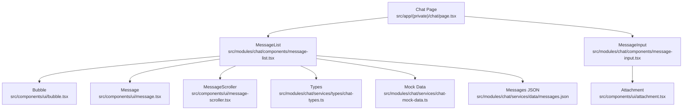
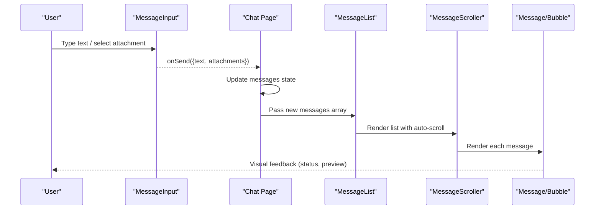
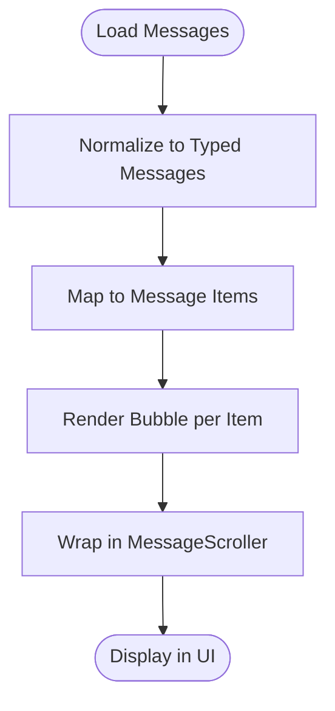
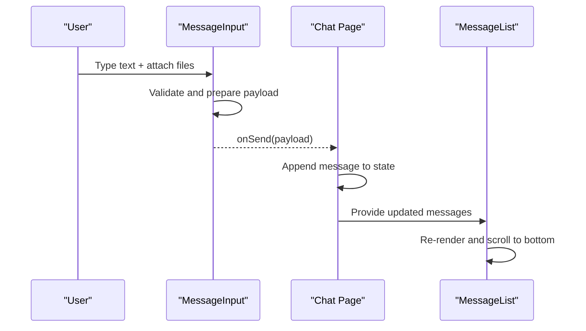
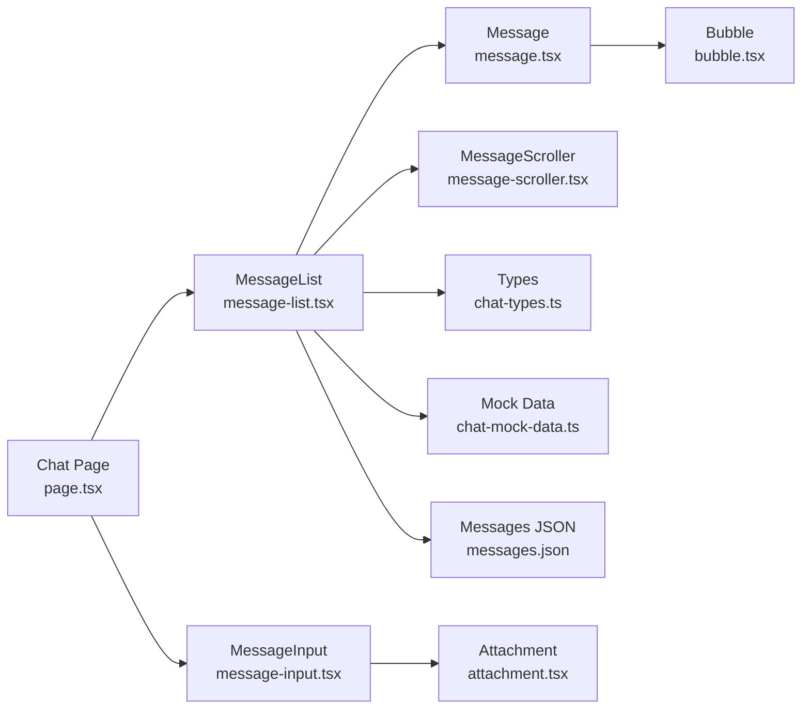

# Message Handling & Display

<cite>
**Referenced Files in This Document**
- [chat.tsx](file://src/app/(private)/chat/page.tsx)
- [message-list.tsx](file://src/modules/chat/components/message-list.tsx)
- [message-input.tsx](file://src/modules/chat/components/message-input.tsx)
- [bubble.tsx](file://src/components/ui/bubble.tsx)
- [message.tsx](file://src/components/ui/message.tsx)
- [attachment.tsx](file://src/components/ui/attachment.tsx)
- [message-scroller.tsx](file://src/components/ui/message-scroller.tsx)
- [chat-types.ts](file://src/modules/chat/services/types/chat-types.ts)
- [chat-mock-data.ts](file://src/modules/chat/services/chat-mock-data.ts)
- [messages.json](file://src/modules/chat/services/data/messages.json)
</cite>

## Table of Contents
1. [Introduction](#introduction)
2. [Project Structure](#project-structure)
3. [Core Components](#core-components)
4. [Architecture Overview](#architecture-overview)
5. [Detailed Component Analysis](#detailed-component-analysis)
6. [Dependency Analysis](#dependency-analysis)
7. [Performance Considerations](#performance-considerations)
8. [Troubleshooting Guide](#troubleshooting-guide)
9. [Conclusion](#conclusion)
10. [Appendices](#appendices)

## Introduction
This document explains the message handling and display system used by the chat feature. It covers:
- The message data structure and how it is consumed across components
- The rendering pipeline from raw messages to UI bubbles
- Input handling for composing and sending messages
- Customization points for custom message types, formatting, and attachments
- Status indicators, typing indicators, and delivery confirmation patterns

The goal is to help you implement, extend, and troubleshoot messaging features with clarity and confidence.

## Project Structure
The chat feature is implemented as a Next.js page that composes reusable UI components under src/components/ui and module-specific logic under src/modules/chat.

**Diagram sources**
- [chat.tsx](file://src/app/(private)/chat/page.tsx)
- [message-list.tsx](file://src/modules/chat/components/message-list.tsx)
- [message-input.tsx](file://src/modules/chat/components/message-input.tsx)
- [bubble.tsx](file://src/components/ui/bubble.tsx)
- [message.tsx](file://src/components/ui/message.tsx)
- [attachment.tsx](file://src/components/ui/attachment.tsx)
- [message-scroller.tsx](file://src/components/ui/message-scroller.tsx)
- [chat-types.ts](file://src/modules/chat/services/types/chat-types.ts)
- [chat-mock-data.ts](file://src/modules/chat/services/chat-mock-data.ts)
- [messages.json](file://src/modules/chat/services/data/messages.json)

**Section sources**
- [chat.tsx](file://src/app/(private)/chat/page.tsx)
- [message-list.tsx](file://src/modules/chat/components/message-list.tsx)
- [message-input.tsx](file://src/modules/chat/components/message-input.tsx)
- [bubble.tsx](file://src/components/ui/bubble.tsx)
- [message.tsx](file://src/components/ui/message.tsx)
- [attachment.tsx](file://src/components/ui/attachment.tsx)
- [message-scroller.tsx](file://src/components/ui/message-scroller.tsx)
- [chat-types.ts](file://src/modules/chat/services/types/chat-types.ts)
- [chat-mock-data.ts](file://src/modules/chat/services/chat-mock-data.ts)
- [messages.json](file://src/modules/chat/services/data/messages.json)

## Core Components
- Bubble: Renders an individual message bubble with content, avatar, timestamp, and status. It supports different alignments (sent/received), optional attachments, and status icons.
- Message: A higher-level wrapper around Bubble that normalizes props and provides consistent spacing and layout.
- MessageList: Manages the list of messages, scroll behavior, and renders each item using Message/Bubble. It integrates with MessageScroller for smooth scrolling and performance.
- MessageInput: Handles user input composition, attachment selection, and submission events. It emits composed messages up to the parent for persistence and sending.
- Attachment: Displays file/image previews and metadata; supports common actions like open or remove.
- MessageScroller: Provides a scrollable container optimized for long lists, including auto-scrolling to latest messages.

Key responsibilities:
- Data flow: Messages JSON -> Mock Data -> Types -> MessageList -> Message -> Bubble
- Input flow: MessageInput -> Parent State -> New Message -> MessageList update -> Scroll to bottom
- Rendering: Virtualized or efficient list rendering via MessageScroller

**Section sources**
- [bubble.tsx](file://src/components/ui/bubble.tsx)
- [message.tsx](file://src/components/ui/message.tsx)
- [message-list.tsx](file://src/modules/chat/components/message-list.tsx)
- [message-input.tsx](file://src/modules/chat/components/message-input.tsx)
- [attachment.tsx](file://src/components/ui/attachment.tsx)
- [message-scroller.tsx](file://src/components/ui/message-scroller.tsx)

## Architecture Overview
The chat architecture separates concerns between presentation (UI components) and data (types and mock data). The page orchestrates state and wiring.

**Diagram sources**
- [chat.tsx](file://src/app/(private)/chat/page.tsx)
- [message-input.tsx](file://src/modules/chat/components/message-input.tsx)
- [message-list.tsx](file://src/modules/chat/components/message-list.tsx)
- [message-scroller.tsx](file://src/components/ui/message-scroller.tsx)
- [message.tsx](file://src/components/ui/message.tsx)
- [bubble.tsx](file://src/components/ui/bubble.tsx)

## Detailed Component Analysis

### Message Data Model
The message model defines the shape of a single message and related entities such as sender and attachments. It also includes fields for status and timestamps to support delivery confirmation and typing indicators.

- Typical fields include:
  - Unique identifier
  - Sender reference
  - Content (text or structured payload)
  - Attachments array
  - Timestamps (created, updated)
  - Status (e.g., sent, delivered, read)
  - Optional flags (e.g., isTyping)

Use these fields consistently across components to render status indicators and handle interactions.

**Section sources**
- [chat-types.ts](file://src/modules/chat/services/types/chat-types.ts)
- [messages.json](file://src/modules/chat/services/data/messages.json)

### Message Rendering Pipeline
The rendering pipeline transforms raw messages into interactive UI elements:

1. Load messages from data source (mock or API)
2. Normalize into typed messages
3. Map to Message items
4. Render Bubble with content, avatar, and status
5. Wrap in MessageScroller for efficient scrolling

**Diagram sources**
- [message-list.tsx](file://src/modules/chat/components/message-list.tsx)
- [message.tsx](file://src/components/ui/message.tsx)
- [bubble.tsx](file://src/components/ui/bubble.tsx)
- [message-scroller.tsx](file://src/components/ui/message-scroller.tsx)

**Section sources**
- [message-list.tsx](file://src/modules/chat/components/message-list.tsx)
- [message.tsx](file://src/components/ui/message.tsx)
- [bubble.tsx](file://src/components/ui/bubble.tsx)
- [message-scroller.tsx](file://src/components/ui/message-scroller.tsx)

### Input Handling Mechanisms
MessageInput manages:
- Text composition and validation
- Attachment selection and preview
- Submission event emission to parent
- Keyboard shortcuts (e.g., Enter to send)

Parent component (Chat Page) receives the composed message, updates state, and triggers re-render.

**Diagram sources**
- [message-input.tsx](file://src/modules/chat/components/message-input.tsx)
- [chat.tsx](file://src/app/(private)/chat/page.tsx)
- [message-list.tsx](file://src/modules/chat/components/message-list.tsx)

**Section sources**
- [message-input.tsx](file://src/modules/chat/components/message-input.tsx)
- [chat.tsx](file://src/app/(private)/chat/page.tsx)
- [message-list.tsx](file://src/modules/chat/components/message-list.tsx)

### Bubble Component
Bubble focuses on visual presentation:
- Alignment based on sender role
- Avatar and name display
- Timestamp and status icon overlay
- Inline attachment preview when present
- Accessibility attributes (role, aria-label)

Customization points:
- Override alignment logic for custom roles
- Extend status icons for additional states
- Inject custom content slots for rich media

**Section sources**
- [bubble.tsx](file://src/components/ui/bubble.tsx)

### MessageList Component
MessageList coordinates:
- Rendering a list of messages
- Integrating with MessageScroller for performance
- Handling scroll-to-bottom on new messages
- Providing stable keys and memoization

Integration with data:
- Consumes typed messages
- Maps to Message components
- Delegates rendering to Bubble via Message

**Section sources**
- [message-list.tsx](file://src/modules/chat/components/message-list.tsx)
- [message-scroller.tsx](file://src/components/ui/message-scroller.tsx)
- [message.tsx](file://src/components/ui/message.tsx)

### MessageInput Component
MessageInput provides:
- Controlled input state
- File attachment handling
- Submit callback with payload
- Error and loading states

Best practices:
- Debounce large inputs if needed
- Validate attachments before submission
- Emit normalized payloads to parent

**Section sources**
- [message-input.tsx](file://src/modules/chat/components/message-input.tsx)

### Attachment Handling
Attachment displays:
- File type detection and icons
- Image thumbnails and previews
- Metadata (size, name)
- Actions (open, remove)

Integration:
- Accepts attachment objects from input
- Renders inline within Bubble when applicable
- Supports multiple attachments per message

**Section sources**
- [attachment.tsx](file://src/components/ui/attachment.tsx)
- [bubble.tsx](file://src/components/ui/bubble.tsx)

### Typing Indicators
Typing indicators can be implemented by:
- Maintaining a separate typing state keyed by sender
- Rendering a lightweight indicator row above the input or within the list
- Clearing the indicator after a timeout or on message receipt

Patterns:
- Use a dedicated component for the indicator
- Animate opacity or dots for visual feedback
- Sync with presence service if available

[No sources needed since this section provides general guidance]

### Message Status Indicators and Delivery Confirmation
Status lifecycle:
- Draft -> Sent -> Delivered -> Read

Implementation tips:
- Add status field to message model
- Render small icons next to timestamp
- Update status via backend events or optimistic UI
- Provide tooltips for accessibility

**Section sources**
- [chat-types.ts](file://src/modules/chat/services/types/chat-types.ts)
- [bubble.tsx](file://src/components/ui/bubble.tsx)

### Implementing Custom Message Types
To add a new message type:
- Extend the message union/type with a new variant
- Add a renderer branch in Message/Bubble
- Provide specific props for rich content
- Ensure attachments are handled appropriately

Example approach:
- Define a new type discriminator
- Create a specialized subcomponent for rich content
- Compose it inside Bubble with conditional rendering

**Section sources**
- [chat-types.ts](file://src/modules/chat/services/types/chat-types.ts)
- [bubble.tsx](file://src/components/ui/bubble.tsx)

### Formatting Messages
Formatting strategies:
- Plain text vs. markdown-like syntax
- Link detection and clickable links
- Code blocks and syntax highlighting
- Emoji rendering

Recommendations:
- Normalize content before rendering
- Sanitize HTML if allowing rich content
- Provide fallbacks for unsupported formats

[No sources needed since this section provides general guidance]

## Dependency Analysis
The following diagram shows key dependencies among chat-related components and data sources.

**Diagram sources**
- [chat.tsx](file://src/app/(private)/chat/page.tsx)
- [message-list.tsx](file://src/modules/chat/components/message-list.tsx)
- [message-input.tsx](file://src/modules/chat/components/message-input.tsx)
- [message.tsx](file://src/components/ui/message.tsx)
- [bubble.tsx](file://src/components/ui/bubble.tsx)
- [attachment.tsx](file://src/components/ui/attachment.tsx)
- [message-scroller.tsx](file://src/components/ui/message-scroller.tsx)
- [chat-types.ts](file://src/modules/chat/services/types/chat-types.ts)
- [chat-mock-data.ts](file://src/modules/chat/services/chat-mock-data.ts)
- [messages.json](file://src/modules/chat/services/data/messages.json)

**Section sources**
- [chat.tsx](file://src/app/(private)/chat/page.tsx)
- [message-list.tsx](file://src/modules/chat/components/message-list.tsx)
- [message-input.tsx](file://src/modules/chat/components/message-input.tsx)
- [message.tsx](file://src/components/ui/message.tsx)
- [bubble.tsx](file://src/components/ui/bubble.tsx)
- [attachment.tsx](file://src/components/ui/attachment.tsx)
- [message-scroller.tsx](file://src/components/ui/message-scroller.tsx)
- [chat-types.ts](file://src/modules/chat/services/types/chat-types.ts)
- [chat-mock-data.ts](file://src/modules/chat/services/chat-mock-data.ts)
- [messages.json](file://src/modules/chat/services/data/messages.json)

## Performance Considerations
- Use stable keys for list items to avoid unnecessary re-renders
- Leverage MessageScroller for virtualization or windowing when lists grow large
- Memoize expensive computations (e.g., formatted text)
- Avoid heavy operations during render; defer to effects or background tasks
- Optimize image attachments with lazy loading and appropriate sizing

[No sources needed since this section provides general guidance]

## Troubleshooting Guide
Common issues and resolutions:
- Messages not appearing:
  - Verify data normalization and type compliance
  - Check that MessageList receives updated arrays
- Scrolling not updating:
  - Ensure auto-scroll triggers on new messages
  - Confirm stable refs and scroll container dimensions
- Attachments failing to render:
  - Validate file types and sizes
  - Inspect URL generation and permissions
- Status indicators stuck:
  - Confirm backend event handlers update local state
  - Check optimistic UI rollback paths

[No sources needed since this section provides general guidance]

## Conclusion
The messaging system is built around clear separation of concerns: typed data models, focused UI components, and efficient scrolling. By extending the message type, customizing Bubble, and integrating robust input handling, you can deliver rich, responsive chat experiences. Status indicators, typing cues, and attachment previews enhance usability while maintaining performance.

[No sources needed since this section summarizes without analyzing specific files]

## Appendices

### Example: Adding a New Message Type
Steps:
- Extend the message type with a new variant
- Add a renderer branch in Message/Bubble
- Provide props for rich content and attachments
- Test rendering and interactions

[No sources needed since this section provides general guidance]

### Example: Enabling Markdown-like Formatting
Steps:
- Normalize incoming text
- Parse and sanitize content
- Render safe HTML or use a markdown renderer
- Provide fallbacks for unsupported features

[No sources needed since this section provides general guidance]