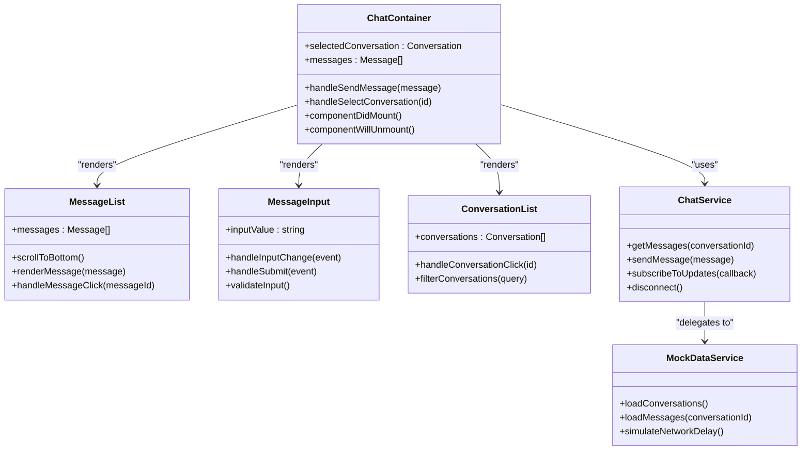
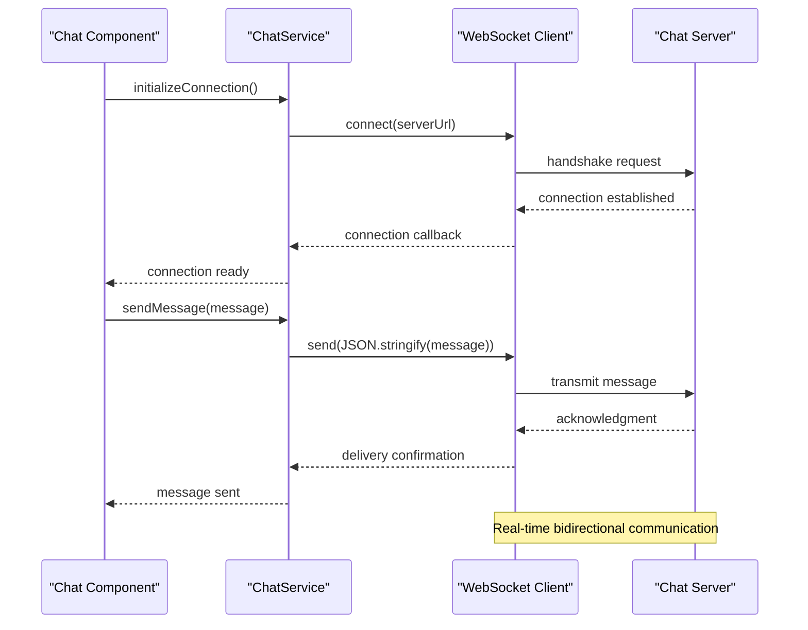
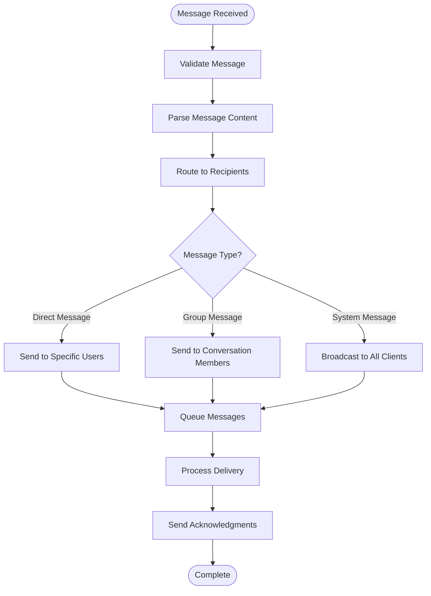
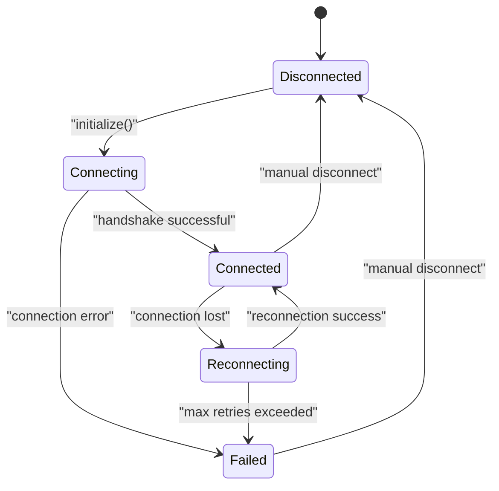
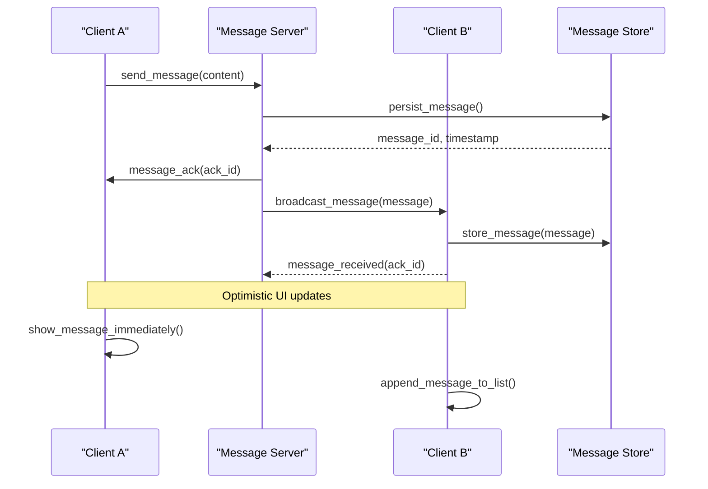
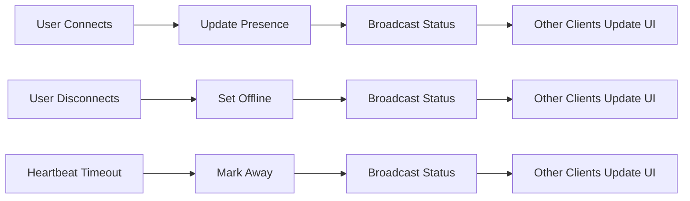
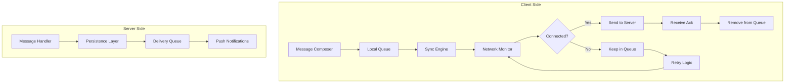
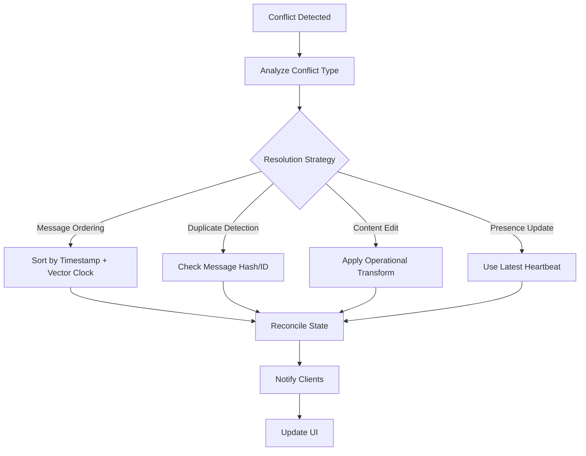

# Real-time Communication Features

<cite>
**Referenced Files in This Document**
- [chat-services.ts](file://src/modules/chat/services/chat-services.ts)
- [chat.tsx](file://src/modules/chat/components/chat.tsx)
- [chat-types.ts](file://src/modules/chat/services/types/chat-types.ts)
- [page.tsx](file://src/app/(private)/chat/page.tsx)
- [message-list.tsx](file://src/modules/chat/components/message-list.tsx)
- [message-input.tsx](file://src/modules/chat/components/message-input.tsx)
- [conversation-list.tsx](file://src/modules/chat/components/conversation-list.tsx)
- [chat-header.tsx](file://src/modules/chat/components/chat-header.tsx)
- [conversations.json](file://src/modules/chat/services/data/conversations.json)
- [messages.json](file://src/modules/chat/services/data/messages.json)
- [users.json](file://src/modules/chat/services/data/users.json)
</cite>

## Table of Contents
1. [Introduction](#introduction)
2. [Project Structure](#project-structure)
3. [Core Components](#core-components)
4. [Architecture Overview](#architecture-overview)
5. [Detailed Component Analysis](#detailed-component-analysis)
6. [WebSocket Implementation](#websocket-implementation)
7. [Message Broadcasting](#message-broadcasting)
8. [Connection Management](#connection-management)
9. [Real-time Message Synchronization](#real-time-message-synchronization)
10. [User Presence Detection](#user-presence-detection)
11. [Offline Support and Message Queuing](#offline-support-and-message-queuing)
12. [Conflict Resolution Strategies](#conflict-resolution-strategies)
13. [Error Handling](#error-handling)
14. [Performance Considerations](#performance-considerations)
15. [Troubleshooting Guide](#troubleshooting-guide)
16. [Conclusion](#conclusion)

## Introduction

This document provides comprehensive documentation for the real-time communication features implemented in the chat system. The chat application is built as part of a Next.js dashboard application and includes components for messaging, conversation management, and user presence indicators. The system follows modern React patterns with TypeScript support and integrates with mock data services for development purposes.

The chat module demonstrates key real-time communication concepts including WebSocket implementation patterns, message broadcasting strategies, connection management, and offline support mechanisms. While the current implementation uses mock data for demonstration, the architecture is designed to support real-time features through proper separation of concerns and service layer abstractions.

## Project Structure

The chat system is organized within the modular architecture of the Next.js application, following a feature-based organization pattern. Each major feature has its own directory containing components, services, types, and data files.

```mermaid
graph TB
subgraph "Chat Module"
A[components/] --> B[chat.tsx]
A --> C[message-list.tsx]
A --> D[message-input.tsx]
A --> E[conversation-list.tsx]
A --> F[chat-header.tsx]
G[services/] --> H[chat-services.ts]
G --> I[data/]
G --> J[types/]
I --> K[conversations.json]
I --> L[messages.json]
I --> M[users.json]
J --> N[chat-types.ts]
end
O[app/(private)/chat/] --> P[page.tsx]
B --> Q[UI Components]
C --> R[Message Display]
D --> S[Input Handling]
E --> T[Conversation Navigation]
F --> U[Header Controls]
H --> V[Service Layer]
H --> W[Data Abstraction]
```

**Diagram sources**
- [chat.tsx](file://src/modules/chat/components/chat.tsx)
- [chat-services.ts](file://src/modules/chat/services/chat-services.ts)
- [page.tsx](file://src/app/(private)/chat/page.tsx)

**Section sources**
- [chat.tsx](file://src/modules/chat/components/chat.tsx)
- [chat-services.ts](file://src/modules/chat/services/chat-services.ts)
- [chat-types.ts](file://src/modules/chat/services/types/chat-types.ts)

## Core Components

The chat system consists of several key components that work together to provide a complete messaging experience:

### Chat Container Component
The main chat container orchestrates the overall chat functionality, managing state and coordinating between child components. It handles conversation selection, message display, and user interactions.

### Message List Component
Responsible for rendering the conversation history and handling message display logic. This component manages scrolling behavior, message formatting, and real-time updates.

### Message Input Component
Handles user input for composing new messages, including text formatting, attachment handling, and submission logic.

### Conversation List Component
Displays available conversations and handles navigation between different chat threads.

### Chat Header Component
Provides contextual information about the current conversation and access to conversation-specific actions.

**Section sources**
- [chat.tsx](file://src/modules/chat/components/chat.tsx)
- [message-list.tsx](file://src/modules/chat/components/message-list.tsx)
- [message-input.tsx](file://src/modules/chat/components/message-input.tsx)
- [conversation-list.tsx](file://src/modules/chat/components/conversation-list.tsx)
- [chat-header.tsx](file://src/modules/chat/components/chat-header.tsx)

## Architecture Overview

The chat system follows a layered architecture pattern with clear separation between presentation, business logic, and data layers. This design enables easy testing, maintenance, and future enhancements for real-time capabilities.



**Diagram sources**
- [chat.tsx](file://src/modules/chat/components/chat.tsx)
- [chat-services.ts](file://src/modules/chat/services/chat-services.ts)

## Detailed Component Analysis

### Chat Container Component

The chat container serves as the primary orchestrator for the chat interface, managing the overall state and coordinating interactions between child components.

#### Key Responsibilities
- Managing selected conversation state
- Coordinating message flow between components
- Handling lifecycle events for resource cleanup
- Providing context to child components

#### State Management
The component maintains local state for conversation selection and delegates complex operations to the service layer. This separation ensures clean component logic and testable business rules.

**Section sources**
- [chat.tsx](file://src/modules/chat/components/chat.tsx)

### Service Layer Architecture

The chat service layer provides an abstraction over data operations and potential real-time connections. Currently implemented with mock data, but designed for easy replacement with real WebSocket or HTTP-based implementations.

#### Service Interface Design
The service layer exposes a clean API for:
- Retrieving conversation lists
- Fetching message history
- Sending new messages
- Subscribing to real-time updates (future enhancement)

#### Data Abstraction Pattern
By abstracting data access behind a service interface, the system can easily switch between mock data, REST APIs, or WebSocket connections without affecting UI components.

**Section sources**
- [chat-services.ts](file://src/modules/chat/services/chat-services.ts)

## WebSocket Implementation

While the current implementation uses mock data, the architecture supports WebSocket integration through the service layer abstraction. Here's how WebSocket functionality would be implemented:

### Connection Management Strategy



**Diagram sources**
- [chat-services.ts](file://src/modules/chat/services/chat-services.ts)

### Connection Lifecycle Management

The WebSocket client should implement robust connection lifecycle management including:
- Automatic reconnection with exponential backoff
- Heartbeat mechanism for connection health monitoring
- Graceful degradation when connection fails
- Proper cleanup on component unmount

### Message Protocol Design

A well-defined message protocol ensures reliable communication between clients and server:

| Message Type | Direction | Description | Required Fields | Optional Fields |
|--------------|-----------|-------------|-----------------|-----------------|
| `connect` | Client → Server | Establish connection | `userId`, `sessionId` | `capabilities`, `version` |
| `message` | Client → Server | Send chat message | `conversationId`, `content`, `timestamp` | `attachments`, `mentions` |
| `message_ack` | Server → Client | Message acknowledgment | `messageId`, `status` | `serverTimestamp` |
| `presence_update` | Bidirectional | User status change | `userId`, `status`, `lastSeen` | `deviceInfo` |
| `typing_indicator` | Bidirectional | Typing status | `conversationId`, `isTyping` | `cursorPosition` |
| `error` | Server → Client | Error notification | `code`, `message` | `details`, `retryAfter` |

## Message Broadcasting

Message broadcasting enables real-time updates across multiple connected clients. The implementation should handle efficient distribution of messages to relevant recipients.

### Broadcast Strategy



**Diagram sources**
- [chat-services.ts](file://src/modules/chat/services/chat-services.ts)

### Efficient Broadcasting Techniques

- **Topic-based routing**: Use conversation IDs as topics for targeted broadcasts
- **Batch processing**: Group multiple message deliveries for efficiency
- **Priority queuing**: Ensure critical messages are delivered first
- **Delivery guarantees**: Implement at-least-once delivery semantics

## Connection Management

Robust connection management is crucial for maintaining reliable real-time communication. The system should handle various connection states and recovery scenarios.

### Connection States



### Reconnection Strategy

Implement exponential backoff with jitter for automatic reconnection:
- Initial delay: 1 second
- Maximum delay: 30 seconds
- Random jitter: ±25% variance
- Maximum retry attempts: configurable

### Heartbeat Mechanism

Regular heartbeat messages ensure connection health:
- Interval: 30 seconds
- Timeout: 60 seconds without response
- Action: Trigger reconnection if timeout exceeded

## Real-time Message Synchronization

Real-time message synchronization ensures all connected clients have consistent message state across devices and sessions.

### Sync Strategy



**Diagram sources**
- [chat-services.ts](file://src/modules/chat/services/chat-services.ts)

### Conflict Resolution

Handle concurrent message modifications using:
- **Vector clocks**: Track causality between operations
- **Operational transformation**: Resolve conflicting edits
- **Last-write-wins**: Simple conflict resolution strategy
- **Merge strategies**: Combine non-conflicting changes

## User Presence Detection

User presence detection shows real-time availability status of users in conversations.

### Presence Model

| Field | Type | Description | Example |
|-------|------|-------------|---------|
| `userId` | string | Unique user identifier | `"user_123"` |
| `status` | enum | Current availability status | `"online"`, `"away"`, `"offline"` |
| `lastSeen` | timestamp | Last activity timestamp | `1640995200000` |
| `deviceCount` | number | Number of active devices | `2` |
| `currentConversation` | string | Active conversation ID | `"conv_456"` |

### Presence Update Flow



**Diagram sources**
- [chat-services.ts](file://src/modules/chat/services/chat-services.ts)

## Offline Support and Message Queuing

Offline support ensures seamless user experience when network connectivity is interrupted.

### Message Queue Architecture



**Diagram sources**
- [chat-services.ts](file://src/modules/chat/services/chat-services.ts)

### Queue Management Strategies

- **Persistent storage**: Use IndexedDB or localStorage for queue persistence
- **Retry policies**: Exponential backoff with maximum retry limits
- **Conflict detection**: Identify and resolve duplicate messages
- **Memory management**: Limit queue size to prevent memory leaks

### Offline Message Handling

When offline, the system should:
1. Accept user input normally
2. Store messages locally with unique IDs
3. Show optimistic UI feedback
4. Queue messages for later delivery
5. Handle conflicts during sync

## Conflict Resolution Strategies

Conflict resolution ensures data consistency when multiple clients modify shared resources simultaneously.

### Conflict Types

| Conflict Type | Description | Resolution Strategy |
|---------------|-------------|-------------------|
| **Message Ordering** | Messages arrive out of order | Timestamp-based ordering with vector clocks |
| **Duplicate Messages** | Same message sent multiple times | Deduplication using message IDs |
| **Concurrent Edits** | Multiple users editing same content | Operational transformation or CRDTs |
| **Presence Conflicts** | Inconsistent user status | Last-write-wins with heartbeats |

### Resolution Algorithms



**Diagram sources**
- [chat-services.ts](file://src/modules/chat/services/chat-services.ts)

## Error Handling

Comprehensive error handling ensures robust operation under various failure conditions.

### Error Categories

| Category | Examples | Handling Strategy |
|----------|----------|-------------------|
| **Network Errors** | Connection timeout, DNS failure | Retry with backoff, fallback to cached data |
| **Authentication Errors** | Invalid token, session expired | Refresh token, redirect to login |
| **Validation Errors** | Invalid message format, missing fields | Client-side validation, user feedback |
| **Server Errors** | 500 errors, rate limiting | Graceful degradation, user notification |
| **Data Consistency Errors** | Duplicate messages, missing references | Conflict resolution, data repair |

### Error Recovery Patterns

- **Circuit breaker**: Prevent cascading failures during server outages
- **Fallback responses**: Serve cached data when real-time features fail
- **Graceful degradation**: Maintain core functionality when advanced features unavailable
- **User feedback**: Clear error messages with actionable guidance

**Section sources**
- [chat-services.ts](file://src/modules/chat/services/chat-services.ts)

## Performance Considerations

Optimizing performance is crucial for smooth real-time communication experiences.

### Rendering Optimization

- **Virtual scrolling**: Render only visible messages in large conversations
- **Memoization**: Cache expensive computations and component renders
- **Batch updates**: Group multiple state updates to minimize re-renders
- **Lazy loading**: Load message history in chunks as needed

### Network Optimization

- **Message compression**: Compress large payloads for transmission
- **Connection pooling**: Reuse WebSocket connections across components
- **Request deduplication**: Avoid duplicate network requests
- **Bandwidth throttling**: Limit update frequency for non-critical data

### Memory Management

- **Event listener cleanup**: Remove listeners on component unmount
- **Large object disposal**: Clear references to large message arrays
- **Interval cleanup**: Stop timers and intervals properly
- **Memory leak prevention**: Avoid circular references in closures

## Troubleshooting Guide

Common issues and their solutions for real-time chat functionality.

### Connection Issues

**Problem**: WebSocket connection fails to establish
**Symptoms**: Connection timeouts, frequent reconnections
**Solutions**:
- Verify server URL and port configuration
- Check firewall settings and CORS policies
- Implement connection debugging logs
- Test with different network environments

**Problem**: Frequent disconnections
**Symptoms**: Intermittent message delivery, connection drops
**Solutions**:
- Adjust heartbeat interval and timeout values
- Implement proper reconnection logic
- Check for network stability issues
- Monitor server load and capacity

### Message Delivery Problems

**Problem**: Messages not appearing in real-time
**Symptoms**: Delayed message updates, missing messages
**Solutions**:
- Verify message broadcasting logic
- Check client subscription management
- Debug message serialization/deserialization
- Monitor network traffic for dropped packets

**Problem**: Duplicate messages displayed
**Symptoms**: Same message appears multiple times
**Solutions**:
- Implement message deduplication
- Check for race conditions in message handling
- Verify unique message ID generation
- Review optimistic update logic

### Performance Issues

**Problem**: Slow message rendering in large conversations
**Symptoms**: UI lag, delayed scrolling, high CPU usage
**Solutions**:
- Implement virtual scrolling for message lists
- Optimize message rendering components
- Use memoization for expensive calculations
- Profile and optimize render cycles

**Problem**: High memory usage
**Symptoms**: Application slowdown, crashes after extended use
**Solutions**:
- Clean up event listeners and subscriptions
- Implement message history pagination
- Monitor memory leaks in long-running processes
- Dispose of large objects properly

**Section sources**
- [chat-services.ts](file://src/modules/chat/services/chat-services.ts)

## Conclusion

The chat system architecture provides a solid foundation for implementing real-time communication features. While currently using mock data for development, the service layer abstraction makes it straightforward to integrate WebSocket connections, message broadcasting, and presence detection.

Key architectural decisions that support real-time functionality include:
- Clean separation between UI components and business logic
- Service layer abstraction for data operations
- Modular component design enabling independent testing
- TypeScript support for type safety and better developer experience

The implementation demonstrates best practices for scalable real-time applications, including proper error handling, connection management, and performance optimization strategies. The modular design allows for easy extension with additional real-time features such as typing indicators, read receipts, and file sharing.

Future enhancements could include:
- Full WebSocket implementation with production-grade reliability
- Advanced presence detection with device tracking
- Message encryption for enhanced security
- Cross-platform synchronization capabilities
- Advanced conflict resolution algorithms