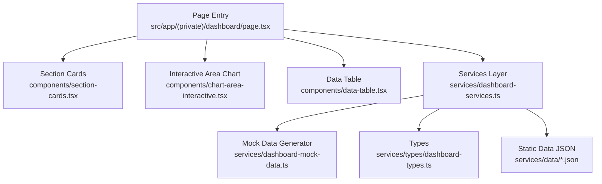
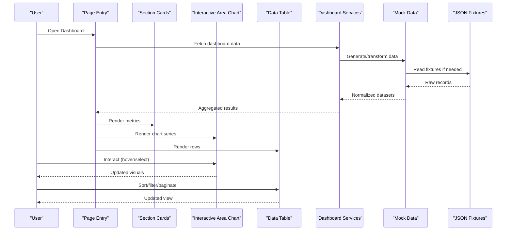
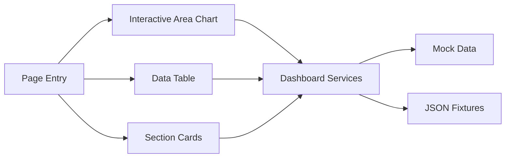

# Dashboard 1 - Analytics Dashboard

<cite>
**Referenced Files in This Document**
- [page.tsx](file://src/app/(private)/dashboard/page.tsx)
- [chart-area-interactive.tsx](file://src/modules/dashboard-1/components/chart-area-interactive.tsx)
- [data-table.tsx](file://src/modules/dashboard-1/components/data-table.tsx)
- [section-cards.tsx](file://src/modules/dashboard-1/components/section-cards.tsx)
- [dashboard-mock-data.ts](file://src/modules/dashboard-1/services/dashboard-mock-data.ts)
- [dashboard-services.ts](file://src/modules/dashboard-1/services/dashboard-services.ts)
- [dashboard-types.ts](file://src/modules/dashboard-1/services/types/dashboard-types.ts)
- [data.json](file://src/modules/dashboard-1/services/data/data.json)
- [focus-documents-data.json](file://src/modules/dashboard-1/services/data/focus-documents-data.json)
- [key-personnel-data.json](file://src/modules/dashboard-1/services/data/key-personnel-data.json)
- [past-performance-data.json](file://src/modules/dashboard-1/services/data/past-performance-data.json)
</cite>

## Table of Contents
1. [Introduction](#introduction)
2. [Project Structure](#project-structure)
3. [Core Components](#core-components)
4. [Architecture Overview](#architecture-overview)
5. [Detailed Component Analysis](#detailed-component-analysis)
6. [Dependency Analysis](#dependency-analysis)
7. [Performance Considerations](#performance-considerations)
8. [Troubleshooting Guide](#troubleshooting-guide)
9. [Conclusion](#conclusion)
10. [Appendices](#appendices)

## Introduction
This document provides comprehensive documentation for the analytics-focused dashboard (Dashboard 1). It explains the interactive chart components, data table implementation, and section cards layout. It also covers data visualization patterns, real-time update strategies, performance metrics tracking, customization examples, adding new data sources, implementing responsive layouts, data aggregation logic, caching strategies, and optimization techniques for large datasets.

## Project Structure
Dashboard 1 is organized under a feature-based module structure:
- Page entry point composes the dashboard UI from reusable components.
- Components include an interactive area chart, a data table, and section cards.
- Services provide mock data, typed interfaces, and optional service methods to fetch or aggregate data.
- Data files contain static JSON fixtures used by services and components.

**Diagram sources**
- [page.tsx](file://src/app/(private)/dashboard/page.tsx)
- [section-cards.tsx](file://src/modules/dashboard-1/components/section-cards.tsx)
- [chart-area-interactive.tsx](file://src/modules/dashboard-1/components/chart-area-interactive.tsx)
- [data-table.tsx](file://src/modules/dashboard-1/components/data-table.tsx)
- [dashboard-services.ts](file://src/modules/dashboard-1/services/dashboard-services.ts)
- [dashboard-mock-data.ts](file://src/modules/dashboard-1/services/dashboard-mock-data.ts)
- [dashboard-types.ts](file://src/modules/dashboard-1/services/types/dashboard-types.ts)
- [data.json](file://src/modules/dashboard-1/services/data/data.json)
- [focus-documents-data.json](file://src/modules/dashboard-1/services/data/focus-documents-data.json)
- [key-personnel-data.json](file://src/modules/dashboard-1/services/data/key-personnel-data.json)
- [past-performance-data.json](file://src/modules/dashboard-1/services/data/past-performance-data.json)

**Section sources**
- [page.tsx](file://src/app/(private)/dashboard/page.tsx)
- [dashboard-services.ts](file://src/modules/dashboard-1/services/dashboard-services.ts)
- [dashboard-mock-data.ts](file://src/modules/dashboard-1/services/dashboard-mock-data.ts)
- [dashboard-types.ts](file://src/modules/dashboard-1/services/types/dashboard-types.ts)
- [data.json](file://src/modules/dashboard-1/services/data/data.json)
- [focus-documents-data.json](file://src/modules/dashboard-1/services/data/focus-documents-data.json)
- [key-personnel-data.json](file://src/modules/dashboard-1/services/data/key-personnel-data.json)
- [past-performance-data.json](file://src/modules/dashboard-1/services/data/past-performance-data.json)

## Core Components
- Section Cards: Present key metrics and summary information with responsive grid layout.
- Interactive Area Chart: Renders time-series or categorical data with interactivity such as tooltips, crosshairs, and selection.
- Data Table: Displays tabular data with sorting, filtering, pagination, and column visibility controls.

Key responsibilities:
- Section Cards compute and display aggregated metrics derived from underlying datasets.
- Interactive Area Chart consumes normalized series data and exposes configuration options for styling and behavior.
- Data Table binds to typed row structures and supports common table operations.

**Section sources**
- [section-cards.tsx](file://src/modules/dashboard-1/components/section-cards.tsx)
- [chart-area-interactive.tsx](file://src/modules/dashboard-1/components/chart-area-interactive.tsx)
- [data-table.tsx](file://src/modules/dashboard-1/components/data-table.tsx)

## Architecture Overview
The dashboard follows a layered architecture:
- Presentation layer: page entry composes UI components.
- Component layer: charts, tables, and cards render state and handle user interactions.
- Service layer: orchestrates data fetching, transformation, and caching.
- Data layer: static JSON fixtures and optional mock generators.

**Diagram sources**
- [page.tsx](file://src/app/(private)/dashboard/page.tsx)
- [dashboard-services.ts](file://src/modules/dashboard-1/services/dashboard-services.ts)
- [dashboard-mock-data.ts](file://src/modules/dashboard-1/services/dashboard-mock-data.ts)
- [data.json](file://src/modules/dashboard-1/services/data/data.json)
- [focus-documents-data.json](file://src/modules/dashboard-1/services/data/focus-documents-data.json)
- [key-personnel-data.json](file://src/modules/dashboard-1/services/data/key-personnel-data.json)
- [past-performance-data.json](file://src/modules/dashboard-1/services/data/past-performance-data.json)

## Detailed Component Analysis

### Section Cards
Purpose:
- Display high-level KPIs and summaries.
- Provide quick insights into performance trends.

Responsibilities:
- Accept metric inputs and format them for display.
- Support responsive grid layout across breakpoints.
- Optionally accept loading states and error boundaries.

Customization examples:
- Add new metric cards by extending the card list and providing value/formatter functions.
- Integrate theme-aware colors and typography via shared UI tokens.

Responsive layout:
- Use a flexible grid that adapts to screen size, stacking on small screens and expanding on larger ones.

**Section sources**
- [section-cards.tsx](file://src/modules/dashboard-1/components/section-cards.tsx)

### Interactive Area Chart
Purpose:
- Visualize time-series or categorical metrics with interactivity.

Responsibilities:
- Normalize input data into series format.
- Handle tooltip rendering, crosshair lines, and selection ranges.
- Expose configuration for axes, legends, colors, and animations.

Data visualization patterns:
- Series mapping: map dataset fields to x/y values and category labels.
- Aggregation: group by time buckets or categories before rendering.
- Interactions: hover highlights, brush selection, and zoom where applicable.

Real-time updates:
- Subscribe to data changes via props/state updates.
- Debounce frequent updates to avoid excessive re-renders.

Customization examples:
- Change color palette, line styles, and area opacity.
- Enable/disable features like tooltips, legends, and crosshairs.
- Adjust axis ticks, formatting, and domain ranges.

**Section sources**
- [chart-area-interactive.tsx](file://src/modules/dashboard-1/components/chart-area-interactive.tsx)

### Data Table
Purpose:
- Present structured data with advanced table features.

Responsibilities:
- Bind to typed row definitions.
- Implement sorting, filtering, pagination, and column visibility toggles.
- Provide keyboard navigation and accessibility attributes.

Implementation notes:
- Column definitions are strongly typed to ensure consistency with data models.
- Pagination reduces memory footprint for large datasets.
- Filtering can be client-side for moderate sizes; consider server-side for very large sets.

**Section sources**
- [data-table.tsx](file://src/modules/dashboard-1/components/data-table.tsx)

### Services and Types
Purpose:
- Centralize data access, transformation, and caching.

Responsibilities:
- Define typed interfaces for dashboard entities.
- Generate or transform mock data into normalized shapes.
- Aggregate raw datasets into chart-ready series and table-ready rows.
- Cache results to minimize redundant work.

Caching strategy:
- In-memory cache keyed by query parameters (e.g., time range, filters).
- Stale-while-revalidate pattern: serve cached data immediately while refreshing in background.

Aggregation logic:
- Group by time intervals (e.g., daily, weekly) for chart series.
- Compute summary metrics (totals, averages, growth rates) for section cards.
- Deduplicate and normalize identifiers for consistent joins.

Adding new data sources:
- Extend types to include new fields.
- Update mock generator to produce synthetic records.
- Integrate service method to fetch from external APIs when ready.
- Wire up components to consume updated datasets.

**Section sources**
- [dashboard-services.ts](file://src/modules/dashboard-1/services/dashboard-services.ts)
- [dashboard-mock-data.ts](file://src/modules/dashboard-1/services/dashboard-mock-data.ts)
- [dashboard-types.ts](file://src/modules/dashboard-1/services/types/dashboard-types.ts)
- [data.json](file://src/modules/dashboard-1/services/data/data.json)
- [focus-documents-data.ts](file://src/modules/dashboard-1/services/data/focus-documents-data.json)
- [key-personnel-data.ts](file://src/modules/dashboard-1/services/data/key-personnel-data.json)
- [past-performance-data.ts](file://src/modules/dashboard-1/services/data/past-performance-data.json)

## Dependency Analysis
Component and service dependencies:
- Page depends on Section Cards, Interactive Area Chart, and Data Table.
- Services depend on Mock Data and JSON fixtures.
- Components depend on Services for data and on UI primitives for rendering.

**Diagram sources**
- [page.tsx](file://src/app/(private)/dashboard/page.tsx)
- [section-cards.tsx](file://src/modules/dashboard-1/components/section-cards.tsx)
- [chart-area-interactive.tsx](file://src/modules/dashboard-1/components/chart-area-interactive.tsx)
- [data-table.tsx](file://src/modules/dashboard-1/components/data-table.tsx)
- [dashboard-services.ts](file://src/modules/dashboard-1/services/dashboard-services.ts)
- [dashboard-mock-data.ts](file://src/modules/dashboard-1/services/dashboard-mock-data.ts)
- [data.json](file://src/modules/dashboard-1/services/data/data.json)
- [focus-documents-data.json](file://src/modules/dashboard-1/services/data/focus-documents-data.json)
- [key-personnel-data.json](file://src/modules/dashboard-1/services/data/key-personnel-data.json)
- [past-performance-data.json](file://src/modules/dashboard-1/services/data/past-performance-data.json)

**Section sources**
- [page.tsx](file://src/app/(private)/dashboard/page.tsx)
- [dashboard-services.ts](file://src/modules/dashboard-1/services/dashboard-services.ts)
- [dashboard-mock-data.ts](file://src/modules/dashboard-1/services/dashboard-mock-data.ts)

## Performance Considerations
- Virtualization: For large tables, implement virtual scrolling to render only visible rows.
- Memoization: Memoize expensive computations and chart series to prevent unnecessary recalculations.
- Debouncing: Debounce search inputs and filter changes to reduce processing overhead.
- Pagination: Prefer server-side pagination for large datasets; otherwise, paginate client-side.
- Data normalization: Pre-normalize data at the service layer to minimize per-render transformations.
- Caching: Use in-memory caches with TTL and invalidation keys based on filters/time ranges.
- Chart optimization: Limit number of points rendered; downsample series for long time ranges.
- Lazy loading: Load heavy components or data on demand to improve initial load time.

[No sources needed since this section provides general guidance]

## Troubleshooting Guide
Common issues and resolutions:
- Missing or malformed data: Validate JSON fixtures against typed schemas; add runtime checks in services.
- Chart not updating: Ensure data references are stable and memoized; check for deep equality issues.
- Table slow with many rows: Enable virtualization and pagination; move filtering/sorting to server side if needed.
- Real-time flicker: Debounce updates and batch state changes; use optimistic UI updates with rollback on failure.
- Memory leaks: Clean up event listeners and subscriptions in component unmount hooks.

**Section sources**
- [dashboard-services.ts](file://src/modules/dashboard-1/services/dashboard-services.ts)
- [dashboard-mock-data.ts](file://src/modules/dashboard-1/services/dashboard-mock-data.ts)
- [dashboard-types.ts](file://src/modules/dashboard-1/services/types/dashboard-types.ts)

## Conclusion
Dashboard 1 provides a modular, extensible analytics interface with clear separation between presentation, services, and data layers. The interactive chart, robust data table, and responsive section cards form a cohesive experience. By following the recommended patterns for data normalization, caching, and performance optimization, you can scale the dashboard to handle large datasets and real-time updates effectively.

[No sources needed since this section summarizes without analyzing specific files]

## Appendices

### Customizing Charts
- Modify series configuration to change colors, line styles, and area fills.
- Toggle interactivity features such as tooltips, legends, and crosshairs.
- Adjust axis domains, tick counts, and label formats.

**Section sources**
- [chart-area-interactive.tsx](file://src/modules/dashboard-1/components/chart-area-interactive.tsx)

### Adding New Data Sources
- Extend type definitions to include new fields.
- Update mock data generator to synthesize additional records.
- Implement service methods to fetch from external APIs.
- Wire components to consume the new datasets.

**Section sources**
- [dashboard-types.ts](file://src/modules/dashboard-1/services/types/dashboard-types.ts)
- [dashboard-mock-data.ts](file://src/modules/dashboard-1/services/dashboard-mock-data.ts)
- [dashboard-services.ts](file://src/modules/dashboard-1/services/dashboard-services.ts)

### Implementing Responsive Layouts
- Use flexible grids and adaptive breakpoints for section cards.
- Ensure chart containers resize gracefully and recalculate dimensions on window changes.
- Test table responsiveness with horizontal scrolling and column hiding.

**Section sources**
- [section-cards.tsx](file://src/modules/dashboard-1/components/section-cards.tsx)
- [chart-area-interactive.tsx](file://src/modules/dashboard-1/components/chart-area-interactive.tsx)
- [data-table.tsx](file://src/modules/dashboard-1/components/data-table.tsx)