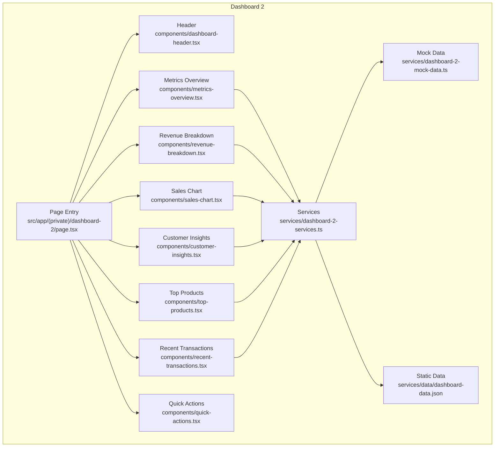
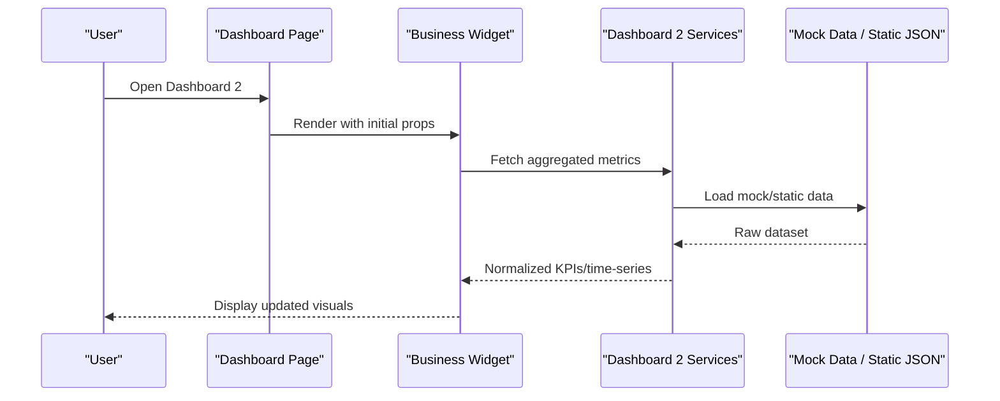
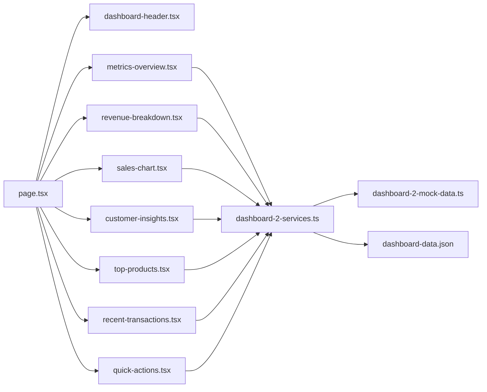

# Dashboard 2 - Business Metrics Dashboard

<cite>
**Referenced Files in This Document**
- [page.tsx](file://src/app/(private)/dashboard-2/page.tsx)
- [dashboard-header.tsx](file://src/modules/dashboard-2/components/dashboard-header.tsx)
- [metrics-overview.tsx](file://src/modules/dashboard-2/components/metrics-overview.tsx)
- [revenue-breakdown.tsx](file://src/modules/dashboard-2/components/revenue-breakdown.tsx)
- [sales-chart.tsx](file://src/modules/dashboard-2/components/sales-chart.tsx)
- [customer-insights.tsx](file://src/modules/dashboard-2/components/customer-insights.tsx)
- [top-products.tsx](file://src/modules/dashboard-2/components/top-products.tsx)
- [recent-transactions.tsx](file://src/modules/dashboard-2/components/recent-transactions.tsx)
- [quick-actions.tsx](file://src/modules/dashboard-2/components/quick-actions.tsx)
- [dashboard-2-services.ts](file://src/modules/dashboard-2/services/dashboard-2-services.ts)
- [dashboard-2-mock-data.ts](file://src/modules/dashboard-2/services/dashboard-2-mock-data.ts)
- [dashboard-data.json](file://src/modules/dashboard-2/services/data/dashboard-data.json)
</cite>

## Table of Contents
1. [Introduction](#introduction)
2. [Project Structure](#project-structure)
3. [Core Components](#core-components)
4. [Architecture Overview](#architecture-overview)
5. [Detailed Component Analysis](#detailed-component-analysis)
6. [Dependency Analysis](#dependency-analysis)
7. [Performance Considerations](#performance-considerations)
8. [Troubleshooting Guide](#troubleshooting-guide)
9. [Conclusion](#conclusion)
10. [Appendices](#appendices)

## Introduction
This document provides comprehensive documentation for the business metrics dashboard (Dashboard 2). It explains how revenue breakdown components, customer insights widgets, sales chart visualizations, and metrics overview panels are implemented. It also covers business intelligence patterns, KPI tracking implementation, data aggregation strategies, extensibility for new widgets, integration with external analytics APIs, customization of metric calculations, performance optimization for real-time data, and responsive design considerations.

## Project Structure
The Dashboard 2 feature is organized under a dedicated module with a clear separation between UI components and services:
- Page entry point composes the dashboard layout and orchestrates component rendering.
- Components implement specific business widgets such as metrics overview, revenue breakdown, sales charts, customer insights, top products, recent transactions, and quick actions.
- Services provide data fetching logic and mock data utilities to support development and testing.

**Diagram sources**
- [page.tsx](file://src/app/(private)/dashboard-2/page.tsx)
- [dashboard-header.tsx](file://src/modules/dashboard-2/components/dashboard-header.tsx)
- [metrics-overview.tsx](file://src/modules/dashboard-2/components/metrics-overview.tsx)
- [revenue-breakdown.tsx](file://src/modules/dashboard-2/components/revenue-breakdown.tsx)
- [sales-chart.tsx](file://src/modules/dashboard-2/components/sales-chart.tsx)
- [customer-insights.tsx](file://src/modules/dashboard-2/components/customer-insights.tsx)
- [top-products.tsx](file://src/modules/dashboard-2/components/top-products.tsx)
- [recent-transactions.tsx](file://src/modules/dashboard-2/components/recent-transactions.tsx)
- [quick-actions.tsx](file://src/modules/dashboard-2/components/quick-actions.tsx)
- [dashboard-2-services.ts](file://src/modules/dashboard-2/services/dashboard-2-services.ts)
- [dashboard-2-mock-data.ts](file://src/modules/dashboard-2/services/dashboard-2-mock-data.ts)
- [dashboard-data.json](file://src/modules/dashboard-2/services/data/dashboard-data.json)

**Section sources**
- [page.tsx](file://src/app/(private)/dashboard-2/page.tsx)
- [dashboard-2-services.ts](file://src/modules/dashboard-2/services/dashboard-2-services.ts)
- [dashboard-2-mock-data.ts](file://src/modules/dashboard-2/services/dashboard-2-mock-data.ts)
- [dashboard-data.json](file://src/modules/dashboard-2/services/data/dashboard-data.json)

## Core Components
- Metrics Overview: Aggregates key performance indicators such as total revenue, orders, average order value, and conversion rate. It typically subscribes to service methods that compute these KPIs from underlying datasets.
- Revenue Breakdown: Visualizes revenue by category or channel using charting primitives. It consumes aggregated revenue data and formats it for visualization.
- Sales Chart: Displays time-series sales trends with interactive features like tooltips and legends. It binds to normalized time-series data provided by services.
- Customer Insights: Presents cohort or segmentation insights, including acquisition channels, retention signals, and lifetime value indicators.
- Top Products: Ranks best-selling items based on sales volume or revenue contribution.
- Recent Transactions: Lists latest transactions with summary details and drill-down capabilities.
- Quick Actions: Provides shortcuts for common operations such as exporting reports or refreshing data.

These components follow a consistent pattern:
- Receive props from the page entry point.
- Call service functions to fetch or compute data.
- Render results using shared UI primitives.

**Section sources**
- [metrics-overview.tsx](file://src/modules/dashboard-2/components/metrics-overview.tsx)
- [revenue-breakdown.tsx](file://src/modules/dashboard-2/components/revenue-breakdown.tsx)
- [sales-chart.tsx](file://src/modules/dashboard-2/components/sales-chart.tsx)
- [customer-insights.tsx](file://src/modules/dashboard-2/components/customer-insights.tsx)
- [top-products.tsx](file://src/modules/dashboard-2/components/top-products.tsx)
- [recent-transactions.tsx](file://src/modules/dashboard-2/components/recent-transactions.tsx)
- [quick-actions.tsx](file://src/modules/dashboard-2/components/quick-actions.tsx)

## Architecture Overview
The dashboard follows a modular architecture where the page composes multiple domain-specific widgets. Each widget delegates data responsibilities to a centralized service layer, which abstracts data sources (mock data or static JSON). This separation enables easy swapping of data providers and supports future integrations with external analytics APIs.

**Diagram sources**
- [page.tsx](file://src/app/(private)/dashboard-2/page.tsx)
- [dashboard-2-services.ts](file://src/modules/dashboard-2/services/dashboard-2-services.ts)
- [dashboard-2-mock-data.ts](file://src/modules/dashboard-2/services/dashboard-2-mock-data.ts)
- [dashboard-data.json](file://src/modules/dashboard-2/services/data/dashboard-data.json)

## Detailed Component Analysis

### Metrics Overview Panel
Responsibilities:
- Compute and display high-level KPIs (e.g., revenue, orders, AOV, conversion).
- Provide period selection and refresh controls.
- Surface trend indicators and variance against targets.

Implementation notes:
- Uses service methods to aggregate raw data into KPI summaries.
- Formats currency and percentages consistently.
- Integrates with loading and error states via service responses.

Extensibility:
- Add new KPIs by extending the aggregation function in the service and wiring the new field into the panel’s render logic.

**Section sources**
- [metrics-overview.tsx](file://src/modules/dashboard-2/components/metrics-overview.tsx)
- [dashboard-2-services.ts](file://src/modules/dashboard-2/services/dashboard-2-services.ts)

### Revenue Breakdown
Responsibilities:
- Show revenue distribution across categories or channels.
- Support drill-down interactions to explore sub-segments.

Data flow:
- Requests category-level totals from the service.
- Normalizes values for chart rendering.

Customization:
- Adjust grouping keys or filters by modifying service aggregation parameters.

**Section sources**
- [revenue-breakdown.tsx](file://src/modules/dashboard-2/components/revenue-breakdown.tsx)
- [dashboard-2-services.ts](file://src/modules/dashboard-2/services/dashboard-2-services.ts)

### Sales Chart Visualization
Responsibilities:
- Render time-series sales data with interactivity (tooltips, legends).
- Allow time range selection and comparison views.

Data flow:
- Consumes normalized time-series arrays from services.
- Maps dates and values to chart configuration.

Optimization:
- Debounce user interactions to reduce re-renders.
- Use memoization for computed series when possible.

**Section sources**
- [sales-chart.tsx](file://src/modules/dashboard-2/components/sales-chart.tsx)
- [dashboard-2-services.ts](file://src/modules/dashboard-2/services/dashboard-2-services.ts)

### Customer Insights Widget
Responsibilities:
- Present customer segmentation, acquisition channels, and retention metrics.
- Highlight actionable insights such as churn risk segments.

Data flow:
- Aggregates customer events and transactional data into insight metrics.
- Exposes segment-level breakdowns for further exploration.

**Section sources**
- [customer-insights.tsx](file://src/modules/dashboard-2/components/customer-insights.tsx)
- [dashboard-2-services.ts](file://src/modules/dashboard-2/services/dashboard-2-services.ts)

### Top Products
Responsibilities:
- Rank products by sales volume or revenue.
- Provide quick access to product details.

Data flow:
- Sorts and slices product lists based on selected criteria.
- Supports dynamic filtering by category or date range.

**Section sources**
- [top-products.tsx](file://src/modules/dashboard-2/components/top-products.tsx)
- [dashboard-2-services.ts](file://src/modules/dashboard-2/services/dashboard-2-services.ts)

### Recent Transactions
Responsibilities:
- List recent transactions with essential fields (date, amount, status).
- Enable sorting and pagination.

Data flow:
- Retrieves paginated transaction records from services.
- Applies client-side sorting/pagination if needed.

**Section sources**
- [recent-transactions.tsx](file://src/modules/dashboard-2/components/recent-transactions.tsx)
- [dashboard-2-services.ts](file://src/modules/dashboard-2/services/dashboard-2-services.ts)

### Quick Actions
Responsibilities:
- Offer shortcuts for common tasks (export, refresh, filter).
- Trigger service calls or UI state changes.

Integration points:
- Can be extended to call external analytics endpoints or trigger background jobs.

**Section sources**
- [quick-actions.tsx](file://src/modules/dashboard-2/components/quick-actions.tsx)
- [dashboard-2-services.ts](file://src/modules/dashboard-2/services/dashboard-2-services.ts)

## Dependency Analysis
The dashboard relies on a small set of internal dependencies:
- The page composes all widgets.
- Widgets depend on the service layer for data.
- The service layer depends on mock data and static JSON for development.

**Diagram sources**
- [page.tsx](file://src/app/(private)/dashboard-2/page.tsx)
- [dashboard-header.tsx](file://src/modules/dashboard-2/components/dashboard-header.tsx)
- [metrics-overview.tsx](file://src/modules/dashboard-2/components/metrics-overview.tsx)
- [revenue-breakdown.tsx](file://src/modules/dashboard-2/components/revenue-breakdown.tsx)
- [sales-chart.tsx](file://src/modules/dashboard-2/components/sales-chart.tsx)
- [customer-insights.tsx](file://src/modules/dashboard-2/components/customer-insights.tsx)
- [top-products.tsx](file://src/modules/dashboard-2/components/top-products.tsx)
- [recent-transactions.tsx](file://src/modules/dashboard-2/components/recent-transactions.tsx)
- [quick-actions.tsx](file://src/modules/dashboard-2/components/quick-actions.tsx)
- [dashboard-2-services.ts](file://src/modules/dashboard-2/services/dashboard-2-services.ts)
- [dashboard-2-mock-data.ts](file://src/modules/dashboard-2/services/dashboard-2-mock-data.ts)
- [dashboard-data.json](file://src/modules/dashboard-2/services/data/dashboard-data.json)

**Section sources**
- [page.tsx](file://src/app/(private)/dashboard-2/page.tsx)
- [dashboard-2-services.ts](file://src/modules/dashboard-2/services/dashboard-2-services.ts)
- [dashboard-2-mock-data.ts](file://src/modules/dashboard-2/services/dashboard-2-mock-data.ts)
- [dashboard-data.json](file://src/modules/dashboard-2/services/data/dashboard-data.json)

## Performance Considerations
- Real-time updates: Implement polling or WebSocket subscriptions within the service layer to keep metrics fresh without overloading the UI.
- Memoization: Cache computed aggregates and chart configurations to avoid redundant recalculations.
- Debouncing: Debounce user inputs (filters, date ranges) before triggering data fetches.
- Pagination and virtualization: For large transaction lists, use server-side pagination and virtual scrolling to maintain responsiveness.
- Chart efficiency: Limit visible data points for time-series charts; downsample or aggregate historical data.
- Error boundaries: Wrap critical widgets with error boundaries to isolate failures and preserve overall dashboard stability.
- Responsive design: Use adaptive layouts and conditional rendering to ensure optimal experience across devices.

[No sources needed since this section provides general guidance]

## Troubleshooting Guide
Common issues and resolutions:
- Missing or malformed data: Validate input schemas in the service layer and log detailed errors for debugging.
- Stale metrics: Ensure refresh mechanisms are triggered after relevant actions (e.g., export, filter changes).
- Chart rendering anomalies: Normalize date formats and numeric precision before passing data to chart components.
- Network timeouts: Add retry logic and fallback to cached data when external analytics APIs are unavailable.

Operational tips:
- Centralize logging in the service layer to capture request/response payloads and timing.
- Provide explicit loading and error states in each widget for better user feedback.

**Section sources**
- [dashboard-2-services.ts](file://src/modules/dashboard-2/services/dashboard-2-services.ts)
- [dashboard-2-mock-data.ts](file://src/modules/dashboard-2/services/dashboard-2-mock-data.ts)

## Conclusion
Dashboard 2 implements a modular, service-driven architecture that cleanly separates UI widgets from data concerns. This design facilitates adding new business widgets, integrating external analytics APIs, and customizing metric calculations while maintaining performance and responsiveness. By following the patterns outlined here, teams can extend the dashboard effectively and deliver reliable business intelligence experiences.

[No sources needed since this section summarizes without analyzing specific files]

## Appendices

### Adding a New Business Widget
Steps:
- Create a new component under the dashboard-2 components directory.
- Define props and state for filters and interactions.
- Add a corresponding service method to compute or fetch the required data.
- Compose the new widget in the page entry point alongside existing components.
- Wire up loading and error handling consistently with other widgets.

**Section sources**
- [page.tsx](file://src/app/(private)/dashboard-2/page.tsx)
- [dashboard-2-services.ts](file://src/modules/dashboard-2/services/dashboard-2-services.ts)

### Integrating External Analytics APIs
Approach:
- Extend the service layer to include API clients for external analytics providers.
- Implement caching and fallback strategies to handle network failures gracefully.
- Normalize external response shapes to match internal data contracts used by widgets.
- Add configuration management for API keys and endpoints.

**Section sources**
- [dashboard-2-services.ts](file://src/modules/dashboard-2/services/dashboard-2-services.ts)

### Customizing Metric Calculations
Guidance:
- Encapsulate calculation logic in dedicated functions within the service layer.
- Parameterize filters (date ranges, categories) to enable flexible aggregations.
- Provide unit tests for complex computations to ensure correctness.

**Section sources**
- [dashboard-2-services.ts](file://src/modules/dashboard-2/services/dashboard-2-services.ts)

### Data Aggregation Patterns
Patterns:
- Group-by aggregation for categorical breakdowns (e.g., revenue by channel).
- Time-window aggregation for trends (e.g., daily sales).
- Rolling averages and percentiles for smoothing noisy signals.

**Section sources**
- [dashboard-2-services.ts](file://src/modules/dashboard-2/services/dashboard-2-services.ts)
- [dashboard-2-mock-data.ts](file://src/modules/dashboard-2/services/dashboard-2-mock-data.ts)
- [dashboard-data.json](file://src/modules/dashboard-2/services/data/dashboard-data.json)