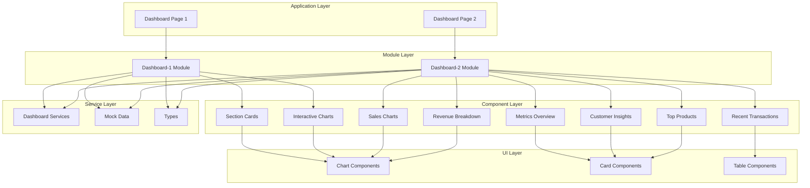
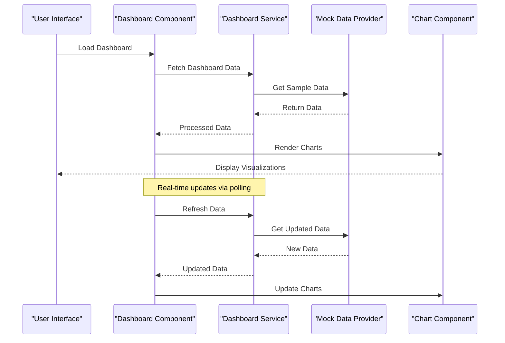
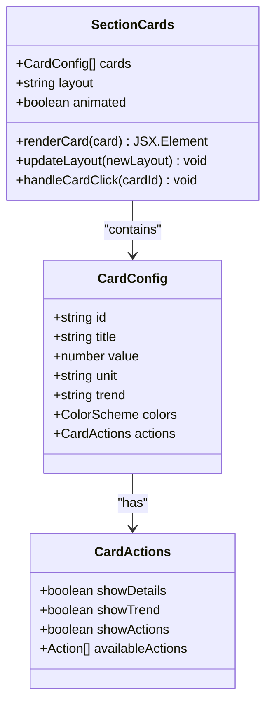
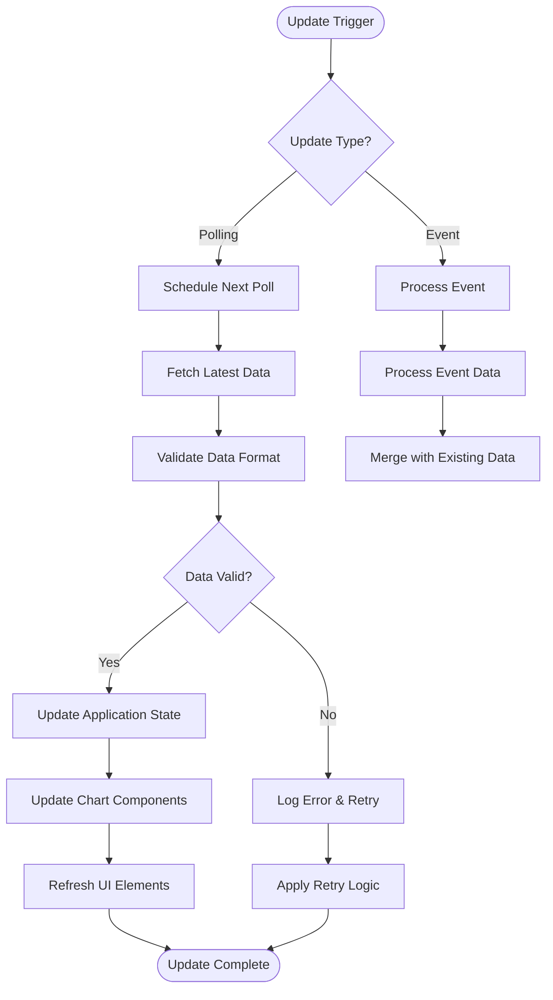
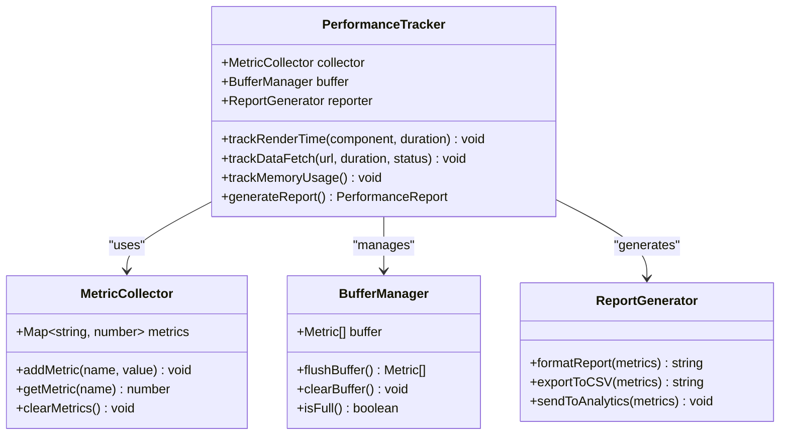
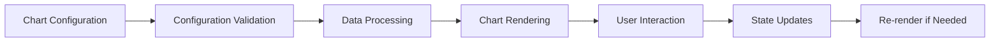
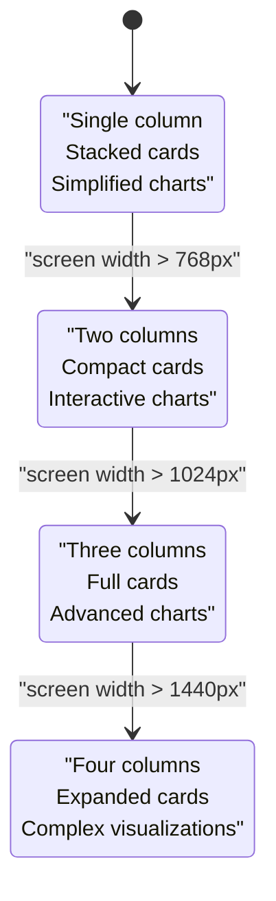
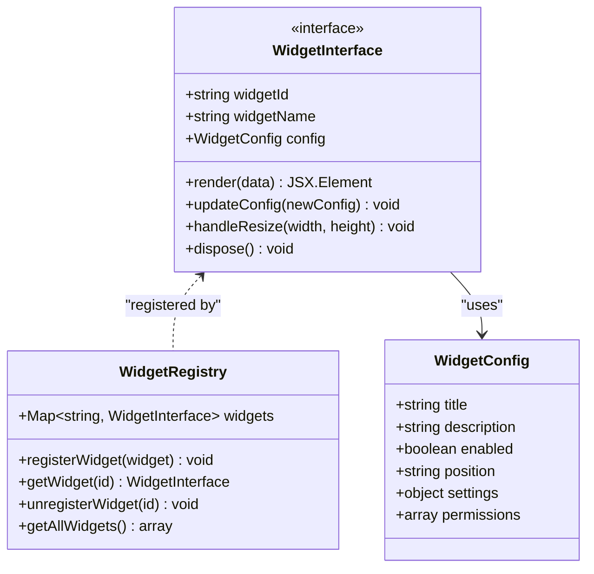
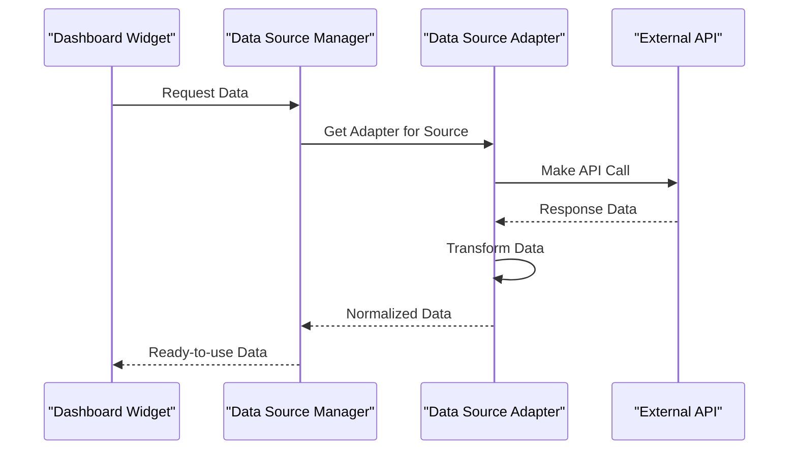

# Dashboard Features

<cite>
**Referenced Files in This Document**
- [dashboard page](file://src/app/(private)/dashboard/page.tsx)
- [dashboard-2 page](file://src/app/(private)/dashboard-2/page.tsx)
- [section-cards component](file://src/modules/dashboard-1/components/section-cards.tsx)
- [chart-area-interactive component](file://src/modules/dashboard-1/components/chart-area-interactive.tsx)
- [data-table component](file://src/modules/dashboard-1/components/data-table.tsx)
- [metrics-overview component](file://src/modules/dashboard-2/components/metrics-overview.tsx)
- [sales-chart component](file://src/modules/dashboard-2/components/sales-chart.tsx)
- [revenue-breakdown component](file://src/modules/dashboard-2/components/revenue-breakdown.tsx)
- [customer-insights component](file://src/modules/dashboard-2/components/customer-insights.tsx)
- [recent-transactions component](file://src/modules/dashboard-2/components/recent-transactions.tsx)
- [top-products component](file://src/modules/dashboard-2/components/top-products.tsx)
- [dashboard-header component](file://src/modules/dashboard-2/components/dashboard-header.tsx)
- [quick-actions component](file://src/modules/dashboard-2/components/quick-actions.tsx)
- [dashboard services](file://src/modules/dashboard-1/services/dashboard-services.ts)
- [dashboard mock data](file://src/modules/dashboard-1/services/dashboard-mock-data.ts)
- [dashboard types](file://src/modules/dashboard-1/services/types/dashboard-types.ts)
- [dashboard-2 services](file://src/modules/dashboard-2/services/dashboard-2-services.ts)
- [dashboard-2 mock data](file://src/modules/dashboard-2/services/dashboard-2-mock-data.ts)
- [chart UI component](file://src/components/ui/chart.tsx)
- [card UI component](file://src/components/ui/card.tsx)
- [table UI component](file://src/components/ui/table.tsx)
</cite>

## Table of Contents
1. [Introduction](#introduction)
2. [Project Structure](#project-structure)
3. [Core Components](#core-components)
4. [Architecture Overview](#architecture-overview)
5. [Detailed Component Analysis](#detailed-component-analysis)
6. [Data Visualization Components](#data-visualization-components)
7. [Real-time Updates Implementation](#real-time-updates-implementation)
8. [Performance Metrics Tracking](#performance-metrics-tracking)
9. [Chart Components Deep Dive](#chart-components-deep-dive)
10. [Data Aggregation Logic](#data-aggregation-logic)
11. [Responsive Design Patterns](#responsive-design-patterns)
12. [Adding New Dashboard Widgets](#adding-new-dashboard-widgets)
13. [Integrating External Data Sources](#integrating-external-data-sources)
14. [Customizing Dashboard Layouts](#customizing-dashboard-layouts)
15. [Performance Optimization](#performance-optimization)
16. [Troubleshooting Guide](#troubleshooting-guide)
17. [Conclusion](#conclusion)

## Introduction

This document provides comprehensive documentation for the dashboard features implemented in the Next.js Shadcn dashboard application. The system includes two primary dashboard implementations: an analytics-focused dashboard (Dashboard 1) and a business metrics dashboard (Dashboard 2). Both dashboards provide real-time data visualization, interactive charts, and responsive design patterns suitable for modern web applications.

The dashboard system is built using React, Next.js, and Shadcn UI components, leveraging TypeScript for type safety and providing a modular architecture that supports easy extension and customization.

## Project Structure

The dashboard functionality is organized into a modular structure with clear separation of concerns:

**Diagram sources**
- [dashboard page](file://src/app/(private)/dashboard/page.tsx)
- [dashboard-2 page](file://src/app/(private)/dashboard-2/page.tsx)
- [section-cards component](file://src/modules/dashboard-1/components/section-cards.tsx)
- [chart-area-interactive component](file://src/modules/dashboard-1/components/chart-area-interactive.tsx)
- [metrics-overview component](file://src/modules/dashboard-2/components/metrics-overview.tsx)
- [sales-chart component](file://src/modules/dashboard-2/components/sales-chart.tsx)

**Section sources**
- [dashboard page](file://src/app/(private)/dashboard/page.tsx)
- [dashboard-2 page](file://src/app/(private)/dashboard-2/page.tsx)

## Core Components

The dashboard system consists of several core components that work together to provide comprehensive analytics and business intelligence capabilities:

### Analytics Dashboard Components
- **Section Cards**: Display key performance indicators and summary statistics
- **Interactive Charts**: Provide dynamic data visualization with user interactions
- **Data Tables**: Present detailed information with sorting, filtering, and pagination

### Business Metrics Dashboard Components
- **Metrics Overview**: Aggregate and display critical business KPIs
- **Sales Charts**: Visualize sales trends and performance metrics
- **Revenue Breakdown**: Show revenue distribution across different categories
- **Customer Insights**: Analyze customer behavior and engagement metrics
- **Recent Transactions**: Display latest financial activities
- **Top Products**: Highlight best-performing products or services

**Section sources**
- [section-cards component](file://src/modules/dashboard-1/components/section-cards.tsx)
- [chart-area-interactive component](file://src/modules/dashboard-1/components/chart-area-interactive.tsx)
- [metrics-overview component](file://src/modules/dashboard-2/components/metrics-overview.tsx)
- [sales-chart component](file://src/modules/dashboard-2/components/sales-chart.tsx)

## Architecture Overview

The dashboard architecture follows a layered approach with clear separation between presentation, business logic, and data management:

**Diagram sources**
- [dashboard services](file://src/modules/dashboard-1/services/dashboard-services.ts)
- [dashboard mock data](file://src/modules/dashboard-1/services/dashboard-mock-data.ts)
- [chart-area-interactive component](file://src/modules/dashboard-1/components/chart-area-interactive.tsx)

## Detailed Component Analysis

### Section Cards Component
The section cards component serves as the foundation for displaying key metrics and KPIs. It provides a flexible layout system that adapts to different screen sizes and content requirements.

#### Key Features:
- Responsive grid layout with configurable card sizes
- Animated transitions and hover effects
- Configurable color schemes and styling options
- Support for various data types and formats

#### Component Structure:

**Diagram sources**
- [section-cards component](file://src/modules/dashboard-1/components/section-cards.tsx)

### Interactive Chart Component
The interactive chart component provides advanced data visualization capabilities with support for multiple chart types and extensive customization options.

#### Supported Chart Types:
- Area charts with gradient fills
- Line charts with smooth curves
- Bar charts with customizable styling
- Pie charts with interactive legends
- Mixed chart combinations

#### Interaction Features:
- Zoom and pan capabilities
- Tooltip customization
- Crosshair selection
- Real-time data updates
- Export functionality

**Section sources**
- [chart-area-interactive component](file://src/modules/dashboard-1/components/chart-area-interactive.tsx)

### Metrics Overview Component
The metrics overview component aggregates and displays critical business metrics in a consolidated view. It provides both high-level summaries and drill-down capabilities.

#### Metric Categories:
- Financial metrics (revenue, profit, margins)
- Operational metrics (efficiency, throughput)
- Customer metrics (acquisition, retention)
- Performance metrics (uptime, response time)

**Section sources**
- [metrics-overview component](file://src/modules/dashboard-2/components/metrics-overview.tsx)

## Data Visualization Components

The dashboard system leverages a comprehensive set of data visualization components built on top of Shadcn UI and custom charting libraries:

### Chart Infrastructure
The chart infrastructure provides a unified interface for creating and managing various chart types while maintaining consistency in styling and behavior.

#### Core Chart Features:
- Consistent theming across all chart types
- Responsive scaling and adaptive layouts
- Animation and transition effects
- Accessibility compliance
- Performance optimization for large datasets

### Advanced Visualization Techniques
The system implements several advanced visualization techniques to enhance data comprehension:

#### Trend Analysis
- Moving averages and smoothing algorithms
- Seasonal decomposition
- Anomaly detection highlighting
- Forecasting overlays

#### Comparative Analysis
- Multi-series comparisons
- Benchmark overlays
- Target line indicators
- Variance visualization

**Section sources**
- [chart UI component](file://src/components/ui/chart.tsx)
- [sales-chart component](file://src/modules/dashboard-2/components/sales-chart.tsx)
- [revenue-breakdown component](file://src/modules/dashboard-2/components/revenue-breakdown.tsx)

## Real-time Updates Implementation

The dashboard system implements real-time data updates through a combination of polling mechanisms and event-driven updates:

### Update Strategies
The system supports multiple update strategies to accommodate different data freshness requirements:

#### Polling-based Updates
- Configurable polling intervals
- Exponential backoff for error handling
- Batch updates for efficiency
- Stale data detection and recovery

#### Event-driven Updates
- WebSocket integration for live data
- Server-sent events for one-way communication
- Optimistic UI updates
- Conflict resolution strategies

### Update Flow Architecture

**Diagram sources**
- [dashboard services](file://src/modules/dashboard-1/services/dashboard-services.ts)
- [dashboard-2 services](file://src/modules/dashboard-2/services/dashboard-2-services.ts)

## Performance Metrics Tracking

The dashboard system includes comprehensive performance monitoring and metrics tracking capabilities:

### Performance Metrics Collection
The system tracks various performance indicators to ensure optimal user experience:

#### Rendering Performance
- Component render times
- Chart update latency
- Memory usage patterns
- Bundle size impact

#### Data Performance
- API response times
- Data processing overhead
- Cache hit rates
- Network bandwidth utilization

### Monitoring Implementation

**Diagram sources**
- [dashboard services](file://src/modules/dashboard-1/services/dashboard-services.ts)

**Section sources**
- [dashboard services](file://src/modules/dashboard-1/services/dashboard-services.ts)

## Chart Components Deep Dive

### Chart Component Architecture
The chart components follow a consistent architectural pattern that promotes reusability and maintainability:

#### Base Chart Class
All chart components inherit from a base class that provides common functionality:

- Configuration management
- Data binding and validation
- Event handling
- Lifecycle management
- Theme integration

#### Specialized Chart Implementations
Each chart type extends the base functionality with specific features:

##### Area Chart
- Gradient fill support
- Multiple series handling
- Smooth curve interpolation
- Interactive tooltips

##### Bar Chart
- Horizontal and vertical orientations
- Grouped and stacked variants
- Custom bar styling
- Animation effects

##### Line Chart
- Multiple line support
- Point markers and labels
- Trend line overlays
- Crosshair functionality

### Chart Configuration System
The configuration system provides a declarative approach to chart customization:

**Diagram sources**
- [chart-area-interactive component](file://src/modules/dashboard-1/components/chart-area-interactive.tsx)
- [chart UI component](file://src/components/ui/chart.tsx)

**Section sources**
- [chart-area-interactive component](file://src/modules/dashboard-1/components/chart-area-interactive.tsx)
- [chart UI component](file://src/components/ui/chart.tsx)

## Data Aggregation Logic

The dashboard system implements sophisticated data aggregation logic to transform raw data into meaningful insights:

### Aggregation Pipeline
The data aggregation pipeline processes data through multiple stages to ensure accuracy and performance:

#### Data Ingestion
- Raw data validation and normalization
- Schema enforcement and type conversion
- Duplicate detection and removal
- Timestamp standardization

#### Processing Stage
- Statistical calculations (mean, median, mode)
- Time-based aggregations (hourly, daily, monthly)
- Group-by operations
- Filtering and transformation

#### Output Generation
- Summary statistics computation
- Trend analysis results
- Anomaly detection flags
- Performance metrics calculation

### Aggregation Algorithms
The system implements several aggregation algorithms optimized for different use cases:

#### Streaming Aggregations
For real-time data processing:
- Sliding window calculations
- Incremental updates
- Memory-efficient algorithms
- Approximate counting

#### Batch Aggregations
For historical data analysis:
- Parallel processing
- Chunked data loading
- Caching strategies
- Result memoization

**Section sources**
- [dashboard services](file://src/modules/dashboard-1/services/dashboard-services.ts)
- [dashboard-2 services](file://src/modules/dashboard-2/services/dashboard-2-services.ts)

## Responsive Design Patterns

The dashboard system implements comprehensive responsive design patterns to ensure optimal user experience across all device sizes:

### Responsive Grid System
The layout system uses a flexible grid that adapts to different screen sizes:

#### Breakpoint Strategy
- Mobile-first approach with progressive enhancement
- Fluid typography and spacing
- Adaptive component sizing
- Touch-friendly interactions

#### Layout Adaptation

### Component Responsiveness
Individual components implement responsive behaviors:

#### Chart Responsiveness
- Automatic resizing and reflow
- Adaptive legend positioning
- Touch gesture support
- Performance optimization for smaller screens

#### Data Table Responsiveness
- Column hiding/showing based on viewport
- Horizontal scrolling with sticky headers
- Row expansion for mobile devices
- Touch-friendly controls

**Section sources**
- [section-cards component](file://src/modules/dashboard-1/components/section-cards.tsx)
- [metrics-overview component](file://src/modules/dashboard-2/components/metrics-overview.tsx)

## Adding New Dashboard Widgets

### Widget Development Framework
The dashboard system provides a structured framework for developing new widgets:

#### Widget Interface Definition
New widgets should implement the standard widget interface:

#### Widget Registration Process
1. Create widget component implementing the interface
2. Define widget configuration schema
3. Register widget in the registry
4. Add widget to dashboard layout
5. Test widget functionality

### Widget Configuration Schema
Widgets support extensive configuration options:

#### Layout Configuration
- Position and size constraints
- Grid placement rules
- Responsive breakpoints
- Drag-and-drop support

#### Data Configuration
- Data source mapping
- Field transformations
- Calculation formulas
- Update frequency

**Section sources**
- [dashboard services](file://src/modules/dashboard-1/services/dashboard-services.ts)

## Integrating External Data Sources

### Data Source Abstraction Layer
The dashboard system provides an abstraction layer for integrating various external data sources:

#### Supported Data Source Types
- REST APIs with JSON responses
- GraphQL endpoints
- WebSocket streams
- File-based data sources
- Database connections

#### Connection Management

#### Error Handling and Retry Logic
- Connection timeout handling
- Automatic retry with exponential backoff
- Circuit breaker pattern implementation
- Fallback data strategies

### Authentication Integration
The system supports various authentication methods for external data sources:

#### Authentication Methods
- API key authentication
- OAuth 2.0 flows
- JWT token management
- Session-based authentication

**Section sources**
- [dashboard services](file://src/modules/dashboard-1/services/dashboard-services.ts)
- [dashboard-2 services](file://src/modules/dashboard-2/services/dashboard-2-services.ts)

## Customizing Dashboard Layouts

### Layout Configuration System
The dashboard system provides a flexible layout configuration system that supports both static and dynamic layouts:

#### Layout Types
- Fixed grid layouts
- Masonry layouts
- Flexible grid layouts
- Custom canvas layouts

#### Layout Persistence
- Local storage persistence
- User preference saving
- Layout versioning
- Import/export functionality

### Layout Editor
The system includes a visual layout editor for non-technical users:

#### Editor Features
- Drag-and-drop widget placement
- Resize handles and snap-to-grid
- Preview mode
- Undo/redo functionality
- Template sharing

### Layout Templates
Predefined layout templates for common use cases:

#### Template Categories
- Executive overview layouts
- Technical monitoring layouts
- Sales analytics layouts
- Customer service layouts

**Section sources**
- [dashboard page](file://src/app/(private)/dashboard/page.tsx)
- [dashboard-2 page](file://src/app/(private)/dashboard-2/page.tsx)

## Performance Optimization

### Large Dataset Optimization
The dashboard system implements several optimization strategies for handling large datasets:

#### Data Loading Strategies
- Lazy loading and virtual scrolling
- Pagination and infinite scroll
- Progressive data loading
- Background data prefetching

#### Rendering Optimization
- Virtual DOM optimization
- Memoization of expensive computations
- Debounced user interactions
- Efficient chart rendering

### Memory Management
- Garbage collection optimization
- Memory leak prevention
- Resource cleanup
- Performance monitoring

### Caching Strategies
Multi-level caching implementation:

#### Client-side Caching
- In-memory cache for frequently accessed data
- Local storage for persistent preferences
- Service worker caching for offline support

#### Server-side Caching
- API response caching
- Computed result caching
- CDN integration for static assets

**Section sources**
- [dashboard services](file://src/modules/dashboard-1/services/dashboard-services.ts)

## Troubleshooting Guide

### Common Issues and Solutions

#### Performance Issues
**Symptoms**: Slow dashboard loading, laggy interactions, high memory usage

**Solutions**:
- Enable lazy loading for heavy components
- Implement data pagination
- Optimize chart rendering with virtualization
- Monitor memory usage with browser dev tools

#### Data Loading Problems
**Symptoms**: Missing data, outdated information, connection errors

**Solutions**:
- Check network connectivity and CORS settings
- Verify API endpoint availability
- Implement proper error boundaries
- Add retry logic with exponential backoff

#### Chart Rendering Issues
**Symptoms**: Charts not displaying, incorrect scaling, performance problems

**Solutions**:
- Validate data format and structure
- Check chart container dimensions
- Ensure proper theme initialization
- Optimize data points for large datasets

### Debugging Tools
The system includes several debugging utilities:

#### Development Tools
- Performance profiling integration
- Network request inspection
- State management debugging
- Component tree inspection

#### Logging and Monitoring
- Structured logging with levels
- Error tracking and reporting
- Performance metrics collection
- User interaction analytics

**Section sources**
- [dashboard services](file://src/modules/dashboard-1/services/dashboard-services.ts)

## Conclusion

The dashboard system provides a comprehensive, scalable, and maintainable solution for data visualization and business intelligence needs. The modular architecture, combined with robust performance optimizations and responsive design patterns, ensures excellent user experience across various devices and data volumes.

Key strengths of the system include:
- Extensible widget framework for easy customization
- Comprehensive data visualization capabilities
- Real-time data update support
- Responsive design for all screen sizes
- Robust error handling and performance monitoring
- Flexible layout configuration system

The system is designed to grow with your needs, supporting everything from simple metric displays to complex analytical dashboards with real-time streaming data.