# Dashboard Infrastructure & Shared Components

<cite>
**Referenced Files in This Document**
- [layout.tsx](file://src/app/(private)/layout.tsx)
- [base-layout.tsx](file://src/components/layouts/base-layout.tsx)
- [app-sidebar.tsx](file://src/components/app-sidebar.tsx)
- [sidebar-context.tsx](file://src/contexts/sidebar-context.tsx)
- [use-mobile.ts](file://src/hooks/use-mobile.ts)
- [theme-provider.tsx](file://src/components/theme-provider.tsx)
- [theme-context.ts](file://src/contexts/theme-context.ts)
- [use-theme-manager.ts](file://src/hooks/use-theme-manager.ts)
- [index.tsx](file://src/components/theme-customizer/index.tsx)
- [main.tsx](file://src/components/theme-customizer/main.tsx)
- [theme-tab.tsx](file://src/components/theme-customizer/theme-tab.tsx)
- [layout-tab.tsx](file://src/components/theme-customizer/layout-tab.tsx)
- [loading.tsx](file://src/app/loading.tsx)
- [not-found.tsx](file://src/app/not-found.tsx)
- [forbidden-error.tsx](file://src/app/(auth)/errors/forbidden/components/forbidden-error.tsx)
- [internal-server-error.tsx](file://src/app/(auth)/errors/internal-server-error/components/internal-server-error.tsx)
- [not-found-error.tsx](file://src/app/(auth)/errors/not-found/components/not-found-error.tsx)
- [unauthorized-error.tsx](file://src/app/(auth)/errors/unauthorized/components/unauthorized-error.tsx)
- [under-maintenance-error.tsx](file://src/app/(auth)/errors/under-maintenance/components/under-maintenance-error.tsx)
- [dashboard page](file://src/app/(private)/dashboard/page.tsx)
- [dashboard-2 page](file://src/app/(private)/dashboard-2/page.tsx)
- [site-header.tsx](file://src/components/site-header.tsx)
- [site-footer.tsx](file://src/components/site-footer.tsx)
- [mode-toggle.tsx](file://src/components/mode-toggle.tsx)
- [dynamic-imports.ts](file://src/components/dynamic-imports.ts)
- [globals.css](file://src/app/globals.css)
</cite>

## Table of Contents
1. [Introduction](#introduction)
2. [Project Structure](#project-structure)
3. [Core Components](#core-components)
4. [Architecture Overview](#architecture-overview)
5. [Detailed Component Analysis](#detailed-component-analysis)
6. [Dependency Analysis](#dependency-analysis)
7. [Performance Considerations](#performance-considerations)
8. [Troubleshooting Guide](#troubleshooting-guide)
9. [Conclusion](#conclusion)
10. [Appendices](#appendices)

## Introduction
This document explains the shared dashboard infrastructure and common components used across both dashboards. It covers the base layout system, sidebar navigation, responsive design patterns, theme integration, routing structure, loading states, error handling, and performance optimization strategies. It also provides guidance for creating new dashboard pages, implementing responsive layouts, integrating with the global theme system, accessibility compliance, mobile-first design patterns, and cross-browser compatibility considerations.

## Project Structure
The application uses Next.js App Router conventions:
- (private) routes wrap authenticated dashboard pages with a shared layout that includes the base layout, sidebar, header, and footer.
- Shared UI components live under src/components/ui.
- Layouts and shell components are under src/components/layouts and src/components.
- Contexts and hooks centralize state for sidebar behavior and theming.
- Theme customization is provided via a dedicated customizer module.

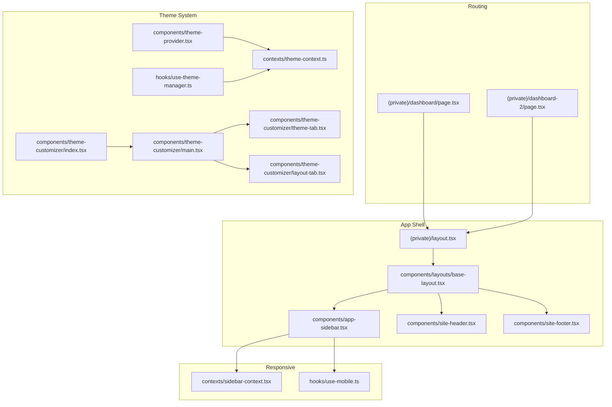

**Diagram sources**
- [layout.tsx](file://src/app/(private)/layout.tsx)
- [base-layout.tsx](file://src/components/layouts/base-layout.tsx)
- [app-sidebar.tsx](file://src/components/app-sidebar.tsx)
- [site-header.tsx](file://src/components/site-header.tsx)
- [site-footer.tsx](file://src/components/site-footer.tsx)
- [dashboard page](file://src/app/(private)/dashboard/page.tsx)
- [dashboard-2 page](file://src/app/(private)/dashboard-2/page.tsx)
- [theme-provider.tsx](file://src/components/theme-provider.tsx)
- [theme-context.ts](file://src/contexts/theme-context.ts)
- [use-theme-manager.ts](file://src/hooks/use-theme-manager.ts)
- [index.tsx](file://src/components/theme-customizer/index.tsx)
- [main.tsx](file://src/components/theme-customizer/main.tsx)
- [theme-tab.tsx](file://src/components/theme-customizer/theme-tab.tsx)
- [layout-tab.tsx](file://src/components/theme-customizer/layout-tab.tsx)
- [sidebar-context.tsx](file://src/contexts/sidebar-context.tsx)
- [use-mobile.ts](file://src/hooks/use-mobile.ts)

**Section sources**
- [layout.tsx](file://src/app/(private)/layout.tsx)
- [base-layout.tsx](file://src/components/layouts/base-layout.tsx)
- [app-sidebar.tsx](file://src/components/app-sidebar.tsx)
- [site-header.tsx](file://src/components/site-header.tsx)
- [site-footer.tsx](file://src/components/site-footer.tsx)
- [dashboard page](file://src/app/(private)/dashboard/page.tsx)
- [dashboard-2 page](file://src/app/(private)/dashboard-2/page.tsx)
- [theme-provider.tsx](file://src/components/theme-provider.tsx)
- [theme-context.ts](file://src/contexts/theme-context.ts)
- [use-theme-manager.ts](file://src/hooks/use-theme-manager.ts)
- [index.tsx](file://src/components/theme-customizer/index.tsx)
- [main.tsx](file://src/components/theme-customizer/main.tsx)
- [theme-tab.tsx](file://src/components/theme-customizer/theme-tab.tsx)
- [layout-tab.tsx](file://src/components/theme-customizer/layout-tab.tsx)
- [sidebar-context.tsx](file://src/contexts/sidebar-context.tsx)
- [use-mobile.ts](file://src/hooks/use-mobile.ts)

## Core Components
- Base Layout: Provides the main shell for private routes, including header, sidebar, content area, and footer. It integrates responsive behaviors and theme context.
- App Sidebar: Central navigation component with collapsible sections, user menu, and responsive drawer behavior on small screens.
- Theme Provider and Context: Supplies global theme state and utilities to toggle between light/dark modes and persist preferences.
- Theme Customizer: A panel to adjust theme tokens and layout options, exposing tabs for appearance and layout configuration.
- Responsive Utilities: A mobile detection hook and a sidebar context to coordinate open/close states across devices.

Key responsibilities:
- Layout composition and consistent spacing.
- Navigation orchestration and active route highlighting.
- Global theme management and persistence.
- Responsive adaptation for mobile-first experiences.

**Section sources**
- [base-layout.tsx](file://src/components/layouts/base-layout.tsx)
- [app-sidebar.tsx](file://src/components/app-sidebar.tsx)
- [theme-provider.tsx](file://src/components/theme-provider.tsx)
- [theme-context.ts](file://src/contexts/theme-context.ts)
- [index.tsx](file://src/components/theme-customizer/index.tsx)
- [main.tsx](file://src/components/theme-customizer/main.tsx)
- [theme-tab.tsx](file://src/components/theme-customizer/theme-tab.tsx)
- [layout-tab.tsx](file://src/components/theme-customizer/layout-tab.tsx)
- [sidebar-context.tsx](file://src/contexts/sidebar-context.tsx)
- [use-mobile.ts](file://src/hooks/use-mobile.ts)

## Architecture Overview
The private layout composes the base layout, which renders the site header, sidebar, main content, and footer. The theme provider wraps the app to supply theme state. The sidebar uses a context to manage its open state and adapts to mobile breakpoints using a hook. Pages under (private) consume this shell automatically.

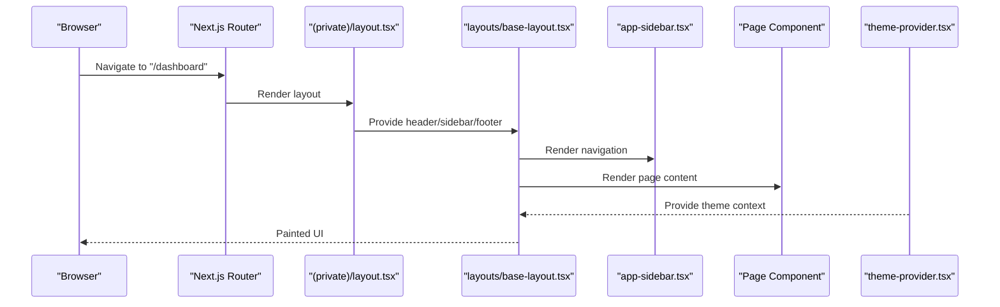

**Diagram sources**
- [layout.tsx](file://src/app/(private)/layout.tsx)
- [base-layout.tsx](file://src/components/layouts/base-layout.tsx)
- [app-sidebar.tsx](file://src/components/app-sidebar.tsx)
- [theme-provider.tsx](file://src/components/theme-provider.tsx)
- [dashboard page](file://src/app/(private)/dashboard/page.tsx)

## Detailed Component Analysis

### Base Layout System
- Purpose: Encapsulates the overall page structure for authenticated areas, ensuring consistent header, sidebar, content region, and footer across all dashboard pages.
- Behavior: Integrates responsive adjustments and theme context; ensures proper semantic HTML and accessible landmarks.
- Composition: Renders header, sidebar, main content slot, and footer.

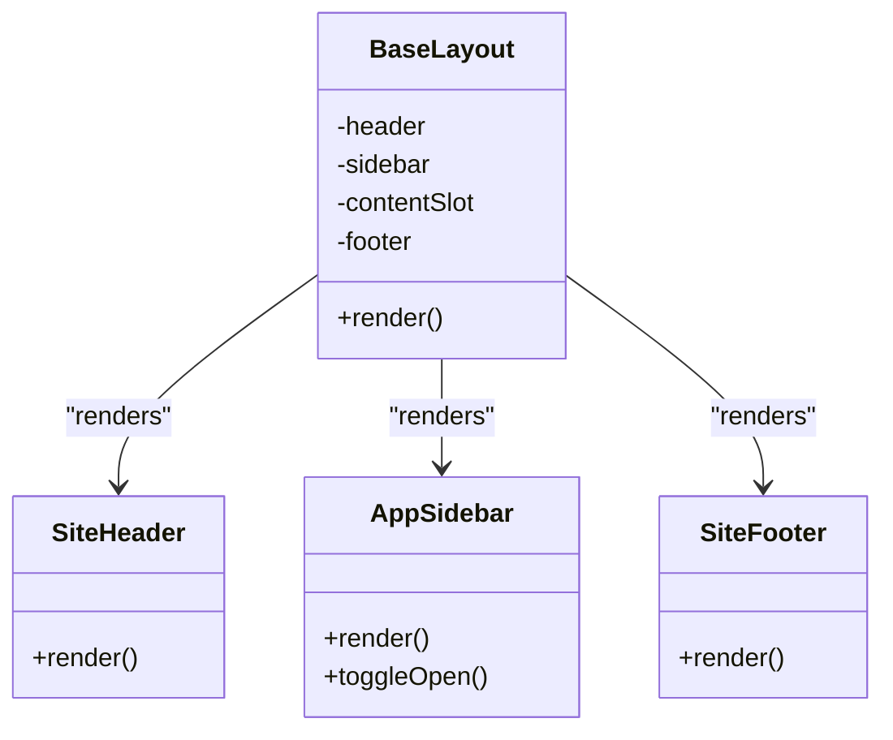

**Diagram sources**
- [base-layout.tsx](file://src/components/layouts/base-layout.tsx)
- [site-header.tsx](file://src/components/site-header.tsx)
- [app-sidebar.tsx](file://src/components/app-sidebar.tsx)
- [site-footer.tsx](file://src/components/site-footer.tsx)

**Section sources**
- [base-layout.tsx](file://src/components/layouts/base-layout.tsx)
- [site-header.tsx](file://src/components/site-header.tsx)
- [site-footer.tsx](file://src/components/site-footer.tsx)

### Sidebar Navigation
- Purpose: Provides primary navigation for dashboards, including grouped links, secondary items, and user controls.
- Responsiveness: Collapses into a drawer on small screens; controlled by a context and mobile breakpoint hook.
- Accessibility: Uses appropriate roles, keyboard navigation, and focus management.

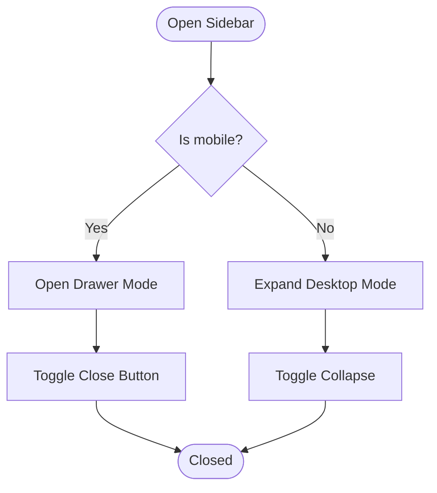

**Diagram sources**
- [app-sidebar.tsx](file://src/components/app-sidebar.tsx)
- [sidebar-context.tsx](file://src/contexts/sidebar-context.tsx)
- [use-mobile.ts](file://src/hooks/use-mobile.ts)

**Section sources**
- [app-sidebar.tsx](file://src/components/app-sidebar.tsx)
- [sidebar-context.tsx](file://src/contexts/sidebar-context.tsx)
- [use-mobile.ts](file://src/hooks/use-mobile.ts)

### Responsive Design Patterns
- Mobile-first approach: Breakpoints and hooks drive layout changes; sidebar switches to overlay mode on small screens.
- Context-driven state: Sidebar open/close state is centralized to avoid prop drilling and ensure consistency.
- Utility hook: Detects viewport size to conditionally render components or apply styles.

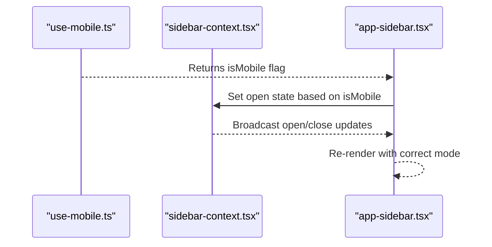

**Diagram sources**
- [use-mobile.ts](file://src/hooks/use-mobile.ts)
- [sidebar-context.tsx](file://src/contexts/sidebar-context.tsx)
- [app-sidebar.tsx](file://src/components/app-sidebar.tsx)

**Section sources**
- [use-mobile.ts](file://src/hooks/use-mobile.ts)
- [sidebar-context.tsx](file://src/contexts/sidebar-context.tsx)
- [app-sidebar.tsx](file://src/components/app-sidebar.tsx)

### Theme Integration
- Provider: Wraps the application to supply theme state and toggling functions.
- Context: Exposes current theme and methods to update it.
- Manager Hook: Centralizes logic for reading/writing theme preferences and applying classes.
- Customizer: Offers UI to adjust theme tokens and layout settings, with tabs for appearance and layout.

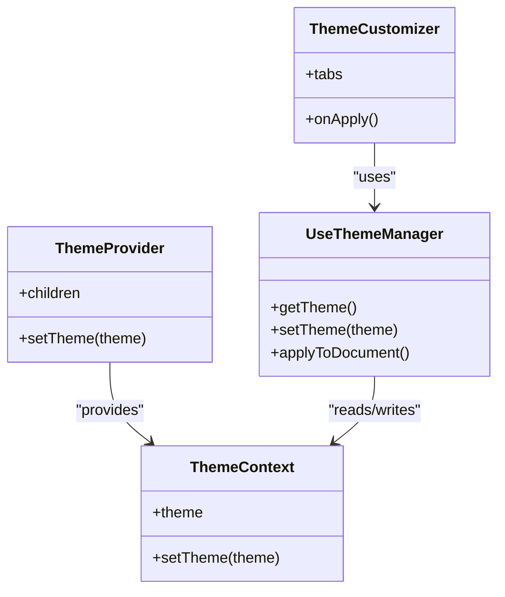

**Diagram sources**
- [theme-provider.tsx](file://src/components/theme-provider.tsx)
- [theme-context.ts](file://src/contexts/theme-context.ts)
- [use-theme-manager.ts](file://src/hooks/use-theme-manager.ts)
- [index.tsx](file://src/components/theme-customizer/index.tsx)
- [main.tsx](file://src/components/theme-customizer/main.tsx)
- [theme-tab.tsx](file://src/components/theme-customizer/theme-tab.tsx)
- [layout-tab.tsx](file://src/components/theme-customizer/layout-tab.tsx)

**Section sources**
- [theme-provider.tsx](file://src/components/theme-provider.tsx)
- [theme-context.ts](file://src/contexts/theme-context.ts)
- [use-theme-manager.ts](file://src/hooks/use-theme-manager.ts)
- [index.tsx](file://src/components/theme-customizer/index.tsx)
- [main.tsx](file://src/components/theme-customizer/main.tsx)
- [theme-tab.tsx](file://src/components/theme-customizer/theme-tab.tsx)
- [layout-tab.tsx](file://src/components/theme-customizer/layout-tab.tsx)

### Routing Structure
- Grouped Routes: (private) group applies shared layout to all dashboard pages.
- Page Examples: Two distinct dashboards demonstrate how pages compose within the shared shell.
- Entry Points: Each page file exports the page component rendered inside the layout.

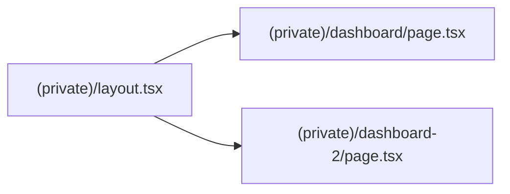

**Diagram sources**
- [layout.tsx](file://src/app/(private)/layout.tsx)
- [dashboard page](file://src/app/(private)/dashboard/page.tsx)
- [dashboard-2 page](file://src/app/(private)/dashboard-2/page.tsx)

**Section sources**
- [layout.tsx](file://src/app/(private)/layout.tsx)
- [dashboard page](file://src/app/(private)/dashboard/page.tsx)
- [dashboard-2 page](file://src/app/(private)/dashboard-2/page.tsx)

### Loading States
- Global Loading: A top-level loading component provides a consistent loading experience during route transitions.
- Usage: Placed at the app root to intercept initial loads and client-side navigations.

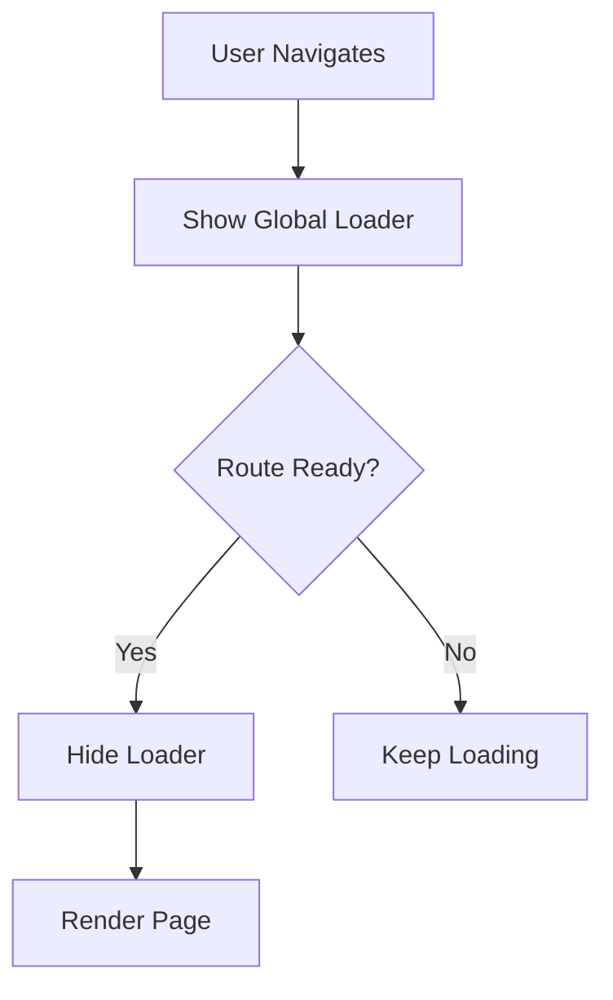

**Diagram sources**
- [loading.tsx](file://src/app/loading.tsx)

**Section sources**
- [loading.tsx](file://src/app/loading.tsx)

### Error Handling
- Dedicated Error Pages: Separate pages for forbidden, internal server error, not found, unauthorized, and under maintenance scenarios.
- Consistent UX: Each error page provides clear messaging and recovery actions.

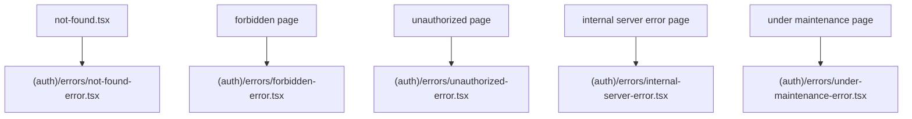

**Diagram sources**
- [not-found.tsx](file://src/app/not-found.tsx)
- [forbidden-error.tsx](file://src/app/(auth)/errors/forbidden/components/forbidden-error.tsx)
- [internal-server-error.tsx](file://src/app/(auth)/errors/internal-server-error/components/internal-server-error.tsx)
- [not-found-error.tsx](file://src/app/(auth)/errors/not-found/components/not-found-error.tsx)
- [unauthorized-error.tsx](file://src/app/(auth)/errors/unauthorized/components/unauthorized-error.tsx)
- [under-maintenance-error.tsx](file://src/app/(auth)/errors/under-maintenance/components/under-maintenance-error.tsx)

**Section sources**
- [not-found.tsx](file://src/app/not-found.tsx)
- [forbidden-error.tsx](file://src/app/(auth)/errors/forbidden/components/forbidden-error.tsx)
- [internal-server-error.tsx](file://src/app/(auth)/errors/internal-server-error/components/internal-server-error.tsx)
- [not-found-error.tsx](file://src/app/(auth)/errors/not-found/components/not-found-error.tsx)
- [unauthorized-error.tsx](file://src/app/(auth)/errors/unauthorized/components/unauthorized-error.tsx)
- [under-maintenance-error.tsx](file://src/app/(auth)/errors/under-maintenance/components/under-maintenance-error.tsx)

### Creating New Dashboard Pages
- Steps:
  - Create a new folder under (private) with a page.tsx.
  - Compose your page content; it will automatically be wrapped by the private layout and base layout.
  - Add navigation entries to the sidebar if needed.
  - Ensure any data fetching is handled within the page or a service layer.

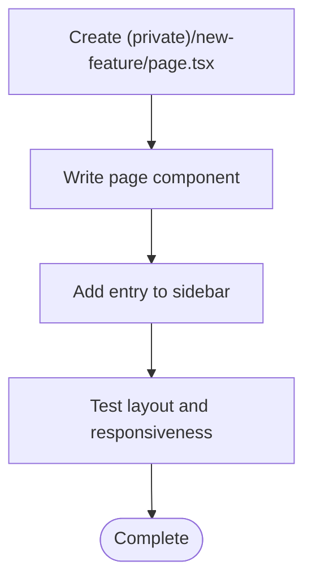

[No sources needed since this section doesn't analyze specific files]

### Implementing Responsive Layouts
- Use the mobile hook to detect screen size and conditionally render components or change layout behavior.
- Leverage the sidebar context to synchronize open/close states across components.
- Apply utility classes and CSS variables from the theme system for consistent spacing and colors.

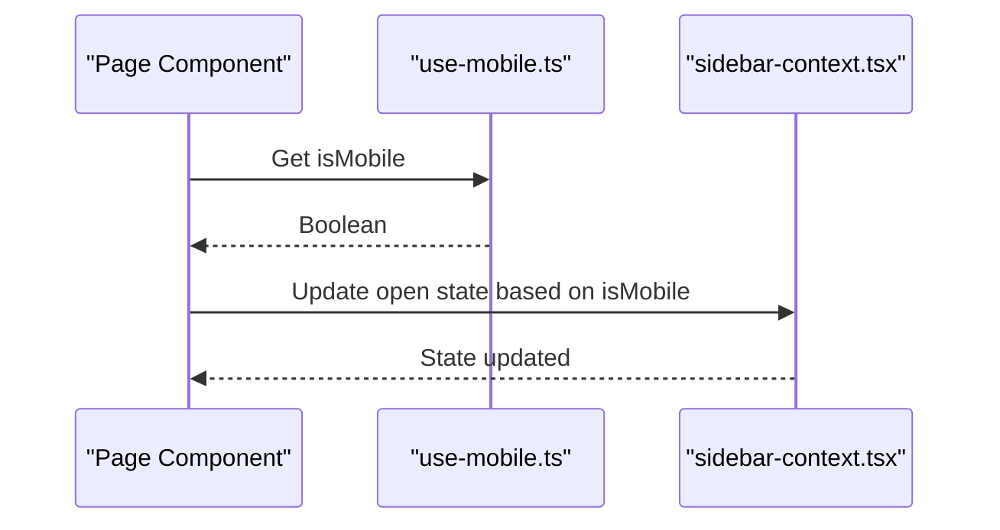

**Diagram sources**
- [use-mobile.ts](file://src/hooks/use-mobile.ts)
- [sidebar-context.tsx](file://src/contexts/sidebar-context.tsx)

**Section sources**
- [use-mobile.ts](file://src/hooks/use-mobile.ts)
- [sidebar-context.tsx](file://src/contexts/sidebar-context.tsx)

### Integrating With the Global Theme System
- Wrap your feature components with the theme provider if they need theme access outside the app root.
- Use the theme manager hook to read and write theme values programmatically.
- For UI controls, integrate the theme customizer tabs to allow users to adjust appearance and layout.

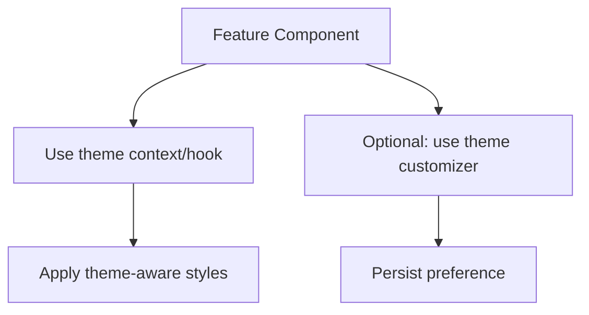

**Diagram sources**
- [theme-provider.tsx](file://src/components/theme-provider.tsx)
- [theme-context.ts](file://src/contexts/theme-context.ts)
- [use-theme-manager.ts](file://src/hooks/use-theme-manager.ts)
- [index.tsx](file://src/components/theme-customizer/index.tsx)
- [main.tsx](file://src/components/theme-customizer/main.tsx)
- [theme-tab.tsx](file://src/components/theme-customizer/theme-tab.tsx)
- [layout-tab.tsx](file://src/components/theme-customizer/layout-tab.tsx)

**Section sources**
- [theme-provider.tsx](file://src/components/theme-provider.tsx)
- [theme-context.ts](file://src/contexts/theme-context.ts)
- [use-theme-manager.ts](file://src/hooks/use-theme-manager.ts)
- [index.tsx](file://src/components/theme-customizer/index.tsx)
- [main.tsx](file://src/components/theme-customizer/main.tsx)
- [theme-tab.tsx](file://src/components/theme-customizer/theme-tab.tsx)
- [layout-tab.tsx](file://src/components/theme-customizer/layout-tab.tsx)

## Dependency Analysis
The following diagram shows key relationships among core infrastructure components.

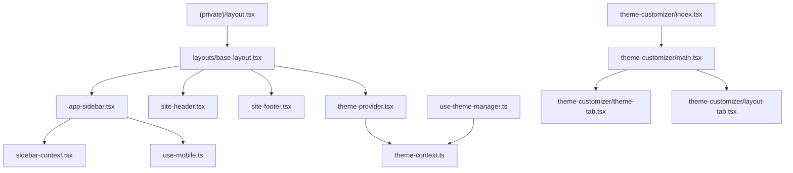

**Diagram sources**
- [layout.tsx](file://src/app/(private)/layout.tsx)
- [base-layout.tsx](file://src/components/layouts/base-layout.tsx)
- [app-sidebar.tsx](file://src/components/app-sidebar.tsx)
- [site-header.tsx](file://src/components/site-header.tsx)
- [site-footer.tsx](file://src/components/site-footer.tsx)
- [sidebar-context.tsx](file://src/contexts/sidebar-context.tsx)
- [use-mobile.ts](file://src/hooks/use-mobile.ts)
- [theme-provider.tsx](file://src/components/theme-provider.tsx)
- [theme-context.ts](file://src/contexts/theme-context.ts)
- [use-theme-manager.ts](file://src/hooks/use-theme-manager.ts)
- [index.tsx](file://src/components/theme-customizer/index.tsx)
- [main.tsx](file://src/components/theme-customizer/main.tsx)
- [theme-tab.tsx](file://src/components/theme-customizer/theme-tab.tsx)
- [layout-tab.tsx](file://src/components/theme-customizer/layout-tab.tsx)

**Section sources**
- [layout.tsx](file://src/app/(private)/layout.tsx)
- [base-layout.tsx](file://src/components/layouts/base-layout.tsx)
- [app-sidebar.tsx](file://src/components/app-sidebar.tsx)
- [site-header.tsx](file://src/components/site-header.tsx)
- [site-footer.tsx](file://src/components/site-footer.tsx)
- [sidebar-context.tsx](file://src/contexts/sidebar-context.tsx)
- [use-mobile.ts](file://src/hooks/use-mobile.ts)
- [theme-provider.tsx](file://src/components/theme-provider.tsx)
- [theme-context.ts](file://src/contexts/theme-context.ts)
- [use-theme-manager.ts](file://src/hooks/use-theme-manager.ts)
- [index.tsx](file://src/components/theme-customizer/index.tsx)
- [main.tsx](file://src/components/theme-customizer/main.tsx)
- [theme-tab.tsx](file://src/components/theme-customizer/theme-tab.tsx)
- [layout-tab.tsx](file://src/components/theme-customizer/layout-tab.tsx)

## Performance Considerations
- Code Splitting: Prefer dynamic imports for heavy components to reduce initial bundle size.
- Memoization: Memoize expensive computations and list rendering where appropriate.
- Image Optimization: Use optimized image components and lazy loading for offscreen images.
- Data Fetching: Coalesce requests and leverage caching strategies to minimize network overhead.
- CSS Variables: Rely on CSS variables for theme switching to avoid full re-renders when possible.
- Avoid Unnecessary Re-renders: Keep context consumers minimal and split contexts by concern.

[No sources needed since this section provides general guidance]

## Troubleshooting Guide
- Sidebar Not Closing on Mobile: Verify the mobile hook returns expected values and that the sidebar context is properly subscribed.
- Theme Not Persisting: Ensure the theme manager writes to storage and applies classes on mount.
- Layout Misalignment: Check that the base layout renders all slots and that CSS variables are applied globally.
- Error Pages Not Showing: Confirm route groups and error page paths match Next.js conventions.

**Section sources**
- [use-mobile.ts](file://src/hooks/use-mobile.ts)
- [sidebar-context.tsx](file://src/contexts/sidebar-context.tsx)
- [use-theme-manager.ts](file://src/hooks/use-theme-manager.ts)
- [base-layout.tsx](file://src/components/layouts/base-layout.tsx)
- [globals.css](file://src/app/globals.css)
- [not-found.tsx](file://src/app/not-found.tsx)
- [forbidden-error.tsx](file://src/app/(auth)/errors/forbidden/components/forbidden-error.tsx)
- [internal-server-error.tsx](file://src/app/(auth)/errors/internal-server-error/components/internal-server-error.tsx)
- [not-found-error.tsx](file://src/app/(auth)/errors/not-found/components/not-found-error.tsx)
- [unauthorized-error.tsx](file://src/app/(auth)/errors/unauthorized/components/unauthorized-error.tsx)
- [under-maintenance-error.tsx](file://src/app/(auth)/errors/under-maintenance/components/under-maintenance-error.tsx)

## Conclusion
The shared dashboard infrastructure provides a robust foundation for building multiple dashboards with consistent layout, navigation, theming, and responsive behavior. By leveraging the base layout, sidebar context, theme provider, and customizer, teams can rapidly develop new features while maintaining high standards for accessibility, performance, and cross-browser compatibility.

[No sources needed since this section summarizes without analyzing specific files]

## Appendices

### Accessibility Compliance
- Semantic HTML: Use proper landmarks and headings in layouts and pages.
- Keyboard Navigation: Ensure sidebar items and controls are reachable via keyboard.
- Focus Management: Manage focus when opening/closing drawers and dialogs.
- Color Contrast: Validate theme presets meet contrast requirements.
- Screen Readers: Provide descriptive labels and aria attributes for interactive elements.

[No sources needed since this section provides general guidance]

### Mobile-First Design Patterns
- Start with mobile layouts and progressively enhance for larger screens.
- Use the mobile hook to adapt interactions like sidebar behavior.
- Prefer touch-friendly targets and gestures.

[No sources needed since this section provides general guidance]

### Cross-Browser Compatibility
- Test theme switching and CSS variable support across browsers.
- Validate responsive breakpoints and flex/grid behavior.
- Ensure polyfills or fallbacks are in place for older environments if required.

[No sources needed since this section provides general guidance]