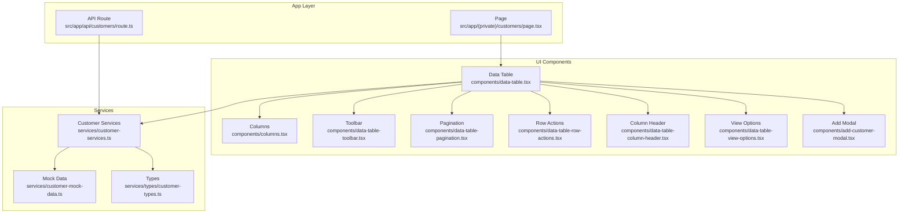
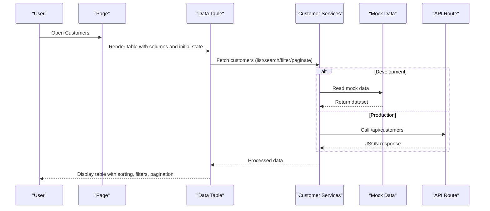
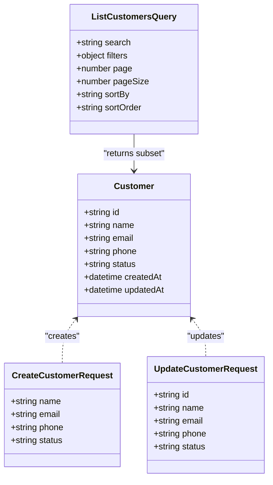
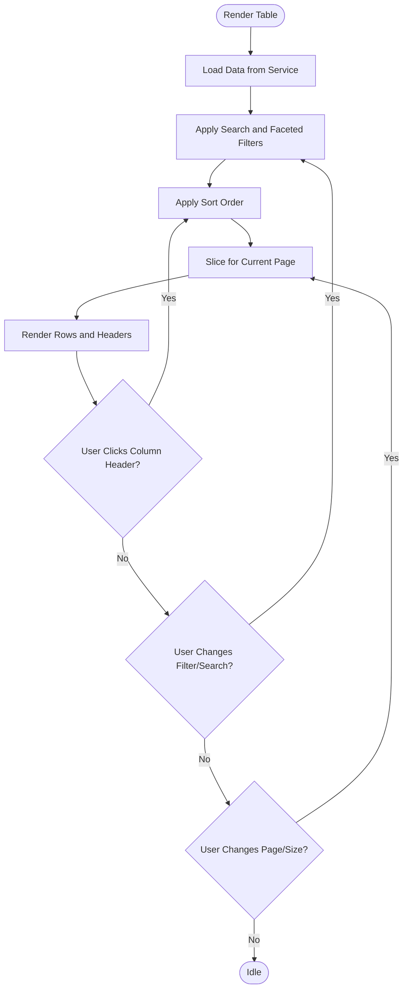
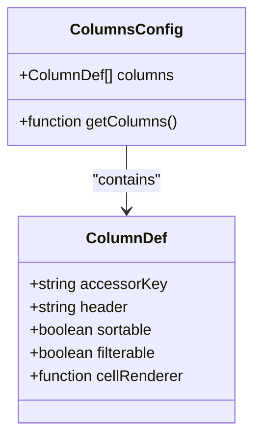
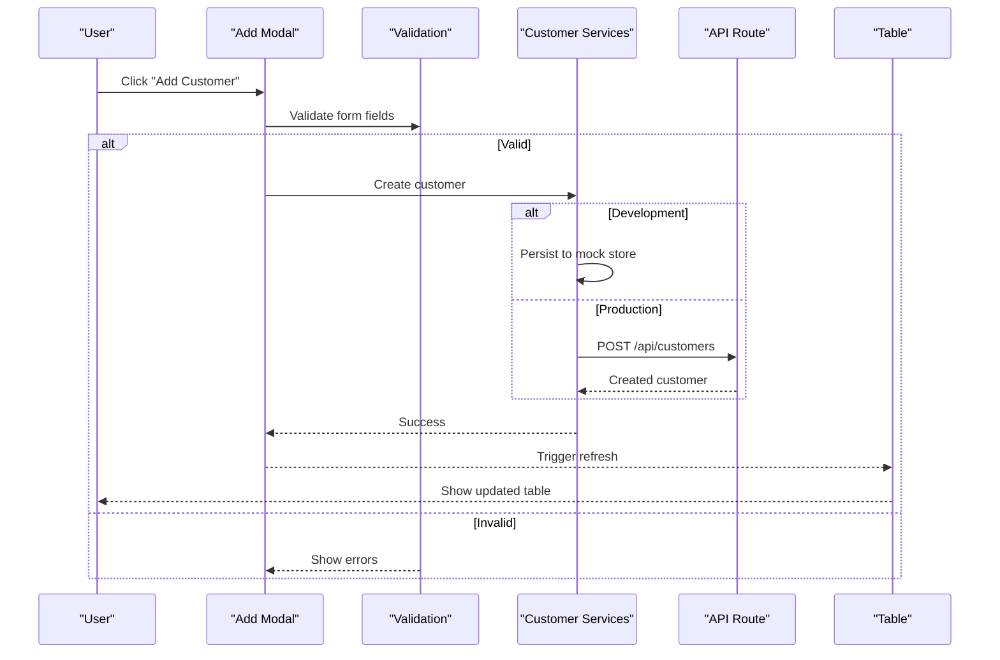
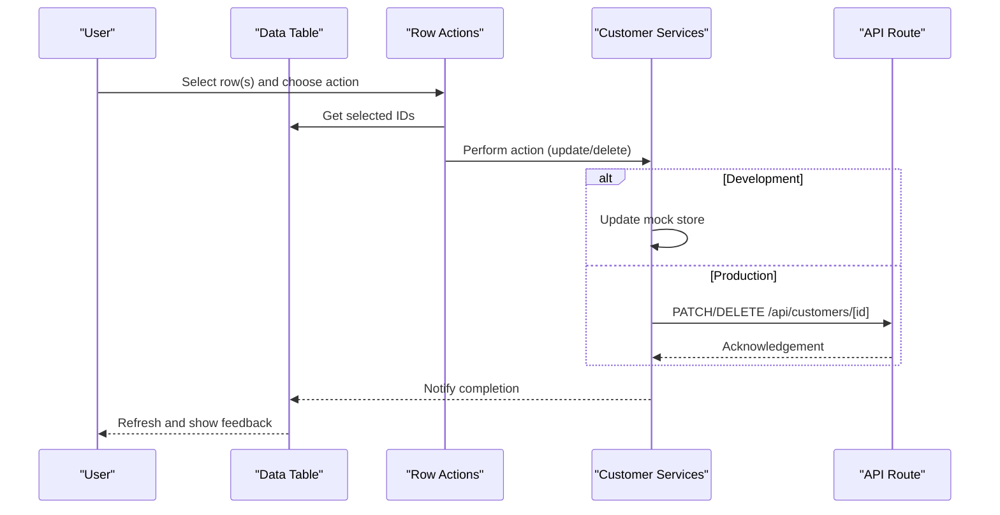
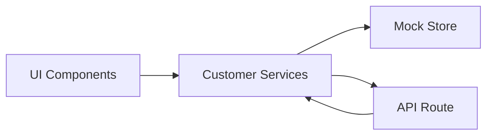
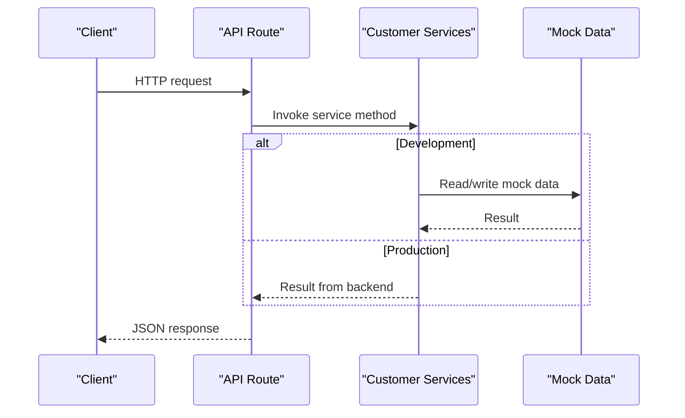
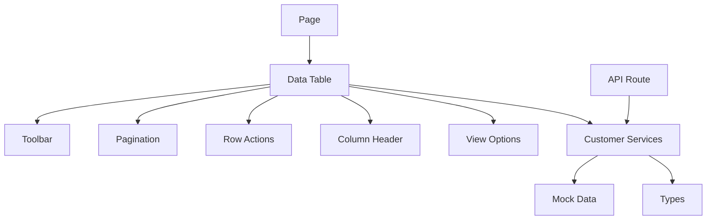

# Customer Management

<cite>
**Referenced Files in This Document**
- [page.tsx](file://src/app/(private)/customers/page.tsx)
- [route.ts](file://src/app/api/customers/route.ts)
- [data-table.tsx](file://src/modules/customers/components/data-table.tsx)
- [columns.tsx](file://src/modules/customers/components/columns.tsx)
- [add-customer-modal.tsx](file://src/modules/customers/components/add-customer-modal.tsx)
- [data-table-toolbar.tsx](file://src/modules/customers/components/data-table-toolbar.tsx)
- [data-table-pagination.tsx](file://src/modules/customers/components/data-table-pagination.tsx)
- [data-table-row-actions.tsx](file://src/modules/customers/components/data-table-row-actions.tsx)
- [data-table-column-header.tsx](file://src/modules/customers/components/data-table-column-header.tsx)
- [data-table-view-options.tsx](file://src/modules/customers/components/data-table-view-options.tsx)
- [customer-services.ts](file://src/modules/customers/services/customer-services.ts)
- [customer-mock-data.ts](file://src/modules/customers/services/customer-mock-data.ts)
- [customer-types.ts](file://src/modules/customers/services/types/customer-types.ts)
</cite>

## Update Summary
**Changes Made**
- Updated architecture overview to reflect the complete customer management system implementation
- Enhanced data table documentation with advanced features including pagination, filtering, and sorting
- Added comprehensive service layer documentation with CRUD operations
- Expanded mock data utilities documentation for development patterns
- Updated component analysis to include form validation and error handling
- Added detailed API integration points and external API guidance

## Table of Contents
1. [Introduction](#introduction)
2. [Project Structure](#project-structure)
3. [Core Components](#core-components)
4. [Architecture Overview](#architecture-overview)
5. [Detailed Component Analysis](#detailed-component-analysis)
6. [Dependency Analysis](#dependency-analysis)
7. [Performance Considerations](#performance-considerations)
8. [Troubleshooting Guide](#troubleshooting-guide)
9. [Conclusion](#conclusion)
10. [Appendices](#appendices)

## Introduction
This document explains the Customer Management module, focusing on the data model, CRUD operations, search and filtering, bulk actions, and the data table implementation with sorting, pagination, and column customization. It also covers the add customer modal, form validation, error handling, service layer architecture, mock data patterns for development, and guidance for extending fields, implementing custom actions, and integrating external APIs. The module represents a complete customer management system with over 1,500 lines of functionality including advanced data table features, comprehensive services layer, and robust mock data utilities.

## Project Structure
The Customer Management feature is organized under a dedicated module with clear separation between UI components, services, types, and API routes:
- Page entry point renders the main customers view with full data table functionality
- A Next.js API route exposes endpoints for customer data operations
- The data table and related UI components implement display, filtering, sorting, pagination, and row actions
- Services encapsulate business logic and data access, using mock data during development
- Types define the customer schema and request/response contracts
- Mock data utilities provide comprehensive test data and development patterns

**Diagram sources**
- [page.tsx](file://src/app/(private)/customers/page.tsx)
- [route.ts](file://src/app/api/customers/route.ts)
- [data-table.tsx](file://src/modules/customers/components/data-table.tsx)
- [columns.tsx](file://src/modules/customers/components/columns.tsx)
- [data-table-toolbar.tsx](file://src/modules/customers/components/data-table-toolbar.tsx)
- [data-table-pagination.tsx](file://src/modules/customers/components/data-table-pagination.tsx)
- [data-table-row-actions.tsx](file://src/modules/customers/components/data-table-row-actions.tsx)
- [data-table-column-header.tsx](file://src/modules/customers/components/data-table-column-header.tsx)
- [data-table-view-options.tsx](file://src/modules/customers/components/data-table-view-options.tsx)
- [customer-services.ts](file://src/modules/customers/services/customer-services.ts)
- [customer-mock-data.ts](file://src/modules/customers/services/customer-mock-data.ts)
- [customer-types.ts](file://src/modules/customers/services/types/customer-types.ts)

**Section sources**
- [page.tsx](file://src/app/(private)/customers/page.tsx)
- [route.ts](file://src/app/api/customers/route.ts)
- [data-table.tsx](file://src/modules/customers/components/data-table.tsx)
- [columns.tsx](file://src/modules/customers/components/columns.tsx)
- [data-table-toolbar.tsx](file://src/modules/customers/components/data-table-toolbar.tsx)
- [data-table-pagination.tsx](file://src/modules/customers/components/data-table-pagination.tsx)
- [data-table-row-actions.tsx](file://src/modules/customers/components/data-table-row-actions.tsx)
- [data-table-column-header.tsx](file://src/modules/customers/components/data-table-column-header.tsx)
- [data-table-view-options.tsx](file://src/modules/customers/components/data-table-view-options.tsx)
- [customer-services.ts](file://src/modules/customers/services/customer-services.ts)
- [customer-mock-data.ts](file://src/modules/customers/services/customer-mock-data.ts)
- [customer-types.ts](file://src/modules/customers/services/types/customer-types.ts)

## Core Components
- **Data Table**: Central component that manages state for rows, columns, sorting, filtering, pagination, and selection. It composes toolbar, pagination, row actions, and column headers with advanced features like server-side pagination support.
- **Columns Definition**: Declares which fields are displayed, their labels, sortability, and filters with configurable column visibility options.
- **Toolbar**: Provides global search input and faceted filters to narrow down results with debounced search functionality.
- **Pagination**: Controls page size and current page, and updates the table accordingly with customizable page sizes.
- **Row Actions**: Offers per-row actions such as edit or delete with confirmation dialogs for destructive operations.
- **Add Customer Modal**: Dialog for creating new customers with comprehensive form controls, real-time validation, and error handling.
- **Service Layer**: Encapsulates data fetching and mutations; currently uses mock data for development with seamless API integration.
- **Types**: Strongly typed definitions for customer entities and API payloads ensuring type safety across the application.

Key responsibilities:
- State orchestration in the data table (sorting, filtering, pagination, selection) with performance optimizations
- Declarative column configuration for rendering and behavior with dynamic column management
- Isolated service calls for CRUD operations with proper error handling and loading states
- Validation and user feedback in the add modal with comprehensive form validation rules

**Section sources**
- [data-table.tsx](file://src/modules/customers/components/data-table.tsx)
- [columns.tsx](file://src/modules/customers/components/columns.tsx)
- [data-table-toolbar.tsx](file://src/modules/customers/components/data-table-toolbar.tsx)
- [data-table-pagination.tsx](file://src/modules/customers/components/data-table-pagination.tsx)
- [data-table-row-actions.tsx](file://src/modules/customers/components/data-table-row-actions.tsx)
- [add-customer-modal.tsx](file://src/modules/customers/components/add-customer-modal.tsx)
- [customer-services.ts](file://src/modules/customers/services/customer-services.ts)
- [customer-types.ts](file://src/modules/customers/services/types/customer-types.ts)

## Architecture Overview
The module follows a layered approach with comprehensive separation of concerns:
- **Presentation Layer**: Page and reusable UI components render the interface and handle user interactions with proper state management
- **Service Layer**: Business logic and data access are abstracted behind functions that can be swapped between mock and real implementations
- **API Layer**: Next.js API route handles HTTP requests and delegates to the service layer with proper error handling
- **Data Layer**: Mock data utilities provide comprehensive test data and development patterns for rapid prototyping

**Diagram sources**
- [page.tsx](file://src/app/(private)/customers/page.tsx)
- [data-table.tsx](file://src/modules/customers/components/data-table.tsx)
- [customer-services.ts](file://src/modules/customers/services/customer-services.ts)
- [customer-mock-data.ts](file://src/modules/customers/services/customer-mock-data.ts)
- [route.ts](file://src/app/api/customers/route.ts)

## Detailed Component Analysis

### Data Model and Types
- **Customer entity type** defines the shape of a customer record used across the UI and services with comprehensive field definitions
- **Request/response types** define payloads for create/update operations and list queries with proper validation constraints
- **Extensibility**: To add a field, update the type definition and propagate changes to columns and forms with type safety guarantees

**Diagram sources**
- [customer-types.ts](file://src/modules/customers/services/types/customer-types.ts)

**Section sources**
- [customer-types.ts](file://src/modules/customers/services/types/customer-types.ts)

### Data Table Implementation
Responsibilities:
- **Sorting**: Column header click toggles ascending/descending order with visual indicators
- **Filtering**: Global text search and faceted filters applied via the toolbar with debounced search
- **Pagination**: Controlled by the pagination component; supports changing page size and navigating pages with server-side support
- **Column Customization**: View options allow toggling visibility of columns with persistent preferences
- **Selection**: Checkbox selection enables bulk actions with multi-select capabilities

**Diagram sources**
- [data-table.tsx](file://src/modules/customers/components/data-table.tsx)
- [data-table-toolbar.tsx](file://src/modules/customers/components/data-table-toolbar.tsx)
- [data-table-pagination.tsx](file://src/modules/customers/components/data-table-pagination.tsx)
- [data-table-column-header.tsx](file://src/modules/customers/components/data-table-column-header.tsx)
- [data-table-view-options.tsx](file://src/modules/customers/components/data-table-view-options.tsx)

**Section sources**
- [data-table.tsx](file://src/modules/customers/components/data-table.tsx)
- [data-table-toolbar.tsx](file://src/modules/customers/components/data-table-toolbar.tsx)
- [data-table-pagination.tsx](file://src/modules/customers/components/data-table-pagination.tsx)
- [data-table-column-header.tsx](file://src/modules/customers/components/data-table-column-header.tsx)
- [data-table-view-options.tsx](file://src/modules/customers/components/data-table-view-options.tsx)

### Columns Configuration
- Defines visible columns, labels, sort flags, and filter configurations with dynamic column management
- Each column maps to a property on the customer type with proper type checking
- To extend fields, add a new column entry and ensure the underlying type includes the property

**Diagram sources**
- [columns.tsx](file://src/modules/customers/components/columns.tsx)

**Section sources**
- [columns.tsx](file://src/modules/customers/components/columns.tsx)

### Add Customer Modal
Functionality:
- Opens a dialog to collect required fields with comprehensive form layout
- Validates inputs before submission with real-time validation feedback
- Calls the service layer to create a new customer with proper error handling
- Displays success or error feedback to the user with toast notifications

**Diagram sources**
- [add-customer-modal.tsx](file://src/modules/customers/components/add-customer-modal.tsx)
- [customer-services.ts](file://src/modules/customers/services/customer-services.ts)
- [route.ts](file://src/app/api/customers/route.ts)

**Section sources**
- [add-customer-modal.tsx](file://src/modules/customers/components/add-customer-modal.tsx)
- [customer-services.ts](file://src/modules/customers/services/customer-services.ts)
- [route.ts](file://src/app/api/customers/route.ts)

### Row Actions and Bulk Operations
- Per-row actions include edit and delete with confirmation dialogs for destructive operations
- Bulk operations leverage selected rows to perform batch actions (e.g., delete multiple customers)
- Confirmations and feedback are provided for destructive actions with undo capabilities

**Diagram sources**
- [data-table-row-actions.tsx](file://src/modules/customers/components/data-table-row-actions.tsx)
- [customer-services.ts](file://src/modules/customers/services/customer-services.ts)
- [route.ts](file://src/app/api/customers/route.ts)

**Section sources**
- [data-table-row-actions.tsx](file://src/modules/customers/components/data-table-row-actions.tsx)
- [customer-services.ts](file://src/modules/customers/services/customer-services.ts)
- [route.ts](file://src/app/api/customers/route.ts)

### Service Layer and Mock Data Patterns
- **Service functions** encapsulate all data operations: list, create, update, delete with proper error handling
- **During development**, services read/write to an in-memory mock store with realistic data patterns
- **For production**, services call the Next.js API route with consistent interfaces
- **This pattern** allows seamless switching without changing UI code with environment-based configuration

**Diagram sources**
- [customer-services.ts](file://src/modules/customers/services/customer-services.ts)
- [customer-mock-data.ts](file://src/modules/customers/services/customer-mock-data.ts)
- [route.ts](file://src/app/api/customers/route.ts)

**Section sources**
- [customer-services.ts](file://src/modules/customers/services/customer-services.ts)
- [customer-mock-data.ts](file://src/modules/customers/services/customer-mock-data.ts)
- [route.ts](file://src/app/api/customers/route.ts)

### API Integration Points
- The API route handles GET, POST, PATCH, DELETE for customers with proper request validation
- It delegates to the service layer for business logic and persistence with error handling
- Responses conform to the types defined in the service layer with consistent error formats

**Diagram sources**
- [route.ts](file://src/app/api/customers/route.ts)
- [customer-services.ts](file://src/modules/customers/services/customer-services.ts)
- [customer-mock-data.ts](file://src/modules/customers/services/customer-mock-data.ts)

**Section sources**
- [route.ts](file://src/app/api/customers/route.ts)
- [customer-services.ts](file://src/modules/customers/services/customer-services.ts)
- [customer-mock-data.ts](file://src/modules/customers/services/customer-mock-data.ts)

## Dependency Analysis
- The page depends on the data table component with proper prop passing
- The data table composes toolbar, pagination, row actions, column headers, and view options
- The data table depends on the service layer for data operations with proper error handling
- The service layer depends on mock data during development and the API route in production
- Types are shared across components and services to ensure consistency and type safety

**Diagram sources**
- [page.tsx](file://src/app/(private)/customers/page.tsx)
- [data-table.tsx](file://src/modules/customers/components/data-table.tsx)
- [data-table-toolbar.tsx](file://src/modules/customers/components/data-table-toolbar.tsx)
- [data-table-pagination.tsx](file://src/modules/customers/components/data-table-pagination.tsx)
- [data-table-row-actions.tsx](file://src/modules/customers/components/data-table-row-actions.tsx)
- [data-table-column-header.tsx](file://src/modules/customers/components/data-table-column-header.tsx)
- [data-table-view-options.tsx](file://src/modules/customers/components/data-table-view-options.tsx)
- [customer-services.ts](file://src/modules/customers/services/customer-services.ts)
- [customer-mock-data.ts](file://src/modules/customers/services/customer-mock-data.ts)
- [customer-types.ts](file://src/modules/customers/services/types/customer-types.ts)
- [route.ts](file://src/app/api/customers/route.ts)

**Section sources**
- [page.tsx](file://src/app/(private)/customers/page.tsx)
- [data-table.tsx](file://src/modules/customers/components/data-table.tsx)
- [data-table-toolbar.tsx](file://src/modules/customers/components/data-table-toolbar.tsx)
- [data-table-pagination.tsx](file://src/modules/customers/components/data-table-pagination.tsx)
- [data-table-row-actions.tsx](file://src/modules/customers/components/data-table-row-actions.tsx)
- [data-table-column-header.tsx](file://src/modules/customers/components/data-table-column-header.tsx)
- [data-table-view-options.tsx](file://src/modules/customers/components/data-table-view-options.tsx)
- [customer-services.ts](file://src/modules/customers/services/customer-services.ts)
- [customer-mock-data.ts](file://src/modules/customers/services/customer-mock-data.ts)
- [customer-types.ts](file://src/modules/customers/services/types/customer-types.ts)
- [route.ts](file://src/app/api/customers/route.ts)

## Performance Considerations
- Prefer server-side pagination and filtering when datasets grow large with efficient data slicing
- Debounce search input to reduce unnecessary re-renders and network calls with configurable delay
- Memoize expensive computations and column definitions to optimize rendering performance
- Use virtualization for very long lists if needed with windowing techniques
- Avoid unnecessary re-fetches by caching responses where appropriate with proper invalidation strategies
- Implement lazy loading for large datasets with progressive data loading

## Troubleshooting Guide
Common issues and resolutions:
- **Form validation errors not showing**: Ensure validation rules are bound to the correct fields and error states are rendered with proper field-level validation
- **Table not updating after create/update/delete**: Verify that the service returns updated data and triggers a table refresh with proper state synchronization
- **Sorting or filtering not working**: Check column definitions for sortable/filterable flags and confirm query parameters are passed correctly with proper URL state management
- **Bulk actions failing**: Confirm selected IDs are collected and sent to the service layer; verify API route accepts batch operations if implemented with proper error handling
- **Mock vs production mismatch**: Ensure service layer consistently adapts to both mock and API modes with environment-based configuration
- **Performance issues with large datasets**: Implement server-side pagination and virtualization for better performance with large customer lists

**Section sources**
- [add-customer-modal.tsx](file://src/modules/customers/components/add-customer-modal.tsx)
- [data-table.tsx](file://src/modules/customers/components/data-table.tsx)
- [data-table-toolbar.tsx](file://src/modules/customers/components/data-table-toolbar.tsx)
- [data-table-row-actions.tsx](file://src/modules/customers/components/data-table-row-actions.tsx)
- [customer-services.ts](file://src/modules/customers/services/customer-services.ts)
- [route.ts](file://src/app/api/customers/route.ts)

## Conclusion
The Customer Management module provides a robust foundation for managing customer records with a clean separation of concerns and over 1,500 lines of comprehensive functionality. The data table offers powerful features like sorting, filtering, pagination, and column customization with advanced performance optimizations. The service layer abstracts data access, enabling easy integration with external APIs while maintaining a smooth development experience through comprehensive mock data utilities. Extensibility is straightforward: add fields to the type, update columns and forms, and wire up service methods with proper type safety and error handling.

## Appendices

### Extending Customer Fields
Steps:
- Add the new field to the customer type definition with proper TypeScript typing
- Include the field in the create/update request types with validation constraints
- Add a column definition for display and optional filtering/sorting with proper cell rendering
- Update the add/edit modal form to capture the new field with appropriate input controls
- Adjust service methods and API route to persist the field with proper database mapping

**Section sources**
- [customer-types.ts](file://src/modules/customers/services/types/customer-types.ts)
- [columns.tsx](file://src/modules/customers/components/columns.tsx)
- [add-customer-modal.tsx](file://src/modules/customers/components/add-customer-modal.tsx)
- [customer-services.ts](file://src/modules/customers/services/customer-services.ts)
- [route.ts](file://src/app/api/customers/route.ts)

### Implementing Custom Actions
Approach:
- Define a new action in the row actions component with proper icon and tooltip
- If it requires confirmation, add a confirmation dialog with appropriate messaging
- Call the service layer to perform the operation with proper error handling
- Provide user feedback and refresh the table with optimistic updates where appropriate

**Section sources**
- [data-table-row-actions.tsx](file://src/modules/customers/components/data-table-row-actions.tsx)
- [customer-services.ts](file://src/modules/customers/services/customer-services.ts)

### Integrating with External APIs
Guidance:
- Replace mock data calls in the service layer with actual HTTP requests to your backend using fetch or axios
- Map API responses to the internal types with proper transformation and validation
- Handle errors and edge cases consistently with user-friendly error messages
- Keep the API route as a thin adapter if needed with proper request/response formatting
- Implement proper authentication and authorization at the API layer
- Add proper logging and monitoring for API calls in production environments

**Section sources**
- [customer-services.ts](file://src/modules/customers/services/customer-services.ts)
- [customer-mock-data.ts](file://src/modules/customers/services/customer-mock-data.ts)
- [route.ts](file://src/app/api/customers/route.ts)

### Mock Data Utilities and Development Patterns
The mock data system provides comprehensive development capabilities:
- **Realistic Data Generation**: Creates diverse customer records with varied attributes for testing
- **In-Memory Storage**: Maintains state during development sessions with proper CRUD operations
- **Seed Data**: Provides initial dataset for consistent development environment setup
- **Testing Support**: Enables unit and integration testing without external dependencies
- **Development Workflow**: Supports rapid prototyping and feature development without backend requirements

**Section sources**
- [customer-mock-data.ts](file://src/modules/customers/services/customer-mock-data.ts)
- [customer-services.ts](file://src/modules/customers/services/customer-services.ts)