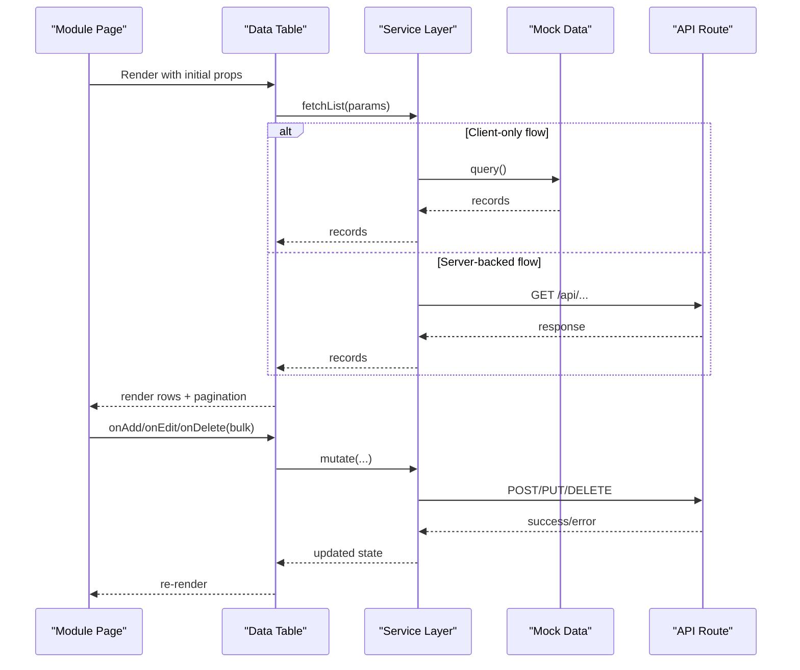
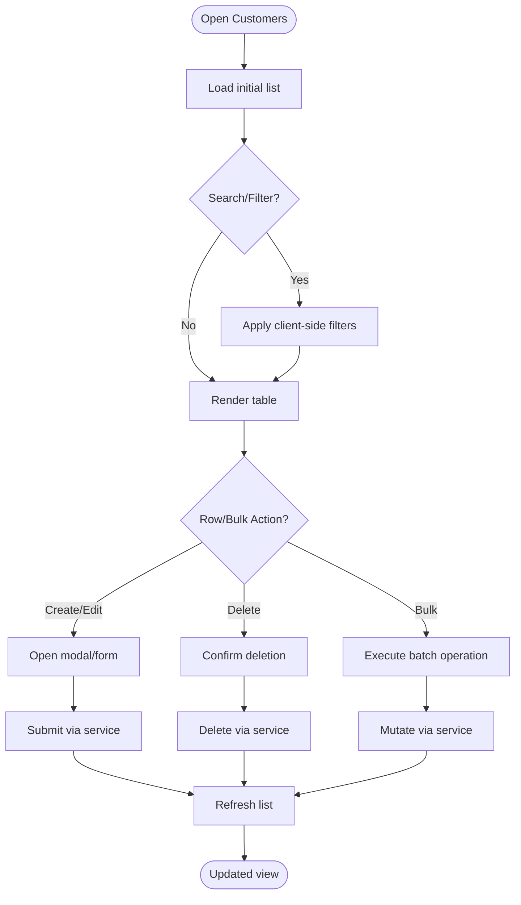
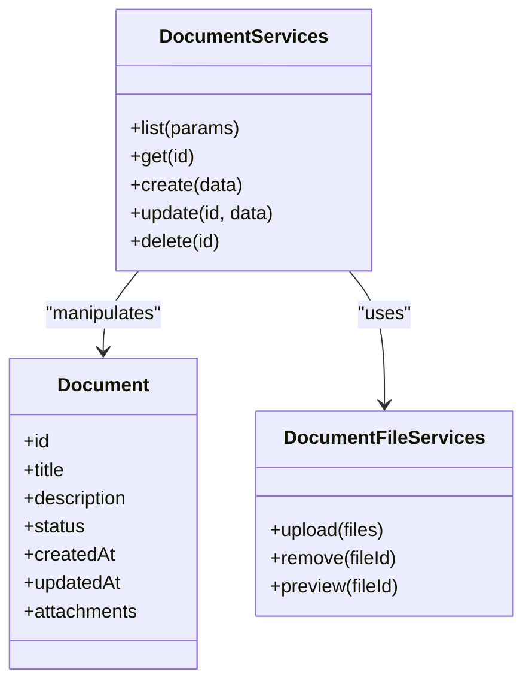
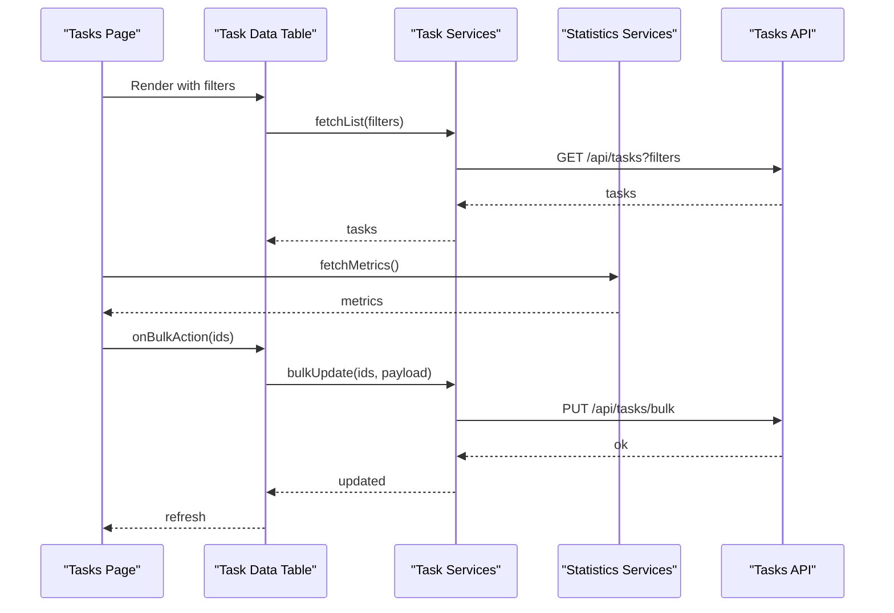
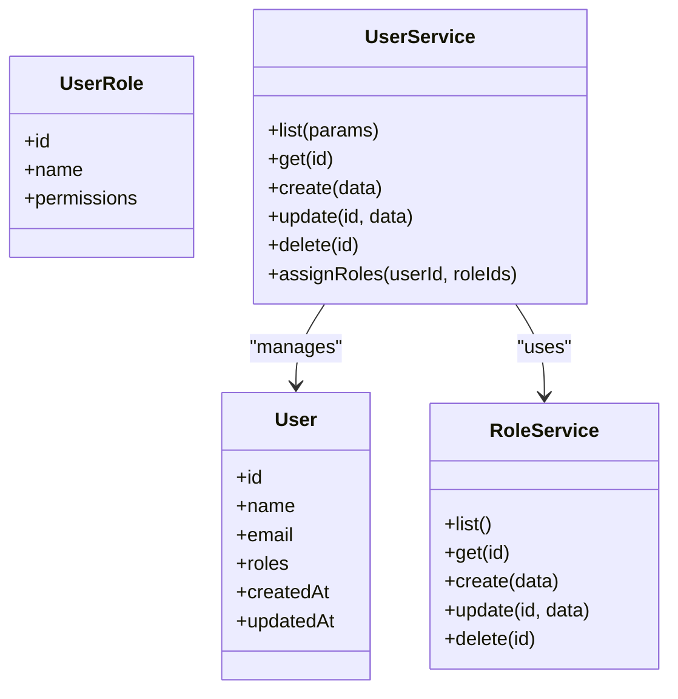
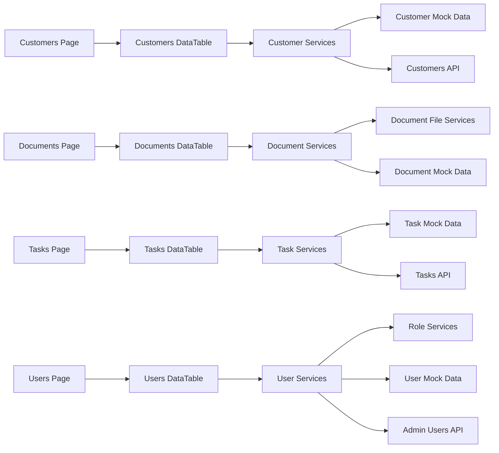

# Data Management Modules

<cite>
**Referenced Files in This Document**
- [customers/page.tsx](file://src/app/(private)/customers/page.tsx)
- [documents/page.tsx](file://src/app/(private)/documents/page.tsx)
- [tasks/page.tsx](file://src/app/(private)/tasks/page.tsx)
- [admin/users/page.tsx](file://src/app/(private)/admin/users/page.tsx)
- [api/customers/route.ts](file://src/app/api/customers/route.ts)
- [api/tasks/route.ts](file://src/app/api/tasks/route.ts)
- [api/admin/users/route.ts](file://src/app/api/admin/users/route.ts)
- [api/admin/users/[uid]/route.ts](file://src/app/api/admin/users/[uid]/route.ts)
- [modules/customers/components/data-table.tsx](file://src/modules/customers/components/data-table.tsx)
- [modules/customers/components/data-table-toolbar.tsx](file://src/modules/customers/components/data-table-toolbar.tsx)
- [modules/customers/components/data-table-pagination.tsx](file://src/modules/customers/components/data-table-pagination.tsx)
- [modules/customers/components/data-table-row-actions.tsx](file://src/modules/customers/components/data-table-row-actions.tsx)
- [modules/customers/components/add-customer-modal.tsx](file://src/modules/customers/components/add-customer-modal.tsx)
- [modules/customers/services/customer-services.ts](file://src/modules/customers/services/customer-services.ts)
- [modules/customers/services/customer-mock-data.ts](file://src/modules/customers/services/customer-mock-data.ts)
- [modules/customers/services/types/customer-types.ts](file://src/modules/customers/services/types/customer-types.ts)
- [modules/documents/components/data-table.tsx](file://src/modules/documents/components/data-table.tsx)
- [modules/documents/components/data-table-toolbar.tsx](file://src/modules/documents/components/data-table-toolbar.tsx)
- [modules/documents/components/data-table-pagination.tsx](file://src/modules/documents/components/data-table-pagination.tsx)
- [modules/documents/components/data-table-row-actions.tsx](file://src/modules/documents/components/data-table-row-actions.tsx)
- [modules/documents/components/add-document-modal.tsx](file://src/modules/documents/components/add-document-modal.tsx)
- [modules/documents/components/document-attachments.tsx](file://src/modules/documents/components/document-attachments.tsx)
- [modules/documents/components/upload-files-dialog.tsx](file://src/modules/documents/components/upload-files-dialog.tsx)
- [modules/documents/services/document-services.ts](file://src/modules/documents/services/document-services.ts)
- [modules/documents/services/document-file-services.ts](file://src/modules/documents/services/document-file-services.ts)
- [modules/documents/services/document-mock-data.ts](file://src/modules/documents/services/document-mock-data.ts)
- [modules/documents/services/types/document-types.ts](file://src/modules/documents/services/types/document-types.ts)
- [modules/tasks/components/data-table.tsx](file://src/modules/tasks/components/data-table.tsx)
- [modules/tasks/components/data-table-toolbar.tsx](file://src/modules/tasks/components/data-table-toolbar.tsx)
- [modules/tasks/components/data-table-faceted-filter.tsx](file://src/modules/tasks/components/data-table-faceted-filter.tsx)
- [modules/tasks/components/data-table-pagination.tsx](file://src/modules/tasks/components/data-table-pagination.tsx)
- [modules/tasks/components/data-table-row-actions.tsx](file://src/modules/tasks/components/data-table-row-actions.tsx)
- [modules/tasks/components/add-task-modal.tsx](file://src/modules/tasks/components/add-task-modal.tsx)
- [modules/tasks/services/task-services.ts](file://src/modules/tasks/services/task-services.ts)
- [modules/tasks/services/task-mock-data.ts](file://src/modules/tasks/services/task-mock-data.ts)
- [modules/tasks/services/task-chart-services.ts](file://src/modules/tasks/services/task-chart-services.ts)
- [modules/tasks/services/task-statistics-services.ts](file://src/modules/tasks/services/task-statistics-services.ts)
- [modules/tasks/services/types/task-types.ts](file://src/modules/tasks/services/types/task-types.ts)
- [modules/users/components/user-data-table.tsx](file://src/modules/users/components/user-data-table.tsx)
- [modules/users/components/user-data-table-toolbar.tsx](file://src/modules/users/components/user-data-table-toolbar.tsx)
- [modules/users/components/user-data-table-pagination.tsx](file://src/modules/users/components/user-data-table-pagination.tsx)
- [modules/users/components/user-form-dialog.tsx](file://src/modules/users/components/user-form-dialog.tsx)
- [modules/users/components/assign-roles-dialog.tsx](file://src/modules/users/components/assign-roles-dialog.tsx)
- [modules/users/services/user-services.ts](file://src/modules/users/services/user-services.ts)
- [modules/users/services/user-role-services.ts](file://src/modules/users/services/user-role-services.ts)
- [modules/users/services/user-mock-data.ts](file://src/modules/users/services/user-mock-data.ts)
- [modules/users/services/role-services.ts](file://src/modules/users/services/role-services.ts)
- [modules/users/services/role-mock-data.ts](file://src/modules/users/services/role-mock-data.ts)
- [modules/users/services/types/user-types.ts](file://src/modules/users/services/types/user-types.ts)
</cite>

## Table of Contents
1. [Introduction](#introduction)
2. [Project Structure](#project-structure)
3. [Core Components](#core-components)
4. [Architecture Overview](#architecture-overview)
5. [Detailed Component Analysis](#detailed-component-analysis)
6. [Dependency Analysis](#dependency-analysis)
7. [Performance Considerations](#performance-considerations)
8. [Troubleshooting Guide](#troubleshooting-guide)
9. [Conclusion](#conclusion)

## Introduction
This document explains the data management modules for customers, documents, tasks, and users. It covers:
- CRUD operations exposed via API routes and implemented in service layers
- Data table implementations with search, filtering, sorting, pagination, and bulk actions
- Service layer architecture and data validation patterns
- Error handling strategies
- Examples for extending models, implementing custom actions, and optimizing queries for large datasets

The goal is to provide a clear mental model of how data flows from UI components through services to API routes and back, while highlighting reusable patterns you can apply across modules.

## Project Structure
Each module follows a consistent layout:
- app pages that compose module-specific data tables and modals
- components for data tables, toolbars, filters, pagination, row actions, and forms
- services for business logic, mock data, types, and optional file handling
- API routes for server-side endpoints (where applicable)

```mermaid
graph TB
subgraph "Customers"
CPage["app/(private)/customers/page.tsx"]
CTable["modules/customers/components/data-table.tsx"]
CToolbar["modules/customers/components/data-table-toolbar.tsx"]
CPag["modules/customers/components/data-table-pagination.tsx"]
CRow["modules/customers/components/data-table-row-actions.tsx"]
CModal["modules/customers/components/add-customer-modal.tsx"]
CSvc["modules/customers/services/customer-services.ts"]
CMock["modules/customers/services/customer-mock-data.ts"]
CTypes["modules/customers/services/types/customer-types.ts"]
CAPI["app/api/customers/route.ts"]
end
subgraph "Documents"
DPage["app/(private)/documents/page.tsx"]
DTable["modules/documents/components/data-table.tsx"]
DToolbar["modules/documents/components/data-table-toolbar.tsx"]
DPag["modules/documents/components/data-table-pagination.tsx"]
DRow["modules/documents/components/data-table-row-actions.tsx"]
DModal["modules/documents/components/add-document-modal.tsx"]
DAttach["modules/documents/components/document-attachments.tsx"]
DUpload["modules/documents/components/upload-files-dialog.tsx"]
DSvc["modules/documents/services/document-services.ts"]
DFileSvc["modules/documents/services/document-file-services.ts"]
DMock["modules/documents/services/document-mock-data.ts"]
DTypes["modules/documents/services/types/document-types.ts"]
end
subgraph "Tasks"
TPage["app/(private)/tasks/page.tsx"]
TTable["modules/tasks/components/data-table.tsx"]
TToolbar["modules/tasks/components/data-table-toolbar.tsx"]
TFilter["modules/tasks/components/data-table-faceted-filter.tsx"]
TPag["modules/tasks/components/data-table-pagination.tsx"]
TRow["modules/tasks/components/data-table-row-actions.tsx"]
TModal["modules/tasks/components/add-task-modal.tsx"]
TSvc["modules/tasks/services/task-services.ts"]
TMock["modules/tasks/services/task-mock-data.ts"]
TChart["modules/tasks/services/task-chart-services.ts"]
TStats["modules/tasks/services/task-statistics-services.ts"]
TTypes["modules/tasks/services/types/task-types.ts"]
TAPI["app/api/tasks/route.ts"]
end
subgraph "Users"
UPage["app/(private)/admin/users/page.tsx"]
UTable["modules/users/components/user-data-table.tsx"]
UToolbar["modules/users/components/user-data-table-toolbar.tsx"]
UPag["modules/users/components/user-data-table-pagination.tsx"]
UForm["modules/users/components/user-form-dialog.tsx"]
URoles["modules/users/components/assign-roles-dialog.tsx"]
USvc["modules/users/services/user-services.ts"]
URolSvc["modules/users/services/user-role-services.ts"]
UMock["modules/users/services/user-mock-data.ts"]
RSvc["modules/users/services/role-services.ts"]
RMoc["modules/users/services/role-mock-data.ts"]
UTypes["modules/users/services/types/user-types.ts"]
UAPI["app/api/admin/users/route.ts"]
UAPIId["app/api/admin/users/[uid]/route.ts"]
end
CPage --> CTable
CTable --> CToolbar
CTable --> CPag
CTable --> CRow
CTable --> CSvc
CSvc --> CMock
CSvc --> CTypes
CPage --> CAPI
DPage --> DTable
DTable --> DToolbar
DTable --> DPag
DTable --> DRow
DTable --> DSvc
DSvc --> DFileSvc
DSvc --> DMock
DSvc --> DTypes
DPage --> DModal
DPage --> DAttach
DPage --> DUpload
TPage --> TTable
TTable --> TToolbar
TTable --> TFilter
TTable --> TPag
TTable --> TRow
TTable --> TSvc
TSvc --> TMock
TSvc --> TTypes
TPage --> TModal
TPage --> TChart
TPage --> TStats
TPage --> TAPI
UPage --> UTable
UTable --> UToolbar
UTable --> UPag
UTable --> UForm
UTable --> URoles
UTable --> USvc
USvc --> URolSvc
USvc --> UMock
USvc --> UTypes
UPage --> UAPI
UPage --> UAPIId
```

**Diagram sources**
- [customers/page.tsx](file://src/app/(private)/customers/page.tsx)
- [documents/page.tsx](file://src/app/(private)/documents/page.tsx)
- [tasks/page.tsx](file://src/app/(private)/tasks/page.tsx)
- [admin/users/page.tsx](file://src/app/(private)/admin/users/page.tsx)
- [modules/customers/components/data-table.tsx](file://src/modules/customers/components/data-table.tsx)
- [modules/customers/components/data-table-toolbar.tsx](file://src/modules/customers/components/data-table-toolbar.tsx)
- [modules/customers/components/data-table-pagination.tsx](file://src/modules/customers/components/data-table-pagination.tsx)
- [modules/customers/components/data-table-row-actions.tsx](file://src/modules/customers/components/data-table-row-actions.tsx)
- [modules/customers/components/add-customer-modal.tsx](file://src/modules/customers/components/add-customer-modal.tsx)
- [modules/customers/services/customer-services.ts](file://src/modules/customers/services/customer-services.ts)
- [modules/customers/services/customer-mock-data.ts](file://src/modules/customers/services/customer-mock-data.ts)
- [modules/customers/services/types/customer-types.ts](file://src/modules/customers/services/types/customer-types.ts)
- [modules/documents/components/data-table.tsx](file://src/modules/documents/components/data-table.tsx)
- [modules/documents/components/data-table-toolbar.tsx](file://src/modules/documents/components/data-table-toolbar.tsx)
- [modules/documents/components/data-table-pagination.tsx](file://src/modules/documents/components/data-table-pagination.tsx)
- [modules/documents/components/data-table-row-actions.tsx](file://src/modules/documents/components/data-table-row-actions.tsx)
- [modules/documents/components/add-document-modal.tsx](file://src/modules/documents/components/add-document-modal.tsx)
- [modules/documents/components/document-attachments.tsx](file://src/modules/documents/components/document-attachments.tsx)
- [modules/documents/components/upload-files-dialog.tsx](file://src/modules/documents/components/upload-files-dialog.tsx)
- [modules/documents/services/document-services.ts](file://src/modules/documents/services/document-services.ts)
- [modules/documents/services/document-file-services.ts](file://src/modules/documents/services/document-file-services.ts)
- [modules/documents/services/document-mock-data.ts](file://src/modules/documents/services/document-mock-data.ts)
- [modules/documents/services/types/document-types.ts](file://src/modules/documents/services/types/document-types.ts)
- [modules/tasks/components/data-table.tsx](file://src/modules/tasks/components/data-table.tsx)
- [modules/tasks/components/data-table-toolbar.tsx](file://src/modules/tasks/components/data-table-toolbar.tsx)
- [modules/tasks/components/data-table-faceted-filter.tsx](file://src/modules/tasks/components/data-table-faceted-filter.tsx)
- [modules/tasks/components/data-table-pagination.tsx](file://src/modules/tasks/components/data-table-pagination.tsx)
- [modules/tasks/components/data-table-row-actions.tsx](file://src/modules/tasks/components/data-table-row-actions.tsx)
- [modules/tasks/components/add-task-modal.tsx](file://src/modules/tasks/components/add-task-modal.tsx)
- [modules/tasks/services/task-services.ts](file://src/modules/tasks/services/task-services.ts)
- [modules/tasks/services/task-mock-data.ts](file://src/modules/tasks/services/task-mock-data.ts)
- [modules/tasks/services/task-chart-services.ts](file://src/modules/tasks/services/task-chart-services.ts)
- [modules/tasks/services/task-statistics-services.ts](file://src/modules/tasks/services/task-statistics-services.ts)
- [modules/tasks/services/types/task-types.ts](file://src/modules/tasks/services/types/task-types.ts)
- [modules/users/components/user-data-table.tsx](file://src/modules/users/components/user-data-table.tsx)
- [modules/users/components/user-data-table-toolbar.tsx](file://src/modules/users/components/user-data-table-toolbar.tsx)
- [modules/users/components/user-data-table-pagination.tsx](file://src/modules/users/components/user-data-table-pagination.tsx)
- [modules/users/components/user-form-dialog.tsx](file://src/modules/users/components/user-form-dialog.tsx)
- [modules/users/components/assign-roles-dialog.tsx](file://src/modules/users/components/assign-roles-dialog.tsx)
- [modules/users/services/user-services.ts](file://src/modules/users/services/user-services.ts)
- [modules/users/services/user-role-services.ts](file://src/modules/users/services/user-role-services.ts)
- [modules/users/services/user-mock-data.ts](file://src/modules/users/services/user-mock-data.ts)
- [modules/users/services/role-services.ts](file://src/modules/users/services/role-services.ts)
- [modules/users/services/role-mock-data.ts](file://src/modules/users/services/role-mock-data.ts)
- [modules/users/services/types/user-types.ts](file://src/modules/users/services/types/user-types.ts)
- [api/customers/route.ts](file://src/app/api/customers/route.ts)
- [api/tasks/route.ts](file://src/app/api/tasks/route.ts)
- [api/admin/users/route.ts](file://src/app/api/admin/users/route.ts)
- [api/admin/users/[uid]/route.ts](file://src/app/api/admin/users/[uid]/route.ts)

**Section sources**
- [customers/page.tsx](file://src/app/(private)/customers/page.tsx)
- [documents/page.tsx](file://src/app/(private)/documents/page.tsx)
- [tasks/page.tsx](file://src/app/(private)/tasks/page.tsx)
- [admin/users/page.tsx](file://src/app/(private)/admin/users/page.tsx)

## Core Components
Across all modules, the core data experience is built from:
- Data table component: renders rows, columns, selection, sorting, and pagination state
- Toolbar: provides global search, column visibility toggles, and add/create entry points
- Pagination: controls page size and current page
- Row actions: edit, delete, duplicate, or custom actions per row
- Modals/dialogs: create/edit forms and confirmation dialogs
- Services: encapsulate data fetching, mutations, and transformations; often backed by mock data or API calls
- Types: shared TypeScript interfaces for entities and request/response shapes

Key responsibilities:
- State synchronization between UI and data source
- Validation before submission
- Optimistic updates where appropriate
- Consistent error feedback to users

**Section sources**
- [modules/customers/components/data-table.tsx](file://src/modules/customers/components/data-table.tsx)
- [modules/customers/components/data-table-toolbar.tsx](file://src/modules/customers/components/data-table-toolbar.tsx)
- [modules/customers/components/data-table-pagination.tsx](file://src/modules/customers/components/data-table-pagination.tsx)
- [modules/customers/components/data-table-row-actions.tsx](file://src/modules/customers/components/data-table-row-actions.tsx)
- [modules/customers/components/add-customer-modal.tsx](file://src/modules/customers/components/add-customer-modal.tsx)
- [modules/customers/services/customer-services.ts](file://src/modules/customers/services/customer-services.ts)
- [modules/customers/services/customer-mock-data.ts](file://src/modules/customers/services/customer-mock-data.ts)
- [modules/customers/services/types/customer-types.ts](file://src/modules/customers/services/types/customer-types.ts)
- [modules/documents/components/data-table.tsx](file://src/modules/documents/components/data-table.tsx)
- [modules/documents/components/data-table-toolbar.tsx](file://src/modules/documents/components/data-table-toolbar.tsx)
- [modules/documents/components/data-table-pagination.tsx](file://src/modules/documents/components/data-table-pagination.tsx)
- [modules/documents/components/data-table-row-actions.tsx](file://src/modules/documents/components/data-table-row-actions.tsx)
- [modules/documents/components/add-document-modal.tsx](file://src/modules/documents/components/add-document-modal.tsx)
- [modules/documents/components/document-attachments.tsx](file://src/modules/documents/components/document-attachments.tsx)
- [modules/documents/components/upload-files-dialog.tsx](file://src/modules/documents/components/upload-files-dialog.tsx)
- [modules/documents/services/document-services.ts](file://src/modules/documents/services/document-services.ts)
- [modules/documents/services/document-file-services.ts](file://src/modules/documents/services/document-file-services.ts)
- [modules/documents/services/document-mock-data.ts](file://src/modules/documents/services/document-mock-data.ts)
- [modules/documents/services/types/document-types.ts](file://src/modules/documents/services/types/document-types.ts)
- [modules/tasks/components/data-table.tsx](file://src/modules/tasks/components/data-table.tsx)
- [modules/tasks/components/data-table-toolbar.tsx](file://src/modules/tasks/components/data-table-toolbar.tsx)
- [modules/tasks/components/data-table-faceted-filter.tsx](file://src/modules/tasks/components/data-table-faceted-filter.tsx)
- [modules/tasks/components/data-table-pagination.tsx](file://src/modules/tasks/components/data-table-pagination.tsx)
- [modules/tasks/components/data-table-row-actions.tsx](file://src/modules/tasks/components/data-table-row-actions.tsx)
- [modules/tasks/components/add-task-modal.tsx](file://src/modules/tasks/components/add-task-modal.tsx)
- [modules/tasks/services/task-services.ts](file://src/modules/tasks/services/task-services.ts)
- [modules/tasks/services/task-mock-data.ts](file://src/modules/tasks/services/task-mock-data.ts)
- [modules/tasks/services/task-chart-services.ts](file://src/modules/tasks/services/task-chart-services.ts)
- [modules/tasks/services/task-statistics-services.ts](file://src/modules/tasks/services/task-statistics-services.ts)
- [modules/tasks/services/types/task-types.ts](file://src/modules/tasks/services/types/task-types.ts)
- [modules/users/components/user-data-table.tsx](file://src/modules/users/components/user-data-table.tsx)
- [modules/users/components/user-data-table-toolbar.tsx](file://src/modules/users/components/user-data-table-toolbar.tsx)
- [modules/users/components/user-data-table-pagination.tsx](file://src/modules/users/components/user-data-table-pagination.tsx)
- [modules/users/components/user-form-dialog.tsx](file://src/modules/users/components/user-form-dialog.tsx)
- [modules/users/components/assign-roles-dialog.tsx](file://src/modules/users/components/assign-roles-dialog.tsx)
- [modules/users/services/user-services.ts](file://src/modules/users/services/user-services.ts)
- [modules/users/services/user-role-services.ts](file://src/modules/users/services/user-role-services.ts)
- [modules/users/services/user-mock-data.ts](file://src/modules/users/services/user-mock-data.ts)
- [modules/users/services/role-services.ts](file://src/modules/users/services/role-services.ts)
- [modules/users/services/role-mock-data.ts](file://src/modules/users/services/role-mock-data.ts)
- [modules/users/services/types/user-types.ts](file://src/modules/users/services/types/user-types.ts)

## Architecture Overview
The system uses a layered approach:
- UI Layer: Page-level containers orchestrate module-specific tables, modals, and charts/statistics
- Component Layer: Reusable data table primitives and form dialogs
- Service Layer: Encapsulates business logic, data transformation, and persistence calls
- API Layer: Next.js route handlers expose REST endpoints for server-side operations

**Diagram sources**
- [modules/customers/components/data-table.tsx](file://src/modules/customers/components/data-table.tsx)
- [modules/customers/services/customer-services.ts](file://src/modules/customers/services/customer-services.ts)
- [modules/customers/services/customer-mock-data.ts](file://src/modules/customers/services/customer-mock-data.ts)
- [api/customers/route.ts](file://src/app/api/customers/route.ts)
- [modules/tasks/components/data-table.tsx](file://src/modules/tasks/components/data-table.tsx)
- [modules/tasks/services/task-services.ts](file://src/modules/tasks/services/task-services.ts)
- [modules/tasks/services/task-mock-data.ts](file://src/modules/tasks/services/task-mock-data.ts)
- [api/tasks/route.ts](file://src/app/api/tasks/route.ts)
- [modules/users/components/user-data-table.tsx](file://src/modules/users/components/user-data-table.tsx)
- [modules/users/services/user-services.ts](file://src/modules/users/services/user-services.ts)
- [modules/users/services/user-mock-data.ts](file://src/modules/users/services/user-mock-data.ts)
- [api/admin/users/route.ts](file://src/app/api/admin/users/route.ts)
- [api/admin/users/[uid]/route.ts](file://src/app/api/admin/users/[uid]/route.ts)

## Detailed Component Analysis

### Customers Module
- Data table features:
  - Search via toolbar input
  - Column visibility toggles
  - Sorting and pagination
  - Row actions: edit, delete, and any custom action
  - Bulk selection with batch actions
- Service layer:
  - List, get, create, update, delete operations
  - Optional client-side filtering/sorting when using mock data
  - Centralized type definitions for requests/responses
- API route:
  - Exposes endpoints for list/get/create/update/delete
  - Validates inputs and returns standardized responses

**Diagram sources**
- [modules/customers/components/data-table.tsx](file://src/modules/customers/components/data-table.tsx)
- [modules/customers/components/data-table-toolbar.tsx](file://src/modules/customers/components/data-table-toolbar.tsx)
- [modules/customers/components/data-table-row-actions.tsx](file://src/modules/customers/components/data-table-row-actions.tsx)
- [modules/customers/components/add-customer-modal.tsx](file://src/modules/customers/components/add-customer-modal.tsx)
- [modules/customers/services/customer-services.ts](file://src/modules/customers/services/customer-services.ts)
- [modules/customers/services/customer-mock-data.ts](file://src/modules/customers/services/customer-mock-data.ts)
- [api/customers/route.ts](file://src/app/api/customers/route.ts)

**Section sources**
- [customers/page.tsx](file://src/app/(private)/customers/page.tsx)
- [modules/customers/components/data-table.tsx](file://src/modules/customers/components/data-table.tsx)
- [modules/customers/components/data-table-toolbar.tsx](file://src/modules/customers/components/data-table-toolbar.tsx)
- [modules/customers/components/data-table-pagination.tsx](file://src/modules/customers/components/data-table-pagination.tsx)
- [modules/customers/components/data-table-row-actions.tsx](file://src/modules/customers/components/data-table-row-actions.tsx)
- [modules/customers/components/add-customer-modal.tsx](file://src/modules/customers/components/add-customer-modal.tsx)
- [modules/customers/services/customer-services.ts](file://src/modules/customers/services/customer-services.ts)
- [modules/customers/services/customer-mock-data.ts](file://src/modules/customers/services/customer-mock-data.ts)
- [modules/customers/services/types/customer-types.ts](file://src/modules/customers/services/types/customer-types.ts)
- [api/customers/route.ts](file://src/app/api/customers/route.ts)

### Documents Module
- Data table features:
  - Search and column visibility
  - Pagination and row actions
  - Attachments viewer and upload dialog integration
- Service layer:
  - Document CRUD operations
  - File handling utilities for uploads and previews
  - Mock data for development
- No dedicated API route is present in this module’s scope; operations may be handled client-side or via other endpoints.

**Diagram sources**
- [modules/documents/components/data-table.tsx](file://src/modules/documents/components/data-table.tsx)
- [modules/documents/components/data-table-toolbar.tsx](file://src/modules/documents/components/data-table-toolbar.tsx)
- [modules/documents/components/data-table-pagination.tsx](file://src/modules/documents/components/data-table-pagination.tsx)
- [modules/documents/components/data-table-row-actions.tsx](file://src/modules/documents/components/data-table-row-actions.tsx)
- [modules/documents/components/add-document-modal.tsx](file://src/modules/documents/components/add-document-modal.tsx)
- [modules/documents/components/document-attachments.tsx](file://src/modules/documents/components/document-attachments.tsx)
- [modules/documents/components/upload-files-dialog.tsx](file://src/modules/documents/components/upload-files-dialog.tsx)
- [modules/documents/services/document-services.ts](file://src/modules/documents/services/document-services.ts)
- [modules/documents/services/document-file-services.ts](file://src/modules/documents/services/document-file-services.ts)
- [modules/documents/services/document-mock-data.ts](file://src/modules/documents/services/document-mock-data.ts)
- [modules/documents/services/types/document-types.ts](file://src/modules/documents/services/types/document-types.ts)

**Section sources**
- [documents/page.tsx](file://src/app/(private)/documents/page.tsx)
- [modules/documents/components/data-table.tsx](file://src/modules/documents/components/data-table.tsx)
- [modules/documents/components/data-table-toolbar.tsx](file://src/modules/documents/components/data-table-toolbar.tsx)
- [modules/documents/components/data-table-pagination.tsx](file://src/modules/documents/components/data-table-pagination.tsx)
- [modules/documents/components/data-table-row-actions.tsx](file://src/modules/documents/components/data-table-row-actions.tsx)
- [modules/documents/components/add-document-modal.tsx](file://src/modules/documents/components/add-document-modal.tsx)
- [modules/documents/components/document-attachments.tsx](file://src/modules/documents/components/document-attachments.tsx)
- [modules/documents/components/upload-files-dialog.tsx](file://src/modules/documents/components/upload-files-dialog.tsx)
- [modules/documents/services/document-services.ts](file://src/modules/documents/services/document-services.ts)
- [modules/documents/services/document-file-services.ts](file://src/modules/documents/services/document-file-services.ts)
- [modules/documents/services/document-mock-data.ts](file://src/modules/documents/services/document-mock-data.ts)
- [modules/documents/services/types/document-types.ts](file://src/modules/documents/services/types/document-types.ts)

### Tasks Module
- Data table features:
  - Faceted filters for status, priority, assignee, etc.
  - Search, sorting, pagination, and row actions
  - Integration with chart and statistics services for dashboards
- Service layer:
  - Task CRUD operations
  - Chart and statistics helpers for analytics views
  - Mock data for rapid iteration
- API route:
  - Provides server-side endpoints for task operations

**Diagram sources**
- [modules/tasks/components/data-table.tsx](file://src/modules/tasks/components/data-table.tsx)
- [modules/tasks/components/data-table-toolbar.tsx](file://src/modules/tasks/components/data-table-toolbar.tsx)
- [modules/tasks/components/data-table-faceted-filter.tsx](file://src/modules/tasks/components/data-table-faceted-filter.tsx)
- [modules/tasks/components/data-table-pagination.tsx](file://src/modules/tasks/components/data-table-pagination.tsx)
- [modules/tasks/components/data-table-row-actions.tsx](file://src/modules/tasks/components/data-table-row-actions.tsx)
- [modules/tasks/components/add-task-modal.tsx](file://src/modules/tasks/components/add-task-modal.tsx)
- [modules/tasks/services/task-services.ts](file://src/modules/tasks/services/task-services.ts)
- [modules/tasks/services/task-mock-data.ts](file://src/modules/tasks/services/task-mock-data.ts)
- [modules/tasks/services/task-chart-services.ts](file://src/modules/tasks/services/task-chart-services.ts)
- [modules/tasks/services/task-statistics-services.ts](file://src/modules/tasks/services/task-statistics-services.ts)
- [modules/tasks/services/types/task-types.ts](file://src/modules/tasks/services/types/task-types.ts)
- [api/tasks/route.ts](file://src/app/api/tasks/route.ts)

**Section sources**
- [tasks/page.tsx](file://src/app/(private)/tasks/page.tsx)
- [modules/tasks/components/data-table.tsx](file://src/modules/tasks/components/data-table.tsx)
- [modules/tasks/components/data-table-toolbar.tsx](file://src/modules/tasks/components/data-table-toolbar.tsx)
- [modules/tasks/components/data-table-faceted-filter.tsx](file://src/modules/tasks/components/data-table-faceted-filter.tsx)
- [modules/tasks/components/data-table-pagination.tsx](file://src/modules/tasks/components/data-table-pagination.tsx)
- [modules/tasks/components/data-table-row-actions.tsx](file://src/modules/tasks/components/data-table-row-actions.tsx)
- [modules/tasks/components/add-task-modal.tsx](file://src/modules/tasks/components/add-task-modal.tsx)
- [modules/tasks/services/task-services.ts](file://src/modules/tasks/services/task-services.ts)
- [modules/tasks/services/task-mock-data.ts](file://src/modules/tasks/services/task-mock-data.ts)
- [modules/tasks/services/task-chart-services.ts](file://src/modules/tasks/services/task-chart-services.ts)
- [modules/tasks/services/task-statistics-services.ts](file://src/modules/tasks/services/task-statistics-services.ts)
- [modules/tasks/services/types/task-types.ts](file://src/modules/tasks/services/types/task-types.ts)
- [api/tasks/route.ts](file://src/app/api/tasks/route.ts)

### Users Module
- Data table features:
  - User listing with search, sorting, and pagination
  - Role assignment dialog
  - Create/edit user via form dialog
- Service layer:
  - User CRUD operations
  - Role management services and mock data
  - Type definitions for users and roles
- API routes:
  - Admin endpoints for listing and managing users
  - Per-user endpoint for targeted operations

**Diagram sources**
- [modules/users/components/user-data-table.tsx](file://src/modules/users/components/user-data-table.tsx)
- [modules/users/components/user-data-table-toolbar.tsx](file://src/modules/users/components/user-data-table-toolbar.tsx)
- [modules/users/components/user-data-table-pagination.tsx](file://src/modules/users/components/user-data-table-pagination.tsx)
- [modules/users/components/user-form-dialog.tsx](file://src/modules/users/components/user-form-dialog.tsx)
- [modules/users/components/assign-roles-dialog.tsx](file://src/modules/users/components/assign-roles-dialog.tsx)
- [modules/users/services/user-services.ts](file://src/modules/users/services/user-services.ts)
- [modules/users/services/user-role-services.ts](file://src/modules/users/services/user-role-services.ts)
- [modules/users/services/user-mock-data.ts](file://src/modules/users/services/user-mock-data.ts)
- [modules/users/services/role-services.ts](file://src/modules/users/services/role-services.ts)
- [modules/users/services/role-mock-data.ts](file://src/modules/users/services/role-mock-data.ts)
- [modules/users/services/types/user-types.ts](file://src/modules/users/services/types/user-types.ts)
- [api/admin/users/route.ts](file://src/app/api/admin/users/route.ts)
- [api/admin/users/[uid]/route.ts](file://src/app/api/admin/users/[uid]/route.ts)

**Section sources**
- [admin/users/page.tsx](file://src/app/(private)/admin/users/page.tsx)
- [modules/users/components/user-data-table.tsx](file://src/modules/users/components/user-data-table.tsx)
- [modules/users/components/user-data-table-toolbar.tsx](file://src/modules/users/components/user-data-table-toolbar.tsx)
- [modules/users/components/user-data-table-pagination.tsx](file://src/modules/users/components/user-data-table-pagination.tsx)
- [modules/users/components/user-form-dialog.tsx](file://src/modules/users/components/user-form-dialog.tsx)
- [modules/users/components/assign-roles-dialog.tsx](file://src/modules/users/components/assign-roles-dialog.tsx)
- [modules/users/services/user-services.ts](file://src/modules/users/services/user-services.ts)
- [modules/users/services/user-role-services.ts](file://src/modules/users/services/user-role-services.ts)
- [modules/users/services/user-mock-data.ts](file://src/modules/users/services/user-mock-data.ts)
- [modules/users/services/role-services.ts](file://src/modules/users/services/role-services.ts)
- [modules/users/services/role-mock-data.ts](file://src/modules/users/services/role-mock-data.ts)
- [modules/users/services/types/user-types.ts](file://src/modules/users/services/types/user-types.ts)
- [api/admin/users/route.ts](file://src/app/api/admin/users/route.ts)
- [api/admin/users/[uid]/route.ts](file://src/app/api/admin/users/[uid]/route.ts)

## Dependency Analysis
- Cohesion: Each module groups related components, services, and types together, improving maintainability.
- Coupling:
  - Pages depend on their module’s data table and services
  - Services depend on mock data or API routes
  - Components remain mostly stateless and driven by props/state from services
- External dependencies:
  - Next.js API routes for server-side operations
  - UI primitives for tables, dialogs, and forms

**Diagram sources**
- [customers/page.tsx](file://src/app/(private)/customers/page.tsx)
- [documents/page.tsx](file://src/app/(private)/documents/page.tsx)
- [tasks/page.tsx](file://src/app/(private)/tasks/page.tsx)
- [admin/users/page.tsx](file://src/app/(private)/admin/users/page.tsx)
- [modules/customers/components/data-table.tsx](file://src/modules/customers/components/data-table.tsx)
- [modules/customers/services/customer-services.ts](file://src/modules/customers/services/customer-services.ts)
- [modules/customers/services/customer-mock-data.ts](file://src/modules/customers/services/customer-mock-data.ts)
- [api/customers/route.ts](file://src/app/api/customers/route.ts)
- [modules/documents/components/data-table.tsx](file://src/modules/documents/components/data-table.tsx)
- [modules/documents/services/document-services.ts](file://src/modules/documents/services/document-services.ts)
- [modules/documents/services/document-file-services.ts](file://src/modules/documents/services/document-file-services.ts)
- [modules/documents/services/document-mock-data.ts](file://src/modules/documents/services/document-mock-data.ts)
- [modules/tasks/components/data-table.tsx](file://src/modules/tasks/components/data-table.tsx)
- [modules/tasks/services/task-services.ts](file://src/modules/tasks/services/task-services.ts)
- [modules/tasks/services/task-mock-data.ts](file://src/modules/tasks/services/task-mock-data.ts)
- [api/tasks/route.ts](file://src/app/api/tasks/route.ts)
- [modules/users/components/user-data-table.tsx](file://src/modules/users/components/user-data-table.tsx)
- [modules/users/services/user-services.ts](file://src/modules/users/services/user-services.ts)
- [modules/users/services/role-services.ts](file://src/modules/users/services/role-services.ts)
- [modules/users/services/user-mock-data.ts](file://src/modules/users/services/user-mock-data.ts)
- [api/admin/users/route.ts](file://src/app/api/admin/users/route.ts)

**Section sources**
- [modules/customers/services/customer-services.ts](file://src/modules/customers/services/customer-services.ts)
- [modules/documents/services/document-services.ts](file://src/modules/documents/services/document-services.ts)
- [modules/tasks/services/task-services.ts](file://src/modules/tasks/services/task-services.ts)
- [modules/users/services/user-services.ts](file://src/modules/users/services/user-services.ts)

## Performance Considerations
- Use pagination at both UI and server levels to limit payload sizes
- Implement faceted filters and search on the server side for large datasets
- Debounce search inputs to reduce unnecessary requests
- Prefer optimistic updates for non-critical mutations and roll back on failure
- Cache frequently accessed read-only data (e.g., roles, categories)
- Avoid heavy computations in render paths; memoize derived data
- For attachments, stream previews and lazy-load large files

[No sources needed since this section provides general guidance]

## Troubleshooting Guide
Common issues and resolutions:
- Empty lists after filter changes:
  - Verify filter parameters are correctly passed to services and API routes
  - Ensure server-side filtering logic matches client-side expectations
- Failed mutations:
  - Check API route responses and error payloads
  - Validate form inputs before submission
  - Provide user-friendly error messages and retry options
- Attachment upload failures:
  - Validate file types and sizes
  - Handle network errors and partial uploads gracefully
- Large dataset rendering lag:
  - Enable virtualization if supported
  - Reduce columns or defer heavy formatting until visible

**Section sources**
- [modules/customers/components/data-table-toolbar.tsx](file://src/modules/customers/components/data-table-toolbar.tsx)
- [modules/customers/components/data-table-row-actions.tsx](file://src/modules/customers/components/data-table-row-actions.tsx)
- [modules/customers/services/customer-services.ts](file://src/modules/customers/services/customer-services.ts)
- [modules/documents/components/upload-files-dialog.tsx](file://src/modules/documents/components/upload-files-dialog.tsx)
- [modules/documents/services/document-file-services.ts](file://src/modules/documents/services/document-file-services.ts)
- [modules/tasks/components/data-table-faceted-filter.tsx](file://src/modules/tasks/components/data-table-faceted-filter.tsx)
- [modules/tasks/services/task-services.ts](file://src/modules/tasks/services/task-services.ts)
- [modules/users/components/user-form-dialog.tsx](file://src/modules/users/components/user-form-dialog.tsx)
- [modules/users/services/user-services.ts](file://src/modules/users/services/user-services.ts)

## Conclusion
The data management modules follow a consistent, scalable pattern:
- Clear separation between UI components, services, and API routes
- Robust data table implementations with search, filtering, sorting, pagination, and bulk actions
- Centralized types and mock data for rapid development
- Extensible architecture enabling custom actions, additional filters, and optimized queries

Adopt these patterns to extend existing modules or introduce new ones efficiently.

[No sources needed since this section summarizes without analyzing specific files]