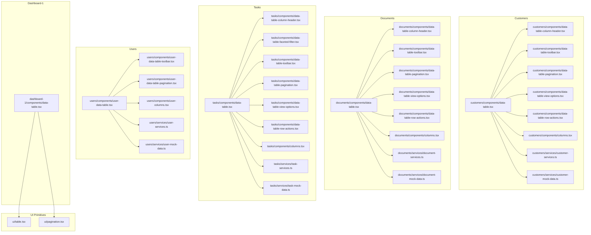
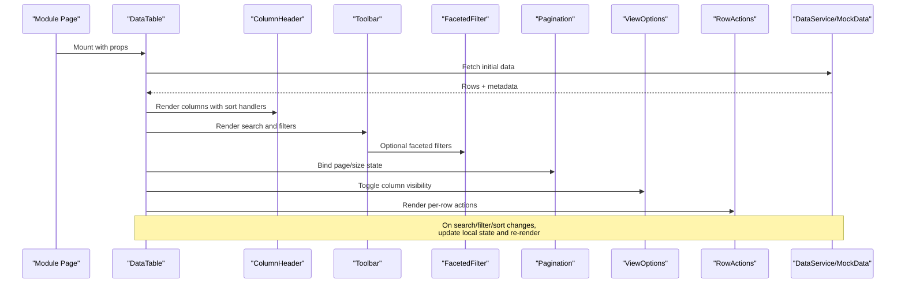
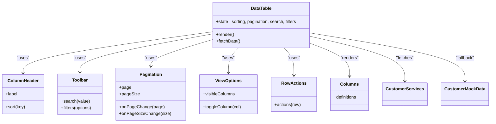
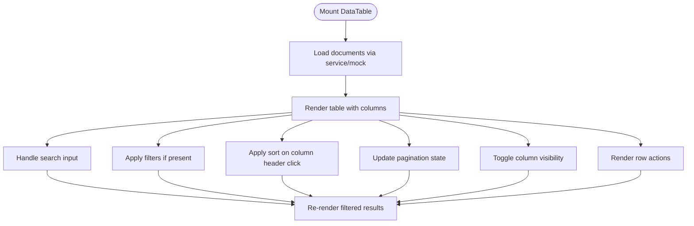
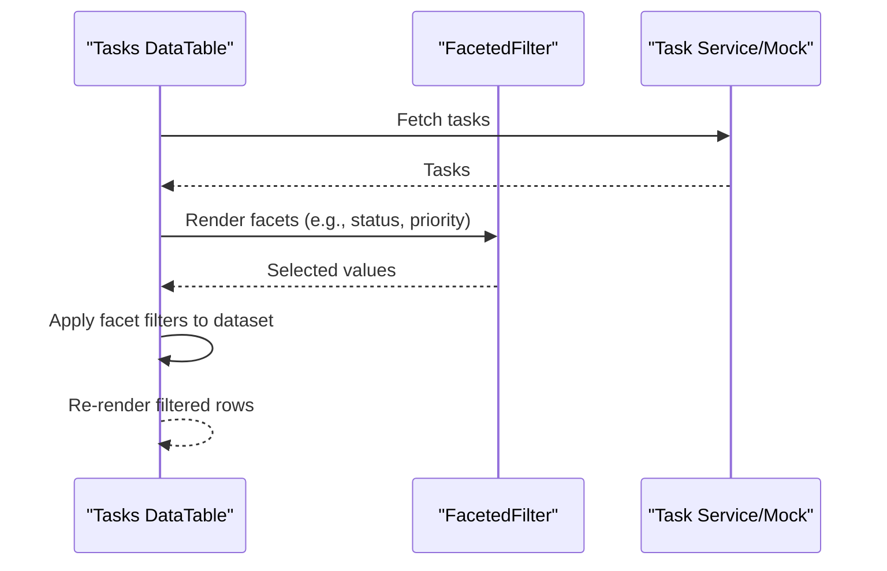
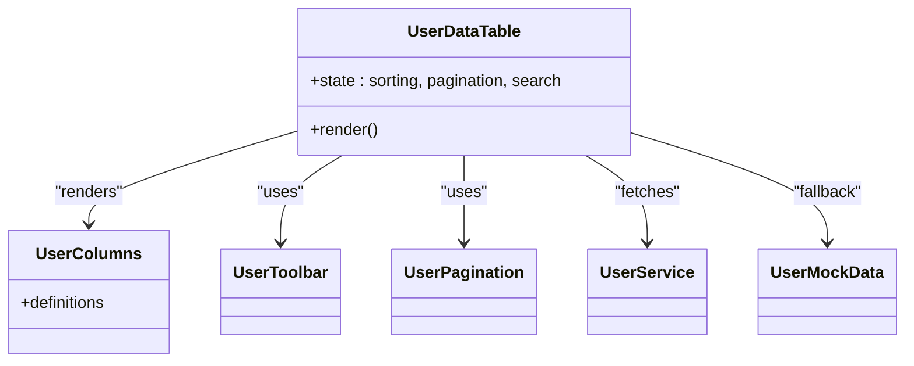
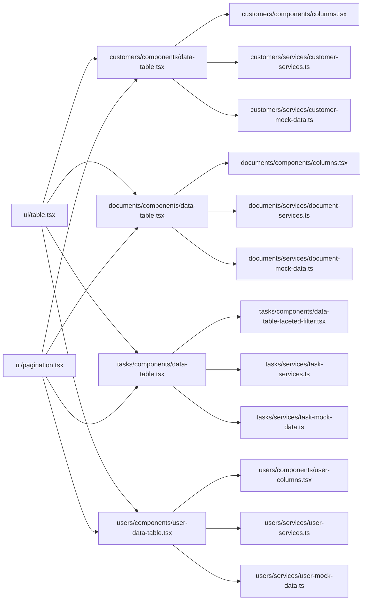

# Data Table Patterns

<cite>
**Referenced Files in This Document**
- [src/modules/customers/components/data-table.tsx](file://src/modules/customers/components/data-table.tsx)
- [src/modules/customers/components/data-table-column-header.tsx](file://src/modules/customers/components/data-table-column-header.tsx)
- [src/modules/customers/components/data-table-toolbar.tsx](file://src/modules/customers/components/data-table-toolbar.tsx)
- [src/modules/customers/components/data-table-pagination.tsx](file://src/modules/customers/components/data-table-pagination.tsx)
- [src/modules/customers/components/data-table-view-options.tsx](file://src/modules/customers/components/data-table-view-options.tsx)
- [src/modules/customers/components/data-table-row-actions.tsx](file://src/modules/customers/components/data-table-row-actions.tsx)
- [src/modules/customers/components/columns.tsx](file://src/modules/customers/components/columns.tsx)
- [src/modules/customers/services/customer-services.ts](file://src/modules/customers/services/customer-services.ts)
- [src/modules/customers/services/customer-mock-data.ts](file://src/modules/customers/services/customer-mock-data.ts)
- [src/modules/customers/services/types/customer-types.ts](file://src/modules/customers/services/types/customer-types.ts)
- [src/modules/documents/components/data-table.tsx](file://src/modules/documents/components/data-table.tsx)
- [src/modules/documents/components/data-table-column-header.tsx](file://src/modules/documents/components/data-table-column-header.tsx)
- [src/modules/documents/components/data-table-toolbar.tsx](file://src/modules/documents/components/data-table-toolbar.tsx)
- [src/modules/documents/components/data-table-pagination.tsx](file://src/modules/documents/components/data-table-pagination.tsx)
- [src/modules/documents/components/data-table-view-options.tsx](file://src/modules/documents/components/data-table-view-options.tsx)
- [src/modules/documents/components/data-table-row-actions.tsx](file://src/modules/documents/components/data-table-row-actions.tsx)
- [src/modules/documents/components/columns.tsx](file://src/modules/documents/components/columns.tsx)
- [src/modules/documents/services/document-services.ts](file://src/modules/documents/services/document-services.ts)
- [src/modules/documents/services/document-mock-data.ts](file://src/modules/documents/services/document-mock-data.ts)
- [src/modules/tasks/components/data-table.tsx](file://src/modules/tasks/components/data-table.tsx)
- [src/modules/tasks/components/data-table-column-header.tsx](file://src/modules/tasks/components/data-table-column-header.tsx)
- [src/modules/tasks/components/data-table-faceted-filter.tsx](file://src/modules/tasks/components/data-table-faceted-filter.tsx)
- [src/modules/tasks/components/data-table-toolbar.tsx](file://src/modules/tasks/components/data-table-toolbar.tsx)
- [src/modules/tasks/components/data-table-pagination.tsx](file://src/modules/tasks/components/data-table-pagination.tsx)
- [src/modules/tasks/components/data-table-view-options.tsx](file://src/modules/tasks/components/data-table-view-options.tsx)
- [src/modules/tasks/components/data-table-row-actions.tsx](file://src/modules/tasks/components/data-table-row-actions.tsx)
- [src/modules/tasks/components/columns.tsx](file://src/modules/tasks/components/columns.tsx)
- [src/modules/tasks/services/task-services.ts](file://src/modules/tasks/services/task-services.ts)
- [src/modules/tasks/services/task-mock-data.ts](file://src/modules/tasks/services/task-mock-data.ts)
- [src/modules/users/components/user-data-table.tsx](file://src/modules/users/components/user-data-table.tsx)
- [src/modules/users/components/user-data-table-toolbar.tsx](file://src/modules/users/components/user-data-table-toolbar.tsx)
- [src/modules/users/components/user-data-table-pagination.tsx](file://src/modules/users/components/user-data-table-pagination.tsx)
- [src/modules/users/components/user-columns.tsx](file://src/modules/users/components/user-columns.tsx)
- [src/modules/users/services/user-services.ts](file://src/modules/users/services/user-services.ts)
- [src/modules/users/services/user-mock-data.ts](file://src/modules/users/services/user-mock-data.ts)
- [src/modules/dashboard-1/components/data-table.tsx](file://src/modules/dashboard-1/components/data-table.tsx)
- [src/ui/table.tsx](file://src/ui/table.tsx)
- [src/ui/pagination.tsx](file://src/ui/pagination.tsx)
</cite>

## Table of Contents
1. [Introduction](#introduction)
2. [Project Structure](#project-structure)
3. [Core Components](#core-components)
4. [Architecture Overview](#architecture-overview)
5. [Detailed Component Analysis](#detailed-component-analysis)
6. [Dependency Analysis](#dependency-analysis)
7. [Performance Considerations](#performance-considerations)
8. [Troubleshooting Guide](#troubleshooting-guide)
9. [Conclusion](#conclusion)
10. [Appendices](#appendices)

## Introduction
This document defines reusable data table patterns used across modules in the application. It covers common components such as sortable column headers, a toolbar with search and filters, pagination controls, view options for column visibility, and row actions. It also explains shared patterns for data fetching, state management, and performance optimization, along with guidance for customization, complex filtering, interactivity, accessibility, responsive design, and integration with different data sources.

## Project Structure
Data tables are implemented consistently across multiple modules: customers, documents, tasks, users, and dashboard-1. Each module typically includes:
- A main table component that orchestrates state and rendering
- Column definitions and header components
- Toolbar with search and filters
- Pagination control
- View options to toggle column visibility
- Row actions (e.g., edit, delete)
- Services and mock data for data fetching

**Diagram sources**
- [src/modules/customers/components/data-table.tsx](file://src/modules/customers/components/data-table.tsx)
- [src/modules/customers/components/data-table-column-header.tsx](file://src/modules/customers/components/data-table-column-header.tsx)
- [src/modules/customers/components/data-table-toolbar.tsx](file://src/modules/customers/components/data-table-toolbar.tsx)
- [src/modules/customers/components/data-table-pagination.tsx](file://src/modules/customers/components/data-table-pagination.tsx)
- [src/modules/customers/components/data-table-view-options.tsx](file://src/modules/customers/components/data-table-view-options.tsx)
- [src/modules/customers/components/data-table-row-actions.tsx](file://src/modules/customers/components/data-table-row-actions.tsx)
- [src/modules/customers/components/columns.tsx](file://src/modules/customers/components/columns.tsx)
- [src/modules/customers/services/customer-services.ts](file://src/modules/customers/services/customer-services.ts)
- [src/modules/customers/services/customer-mock-data.ts](file://src/modules/customers/services/customer-mock-data.ts)
- [src/modules/documents/components/data-table.tsx](file://src/modules/documents/components/data-table.tsx)
- [src/modules/documents/components/data-table-column-header.tsx](file://src/modules/documents/components/data-table-column-header.tsx)
- [src/modules/documents/components/data-table-toolbar.tsx](file://src/modules/documents/components/data-table-toolbar.tsx)
- [src/modules/documents/components/data-table-pagination.tsx](file://src/modules/documents/components/data-table-pagination.tsx)
- [src/modules/documents/components/data-table-view-options.tsx](file://src/modules/documents/components/data-table-view-options.tsx)
- [src/modules/documents/components/data-table-row-actions.tsx](file://src/modules/documents/components/data-table-row-actions.tsx)
- [src/modules/documents/components/columns.tsx](file://src/modules/documents/components/columns.tsx)
- [src/modules/documents/services/document-services.ts](file://src/modules/documents/services/document-services.ts)
- [src/modules/documents/services/document-mock-data.ts](file://src/modules/documents/services/document-mock-data.ts)
- [src/modules/tasks/components/data-table.tsx](file://src/modules/tasks/components/data-table.tsx)
- [src/modules/tasks/components/data-table-column-header.tsx](file://src/modules/tasks/components/data-table-column-header.tsx)
- [src/modules/tasks/components/data-table-faceted-filter.tsx](file://src/modules/tasks/components/data-table-faceted-filter.tsx)
- [src/modules/tasks/components/data-table-toolbar.tsx](file://src/modules/tasks/components/data-table-toolbar.tsx)
- [src/modules/tasks/components/data-table-pagination.tsx](file://src/modules/tasks/components/data-table-pagination.tsx)
- [src/modules/tasks/components/data-table-view-options.tsx](file://src/modules/tasks/components/data-table-view-options.tsx)
- [src/modules/tasks/components/data-table-row-actions.tsx](file://src/modules/tasks/components/data-table-row-actions.tsx)
- [src/modules/tasks/components/columns.tsx](file://src/modules/tasks/components/columns.tsx)
- [src/modules/tasks/services/task-services.ts](file://src/modules/tasks/services/task-services.ts)
- [src/modules/tasks/services/task-mock-data.ts](file://src/modules/tasks/services/task-mock-data.ts)
- [src/modules/users/components/user-data-table.tsx](file://src/modules/users/components/user-data-table.tsx)
- [src/modules/users/components/user-data-table-toolbar.tsx](file://src/modules/users/components/user-data-table-toolbar.tsx)
- [src/modules/users/components/user-data-table-pagination.tsx](file://src/modules/users/components/user-data-table-pagination.tsx)
- [src/modules/users/components/user-columns.tsx](file://src/modules/users/components/user-columns.tsx)
- [src/modules/users/services/user-services.ts](file://src/modules/users/services/user-services.ts)
- [src/modules/users/services/user-mock-data.ts](file://src/modules/users/services/user-mock-data.ts)
- [src/modules/dashboard-1/components/data-table.tsx](file://src/modules/dashboard-1/components/data-table.tsx)
- [src/ui/table.tsx](file://src/ui/table.tsx)
- [src/ui/pagination.tsx](file://src/ui/pagination.tsx)

**Section sources**
- [src/modules/customers/components/data-table.tsx](file://src/modules/customers/components/data-table.tsx)
- [src/modules/documents/components/data-table.tsx](file://src/modules/documents/components/data-table.tsx)
- [src/modules/tasks/components/data-table.tsx](file://src/modules/tasks/components/data-table.tsx)
- [src/modules/users/components/user-data-table.tsx](file://src/modules/users/components/user-data-table.tsx)
- [src/modules/dashboard-1/components/data-table.tsx](file://src/modules/dashboard-1/components/data-table.tsx)

## Core Components
The following components form the core reusable data table pattern:
- Main table component: manages local state (sorting, pagination, search, filters), renders the table, toolbar, pagination, and delegates row rendering to column definitions.
- Column header: provides sorting controls and accessible labels.
- Toolbar: contains search input and filter controls; may include faceted filters.
- Pagination: page size selection and navigation.
- View options: toggles column visibility.
- Row actions: per-row interactive actions (edit, delete, etc.).

These components are composed together in each module’s table implementation. The main table component typically:
- Holds state for sorting, pagination, search, and filters
- Calls a service or uses mock data to fetch rows
- Applies client-side transformations when needed (filtering, sorting)
- Renders the UI using primitive table and pagination components

**Section sources**
- [src/modules/customers/components/data-table.tsx](file://src/modules/customers/components/data-table.tsx)
- [src/modules/customers/components/data-table-column-header.tsx](file://src/modules/customers/components/data-table-column-header.tsx)
- [src/modules/customers/components/data-table-toolbar.tsx](file://src/modules/customers/components/data-table-toolbar.tsx)
- [src/modules/customers/components/data-table-pagination.tsx](file://src/modules/customers/components/data-table-pagination.tsx)
- [src/modules/customers/components/data-table-view-options.tsx](file://src/modules/customers/components/data-table-view-options.tsx)
- [src/modules/customers/components/data-table-row-actions.tsx](file://src/modules/customers/components/data-table-row-actions.tsx)
- [src/modules/documents/components/data-table.tsx](file://src/modules/documents/components/data-table.tsx)
- [src/modules/tasks/components/data-table.tsx](file://src/modules/tasks/components/data-table.tsx)
- [src/modules/users/components/user-data-table.tsx](file://src/modules/users/components/user-data-table.tsx)

## Architecture Overview
The data table architecture follows a consistent composition pattern:
- Module-level table component composes primitives and feature components
- Column definitions encapsulate cell renderers and sort metadata
- Toolbar integrates search and filters, including faceted filters where applicable
- Pagination is a separate component bound to table state
- View options manage column visibility
- Row actions provide contextual interactions
- Services and mock data supply records

**Diagram sources**
- [src/modules/customers/components/data-table.tsx](file://src/modules/customers/components/data-table.tsx)
- [src/modules/customers/components/data-table-column-header.tsx](file://src/modules/customers/components/data-table-column-header.tsx)
- [src/modules/customers/components/data-table-toolbar.tsx](file://src/modules/customers/components/data-table-toolbar.tsx)
- [src/modules/customers/components/data-table-pagination.tsx](file://src/modules/customers/components/data-table-pagination.tsx)
- [src/modules/customers/components/data-table-view-options.tsx](file://src/modules/customers/components/data-table-view-options.tsx)
- [src/modules/customers/components/data-table-row-actions.tsx](file://src/modules/customers/components/data-table-row-actions.tsx)
- [src/modules/tasks/components/data-table-faceted-filter.tsx](file://src/modules/tasks/components/data-table-faceted-filter.tsx)
- [src/modules/customers/services/customer-services.ts](file://src/modules/customers/services/customer-services.ts)
- [src/modules/customers/services/customer-mock-data.ts](file://src/modules/customers/services/customer-mock-data.ts)

## Detailed Component Analysis

### Customers Module Data Table
- Main table coordinates state and renders all features.
- Column header supports sorting and accessible labels.
- Toolbar includes search and optional filters.
- Pagination handles page navigation and size selection.
- View options allow toggling column visibility.
- Row actions provide per-row operations.
- Columns define cell renderers and sort keys.
- Services and mock data supply customer records.

**Diagram sources**
- [src/modules/customers/components/data-table.tsx](file://src/modules/customers/components/data-table.tsx)
- [src/modules/customers/components/data-table-column-header.tsx](file://src/modules/customers/components/data-table-column-header.tsx)
- [src/modules/customers/components/data-table-toolbar.tsx](file://src/modules/customers/components/data-table-toolbar.tsx)
- [src/modules/customers/components/data-table-pagination.tsx](file://src/modules/customers/components/data-table-pagination.tsx)
- [src/modules/customers/components/data-table-view-options.tsx](file://src/modules/customers/components/data-table-view-options.tsx)
- [src/modules/customers/components/data-table-row-actions.tsx](file://src/modules/customers/components/data-table-row-actions.tsx)
- [src/modules/customers/components/columns.tsx](file://src/modules/customers/components/columns.tsx)
- [src/modules/customers/services/customer-services.ts](file://src/modules/customers/services/customer-services.ts)
- [src/modules/customers/services/customer-mock-data.ts](file://src/modules/customers/services/customer-mock-data.ts)

**Section sources**
- [src/modules/customers/components/data-table.tsx](file://src/modules/customers/components/data-table.tsx)
- [src/modules/customers/components/data-table-column-header.tsx](file://src/modules/customers/components/data-table-column-header.tsx)
- [src/modules/customers/components/data-table-toolbar.tsx](file://src/modules/customers/components/data-table-toolbar.tsx)
- [src/modules/customers/components/data-table-pagination.tsx](file://src/modules/customers/components/data-table-pagination.tsx)
- [src/modules/customers/components/data-table-view-options.tsx](file://src/modules/customers/components/data-table-view-options.tsx)
- [src/modules/customers/components/data-table-row-actions.tsx](file://src/modules/customers/components/data-table-row-actions.tsx)
- [src/modules/customers/components/columns.tsx](file://src/modules/customers/components/columns.tsx)
- [src/modules/customers/services/customer-services.ts](file://src/modules/customers/services/customer-services.ts)
- [src/modules/customers/services/customer-mock-data.ts](file://src/modules/customers/services/customer-mock-data.ts)

### Documents Module Data Table
- Mirrors the customers pattern with its own column definitions and services.
- Includes toolbar, pagination, view options, and row actions.
- Uses document-specific services and mock data.

**Diagram sources**
- [src/modules/documents/components/data-table.tsx](file://src/modules/documents/components/data-table.tsx)
- [src/modules/documents/components/data-table-column-header.tsx](file://src/modules/documents/components/data-table-column-header.tsx)
- [src/modules/documents/components/data-table-toolbar.tsx](file://src/modules/documents/components/data-table-toolbar.tsx)
- [src/modules/documents/components/data-table-pagination.tsx](file://src/modules/documents/components/data-table-pagination.tsx)
- [src/modules/documents/components/data-table-view-options.tsx](file://src/modules/documents/components/data-table-view-options.tsx)
- [src/modules/documents/components/data-table-row-actions.tsx](file://src/modules/documents/components/data-table-row-actions.tsx)
- [src/modules/documents/components/columns.tsx](file://src/modules/documents/components/columns.tsx)
- [src/modules/documents/services/document-services.ts](file://src/modules/documents/services/document-services.ts)
- [src/modules/documents/services/document-mock-data.ts](file://src/modules/documents/services/document-mock-data.ts)

**Section sources**
- [src/modules/documents/components/data-table.tsx](file://src/modules/documents/components/data-table.tsx)
- [src/modules/documents/components/data-table-column-header.tsx](file://src/modules/documents/components/data-table-column-header.tsx)
- [src/modules/documents/components/data-table-toolbar.tsx](file://src/modules/documents/components/data-table-toolbar.tsx)
- [src/modules/documents/components/data-table-pagination.tsx](file://src/modules/documents/components/data-table-pagination.tsx)
- [src/modules/documents/components/data-table-view-options.tsx](file://src/modules/documents/components/data-table-view-options.tsx)
- [src/modules/documents/components/data-table-row-actions.tsx](file://src/modules/documents/components/data-table-row-actions.tsx)
- [src/modules/documents/components/columns.tsx](file://src/modules/documents/components/columns.tsx)
- [src/modules/documents/services/document-services.ts](file://src/modules/documents/services/document-services.ts)
- [src/modules/documents/services/document-mock-data.ts](file://src/modules/documents/services/document-mock-data.ts)

### Tasks Module Data Table with Faceted Filters
- Extends the base pattern by adding faceted filters for multi-select filtering.
- Faceted filter component integrates into the toolbar and updates table state.
- Services and mock data supply task records.

**Diagram sources**
- [src/modules/tasks/components/data-table.tsx](file://src/modules/tasks/components/data-table.tsx)
- [src/modules/tasks/components/data-table-faceted-filter.tsx](file://src/modules/tasks/components/data-table-faceted-filter.tsx)
- [src/modules/tasks/components/data-table-toolbar.tsx](file://src/modules/tasks/components/data-table-toolbar.tsx)
- [src/modules/tasks/services/task-services.ts](file://src/modules/tasks/services/task-services.ts)
- [src/modules/tasks/services/task-mock-data.ts](file://src/modules/tasks/services/task-mock-data.ts)

**Section sources**
- [src/modules/tasks/components/data-table.tsx](file://src/modules/tasks/components/data-table.tsx)
- [src/modules/tasks/components/data-table-faceted-filter.tsx](file://src/modules/tasks/components/data-table-faceted-filter.tsx)
- [src/modules/tasks/components/data-table-toolbar.tsx](file://src/modules/tasks/components/data-table-toolbar.tsx)
- [src/modules/tasks/services/task-services.ts](file://src/modules/tasks/services/task-services.ts)
- [src/modules/tasks/services/task-mock-data.ts](file://src/modules/tasks/services/task-mock-data.ts)

### Users Module Data Table
- Provides a tailored table for user management with specific columns and actions.
- Integrates toolbar and pagination components.
- Uses user services and mock data.

**Diagram sources**
- [src/modules/users/components/user-data-table.tsx](file://src/modules/users/components/user-data-table.tsx)
- [src/modules/users/components/user-data-table-toolbar.tsx](file://src/modules/users/components/user-data-table-toolbar.tsx)
- [src/modules/users/components/user-data-table-pagination.tsx](file://src/modules/users/components/user-data-table-pagination.tsx)
- [src/modules/users/components/user-columns.tsx](file://src/modules/users/components/user-columns.tsx)
- [src/modules/users/services/user-services.ts](file://src/modules/users/services/user-services.ts)
- [src/modules/users/services/user-mock-data.ts](file://src/modules/users/services/user-mock-data.ts)

**Section sources**
- [src/modules/users/components/user-data-table.tsx](file://src/modules/users/components/user-data-table.tsx)
- [src/modules/users/components/user-data-table-toolbar.tsx](file://src/modules/users/components/user-data-table-toolbar.tsx)
- [src/modules/users/components/user-data-table-pagination.tsx](file://src/modules/users/components/user-data-table-pagination.tsx)
- [src/modules/users/components/user-columns.tsx](file://src/modules/users/components/user-columns.tsx)
- [src/modules/users/services/user-services.ts](file://src/modules/users/services/user-services.ts)
- [src/modules/users/services/user-mock-data.ts](file://src/modules/users/services/user-mock-data.ts)

### Dashboard-1 Data Table
- Demonstrates usage of primitive table and pagination components directly within a dashboard context.
- Serves as a minimal example of integrating UI primitives.

**Section sources**
- [src/modules/dashboard-1/components/data-table.tsx](file://src/modules/dashboard-1/components/data-table.tsx)
- [src/ui/table.tsx](file://src/ui/table.tsx)
- [src/ui/pagination.tsx](file://src/ui/pagination.tsx)

## Dependency Analysis
The data table components depend on:
- UI primitives for table structure and pagination
- Module-specific services and mock data for content
- Column definitions for rendering cells and handling sort keys
- Toolbar and filter components for user interaction
- View options and row actions for advanced behaviors

**Diagram sources**
- [src/ui/table.tsx](file://src/ui/table.tsx)
- [src/ui/pagination.tsx](file://src/ui/pagination.tsx)
- [src/modules/customers/components/data-table.tsx](file://src/modules/customers/components/data-table.tsx)
- [src/modules/customers/components/columns.tsx](file://src/modules/customers/components/columns.tsx)
- [src/modules/customers/services/customer-services.ts](file://src/modules/customers/services/customer-services.ts)
- [src/modules/customers/services/customer-mock-data.ts](file://src/modules/customers/services/customer-mock-data.ts)
- [src/modules/documents/components/data-table.tsx](file://src/modules/documents/components/data-table.tsx)
- [src/modules/documents/components/columns.tsx](file://src/modules/documents/components/columns.tsx)
- [src/modules/documents/services/document-services.ts](file://src/modules/documents/services/document-services.ts)
- [src/modules/documents/services/document-mock-data.ts](file://src/modules/documents/services/document-mock-data.ts)
- [src/modules/tasks/components/data-table.tsx](file://src/modules/tasks/components/data-table.tsx)
- [src/modules/tasks/components/data-table-faceted-filter.tsx](file://src/modules/tasks/components/data-table-faceted-filter.tsx)
- [src/modules/tasks/services/task-services.ts](file://src/modules/tasks/services/task-services.ts)
- [src/modules/tasks/services/task-mock-data.ts](file://src/modules/tasks/services/task-mock-data.ts)
- [src/modules/users/components/user-data-table.tsx](file://src/modules/users/components/user-data-table.tsx)
- [src/modules/users/components/user-columns.tsx](file://src/modules/users/components/user-columns.tsx)
- [src/modules/users/services/user-services.ts](file://src/modules/users/services/user-services.ts)
- [src/modules/users/services/user-mock-data.ts](file://src/modules/users/services/user-mock-data.ts)

**Section sources**
- [src/ui/table.tsx](file://src/ui/table.tsx)
- [src/ui/pagination.tsx](file://src/ui/pagination.tsx)
- [src/modules/customers/components/data-table.tsx](file://src/modules/customers/components/data-table.tsx)
- [src/modules/documents/components/data-table.tsx](file://src/modules/documents/components/data-table.tsx)
- [src/modules/tasks/components/data-table.tsx](file://src/modules/tasks/components/data-table.tsx)
- [src/modules/users/components/user-data-table.tsx](file://src/modules/users/components/user-data-table.tsx)

## Performance Considerations
- Prefer server-side pagination, sorting, and filtering for large datasets to reduce client-side processing.
- Use memoization for expensive column renderers and computed values.
- Debounce search inputs to limit frequent re-renders and network calls.
- Avoid unnecessary re-renders by keeping stable references for callbacks and configuration objects.
- Keep column definitions static and outside component bodies when possible.
- Limit the number of simultaneously visible columns to improve rendering performance.
- Use virtualization for very long lists if client-side rendering becomes a bottleneck.

[No sources needed since this section provides general guidance]

## Troubleshooting Guide
Common issues and resolutions:
- Sorting not updating: Ensure column headers pass correct sort keys and handlers update table state.
- Filters not applied: Verify filter state is correctly merged into the dataset before rendering.
- Pagination mismatch: Confirm page size and current page are synchronized with displayed rows.
- Missing columns: Check view options state and ensure column visibility toggles update the rendered set.
- Row actions not triggering: Validate event handlers are bound to the correct row identifiers.
- Accessibility warnings: Add appropriate aria attributes to headers, buttons, and inputs; ensure keyboard navigation works.

**Section sources**
- [src/modules/customers/components/data-table-column-header.tsx](file://src/modules/customers/components/data-table-column-header.tsx)
- [src/modules/customers/components/data-table-toolbar.tsx](file://src/modules/customers/components/data-table-toolbar.tsx)
- [src/modules/customers/components/data-table-pagination.tsx](file://src/modules/customers/components/data-table-pagination.tsx)
- [src/modules/customers/components/data-table-view-options.tsx](file://src/modules/customers/components/data-table-view-options.tsx)
- [src/modules/customers/components/data-table-row-actions.tsx](file://src/modules/customers/components/data-table-row-actions.tsx)
- [src/modules/tasks/components/data-table-faceted-filter.tsx](file://src/modules/tasks/components/data-table-faceted-filter.tsx)

## Conclusion
The application implements a consistent, modular data table pattern across multiple domains. By composing a main table component with column headers, toolbar, pagination, view options, and row actions, teams can quickly build rich, accessible, and performant tables. Faceted filters and robust state management enable complex use cases while maintaining clarity and reuse.

[No sources needed since this section summarizes without analyzing specific files]

## Appendices

### Customizing Table Behavior
- Change default sort order by initializing sort state in the table component.
- Add new filters by extending the toolbar and integrating them into the dataset transformation pipeline.
- Introduce custom row actions by defining action items in the row actions component and wiring up handlers.

**Section sources**
- [src/modules/customers/components/data-table.tsx](file://src/modules/customers/components/data-table.tsx)
- [src/modules/customers/components/data-table-toolbar.tsx](file://src/modules/customers/components/data-table-toolbar.tsx)
- [src/modules/customers/components/data-table-row-actions.tsx](file://src/modules/customers/components/data-table-row-actions.tsx)

### Implementing Complex Filters
- Use faceted filters for multi-select scenarios, combining selections with existing search and sort logic.
- Persist filter state in URL query parameters for shareable links and browser history support.

**Section sources**
- [src/modules/tasks/components/data-table-faceted-filter.tsx](file://src/modules/tasks/components/data-table-faceted-filter.tsx)
- [src/modules/tasks/components/data-table-toolbar.tsx](file://src/modules/tasks/components/data-table-toolbar.tsx)

### Adding Interactive Elements
- Embed inline editors or quick actions in cells via column definitions.
- Provide tooltips and confirmations for destructive actions.

**Section sources**
- [src/modules/customers/components/columns.tsx](file://src/modules/customers/components/columns.tsx)
- [src/modules/customers/components/data-table-row-actions.tsx](file://src/modules/customers/components/data-table-row-actions.tsx)

### Accessibility Features
- Ensure headers have descriptive labels and roles.
- Provide keyboard shortcuts for sorting and pagination.
- Use ARIA attributes for dynamic content updates and live regions for feedback.

**Section sources**
- [src/modules/customers/components/data-table-column-header.tsx](file://src/modules/customers/components/data-table-column-header.tsx)
- [src/ui/pagination.tsx](file://src/ui/pagination.tsx)

### Responsive Design Patterns
- Collapse less critical columns on small screens.
- Use horizontal scrolling with sticky headers for wide tables.
- Adjust pagination controls for touch-friendly interactions.

**Section sources**
- [src/ui/table.tsx](file://src/ui/table.tsx)
- [src/ui/pagination.tsx](file://src/ui/pagination.tsx)

### Integration with Different Data Sources
- Replace mock data with API calls in the service layer.
- Normalize response shapes to match expected record types.
- Handle loading and error states gracefully in the table component.

**Section sources**
- [src/modules/customers/services/customer-services.ts](file://src/modules/customers/services/customer-services.ts)
- [src/modules/customers/services/customer-mock-data.ts](file://src/modules/customers/services/customer-mock-data.ts)
- [src/modules/documents/services/document-services.ts](file://src/modules/documents/services/document-services.ts)
- [src/modules/documents/services/document-mock-data.ts](file://src/modules/documents/services/document-mock-data.ts)
- [src/modules/tasks/services/task-services.ts](file://src/modules/tasks/services/task-services.ts)
- [src/modules/tasks/services/task-mock-data.ts](file://src/modules/tasks/services/task-mock-data.ts)
- [src/modules/users/services/user-services.ts](file://src/modules/users/services/user-services.ts)
- [src/modules/users/services/user-mock-data.ts](file://src/modules/users/services/user-mock-data.ts)