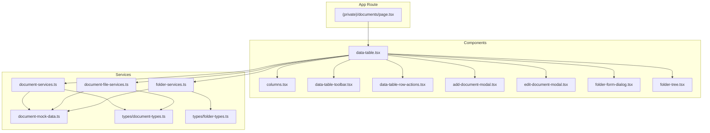
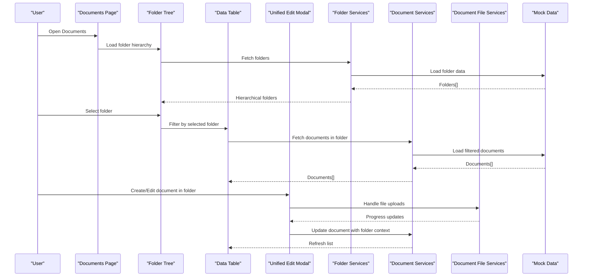
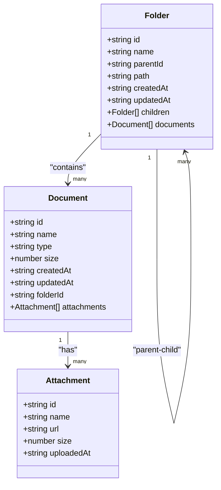
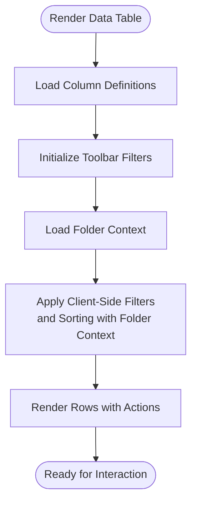
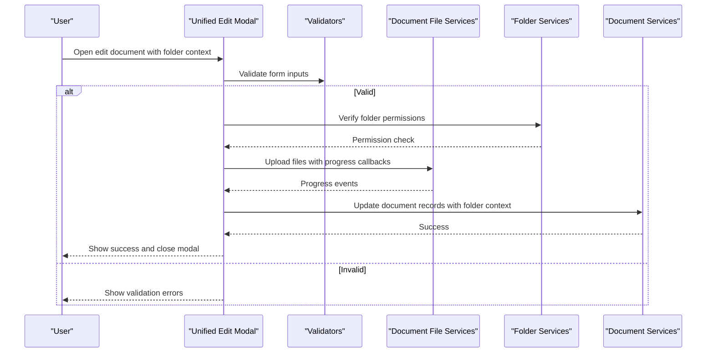
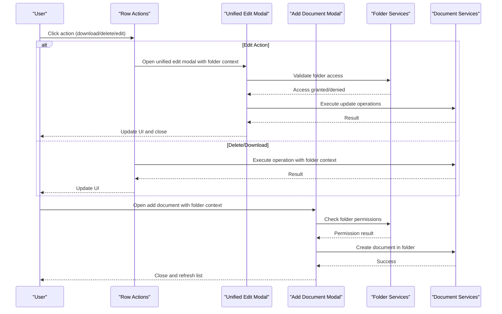
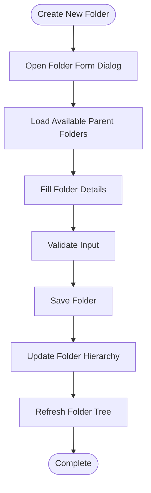
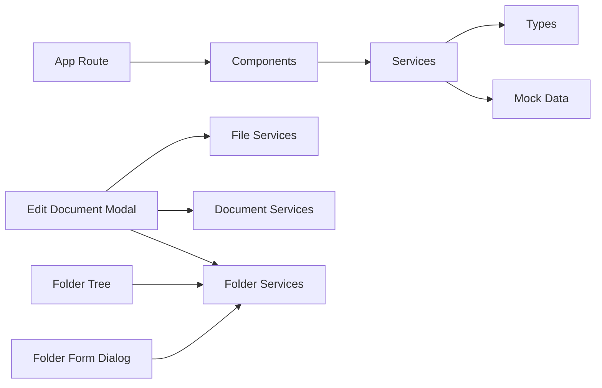

# Document Management

<cite>
**Referenced Files in This Document**
- [page.tsx](file://src/app/(private)/documents/page.tsx)
- [components/data-table.tsx](file://src/modules/documents/components/data-table.tsx)
- [components/columns.tsx](file://src/modules/documents/components/columns.tsx)
- [components/data-table-toolbar.tsx](file://src/modules/documents/components/data-table-toolbar.tsx)
- [components/data-table-row-actions.tsx](file://src/modules/documents/components/data-table-row-actions.tsx)
- [components/add-document-modal.tsx](file://src/modules/documents/components/add-document-modal.tsx)
- [components/edit-document-modal.tsx](file://src/modules/documents/components/edit-document-modal.tsx)
- [components/folder-form-dialog.tsx](file://src/modules/documents/components/folder-form-dialog.tsx)
- [components/folder-tree.tsx](file://src/modules/documents/components/folder-tree.tsx)
- [services/document-services.ts](file://src/modules/documents/services/document-services.ts)
- [services/document-file-services.ts](file://src/modules/documents/services/document-file-services.ts)
- [services/folder-services.ts](file://src/modules/documents/services/folder-services.ts)
- [services/document-mock-data.ts](file://src/modules/documents/services/document-mock-data.ts)
- [services/types/document-types.ts](file://src/modules/documents/services/types/document-types.ts)
- [services/types/folder-types.ts](file://src/modules/documents/services/types/folder-types.ts)
</cite>

## Update Summary
**Changes Made**
- Added comprehensive folder management system with hierarchical navigation capabilities
- Introduced new folder services and folder form dialogs for folder CRUD operations
- Enhanced document components to support folder-based organization and filtering
- Updated data table implementation with folder-aware filtering and navigation
- Integrated folder tree component for visual hierarchical folder browsing
- Extended document types to include folder relationships and metadata

## Table of Contents
1. [Introduction](#introduction)
2. [Project Structure](#project-structure)
3. [Core Components](#core-components)
4. [Architecture Overview](#architecture-overview)
5. [Detailed Component Analysis](#detailed-component-analysis)
6. [Folder Management System](#folder-management-system)
7. [Dependency Analysis](#dependency-analysis)
8. [Performance Considerations](#performance-considerations)
9. [Troubleshooting Guide](#troubleshooting-guide)
10. [Conclusion](#conclusion)
11. [Appendices](#appendices)

## Introduction
This document provides comprehensive documentation for the Document Management module with enhanced folder management capabilities. The module now supports hierarchical folder organization, allowing users to create, navigate, and manage documents within a structured folder hierarchy. It covers the data model, unified document editing functionality, folder-based organization, and the document-specific data table features such as filtering by file type, sorting by size, and preview capabilities. The recent addition of the folder management system significantly enhances document organization with hierarchical navigation, folder creation workflows, and folder-aware document filtering.

## Project Structure
The Document Management module is organized under src/modules/documents with clear separation between UI components, services, and the new folder management functionality:
- components: Data table, toolbar, row actions, modals including unified edit-document-modal and new folder management components
- services: Types, mock data, and service functions for documents, files, and folders
- app route: The page that renders the document management interface with folder navigation

**Diagram sources**
- [page.tsx](file://src/app/(private)/documents/page.tsx)
- [components/data-table.tsx](file://src/modules/documents/components/data-table.tsx)
- [components/folder-form-dialog.tsx](file://src/modules/documents/components/folder-form-dialog.tsx)
- [components/folder-tree.tsx](file://src/modules/documents/components/folder-tree.tsx)
- [services/folder-services.ts](file://src/modules/documents/services/folder-services.ts)
- [services/types/folder-types.ts](file://src/modules/documents/services/types/folder-types.ts)

**Section sources**
- [page.tsx](file://src/app/(private)/documents/page.tsx)
- [components/data-table.tsx](file://src/modules/documents/components/data-table.tsx)
- [services/folder-services.ts](file://src/modules/documents/services/folder-services.ts)

## Core Components
- Document data table: Provides pagination, sorting, filtering, and selection for documents with folder-aware capabilities.
- Columns definition: Defines columns including name, type, size, date, and actions with folder context.
- Toolbar: Offers search, filters (including file type and folder), and view options.
- Row actions: Actions like download, delete, and manage attachments with folder support.
- Add document modal: Creates new document entries with folder assignment.
- Unified edit-document-modal: A comprehensive component that consolidates document editing, file uploads, and attachment management.
- **New** Folder form dialog: Handles folder creation and editing with validation and parent folder selection.
- **New** Folder tree: Visual hierarchical navigation component for browsing folder structure.
- Services: Encapsulate data operations for documents, files, and folders with typed contracts.

Key responsibilities:
- Data table orchestrates state and delegates to columns, toolbar, and row actions with folder context.
- Unified edit-document-modal handles all document editing operations including file uploads and attachment management.
- **New** Folder management components provide hierarchical navigation and folder CRUD operations.
- Services abstract data access for documents, files, and folders, using types for contracts.

**Section sources**
- [components/data-table.tsx](file://src/modules/documents/components/data-table.tsx)
- [components/folder-form-dialog.tsx](file://src/modules/documents/components/folder-form-dialog.tsx)
- [components/folder-tree.tsx](file://src/modules/documents/components/folder-tree.tsx)
- [services/folder-services.ts](file://src/modules/documents/services/folder-services.ts)

## Architecture Overview
The module follows a layered architecture with enhanced folder management capabilities:
- Presentation layer: React components render the UI and handle user interactions with folder context.
- Service layer: Functions implement business logic for documents, files, and folders, using typed models.
- Data source: Mock data or external APIs are consumed via services with folder hierarchy support.

**Diagram sources**
- [page.tsx](file://src/app/(private)/documents/page.tsx)
- [components/folder-tree.tsx](file://src/modules/documents/components/folder-tree.tsx)
- [components/data-table.tsx](file://src/modules/documents/components/data-table.tsx)
- [components/edit-document-modal.tsx](file://src/modules/documents/components/edit-document-modal.tsx)
- [services/folder-services.ts](file://src/modules/documents/services/folder-services.ts)
- [services/document-services.ts](file://src/modules/documents/services/document-services.ts)
- [services/document-file-services.ts](file://src/modules/documents/services/document-file-services.ts)

## Detailed Component Analysis

### Document Data Model
The data model defines the shape of documents, folders, and related entities used across the module. It includes fields for identifiers, metadata (name, type, size, dates), folder relationships, and attachments.

- Types are centralized in the types directory to ensure consistency across components and services.
- **New** Folder types define hierarchical relationships with parent-child associations.
- Services consume these types to enforce contracts when reading/writing data.

**Diagram sources**
- [services/types/document-types.ts](file://src/modules/documents/services/types/document-types.ts)
- [services/types/folder-types.ts](file://src/modules/documents/services/types/folder-types.ts)

**Section sources**
- [services/types/document-types.ts](file://src/modules/documents/services/types/document-types.ts)
- [services/types/folder-types.ts](file://src/modules/documents/services/types/folder-types.ts)

### Data Table Implementation
The data table component integrates:
- Column definitions for rendering and sorting with folder context
- Toolbar for search, faceted filters (file type and folder), and view options
- Pagination and selection controls with folder-aware filtering
- Row actions for operations like download, delete, and folder management

Features:
- File type filtering: Faceted filter allows selecting allowed extensions.
- Size sorting: Numeric sort on file size column.
- Preview capability: Column action can open previews based on file type.
- **New** Folder filtering: Filter documents by selected folder or folder hierarchy.
- **New** Path-based navigation: Navigate through folder hierarchy to view contained documents.

**Diagram sources**
- [components/data-table.tsx](file://src/modules/documents/components/data-table.tsx)
- [components/columns.tsx](file://src/modules/documents/components/columns.tsx)
- [components/data-table-toolbar.tsx](file://src/modules/documents/components/data-table-toolbar.tsx)

**Section sources**
- [components/data-table.tsx](file://src/modules/documents/components/data-table.tsx)
- [components/columns.tsx](file://src/modules/documents/components/columns.tsx)
- [components/data-table-toolbar.tsx](file://src/modules/documents/components/data-table-toolbar.tsx)

### Unified Edit Document Modal
The unified edit-document-modal is a comprehensive component that replaces the previous separate attachment and upload components. This consolidation provides:

- **Integrated Workflow**: Single interface for all document editing operations including file uploads, attachment management, and metadata editing with folder context.
- **Enhanced Error Handling**: Centralized error management with user-friendly feedback messages.
- **Streamlined UX**: Reduced navigation complexity by eliminating multiple dialog transitions.
- **Improved State Management**: Better coordination between file uploads, validation, and document updates with folder assignment.

Key features:
- Multi-file upload with drag-and-drop support
- Real-time progress tracking and validation
- Attachment listing and management within the same modal
- Comprehensive error handling with retry mechanisms
- Form validation with immediate feedback
- Responsive design for various screen sizes
- **New** Folder assignment during document creation/editing

**Diagram sources**
- [components/edit-document-modal.tsx](file://src/modules/documents/components/edit-document-modal.tsx)
- [services/document-file-services.ts](file://src/modules/documents/services/document-file-services.ts)
- [services/document-services.ts](file://src/modules/documents/services/document-services.ts)
- [services/folder-services.ts](file://src/modules/documents/services/folder-services.ts)

**Section sources**
- [components/edit-document-modal.tsx](file://src/modules/documents/components/edit-document-modal.tsx)
- [services/document-file-services.ts](file://src/modules/documents/services/document-file-services.ts)
- [services/document-services.ts](file://src/modules/documents/services/document-services.ts)
- [services/folder-services.ts](file://src/modules/documents/services/folder-services.ts)

### Row Actions and Modals
Row actions provide quick operations with folder context:
- Download, delete, and manage attachments through the unified modal
- Add document modal creates new entries with folder assignment
- These integrate with services to update state with folder relationships

**Diagram sources**
- [components/data-table-row-actions.tsx](file://src/modules/documents/components/data-table-row-actions.tsx)
- [components/add-document-modal.tsx](file://src/modules/documents/components/add-document-modal.tsx)
- [components/edit-document-modal.tsx](file://src/modules/documents/components/edit-document-modal.tsx)
- [services/document-services.ts](file://src/modules/documents/services/document-services.ts)
- [services/folder-services.ts](file://src/modules/documents/services/folder-services.ts)

**Section sources**
- [components/data-table-row-actions.tsx](file://src/modules/documents/components/data-table-row-actions.tsx)
- [components/add-document-modal.tsx](file://src/modules/documents/components/add-document-modal.tsx)
- [components/edit-document-modal.tsx](file://src/modules/documents/components/edit-document-modal.tsx)
- [services/document-services.ts](file://src/modules/documents/services/document-services.ts)
- [services/folder-services.ts](file://src/modules/documents/services/folder-services.ts)

## Folder Management System
**New** The folder management system provides comprehensive hierarchical organization capabilities for documents:

### Folder Form Dialog
Handles folder creation and editing operations:
- Parent folder selection for hierarchical structure
- Folder name validation and uniqueness checking
- Path generation and conflict resolution
- Permission validation for folder operations

### Folder Tree Component
Visual hierarchical navigation for folder browsing:
- Expandable/collapsible folder nodes
- Visual indicators for folder depth and relationships
- Click-to-navigate functionality
- Drag-and-drop support for reorganization (future enhancement)

### Folder Services
Backend operations for folder management:
- CRUD operations for folders with parent-child relationships
- Path resolution and validation
- Permission checking for folder access
- Bulk operations for folder hierarchy management

**Diagram sources**
- [components/folder-form-dialog.tsx](file://src/modules/documents/components/folder-form-dialog.tsx)
- [components/folder-tree.tsx](file://src/modules/documents/components/folder-tree.tsx)
- [services/folder-services.ts](file://src/modules/documents/services/folder-services.ts)

**Section sources**
- [components/folder-form-dialog.tsx](file://src/modules/documents/components/folder-form-dialog.tsx)
- [components/folder-tree.tsx](file://src/modules/documents/components/folder-tree.tsx)
- [services/folder-services.ts](file://src/modules/documents/services/folder-services.ts)
- [services/types/folder-types.ts](file://src/modules/documents/services/types/folder-types.ts)

## Dependency Analysis
The module exhibits low coupling between components and services with enhanced folder management:
- Components depend on services through function calls rather than direct imports of data stores.
- Types define contracts, reducing ambiguity and improving maintainability.
- Mock data serves as a placeholder for backend integration.
- **New** Folder services provide independent folder management functionality while maintaining integration with document services.

**Diagram sources**
- [components/data-table.tsx](file://src/modules/documents/components/data-table.tsx)
- [components/edit-document-modal.tsx](file://src/modules/documents/components/edit-document-modal.tsx)
- [components/folder-form-dialog.tsx](file://src/modules/documents/components/folder-form-dialog.tsx)
- [components/folder-tree.tsx](file://src/modules/documents/components/folder-tree.tsx)
- [services/document-services.ts](file://src/modules/documents/services/document-services.ts)
- [services/document-file-services.ts](file://src/modules/documents/services/document-file-services.ts)
- [services/folder-services.ts](file://src/modules/documents/services/folder-services.ts)
- [services/document-mock-data.ts](file://src/modules/documents/services/document-mock-data.ts)
- [services/types/document-types.ts](file://src/modules/documents/services/types/document-types.ts)
- [services/types/folder-types.ts](file://src/modules/documents/services/types/folder-types.ts)

**Section sources**
- [services/document-services.ts](file://src/modules/documents/services/document-services.ts)
- [services/document-file-services.ts](file://src/modules/documents/services/document-file-services.ts)
- [services/folder-services.ts](file://src/modules/documents/services/folder-services.ts)
- [services/document-mock-data.ts](file://src/modules/documents/services/document-mock-data.ts)
- [services/types/document-types.ts](file://src/modules/documents/services/types/document-types.ts)
- [services/types/folder-types.ts](file://src/modules/documents/services/types/folder-types.ts)

## Performance Considerations
- Client-side filtering and sorting: Keep datasets manageable; consider server-side pagination for large lists.
- Debounce search input to reduce re-renders.
- Unified modal optimization: The consolidated edit-document-modal reduces component mounting/unmounting overhead and improves state management efficiency.
- Use virtualization for long lists if needed.
- Optimize image previews with thumbnails and compression.
- Centralized error handling: Reduces redundant validation checks and improves overall responsiveness.
- **New** Folder hierarchy caching: Cache folder structures to minimize repeated API calls for folder navigation.
- **New** Lazy loading for folder trees: Load folder hierarchies incrementally to improve initial load performance.

## Troubleshooting Guide
Common issues and resolutions:
- Upload failures: Check network requests and error responses from file services. Ensure progress callbacks are wired correctly.
- Validation errors: Verify file type and size constraints in validators.
- Filtering not working: Confirm filter values match column data types and formats.
- Sorting anomalies: Ensure numeric sorting for size and consistent date formats.
- Unified modal issues: Check error handling logs in the edit-document-modal for comprehensive error details and user feedback messages.
- State synchronization: Verify that document updates from the unified modal properly trigger table refreshes and state updates.
- **New** Folder navigation issues: Check folder hierarchy data integrity and parent-child relationship consistency.
- **New** Folder permission errors: Verify user permissions for folder operations and access control configurations.
- **New** Path resolution conflicts: Ensure unique folder paths and proper conflict resolution strategies.

**Section sources**
- [components/edit-document-modal.tsx](file://src/modules/documents/components/edit-document-modal.tsx)
- [services/document-file-services.ts](file://src/modules/documents/services/document-file-services.ts)
- [components/data-table-toolbar.tsx](file://src/modules/documents/components/data-table-toolbar.tsx)
- [services/folder-services.ts](file://src/modules/documents/services/folder-services.ts)

## Conclusion
The Document Management module provides a robust foundation for managing documents with enhanced folder-based organization capabilities. The recent addition of the comprehensive folder management system significantly improves document organization with hierarchical navigation, folder creation workflows, and folder-aware document filtering. The unified edit-document-modal continues to provide streamlined editing experiences, while the new folder components offer intuitive hierarchical browsing and management. By following the service layer patterns and security guidelines outlined here, teams can extend the module with custom validators, storage backends, versioning strategies, and advanced folder organization features safely and efficiently.

## Appendices

### Implementing Custom File Validators
- Define validation rules for file type and size in the upload flow within the unified modal.
- Integrate validators into the edit-document-modal before invoking file services.
- Surface user-friendly error messages for invalid inputs through the centralized error handling system.

**Section sources**
- [components/edit-document-modal.tsx](file://src/modules/documents/components/edit-document-modal.tsx)
- [services/document-file-services.ts](file://src/modules/documents/services/document-file-services.ts)

### Storage Integrations
- Replace mock persistence in services with real API calls.
- Handle authentication tokens and error retries at the service layer.
- Normalize responses to match the typed data model.
- Ensure the unified modal properly handles storage integration changes without requiring UI modifications.
- **New** Extend folder services to support hierarchical storage backends with path resolution.

**Section sources**
- [services/document-services.ts](file://src/modules/documents/services/document-services.ts)
- [services/document-file-services.ts](file://src/modules/documents/services/document-file-services.ts)
- [services/folder-services.ts](file://src/modules/documents/services/folder-services.ts)

### Document Versioning
- Extend the data model to include version fields and history.
- Implement create-version operations in services.
- Provide UI to switch versions and compare changes within the unified modal interface.
- **New** Support folder-level versioning for organizational changes.

**Section sources**
- [services/types/document-types.ts](file://src/modules/documents/services/types/document-types.ts)
- [services/document-services.ts](file://src/modules/documents/services/document-services.ts)
- [services/types/folder-types.ts](file://src/modules/documents/services/types/folder-types.ts)

### Security Considerations for File Handling
- Enforce allowlists for file types and maximum sizes.
- Sanitize filenames and validate content types server-side.
- Use secure URLs and signed links for downloads.
- Apply access controls per document and attachment.
- Log and monitor suspicious upload attempts.
- The unified modal centralizes security validation and provides consistent error reporting for security-related issues.
- **New** Implement folder-level access controls and permission validation.
- **New** Validate folder path traversal to prevent security vulnerabilities.

**Section sources**
- [components/edit-document-modal.tsx](file://src/modules/documents/components/edit-document-modal.tsx)
- [services/document-file-services.ts](file://src/modules/documents/services/document-file-services.ts)
- [services/folder-services.ts](file://src/modules/documents/services/folder-services.ts)

### Folder Management Best Practices
- Design folder hierarchies with logical grouping and naming conventions.
- Implement proper permission inheritance from parent folders.
- Provide clear visual indicators for folder depth and relationships.
- Support bulk operations for folder management tasks.
- Implement folder backup and restore capabilities.
- Monitor folder usage statistics for capacity planning.

**Section sources**
- [components/folder-form-dialog.tsx](file://src/modules/documents/components/folder-form-dialog.tsx)
- [components/folder-tree.tsx](file://src/modules/documents/components/folder-tree.tsx)
- [services/folder-services.ts](file://src/modules/documents/services/folder-services.ts)
- [services/types/folder-types.ts](file://src/modules/documents/services/types/folder-types.ts)