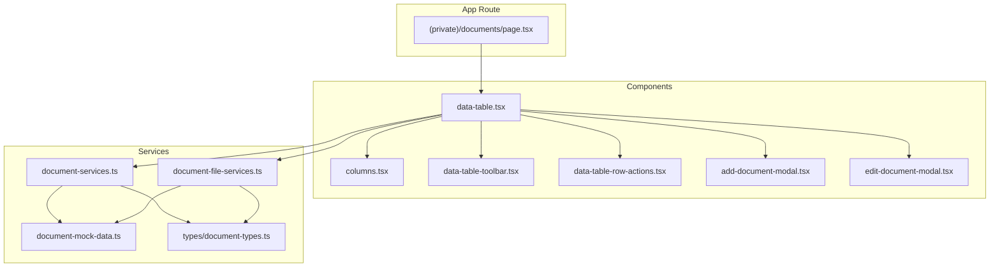
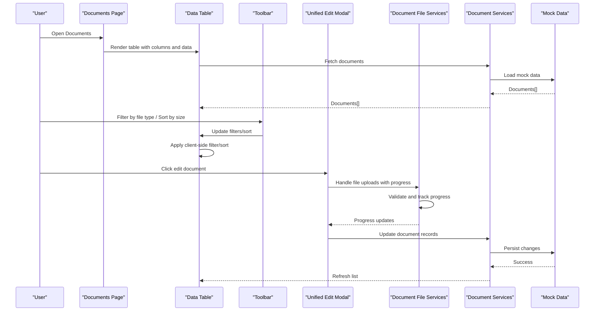
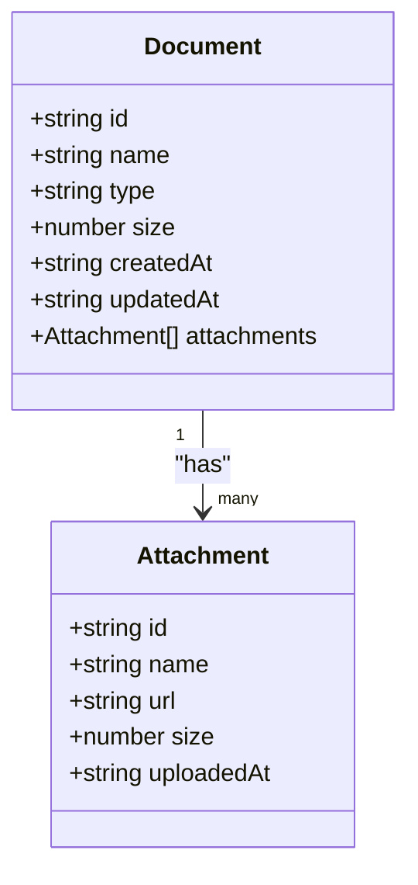
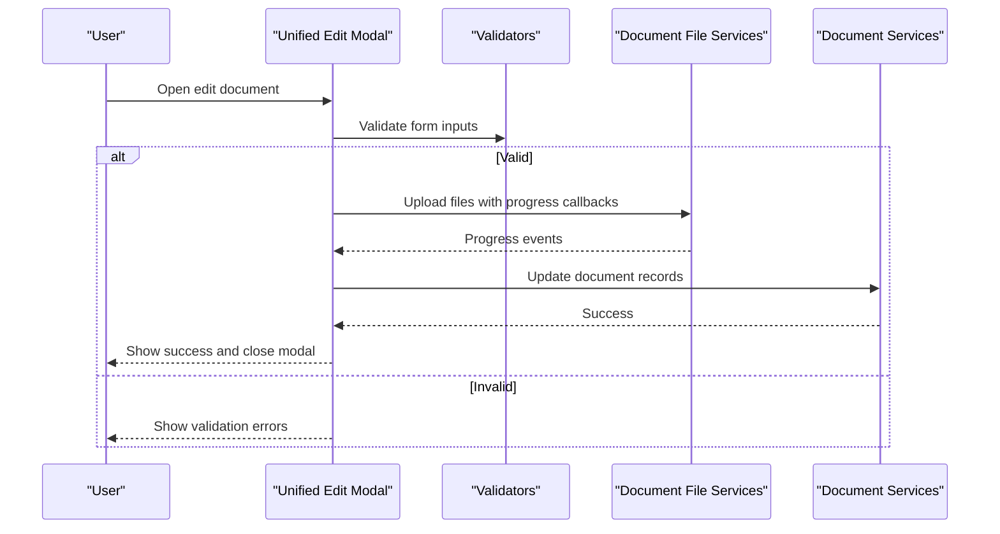
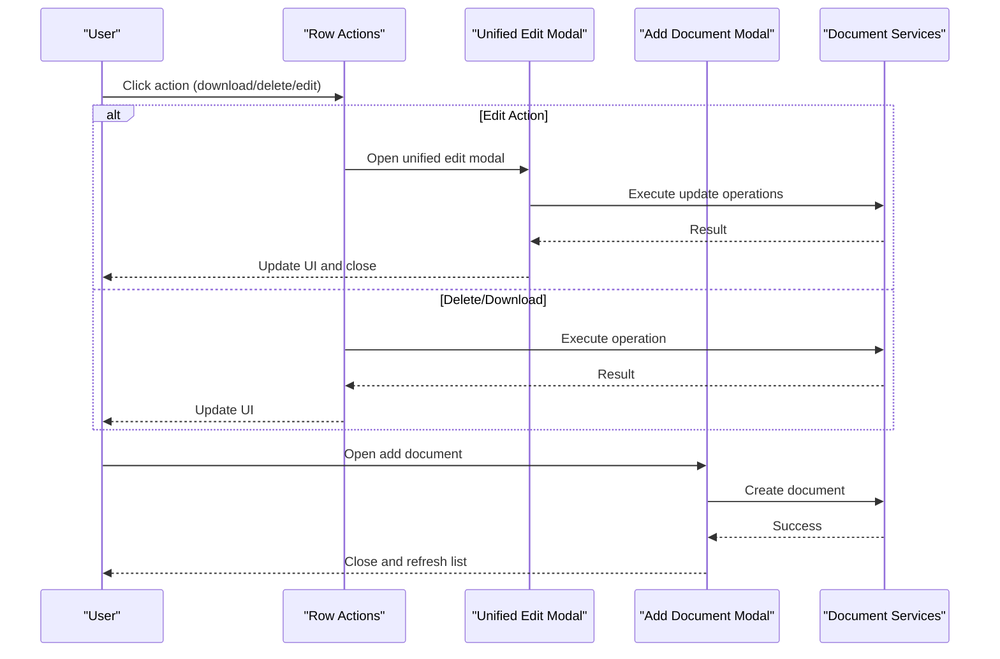
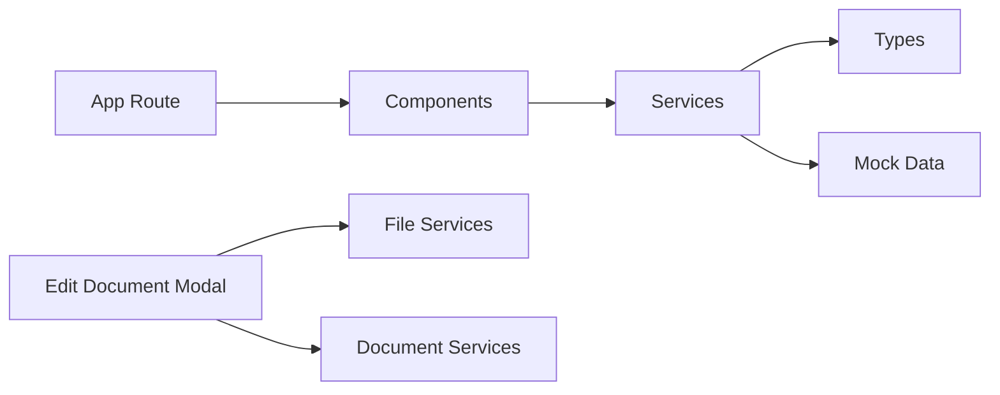

# Document Management

<cite>
**Referenced Files in This Document**
- [page.tsx](file://src/app/(private)/documents/page.tsx)
- [components/data-table.tsx](file://src/modules/documents/components/data-table.tsx)
- [components/columns.tsx](file://src/modules/documents/components/columns.tsx)
- [components/data-table-toolbar.tsx](file://src/modules/documents/components/data-table-toolbar.tsx)
- [components/data-table-row-actions.tsx](file://src/modules/documents/components/data-table-row-actions.tsx)
- [components/add-document-modal.tsx](file://src/modules/documents/components/add-document-modal.tsx)
- [components/edit-document-modal.tsx](file://src/modules/documents/components/edit-document-modal.tsx)
- [services/document-services.ts](file://src/modules/documents/services/document-services.ts)
- [services/document-file-services.ts](file://src/modules/documents/services/document-file-services.ts)
- [services/document-mock-data.ts](file://src/modules/documents/services/document-mock-data.ts)
- [services/types/document-types.ts](file://src/modules/documents/services/types/document-types.ts)
</cite>

## Update Summary
**Changes Made**
- Updated core components section to reflect the new unified edit-document-modal architecture
- Revised file upload and attachment management sections to document the consolidated workflow
- Enhanced detailed component analysis with focus on the new 630-line unified modal
- Updated architecture diagrams to show the streamlined editing workflow
- Removed references to legacy separate components (document-attachments, upload-files-dialog)
- Added comprehensive error handling and user feedback documentation

## Table of Contents
1. [Introduction](#introduction)
2. [Project Structure](#project-structure)
3. [Core Components](#core-components)
4. [Architecture Overview](#architecture-overview)
5. [Detailed Component Analysis](#detailed-component-analysis)
6. [Dependency Analysis](#dependency-analysis)
7. [Performance Considerations](#performance-considerations)
8. [Troubleshooting Guide](#troubleshooting-guide)
9. [Conclusion](#conclusion)
10. [Appendices](#appendices)

## Introduction
This document provides comprehensive documentation for the Document Management module. It covers the data model, unified document editing functionality, and the document-specific data table features such as filtering by file type, sorting by size, and preview capabilities. The module has been significantly restructured with a new unified edit-document-modal that consolidates previously separate attachment and upload components into a streamlined editing workflow with enhanced error handling and improved user feedback.

## Project Structure
The Document Management module is organized under src/modules/documents with a clear separation between UI components and services:
- components: Data table, toolbar, row actions, modals including the new unified edit-document-modal
- services: Types, mock data, and service functions for documents and files
- app route: The page that renders the document management interface

**Diagram sources**
- [page.tsx](file://src/app/(private)/documents/page.tsx)
- [components/data-table.tsx](file://src/modules/documents/components/data-table.tsx)
- [components/columns.tsx](file://src/modules/documents/components/columns.tsx)
- [components/data-table-toolbar.tsx](file://src/modules/documents/components/data-table-toolbar.tsx)
- [components/data-table-row-actions.tsx](file://src/modules/documents/components/data-table-row-actions.tsx)
- [components/add-document-modal.tsx](file://src/modules/documents/components/add-document-modal.tsx)
- [components/edit-document-modal.tsx](file://src/modules/documents/components/edit-document-modal.tsx)
- [services/document-services.ts](file://src/modules/documents/services/document-services.ts)
- [services/document-file-services.ts](file://src/modules/documents/services/document-file-services.ts)
- [services/document-mock-data.ts](file://src/modules/documents/services/document-mock-data.ts)
- [services/types/document-types.ts](file://src/modules/documents/services/types/document-types.ts)

**Section sources**
- [page.tsx](file://src/app/(private)/documents/page.tsx)
- [components/data-table.tsx](file://src/modules/documents/components/data-table.tsx)
- [services/document-services.ts](file://src/modules/documents/services/document-services.ts)

## Core Components
- Document data table: Provides pagination, sorting, filtering, and selection for documents.
- Columns definition: Defines columns including name, type, size, date, and actions.
- Toolbar: Offers search, filters (including file type), and view options.
- Row actions: Actions like download, delete, and manage attachments.
- Add document modal: Creates new document entries.
- **Updated** Unified edit-document-modal: A comprehensive 630-line component that consolidates document editing, file uploads, and attachment management into a single streamlined workflow with enhanced error handling and user feedback.
- Services: Encapsulate data operations and file-related logic.

Key responsibilities:
- Data table orchestrates state and delegates to columns, toolbar, and row actions.
- **Updated** The unified edit-document-modal handles all document editing operations including file uploads, attachment management, and validation within a single interface.
- Services abstract data access and file operations, using types for contracts.
- Modals encapsulate user workflows for adding and editing documents with integrated file handling.

**Section sources**
- [components/data-table.tsx](file://src/modules/documents/components/data-table.tsx)
- [components/columns.tsx](file://src/modules/documents/components/columns.tsx)
- [components/data-table-toolbar.tsx](file://src/modules/documents/components/data-table-toolbar.tsx)
- [components/data-table-row-actions.tsx](file://src/modules/documents/components/data-table-row-actions.tsx)
- [components/add-document-modal.tsx](file://src/modules/documents/components/add-document-modal.tsx)
- [components/edit-document-modal.tsx](file://src/modules/documents/components/edit-document-modal.tsx)
- [services/document-services.ts](file://src/modules/documents/services/document-services.ts)
- [services/document-file-services.ts](file://src/modules/documents/services/document-file-services.ts)
- [services/document-mock-data.ts](file://src/modules/documents/services/document-mock-data.ts)
- [services/types/document-types.ts](file://src/modules/documents/services/types/document-types.ts)

## Architecture Overview
The module follows a layered architecture with a streamlined editing workflow:
- Presentation layer: React components render the UI and handle user interactions.
- Service layer: Functions implement business logic and data access, using typed models.
- Data source: Mock data or external APIs are consumed via services.

**Diagram sources**
- [page.tsx](file://src/app/(private)/documents/page.tsx)
- [components/data-table.tsx](file://src/modules/documents/components/data-table.tsx)
- [components/data-table-toolbar.tsx](file://src/modules/documents/components/data-table-toolbar.tsx)
- [components/edit-document-modal.tsx](file://src/modules/documents/components/edit-document-modal.tsx)
- [services/document-services.ts](file://src/modules/documents/services/document-services.ts)
- [services/document-file-services.ts](file://src/modules/documents/services/document-file-services.ts)
- [services/document-mock-data.ts](file://src/modules/documents/services/document-mock-data.ts)

## Detailed Component Analysis

### Document Data Model
The data model defines the shape of documents and related entities used across the module. It includes fields for identifiers, metadata (name, type, size, dates), and relationships (e.g., attachments).

- Types are centralized in the types directory to ensure consistency across components and services.
- Services consume these types to enforce contracts when reading/writing data.

**Diagram sources**
- [services/types/document-types.ts](file://src/modules/documents/services/types/document-types.ts)

**Section sources**
- [services/types/document-types.ts](file://src/modules/documents/services/types/document-types.ts)

### Data Table Implementation
The data table component integrates:
- Column definitions for rendering and sorting
- Toolbar for search, faceted filters (file type), and view options
- Pagination and selection controls
- Row actions for operations like download and delete

Features:
- File type filtering: Faceted filter allows selecting allowed extensions.
- Size sorting: Numeric sort on file size column.
- Preview capability: Column action can open previews based on file type.

**Diagram sources**
- [components/data-table.tsx](file://src/modules/documents/components/data-table.tsx)
- [components/columns.tsx](file://src/modules/documents/components/columns.tsx)
- [components/data-table-toolbar.tsx](file://src/modules/documents/components/data-table-toolbar.tsx)

**Section sources**
- [components/data-table.tsx](file://src/modules/documents/components/data-table.tsx)
- [components/columns.tsx](file://src/modules/documents/components/columns.tsx)
- [components/data-table-toolbar.tsx](file://src/modules/documents/components/data-table-toolbar.tsx)

### Unified Edit Document Modal
**New** The unified edit-document-modal is a comprehensive 630-line component that replaces the previous separate attachment and upload components. This consolidation provides:

- **Integrated Workflow**: Single interface for all document editing operations including file uploads, attachment management, and metadata editing
- **Enhanced Error Handling**: Centralized error management with user-friendly feedback messages
- **Streamlined UX**: Reduced navigation complexity by eliminating multiple dialog transitions
- **Improved State Management**: Better coordination between file uploads, validation, and document updates

Key features:
- Multi-file upload with drag-and-drop support
- Real-time progress tracking and validation
- Attachment listing and management within the same modal
- Comprehensive error handling with retry mechanisms
- Form validation with immediate feedback
- Responsive design for various screen sizes

**Diagram sources**
- [components/edit-document-modal.tsx](file://src/modules/documents/components/edit-document-modal.tsx)
- [services/document-file-services.ts](file://src/modules/documents/services/document-file-services.ts)
- [services/document-services.ts](file://src/modules/documents/services/document-services.ts)

**Section sources**
- [components/edit-document-modal.tsx](file://src/modules/documents/components/edit-document-modal.tsx)
- [services/document-file-services.ts](file://src/modules/documents/services/document-file-services.ts)
- [services/document-services.ts](file://src/modules/documents/services/document-services.ts)

### Row Actions and Modals
Row actions provide quick operations:
- Download, delete, and manage attachments through the unified modal
- Add document modal creates new entries
- These integrate with services to update state

**Diagram sources**
- [components/data-table-row-actions.tsx](file://src/modules/documents/components/data-table-row-actions.tsx)
- [components/add-document-modal.tsx](file://src/modules/documents/components/add-document-modal.tsx)
- [components/edit-document-modal.tsx](file://src/modules/documents/components/edit-document-modal.tsx)
- [services/document-services.ts](file://src/modules/documents/services/document-services.ts)

**Section sources**
- [components/data-table-row-actions.tsx](file://src/modules/documents/components/data-table-row-actions.tsx)
- [components/add-document-modal.tsx](file://src/modules/documents/components/add-document-modal.tsx)
- [components/edit-document-modal.tsx](file://src/modules/documents/components/edit-document-modal.tsx)
- [services/document-services.ts](file://src/modules/documents/services/document-services.ts)

## Dependency Analysis
The module exhibits low coupling between components and services:
- Components depend on services through function calls rather than direct imports of data stores.
- Types define contracts, reducing ambiguity and improving maintainability.
- Mock data serves as a placeholder for backend integration.
- **Updated** The unified edit-document-modal reduces component dependencies by consolidating functionality that was previously spread across multiple components.

**Diagram sources**
- [components/data-table.tsx](file://src/modules/documents/components/data-table.tsx)
- [components/edit-document-modal.tsx](file://src/modules/documents/components/edit-document-modal.tsx)
- [services/document-services.ts](file://src/modules/documents/services/document-services.ts)
- [services/document-file-services.ts](file://src/modules/documents/services/document-file-services.ts)
- [services/document-mock-data.ts](file://src/modules/documents/services/document-mock-data.ts)
- [services/types/document-types.ts](file://src/modules/documents/services/types/document-types.ts)

**Section sources**
- [services/document-services.ts](file://src/modules/documents/services/document-services.ts)
- [services/document-file-services.ts](file://src/modules/documents/services/document-file-services.ts)
- [services/document-mock-data.ts](file://src/modules/documents/services/document-mock-data.ts)
- [services/types/document-types.ts](file://src/modules/documents/services/types/document-types.ts)

## Performance Considerations
- Client-side filtering and sorting: Keep datasets manageable; consider server-side pagination for large lists.
- Debounce search input to reduce re-renders.
- **Updated** Unified modal optimization: The consolidated edit-document-modal reduces component mounting/unmounting overhead and improves state management efficiency.
- Use virtualization for long lists if needed.
- Optimize image previews with thumbnails and compression.
- **Updated** Error handling performance: Centralized error management in the unified modal reduces redundant validation checks and improves overall responsiveness.

## Troubleshooting Guide
Common issues and resolutions:
- Upload failures: Check network requests and error responses from file services. Ensure progress callbacks are wired correctly.
- Validation errors: Verify file type and size constraints in validators.
- Filtering not working: Confirm filter values match column data types and formats.
- Sorting anomalies: Ensure numeric sorting for size and consistent date formats.
- **Updated** Unified modal issues: Check error handling logs in the edit-document-modal for comprehensive error details and user feedback messages.
- **Updated** State synchronization: Verify that document updates from the unified modal properly trigger table refreshes and state updates.

**Section sources**
- [components/edit-document-modal.tsx](file://src/modules/documents/components/edit-document-modal.tsx)
- [services/document-file-services.ts](file://src/modules/documents/services/document-file-services.ts)
- [components/data-table-toolbar.tsx](file://src/modules/documents/components/data-table-toolbar.tsx)

## Conclusion
The Document Management module provides a robust foundation for managing documents with a clean separation of concerns. The recent restructuring with the unified edit-document-modal significantly improves the user experience by consolidating previously fragmented workflows into a single, cohesive interface. The data table offers powerful filtering and sorting capabilities, while the enhanced error handling and streamlined editing workflow provide better reliability and usability. By following the service layer patterns and security guidelines outlined here, teams can extend the module with custom validators, storage backends, and versioning strategies safely and efficiently.

## Appendices

### Implementing Custom File Validators
- Define validation rules for file type and size in the upload flow within the unified modal.
- Integrate validators into the edit-document-modal before invoking file services.
- Surface user-friendly error messages for invalid inputs through the centralized error handling system.

**Section sources**
- [components/edit-document-modal.tsx](file://src/modules/documents/components/edit-document-modal.tsx)
- [services/document-file-services.ts](file://src/modules/documents/services/document-file-services.ts)

### Storage Integrations
- Replace mock persistence in services with real API calls.
- Handle authentication tokens and error retries at the service layer.
- Normalize responses to match the typed data model.
- **Updated** Ensure the unified modal properly handles storage integration changes without requiring UI modifications.

**Section sources**
- [services/document-services.ts](file://src/modules/documents/services/document-services.ts)
- [services/document-file-services.ts](file://src/modules/documents/services/document-file-services.ts)

### Document Versioning
- Extend the data model to include version fields and history.
- Implement create-version operations in services.
- Provide UI to switch versions and compare changes within the unified modal interface.

**Section sources**
- [services/types/document-types.ts](file://src/modules/documents/services/types/document-types.ts)
- [services/document-services.ts](file://src/modules/documents/services/document-services.ts)

### Security Considerations for File Handling
- Enforce allowlists for file types and maximum sizes.
- Sanitize filenames and validate content types server-side.
- Use secure URLs and signed links for downloads.
- Apply access controls per document and attachment.
- Log and monitor suspicious upload attempts.
- **Updated** The unified modal centralizes security validation and provides consistent error reporting for security-related issues.

**Section sources**
- [components/edit-document-modal.tsx](file://src/modules/documents/components/edit-document-modal.tsx)
- [services/document-file-services.ts](file://src/modules/documents/services/document-file-services.ts)